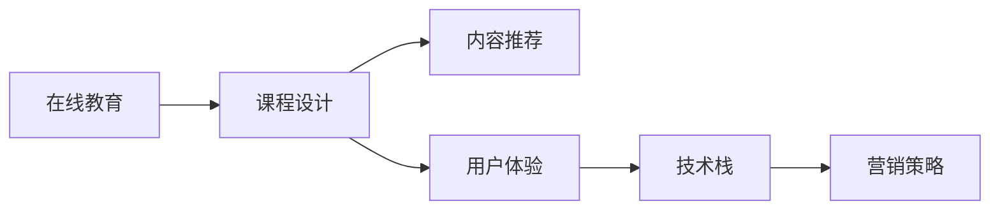

                 

# 如何打造个人知识付费线上课程

> 关键词：在线教育,知识付费,课程设计,人工智能,内容推荐,用户体验,技术栈,营销策略

## 1. 背景介绍

### 1.1 问题由来
随着信息技术的不断进步，在线教育与知识付费市场迅速崛起，成为新时代学习新知识的重要途径。然而，传统的文字课程、视频讲座等方式逐渐暴露出内容枯燥、互动性差、个性化不足等缺陷。为了解决这些问题，构建更加丰富、交互性强的线上学习平台成为当务之急。

### 1.2 问题核心关键点
本文将详细介绍如何打造一个个性化、互动性强、覆盖面广的知识付费线上课程，涵盖课程设计、内容推荐、用户体验、技术实现及营销推广等多个环节。希望通过科学合理的课程设计，结合最新的人工智能技术，为用户带来全新的学习体验，同时为课程开发者和运营者提供可行的指导思路。

## 2. 核心概念与联系

### 2.1 核心概念概述

在打造知识付费线上课程的过程中，我们需要关注几个关键概念：

- **在线教育**：以互联网为媒介，通过多媒体、互动技术为用户提供在线学习资源和平台。
- **知识付费**：用户通过支付一定费用获取深度、专业的内容，如在线课程、电子书、音频讲座等。
- **课程设计**：根据学习目标、学习者特征、教学内容等要素，科学地规划课程结构、内容和互动形式。
- **内容推荐**：基于用户的学习行为、兴趣和评价，推荐个性化内容，提升学习效果。
- **用户体验**：从课程界面、互动方式、学习效果等角度提升用户满意度和粘性。
- **技术栈**：包括前端框架、后端架构、数据库、云计算平台等技术组件的选择和实现。
- **营销策略**：如何精准定位目标用户群体，并制定有效推广策略。

### 2.2 核心概念原理和架构的 Mermaid 流程图



这个流程图展示了在线教育平台的核心架构和流程：

1. **课程设计**：是整个课程体系的基础，决定了内容的质量和结构。
2. **内容推荐**：根据用户的学习行为和兴趣推荐相关内容，提高学习效率。
3. **用户体验**：通过优化课程界面、互动方式等提升用户的整体体验。
4. **技术栈**：支撑平台稳定运行的技术基础，保障平台性能和可靠性。
5. **营销策略**：吸引用户、转化用户并增加用户留存率。

## 3. 核心算法原理 & 具体操作步骤

### 3.1 算法原理概述

打造知识付费线上课程的核心是设计和实现一个高质量的课程内容，并通过个性化推荐和良好用户体验吸引并留住用户。

1. **课程设计**：围绕学习目标，选择合适的课程内容和结构，设计互动和评估机制。
2. **内容推荐**：利用机器学习算法分析用户行为数据，提供个性化的学习路径和推荐。
3. **用户体验**：优化课程界面、互动方式、视频质量等，提升用户学习效果和满意度。
4. **技术栈**：选择合适的技术组件，搭建高效稳定的在线教育平台。
5. **营销策略**：制定合理的推广计划，吸引潜在用户并提升转化率。

### 3.2 算法步骤详解

#### 3.2.1 课程设计

1. **学习目标设定**：明确课程要解决的问题，设立具体、可衡量的学习目标。
2. **课程结构规划**：将课程分为若干模块，每个模块包含特定的知识点和技能。
3. **互动机制设计**：引入实时问答、小组讨论、在线测试等互动环节，提升用户参与度。
4. **评估机制设计**：设定期中测试、期末考试等形式，帮助用户巩固知识。

#### 3.2.2 内容推荐

1. **数据收集**：收集用户的学习行为数据，如视频观看时长、练习完成率、笔记内容等。
2. **用户画像构建**：通过聚类算法和特征提取技术，构建用户画像。
3. **推荐算法选择**：选择合适的推荐算法，如协同过滤、基于内容的推荐、深度学习等。
4. **推荐模型训练**：基于用户画像和历史数据，训练推荐模型。
5. **个性化推荐**：将推荐模型应用于实时数据，提供个性化内容推荐。

#### 3.2.3 用户体验

1. **界面设计**：采用现代化的UI设计，提高用户的操作流畅性和视觉享受。
2. **视频质量优化**：使用视频编码技术，压缩视频文件大小，提高视频播放流畅性。
3. **互动体验增强**：实现实时问答、在线讨论等功能，提升用户互动性。
4. **学习路径定制**：根据用户学习进度和兴趣，推荐适合的课程内容，提升学习效果。

#### 3.2.4 技术栈选择

1. **前端框架**：选择合适的框架如React、Vue等，提升页面加载速度和用户体验。
2. **后端架构**：设计高效的后端服务架构，使用容器化技术如Docker，提高系统的稳定性和扩展性。
3. **数据库**：使用MySQL、MongoDB等数据库存储用户数据和课程内容，确保数据安全性和可靠性。
4. **云计算平台**：选择AWS、阿里云等云平台，提供稳定的计算和存储资源。

#### 3.2.5 营销策略

1. **目标用户定位**：明确目标用户的特征，如年龄、职业、兴趣等。
2. **市场调研**：分析目标市场的竞争态势和用户需求，制定合适的市场策略。
3. **推广渠道选择**：选择合适的渠道，如搜索引擎广告、社交媒体、邮件营销等。
4. **用户转化策略**：制定合理的转化策略，提高用户购买和完成课程的可能性。
5. **用户留存策略**：通过定期提醒、奖励机制等手段提升用户留存率。

### 3.3 算法优缺点

**优点**：
1. **高效个性化推荐**：通过机器学习算法提供个性化的课程内容，提高学习效果。
2. **多样互动形式**：增加互动环节，提升用户参与度和学习体验。
3. **灵活扩展性**：采用现代化的技术栈和云平台，提升系统的扩展性和稳定性。

**缺点**：
1. **开发成本高**：课程设计、推荐系统、技术栈搭建等环节开发工作量较大。
2. **数据隐私问题**：用户数据隐私保护需得到重视，避免数据泄露风险。
3. **用户学习自主性**：依赖用户的自我管理能力，对用户行为干预有限。

### 3.4 算法应用领域

知识付费线上课程的应用领域广泛，可以应用于各行业的专业培训、职业技能提升、兴趣爱好培养等多个方面。

1. **IT技术培训**：提供软件开发、人工智能、大数据等领域的课程。
2. **医疗健康教育**：提供医学知识、健康管理等课程。
3. **语言学习**：提供多种语言学习课程，提升语言能力。
4. **生活技能培训**：提供烹饪、手工艺、健身等课程。
5. **创意与设计**：提供设计、创意写作、音乐等课程。

## 4. 数学模型和公式 & 详细讲解 & 举例说明

### 4.1 数学模型构建

设课程内容集合为 $C$，用户集合为 $U$，用户行为数据为 $D$，推荐模型为 $F$。

课程设计需要根据学习目标设定课程内容 $C$，课程内容包含若干模块 $M$，每个模块包含若干视频 $V$ 和练习 $E$。

用户行为数据 $D$ 包含用户学习行为 $B$，用户评价 $R$ 等。

推荐模型 $F$ 用于根据用户行为数据 $D$ 和用户画像 $P$，预测用户对课程内容 $C$ 的兴趣 $I$，并推荐合适的课程内容。

### 4.2 公式推导过程

**用户画像构建**：

1. **特征提取**：从用户行为数据 $D$ 中提取用户特征 $X$，如观看时长、练习完成率等。
2. **聚类算法**：使用K-means等聚类算法，将用户分为不同群体，生成用户画像 $P$。

**推荐模型训练**：

1. **相似度计算**：计算用户画像 $P$ 和课程内容 $C$ 的相似度 $S$。
2. **权重计算**：根据相似度 $S$ 和用户行为数据 $D$，计算用户对课程内容的兴趣 $I$。
3. **推荐结果生成**：根据用户兴趣 $I$ 和课程内容 $C$，生成推荐结果 $R$。

### 4.3 案例分析与讲解

**案例一：机器学习课程设计**

1. **学习目标设定**：掌握机器学习的基本概念、常用算法和应用。
2. **课程结构规划**：分为理论知识、实践项目、实战案例等模块。
3. **互动机制设计**：加入实时问答、在线讨论、小组竞赛等环节。
4. **评估机制设计**：设立期中测试、项目作业、最终考试等形式。

**案例二：推荐系统实现**

1. **数据收集**：收集用户观看视频、完成练习的时间、笔记内容等行为数据。
2. **用户画像构建**：使用K-means算法，将用户分为对机器学习兴趣高的群体、对编程感兴趣群体等。
3. **推荐算法选择**：选择协同过滤算法，根据用户画像和历史数据，生成推荐结果。
4. **推荐模型训练**：训练协同过滤模型，预测用户对课程内容的兴趣。
5. **个性化推荐**：根据推荐模型和用户兴趣，提供个性化课程推荐。

## 5. 项目实践：代码实例和详细解释说明

### 5.1 开发环境搭建

1. **环境配置**：安装Python 3.x、Node.js、Vue、React等开发环境。
2. **版本控制**：使用Git进行版本控制，管理代码变更。
3. **持续集成**：使用Jenkins等工具进行代码集成和自动化测试。

### 5.2 源代码详细实现

**前端代码实现**：

```javascript
import React from 'react';
import { Router, Route, Switch } from 'react-router-dom';

const Home = () => <h1>Welcome to our course!</h1>;
const Video = () => <h1>Watch our video content!</h1>;
const Discussion = () => <h1>Join our discussion!</h1>;

function App() {
  return (
    <Router>
      <Switch>
        <Route exact path="/" component={Home} />
        <Route path="/video" component={Video} />
        <Route path="/discussion" component={Discussion} />
      </Switch>
    </Router>
  );
}

export default App;
```

**后端代码实现**：

```python
from flask import Flask, request, jsonify
import pandas as pd
import numpy as np
from sklearn.cluster import KMeans

app = Flask(__name__)

@app.route('/recommend', methods=['POST'])
def recommend():
    data = request.json
    X = pd.DataFrame(data['features'])
    kmeans = KMeans(n_clusters=3)
    kmeans.fit(X)
    labels = kmeans.predict(X)
    return jsonify({'labels': labels.tolist()})

if __name__ == '__main__':
    app.run(debug=True)
```

### 5.3 代码解读与分析

**前端代码解析**：
1. **React组件定义**：定义了Home、Video、Discussion三个组件，分别对应课程首页、视频内容和讨论区。
2. **路由配置**：使用React Router配置路由，将不同路径映射到对应组件。

**后端代码解析**：
1. **Flask应用**：使用Flask框架搭建后端服务。
2. **数据处理**：从请求中获取特征数据，使用Pandas进行处理。
3. **聚类算法**：使用KMeans算法对特征进行聚类，生成用户画像标签。
4. **API响应**：将聚类结果转换为JSON格式，返回给前端。

**运行结果展示**：
1. **前端页面展示**：在浏览器中访问课程首页、视频内容和讨论区，展示相应内容。
2. **后端API响应**：使用Postman等工具，向/recommend路径发送JSON数据，获取聚类结果。

## 6. 实际应用场景

### 6.1 智慧医疗

智慧医疗领域对知识付费线上课程需求迫切。通过在线课程，医疗专家可以分享临床经验、最新研究成果等专业知识，提升医生和护士的专业素养。

1. **课程设计**：设立医学基础知识、常见疾病诊治、最新研究动态等课程模块。
2. **内容推荐**：根据医生阅读文章、观看视频的行为数据，推荐相关医学知识和诊治方法。
3. **用户体验**：采用多媒体和互动技术，提升医生学习效果。
4. **技术栈**：搭建高效的后端服务和前端页面，保障平台稳定运行。
5. **营销策略**：通过医院推广、学术会议等渠道吸引医生参与学习。

### 6.2 电商零售

电商零售行业也亟需知识付费线上课程，以提升员工技能和知识水平。通过在线课程，员工可以快速掌握新技能，提升工作效率。

1. **课程设计**：设立电商基础、数据分析、营销策略等课程模块。
2. **内容推荐**：根据员工学习行为数据，推荐相关技能和工具。
3. **用户体验**：通过在线测试和实际项目，检验员工学习效果。
4. **技术栈**：使用流行的电商技术栈，如MySQL、Django、Vue等。
5. **营销策略**：通过内部邮件、员工手册等渠道推广课程。

### 6.3 教育培训

教育培训领域是知识付费线上课程的重要市场。通过在线课程，学生可以自主学习，提升学习效果和知识水平。

1. **课程设计**：设立各学科的基础知识、高级课程、拓展阅读等模块。
2. **内容推荐**：根据学生学习行为数据，推荐相关课程和资料。
3. **用户体验**：通过在线讨论和实时问答，提升学生互动性。
4. **技术栈**：使用主流的教育技术栈，如LMS平台、学习管理系统。
5. **营销策略**：通过学校推广、社交媒体广告等渠道吸引学生参与学习。

### 6.4 未来应用展望

随着技术的发展和市场需求的扩大，知识付费线上课程将面临更多的创新和挑战：

1. **虚拟现实技术**：引入虚拟现实技术，提升课程的沉浸感和互动性。
2. **区块链技术**：利用区块链技术，保障用户数据隐私和课程版权。
3. **智能推荐系统**：采用更加先进的推荐算法，提升推荐精度和个性化程度。
4. **AI辅助教学**：使用AI技术自动生成课程内容，提升课程制作效率。
5. **知识图谱**：引入知识图谱技术，提升课程内容的结构化和可检索性。
6. **跨平台集成**：实现课程在不同平台上的无缝集成和同步更新。

## 7. 工具和资源推荐

### 7.1 学习资源推荐

1. **Coursera官方文档**：Coursera平台的课程设计、内容推荐、用户体验等方面的详细文档。
2. **Udemy课程设计指南**：Udemy平台的课程设计最佳实践和推荐算法。
3. **edX学习管理系统**：edX平台的学习管理系统文档和最佳实践。
4. **WoWoAI人工智能在线教育平台**：提供丰富的课程设计、推荐系统和用户体验优化教程。
5. **Kaggle竞赛数据集**：Kaggle平台上的各类课程推荐数据集，方便进行实际训练。

### 7.2 开发工具推荐

1. **React**：用于构建前端界面，支持单页面应用开发。
2. **Vue**：用于构建前端页面，支持响应式和组件化开发。
3. **Flask**：用于搭建后端服务，支持RESTful API开发。
4. **Django**：用于搭建后端服务，支持数据库管理和用户认证。
5. **MongoDB**：用于存储用户数据和课程内容，支持高扩展性。
6. **Jenkins**：用于持续集成和自动化测试，确保代码质量。

### 7.3 相关论文推荐

1. **《在线教育系统设计》**：介绍在线教育系统的架构和设计方法。
2. **《推荐系统理论与实践》**：深入解析推荐算法的原理和实现方法。
3. **《用户体验设计》**：阐述用户体验设计的核心原则和具体方法。
4. **《人工智能在教育中的应用》**：探讨AI技术在教育领域的潜在应用和前景。
5. **《知识图谱构建与应用》**：介绍知识图谱的构建方法和应用场景。

## 8. 总结：未来发展趋势与挑战

### 8.1 研究成果总结

本文详细介绍了打造知识付费线上课程的多个环节和关键点，包括课程设计、内容推荐、用户体验、技术栈选择和营销策略等。通过科学合理的课程设计，结合最新的人工智能技术，为用户带来全新的学习体验，同时为课程开发者和运营者提供可行的指导思路。

### 8.2 未来发展趋势

1. **虚拟现实技术**：通过VR/AR技术，提升课程的沉浸感和互动性。
2. **区块链技术**：利用区块链技术，保障用户数据隐私和课程版权。
3. **智能推荐系统**：采用更加先进的推荐算法，提升推荐精度和个性化程度。
4. **AI辅助教学**：使用AI技术自动生成课程内容，提升课程制作效率。
5. **知识图谱**：引入知识图谱技术，提升课程内容的结构化和可检索性。
6. **跨平台集成**：实现课程在不同平台上的无缝集成和同步更新。

### 8.3 面临的挑战

1. **开发成本高**：课程设计、推荐系统、技术栈搭建等环节开发工作量较大。
2. **数据隐私问题**：用户数据隐私保护需得到重视，避免数据泄露风险。
3. **用户学习自主性**：依赖用户的自我管理能力，对用户行为干预有限。

### 8.4 研究展望

1. **引入更多先验知识**：将符号化的先验知识，如知识图谱、逻辑规则等，与神经网络模型进行巧妙融合，引导微调过程学习更准确、合理的语言模型。
2. **结合因果分析和博弈论工具**：将因果分析方法引入微调模型，识别出模型决策的关键特征，增强输出解释的因果性和逻辑性。
3. **纳入伦理道德约束**：在模型训练目标中引入伦理导向的评估指标，过滤和惩罚有偏见、有害的输出倾向。
4. **建立模型行为的监管机制**：确保输出符合人类价值观和伦理道德，保障系统安全性。

## 9. 附录：常见问题与解答

**Q1：知识付费线上课程的开发成本高吗？**

A: 是的，课程设计、推荐系统、技术栈搭建等环节开发工作量较大，需要投入较多的人力和时间。

**Q2：如何进行用户画像构建？**

A: 通过聚类算法，从用户行为数据中提取用户特征，生成用户画像。

**Q3：推荐系统如何实现？**

A: 使用协同过滤、基于内容的推荐、深度学习等推荐算法，根据用户画像和历史数据，生成推荐结果。

**Q4：如何设置合适的学习率？**

A: 一般建议从1e-5开始调参，逐步减小学习率，直至收敛。

**Q5：如何确保课程内容的质量和结构？**

A: 通过专业讲师设计和审核，确保课程内容的准确性和结构化。

---

作者：禅与计算机程序设计艺术 / Zen and the Art of Computer Programming

