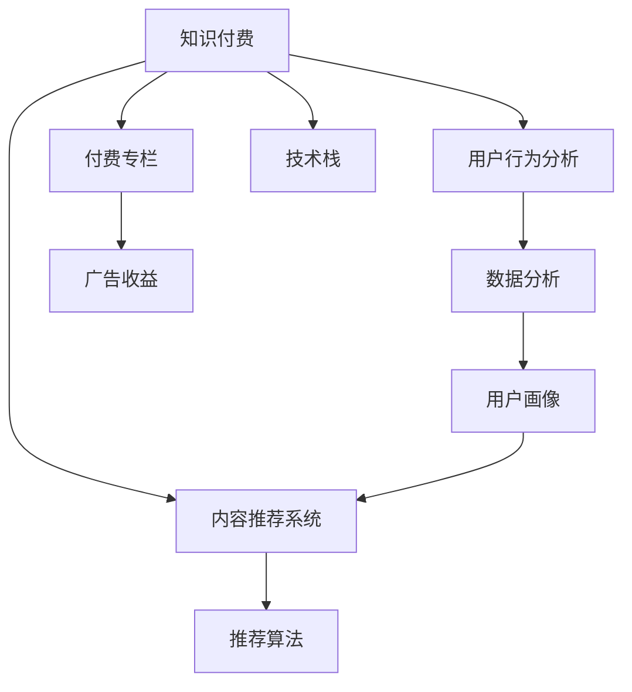

                 

# 如何打造知识付费的付费专栏

> 关键词：知识付费,付费专栏,内容推荐系统,用户行为分析,广告收益,技术栈

## 1. 背景介绍

随着互联网的普及和知识经济的兴起，越来越多的人愿意为有价值的知识内容支付费用。知识付费平台的兴起，正是这一趋势的体现。通过付费专栏，用户可以获得更加专业、深入、系统的知识内容，同时也为内容创作者提供了更好的变现渠道。然而，如何打造高质量、高吸引力的付费专栏，如何吸引和留住付费用户，如何最大化收益，成为了知识付费平台需要解决的难题。本文将从技术角度出发，介绍如何利用大数据和人工智能技术，打造知识付费的付费专栏。

## 2. 核心概念与联系

### 2.1 核心概念概述

为更好地理解知识付费付费专栏的打造过程，本节将介绍几个密切相关的核心概念：

- 知识付费：一种新兴的经济模式，用户为获取特定领域的知识和技能而支付费用，知识创作者通过内容变现。
- 付费专栏：知识创作者为付费用户提供的一组专业、系统、深入的知识内容，通常以文章、视频、音频等形式呈现。
- 内容推荐系统：利用大数据和机器学习算法，根据用户兴趣和行为，智能推荐相关内容的系统。
- 用户行为分析：通过分析用户访问、阅读、付费等行为数据，了解用户需求和偏好，指导内容创作和优化。
- 广告收益：付费专栏除了用户付费外，还可以通过在内容中插入广告、合作推广等方式获得收益。
- 技术栈：实现知识付费平台的必备技术工具，如数据库、Web框架、API开发等。

这些核心概念之间的逻辑关系可以通过以下Mermaid流程图来展示：



这个流程图展示知识付费的各个核心概念及其之间的关系：

1. 知识付费的实质是用户为获取知识而支付的费用。
2. 付费专栏是知识付费的核心产品，提供高质量的内容。
3. 内容推荐系统是提升用户满意度和留存率的重要手段。
4. 用户行为分析是优化付费专栏内容和策略的基础。
5. 广告收益是除了用户付费之外的重要收入来源。
6. 技术栈是实现知识付费平台的功能和性能的底层支撑。

这些概念共同构成了知识付费平台的核心架构，使得平台能够更好地为用户提供有价值的服务，同时提升自身盈利能力。

## 3. 核心算法原理 & 具体操作步骤
### 3.1 算法原理概述

知识付费平台的核心算法包括内容推荐、用户行为分析、广告投放等。这些算法都需要利用大数据和机器学习技术，对用户行为和内容特征进行建模和预测，以提升用户体验和平台收益。

- 内容推荐算法：利用协同过滤、基于内容的推荐、混合推荐等技术，根据用户历史行为和兴趣，智能推荐相关内容。
- 用户行为分析算法：通过用户访问、阅读、购买等行为数据，分析用户兴趣和偏好，指导内容创作和优化。
- 广告投放算法：根据用户兴趣和行为，选择和投放合适的广告，最大化广告收益。

这些算法在实现过程中，都需要利用Python、R、Scikit-learn、TensorFlow等工具和技术，进行数据预处理、特征工程、模型训练和评估等步骤。

### 3.2 算法步骤详解

本节将详细介绍知识付费平台的核心算法步骤：

**Step 1: 数据收集和预处理**
- 收集用户行为数据，如访问、点击、阅读、购买等行为记录。
- 收集内容特征数据，如文章标题、摘要、分类标签等。
- 数据清洗，去除噪声和异常数据，处理缺失值和重复记录。
- 特征工程，将原始数据转换为模型可用的特征表示，如用户兴趣、内容热度、广告效果等。

**Step 2: 模型训练和评估**
- 选择合适的推荐算法，如协同过滤、基于内容的推荐、混合推荐等。
- 使用交叉验证等方法评估模型性能，选择最优模型。
- 使用A/B测试等方法，评估模型效果，指导模型优化。

**Step 3: 广告投放和优化**
- 根据用户兴趣和行为，选择合适的广告，如展示广告、激励广告等。
- 使用CTR预测模型等技术，评估广告效果，优化投放策略。
- 采用在线学习等技术，实时调整广告投放，最大化广告收益。

**Step 4: 内容推荐和个性化**
- 利用用户历史行为和兴趣，推荐相关内容。
- 采用多臂老虎机等算法，平衡探索和利用，提升推荐效果。
- 实时更新推荐模型，根据新数据和新用户反馈，不断优化推荐策略。

**Step 5: 用户行为分析和个性化**
- 收集用户访问、阅读、购买等行为数据，构建用户画像。
- 利用聚类算法、分类算法等方法，分析用户兴趣和偏好。
- 根据用户画像，优化内容和广告投放策略，提升用户满意度和留存率。

**Step 6: 数据安全和隐私保护**
- 确保数据存储和传输的安全性，防止数据泄露和篡改。
- 遵守隐私保护法律法规，保护用户隐私数据，如GDPR等。
- 采用差分隐私等技术，保护用户个人信息，防止信息滥用。

### 3.3 算法优缺点

知识付费平台的核心算法具有以下优点：
1. 提升用户体验：通过个性化推荐，提升用户满意度和留存率。
2. 提高平台收益：通过精准广告投放和推荐，提高广告收益和用户付费率。
3. 优化内容创作：通过用户行为分析，指导内容创作和优化，提升内容质量。
4. 实时性高：利用在线学习和实时更新，不断优化推荐和广告投放策略。

同时，这些算法也存在一定的局限性：
1. 依赖数据质量：数据质量差、噪声多，会影响算法效果。
2. 模型复杂度：模型复杂度高，需要更多的计算资源和时间。
3. 隐私保护：算法涉及大量用户隐私数据，需要确保数据安全和隐私保护。
4. 算法偏见：模型可能存在偏差，导致推荐和广告投放结果不公平。
5. 技术门槛高：算法实现需要较强的数据科学和机器学习背景，对技术栈要求较高。

尽管存在这些局限性，但就目前而言，基于大数据和人工智能的推荐和分析算法，仍然是知识付费平台的核心竞争力。未来相关研究的重点在于如何进一步降低算法对数据和技术的依赖，提高算法的公平性和透明度，同时兼顾数据安全和隐私保护。

### 3.4 算法应用领域

基于大数据和人工智能的推荐和分析算法，在知识付费平台的应用已经非常广泛，涵盖以下几个主要领域：

- 内容推荐：利用协同过滤、基于内容的推荐等算法，推荐用户感兴趣的内容。
- 用户行为分析：通过行为数据分析，了解用户兴趣和偏好，优化推荐策略。
- 广告投放：根据用户兴趣和行为，投放合适的广告，提升广告收益。
- 个性化推荐：利用多臂老虎机等算法，实现个性化推荐，提升用户体验和留存率。
- 用户画像：通过聚类和分类算法，构建用户画像，指导内容创作和优化。

除了上述这些核心领域外，基于推荐和分析算法的知识付费平台还可以拓展到更多场景中，如智能客服、智能广告投放、智能营销等，为平台带来更多的商业机会。

## 4. 数学模型和公式 & 详细讲解  
### 4.1 数学模型构建

本节将使用数学语言对知识付费平台的推荐和分析算法进行更加严格的刻画。

记用户行为数据为 $D=\{(x_i, y_i)\}_{i=1}^N, x_i \in \mathbb{R}^d, y_i \in \{0,1\}$，其中 $x_i$ 表示用户行为特征向量，$y_i$ 表示用户是否产生某一行为（如访问、阅读、购买等）。

定义推荐模型为 $M:\mathcal{X} \rightarrow \mathcal{Y}$，其中 $\mathcal{X}$ 为输入空间，$\mathcal{Y}$ 为输出空间，$M$ 为推荐模型。假设推荐模型为线性模型，即 $M(x)=\theta^T x$，其中 $\theta \in \mathbb{R}^d$ 为模型参数。

推荐模型的损失函数定义为：

$$
\mathcal{L}(\theta) = -\frac{1}{N} \sum_{i=1}^N [y_i \log M(x_i) + (1-y_i) \log (1-M(x_i))]
$$

其中 $y_i \log M(x_i) + (1-y_i) \log (1-M(x_i))$ 为交叉熵损失函数，$M(x_i)$ 为推荐模型的预测结果。

### 4.2 公式推导过程

以下我们以协同过滤算法为例，推导其推荐公式。

假设用户 $u$ 和物品 $i$ 之间的相似度为 $s(u,i)$，推荐模型预测用户 $u$ 对物品 $i$ 的兴趣程度为 $p(u,i)=\theta^T \phi(u,i)$，其中 $\phi(u,i)$ 为将用户 $u$ 和物品 $i$ 表示为向量后的相似度。

协同过滤算法中，用户对物品的兴趣程度 $p(u,i)$ 为所有用户 $v$ 对物品 $i$ 的兴趣程度的加权和，即：

$$
p(u,i)=\sum_{v \in \mathcal{U}} s(v,i) \times p(v,i)
$$

其中 $\mathcal{U}$ 为用户集合。

将协同过滤算法与线性模型结合，得到推荐公式：

$$
p(u,i)=\sum_{v \in \mathcal{U}} s(v,i) \times \theta^T \phi(v,i)
$$

该公式可以用于计算用户对物品的兴趣程度，从而进行推荐。

## 5. 项目实践：代码实例和详细解释说明
### 5.1 开发环境搭建

在进行知识付费平台开发前，我们需要准备好开发环境。以下是使用Python进行Flask开发的环境配置流程：

1. 安装Anaconda：从官网下载并安装Anaconda，用于创建独立的Python环境。

2. 创建并激活虚拟环境：
```bash
conda create -n knowledge-publishing python=3.8 
conda activate knowledge-publishing
```

3. 安装Flask：
```bash
pip install flask
```

4. 安装SQLAlchemy：
```bash
pip install sqlalchemy
```

5. 安装Flask-SQLAlchemy：
```bash
pip install flask-sqlalchemy
```

6. 安装Flask-RESTful：
```bash
pip install flask-restful
```

7. 安装requests：
```bash
pip install requests
```

完成上述步骤后，即可在`knowledge-publishing`环境中开始开发知识付费平台的推荐系统。

### 5.2 源代码详细实现

下面我们以基于协同过滤的推荐系统为例，给出使用Flask实现推荐系统的Python代码实现。

首先，定义推荐模型的数据结构和数据库连接：

```python
from flask_sqlalchemy import SQLAlchemy
from flask import Flask, request

app = Flask(__name__)
app.config['SQLALCHEMY_DATABASE_URI'] = 'sqlite:///example.db'
db = SQLAlchemy(app)
```

然后，定义用户和物品的数据表模型：

```python
class User(db.Model):
    id = db.Column(db.Integer, primary_key=True)
    name = db.Column(db.String(50))
    email = db.Column(db.String(120))
    interests = db.Column(db.Text)
    behaviors = db.relationship('Behavior', backref='user', lazy='dynamic')

class Item(db.Model):
    id = db.Column(db.Integer, primary_key=True)
    name = db.Column(db.String(50))
    categories = db.Column(db.Text)
    similarities = db.relationship('Similarity', backref='item', lazy='dynamic')

class Behavior(db.Model):
    id = db.Column(db.Integer, primary_key=True)
    user_id = db.Column(db.Integer, db.ForeignKey('user.id'))
    item_id = db.Column(db.Integer, db.ForeignKey('item.id'))
    timestamp = db.Column(db.DateTime)

class Similarity(db.Model):
    id = db.Column(db.Integer, primary_key=True)
    user_id = db.Column(db.Integer, db.ForeignKey('user.id'))
    item_id = db.Column(db.Integer, db.ForeignKey('item.id'))
    similarity = db.Column(db.Float)
```

接着，定义推荐系统的API接口和推荐算法实现：

```python
def get_recommendations(user_id, num_recommendations=10):
    user = User.query.get(user_id)
    if not user:
        return []
    
    similarities = Similarity.query.filter(Similarity.user_id == user.id).all()
    user_similarities = [similarity.item_id for similarity in similarities]
    
    items = Item.query.filter(Item.id.in_(user_similarities)).order_by(Item.similarities.desc()).limit(num_recommendations)
    recommendations = []
    
    for item in items:
        recommendations.append(item.name)
    
    return recommendations
```

最后，定义API接口和测试用例：

```python
@app.route('/recommendations', methods=['GET'])
def get_recommendations_api():
    user_id = request.args.get('user_id')
    num_recommendations = request.args.get('num_recommendations', '10')
    recommendations = get_recommendations(user_id, int(num_recommendations))
    
    return jsonify(recommendations)

if __name__ == '__main__':
    app.run(debug=True)
```

以上代码实现了基本的推荐系统，包括用户行为数据存储、用户兴趣计算和推荐接口调用。开发者可以根据实际需求，进一步优化推荐算法、扩展数据表模型、增加缓存机制等。

### 5.3 代码解读与分析

让我们再详细解读一下关键代码的实现细节：

**User和Item类**：
- `User`类表示用户，包含用户基本信息和行为数据。
- `Item`类表示物品，包含物品基本信息和相似度数据。

**Behavior和Similarity类**：
- `Behavior`类表示用户行为数据，包含用户ID、物品ID和行为发生时间。
- `Similarity`类表示用户物品相似度，包含用户ID、物品ID和相似度数值。

**get_recommendations函数**：
- 根据用户ID获取用户行为数据和用户兴趣度，并计算物品相似度。
- 通过相似度排序，选取与用户最相似的前`num_recommendations`个物品，作为推荐结果。

**API接口和测试用例**：
- 通过Flask的路由机制，定义了获取推荐结果的API接口。
- 根据用户ID和推荐数量获取推荐结果，并以JSON格式返回。

可以看到，通过Flask可以快速搭建推荐系统的API接口，实现基本的推荐功能。开发者可以根据实际需求，进一步优化算法、扩展数据模型、增加缓存机制等，以提升推荐效果和系统性能。

## 6. 实际应用场景
### 6.1 智能客服系统

基于知识付费平台的推荐系统，可以广泛应用于智能客服系统的构建。传统客服往往需要配备大量人力，高峰期响应缓慢，且一致性和专业性难以保证。通过知识付费平台，智能客服系统可以7x24小时不间断服务，快速响应客户咨询，用自然流畅的语言解答各类常见问题。

在技术实现上，可以收集企业内部的历史客服对话记录，将问题和最佳答复构建成监督数据，在此基础上对知识付费平台的推荐系统进行微调。微调后的推荐系统能够自动理解用户意图，匹配最合适的答案模板进行回复。对于客户提出的新问题，还可以接入检索系统实时搜索相关内容，动态组织生成回答。如此构建的智能客服系统，能大幅提升客户咨询体验和问题解决效率。

### 6.2 金融舆情监测

金融机构需要实时监测市场舆论动向，以便及时应对负面信息传播，规避金融风险。传统的人工监测方式成本高、效率低，难以应对网络时代海量信息爆发的挑战。基于知识付费平台的推荐系统，可以用于实时抓取和监测网络文本数据，并通过推荐算法识别出市场舆情的变化趋势。一旦发现负面信息激增等异常情况，系统便会自动预警，帮助金融机构快速应对潜在风险。

### 6.3 个性化推荐系统

当前的推荐系统往往只依赖用户的历史行为数据进行物品推荐，无法深入理解用户的真实兴趣偏好。基于知识付费平台的推荐系统，可以更好地挖掘用户行为背后的语义信息，从而提供更精准、多样的推荐内容。

在实践中，可以收集用户浏览、点击、评论、分享等行为数据，提取和用户交互的物品标题、描述、标签等文本内容。将文本内容作为模型输入，用户的后续行为（如是否点击、购买等）作为监督信号，在此基础上微调推荐系统。微调后的推荐系统能够从文本内容中准确把握用户的兴趣点。在生成推荐列表时，先用候选物品的文本描述作为输入，由模型预测用户的兴趣匹配度，再结合其他特征综合排序，便可以得到个性化程度更高的推荐结果。

### 6.4 未来应用展望

随着知识付费平台的不断发展，推荐系统也将变得更加智能和个性化，进一步提升用户满意度和留存率。未来，推荐系统可以与更多业务场景相结合，如智能广告投放、智能营销、智能客服等，为平台带来更多的商业机会。

在智能广告投放方面，推荐系统可以根据用户兴趣和行为，选择和投放合适的广告，提升广告点击率和转化率。在智能营销方面，推荐系统可以分析用户画像，指导营销策略的制定和优化。在智能客服方面，推荐系统可以自动理解用户意图，匹配最合适的答案模板进行回复，提升客户体验。

此外，推荐系统还可以通过与其他AI技术相结合，如自然语言处理、计算机视觉等，实现多模态推荐，进一步提升推荐效果和用户体验。

## 7. 工具和资源推荐
### 7.1 学习资源推荐

为了帮助开发者系统掌握知识付费平台的推荐技术，这里推荐一些优质的学习资源：

1. 《推荐系统实践》系列博文：由大模型技术专家撰写，深入浅出地介绍了推荐系统的原理、算法和应用，适合初学者和进阶者。

2. 《Python推荐系统》书籍：详细介绍推荐系统的各个模块和算法实现，使用Python语言进行案例讲解，适合Python开发者。

3. Kaggle推荐系统竞赛：通过实际竞赛项目，学习和实践推荐系统的构建和优化，提升实战经验。

4. Udacity推荐系统纳米学位：系统学习推荐系统的理论和实践，完成实际项目，提升编程和算法能力。

5. Coursera《机器学习》课程：斯坦福大学的机器学习课程，涵盖推荐系统等多个算法主题，适合入门和进阶者。

通过对这些资源的学习实践，相信你一定能够快速掌握知识付费平台的推荐技术，并用于解决实际的推荐问题。

### 7.2 开发工具推荐

高效的开发离不开优秀的工具支持。以下是几款用于知识付费平台开发的常用工具：

1. Flask：基于Python的轻量级Web框架，适合快速搭建推荐系统API接口。
2. SQLAlchemy：Python的ORM框架，用于数据库操作和数据模型设计。
3. Gunicorn：基于Python的Web服务器，支持异步处理和扩展。
4. Redis：分布式内存数据库，用于缓存推荐结果，提高查询速度。
5. Elasticsearch：分布式搜索引擎，用于快速检索和存储推荐数据。
6. PySpark：Apache Spark的Python API，用于大规模数据处理和机器学习。

合理利用这些工具，可以显著提升知识付费平台的开发效率，加快创新迭代的步伐。

### 7.3 相关论文推荐

知识付费平台的推荐系统已经发展了多年，积累了大量研究成果。以下是几篇奠基性的相关论文，推荐阅读：

1. "Collaborative Filtering for Implicit Feedback Datasets"（隐式反馈数据集的协同过滤）：提出基于隐式反馈数据的协同过滤算法，解决冷启动问题。
2. "BPR: Bayesian Personalized Ranking from Implicit Feedback"（基于隐式反馈的贝叶斯个性化排序）：提出贝叶斯个性化排序算法，提升推荐效果。
3. "Implicit Features and Recommender Systems"（隐式特征和推荐系统）：提出隐式特征提取方法，提升推荐效果和多样性。
4. "Real-Time Recommendation Algorithms for Scalable Web Services"（可扩展Web服务的实时推荐算法）：提出多种实时推荐算法，解决大规模Web服务推荐问题。
5. "Fully Connected Collaborative Filtering with Implicit Feedback"（全连接协同过滤与隐式反馈）：提出全连接协同过滤方法，提升推荐效果和计算效率。

这些论文代表推荐系统的最新研究进展，可以帮助研究者把握学科前进方向，激发更多的创新灵感。

## 8. 总结：未来发展趋势与挑战

### 8.1 总结

本文对知识付费平台的推荐系统进行了全面系统的介绍。首先阐述了知识付费平台的推荐系统构建过程和核心算法，明确了推荐系统在提升用户体验和平台收益方面的重要价值。其次，从原理到实践，详细讲解了推荐系统的数学模型和核心算法步骤，给出了推荐系统开发和优化的完整代码实例。同时，本文还广泛探讨了推荐系统在智能客服、金融舆情、个性化推荐等多个行业领域的应用前景，展示了推荐系统的广阔应用场景。此外，本文精选了推荐技术的各类学习资源，力求为读者提供全方位的技术指引。

通过本文的系统梳理，可以看到，知识付费平台的推荐系统通过大数据和人工智能技术，实现了个性化推荐、广告投放、用户行为分析等功能的高度集成，极大地提升了平台的用户满意度和留存率，为内容创作者和平台运营商带来了显著的经济收益。未来，伴随推荐技术的不断演进，知识付费平台将不断拓展新的业务场景，提升推荐系统的性能和效果，为NLP技术的应用带来新的突破。

### 8.2 未来发展趋势

展望未来，知识付费平台的推荐系统将呈现以下几个发展趋势：

1. 推荐系统多样化：推荐系统将不再局限于文本数据，还将拓展到图像、视频、音频等多模态数据。多模态推荐能够从不同角度挖掘用户兴趣，提升推荐效果。

2. 实时推荐系统：实时推荐系统能够实时响应用户行为，动态调整推荐策略，提升推荐效果和用户体验。

3. 用户画像深度化：利用深度学习技术，对用户行为数据进行深度分析，构建更加准确和全面的用户画像。用户画像的深度化能够提升个性化推荐的效果和用户满意度。

4. 跨平台推荐系统：构建跨平台的推荐系统，实现不同平台之间的用户数据和推荐结果共享，提升平台之间的协同推荐效果。

5. 推荐算法可解释性：推荐算法需要更加可解释，用户能够理解推荐过程和结果，提升信任度和满意度。

6. 推荐系统透明度：推荐系统需要更加透明，用户能够了解推荐结果的生成过程，提升信任度和满意度。

以上趋势凸显了知识付费平台推荐系统的广阔前景。这些方向的探索发展，必将进一步提升推荐系统的性能和效果，为知识付费平台带来更多的商业机会。

### 8.3 面临的挑战

尽管知识付费平台的推荐系统已经取得了瞩目成就，但在迈向更加智能化、普适化应用的过程中，它仍面临着诸多挑战：

1. 数据质量问题：数据质量差、噪声多，会影响推荐算法效果。需要采集高质量的数据，并进行有效的清洗和预处理。

2. 模型复杂性：推荐系统需要复杂的模型进行训练和优化，需要更多的计算资源和时间。如何降低模型复杂度，提高训练效率，是推荐系统优化的重要方向。

3. 用户隐私保护：推荐系统涉及大量用户隐私数据，需要确保数据安全和隐私保护。如何遵守法律法规，保护用户隐私，是推荐系统设计的重要原则。

4. 算法公平性：推荐算法可能存在偏差，导致推荐结果不公平。如何设计公平的推荐算法，是推荐系统优化的重要方向。

5. 推荐系统透明性：推荐系统需要更加透明，用户能够了解推荐结果的生成过程。如何设计透明的推荐系统，提升用户信任度，是推荐系统优化的重要方向。

6. 推荐系统动态性：推荐系统需要动态调整推荐策略，以应对用户行为和环境的变化。如何设计动态的推荐系统，提升推荐效果，是推荐系统优化的重要方向。

7. 推荐系统扩展性：推荐系统需要支持大规模用户和物品，如何设计可扩展的推荐系统，是推荐系统优化的重要方向。

8. 推荐系统高效性：推荐系统需要高效的推荐引擎和缓存机制，如何设计高效的推荐系统，提高查询速度，是推荐系统优化的重要方向。

尽管存在这些挑战，但知识付费平台的推荐系统仍在不断进步和发展。通过多学科交叉和跨领域合作，相信未来的推荐系统能够更好地满足用户需求，提升用户体验和平台收益，为知识付费平台带来更多的商业机会。

### 8.4 研究展望

面向未来，知识付费平台的推荐系统需要在以下几个方面寻求新的突破：

1. 探索更多推荐算法：推荐系统需要探索更多算法，如深度学习、强化学习等，提升推荐效果和系统性能。

2. 引入更多用户行为数据：推荐系统需要引入更多用户行为数据，如搜索记录、点击行为等，提升推荐效果和系统准确性。

3. 引入更多用户评价数据：推荐系统需要引入用户评价数据，提升推荐结果的可靠性和多样性。

4. 引入更多专家知识：推荐系统需要引入专家知识，如知识图谱、专家评分等，提升推荐效果和系统准确性。

5. 引入更多业务场景：推荐系统需要引入更多业务场景，如智能客服、智能广告投放等，提升推荐系统的应用价值和市场前景。

6. 引入更多数据处理技术：推荐系统需要引入更多数据处理技术，如数据增强、数据降维等，提升数据处理效率和系统性能。

7. 引入更多隐私保护技术：推荐系统需要引入更多隐私保护技术，如差分隐私、联邦学习等，提升隐私保护效果和系统安全性。

这些研究方向的探索，必将引领知识付费平台推荐系统迈向更高的台阶，为内容创作者和平台运营商带来更大的商业机会，为用户带来更好的使用体验。

## 9. 附录：常见问题与解答

**Q1：知识付费平台如何选择合适的推荐算法？**

A: 选择合适的推荐算法需要考虑多个因素，包括推荐效果、算法复杂度、计算资源等。常用的推荐算法包括协同过滤、基于内容的推荐、混合推荐等。协同过滤算法适用于高用户行为数据量的情况，基于内容的推荐算法适用于高物品特征数据量的情况，混合推荐算法则综合了两种算法，提升推荐效果。

**Q2：知识付费平台如何优化推荐效果？**

A: 优化推荐效果需要综合考虑多个因素，包括数据质量、算法设计、模型训练等。首先，需要采集高质量的数据，并进行有效的清洗和预处理。其次，需要选择合适的算法，并进行参数调优和模型训练。最后，需要进行A/B测试等评估实验，持续优化推荐效果。

**Q3：知识付费平台如何保护用户隐私数据？**

A: 保护用户隐私数据是推荐系统设计的重要原则。首先需要遵守法律法规，如GDPR等，保护用户隐私数据。其次需要采用差分隐私等技术，保护用户隐私数据。最后需要设计透明的推荐系统，让用户了解推荐结果的生成过程。

**Q4：知识付费平台如何应对推荐系统中的偏差问题？**

A: 推荐系统中的偏差问题可以通过多种方式解决，包括数据平衡、算法公平性等。首先需要采集平衡的数据，减少数据偏差。其次需要设计公平的算法，避免推荐结果偏差。最后需要进行实验评估，发现偏差问题并进行优化。

**Q5：知识付费平台如何提升推荐系统的实时性？**

A: 提升推荐系统的实时性需要优化推荐引擎和缓存机制。首先需要设计高效的推荐引擎，减少计算时间。其次需要采用缓存机制，提高查询速度。最后需要优化数据存储和访问方式，提高系统性能。

这些问题的解答，可以帮助开发者更好地理解知识付费平台的推荐系统，并指导推荐系统的设计和优化。

---

作者：禅与计算机程序设计艺术 / Zen and the Art of Computer Programming

