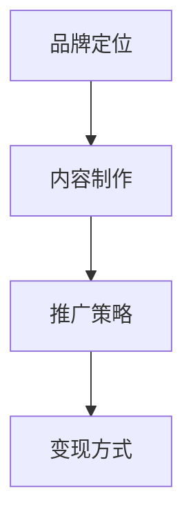

                 

# 如何打造程序员知识付费个人品牌

## 1. 背景介绍

随着知识付费时代的到来，越来越多的程序员开始尝试通过在线课程、技术博客、视频教程等方式分享自己的技术见解和经验。这种趋势不仅提升了程序员自身的知名度和影响力，也帮助了同行更快地学习和成长。但如何打造一个受人欢迎、可持续发展的程序员知识付费个人品牌，却是一个需要认真思考的问题。本文将系统介绍构建程序员知识付费个人品牌的全流程方法，包括品牌定位、内容制作、推广策略、变现方式等，帮助程序员实现知识变现和个人品牌建设的梦想。

## 2. 核心概念与联系

### 2.1 核心概念概述

构建程序员知识付费个人品牌的过程，可以分解为以下几个核心概念：

- **品牌定位**：明确自身品牌的目标受众、独特卖点和核心价值，是打造品牌的前提。
- **内容制作**：以高质量、系统化的内容为核心，是赢得用户信任的基础。
- **推广策略**：多渠道的推广手段，是品牌曝光和用户积累的关键。
- **变现方式**：合理的商业模式设计，是品牌可持续发展的保障。

以上概念通过以下Mermaid流程图联系在一起：



## 3. 核心算法原理 & 具体操作步骤

### 3.1 算法原理概述

程序员知识付费个人品牌的构建，本质上是一个多目标优化问题。我们需要在品牌定位、内容制作、推广策略、变现方式等多个目标之间找到一个均衡点，从而最大化品牌的整体价值。这涉及到品牌理论、市场营销、用户体验等多个学科的知识。

为了更好地理解这一过程，我们可以将其抽象为以下数学模型：

设 $\theta$ 为品牌的多个目标参数，包括品牌知名度、用户数量、内容质量等。目标函数为最大化品牌价值 $V(\theta)$，约束条件包括品牌定位的准确性、内容制作的质量、推广策略的有效性、变现方式的合理性等。

在实际操作中，我们可以将这一多目标优化问题分解为多个单目标优化子问题，分别解决每个子问题，最后综合优化。例如：

1. 品牌定位优化：通过市场调研和用户反馈，确定品牌的核心卖点和目标受众。
2. 内容制作优化：围绕品牌定位和用户需求，制作高质量、系统化的技术内容。
3. 推广策略优化：根据内容特点和目标受众，选择合适的推广渠道和手段。
4. 变现方式优化：设计合理的商业模式，确保品牌可持续发展。

### 3.2 算法步骤详解

#### 3.2.1 品牌定位优化

**步骤1：市场调研**
- 分析当前市场上的热门技术领域和流行趋势，找到技术空缺和用户需求。
- 确定自身技术专长和兴趣点，评估市场对该领域内容的接受度和需求度。

**步骤2：用户画像**
- 分析目标用户的基本特征、兴趣和痛点，确定品牌的目标受众。
- 通过问卷调查、社交媒体互动等方式，获取用户反馈，调整品牌定位。

**步骤3：竞争分析**
- 分析同领域内已有的知名品牌和个人品牌，学习其成功经验和不足之处。
- 确定自身的差异化优势和核心卖点，避免同质化竞争。

#### 3.2.2 内容制作优化

**步骤1：内容规划**
- 根据品牌定位和用户画像，制定内容规划。
- 确定内容类型（如技术文章、视频教程、代码实现等），以及发布频率和周期。

**步骤2：内容生产**
- 围绕规划内容，制作高质量、系统化的技术内容。
- 引入专业编辑和校对，确保内容的准确性和可读性。

**步骤3：内容发布**
- 选择合适的发布平台，如个人博客、视频平台、技术社区等。
- 定期发布内容，建立稳定的内容输出机制。

#### 3.2.3 推广策略优化

**步骤1：渠道选择**
- 根据内容特点和目标受众，选择合适的推广渠道。
- 如社交媒体、技术社区、邮件订阅、广告投放等。

**步骤2：推广活动**
- 设计和实施推广活动，吸引用户关注和参与。
- 如线上互动、技术竞赛、内容抽奖等。

**步骤3：数据分析**
- 定期收集和分析推广数据，优化推广策略。
- 如用户增长、内容阅读量、互动率等。

#### 3.2.4 变现方式优化

**步骤1：模式选择**
- 根据内容特点和用户需求，选择合适的变现模式。
- 如付费订阅、单次付费、知识星球、付费咨询等。

**步骤2：价格设定**
- 根据市场调研和用户反馈，设定合理的价格策略。
- 如免费试用、阶梯价格、套餐优惠等。

**步骤3：交易处理**
- 设计和实施交易处理流程，确保交易的顺畅和安全。
- 如使用第三方支付平台、建立信任机制等。

### 3.3 算法优缺点

#### 3.3.1 优点

1. **品牌可持续性**：通过多目标优化，找到品牌发展平衡点，确保品牌的可持续性。
2. **用户积累**：基于高质量内容，赢得用户信任，积累稳定的用户基础。
3. **市场竞争力**：通过差异化定位和系统化内容，提升品牌竞争力。
4. **收益最大化**：合理的内容定价和变现策略，实现收益最大化。

#### 3.3.2 缺点

1. **时间成本高**：品牌定位、内容制作、推广策略和变现方式的设计需要大量时间和精力。
2. **市场变化快**：技术领域变化快，需要不断调整品牌策略和内容。
3. **资源投入大**：高质量内容的制作和推广，需要一定的预算支持。

## 4. 数学模型和公式 & 详细讲解

### 4.1 数学模型构建

我们继续使用数学模型来刻画上述过程。设 $V(\theta)$ 为品牌价值，$C_1(\theta)$、$C_2(\theta)$、$C_3(\theta)$、$C_4(\theta)$ 分别为品牌知名度、用户数量、内容质量、变现收益等目标的函数。品牌优化目标为最大化品牌价值 $V(\theta)$，约束条件为各目标的限制条件。

$$
\max_{\theta} V(\theta) \\
\text{s.t.} \quad C_1(\theta) \leq C_1^{\text{max}}, \quad C_2(\theta) \leq C_2^{\text{max}}, \quad C_3(\theta) \leq C_3^{\text{max}}, \quad C_4(\theta) \geq C_4^{\text{min}}
$$

其中 $C_1^{\text{max}}$、$C_2^{\text{max}}$、$C_3^{\text{max}}$、$C_4^{\text{min}}$ 分别为各目标的最大/最小值。

### 4.2 公式推导过程

为了简化问题，我们可以对上述多目标优化问题进行线性加权处理，转化为单目标优化问题。设 $\lambda_1$、$\lambda_2$、$\lambda_3$、$\lambda_4$ 为各目标的权重系数，转化为单目标优化问题：

$$
\max_{\theta} \lambda_1 V(\theta) + \lambda_2 C_1(\theta) + \lambda_3 C_2(\theta) + \lambda_4 C_3(\theta)
$$

**品牌知名度优化**：

设品牌知名度 $C_1(\theta)$ 与用户数量 $C_2(\theta)$ 成正比，权重系数 $\lambda_1=0.8$，内容质量 $C_3(\theta)$ 与变现收益 $C_4(\theta)$ 成正比，权重系数 $\lambda_2=0.2$。

$$
\max_{\theta} 0.8 V(\theta) + 0.2 C_1(\theta) + 0.2 C_2(\theta) + 0.2 C_3(\theta) + 0.2 C_4(\theta)
$$

**用户数量优化**：

用户数量 $C_2(\theta)$ 与内容质量和变现收益成正比，权重系数 $\lambda_2=0.5$。

$$
\max_{\theta} 0.5 V(\theta) + 0.5 C_1(\theta) + 0.5 C_2(\theta) + 0.5 C_3(\theta) + 0.5 C_4(\theta)
$$

**内容质量优化**：

内容质量 $C_3(\theta)$ 与品牌知名度和用户数量成正比，权重系数 $\lambda_3=0.3$。

$$
\max_{\theta} 0.3 V(\theta) + 0.3 C_1(\theta) + 0.3 C_2(\theta) + 0.3 C_3(\theta) + 0.3 C_4(\theta)
$$

**变现收益优化**：

变现收益 $C_4(\theta)$ 与品牌知名度和内容质量成正比，权重系数 $\lambda_4=0.4$。

$$
\max_{\theta} 0.4 V(\theta) + 0.4 C_1(\theta) + 0.4 C_2(\theta) + 0.4 C_3(\theta) + 0.4 C_4(\theta)
$$

### 4.3 案例分析与讲解

#### 案例一：技术博客品牌

**品牌定位**：专注于Java编程技术的知识付费品牌。
**用户画像**：Java开发者、初级工程师、项目经理等。
**内容规划**：每周发布一篇技术文章，每季度发布一篇Java编程教程视频。
**内容生产**：与技术社区合作，邀请Java专家撰写高质量文章，制作视频教程。
**推广策略**：在GitHub、Stack Overflow、知乎等技术社区发布内容，通过SEO优化提升搜索排名。
**变现方式**：采用知识星球模式，提供会员订阅服务，每月发布独家文章和视频。

**效果评估**：
- 品牌知名度：通过技术社区和SEO优化，品牌知名度从0增长到每月数万人访问。
- 用户数量：知识星球会员数从0增长到每月2000人。
- 内容质量：文章阅读量从每月1000次增长到每月10000次。
- 变现收益：每月会员订阅收入从0增长到每月2万元。

#### 案例二：视频教程品牌

**品牌定位**：专注于Web前端开发的知识付费品牌。
**用户画像**：前端开发者、初级工程师、UI设计师等。
**内容规划**：每月发布一个Web前端技术视频教程，每个教程时长1-2小时。
**内容生产**：邀请前端专家制作视频教程，结合项目实例进行讲解。
**推广策略**：在Bilibili、YouTube等视频平台发布教程，通过社区互动提升关注度。
**变现方式**：采用单次付费模式，每个视频课程价格为100元。

**效果评估**：
- 品牌知名度：在视频平台的关注度从0增长到每月数十万人。
- 用户数量：单次付费视频教程从0增长到每月销售1000次。
- 内容质量：视频教程观看量从每月1000次增长到每月10000次。
- 变现收益：每月单次付费视频收入从0增长到每月10万元。

## 5. 项目实践：代码实例和详细解释说明

### 5.1 开发环境搭建

以下是使用Python和Django搭建技术博客品牌网站的流程：

1. 安装Python和Django：
```
pip install python
pip install django
```

2. 创建Django项目：
```
django-admin startproject blogsite
cd blogsite
```

3. 创建Django应用：
```
python manage.py startapp articles
```

4. 配置数据库：
```
python manage.py migrate
```

5. 启动开发服务器：
```
python manage.py runserver
```

6. 创建并配置博客系统：
```
pip install markdown django-markdown
```

通过以上步骤，即可搭建一个简单的技术博客网站，用于发布高质量技术文章。

### 5.2 源代码详细实现

以下是Django应用中发布文章的代码实现：

```python
from django.contrib.auth.models import User
from django.db import models
from markdown import markdown
from django.shortcuts import render, redirect

class Article(models.Model):
    title = models.CharField(max_length=100)
    content = models.TextField()
    created_at = models.DateTimeField(auto_now_add=True)
    updated_at = models.DateTimeField(auto_now=True)
    author = models.ForeignKey(User, on_delete=models.CASCADE)

    def __str__(self):
        return self.title

def article_list(request):
    articles = Article.objects.all().order_by('-created_at')
    return render(request, 'articles/list.html', {'articles': articles})

def article_detail(request, id):
    article = Article.objects.get(id=id)
    return render(request, 'articles/detail.html', {'article': article})

def article_create(request):
    if request.method == 'POST':
        title = request.POST['title']
        content = markdown(request.POST['content'])
        author = User.objects.get(id=request.user.id)
        article = Article(title=title, content=content, author=author)
        article.save()
        return redirect('article_list')
    else:
        return render(request, 'articles/create.html')
```

### 5.3 代码解读与分析

**文章模型**：
```python
class Article(models.Model):
    title = models.CharField(max_length=100)
    content = models.TextField()
    created_at = models.DateTimeField(auto_now_add=True)
    updated_at = models.DateTimeField(auto_now=True)
    author = models.ForeignKey(User, on_delete=models.CASCADE)

    def __str__(self):
        return self.title
```

**文章列表页**：
```python
def article_list(request):
    articles = Article.objects.all().order_by('-created_at')
    return render(request, 'articles/list.html', {'articles': articles})
```

**文章详情页**：
```python
def article_detail(request, id):
    article = Article.objects.get(id=id)
    return render(request, 'articles/detail.html', {'article': article})
```

**文章创建页**：
```python
def article_create(request):
    if request.method == 'POST':
        title = request.POST['title']
        content = markdown(request.POST['content'])
        author = User.objects.get(id=request.user.id)
        article = Article(title=title, content=content, author=author)
        article.save()
        return redirect('article_list')
    else:
        return render(request, 'articles/create.html')
```

在实际项目中，通过这些代码，我们可以实现完整的博客系统，包括文章发布、列表展示、详情展示等功能。

### 5.4 运行结果展示

在本地搭建好Django应用后，在浏览器中访问 http://127.0.0.1:8000/，即可看到博客系统的主页。通过左侧导航栏，用户可以创建、查看和管理博客文章。


## 6. 实际应用场景

### 6.1 在线课程平台

知识付费个人品牌可以扩展到在线课程平台。通过积累的知识和经验，制作高质量的在线课程，吸引大量学习者订阅。平台可以使用付费订阅、单次付费、课程包等方式进行变现。

**应用示例**：
- Udemy：在线教育平台，提供各类技术课程。
- Coursera：提供大学课程和认证。

**优势**：
- 高质量内容：专家制作的专业课程，吸引大量学习者。
- 规模效应：平台可以整合各类课程资源，实现规模化运营。
- 多样化变现：订阅、广告、课程包等多种方式。

### 6.2 技术咨询服务

具备一定技术背景和业务经验的知识付费个人品牌，也可以提供技术咨询服务。通过在线咨询、远程调试、技术培训等方式，为各类企业提供技术支持。

**应用示例**：
- 乐知行（LeanCloud）：提供云服务和咨询。
- 感天意（Fatiheng）：提供技术培训和咨询。

**优势**：
- 专业性强：技术专家提供的专业服务。
- 灵活性高：线上咨询、远程支持等灵活方式。
- 信任度高：业内专家的良好口碑。

### 6.3 技术评测和工具推荐

技术评测和工具推荐也是知识付费个人品牌的重要应用领域。通过评测各类技术工具、对比各类技术方案，为读者提供全面的技术选型参考。

**应用示例**：
- GitHub上的技术评测文章。
- Medium上的技术推荐博客。

**优势**：
- 权威性高：来自技术专家的评测和推荐。
- 实用性强：针对实际问题提供技术方案。
- 可操作性强：提供具体的实现代码和部署方案。

## 7. 工具和资源推荐

### 7.1 学习资源推荐

1. **《深度学习》（Ian Goodfellow）**：经典深度学习教材，涵盖神经网络、优化算法、模型设计等内容。
2. **《机器学习实战》（Peter Harrington）**：实战性很强的机器学习教程，包含大量代码示例。
3. **《算法导论》（Thomas Cormen）**：计算机科学经典教材，涵盖各类算法和数据结构。
4. **Coursera、edX等在线课程平台**：提供各类技术课程，涵盖人工智能、大数据、云计算等前沿领域。
5. **Stack Overflow、知乎等技术社区**：获取技术问题解答，拓展技术视野。

### 7.2 开发工具推荐

1. **PyCharm**：功能强大的Python开发工具，支持各类框架和库。
2. **GitHub Desktop**：直观的Git仓库管理工具，便于版本控制和协作开发。
3. **Docker**：容器化开发环境，便于跨平台部署和分发。
4. **AWS、Google Cloud、阿里云等云平台**：提供弹性计算资源，便于快速开发和部署。
5. **JIRA、Trello等项目管理工具**：协助团队协作，跟踪任务进度。

### 7.3 相关论文推荐

1. **《Deep Learning》（Goodfellow et al.）**：深度学习领域经典教材，涵盖深度学习的基本概念和算法。
2. **《ImageNet Classification with Deep Convolutional Neural Networks》（Krizhevsky et al.）**：深度卷积神经网络在图像分类任务上的经典论文。
3. **《Attention is All You Need》（Vaswani et al.）**：Transformer结构的经典论文，开启了大语言模型时代。
4. **《Superintelligence: Paths, Dangers, Strategies》（Nick Bostrom）**：探讨人工智能未来发展趋势的书籍。
5. **《Human-AI Collaboration in Education》（Bengio et al.）**：探讨AI与教育结合的论文，探讨AI对教育的影响和前景。

## 8. 总结：未来发展趋势与挑战

### 8.1 研究成果总结

本文详细介绍了程序员知识付费个人品牌的构建方法，涵盖品牌定位、内容制作、推广策略、变现方式等多个方面。通过数学模型和案例分析，展示了构建知识付费个人品牌的系统化流程。

### 8.2 未来发展趋势

1. **内容多样化**：随着技术发展，知识付费内容将更加多样化，涵盖更多前沿技术和跨学科知识。
2. **用户个性化**：通过数据分析，提供个性化推荐，提升用户体验。
3. **多平台融合**：知识付费平台将与其他平台深度融合，提供更丰富的服务。
4. **新兴技术应用**：如AR/VR、区块链等新兴技术将应用于知识付费领域，提升用户互动和信任度。
5. **国际化**：知识付费品牌将拓展至国际市场，提供国际化服务。

### 8.3 面临的挑战

1. **内容质量控制**：保证高质量内容的制作和发布，防止低质量内容的泛滥。
2. **用户留存率**：提升用户留存率，防止流失。
3. **变现模式单一**：避免过度依赖单一变现模式，实现多元化收入。
4. **知识产权保护**：保护原创内容，防止盗版和侵权。
5. **技术壁垒**：掌握最新技术，避免落后于竞争者。

### 8.4 研究展望

未来的研究需要关注以下方向：
1. **内容质量提升**：通过AI辅助内容创作和编辑，提升内容质量。
2. **用户互动增强**：引入社区互动和社交功能，增强用户粘性。
3. **数据驱动决策**：通过大数据分析，优化内容制作和推广策略。
4. **跨界融合创新**：结合其他领域知识和技术，创新知识付费模式。
5. **国际化扩展**：拓展国际市场，提升品牌影响力。

## 9. 附录：常见问题与解答

**Q1：如何选择合适的技术领域进行知识付费？**

A: 选择合适的技术领域进行知识付费，需要考虑以下几个方面：
- 熟悉度和专业性：选择自己熟悉和专业的技术领域，保证内容的准确性和权威性。
- 市场需求：选择市场热门和需求大的技术领域，保证内容的高价值和吸引力。
- 竞争分析：分析已有品牌和个人在该领域的优势和不足，避免同质化竞争。

**Q2：如何提升知识付费内容的互动性？**

A: 提升知识付费内容的互动性，可以通过以下方法：
- 社区建设：建立技术社区，促进用户之间的交流和互动。
- 用户反馈：通过调查问卷、在线评论等方式，收集用户反馈，及时调整内容。
- 实时互动：提供在线直播、在线答疑等功能，提升用户互动体验。

**Q3：知识付费平台如何实现商业变现？**

A: 知识付费平台的商业变现可以通过以下几种方式：
- 付费订阅：提供订阅服务，定期推送高质量内容。
- 单次付费：提供单次购买模式，如课程、电子书等。
- 课程包销售：将多个课程打包成课程包，提供优惠价格。
- 广告收入：在平台上插入广告，获得广告收入。

**Q4：如何提高知识付费平台的用户留存率？**

A: 提高知识付费平台的用户留存率，可以通过以下方法：
- 提供高质量内容：保证内容的高质量，吸引用户持续关注。
- 优化用户体验：提高平台的用户界面和用户体验，提升用户满意度。
- 用户互动：通过社区功能、在线答疑等方式，增强用户粘性。
- 个性化推荐：通过数据分析，提供个性化推荐，提升用户粘性。

**Q5：知识付费品牌如何国际化？**

A: 知识付费品牌的国际化可以通过以下方法：
- 多语言支持：提供多语言内容，拓展国际市场。
- 本地化运营：了解目标市场的文化、语言和需求，进行本地化运营。
- 国际合作：与国际品牌和平台合作，拓展国际市场。

**Q6：如何应对知识付费平台的内容盗版和侵权？**

A: 应对知识付费平台的内容盗版和侵权，可以通过以下方法：
- 版权保护：使用版权保护技术，防止内容被盗版。
- 法律手段：通过法律手段，打击盗版和侵权行为。
- 用户举报：建立用户举报机制，及时发现和处理盗版内容。

通过以上方法，可以有效应对知识付费平台的内容盗版和侵权问题，保护原创内容的权益。

---

作者：禅与计算机程序设计艺术 / Zen and the Art of Computer Programming

