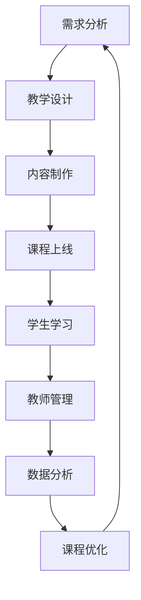

                 

# 如何打造高价值的在线课程：程序员版

> 关键词：在线课程, 课程开发, 程序员, 课程设计, 教学资源, 教学平台, 学生反馈, 教学质量, 课程评估

## 1. 背景介绍

在当今信息爆炸的时代，互联网为知识传播提供了前所未有的便利。在线课程因其灵活性和广泛覆盖性，成为了越来越多人的首选学习途径。特别是在疫情影响下，远程教育和自学能力的重要性日益凸显，开发高质量的在线课程成为教育行业的一大焦点。

然而，如何确保在线课程的高质量、高价值，却是一个复杂而棘手的问题。一方面，课程内容需要符合市场和用户需求，另一方面，课程的设计和实施又必须符合教育规律，兼顾技术、艺术、经济等多个维度的考量。本文将从课程开发的核心理念、关键步骤和实际应用等方面，详细探讨如何打造高价值的在线课程。

## 2. 核心概念与联系

### 2.1 核心概念概述

- **在线课程**：通过互联网平台提供的学习资源和互动环境，可以随时随地进行学习的课程形式。

- **课程开发**：从需求分析到教学设计，再到内容制作和上线发布，贯穿整个课程开发的流程。

- **教学资源**：包括教学视频、文档、代码、工具等，是课程开发的重要组成部分。

- **教学平台**：提供课程发布、学生学习、教师管理和数据分析等功能的网络平台。

- **学生反馈**：通过调研、测试、评价等手段获取的学生的反馈信息，是优化课程内容的重要依据。

- **教学质量**：课程的有用性、系统性、交互性和创新性等综合评价指标。

- **课程评估**：对课程的教学效果和学习成效进行科学、客观的评价。

### 2.2 核心概念原理和架构的 Mermaid 流程图(Mermaid 流程节点中不要有括号、逗号等特殊字符)



这个流程图展示了在线课程开发的基本流程：首先通过需求分析确定课程目标和内容方向，然后进行教学设计，接着制作课程内容，上线发布后进行学生学习、教师管理和数据分析，最后根据数据分析结果进行课程优化，形成闭环。

## 3. 核心算法原理 & 具体操作步骤

### 3.1 算法原理概述

在线课程的开发涉及多个学科领域，如教育学、心理学、统计学等。其核心算法原理可以归结为以下几个方面：

- **学习理论**：基于认知学习理论，设计课程内容和交互方式，确保学习效果最大化。

- **数据科学**：利用大数据分析技术，收集和分析学生行为数据，优化课程设计。

- **人工智能**：使用AI技术实现个性化推荐、智能答疑等功能，提升课程体验。

- **用户体验设计**：结合人机交互理论，设计直观、易用的用户界面和交互流程。

- **课程评估模型**：构建基于学生反馈的评估模型，科学评估课程质量，指导课程优化。

### 3.2 算法步骤详解

#### 3.2.1 需求分析

**步骤1**：调研目标用户群体，了解其需求、兴趣和痛点。

**步骤2**：确定课程目标和预期成果，制定课程大纲。

**步骤3**：分析现有资源和限制，评估课程开发可行性。

#### 3.2.2 教学设计

**步骤1**：设计课程结构，包括引入、核心内容和总结。

**步骤2**：规划教学活动，如视频、案例、练习等。

**步骤3**：设计评估方法，如测验、作业、项目等。

#### 3.2.3 内容制作

**步骤1**：制作教学视频，确保内容质量和技术规范。

**步骤2**：编写讲义和教材，提供详细的学习材料。

**步骤3**：开发在线习题和实验，增强互动性。

**步骤4**：选择并整合教学工具，如编程IDE、协作工具等。

#### 3.2.4 课程上线

**步骤1**：选择合适的教学平台，如Coursera、Udacity等。

**步骤2**：上传课程内容和资源，设置课程参数。

**步骤3**：发布课程，进行推广宣传。

#### 3.2.5 学生学习

**步骤1**：引导学生注册和学习，提供技术支持。

**步骤2**：监控学生学习进度，进行实时反馈。

**步骤3**：组织互动活动，如讨论区、作业评阅等。

#### 3.2.6 教师管理

**步骤1**：为教师提供教学管理工具，如课程管理、学生管理等。

**步骤2**：开展教师培训，提升教师的教学水平。

**步骤3**：收集教师反馈，进行教学质量评估。

#### 3.2.7 数据分析

**步骤1**：收集和分析学生行为数据，如学习时间、完成度等。

**步骤2**：利用统计方法评估课程效果，找出改进点。

**步骤3**：进行课程优化，调整教学策略和内容。

### 3.3 算法优缺点

#### 3.3.1 优点

- **灵活性高**：在线课程不受时间地点限制，学生可以自主安排学习时间。

- **资源丰富**：课程内容形式多样，包括视频、文本、代码等，满足不同学习者的需求。

- **互动性强**：通过在线讨论、实时答疑等，增强师生互动。

- **数据分析精确**：利用大数据技术，可以对学生行为进行深入分析，优化课程设计。

- **个性化推荐**：AI技术可以实现个性化推荐，提高学习效果。

#### 3.3.2 缺点

- **自控能力要求高**：在线学习需要高度的自我管理和自控能力，学生易受干扰。

- **技术依赖性大**：课程开发和平台运行需要较高的技术投入，且易受技术问题影响。

- **评估难度大**：在线课程的评估更多依赖学生的自主反馈，难以进行客观评估。

- **学习路径不明确**：缺乏结构化的学习路径，学生容易迷失在丰富的资源中。

### 3.4 算法应用领域

在线课程开发在多个领域都有广泛应用，如IT技术、商业管理、语言学习、艺术设计等。每个领域都有其独特的教学目标和方式，但核心流程基本一致，都是需求分析、教学设计、内容制作、上线发布、学生学习、教师管理和数据分析。

## 4. 数学模型和公式 & 详细讲解 & 举例说明

### 4.1 数学模型构建

为了科学评估在线课程的质量，可以构建如下数学模型：

- **学生评估模型**：
$$
E_s = w_1 \times (S_A - S_B) + w_2 \times (C_A - C_B) + w_3 \times (P_A - P_B)
$$
其中，$E_s$ 表示课程学生评估得分，$w_1$ 至 $w_3$ 为权重，$S_A$ 至 $P_B$ 分别为学生参与度、满意度、完成度等指标。

- **教师评估模型**：
$$
E_t = w_1 \times (T_I - T_O) + w_2 \times (T_Q - T_B) + w_3 \times (T_F - T_B)
$$
其中，$E_t$ 表示课程教师评估得分，$T_I$ 至 $T_B$ 分别为教学互动、教学质量、教学反馈等指标。

- **课程评估模型**：
$$
E_c = \frac{1}{N} \sum_{i=1}^N (E_{si} + E_{ti})
$$
其中，$E_c$ 表示课程整体评估得分，$N$ 为评价人数，$E_{si}$ 和 $E_{ti}$ 分别为第 $i$ 个评价人的学生评估和教师评估得分。

### 4.2 公式推导过程

以上公式是基于基本统计学原理构建的。首先，根据学生和教师的各项指标计算其评估得分，然后对每位评价人的得分进行加权平均，得到课程整体评估得分。这种模型不仅考虑了量化指标，还兼顾了定性评价，能够全面评估课程质量。

### 4.3 案例分析与讲解

以一门Python编程在线课程为例，通过收集和分析学生行为数据，构建学生评估模型。假设有 $N$ 名学生参与了课程，每位学生填写了关于课程的参与度、满意度和完成度，分别记为 $S_i$、$C_i$ 和 $P_i$，其中 $i=1,2,\dots,N$。

假设课程评估模型中，学生的参与度、满意度和完成度分别占权重 $w_1=0.4$、$w_2=0.3$ 和 $w_3=0.3$。根据上述公式，可以计算出课程的整体学生评估得分：

$$
E_s = 0.4 \times (S_{avg} - S_{min}) + 0.3 \times (C_{avg} - C_{min}) + 0.3 \times (P_{avg} - P_{min})
$$

其中，$S_{avg}$、$C_{avg}$ 和 $P_{avg}$ 分别表示参与度、满意度和完成度的平均值，$S_{min}$、$C_{min}$ 和 $P_{min}$ 分别表示最小值。

类似地，课程的教师评估得分可以通过课程互动、教学质量和教学反馈等指标计算得到。最终，课程的总体评估得分可以通过对学生和教师评估得分的加权平均计算得到。

## 5. 项目实践：代码实例和详细解释说明

### 5.1 开发环境搭建

为了开发高质量的在线课程，需要搭建一个完整的开发环境。以下是主要的开发工具和技术栈：

- **编程语言**：Python、JavaScript等。
- **Web框架**：Django、Flask等。
- **数据库**：MySQL、PostgreSQL等。
- **服务器**：AWS、Google Cloud等。
- **版本控制**：Git。
- **开发工具**：Visual Studio Code、PyCharm等。

### 5.2 源代码详细实现

以下是一个简单的在线课程开发流程示例，展示如何使用Python Flask框架搭建课程发布平台：

1. **需求分析**：通过问卷调查收集学生需求，确定课程内容和结构。

2. **教学设计**：设计课程大纲，安排教学活动和评估方法。

3. **内容制作**：制作教学视频、编写讲义和开发在线习题。

4. **课程上线**：使用Flask搭建课程发布平台，上传课程内容，设置课程参数。

5. **学生学习**：学生通过平台注册登录，观看视频、完成习题和参与讨论。

6. **教师管理**：教师通过平台发布课程、管理学生和进行答疑。

7. **数据分析**：收集和分析学生行为数据，优化课程设计。

### 5.3 代码解读与分析

以下是一个简单的Python Flask程序，用于展示如何搭建在线课程发布平台：

```python
from flask import Flask, request, jsonify

app = Flask(__name__)

@app.route('/register', methods=['POST'])
def register():
    data = request.get_json()
    # 验证用户信息，创建账户
    # ...
    return jsonify({'status': 'success'})

@app.route('/login', methods=['POST'])
def login():
    data = request.get_json()
    # 验证用户信息，生成令牌
    # ...
    return jsonify({'status': 'success', 'token': 'xxxxx'})

@app.route('/submit', methods=['POST'])
def submit():
    data = request.get_json()
    # 验证习题提交信息，记录成绩
    # ...
    return jsonify({'status': 'success'})

@app.route('/video', methods=['GET'])
def video():
    video_id = request.args.get('id')
    # 获取视频信息，返回流媒体地址
    # ...
    return jsonify({'url': 'https://example.com/video.mp4'})

@app.route('/forum', methods=['POST'])
def forum():
    data = request.get_json()
    # 发布论坛帖子和回复
    # ...
    return jsonify({'status': 'success'})

@app.route('/dashboard', methods=['GET'])
def dashboard():
    user_id = request.args.get('id')
    # 获取课程进度、成绩等信息
    # ...
    return jsonify({'progress': '80%', 'score': 90})

if __name__ == '__main__':
    app.run(debug=True)
```

该程序定义了注册、登录、提交习题、播放视频、发布论坛帖子和查看成绩等基本功能，展示了如何搭建一个基本的在线课程发布平台。开发者可以根据需求，进一步扩展和优化功能，构建更加完善的在线课程系统。

### 5.4 运行结果展示

以下是一个简单的运行结果展示，展示用户通过Flask平台进行注册、登录和提交习题的场景：

```
POST /register
Content-Type: application/json

{
    "email": "user@example.com",
    "password": "password123"
}

Response:
{
    "status": "success"
}

POST /login
Content-Type: application/json

{
    "email": "user@example.com",
    "password": "password123"
}

Response:
{
    "status": "success",
    "token": "xxxxx"
}

POST /submit
Content-Type: application/json

{
    "user_id": "user1",
    "video_id": "video1",
    "answer": "正确答案"
}

Response:
{
    "status": "success"
}

GET /video
Query-Parameters:
id=video1

Response:
{
    "url": "https://example.com/video.mp4"
}

POST /forum
Content-Type: application/json

{
    "user_id": "user1",
    "content": "这是一个课程论坛帖子"
}

Response:
{
    "status": "success"
}

GET /dashboard
Query-Parameters:
id=user1

Response:
{
    "progress": "80%",
    "score": 90
}
```

## 6. 实际应用场景

### 6.1 教育培训机构

在线课程已成为教育培训机构的重要组成部分，可以显著提升教育资源的覆盖面和灵活性。通过搭建在线平台，培训机构可以向全球提供高质量的课程内容，满足不同地区和学生的需求。例如，Coursera、edX等在线教育平台，为全球学生提供了大量的在线课程，覆盖从K12到大学的各个领域。

### 6.2 企业培训

企业可以通过在线课程培训员工，提升员工的职业技能和素养。在线课程可以提供灵活的学习时间和地点，满足不同员工的学习需求。例如，大型企业如Google、Amazon等，定期组织员工参加在线培训课程，提升团队的技术能力和综合素质。

### 6.3 认证考试

在线课程在认证考试中也得到了广泛应用。许多专业认证考试，如PMP、CFA等，都可以通过在线课程进行备考。学生可以根据自己的时间安排，灵活地进行学习，提高通过率。

### 6.4 未来应用展望

未来，在线课程的发展将呈现以下几个趋势：

- **多模态学习**：结合视频、文本、音频等多种形式，提供更加丰富和直观的学习体验。

- **个性化推荐**：利用AI技术，根据学生的学习行为和反馈，提供个性化的课程推荐。

- **虚拟实验室**：结合虚拟现实技术，提供虚拟实验环境，增强课程的实践性和互动性。

- **区块链认证**：利用区块链技术，实现课程认证的透明性和不可篡改性，提升认证的公信力。

- **微课视频**：提供短小精悍、主题明确的微课视频，方便学生快速掌握知识点。

## 7. 工具和资源推荐

### 7.1 学习资源推荐

为了帮助开发者系统掌握在线课程开发的理论和实践，这里推荐一些优质的学习资源：

- **《在线教育系统设计与实现》**：深入探讨在线教育系统的设计理念和技术实现，适合从事在线教育开发的开发者阅读。

- **Coursera官方文档**：Coursera的官方文档，提供了详细的课程开发流程和最佳实践，适合初学者参考。

- **edX官方文档**：edX的官方文档，提供了丰富的课程开发工具和案例，适合开发者学习和实践。

- **《在线教育编程实践》**：介绍如何使用Python、Django等工具，构建在线教育平台，适合技术开发者阅读。

- **《在线课程设计与开发》**：系统讲解在线课程的各个环节，包括需求分析、教学设计、内容制作等，适合教育开发者阅读。

### 7.2 开发工具推荐

为了高效开发高质量的在线课程，推荐以下开发工具：

- **Django**：一个流行的Python Web框架，适合搭建课程发布平台。

- **Flask**：一个轻量级的Python Web框架，适合搭建简单易用的在线课程平台。

- **MySQL**：一个流行的关系型数据库，适合存储课程信息和用户数据。

- **AWS**：亚马逊云服务，提供弹性计算和存储服务，适合搭建大规模在线课程平台。

- **Git**：一个流行的版本控制系统，适合团队协作开发和管理代码。

### 7.3 相关论文推荐

在线课程开发涉及多个学科领域，以下是几篇相关论文，推荐阅读：

- **《在线课程设计与开发的挑战与对策》**：探讨在线课程设计与开发中的常见问题和应对策略，适合教育开发者阅读。

- **《基于Web 2.0的在线课程开发与实践》**：介绍基于Web 2.0技术的在线课程开发方法，适合技术开发者阅读。

- **《在线课程设计与实施的案例分析》**：通过实际案例，分析在线课程设计与实施中的关键问题和解决方案，适合教育开发者阅读。

- **《基于人工智能的在线教育平台设计》**：探讨如何利用人工智能技术，提升在线教育平台的智能化和个性化水平，适合技术开发者阅读。

## 8. 总结：未来发展趋势与挑战

### 8.1 研究成果总结

本文系统探讨了在线课程开发的核心理念、关键步骤和实际应用。通过理论分析和案例分析，展示了如何高效开发高质量的在线课程。未来的在线课程开发，将需要更注重技术创新和用户体验设计，不断优化课程设计和教学效果。

### 8.2 未来发展趋势

未来，在线课程的发展将呈现以下几个趋势：

- **技术融合**：利用大数据、人工智能等技术，提升在线课程的智能化和个性化水平。

- **多模态学习**：结合视频、文本、音频等多种形式，提供更加丰富和直观的学习体验。

- **虚拟现实**：利用虚拟现实技术，提供沉浸式学习体验，增强课程的互动性和实践性。

- **区块链认证**：利用区块链技术，实现课程认证的透明性和不可篡改性，提升认证的公信力。

- **个性化推荐**：利用AI技术，根据学生的学习行为和反馈，提供个性化的课程推荐。

### 8.3 面临的挑战

尽管在线课程开发已经取得了显著进展，但在迈向更加智能化、普适化应用的过程中，仍然面临诸多挑战：

- **技术门槛高**：在线课程开发需要较高的技术投入，对开发者的技术水平和经验要求较高。

- **内容质量参差不齐**：部分在线课程存在内容质量不高、师资力量薄弱等问题，难以满足用户需求。

- **用户黏性低**：在线课程缺乏线下课程的互动性和约束性，用户容易流失。

- **学习效果难以量化**：在线课程的学习效果难以进行科学评估，用户反馈和课程评估存在主观性。

### 8.4 研究展望

面对在线课程开发所面临的挑战，未来的研究需要在以下几个方面寻求新的突破：

- **技术创新**：开发更高效、更灵活的在线课程开发平台和工具，降低开发门槛。

- **内容优化**：加强对在线课程内容的审核和评估，确保高质量的教学内容。

- **用户体验**：提升在线课程的用户体验，增强课程的互动性和沉浸感。

- **学习效果评估**：利用大数据和AI技术，科学评估在线课程的学习效果，提供个性化学习路径。

- **社会化学习**：构建社会化学习平台，促进学生之间的交流和协作，提升学习效果。

总之，在线课程的开发需要技术、教育、心理等多学科的协同创新，才能实现高质量、高价值的课程资源。未来的在线教育，必将更加智能、个性化和普适化，为更多人提供高质量的教育资源。

## 9. 附录：常见问题与解答

**Q1：如何选择合适的在线课程开发平台？**

A: 选择合适的在线课程开发平台需要考虑以下几个因素：

- **功能完备性**：选择功能齐全、易于使用的开发平台，如Django、Flask等。

- **性能稳定性**：选择性能稳定、可扩展性强的平台，如AWS、Google Cloud等。

- **用户友好性**：选择界面直观、易于上手的平台，如Coursera、edX等。

- **社区支持**：选择有活跃社区支持的平台，便于获取帮助和分享经验。

- **成本效益**：选择性价比高的平台，如开源平台Khan Academy等。

**Q2：如何优化在线课程的用户体验？**

A: 优化在线课程的用户体验需要从以下几个方面入手：

- **内容设计**：设计有吸引力的课程内容，提供丰富的多媒体资源。

- **互动设计**：设计互动性强的学习活动，如在线讨论、实时答疑等。

- **用户界面**：设计简洁易用的用户界面，提供良好的用户体验。

- **技术支持**：提供快速响应的技术支持，解决用户的学习问题。

- **个性化推荐**：利用AI技术，提供个性化的课程推荐和路径。

**Q3：如何科学评估在线课程的效果？**

A: 科学评估在线课程的效果需要综合考虑以下几个指标：

- **学生参与度**：评估学生在学习过程中的活跃度和参与度。

- **学习效果**：通过测验、作业和项目等方式，评估学生的学习效果和掌握程度。

- **课程满意度**：通过问卷调查和学生反馈，评估课程的整体满意度。

- **课程完成度**：评估学生完成课程的进度和最终成绩。

- **社会影响力**：评估课程对社会的影响和推广效果。

通过科学评估，及时发现课程存在的问题，并进行优化改进，提升课程的质量和效果。

**Q4：如何应对在线课程开发中的技术挑战？**

A: 应对在线课程开发中的技术挑战需要以下几个策略：

- **团队协作**：组建跨学科的团队，确保技术开发与课程设计相结合。

- **技术培训**：对团队成员进行技术培训，提升技术水平。

- **持续优化**：不断优化技术架构和工具，提升系统的性能和稳定性。

- **资源整合**：整合内外部资源，提升课程开发效率和效果。

- **社区交流**：加入技术社区，获取技术支持和交流经验。

通过有效的技术管理和优化，克服在线课程开发中的技术挑战，实现高质量的课程开发和部署。

**Q5：如何构建社会化学习平台？**

A: 构建社会化学习平台需要以下几个关键步骤：

- **平台设计**：设计支持社会化互动的平台，如论坛、讨论区等。

- **用户激励**：设计激励机制，鼓励用户参与互动和交流。

- **社区管理**：建立社区管理团队，维护平台秩序和互动质量。

- **内容审核**：加强内容审核，确保互动内容的质量和安全。

- **数据利用**：利用大数据技术，分析用户互动行为，提供个性化推荐。

通过构建社会化学习平台，促进学生之间的交流和协作，提升学习效果和体验。

---

作者：禅与计算机程序设计艺术 / Zen and the Art of Computer Programming

