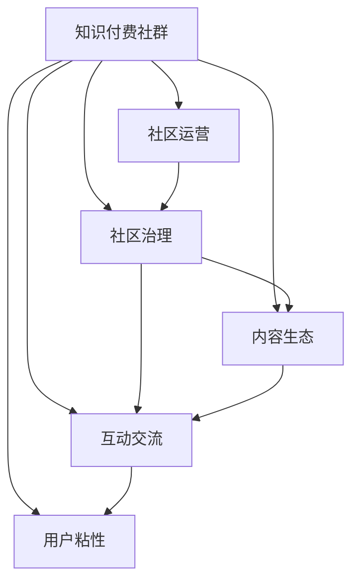

                 

# 如何打造高活跃度的程序员知识付费社群

> 关键词：知识付费社群,程序员,高活跃度,社群运营,社交网络,知识分享,内容变现,互动交流

## 1. 背景介绍

### 1.1 问题由来

在信息爆炸的互联网时代，知识获取和分享已经变得前所未有的简单。然而，高质量的知识资源往往高度集中于少数专家和机构，普通用户难以直接接触到这些有价值的知识。特别是在程序员社区中，高质量的学习资料和经验分享往往散落在各个角落，难以系统化、结构化地呈现。

为了更好地整合和利用这些分散的资源，知识付费社群应运而生。通过专业化的内容产出和有效的社区运营，知识付费社群为程序员提供了一个高效获取知识、进行交流、实现价值变现的全新平台。然而，社群的活跃度和互动质量直接决定了其价值和影响力。一个活跃度低、互动差的社群，不仅无法吸引和留住用户，还会逐渐失去商业价值。

本文将深入探讨如何打造高活跃度的程序员知识付费社群，从运营策略、内容生态、社区治理等角度，提出一系列切实可行的建议和措施。希望为所有希望打造成功知识付费社群的程序员和开发者提供有用的参考和指导。

### 1.2 问题核心关键点

打造高活跃度的程序员知识付费社群，核心关键点在于：

1. **高质量的内容生产**：社区必须提供高质量、有价值的内容，才能吸引和留住用户。
2. **有效的社区运营**：通过有效的运营策略，提高用户活跃度和参与度。
3. **积极的社区治理**：建立良好的社区氛围，避免不良行为，确保社群健康发展。
4. **多渠道的价值变现**：通过内容变现、广告收入、会员订阅等多种渠道，实现社区的商业化和可持续发展。
5. **用户粘性和忠诚度**：通过优质的用户服务和社区活动，增强用户的粘性和忠诚度。

这些核心关键点共同构成了打造高活跃度程序员知识付费社群的基础框架，使得社群能够长期稳定发展，实现其商业价值和社会价值。

## 2. 核心概念与联系

### 2.1 核心概念概述

为更好地理解如何打造高活跃度的程序员知识付费社群，本节将介绍几个密切相关的核心概念：

- **知识付费社群**：基于互联网的知识分享和互动平台，用户通过付费方式获取高质量的课程、文章、问答等知识资源，并参与社区互动。
- **社区运营**：通过一系列有策略的活动和操作，提高用户活跃度和参与度，营造良好的社区氛围。
- **社区治理**：建立有效的社区规则和机制，避免不良行为，确保社区健康有序发展。
- **内容生态**：社区中内容生产者、用户和平台之间的良性互动关系，形成稳定的内容生态循环。
- **互动交流**：社区中用户之间的知识分享、讨论、评论等互动行为，提升社区的活跃度和参与度。
- **用户粘性**：通过优质的用户服务和社区活动，增强用户的忠诚度和粘性，使其长期驻留在社区中。

这些核心概念之间的逻辑关系可以通过以下Mermaid流程图来展示：



这个流程图展示了一体化的社群运作模式：

1. **知识付费社群**：社区的根基，提供高质量的内容和互动平台。
2. **社区运营**：通过一系列策略活动，提升社区活跃度。
3. **社区治理**：建立规则机制，确保社区健康有序。
4. **内容生态**：内容生产者、用户、平台之间的良性互动。
5. **互动交流**：用户之间的知识分享和讨论，提升活跃度。
6. **用户粘性**：优质的用户服务和活动，增强用户忠诚度。

这些概念共同构成了知识付费社群的基本框架，使得社群能够健康有序地运作，吸引并留住高质量用户。

## 3. 核心算法原理 & 具体操作步骤
### 3.1 算法原理概述

打造高活跃度的程序员知识付费社群，本质上是一个复杂的多目标优化问题。其核心目标包括提升用户活跃度、提高内容质量、增强用户粘性和实现价值变现等。

本文从社区运营、内容生态、社区治理等角度，提出一系列策略和步骤，逐一解决这些目标。

### 3.2 算法步骤详解

**Step 1: 明确社区定位和目标**

- **确定目标用户群**：明确社群的主要目标用户，如初级开发者、中级工程师、架构师等。
- **制定社区愿景**：明确社群的长期发展目标，如成为某领域最专业的知识付费平台。
- **制定关键指标**：如用户注册数、活跃用户数、内容发布量、用户反馈等，作为衡量社区活跃度的主要指标。

**Step 2: 设计社区运营策略**

- **内容推荐机制**：利用算法推荐系统，为用户推荐高质量的内容，提高内容的曝光率。
- **社区活动策划**：定期策划线上线下活动，如技术分享、技术讲座、编程竞赛等，吸引用户参与。
- **激励机制设计**：设计合理的激励机制，如积分系统、排行榜、奖励计划等，激励用户积极参与。
- **用户反馈收集**：建立用户反馈渠道，定期收集用户意见和建议，不断改进社区运营策略。

**Step 3: 优化内容生态**

- **招募优质内容生产者**：邀请业内专家、技术大牛入驻社区，定期发布高质量的课程、文章、视频等。
- **鼓励用户创作**：通过补贴、奖励等激励措施，鼓励普通用户发布自己的学习心得、项目经验等。
- **建立内容审核机制**：建立严格的内容审核机制，确保内容的高质量和专业性。
- **优化内容呈现方式**：设计友好的内容呈现界面，使用户能够轻松浏览、学习和分享内容。

**Step 4: 完善社区治理**

- **建立社区规则**：制定详细的社区规则，明确用户行为规范，如禁止垃圾信息、保持文明交流等。
- **设立管理员团队**：建立专业的管理员团队，及时处理社区中的不良行为，维护社区秩序。
- **引入用户自治**：通过社区投票等机制，引入用户自治，让用户参与社区管理。
- **定期社区自查**：定期进行社区自查，评估社区的运营状态和用户反馈，及时改进。

**Step 5: 实现价值变现**

- **多渠道变现模式**：除了传统的课程销售，还可以通过广告、赞助、会员订阅等方式实现多样化变现。
- **建立广告合作**：与知名技术品牌、工具厂商合作，推广社区内容，增加广告收入。
- **推出会员服务**：通过会员订阅模式，提供额外的高级服务，如专属课程、优先发布权等。
- **众筹与捐赠**：通过社区众筹或用户捐赠等方式，获得社区成员的支持。

**Step 6: 提升用户粘性**

- **个性化推荐**：利用用户行为数据，进行个性化推荐，提升用户体验。
- **用户关系维护**：建立用户关系网络，通过社交网络、社群活动等方式，增强用户粘性。
- **提供优质服务**：提供优质的客户服务，及时解决用户问题，增强用户满意度和忠诚度。
- **定期社区互动**：通过定期社区互动活动，如问答、讨论、分享等，增强用户参与感和社区归属感。

以上是打造高活跃度程序员知识付费社群的一般流程。在实际应用中，还需要根据社区的具体情况，灵活调整和优化各个环节的策略和措施。

### 3.3 算法优缺点

**优点**：

1. **高度定制化**：社区运营策略可以根据目标用户群和社区特点进行高度定制化，适应性强。
2. **多渠道变现**：通过多种渠道实现价值变现，增强社区的商业化能力。
3. **用户粘性高**：通过优质的用户服务和社区活动，提升用户粘性和忠诚度。
4. **内容质量高**：通过严格的内容审核机制和激励机制，确保内容的高质量和专业性。

**缺点**：

1. **运营成本高**：社区运营需要投入大量人力和资源，初期成本较高。
2. **管理难度大**：社区管理涉及规则制定、用户行为监控等多个方面，管理难度较大。
3. **市场竞争激烈**：知识付费市场竞争激烈，需要不断创新和优化才能保持竞争力。

尽管存在这些局限性，但通过精心设计运营策略和社区规则，合理规划内容生态，持续优化社区治理，打造高活跃度的程序员知识付费社群是完全可行的。

### 3.4 算法应用领域

打造高活跃度程序员知识付费社群的方法，不仅仅适用于程序员社区，还适用于其他专业领域的知识付费平台，如法律、医疗、教育等。通过借鉴本文提出的策略和措施，这些平台同样可以吸引和留住高质量用户，提升社区的活跃度和影响力。

## 4. 数学模型和公式 & 详细讲解 & 举例说明

### 4.1 数学模型构建

本文将使用数学语言对如何打造高活跃度程序员知识付费社群的过程进行更加严格的刻画。

记知识付费社群为 $G$，其中包含用户 $U$、内容 $C$、管理员 $A$ 和广告商 $S$。设 $U_i$ 表示第 $i$ 个用户，$C_j$ 表示第 $j$ 个内容，$A_k$ 表示第 $k$ 个管理员，$S_l$ 表示第 $l$ 个广告商。

**用户活跃度** $A_i$ 可以表示为用户在社群中参与活动的频率，如发布内容、参与讨论、完成课程等。
**内容质量** $Q_j$ 可以表示为内容的价值、专业性和受欢迎程度。
**社区治理** $M_k$ 可以表示为社区的秩序和规范，如违规行为的数量、管理员团队的效率等。
**广告收入** $I_l$ 可以表示为广告商通过社群广告获得的收入。

数学模型可以表示为：

$$
\max \sum_{i=1}^{|U|} A_i + \sum_{j=1}^{|C|} Q_j + \sum_{k=1}^{|A|} M_k + \sum_{l=1}^{|S|} I_l
$$

其中 $|U|, |C|, |A|, |S|$ 分别表示用户、内容、管理员和广告商的数量。

### 4.2 公式推导过程

以上数学模型为目标函数，具体推导如下：

1. **用户活跃度最大化**：

   $$
   \max \sum_{i=1}^{|U|} A_i
   $$

   活跃度最大化即通过一系列策略和措施，提升用户参与活动的频率，包括内容推荐、社区活动、激励机制等。

2. **内容质量最大化**：

   $$
   \max \sum_{j=1}^{|C|} Q_j
   $$

   内容质量最大化即通过招募优质内容生产者、激励用户创作、内容审核机制等，提高内容的价值和专业性。

3. **社区治理优化**：

   $$
   \max \sum_{k=1}^{|A|} M_k
   $$

   社区治理优化即通过建立社区规则、设立管理员团队、引入用户自治等，确保社区的秩序和规范。

4. **广告收入最大化**：

   $$
   \max \sum_{l=1}^{|S|} I_l
   $$

   广告收入最大化即通过引入广告商、推广社区内容、优化广告投放等，增加广告收入。

### 4.3 案例分析与讲解

以下以一个具体的案例来说明如何利用数学模型优化知识付费社群的运营策略。

假设有一个面向开发者的知识付费社群，初期用户数 $|U|=1000$，内容数 $|C|=100$，管理员数 $|A|=10$，广告商数 $|S|=5$。

**目标**：在半年内将用户活跃度提升至 $A_i=100$，内容质量提升至 $Q_j=90$，社区治理优化至 $M_k=85$，广告收入提升至 $I_l=50$。

**策略**：

1. **用户活跃度提升**：
   - 内容推荐系统：通过算法推荐，提升用户内容曝光率。
   - 社区活动策划：每月策划一次技术分享会，邀请知名专家进行讲解。
   - 激励机制设计：设立积分系统，定期发放奖励。

2. **内容质量提升**：
   - 招募优质内容生产者：邀请10名技术大牛入驻社群，定期发布高质量的课程和文章。
   - 激励用户创作：通过补贴、奖励等激励措施，鼓励普通用户发布学习心得和项目经验。
   - 内容审核机制：建立严格的内容审核机制，确保内容的专业性和质量。

3. **社区治理优化**：
   - 建立社区规则：制定详细的社区规则，明确用户行为规范。
   - 设立管理员团队：聘请5名专业管理员，及时处理社区中的不良行为。
   - 引入用户自治：通过社区投票机制，引入用户自治，让用户参与社区管理。

4. **广告收入提升**：
   - 与知名技术品牌合作：推广社群内容，增加广告收入。
   - 推出会员服务：通过会员订阅模式，提供额外的高级服务。

通过这些策略的实施，社群可以实现上述目标。以用户活跃度提升为例，通过内容推荐系统、社区活动策划和激励机制设计，可以在半年内将用户活跃度提升至 $A_i=100$。

## 5. 项目实践：代码实例和详细解释说明

### 5.1 开发环境搭建

在进行社群运营实践前，我们需要准备好开发环境。以下是使用Python进行Django开发的环境配置流程：

1. 安装Anaconda：从官网下载并安装Anaconda，用于创建独立的Python环境。

2. 创建并激活虚拟环境：
```bash
conda create -n django-env python=3.8 
conda activate django-env
```

3. 安装Django：使用命令安装Django框架。
```bash
pip install django
```

4. 安装各类工具包：
```bash
pip install numpy pandas scikit-learn matplotlib tqdm jupyter notebook ipython
```

完成上述步骤后，即可在`django-env`环境中开始社群运营实践。

### 5.2 源代码详细实现

下面以一个简单的社区论坛系统为例，给出使用Django开发的知识付费社群代码实现。

首先，定义社区论坛的基本模型：

```python
from django.db import models
from django.contrib.auth.models import User

class Topic(models.Model):
    title = models.CharField(max_length=100)
    content = models.TextField()
    created_at = models.DateTimeField(auto_now_add=True)
    user = models.ForeignKey(User, on_delete=models.CASCADE)

class Reply(models.Model):
    content = models.TextField()
    created_at = models.DateTimeField(auto_now_add=True)
    user = models.ForeignKey(User, on_delete=models.CASCADE)
    topic = models.ForeignKey(Topic, on_delete=models.CASCADE)
```

然后，定义社区论坛的视图和模板：

```python
from django.shortcuts import render
from .models import Topic, Reply

def topic_list(request):
    topics = Topic.objects.all().order_by('-created_at')
    return render(request, 'topics.html', {'topics': topics})

def topic_detail(request, pk):
    topic = Topic.objects.get(pk=pk)
    replies = Reply.objects.filter(topic=topic).order_by('-created_at')
    return render(request, 'topic.html', {'topic': topic, 'replies': replies})

def create_reply(request, pk):
    topic = Topic.objects.get(pk=pk)
    if request.method == 'POST':
        content = request.POST['content']
        Reply.objects.create(user=request.user, topic=topic, content=content)
        return redirect('topic_detail', pk=topic.pk)
    return render(request, 'create_reply.html', {'topic': topic})
```

最后，启动社区论坛系统，并实现基本的论坛功能：

```python
from django.urls import path
from . import views

urlpatterns = [
    path('topics/', views.topic_list, name='topics'),
    path('topics/<int:pk>/', views.topic_detail, name='topic_detail'),
    path('topics/<int:pk>/create_reply/', views.create_reply, name='create_reply'),
]
```

以上就是使用Django开发知识付费社群论坛的完整代码实现。可以看到，通过Django框架的强大功能，社区论坛的开发变得简洁高效。

### 5.3 代码解读与分析

让我们再详细解读一下关键代码的实现细节：

**Topic和Reply模型**：
- `Topic`模型表示社区论坛中的主题，包含标题、内容、创建时间和用户等信息。
- `Reply`模型表示主题下的回复，包含内容、创建时间和用户信息。

**topic_list视图**：
- 获取所有主题，按照创建时间降序排列，并渲染到`topics.html`模板。

**topic_detail视图**：
- 获取指定主题，并获取其所有回复，按照创建时间降序排列，并渲染到`topic.html`模板。

**create_reply视图**：
- 获取指定主题，如果请求方式为POST，则创建新的回复，并重定向回主题详情页面。

**urls.py文件**：
- 定义了论坛系统的主要路由，包括主题列表、主题详情和创建回复等页面的路由。

通过这些代码的实现，可以搭建一个基本的社区论坛系统。开发者可以根据需要，进一步扩展功能，如用户登录、评论点赞、用户关系管理等，打造一个完整的高活跃度知识付费社群。

## 6. 实际应用场景

### 6.1 程序员社区

在程序员社区中，知识付费社群可以帮助开发者获取最新的技术资讯、学习高质量的课程和文章、解决技术难题等。通过社区运营策略和内容生态的优化，可以极大地提升社区的活跃度和互动质量，形成良性循环。

例如，可以通过定期举办技术分享会和编程竞赛，吸引开发者参与，并通过积分和奖励机制激励用户活跃。在内容生态方面，可以邀请业内专家入驻社区，定期发布高质量的课程和文章，同时鼓励普通用户发布自己的项目经验和心得，形成多样化的内容来源。在社区治理方面，可以设立管理员团队，及时处理社区中的不良行为，确保社区的秩序和规范。

### 6.2 教育培训机构

教育培训机构可以借助知识付费社群，为学员提供更加丰富和灵活的学习资源和互动平台。通过社区运营策略和内容生态的优化，可以提升学员的学习体验和满意度。

例如，可以定期举办线上直播课程，邀请名师进行讲解，并通过积分和奖励机制激励学员积极参与。在内容生态方面，可以邀请教师入驻社区，定期发布优质的课程和练习题，同时鼓励学员分享自己的学习心得和问题。在社区治理方面，可以设立管理员团队，及时处理学员的问题和反馈，确保社区的秩序和规范。

### 6.3 技术咨询公司

技术咨询公司可以利用知识付费社群，为技术团队提供高效的知识共享和交流平台。通过社区运营策略和内容生态的优化，可以提升团队的合作效率和学习效果。

例如，可以定期举办技术分享会和内部培训，邀请技术大牛进行讲解，并通过积分和奖励机制激励技术团队积极参与。在内容生态方面，可以邀请技术专家入驻社区，定期发布高质量的技术文章和案例分享，同时鼓励技术团队分享自己的项目经验和教训。在社区治理方面，可以设立管理员团队，及时处理技术团队的问题和反馈，确保社区的秩序和规范。

## 7. 工具和资源推荐

### 7.1 学习资源推荐

为了帮助开发者系统掌握知识付费社群的运营理论基础和实践技巧，这里推荐一些优质的学习资源：

1. 《社区运营指南》系列博文：由社区运营专家撰写，深入浅出地介绍了社区运营的理论基础和实践技巧。

2. CS294 Social Media: Influence, Dissemination, and Social Impact：斯坦福大学开设的社交媒体课程，涵盖了社交网络分析、社区治理等多个主题，是理解社区运营的重要资源。

3. 《社区运营：从理论到实践》书籍：社区运营领域的经典著作，详细介绍了社区运营的理论框架和实际操作方法。

4. WeChat Official：微信官方运营平台，提供大量社区运营的实战案例和运营技巧，是社区运营学习的宝贵资源。

5. Udemy：在线教育平台，提供大量社区运营相关的课程和实战项目，帮助你系统掌握社区运营的技能。

通过对这些资源的学习实践，相信你一定能够快速掌握社区运营的理论基础和实践技巧，构建高活跃度的知识付费社群。

### 7.2 开发工具推荐

高效的开发离不开优秀的工具支持。以下是几款用于知识付费社群开发的常用工具：

1. Django：Python的开源Web框架，适合快速搭建社区论坛系统。

2. Flask：Python的开源Web框架，适合开发轻量级的社区应用。

3. PyTorch：基于Python的深度学习框架，适合构建推荐系统、内容推荐等社区功能。

4. Redis：高性能的内存数据存储系统，适合处理社区中的互动数据和缓存数据。

5. Elasticsearch：开源的搜索引擎，适合处理社区中的大量文本数据和搜索需求。

6. Apache Kafka：分布式消息队列系统，适合处理社区中的实时数据流和异步消息。

合理利用这些工具，可以显著提升社区的开发效率，降低开发成本，提升用户体验。

### 7.3 相关论文推荐

知识付费社群的发展源于学界的持续研究。以下是几篇奠基性的相关论文，推荐阅读：

1. The Impact of Social Media on Community Building：研究社交媒体对社区建设的正面影响，提供了丰富的案例和数据支持。

2. A Survey on Online Social Networks：综述了在线社交网络的发展历程和主要研究方向，是理解社区运营的重要理论基础。

3. Social Media Governance: Empirical Analysis and Implications：探讨了社交媒体治理的挑战和策略，提供了实用的社区治理方法。

4. Interactive and Engaging Communities in Online Learning：探讨了在线学习社区的互动和参与，提出了有效的社区运营策略。

5. Online Learning Communities: A Sociological Theory and Practice Approach：提出了在线学习社区的社交结构和互动模式，为构建高活跃度社区提供了理论支持。

这些论文代表了大数据社区运营理论的发展脉络，通过学习这些前沿成果，可以帮助研究者把握学科前进方向，激发更多的创新灵感。

## 8. 总结：未来发展趋势与挑战

### 8.1 总结

本文对如何打造高活跃度的程序员知识付费社群进行了全面系统的介绍。首先阐述了知识付费社群的运营背景和意义，明确了社群运营的目标和关键指标。其次，从社区运营、内容生态、社区治理等角度，详细讲解了高活跃度社群的运营策略和操作步骤。最后，介绍了知识付费社群在程序员社区、教育培训机构、技术咨询公司等多个领域的实际应用场景，展示了其广阔的商业价值和社会价值。

通过本文的系统梳理，可以看到，高活跃度程序员知识付费社群的打造不仅需要运营策略的精心设计，还需要内容生态、社区治理等多方面的综合优化。唯有从用户、内容、管理等多个维度协同发力，才能构建一个高效、互动、有价值的知识付费社群。

### 8.2 未来发展趋势

展望未来，知识付费社群的发展趋势将呈现以下几个方向：

1. **社交网络智能化**：通过引入AI技术，实现智能化的内容推荐、用户关系推荐等，提升社区的互动质量和用户体验。

2. **多模态内容融合**：社区不仅限于文本内容，还将融合图像、视频等多模态数据，提升内容的丰富性和表现力。

3. **虚拟现实和增强现实**：利用VR/AR技术，构建沉浸式的社区体验，增强用户的沉浸感和互动体验。

4. **去中心化社区平台**：通过区块链和分布式技术，实现去中心化的社区运营和治理，提高社区的透明度和信任度。

5. **AI驱动的社区治理**：利用AI技术进行社区行为分析和情感分析，实现智能化的社区治理和管理。

以上趋势凸显了知识付费社群发展的广阔前景，这些方向的探索发展，将进一步提升社区的互动质量和用户粘性，构建更加高效、多样、智能的社区平台。

### 8.3 面临的挑战

尽管知识付费社群在近年来取得了显著进展，但在迈向更加智能化、多样化、普适化的过程中，仍面临诸多挑战：

1. **用户隐私保护**：社区运营需要收集大量的用户数据，如何在保障用户隐私的前提下，实现数据的高效利用，是一个重要的挑战。

2. **算法偏见和公平性**：社区推荐算法和内容筛选机制可能存在算法偏见，需要设计公平、无偏的算法，确保社区内容的公正性。

3. **用户行为复杂性**：社区用户行为复杂多样，如何设计有效的激励机制和治理策略，引导用户积极参与和互动，是一个难点。

4. **跨平台互通性**：社区运营往往涉及多个平台，如何实现跨平台的互通和数据共享，是一个需要解决的问题。

5. **技术落地难度**：知识付费社群的技术实现涉及多方面，如社区推荐、内容审核、社区治理等，技术落地难度较大。

正视知识付费社群面临的这些挑战，积极应对并寻求突破，将是大数据社区运营技术的成熟标志。相信随着技术的不断进步和创新，这些挑战终将逐一解决，知识付费社群必将在构建高活跃度的社交网络中发挥更大的作用。

### 8.4 研究展望

面对知识付费社群所面临的挑战，未来的研究需要在以下几个方面寻求新的突破：

1. **数据隐私保护**：设计隐私保护机制，确保用户数据的安全和隐私。

2. **公平性和无偏性**：引入公平性约束和无偏性机制，确保社区内容的公正性和多样性。

3. **用户行为分析**：利用AI技术进行用户行为分析，设计更加有效的激励机制和治理策略。

4. **跨平台互通性**：开发跨平台互通的技术框架，实现社区数据的无缝共享和整合。

5. **智能化推荐系统**：研究基于AI技术的智能化推荐系统，提升内容推荐和用户互动的质量。

6. **社区自治和治理**：引入社区自治和治理机制，实现社区的自我管理和自我规范。

这些研究方向的探索，必将引领知识付费社群技术迈向更高的台阶，为构建更加高效、多样、智能的社区平台提供技术支持。面向未来，知识付费社群技术还需要与其他人工智能技术进行更深入的融合，如知识表示、因果推理、强化学习等，多路径协同发力，共同推动社区平台的进步。只有勇于创新、敢于突破，才能不断拓展社区平台的边界，让社交网络更好地服务于社会。

## 9. 附录：常见问题与解答

**Q1：如何提升社区用户活跃度？**

A: 提升社区用户活跃度主要通过以下几个策略：

1. **内容推荐**：利用算法推荐系统，提升内容曝光率，让用户更容易发现感兴趣的内容。

2. **社区活动**：定期策划线上线下活动，如技术分享、编程竞赛等，吸引用户参与。

3. **激励机制**：设计积分系统、排行榜、奖励计划等，激励用户积极参与。

4. **互动交流**：建立用户关系网络，通过社交网络、社群活动等方式，增强用户粘性。

5. **个性化服务**：通过个性化推荐、定制化内容等方式，提升用户体验。

通过这些策略的实施，可以显著提升社区的活跃度和用户粘性。

**Q2：如何处理社区中的不良行为？**

A: 处理社区中的不良行为需要多方面综合施策：

1. **社区规则**：制定详细的社区规则，明确用户行为规范。

2. **管理员团队**：建立专业的管理员团队，及时处理社区中的不良行为。

3. **用户自治**：通过社区投票机制，引入用户自治，让用户参与社区管理。

4. **技术手段**：利用AI技术进行社区行为分析和情感分析，实现智能化的社区治理。

通过这些措施的实施，可以有效规范用户行为，确保社区的秩序和规范。

**Q3：如何实现社区的价值变现？**

A: 社区的价值变现主要通过以下几个渠道：

1. **课程销售**：提供高质量的课程和文章，进行收费销售。

2. **广告收入**：与知名技术品牌、工具厂商合作，推广社区内容，增加广告收入。

3. **会员订阅**：通过会员订阅模式，提供额外的高级服务，如专属课程、优先发布权等。

4. **众筹与捐赠**：通过社区众筹或用户捐赠等方式，获得社区成员的支持。

通过这些渠道的实施，可以实现社区的商业化和可持续发展。

**Q4：如何构建去中心化社区平台？**

A: 构建去中心化社区平台需要以下几个关键步骤：

1. **区块链技术**：利用区块链技术，实现社区数据的分布式存储和共享。

2. **共识机制**：设计共识机制，确保社区治理的公平性和透明性。

3. **智能合约**：利用智能合约，实现社区规则的自动执行和用户行为的智能管理。

4. **去中心化应用**：开发去中心化应用，实现社区功能的分布式部署和协同工作。

通过这些步骤的实施，可以实现社区的去中心化运营和管理，提升社区的透明度和信任度。

**Q5：如何构建跨平台互通性社区？**

A: 构建跨平台互通性社区需要以下几个关键步骤：

1. **数据格式标准**：制定统一的数据格式标准，实现跨平台的数据互操作。

2. **API接口设计**：设计统一的API接口，实现跨平台的服务互操作。

3. **认证和授权**：实现用户认证和授权机制，确保跨平台的安全性和隐私保护。

4. **跨平台治理**：设计跨平台的治理机制，确保跨平台社区的一致性和规范性。

通过这些步骤的实施，可以实现跨平台的互通和数据共享，提升社区的用户体验和治理效率。

通过本文的系统梳理，可以看到，构建高活跃度的程序员知识付费社群不仅需要运营策略的精心设计，还需要内容生态、社区治理等多方面的综合优化。唯有从用户、内容、管理等多个维度协同发力，才能构建一个高效、互动、有价值的知识付费社群。面向未来，知识付费社群技术还需要与其他人工智能技术进行更深入的融合，如知识表示、因果推理、强化学习等，多路径协同发力，共同推动社区平台的进步。只有勇于创新、敢于突破，才能不断拓展社区平台的边界，让社交网络更好地服务于社会。

