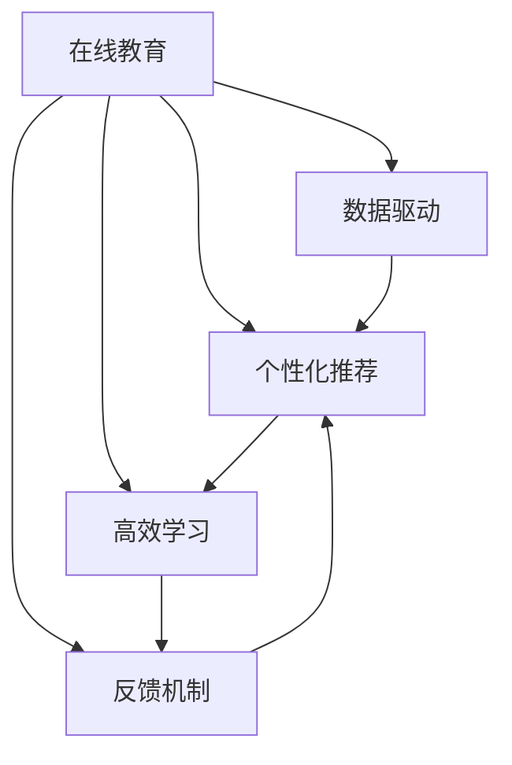

                 

# 如何打造高转换率的程序员知识课程

> 关键词：在线教育, 数据驱动, 个性化推荐, 高效学习, 反馈机制

## 1. 背景介绍

随着信息技术的高速发展，编程能力已成为跨行业的基础技能。然而，培养高素质的程序员并非易事。如何在有限的时间内，让学员快速掌握编程技能，同时提升他们的思维能力和问题解决能力？近年来，许多在线教育平台通过数据驱动、个性化推荐和高效学习等方法，打造了一系列高转换率的程序员知识课程。本文将深入探讨这些课程的设计理念和核心技术，助力开发者打造更具吸引力和效果的学习体验。

## 2. 核心概念与联系

### 2.1 核心概念概述

在线编程教育课程的设计和优化，涉及多个关键概念：

- **在线教育**：利用互联网技术，提供灵活、互动的学习环境，支持学员自主学习。
- **数据驱动**：通过收集和分析学员的学习数据，不断优化课程内容和学习路径，提升学习效果。
- **个性化推荐**：根据学员的学习行为和特征，推荐最适合的课程资源，提升学习效率。
- **高效学习**：通过互动、反馈等机制，提升学员的学习动机和参与度，加速知识掌握。
- **反馈机制**：实时反馈学员的学习进度和问题，帮助其及时调整学习策略，提高学习效果。

这些概念之间互相联系，共同构成了高转换率课程的核心框架。以下是一个Mermaid流程图，展示了这些概念之间的逻辑关系：



该图展示了在线教育平台通过数据驱动来支撑个性化推荐和高效学习，同时反馈机制也参与到整个学习流程中，以确保学员的学习体验和效果。

## 3. 核心算法原理 & 具体操作步骤

### 3.1 算法原理概述

高转换率程序员知识课程的设计，主要基于以下几个核心算法原理：

- **机器学习推荐算法**：通过分析学员的历史学习行为和偏好，推荐最适合的课程资源。
- **自适应学习算法**：根据学员的学习进度和理解程度，动态调整课程难度和内容，实现个性化学习。
- **反馈循环算法**：通过实时反馈和互动，及时调整学习策略，提高学习效果。

这些算法原理相互配合，共同构建了课程的高转换率基础。

### 3.2 算法步骤详解

以下是一个高转换率课程的设计流程，涵盖了从数据收集、个性化推荐到反馈循环的全过程：

**Step 1: 数据收集和处理**
- 收集学员的登录时间、课程完成度、测试成绩等数据。
- 对数据进行清洗和预处理，去除噪音和异常值，确保数据的质量和一致性。

**Step 2: 个性化推荐**
- 利用机器学习算法（如协同过滤、内容推荐等），分析学员的学习数据，构建用户画像。
- 根据用户画像，推荐与学员兴趣和学习进度相匹配的课程内容。

**Step 3: 自适应学习**
- 利用自适应学习算法（如K近邻算法、决策树等），根据学员的学习进度和测试成绩，动态调整课程难度和内容。
- 将学员的学习进度与课程的知识点关联，生成个性化的学习路径。

**Step 4: 反馈循环**
- 实时监控学员的学习状态，通过测试和互动任务收集反馈。
- 根据反馈结果，调整课程内容和难度，优化学习路径。
- 利用自然语言处理技术，自动生成反馈报告，帮助学员自我评估和调整学习策略。

### 3.3 算法优缺点

高转换率课程的算法优点在于：

- **精准推荐**：通过数据驱动和个性化推荐，学员能够获得最适合的学习资源，提升学习效率。
- **个性化学习**：自适应算法能够根据学员的学习进度和理解程度，动态调整课程内容和难度，实现个性化学习。
- **即时反馈**：反馈循环机制能够及时发现学员的学习问题，调整学习策略，提升学习效果。

然而，这些算法也存在一些缺点：

- **数据隐私问题**：数据驱动和个性化推荐需要收集大量学员数据，可能引发隐私和安全问题。
- **算法复杂性**：自适应算法和反馈循环机制涉及复杂的机器学习模型，实现难度较大。
- **资源消耗**：实时数据处理和算法优化需要大量的计算资源，可能导致系统延迟。

### 3.4 算法应用领域

高转换率课程的算法和理念，已经广泛应用于各种在线编程教育平台，包括：

- **Coursera**：利用数据驱动和个性化推荐，提供高质量的编程课程和项目。
- **Udacity**：通过自适应学习算法，动态调整课程难度和内容，实现个性化学习。
- **edX**：采用反馈循环机制，实时监控学员的学习状态，调整学习策略。

## 4. 数学模型和公式 & 详细讲解 & 举例说明

### 4.1 数学模型构建

一个典型的在线编程教育平台可以通过以下几个数学模型来描述学员的学习过程：

- **学员画像模型**：通过学员的学习行为数据，构建用户画像，描述学员的学习兴趣和能力。
- **推荐模型**：利用协同过滤、内容推荐等算法，推荐最适合学员的课程内容。
- **自适应模型**：利用K近邻算法、决策树等算法，动态调整课程难度和内容，实现个性化学习。
- **反馈模型**：通过测试和互动任务收集反馈，构建反馈循环，优化学习路径。

### 4.2 公式推导过程

以下是一个简化的推荐模型推导过程：

假设学员的学习数据为 $D=\{(x_i,y_i)\}_{i=1}^N$，其中 $x_i$ 为学员的学习行为，$y_i$ 为推荐的课程内容。推荐模型 $M$ 的推导目标是最小化预测误差 $L$：

$$
L(M)=\sum_{i=1}^N \ell(M(x_i),y_i)
$$

其中 $\ell$ 为损失函数，例如均方误差损失函数。推荐模型的输入为学员的学习行为 $x_i$，输出为推荐的课程内容 $y_i$。利用梯度下降等优化算法，不断更新模型参数 $\theta$，最小化预测误差 $L$。

### 4.3 案例分析与讲解

以Coursera为例，其推荐系统基于协同过滤算法，分析学员的学习行为和课程评分，预测学员可能感兴趣的其他课程。Coursera的推荐模型如下：

$$
\hat{y}_i = M_{\theta}(x_i)
$$

其中 $M_{\theta}$ 为协同过滤模型，$\theta$ 为模型参数。推荐模型的训练过程为：

1. 收集学员的学习行为 $x_i$ 和课程评分 $y_i$。
2. 利用梯度下降算法，最小化预测误差 $L$。
3. 更新模型参数 $\theta$，得到推荐模型 $M_{\theta}$。
4. 对新的学员行为 $x'$，利用推荐模型 $M_{\theta}$ 预测推荐内容 $\hat{y}'$。

## 5. 项目实践：代码实例和详细解释说明

### 5.1 开发环境搭建

要实现高转换率课程的设计，需要一个支持机器学习和数据处理的开发环境。以下是一些常用的开发工具：

- **Python**：提供丰富的机器学习库（如Scikit-Learn、TensorFlow等）和数据处理库（如Pandas、NumPy等）。
- **R**：擅长数据统计和可视化，适合大规模数据处理。
- **Jupyter Notebook**：支持交互式编程和数据可视化，适合机器学习算法开发。

### 5.2 源代码详细实现

以下是一个使用Python实现的推荐系统示例：

```python
import pandas as pd
from sklearn.neighbors import NearestNeighbors
from sklearn.metrics.pairwise import cosine_similarity

# 读取学员学习数据
data = pd.read_csv('learning_data.csv')

# 构建相似度矩阵
similarity_matrix = cosine_similarity(data)

# 训练K近邻模型
knn = NearestNeighbors(n_neighbors=5, algorithm='brute')
knn.fit(similarity_matrix)

# 预测推荐课程
def recommend_course(user_id):
    user_vector = data.iloc[user_id].to_numpy()
    similarities = knn.kneighbors([user_vector])[0]
    recommendations = data.iloc[similarities].index.tolist()
    return recommendations

# 测试推荐系统
recommendations = recommend_course(100)
print(recommendations)
```

该代码实现了基于余弦相似度的K近邻推荐算法，用于推荐学员可能感兴趣的课程。

### 5.3 代码解读与分析

以下是代码的详细解读和分析：

- 数据读取：使用Pandas库读取学员学习数据，包括学习行为和课程评分。
- 相似度矩阵：计算学员之间的相似度，构建相似度矩阵。
- K近邻模型：利用Scikit-Learn库训练K近邻模型，选择k=5作为近邻数量。
- 推荐课程：根据学员的相似度向量，使用K近邻模型预测推荐课程。
- 测试推荐系统：测试推荐系统，输出推荐的课程列表。

## 6. 实际应用场景

### 6.1 在线编程教育平台

高转换率课程的算法和理念，在在线编程教育平台中得到了广泛应用。Coursera、Udacity、edX等平台通过数据驱动和个性化推荐，提升了课程的吸引力和效果。学员可以在这些平台上自主学习，获得个性化的学习路径和实时反馈，大幅提升学习效率。

### 6.2 企业内部培训

许多企业利用高转换率课程的设计理念，开发内部培训系统。通过数据收集和分析，企业可以了解员工的学习需求和进度，设计符合企业实际需求的培训课程。实时反馈和互动机制，帮助员工及时调整学习策略，提高培训效果。

### 6.3 在线学习社区

在线学习社区也采用了高转换率课程的算法和理念，通过个性化推荐和自适应学习，提升学习体验和效果。例如，Codecademy利用机器学习算法，推荐与学员兴趣和进度相匹配的编程课程，帮助学员快速掌握编程技能。

## 7. 工具和资源推荐

### 7.1 学习资源推荐

为了帮助开发者系统掌握高转换率课程的设计和优化方法，以下是一些优质的学习资源：

- **Coursera机器学习课程**：由斯坦福大学Andrew Ng教授主讲，介绍了机器学习的基本原理和算法，适合初学者入门。
- **TensorFlow官方文档**：提供丰富的机器学习算法和数据处理库，适合进阶学习。
- **Python机器学习**：提供了丰富的案例和代码示例，适合实战练习。
- **Udacity的AI Nanodegree**：提供系统的机器学习和深度学习课程，适合系统学习。

### 7.2 开发工具推荐

高转换率课程的开发需要多工具支持。以下是一些常用的开发工具：

- **Python**：支持机器学习和数据处理，适合高转换率课程的算法开发。
- **TensorFlow**：由Google主导开发的深度学习框架，支持大规模机器学习模型的训练和部署。
- **Jupyter Notebook**：交互式编程和数据可视化工具，适合算法开发和实验。
- **R**：擅长数据统计和可视化，适合大规模数据处理。

### 7.3 相关论文推荐

高转换率课程的设计和优化涉及多学科知识，以下是几篇奠基性的相关论文，推荐阅读：

- **Online Learning with Low Latency**：介绍了在线学习的算法和优化方法，适用于实时反馈机制。
- **Collaborative Filtering**：介绍了协同过滤算法，用于推荐系统的实现。
- **Adaptive Learning System**：介绍了自适应学习算法，适用于个性化学习路径的生成。
- **Reinforcement Learning for Online Education**：介绍了强化学习在在线教育中的应用，用于学习策略的优化。

## 8. 总结：未来发展趋势与挑战

### 8.1 总结

本文对高转换率程序员知识课程的设计和优化进行了全面系统的介绍。通过数据驱动和个性化推荐，高转换率课程提升了学员的学习效果和体验，满足了不同学员的学习需求。同时，自适应学习和反馈循环机制，进一步优化了学习路径和策略。这些技术和理念的结合，使在线编程教育迈向了一个新的高度。

## 8.2 未来发展趋势

展望未来，高转换率课程的发展趋势如下：

- **智能化推荐**：随着AI技术的进步，推荐算法将更加智能化，能够根据学员的学习数据和行为，实时调整推荐内容。
- **个性化学习**：自适应算法将更加复杂和高效，能够动态调整课程内容和难度，实现更精准的个性化学习。
- **实时反馈**：反馈机制将更加智能和及时，帮助学员实时调整学习策略，提高学习效果。

## 8.3 面临的挑战

尽管高转换率课程在在线教育中取得了显著成效，但仍面临一些挑战：

- **数据隐私问题**：数据驱动和个性化推荐需要收集大量学员数据，可能引发隐私和安全问题。
- **算法复杂性**：自适应算法和反馈循环机制涉及复杂的机器学习模型，实现难度较大。
- **资源消耗**：实时数据处理和算法优化需要大量的计算资源，可能导致系统延迟。

## 8.4 研究展望

未来的研究需要在以下几个方面寻求新的突破：

- **隐私保护技术**：开发更加安全的隐私保护算法，确保学员数据的安全性和隐私性。
- **轻量级算法**：开发轻量级自适应算法和反馈算法，减少计算资源消耗，提高系统响应速度。
- **多模态学习**：将视觉、听觉等多模态数据引入学习过程中，提升学习效果和体验。
- **元学习**：利用元学习算法，训练学员的学习策略，提升学习效率和效果。

这些研究方向的探索，必将引领高转换率课程迈向更高的台阶，为构建更加高效、个性化的在线教育平台铺平道路。

## 9. 附录：常见问题与解答

**Q1: 数据驱动和个性化推荐是否会对学员的隐私造成威胁？**

A: 数据驱动和个性化推荐需要收集学员的个人信息和行为数据，可能引发隐私问题。为保护学员隐私，可以采用以下措施：
- 数据匿名化：对数据进行匿名化处理，确保数据无法直接识别学员身份。
- 数据加密：对敏感数据进行加密处理，确保数据传输和存储的安全性。
- 数据访问控制：限制数据访问权限，确保只有授权人员才能访问数据。

**Q2: 自适应学习算法的实现难度较大，如何降低算法复杂性？**

A: 降低自适应学习算法的复杂性，可以采用以下方法：
- 简化模型结构：使用简单的线性回归模型或决策树模型，降低计算复杂度。
- 渐进式训练：将课程难度分为多个阶段，逐步调整学习路径。
- 启发式算法：使用启发式算法（如贪心算法、遗传算法等），优化学习策略。

**Q3: 实时反馈机制如何确保系统的实时性？**

A: 确保实时反馈机制的实时性，可以采用以下措施：
- 分布式计算：利用分布式计算框架（如Spark、Hadoop等），并行处理数据。
- 数据缓存：对常用数据进行缓存，减少数据读取时间。
- 算法优化：优化算法实现，减少计算时间。

**Q4: 高转换率课程的开发需要多学科知识，如何快速上手？**

A: 快速上手高转换率课程的开发，可以采取以下步骤：
- 学习基础课程：掌握机器学习、数据处理等基础知识，打好理论基础。
- 实践项目：参与实际项目，通过实践积累经验。
- 学习社区：加入学习社区，与同行交流学习心得，获取帮助。

这些问题的解答，希望能为高转换率课程的开发者提供参考，助力其在实际应用中取得更好的效果。

---

作者：禅与计算机程序设计艺术 / Zen and the Art of Computer Programming

