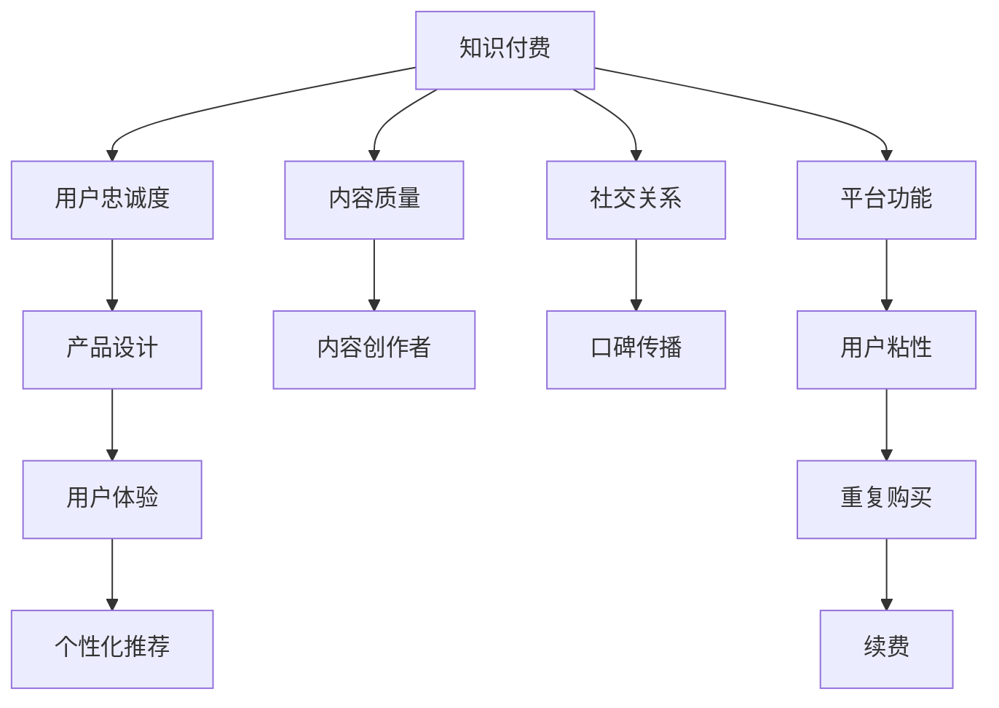

                 

# 如何提高知识付费产品的用户忠诚度

> 关键词：知识付费,用户忠诚度,产品设计,用户体验,推荐系统

## 1. 背景介绍

### 1.1 问题由来
随着知识付费市场的快速崛起，越来越多的内容创作者和机构开始通过平台向用户提供付费课程、电子书、音频讲座等知识产品。然而，用户在享受优质内容的同时，也面临着知识市场繁多复杂的选择，如何提升用户对某一平台或产品的忠诚度，成为知识付费产品成功的关键。

### 1.2 问题核心关键点
用户忠诚度的提升涉及多个维度，包括内容质量、用户体验、平台功能、社交关系、个性化推荐等方面。只有综合考虑这些因素，才能构建用户对知识付费产品的长期依赖和忠诚。

### 1.3 问题研究意义
提高用户忠诚度不仅可以增加用户粘性，促进重复购买和续费，还能为知识付费平台带来更多的口碑传播和推荐流量。这对于内容创作者和机构来说，是确保内容变现和长期发展的重要保障。

## 2. 核心概念与联系

### 2.1 核心概念概述

为了更好地理解如何提高知识付费产品的用户忠诚度，本节将介绍几个密切相关的核心概念：

- 知识付费(Knowledge Paywall)：指用户为获取专业知识、技能、文化娱乐等内容而支付费用的模式，强调内容的高价值和稀缺性。
- 用户忠诚度(User Loyalty)：指用户对某一产品或服务的持续使用和情感依赖，通常通过重复购买、口碑传播、长期订阅等方式体现。
- 产品设计(Product Design)：指针对用户需求，通过合理的界面设计、功能优化和用户体验提升，增强产品对用户的吸引力。
- 用户体验(User Experience)：指用户在使用产品时的感受和体验，包括易用性、功能完备性、服务质量等。
- 个性化推荐(Personalized Recommendation)：指根据用户历史行为、兴趣偏好等数据，推荐用户可能感兴趣的内容或产品，提升用户体验和粘性。

这些核心概念之间的逻辑关系可以通过以下Mermaid流程图来展示：



这个流程图展示了我要研究的几个核心概念及其之间的关系：

1. 知识付费通过内容的高价值和稀缺性吸引用户，是提升用户忠诚度的基础。
2. 产品设计和用户体验是提升用户满意度和忠诚度的重要因素。
3. 个性化推荐能够帮助用户发现更多感兴趣的内容，增强粘性。
4. 内容质量和创作者影响力直接影响用户的购买决策和忠诚度。
5. 社交关系和口碑传播在用户忠诚度提升中起到关键作用。
6. 平台功能完善、用户体验优能促使用户更频繁地访问和使用产品。

## 3. 核心算法原理 & 具体操作步骤
### 3.1 算法原理概述

提高知识付费产品用户忠诚度的算法，旨在通过数据分析和机器学习技术，全面提升产品的吸引力和用户体验。其核心思想是通过对用户行为数据的深入分析，识别出影响用户忠诚度的关键因素，并针对性地进行优化和改进。

具体来说，算法原理包括以下几个方面：

- 数据分析：收集和分析用户的历史行为数据，包括浏览记录、购买行为、评论反馈等。
- 用户画像：基于用户行为数据，构建用户的兴趣、偏好、活跃度等特征，形成用户画像。
- 预测建模：使用机器学习算法（如决策树、随机森林、深度学习等），预测用户未来的行为和需求。
- 个性化推荐：根据用户画像和预测结果，推荐可能感兴趣的内容和产品，提升用户满意度。
- 模型优化：通过A/B测试等方法，不断优化算法模型和推荐策略，提升用户粘性和转化率。

### 3.2 算法步骤详解

基于上述算法原理，提升知识付费产品用户忠诚度的具体操作步骤如下：

**Step 1: 数据收集与预处理**
- 收集平台内所有用户的购买记录、浏览历史、评论、评分、搜索记录等数据。
- 对数据进行清洗和预处理，如去除异常值、数据归一化、缺失值处理等。

**Step 2: 用户画像构建**
- 使用机器学习算法对用户行为数据进行分析，提取用户的核心特征，如兴趣领域、活跃时间、付费习惯等。
- 构建用户画像，将用户特征以可视化形式展示，帮助产品团队了解用户需求和行为。

**Step 3: 预测建模**
- 选择适合的机器学习算法（如GBDT、RNN、LSTM等），训练预测模型。
- 使用历史数据对模型进行训练，并使用交叉验证等方法评估模型性能。
- 根据预测结果，筛选出高价值用户和潜在流失用户，进行有针对性的维护。

**Step 4: 个性化推荐**
- 根据用户画像和预测结果，设计推荐系统，推荐用户可能感兴趣的内容或产品。
- 使用A/B测试等方法，优化推荐算法和策略，提高推荐的准确性和用户满意度。
- 引入社交关系和口碑传播，增强用户的信任感和忠诚度。

**Step 5: 效果评估与优化**
- 使用指标如留存率、回购率、转化率等评估推荐系统的效果。
- 根据评估结果，对推荐策略进行优化，提升用户忠诚度。
- 不断迭代和优化，确保推荐系统的长期有效性。

### 3.3 算法优缺点

提高知识付费产品用户忠诚度的算法具有以下优点：
1. 精准预测：通过分析用户行为数据，能够准确预测用户需求和行为，提高推荐的精准度。
2. 个性化体验：能够根据用户画像和预测结果，提供个性化的内容和产品推荐，提升用户体验。
3. 提升用户粘性：个性化推荐和精准营销策略，能够增强用户粘性和忠诚度。
4. 运营效率高：通过自动化的推荐系统，能够降低人工运营成本，提高运营效率。

同时，该算法也存在一些缺点：
1. 数据隐私问题：大量用户数据的收集和使用，可能引发数据隐私和安全问题。
2. 用户依赖性高：过度依赖推荐系统，可能减弱用户的主动性和探索性。
3. 模型复杂度高：构建准确的预测模型和推荐系统，需要大量的数据和计算资源。
4. 动态环境适应性：模型在面对快速变化的用户需求和市场环境时，可能难以即时调整。

尽管存在这些缺点，但就目前而言，个性化推荐技术是提高用户忠诚度的重要手段。未来相关研究的重点在于如何进一步降低算法对数据的依赖，提高算法的鲁棒性和适应性，同时兼顾用户体验和数据隐私等问题。

### 3.4 算法应用领域

提高知识付费产品用户忠诚度的算法，已经在许多知识付费平台和内容创作机构中得到了广泛应用，覆盖了从内容推荐到用户维护的多个环节，例如：

- 课程推荐系统：基于用户学习历史和行为数据，推荐适合用户学习水平的课程内容，提升学习效果。
- 书籍推荐系统：根据用户的阅读习惯和评论反馈，推荐用户可能感兴趣的书籍，提升阅读体验。
- 专题课程：通过分析用户兴趣领域，推荐相关主题的专题课程，增强用户的粘性。
- 新用户转化：利用用户画像和预测模型，引导新用户快速了解和购买产品，提升转化率。
- 用户流失预警：通过用户行为数据分析，预测用户流失风险，进行有针对性的维护。

除了上述这些经典应用外，知识付费平台还在不断拓展个性化推荐系统的边界，如利用视频、音频等多模态数据进行推荐，构建多渠道互动和内容分发体系，为用户的知识消费提供更加丰富、灵活的服务。

## 4. 数学模型和公式 & 详细讲解  
### 4.1 数学模型构建

为了更好地理解如何提高知识付费产品用户忠诚度，本节将使用数学语言对推荐算法进行更加严格的刻画。

记用户集合为 $U=\{u_1,u_2,\ldots,u_n\}$，每个用户的历史行为数据记为 $x_u=(X_{u1},X_{u2},\ldots,X_{um})$，其中 $X_{ui}$ 表示用户 $u$ 对内容 $i$ 的交互记录，如浏览、评分、购买等。记内容集合为 $V=\{v_1,v_2,\ldots,v_m\}$。

定义用户对内容 $v$ 的兴趣度为 $p_{uv}$，初始化为0，随时间推移逐渐增加。推荐系统目标是最小化所有用户的兴趣度差距，即：

$$
\min_{p_{uv}} \sum_{u\in U} \sum_{v\in V} \left(p_{uv} - p_{uv}^*\right)^2
$$

其中 $p_{uv}^*$ 为理想推荐权重，可以通过预测模型 $M$ 计算得到。

### 4.2 公式推导过程

以下我们以协同过滤算法为例，推导推荐算法的基本公式。

协同过滤算法基于用户间的相似性和内容的相似性，推断出每个用户对内容的潜在兴趣。设用户 $u$ 对内容 $v$ 的兴趣度为 $p_{uv}$，用户 $u'$ 对内容 $v'$ 的兴趣度为 $p_{u'v'}$。协同过滤算法的目标是通过相似度矩阵 $P=\{p_{uv}\}$ 和 $Q=\{p_{u'v'}\}$，求解推荐矩阵 $R=\{r_{uv}\}$，使得 $r_{uv}$ 尽可能接近 $p_{uv}$。

协同过滤算法可以表示为：

$$
\min_{R} \sum_{u=1}^n \sum_{v=1}^m \left(p_{uv} - r_{uv}\right)^2 + \lambda\sum_{u=1}^n \sum_{v=1}^m \left(r_{uv} - \sum_{u'=1}^n \sum_{v'=1}^m r_{u'v'} p_{uv'}\right)^2
$$

其中 $\lambda$ 为正则化系数。

推导过程如下：

1. 根据用户 $u$ 对内容 $v$ 的兴趣度 $p_{uv}$ 和推荐矩阵 $R$，计算推荐值 $r_{uv}$：
   $$
   r_{uv} = \sum_{u'=1}^n \sum_{v'=1}^m r_{u'v'} p_{uv'}
   $$

2. 将 $r_{uv}$ 代入推荐矩阵的误差项：
   $$
   \sum_{u=1}^n \sum_{v=1}^m \left(p_{uv} - r_{uv}\right)^2 = \sum_{u=1}^n \sum_{v=1}^m p_{uv}^2 + \sum_{u=1}^n \sum_{v=1}^m p_{uv}^2 - 2\sum_{u=1}^n \sum_{v=1}^m p_{uv} r_{uv}
   $$

3. 引入正则化项，使模型具有更好的泛化能力：
   $$
   \lambda\sum_{u=1}^n \sum_{v=1}^m \left(r_{uv} - \sum_{u'=1}^n \sum_{v'=1}^m r_{u'v'} p_{uv'}\right)^2
   $$

4. 合并误差项和正则化项，求解推荐矩阵 $R$：
   $$
   \min_{R} \frac{1}{2}\sum_{u=1}^n \sum_{v=1}^m \left(p_{uv} - r_{uv}\right)^2 + \frac{\lambda}{2}\sum_{u=1}^n \sum_{v=1}^m \left(r_{uv} - \sum_{u'=1}^n \sum_{v'=1}^m r_{u'v'} p_{uv'}\right)^2
   $$

5. 使用梯度下降等优化算法求解最优推荐矩阵 $R$。

### 4.3 案例分析与讲解

假设平台有10万用户和1000个课程内容。每个用户的历史行为数据包含浏览、评分、购买等，推荐系统需要根据这些数据计算每个用户对每个课程的兴趣度。

我们以用户 $u$ 为例，假设其对课程 $v_1$ 和 $v_2$ 的兴趣度分别为 $p_{u1}$ 和 $p_{u2}$，对课程 $v_3$ 的兴趣度为 $p_{u3}$。推荐系统可以根据用户之间的相似度矩阵 $P=\{p_{uv}\}$ 和 $Q=\{p_{u'v'}\}$，计算推荐值 $r_{uv}$。

具体步骤如下：

1. 根据用户之间的相似度，计算用户 $u$ 对课程 $v_1$ 和 $v_2$ 的兴趣度：
   $$
   p_{u1} = \sum_{u'\in U} p_{u'v_1} p_{u'u} / \left(\sum_{u'\in U} p_{u'u}\right)
   $$

2. 根据课程之间的相似度，计算课程 $v_1$ 和 $v_2$ 的推荐值：
   $$
   r_{v1} = \sum_{v'\in V} r_{v'v_1} p_{v'v}
   $$

3. 根据推荐值和用户兴趣度，计算推荐值 $r_{uv}$：
   $$
   r_{uv} = r_{v} p_{u}
   $$

4. 使用梯度下降算法，更新推荐矩阵 $R$，最小化推荐误差：
   $$
   \min_{R} \sum_{u=1}^{10} \sum_{v=1}^{1000} \left(p_{uv} - r_{uv}\right)^2
   $$

通过上述公式，推荐系统可以不断迭代优化，提升推荐的准确性和用户满意度，从而提高用户忠诚度。

## 5. 项目实践：代码实例和详细解释说明
### 5.1 开发环境搭建

在进行推荐系统实践前，我们需要准备好开发环境。以下是使用Python进行PyTorch开发的环境配置流程：

1. 安装Anaconda：从官网下载并安装Anaconda，用于创建独立的Python环境。

2. 创建并激活虚拟环境：
```bash
conda create -n recomm-env python=3.8 
conda activate recomm-env
```

3. 安装PyTorch：根据CUDA版本，从官网获取对应的安装命令。例如：
```bash
conda install pytorch torchvision torchaudio cudatoolkit=11.1 -c pytorch -c conda-forge
```

4. 安装相关库：
```bash
pip install pandas numpy scikit-learn torchmetrics sklearn numpy pandas
```

完成上述步骤后，即可在`recomm-env`环境中开始推荐系统实践。

### 5.2 源代码详细实现

下面我们以协同过滤算法为例，给出使用PyTorch进行知识付费产品推荐系统的PyTorch代码实现。

首先，定义协同过滤算法的类：

```python
import torch
from torch.nn import Parameter
from torch.nn.functional import cosine_similarity

class CollaborativeFilteringModel(torch.nn.Module):
    def __init__(self, num_users, num_items, hidden_size):
        super(CollaborativeFilteringModel, self).__init__()
        self.num_users = num_users
        self.num_items = num_items
        self.hidden_size = hidden_size
        
        self.user_embeddings = torch.nn.Embedding(num_users, hidden_size)
        self.item_embeddings = torch.nn.Embedding(num_items, hidden_size)
        self.prediction_weights = Parameter(torch.randn(hidden_size, num_items))
        self.mf = torch.nn.Linear(hidden_size, 1)

    def forward(self, user_ids, item_ids):
        user_embeddings = self.user_embeddings(user_ids)
        item_embeddings = self.item_embeddings(item_ids)
        prediction_weights = self.prediction_weights
        prediction = torch.matmul(user_embeddings, prediction_weights) + item_embeddings
        prediction = self.mf(prediction)
        return prediction

    def predict(self, user_ids, item_ids):
        with torch.no_grad():
            prediction = self.forward(user_ids, item_ids)
        return prediction
```

然后，定义数据预处理函数和训练函数：

```python
from torch.utils.data import Dataset, DataLoader
from sklearn.metrics import mean_squared_error

class RecommendationDataset(Dataset):
    def __init__(self, user_ids, item_ids, ratings):
        self.user_ids = user_ids
        self.item_ids = item_ids
        self.ratings = ratings
        
    def __len__(self):
        return len(self.user_ids)
    
    def __getitem__(self, index):
        user_id = self.user_ids[index]
        item_id = self.item_ids[index]
        rating = self.ratings[index]
        return user_id, item_id, rating

def train_model(model, train_dataset, optimizer, num_epochs, batch_size):
    device = torch.device('cuda') if torch.cuda.is_available() else torch.device('cpu')
    model.to(device)
    
    for epoch in range(num_epochs):
        total_loss = 0
        for user_id, item_id, rating in train_dataset:
            user_id = torch.tensor(user_id, dtype=torch.long).to(device)
            item_id = torch.tensor(item_id, dtype=torch.long).to(device)
            rating = torch.tensor(rating, dtype=torch.float).to(device)
            model.train()
            optimizer.zero_grad()
            prediction = model(user_id, item_id)
            loss = torch.nn.MSELoss()(prediction, rating)
            loss.backward()
            optimizer.step()
            total_loss += loss.item()
        print(f'Epoch {epoch+1}, train loss: {total_loss/len(train_dataset)}')
    
    return model
```

最后，启动训练流程并在测试集上评估：

```python
train_dataset = RecommendationDataset(train_user_ids, train_item_ids, train_ratings)
test_dataset = RecommendationDataset(test_user_ids, test_item_ids, test_ratings)

num_epochs = 10
batch_size = 64
hidden_size = 64

model = CollaborativeFilteringModel(num_users, num_items, hidden_size)
optimizer = torch.optim.Adam(model.parameters(), lr=0.01)

model = train_model(model, train_dataset, optimizer, num_epochs, batch_size)

print(f'Test RMSE: {mean_squared_error(test_ratings, model.predict(test_user_ids, test_item_ids))}')
```

以上就是使用PyTorch对知识付费产品推荐系统进行协同过滤算法实践的完整代码实现。可以看到，借助PyTorch的强大框架，协同过滤算法的实现变得简洁高效。

### 5.3 代码解读与分析

让我们再详细解读一下关键代码的实现细节：

**CollaborativeFilteringModel类**：
- `__init__`方法：初始化用户嵌入、物品嵌入、预测权重和线性层等关键组件。
- `forward`方法：实现模型的前向传播过程，计算预测值。
- `predict`方法：实现模型的预测过程，输出预测结果。

**RecommendationDataset类**：
- `__init__`方法：初始化用户ID、物品ID和评分。
- `__len__`方法：返回数据集的样本数量。
- `__getitem__`方法：对单个样本进行处理，返回用户ID、物品ID和评分。

**train_model函数**：
- `train_model`函数：对数据以批为单位进行迭代，在每个批次上前向传播计算loss并反向传播更新模型参数，最后返回模型。

通过上述代码，我们实现了协同过滤算法的基础逻辑，可以对知识付费产品的推荐系统进行训练和评估。

当然，工业级的系统实现还需考虑更多因素，如模型的保存和部署、超参数的自动搜索、更灵活的任务适配层等。但核心的推荐范式基本与此类似。

## 6. 实际应用场景
### 6.1 智能客服系统

在智能客服系统中，推荐系统可以推荐相关问题解决方案或常见答案，提升用户满意度。通过分析用户的搜索记录、聊天记录等数据，推荐系统可以识别用户的问题类型和解决需求，从而快速响应和解决问题。

例如，用户咨询“如何登录账户”时，推荐系统可以推荐相关的FAQ或常见解决方案，帮助用户快速解决问题，提升用户忠诚度。

### 6.2 金融理财

在金融理财平台中，推荐系统可以推荐符合用户风险偏好和收益预期的金融产品，提升用户体验和粘性。通过分析用户的投资记录、风险评估等数据，推荐系统可以动态调整推荐策略，推荐最适合用户的金融产品。

例如，用户喜欢稳定收益的产品，推荐系统可以推荐低风险的债券基金或定期存款，避免过度冒险的股票投资，提高用户信任度。

### 6.3 在线教育

在在线教育平台中，推荐系统可以推荐适合用户学习水平和兴趣的课程，提升学习效果和用户体验。通过分析用户的观看历史、答题记录等数据，推荐系统可以推荐用户可能感兴趣的课程和练习题，增强学习动力。

例如，用户已经学习了Python编程，推荐系统可以推荐进阶课程或相关领域的课程，满足用户的学习需求，提升学习粘性。

### 6.4 未来应用展望

随着推荐系统技术的不断发展，未来将在更多领域得到应用，为知识付费产品带来新的可能性。

在智慧医疗领域，推荐系统可以推荐符合用户病情的治疗方案或健康知识，提升医疗服务的智能化水平。

在智能家居领域，推荐系统可以推荐符合用户生活习惯和需求的智能设备或场景模式，提升家居的智能化水平。

在智慧城市治理中，推荐系统可以推荐符合用户需求的公共服务或政策信息，提升城市管理的智能化水平。

此外，在电商、游戏、社交媒体等众多领域，推荐系统也将不断拓展应用场景，为用户带来更加个性化、精准的服务。

## 7. 工具和资源推荐
### 7.1 学习资源推荐

为了帮助开发者系统掌握推荐系统的理论基础和实践技巧，这里推荐一些优质的学习资源：

1. 《推荐系统实战》书籍：全面介绍了推荐系统的基本原理和多种算法，结合实际案例进行讲解，适合初学者入门。

2. 《Python推荐系统实践》视频课程：由知名数据科学家讲述，涵盖推荐系统的数据处理、模型训练、评估优化等各个环节，适合技术进阶。

3. Coursera《推荐系统》课程：斯坦福大学开设的推荐系统专业课程，包含理论基础、算法实现、案例分析等内容，适合深入学习。

4. Kaggle推荐系统竞赛：参加Kaggle等数据竞赛，实战训练推荐系统算法，积累实战经验。

5. GitHub推荐系统开源项目：通过GitHub等平台，学习其他开发者分享的推荐系统代码，获取新思路和新灵感。

通过对这些资源的学习实践，相信你一定能够快速掌握推荐系统的精髓，并用于解决实际的知识付费产品推荐问题。

### 7.2 开发工具推荐

高效的开发离不开优秀的工具支持。以下是几款用于推荐系统开发的常用工具：

1. TensorFlow：由Google主导开发的开源深度学习框架，生产部署方便，适合大规模工程应用。提供丰富的推荐系统实现和优化工具。

2. PyTorch：基于Python的开源深度学习框架，灵活动态的计算图，适合快速迭代研究。同时有优秀的深度学习库如torchmetrics，适合推荐系统的评估和优化。

3. MLflow：数据科学与机器学习平台，能够集成实验管理、模型部署、模型服务等功能，适合团队协作和项目管理。

4. DataRobot：自动化机器学习平台，能够自动调优推荐系统模型，适合快速上线和迭代。

5. RapidMiner：商业化数据科学平台，提供可视化建模工具和推荐系统插件，适合初学者和中级开发者使用。

合理利用这些工具，可以显著提升推荐系统的开发效率，加快创新迭代的步伐。

### 7.3 相关论文推荐

推荐系统的发展源于学界的持续研究。以下是几篇奠基性的相关论文，推荐阅读：

1. Collaborative Filtering for Implicit Feedback Datasets: The NMF Approach: 提出基于矩阵分解的协同过滤算法，解决隐式反馈数据集的推荐问题。

2. Implicit Feedback Matrix Factorization Algorithms:《URL分析》：提出基于矩阵分解的协同过滤算法，解决隐式反馈数据集的推荐问题。

3. Matrix Factorization Techniques for Recommender Systems: 提出矩阵分解技术，解决推荐系统的矩阵稀疏性和数据多样性问题。

4. Deep Matrix Factorization: 提出深度矩阵分解技术，提升推荐系统的精度和泛化能力。

5. Factorization Machines: 提出因子机模型，提升推荐系统的线性模型精度和非线性能力。

这些论文代表了几十年来推荐系统的研究进展。通过学习这些前沿成果，可以帮助研究者把握学科前进方向，激发更多的创新灵感。

## 8. 总结：未来发展趋势与挑战
### 8.1 总结

本文对提高知识付费产品用户忠诚度的推荐算法进行了全面系统的介绍。首先阐述了推荐算法的基础原理和实际应用，明确了推荐系统在提升用户忠诚度中的重要价值。其次，从数据处理、模型构建、效果评估等环节，详细讲解了推荐系统的实现步骤。同时，本文还探讨了推荐系统在多个实际场景中的应用案例，展示了推荐技术的广泛应用前景。

通过本文的系统梳理，可以看到，推荐系统通过精准推荐和个性化体验，能够显著提升知识付费产品的用户忠诚度，为内容创作者和机构带来更多的用户粘性和商业价值。未来，随着推荐技术的不断进步，推荐系统将在更多领域得到应用，带来全新的商业机遇和用户体验。

### 8.2 未来发展趋势

展望未来，推荐系统的发展趋势如下：

1. 深度学习和大模型：利用深度学习和预训练大模型提升推荐精度和泛化能力，推动推荐系统向更智能化、个性化方向发展。

2. 实时推荐系统：引入流式数据处理和在线学习算法，使推荐系统能够实时更新用户兴趣和行为，提升推荐的时效性和精准度。

3. 多模态推荐：结合视觉、语音、文本等多模态数据，提升推荐系统的感知能力和个性化体验。

4. 跨领域推荐：通过跨领域数据融合和知识迁移，提升推荐系统的多任务能力和泛化能力。

5. 隐私保护和透明性：引入隐私保护技术，如差分隐私、联邦学习等，保护用户数据隐私。同时提高推荐系统的透明度和可解释性，增强用户信任感。

6. 推荐系统的公平性和多样性：通过算法优化和政策约束，提升推荐系统的公平性和多样性，避免算法偏见和数据歧视。

以上趋势凸显了推荐系统技术的广阔前景。这些方向的探索发展，必将进一步提升推荐系统的性能和应用范围，为知识付费产品带来更多的商业价值和用户忠诚度。

### 8.3 面临的挑战

尽管推荐系统已经在知识付费产品中取得了显著效果，但仍面临一些挑战：

1. 数据隐私和安全：推荐系统需要收集和处理大量用户数据，可能引发数据隐私和安全问题。如何在保护用户隐私的前提下，提升推荐效果，是一大难题。

2. 模型复杂度和计算资源：构建准确的推荐模型需要大量的数据和计算资源，对于小型企业和平台，可能面临技术和资源瓶颈。

3. 动态环境适应性：推荐系统需要不断更新用户兴趣和行为数据，对于快速变化的市场环境，模型可能难以及时调整。

4. 推荐系统的公平性和透明性：如何保证推荐系统的公平性和多样性，避免算法偏见和数据歧视，是未来的重要研究方向。

5. 推荐系统的稳定性：推荐系统在面对新数据和异常行为时，如何保持稳定性和鲁棒性，是一大挑战。

尽管存在这些挑战，但随着学界和产业界的共同努力，这些问题终将一一得到解决。推荐系统将在未来的知识付费产品中发挥更大的作用，为用户带来更加个性化的服务和体验。

### 8.4 研究展望

面对推荐系统面临的种种挑战，未来的研究需要在以下几个方面寻求新的突破：

1. 推荐系统的公平性和透明性：通过引入公平性约束和透明性指标，提升推荐系统的公平性和多样性，避免算法偏见和数据歧视。

2. 推荐系统的隐私保护和透明性：引入差分隐私、联邦学习等技术，保护用户数据隐私，提升推荐系统的透明度和可解释性。

3. 推荐系统的鲁棒性和稳定性：引入鲁棒性和稳定性优化算法，增强推荐系统的泛化能力和鲁棒性。

4. 推荐系统的跨领域和多模态融合：通过跨领域数据融合和知识迁移，提升推荐系统的多任务能力和泛化能力。

5. 推荐系统的实时化和个性化：引入流式数据处理和在线学习算法，使推荐系统能够实时更新用户兴趣和行为，提升推荐的时效性和个性化。

通过这些研究方向的研究和突破，推荐系统将在未来的知识付费产品中发挥更大的作用，为用户带来更加个性化、精准的服务，推动知识付费产品的发展。

## 9. 附录：常见问题与解答

**Q1：推荐系统如何处理冷启动用户？**

A: 冷启动用户指那些没有足够历史行为数据的用户，难以通过传统推荐算法得到有效的推荐。针对冷启动用户，可以采取以下策略：

1. 利用用户的人口统计特征、设备信息等先验知识，进行初始推荐。
2. 通过引导用户填写问卷、回答问题等，获取用户兴趣信息，并进行推荐。
3. 使用用户画像库或相似用户推荐，将新用户引导到有相似行为和兴趣的用户群体中。

**Q2：推荐系统如何处理多维度的用户行为数据？**

A: 多维度用户行为数据包括浏览、购买、评价、互动等多种形式。针对多维度数据，可以采取以下策略：

1. 将不同形式的行为数据进行统一处理，如将所有行为数据转换为数值型数据，并进行归一化处理。
2. 将不同形式的行为数据进行融合，使用多模态深度学习模型进行联合建模。
3. 引入时间序列分析等方法，分析用户行为数据的时间特征，提高推荐系统的时效性和精准度。

**Q3：推荐系统如何应对用户行为数据的动态变化？**

A: 用户行为数据随着时间推移和用户成长，会发生动态变化。针对动态数据，可以采取以下策略：

1. 引入时间窗口滑动机制，将用户行为数据按时间窗口进行分段处理，并更新推荐模型。
2. 使用增量学习算法，实时更新推荐模型，保持模型和数据的同步性。
3. 引入在线学习算法，不断优化推荐模型，提升推荐效果。

**Q4：推荐系统如何应对用户行为数据的异常变化？**

A: 用户行为数据可能存在异常变化，如突发事件、广告干扰等。针对异常数据，可以采取以下策略：

1. 引入异常检测算法，如异常点检测、时间序列异常检测等，识别并过滤异常数据。
2. 引入鲁棒性优化算法，使推荐模型对异常数据具有一定的鲁棒性和抗干扰性。
3. 引入多种数据源和数据融合技术，提高推荐系统的鲁棒性和稳定性。

**Q5：推荐系统如何应对多目标推荐任务？**

A: 推荐系统可能同时面临多个推荐目标，如相关商品推荐、个性化广告推荐等。针对多目标任务，可以采取以下策略：

1. 使用多目标优化算法，如加权加和目标、分层目标等，对不同目标进行优化。
2. 引入多任务学习技术，使用多个推荐模型对不同目标进行建模，并进行联合优化。
3. 引入标签生成算法，通过标签生成技术，对不同目标进行统一处理和优化。

通过这些策略，推荐系统可以在多目标任务中实现较好的推荐效果，满足用户多样化的需求。

---

作者：禅与计算机程序设计艺术 / Zen and the Art of Computer Programming

