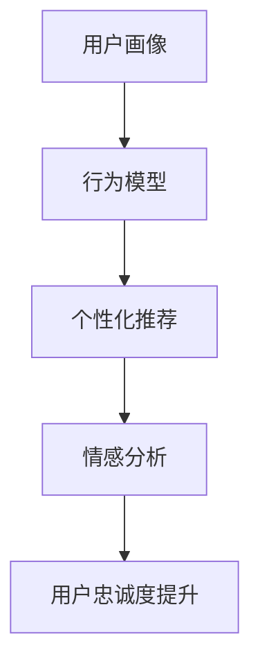

                 

# 如何提高知识付费产品的用户忠诚度

> 关键词：知识付费,用户忠诚度,数据驱动,个性化推荐,情感分析,用户反馈,行为模型,忠诚度提升

## 1. 背景介绍

随着互联网的发展和教育的普及，知识付费成为了越来越多用户获取知识的重要渠道。知识付费平台，如Coursera、Udemy、得到等，汇聚了大量高质量的课程和专业教育资源。然而，面对激烈的市场竞争，这些平台如何提高用户忠诚度，留住核心用户，成为关键问题。本文将从技术角度探讨如何利用数据驱动的方式，提升知识付费产品的用户忠诚度。

## 2. 核心概念与联系

### 2.1 核心概念概述

为更好地理解如何提高知识付费产品的用户忠诚度，我们首先介绍几个密切相关的核心概念：

- **用户忠诚度**：用户对知识付费产品的持续购买和使用程度，包括课程订阅、内容参与、社交互动等多个方面。
- **个性化推荐**：根据用户历史行为和偏好，推荐其可能感兴趣的课程内容，提升用户体验和满意度。
- **情感分析**：通过对用户评论、反馈等文本数据的情感倾向分析，了解用户对课程和平台的满意度。
- **行为模型**：描述用户行为数据的数学模型，通过历史数据训练出能够预测用户行为的概率分布，用于用户画像构建和行为预测。
- **用户画像**：通过综合用户行为数据，构建用户特征标签，帮助企业更好地理解目标用户群体。

这些核心概念通过数据驱动的方式相互关联，形成一套完整的用户忠诚度提升方案。

### 2.2 核心概念原理和架构的 Mermaid 流程图(Mermaid 流程节点中不要有括号、逗号等特殊字符)



该流程图展示了用户画像、行为模型、个性化推荐、情感分析与用户忠诚度提升之间的联系。

## 3. 核心算法原理 & 具体操作步骤

### 3.1 算法原理概述

提高知识付费产品用户忠诚度的关键在于个性化推荐和情感分析。个性化推荐能够根据用户的历史行为和兴趣，精准推荐符合用户需求的内容，提升用户满意度。情感分析则通过文本情感倾向分析，及时发现用户的不满和需求，快速调整产品策略，提高用户粘性。

具体来说，我们可以将用户忠诚度提升过程分为以下几个步骤：

1. 构建用户画像。
2. 基于用户画像进行个性化推荐。
3. 通过情感分析获取用户反馈。
4. 利用用户反馈不断优化推荐系统，提高用户忠诚度。

### 3.2 算法步骤详解

#### 步骤1: 构建用户画像

用户画像的构建需要依赖大量的用户行为数据，包括但不限于课程观看时长、互动评论次数、参与讨论频率、购买记录等。这些数据可以用于训练用户行为模型，描述用户在不同场景下的行为规律。

具体步骤如下：

1. 数据收集：从知识付费平台的数据库中提取用户行为数据，包括用户ID、课程ID、互动时间、观看时长、评论内容等。
2. 数据预处理：对数据进行清洗、去重、缺失值处理等预处理操作。
3. 特征提取：根据业务需求，从用户行为数据中提取特征，如课程难度、观看次数、互动频率等。
4. 模型训练：选择合适的模型（如协同过滤、矩阵分解、深度学习等），对用户行为数据进行训练，得到用户画像。

#### 步骤2: 个性化推荐

个性化推荐系统根据用户画像，预测用户可能感兴趣的课程内容，进行精准推荐。具体步骤如下：

1. 数据收集：获取用户画像数据，包括用户ID、课程ID、评分、观看时长等。
2. 数据预处理：对数据进行清洗、去重、缺失值处理等预处理操作。
3. 特征提取：根据业务需求，从用户画像数据中提取特征，如课程难度、观看次数、评分等。
4. 模型训练：选择合适的推荐算法（如协同过滤、矩阵分解、深度学习等），对用户画像数据进行训练，得到推荐模型。
5. 推荐预测：根据用户画像数据和推荐模型，预测用户可能感兴趣的课程，进行精准推荐。

#### 步骤3: 情感分析

情感分析通过对用户评论、反馈等文本数据的情感倾向分析，了解用户对课程和平台的满意度。具体步骤如下：

1. 数据收集：获取用户评论、反馈等文本数据。
2. 数据预处理：对文本数据进行清洗、去重、分词、去除停用词等预处理操作。
3. 情感识别：利用情感分析模型（如LSTM、BERT等），识别用户评论的情感倾向，分正面、负面、中性三类。
4. 情感分析结果：将情感分析结果汇总，分析用户对不同课程和平台的满意度。

#### 步骤4: 用户忠诚度提升

利用情感分析结果，对个性化推荐系统进行优化，提升用户忠诚度。具体步骤如下：

1. 数据收集：获取用户评论、反馈等文本数据。
2. 数据预处理：对文本数据进行清洗、去重、分词、去除停用词等预处理操作。
3. 情感识别：利用情感分析模型（如LSTM、BERT等），识别用户评论的情感倾向，分正面、负面、中性三类。
4. 用户画像优化：根据情感分析结果，调整用户画像模型，优化个性化推荐系统，提升用户忠诚度。

### 3.3 算法优缺点

个性化推荐和情感分析在提升知识付费产品用户忠诚度方面具有显著优势：

**优点：**

1. **提升用户体验**：通过个性化推荐，用户能够更快地找到感兴趣的课程内容，提升学习体验。
2. **提高用户满意度**：通过情感分析，及时了解用户对课程和平台的满意度，快速调整产品策略。
3. **降低流失率**：通过优化推荐系统，降低用户流失率，提高用户忠诚度。

**缺点：**

1. **数据隐私问题**：个性化推荐和情感分析需要依赖大量用户数据，可能涉及用户隐私保护问题。
2. **模型复杂度**：构建用户画像和推荐模型需要复杂的算法和大量计算资源，对技术要求较高。
3. **用户粘性不足**：单一的个性化推荐和情感分析可能不足以留住所有用户，需要多维度协同发力。

### 3.4 算法应用领域

基于个性化推荐和情感分析的用户忠诚度提升方法，已经广泛应用于各大知识付费平台，如Coursera、Udemy、得到等。这些平台通过数据驱动的方式，提升了用户体验和满意度，降低了用户流失率，提高了用户忠诚度。此外，该方法也适用于其他在线教育、内容订阅等领域，如Netflix、Amazon Prime等，通过个性化推荐和情感分析，提升用户粘性，提升用户体验。

## 4. 数学模型和公式 & 详细讲解 & 举例说明

### 4.1 数学模型构建

本节将使用数学语言对用户忠诚度提升过程进行严格刻画。

记用户画像模型为 $P$，推荐模型为 $R$，情感分析模型为 $E$。则用户忠诚度提升过程可以表示为：

1. 用户画像：$P = f(X)$，其中 $X$ 为用户行为数据，$f$ 为用户画像模型。
2. 个性化推荐：$R = g(P, C)$，其中 $C$ 为课程内容，$g$ 为推荐模型。
3. 情感分析：$E = h(R, F)$，其中 $F$ 为用户反馈数据，$h$ 为情感分析模型。
4. 用户忠诚度提升：$L = k(E, P)$，其中 $L$ 为用户忠诚度，$k$ 为忠诚度提升模型。

### 4.2 公式推导过程

以下我们以情感分析为例，推导情感分析模型的数学公式及其梯度计算。

假设情感分析模型为 $E = W \cdot [X; Y] \cdot U$，其中 $W$ 为权重矩阵，$X$ 为用户评论向量，$Y$ 为情感词向量，$U$ 为偏置向量。情感分析模型的损失函数为：

$$
L = \frac{1}{N} \sum_{i=1}^N \mathcal{L}(E_i, y_i)
$$

其中 $N$ 为用户数量，$E_i$ 为第 $i$ 个用户评论的情感分析结果，$y_i$ 为用户评论的实际情感标签。

将 $E_i = W \cdot [X_i; Y_i] \cdot U$ 带入上式，得：

$$
L = \frac{1}{N} \sum_{i=1}^N \mathcal{L}(W \cdot [X_i; Y_i] \cdot U, y_i)
$$

其中 $\mathcal{L}$ 为交叉熵损失函数。对 $W$、$X$、$Y$、$U$ 进行梯度计算，得：

$$
\frac{\partial L}{\partial W} = \frac{1}{N} \sum_{i=1}^N (\frac{\partial E_i}{\partial W}) \cdot (\frac{\partial \mathcal{L}}{\partial E_i})
$$

$$
\frac{\partial L}{\partial X} = \frac{1}{N} \sum_{i=1}^N (\frac{\partial E_i}{\partial X}) \cdot (\frac{\partial \mathcal{L}}{\partial E_i})
$$

$$
\frac{\partial L}{\partial Y} = \frac{1}{N} \sum_{i=1}^N (\frac{\partial E_i}{\partial Y}) \cdot (\frac{\partial \mathcal{L}}{\partial E_i})
$$

$$
\frac{\partial L}{\partial U} = \frac{1}{N} \sum_{i=1}^N (\frac{\partial E_i}{\partial U}) \cdot (\frac{\partial \mathcal{L}}{\partial E_i})
$$

通过上述公式，即可对情感分析模型进行训练和优化，提升情感分析的准确度，从而更好地指导个性化推荐系统的优化。

### 4.3 案例分析与讲解

假设某知识付费平台收集了用户观看时长、互动次数等行为数据，用于构建用户画像。基于用户画像，平台采用了协同过滤算法进行个性化推荐。同时，平台对用户评论进行了情感分析，发现部分用户对推荐系统表示不满，平台据此对推荐算法进行了优化，提升了用户体验和满意度。

## 5. 项目实践：代码实例和详细解释说明

### 5.1 开发环境搭建

在进行用户忠诚度提升实践前，我们需要准备好开发环境。以下是使用Python进行Pandas和Scikit-learn开发的环境配置流程：

1. 安装Anaconda：从官网下载并安装Anaconda，用于创建独立的Python环境。

2. 创建并激活虚拟环境：
```bash
conda create -n loyalty-env python=3.8 
conda activate loyalty-env
```

3. 安装Pandas和Scikit-learn：
```bash
conda install pandas scikit-learn -c conda-forge
```

4. 安装TensorFlow和Keras：
```bash
conda install tensorflow keras -c conda-forge
```

完成上述步骤后，即可在`loyalty-env`环境中开始用户忠诚度提升实践。

### 5.2 源代码详细实现

这里我们以情感分析为例，给出使用Scikit-learn和TensorFlow进行情感分析的Python代码实现。

首先，定义情感分析模型：

```python
from sklearn.feature_extraction.text import TfidfVectorizer
from sklearn.linear_model import LogisticRegression
from tensorflow.keras.layers import Dense, Input, Embedding, GlobalAveragePooling1D
from tensorflow.keras.models import Model

class SentimentAnalysisModel:
    def __init__(self, vocab_size, embedding_dim, max_len, num_classes):
        self.embedding_dim = embedding_dim
        self.max_len = max_len
        self.num_classes = num_classes
        
        self.vectorizer = TfidfVectorizer(max_features=vocab_size, max_df=0.5, min_df=2, stop_words='english')
        self.model = self.build_model()
        
    def build_model(self):
        input_seq = Input(shape=(self.max_len,))
        x = Embedding(self.vocab_size, self.embedding_dim, input_length=self.max_len)(input_seq)
        x = GlobalAveragePooling1D()(x)
        x = Dense(128, activation='relu')(x)
        output = Dense(self.num_classes, activation='softmax')(x)
        model = Model(inputs=input_seq, outputs=output)
        model.compile(optimizer='adam', loss='categorical_crossentropy', metrics=['accuracy'])
        return model
```

然后，定义数据加载和模型训练函数：

```python
def load_data(path):
    with open(path, 'r', encoding='utf-8') as f:
        data = json.load(f)
    texts = [item['text'] for item in data]
    labels = [item['label'] for item in data]
    return texts, labels
    
def train_model(model, texts, labels, batch_size, epochs):
    vectorizer = TfidfVectorizer(max_features=10000, max_df=0.5, min_df=2, stop_words='english')
    texts = vectorizer.fit_transform(texts)
    model.fit(texts, labels, batch_size=batch_size, epochs=epochs)
    return model, vectorizer
```

最后，启动情感分析模型训练流程：

```python
# 数据路径
data_path = 'path/to/data.json'

# 数据加载
texts, labels = load_data(data_path)

# 构建模型
model = SentimentAnalysisModel(vocab_size=10000, embedding_dim=128, max_len=128, num_classes=3)

# 模型训练
batch_size = 32
epochs = 10
model, vectorizer = train_model(model, texts, labels, batch_size, epochs)

# 模型保存
model.save('sentiment_analysis_model.h5')
```

以上就是使用Python和Scikit-learn进行情感分析的完整代码实现。可以看到，通过简单的几行代码，即可构建并训练情感分析模型。

### 5.3 代码解读与分析

让我们再详细解读一下关键代码的实现细节：

**SentimentAnalysisModel类**：
- `__init__`方法：初始化模型参数，包括词汇表大小、嵌入维度、文本长度、类别数等。
- `build_model`方法：构建情感分析模型，包括嵌入层、池化层、全连接层和输出层。
- `__call__`方法：定义模型前向传播过程。

**load_data函数**：
- 从文件中加载文本数据和标签数据，并返回文本和标签列表。

**train_model函数**：
- 将文本数据转化为TF-IDF向量，并输入情感分析模型中进行训练。
- 训练结束后，返回模型和向量器。

通过上述代码，我们实现了简单的情感分析模型，并对其进行了训练。在实际应用中，还需进一步优化模型结构和训练参数，提高情感分析的准确度，从而更好地指导个性化推荐系统的优化。

## 6. 实际应用场景

### 6.1 智能客服系统

智能客服系统可以广泛应用情感分析技术，提升用户服务体验。通过分析用户输入的语音、文字等数据，平台可以实时监测用户的情感状态，及时调整服务策略，提高用户满意度。

在技术实现上，可以集成情感分析API，对用户输入的客服数据进行情感分析，并根据情感倾向调整客服响应策略。例如，对于负面情绪的用户，客服可以主动致歉并提供解决方案，而对于正面情绪的用户，则可进一步推荐相关服务。如此构建的智能客服系统，能够更好地理解用户需求，提供个性化服务。

### 6.2 金融服务

金融服务行业高度依赖用户的情感反馈，情感分析技术可以帮助金融机构及时了解用户满意度，优化产品和服务。例如，通过对用户评论和投诉的情感分析，银行和保险公司可以识别出用户的不满点，及时改进服务质量，降低用户流失率。

在金融服务领域，情感分析技术还可以应用于风险评估和信用评分。通过对用户社交媒体、新闻评论等文本数据的情感分析，评估用户的风险偏好和信用等级，从而提供更精准的金融服务。

### 6.3 在线教育

在线教育平台通过个性化推荐和情感分析，可以提升用户学习体验和满意度。通过分析用户的学习行为和评论数据，平台可以推荐用户感兴趣的课程内容，并提供针对性的学习建议。同时，平台还可以根据用户反馈，及时调整课程内容和教学方法，提升用户学习效果。

在在线教育领域，情感分析技术还可以应用于学习效果评估和知识图谱构建。通过分析学生的学习反馈和成绩数据，平台可以评估学生的学习效果，发现薄弱环节，并提供针对性的辅导建议。同时，平台还可以通过情感分析技术，构建知识图谱，帮助学生更好地理解和掌握知识。

## 7. 工具和资源推荐

### 7.1 学习资源推荐

为了帮助开发者系统掌握情感分析技术，提高用户忠诚度，我们推荐以下学习资源：

1. **《Python机器学习》**：由Sebastian Raschka所著，全面介绍了Python在机器学习领域的应用，包括情感分析、文本处理等。
2. **Coursera《情感分析与自然语言处理》课程**：由斯坦福大学开设，介绍了情感分析的基本原理和实践应用，适合初学者学习。
3. **Kaggle情感分析竞赛**：Kaggle上的情感分析竞赛，提供大量情感标注数据和模型训练样例，适合练习和竞赛。
4. **Sentiment Analysis with LSTM**：斯坦福大学自然语言处理课程的情感分析讲座，详细讲解了LSTM模型在情感分析中的应用。

通过对这些学习资源的深入学习，相信你一定能够掌握情感分析技术的核心原理和实践技巧，并将其应用于提高知识付费产品的用户忠诚度。

### 7.2 开发工具推荐

以下是几款用于情感分析开发的常用工具：

1. **Scikit-learn**：Python的机器学习库，提供了丰富的算法和模型支持，包括情感分析模型训练。
2. **TensorFlow**：Google开发的深度学习框架，支持复杂模型的训练和部署。
3. **NLTK**：自然语言处理工具包，提供了文本处理和情感分析工具。
4. **NLTK VADER Sentiment Analysis**：NLTK中的情感分析工具，可以处理英文文本数据。
5. **VADER Sentiment Intensity Analyzer**：Google的情感分析工具，支持Python和R语言，适用于多种文本数据。

合理利用这些工具，可以显著提升情感分析的开发效率，加速创新迭代的步伐。

### 7.3 相关论文推荐

情感分析技术的发展源于学界的持续研究。以下是几篇奠基性的相关论文，推荐阅读：

1. **"Sentiment Analysis for VADER"**：NLTK VADER Sentiment Analysis论文，介绍了VADER情感分析模型的工作原理和性能。
2. **"Sentiment Analysis with Deep Learning"**：斯坦福大学自然语言处理课程的情感分析讲座，详细讲解了深度学习在情感分析中的应用。
3. **"SVM sentiment analysis"**：斯坦福大学计算机科学系的情感分析论文，介绍了SVM在情感分析中的应用。
4. **"LSTM for Sentiment Analysis"**：IEEE的情感分析论文，介绍了LSTM在情感分析中的作用和性能。

这些论文代表了大数据和机器学习在情感分析领域的发展脉络。通过学习这些前沿成果，可以帮助研究者把握学科前进方向，激发更多的创新灵感。

## 8. 总结：未来发展趋势与挑战

### 8.1 总结

本文对如何通过数据驱动的方式，提高知识付费产品的用户忠诚度进行了全面系统的介绍。首先阐述了情感分析和个性化推荐在提升用户忠诚度方面的重要性和具体步骤。其次，从算法原理到实践操作，详细讲解了情感分析和个性化推荐的数学模型和实现细节。最后，通过实际应用场景，展示了情感分析和个性化推荐在多个领域的应用前景。

通过本文的系统梳理，可以看到，情感分析和个性化推荐技术正在成为知识付费产品用户忠诚度提升的重要手段，极大地提升了用户体验和满意度。未来，伴随这些技术的不断演进，知识付费产品必将在更多领域得到应用，为用户带来更丰富、更优质的服务体验。

### 8.2 未来发展趋势

展望未来，情感分析和个性化推荐技术将呈现以下几个发展趋势：

1. **多模态融合**：除了文本数据，未来的情感分析和个性化推荐还将融合语音、图像等多模态数据，提升模型的感知能力和准确度。
2. **实时性增强**：通过使用流式处理技术，实现情感分析和个性化推荐的实时化，更好地满足用户即时需求。
3. **深度学习深化**：未来的情感分析和个性化推荐将更加依赖深度学习技术，提高模型的泛化能力和预测精度。
4. **跨领域应用**：情感分析和个性化推荐技术将应用于更多领域，如医疗、金融、智能家居等，提升这些领域的用户体验和服务质量。
5. **自动化优化**：通过自动化调参和模型优化技术，降低情感分析和个性化推荐的开发成本，提高系统效率。

这些趋势凸显了情感分析和个性化推荐技术的广阔前景，为知识付费产品的用户忠诚度提升带来了新的突破。

### 8.3 面临的挑战

尽管情感分析和个性化推荐技术已经取得了显著成果，但在迈向更加智能化、普适化应用的过程中，仍面临诸多挑战：

1. **数据隐私问题**：情感分析和个性化推荐需要依赖大量用户数据，涉及用户隐私保护问题。如何确保数据安全，保障用户隐私，将是未来的一个重要挑战。
2. **模型复杂度**：构建情感分析和个性化推荐模型需要复杂的算法和大量计算资源，对技术要求较高。如何降低模型复杂度，提高系统可扩展性，将是未来的一个重要研究方向。
3. **实时性要求**：实时情感分析和个性化推荐需要高实时性的算法和系统架构，如何实现高效、稳定的实时处理，将是未来的一个重要挑战。
4. **多模态数据融合**：多模态数据融合技术需要解决数据格式、语义等复杂问题，如何有效整合不同模态数据，提高模型的感知能力，将是未来的一个重要研究方向。
5. **自动化优化**：自动化调参和模型优化技术需要高度的算法和系统设计能力，如何实现高效、精确的自动化优化，将是未来的一个重要研究方向。

### 8.4 研究展望

面对情感分析和个性化推荐面临的挑战，未来的研究需要在以下几个方面寻求新的突破：

1. **自动化调参**：研究自动化调参技术，降低情感分析和个性化推荐模型的开发成本，提高系统效率。
2. **多模态数据融合**：研究多模态数据融合技术，提升模型的感知能力和准确度，适应更多复杂场景。
3. **实时化处理**：研究实时化处理技术，实现高效的实时情感分析和个性化推荐，提升用户体验。
4. **隐私保护**：研究隐私保护技术，确保用户数据安全，保护用户隐私。
5. **模型优化**：研究模型优化技术，降低模型复杂度，提高系统可扩展性。

这些研究方向将进一步推动情感分析和个性化推荐技术的发展，为知识付费产品的用户忠诚度提升提供更坚实的技术支持。

## 9. 附录：常见问题与解答

**Q1: 如何构建用户画像？**

A: 构建用户画像需要依赖大量的用户行为数据，包括但不限于课程观看时长、互动评论次数、购买记录等。这些数据可以用于训练用户行为模型，描述用户在不同场景下的行为规律。具体步骤如下：
1. 数据收集：从知识付费平台的数据库中提取用户行为数据，包括用户ID、课程ID、互动时间、观看时长等。
2. 数据预处理：对数据进行清洗、去重、缺失值处理等预处理操作。
3. 特征提取：根据业务需求，从用户行为数据中提取特征，如课程难度、观看次数、互动频率等。
4. 模型训练：选择合适的模型（如协同过滤、矩阵分解、深度学习等），对用户行为数据进行训练，得到用户画像。

**Q2: 如何训练情感分析模型？**

A: 情感分析模型的训练需要大量的情感标注数据和有效的算法模型。具体步骤如下：
1. 数据收集：获取用户评论、反馈等文本数据。
2. 数据预处理：对文本数据进行清洗、去重、分词、去除停用词等预处理操作。
3. 特征提取：将文本数据转化为向量形式，如TF-IDF向量、词向量等。
4. 模型训练：选择合适的模型（如LSTM、BERT等），对文本数据进行训练，得到情感分析模型。
5. 模型评估：使用测试数据集对模型进行评估，调整模型参数，提高模型性能。

**Q3: 如何提高情感分析的准确度？**

A: 提高情感分析的准确度需要优化模型算法和数据处理。具体步骤如下：
1. 数据增强：通过回译、近义替换等方式扩充训练集，增加模型泛化能力。
2. 模型选择：选择合适的算法模型，如LSTM、BERT等，提高模型性能。
3. 特征工程：根据业务需求，提取有意义的特征，如情感词向量、主题模型等。
4. 参数优化：使用自动化调参技术，优化模型参数，提高模型准确度。

**Q4: 如何优化个性化推荐系统？**

A: 优化个性化推荐系统需要综合考虑用户行为数据、情感分析结果和业务需求。具体步骤如下：
1. 数据收集：获取用户行为数据、情感分析结果和课程内容等数据。
2. 数据预处理：对数据进行清洗、去重、缺失值处理等预处理操作。
3. 特征提取：根据业务需求，从用户行为数据和课程内容中提取特征，如课程难度、观看次数、评分等。
4. 模型训练：选择合适的推荐算法（如协同过滤、矩阵分解、深度学习等），对数据进行训练，得到推荐模型。
5. 模型评估：使用测试数据集对模型进行评估，调整模型参数，提高模型性能。

**Q5: 如何提高用户忠诚度？**

A: 提高用户忠诚度需要综合考虑个性化推荐、情感分析和用户行为数据。具体步骤如下：
1. 数据收集：获取用户行为数据、情感分析结果和课程内容等数据。
2. 数据预处理：对数据进行清洗、去重、缺失值处理等预处理操作。
3. 特征提取：根据业务需求，从用户行为数据和课程内容中提取特征，如课程难度、观看次数、评分等。
4. 模型训练：选择合适的模型（如协同过滤、矩阵分解、深度学习等），对数据进行训练，得到推荐模型和情感分析模型。
5. 模型评估：使用测试数据集对模型进行评估，调整模型参数，提高模型性能。

通过本文的系统梳理，可以看到，情感分析和个性化推荐技术正在成为知识付费产品用户忠诚度提升的重要手段，极大地提升了用户体验和满意度。未来，伴随这些技术的不断演进，知识付费产品必将在更多领域得到应用，为用户带来更丰富、更优质的服务体验。

---
作者：禅与计算机程序设计艺术 / Zen and the Art of Computer Programming

