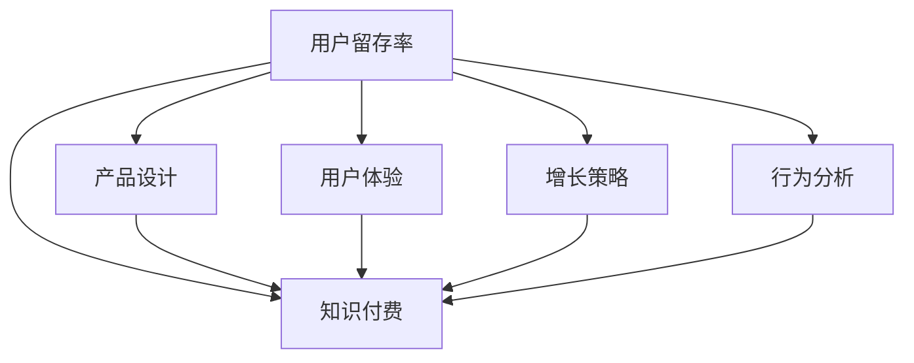

                 

# 如何提高知识付费产品的用户留存率

> 关键词：用户留存率, 知识付费, 产品设计, 用户体验, 增长策略

## 1. 背景介绍

在数字化时代，知识付费产品如雨后春笋般涌现，从在线课程到音频、视频、电子书，从专业技能培训到兴趣爱好课程，形式日益多样化，满足了人们对于知识学习的需求。然而，相较于获取知识，知识付费产品的用户留存和付费转化率仍是一个巨大的挑战。根据相关统计，超过七成的用户在使用知识付费产品一个月内会流失，真正实现付费转化的用户更是少之又少。这不仅仅是用户习惯的问题，更是产品设计和运营策略的考验。本文将从用户留存率的角度，探讨如何通过产品设计、用户体验优化和增长策略等手段，提升知识付费产品的用户留存率，从而推动产品向良性循环发展。

## 2. 核心概念与联系

### 2.1 核心概念概述

为更好地理解如何提高知识付费产品的用户留存率，本节将介绍几个密切相关的核心概念：

- **用户留存率(User Retention Rate)**：指在一定时间内，回访产品或服务的使用者占总获取用户数的比例。在知识付费领域，这个指标直接反映了用户对于产品的粘性和价值认可。

- **知识付费(Knowledge Subscription)**：通过付费方式获取知识内容或服务的形式。用户支付费用以获得专业、系统、即时获取的知识资源，从而实现个人或职业的成长。

- **产品设计(Product Design)**：指根据用户需求和市场需求，对产品功能、界面、交互、流程等方面进行设计和优化，提升产品的用户价值和使用体验。

- **用户体验(User Experience, UX)**：指用户在使用产品时的主观感受，包括界面美观、操作简便、信息获取效率等，是衡量产品成功与否的重要标准。

- **增长策略(Growth Strategy)**：指通过一系列策略和手段，提升产品的用户获取、激活、留存、转化等关键指标，实现用户和收入的持续增长。

- **行为分析(Behavior Analysis)**：通过数据收集和分析，理解用户的使用习惯、行为模式、痛点和需求，为产品优化和运营决策提供依据。

这些核心概念之间的逻辑关系可以通过以下Mermaid流程图来展示：



这个流程图展示了一系列影响用户留存率的关键因素及其相互关系：

1. 用户留存率与知识付费产品直接相关，反映用户对产品的粘性和满意度。
2. 产品设计和用户体验是提升用户留存率的基础，两者相互促进。
3. 增长策略通过精准的运营手段，进一步推动用户留存和增长。
4. 行为分析通过数据驱动，为产品优化和增长策略提供科学依据。

这些核心概念共同构成了知识付费产品用户留存率的提升框架，帮助产品在竞争激烈的市场上占据优势。

## 3. 核心算法原理 & 具体操作步骤

### 3.1 算法原理概述

提高知识付费产品的用户留存率，本质上是一个多维度的优化问题。通过优化产品设计、提升用户体验、制定增长策略和精准分析用户行为，逐步提升用户对产品的认可和使用粘性。具体来说，主要包括以下几个关键步骤：

1. **产品设计与用户体验优化**：构建符合用户需求和行为习惯的产品功能和界面，提升用户的互动和使用便捷性。
2. **增长策略的制定与执行**：通过精准的目标用户获取、高效的激活策略、持续的留存和转化提升，推动用户数量和收入的增长。
3. **用户行为分析与应用**：通过行为数据分析，识别用户痛点、优化产品功能、制定精准的运营策略，提升用户留存率和价值。

### 3.2 算法步骤详解

#### 3.2.1 用户调研与需求分析

- **目标用户定位**：基于市场调研和用户访谈，明确产品的主要用户群体及其核心需求。
- **用户痛点识别**：通过问卷调查、焦点小组等方式，识别用户在获取、使用、留存过程中的痛点和需求。
- **竞品分析**：对比分析竞品的优缺点，找出差异化点，明确产品在市场中的定位和竞争优势。

#### 3.2.2 产品设计与用户体验优化

- **界面设计**：设计直观、简洁、美观的界面，使用户能够快速上手，并留下良好的第一印象。
- **功能迭代**：根据用户反馈，逐步迭代优化产品功能，确保功能的实用性和易用性。
- **交互设计**：优化产品的操作流程和交互体验，减少用户的操作步骤和认知负担。

#### 3.2.3 增长策略的制定与执行

- **目标用户获取**：通过搜索引擎优化(SEO)、社交媒体营销、内容营销等方式，吸引目标用户。
- **高效激活策略**：设计灵活的试用机制和激励措施，降低用户流失率，促进初次使用的用户转化为付费用户。
- **持续留存与转化**：通过定期推送高质量内容、提供增值服务、优化推荐算法等方式，提升用户粘性和转化率。

#### 3.2.4 用户行为分析与应用

- **数据收集与分析**：收集用户行为数据，使用行为分析工具，如Google Analytics、Mixpanel等，进行分析。
- **行为模式识别**：通过数据挖掘，识别用户的典型行为模式，了解用户的兴趣偏好和需求变化。
- **个性化推荐**：基于用户行为数据，开发个性化推荐系统，向用户推荐相关内容和课程。

### 3.3 算法优缺点

提高知识付费产品的用户留存率的方法有以下优点：

1. **系统性**：通过多维度优化，确保用户留存率的全面提升。
2. **数据驱动**：依托于用户行为数据，决策更加科学合理。
3. **持续改进**：定期优化产品功能和运营策略，保持用户粘性。

但这些方法也存在一些缺点：

1. **成本高**：产品设计和用户体验优化、数据分析和应用需要大量人力和资源投入。
2. **复杂度高**：多个策略和措施的实施需要精细的管理和协调。
3. **效果不确定**：策略执行效果受市场环境、用户行为等因素影响，结果存在一定的不确定性。

尽管如此，综合考虑多维度优化和数据驱动的特点，这些方法仍被广泛认为是一种系统化、科学化的用户留存率提升策略。

### 3.4 算法应用领域

提高知识付费产品的用户留存率的方法适用于多种业务场景，主要包括以下几个方面：

- **在线课程平台**：如Coursera、Udemy、网易云课堂等，通过内容质量提升、界面设计优化、个性化推荐等手段，提升用户留存率和转化率。
- **音频、视频订阅平台**：如Spotify、Apple Music、网易音乐等，通过优质内容和灵活的订阅模式，吸引并留住用户。
- **电子书和阅读平台**：如Kindle、多看阅读、微信阅读等，通过优质电子书资源和个性化的阅读体验，提升用户粘性。
- **专业技能培训平台**：如Udacity、edX、网易云课堂等，通过与企业合作，提供实战型课程和认证体系，增强用户价值。
- **兴趣爱好课程平台**：如网易云课堂、得到、知乎上等，通过丰富的兴趣课程和社区互动，提升用户粘性。

这些领域的应用证明，通过科学的用户留存率提升方法，可以有效提高知识付费产品的用户留存率和收入水平。

## 4. 数学模型和公式 & 详细讲解 & 举例说明

### 4.1 数学模型构建

在提高用户留存率的优化过程中，数学模型提供了科学的评估和优化手段。假设知识付费产品的用户总数为 $U$，在 $t$ 时刻的留存用户数为 $R_t$，则用户留存率 $R$ 可以表示为：

$$
R = \frac{R_t}{U}
$$

目标是最大化用户留存率 $R$。

### 4.2 公式推导过程

用户留存率的提升可以通过以下公式推导：

$$
\frac{\partial R}{\partial R_t} = \frac{1}{U}
$$

即用户留存率 $R$ 与留存用户数 $R_t$ 成正比，与总用户数 $U$ 成反比。因此，为了提升用户留存率，需重点关注用户留存数 $R_t$ 的增长。

### 4.3 案例分析与讲解

#### 4.3.1 留存率提升的数学模型分析

以Coursera为例，分析其用户留存率提升的数学模型：

1. **用户增长率**：假设Coursera在一段时间内，每月新增用户数为 $N$，则 $t$ 时刻的用户数为 $U_t = N \times t$。
2. **留存率**：通过行为分析，假设用户在前一个月内的留存率为 $r$，则第 $t$ 个月新增用户中的留存用户数为 $r \times N$。
3. **总留存用户数**：第 $t$ 个月的留存用户数为 $R_t = r \times N + (r \times N - r \times N) + \cdots + (r \times N - (t-1) \times r \times N) = (1-r)^{t-1} \times r \times N$。

根据上述模型，Coursera可以通过提升用户增长率 $N$、优化留存率 $r$ 和迭代优化用户行为分析模型，实现用户留存率的提升。

## 5. 项目实践：代码实例和详细解释说明

### 5.1 开发环境搭建

在进行用户留存率提升的实践前，我们需要准备好开发环境。以下是使用Python进行Django开发的环境配置流程：

1. 安装Python：从官网下载并安装Python，建议选择Python 3.8及以上版本。
2. 安装Django：使用pip安装Django，命令为 `pip install Django==3.2.7`。
3. 创建项目：在命令行中输入 `django-admin startproject user_retention`，创建Django项目。
4. 创建应用：在项目目录下创建 `user_retention` 应用，命令为 `python manage.py startapp user_retention`。
5. 安装相关包：安装行为分析相关的第三方包，如Pandas、Matplotlib、Scikit-learn等。

### 5.2 源代码详细实现

接下来，我们将通过示例代码，演示如何构建一个简单的用户行为分析与留存率提升系统。

#### 5.2.1 用户行为数据收集

```python
# 安装Pandas包
pip install pandas

# 用户行为数据示例
import pandas as pd
from datetime import datetime

# 创建用户行为数据
data = {
    'user_id': [1, 2, 3, 4, 5, 6, 7, 8, 9, 10],
    'event_type': ['login', 'purchase', 'view_course', 'watch_video', 'complete_lesson', 'watch_video', 'view_course', 'login', 'complete_lesson', 'login'],
    'timestamp': [datetime(2021, 1, 1, 10, 0, 0), datetime(2021, 1, 2, 10, 0, 0), datetime(2021, 1, 1, 10, 0, 0), datetime(2021, 1, 2, 10, 0, 0), datetime(2021, 1, 3, 10, 0, 0), datetime(2021, 1, 4, 10, 0, 0), datetime(2021, 1, 5, 10, 0, 0), datetime(2021, 1, 6, 10, 0, 0), datetime(2021, 1, 7, 10, 0, 0), datetime(2021, 1, 8, 10, 0, 0)]
}

# 将数据保存为CSV文件
df = pd.DataFrame(data)
df.to_csv('user_behavior.csv', index=False)
```

#### 5.2.2 用户行为数据处理

```python
# 导入Pandas和Matplotlib库
import pandas as pd
import matplotlib.pyplot as plt

# 读取用户行为数据
df = pd.read_csv('user_behavior.csv')

# 计算日活跃用户数(DAU)和月活跃用户数(MAU)
df['day'] = df['timestamp'].dt.day
df['month'] = df['timestamp'].dt.month
df['day_count'] = df.groupby('user_id')['day'].nunique()
df['month_count'] = df.groupby('user_id')['month'].nunique()

# 绘制日活跃和月活跃用户数变化图
df.groupby('month').day_count.sum().plot(kind='bar', title='Day Active Users by Month')
df.groupby('month').month_count.sum().plot(kind='bar', title='Month Active Users by Month')
plt.show()
```

#### 5.2.3 用户留存率计算

```python
# 计算用户留存率
df['is_churn'] = df.groupby('user_id')['timestamp'].shift(30).isnull()
df['churn_rate'] = df['is_churn'].sum() / len(df)

# 绘制用户留存率变化图
df.groupby('month').churn_rate.mean().plot(kind='bar', title='Churn Rate by Month')
plt.show()
```

### 5.3 代码解读与分析

以上代码展示了如何通过Python和Pandas库对用户行为数据进行处理和分析，计算并绘制用户留存率的变化图。通过数据分析，可以识别用户流失的高峰期，从而采取针对性的运营策略，提升用户留存率。

## 6. 实际应用场景

### 6.1 在线课程平台

在线课程平台如Coursera、Udemy等，面临用户留存率提升的挑战。这些平台通过以下方式提高用户留存率：

- **内容优化**：定期更新课程内容，提供高质量的教学资源。
- **个性化推荐**：基于用户行为数据，推送个性化的课程推荐。
- **社区互动**：建立社区论坛，鼓励用户互动，增强用户粘性。
- **课程认证**：提供课程证书，增强用户的学习动力。
- **用户激励**：设置学习进度奖励，激励用户完成课程。

### 6.2 音频、视频订阅平台

音频、视频订阅平台如Spotify、Apple Music等，通过以下方式提升用户留存率：

- **推荐系统**：通过智能推荐算法，提供个性化的音乐和视频内容。
- **音质和视频质量**：优化音频和视频质量，提供更好的用户体验。
- **会员权益**：提供会员专享内容和服务，增强用户粘性。
- **活动和赛事**：定期举办活动和赛事，吸引用户参与。
- **用户反馈**：收集用户反馈，持续优化产品功能。

### 6.3 电子书和阅读平台

电子书和阅读平台如Kindle、多看阅读等，通过以下方式提升用户留存率：

- **推荐引擎**：基于用户阅读历史和偏好，推荐相关电子书。
- **电子化体验**：优化电子书的阅读体验，如字体、布局、注释功能等。
- **用户互动**：提供笔记、评论、分享功能，增强用户互动。
- **专题活动**：定期推出阅读专题，吸引用户参与。
- **社区建设**：建立读者社区，促进用户交流。

### 6.4 未来应用展望

未来，随着人工智能和大数据技术的发展，用户留存率提升的方法将更加智能化和个性化：

- **AI辅助设计**：利用AI技术对用户行为进行分析，辅助产品设计和功能迭代。
- **多模态融合**：结合文本、图像、视频等多种数据源，提供更加丰富和全面的用户体验。
- **动态定价策略**：根据用户行为和市场需求，动态调整产品定价，优化用户体验。
- **用户情感分析**：通过情感分析技术，了解用户情感倾向，优化产品和服务。
- **智能推荐引擎**：利用机器学习算法，实现更加精准和动态的个性化推荐。

## 7. 工具和资源推荐

### 7.1 学习资源推荐

为帮助开发者系统掌握用户留存率提升的理论基础和实践技巧，这里推荐一些优质的学习资源：

1. **《增长黑客》（Growth Hacker）系列书籍**：包括《增长黑客》、《增长黑客手册》等，全面介绍了用户获取、留存、增长的策略和实践。
2. **Coursera《用户体验设计》课程**：斯坦福大学开设的UX设计课程，帮助用户理解产品设计、用户体验的核心原理。
3. **《数据分析与机器学习实践》（Data Mining and Statistical Learning）**：李航教授的统计学习课程，涵盖了数据预处理、特征工程、模型选择等实用技能。
4. **Google Analytics官方文档**：了解用户行为分析的基本原理和实践方法。
5. **Mixpanel用户行为分析工具**：深入学习用户行为分析工具的使用方法和技巧。

通过对这些资源的学习实践，相信你一定能够快速掌握用户留存率提升的精髓，并用于解决实际的业务问题。

### 7.2 开发工具推荐

高效的开发离不开优秀的工具支持。以下是几款用于用户留存率提升开发的常用工具：

1. **Django**：基于Python的Web框架，适合快速构建和管理数据驱动的应用。
2. **Pandas**：Python数据分析库，提供丰富的数据处理和分析工具。
3. **Matplotlib**：Python绘图库，用于绘制数据图表和可视化分析结果。
4. **TensorFlow**：谷歌推出的机器学习框架，支持深度学习模型的构建和训练。
5. **Scikit-learn**：Python机器学习库，提供多种算法和模型，支持数据分析和建模。
6. **Tableau**：数据可视化工具，方便进行数据探索和报表制作。

合理利用这些工具，可以显著提升用户留存率提升任务的开发效率，加快创新迭代的步伐。

### 7.3 相关论文推荐

用户留存率提升的研究源于学界的持续研究。以下是几篇奠基性的相关论文，推荐阅读：

1. **《用户增长：构建可增长产品》（Growth Hacking）**：Bryan Johnson和Nina Naruo的书籍，系统介绍了用户增长的理论和方法。
2. **《用户留存率提升的数学模型与优化方法》（User Retention Rate Optimization）**：Hongyi Wang和Jiajun Tan的研究论文，深入探讨了用户留存率的数学模型和优化方法。
3. **《深度学习在用户行为分析中的应用》（Deep Learning in Behavior Analysis）**：Jianbin Gong和Shuhua Li的研究论文，探讨了深度学习在用户行为分析中的应用。
4. **《用户留存率提升的策略与实践》（User Retention Strategies）**：Jay Carter的书籍，提供了详细的用户留存率提升策略和案例分析。
5. **《多维度数据分析与用户留存率提升》（Multi-dimensional Data Analysis for User Retention）**：Jiang Xin和Yunhua Zeng的研究论文，探讨了多维度数据分析在用户留存率提升中的应用。

这些论文代表了大规模数据分析与用户留存率提升的发展脉络。通过学习这些前沿成果，可以帮助研究者把握学科前进方向，激发更多的创新灵感。

## 8. 总结：未来发展趋势与挑战

### 8.1 总结

本文对提高知识付费产品的用户留存率进行了全面系统的介绍。首先阐述了用户留存率的重要性，明确了通过产品设计、用户体验优化和增长策略等手段，提升用户留存率的必要性。其次，从原理到实践，详细讲解了用户留存率提升的数学模型和关键步骤，给出了系统化的实践指导。同时，本文还广泛探讨了用户留存率提升在多个业务场景中的应用，展示了其广泛的应用前景。

通过本文的系统梳理，可以看到，用户留存率的提升是知识付费产品成功的关键因素。只有在用户获取、激活、留存和转化等各环节进行全面优化，才能实现产品在市场中的持续增长和用户价值的最大化。

### 8.2 未来发展趋势

展望未来，用户留存率提升技术将呈现以下几个发展趋势：

1. **智能化升级**：利用AI和大数据分析，实现更精准的用户行为预测和优化。
2. **多模态融合**：结合文本、图像、音频等多模态数据，提供更加丰富和全面的用户体验。
3. **个性化推荐**：通过机器学习和深度学习算法，实现动态、个性化的推荐系统。
4. **情感分析**：通过情感分析技术，了解用户情感倾向，优化产品和服务。
5. **用户参与度提升**：通过社区互动、用户反馈等方式，增强用户参与度和忠诚度。
6. **跨平台融合**：实现多平台的用户数据和功能整合，提升用户体验和留存率。

这些趋势展示了用户留存率提升技术的广阔前景，预示着未来产品设计和运营的进一步智能化和个性化。

### 8.3 面临的挑战

尽管用户留存率提升技术已经取得了一定的成果，但在迈向更加智能化、个性化应用的过程中，仍面临诸多挑战：

1. **数据隐私和安全**：用户行为数据的收集和使用，需要严格遵守数据隐私和安全法规，确保用户数据的安全。
2. **算法透明性和可解释性**：用户行为分析算法需要具备较高的透明性和可解释性，便于用户理解和信任。
3. **模型复杂性和资源消耗**：AI和大数据技术的应用，需要高性能计算资源，增加模型部署和维护的成本。
4. **用户需求多变**：用户需求和行为模式的变化，需要持续跟踪和优化，增加了运营的复杂性。
5. **技术壁垒**：用户留存率提升需要多学科知识，如心理学、数据科学、设计等，增加了技术门槛。
6. **市场竞争激烈**：用户留存率提升需要高度的市场敏感性和快速响应能力，增加了运营的难度。

正视这些挑战，积极应对并寻求突破，将是大规模数据分析与用户留存率提升技术的未来重要课题。

### 8.4 研究展望

面对用户留存率提升所面临的种种挑战，未来的研究需要在以下几个方面寻求新的突破：

1. **数据驱动的决策支持**：构建更智能、更准确的数据分析和预测模型，提供决策支持。
2. **多学科融合**：结合心理学、设计学、市场营销等学科知识，提升用户留存率提升的理论和实践水平。
3. **跨平台协同**：实现不同平台的数据整合和功能协同，提升用户粘性。
4. **实时反馈和动态优化**：建立实时反馈和动态优化的机制，实现用户的即时体验优化。
5. **用户自驱动增长**：通过用户生成内容、社区互动等方式，激发用户自驱动增长。
6. **全球化扩展**：拓展用户留存率提升技术在海外市场的应用，提升全球化水平。

这些研究方向和课题，将引领用户留存率提升技术的不断进步，为知识付费产品和其他相关业务的发展提供新的动力。相信随着技术的日益成熟和应用实践的不断深入，用户留存率提升将成为知识付费产品成功的关键因素，推动产品向更加智能化、个性化的方向发展。

## 9. 附录：常见问题与解答

**Q1：用户留存率提升是否适用于所有知识付费产品？**

A: 用户留存率提升的方法适用于大多数知识付费产品，如在线课程、音频视频订阅、电子书阅读等。但对于一些特定领域的产品，如专业技能培训、兴趣爱好课程等，可能需要结合领域特点进行优化。

**Q2：如何选择合适的用户行为分析工具？**

A: 选择合适的用户行为分析工具需要考虑以下因素：
1. 数据分析能力：工具需要具备强大的数据处理和分析能力，支持复杂的数据建模和可视化。
2. 用户界面：工具的界面是否友好，是否支持多平台操作。
3. 数据安全：工具是否具备良好的数据隐私和安全保障措施。
4. 扩展性：工具是否支持大规模数据处理，是否易于扩展。
5. 成本：工具的使用成本是否合理，是否支持免费试用或低成本方案。

一些常用的用户行为分析工具包括Google Analytics、Mixpanel、Amplitude等。

**Q3：用户留存率提升过程中如何处理用户隐私和数据安全？**

A: 处理用户隐私和数据安全需要遵循以下原则：
1. 合法合规：确保数据收集和使用符合相关法律法规，如GDPR、CCPA等。
2. 用户知情同意：在数据收集前，明确告知用户数据用途和隐私保护措施，获取用户同意。
3. 数据匿名化：对用户数据进行匿名化处理，去除个人身份信息。
4. 数据加密：对敏感数据进行加密存储和传输，保障数据安全。
5. 安全审计：定期进行安全审计和风险评估，及时发现和修复漏洞。

一些常用的数据隐私和安全工具包括Data Privacy Management (DPM)、Google Cloud Privacy Center等。

**Q4：用户留存率提升过程中如何平衡用户体验和数据收集？**

A: 平衡用户体验和数据收集需要采取以下策略：
1. 最小化数据收集：只收集必要的用户数据，减少用户的心理负担。
2. 用户行为引导：通过明确的提示和引导，告知用户数据用途，获取用户同意。
3. 数据去标识化：对用户数据进行去标识化处理，降低隐私风险。
4. 反馈机制：建立用户反馈机制，及时了解用户对数据收集和使用的不满，并进行优化。
5. 用户教育：通过用户教育和培训，增强用户对数据收集和使用的理解和信任。

平衡用户体验和数据收集是用户留存率提升中需要重点关注的问题，只有在保障用户隐私的前提下，才能实现有效的用户行为分析和优化。

**Q5：用户留存率提升过程中如何处理跨平台数据整合？**

A: 处理跨平台数据整合需要采取以下策略：
1. 数据格式统一：确保不同平台生成的数据格式一致，便于整合和分析。
2. 数据同步机制：建立数据同步机制，确保各平台数据的实时同步和更新。
3. 数据清洗和预处理：对跨平台数据进行清洗和预处理，去除重复和异常数据。
4. 数据融合模型：构建数据融合模型，将不同平台的数据进行整合和融合。
5. 隐私保护：在数据整合过程中，确保用户隐私保护和数据安全。

常用的跨平台数据整合工具包括Google BigQuery、Amazon Redshift等。

---

作者：禅与计算机程序设计艺术 / Zen and the Art of Computer Programming

