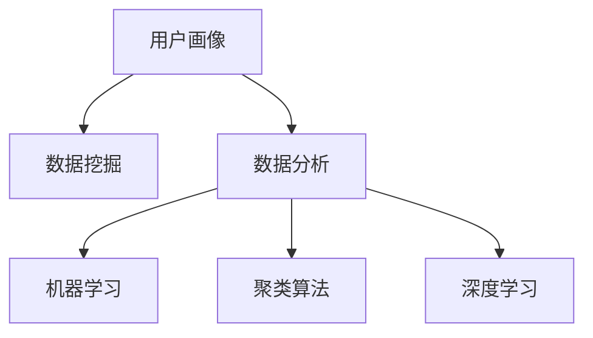

                 

# 如何进行有效的用户分析

> 关键词：用户分析,用户画像,数据挖掘,数据分析,机器学习,聚类算法,深度学习

## 1. 背景介绍

在数字化时代，用户分析（User Analysis）成为了企业洞察用户需求、优化产品和服务、提升用户体验的重要手段。通过深入的用户分析，企业可以更精准地理解目标用户的特征、行为和需求，从而制定更有效的市场策略，创造更大的商业价值。本文将系统介绍用户分析的基本概念、核心方法及应用实例，助力企业建立用户画像，实现个性化运营和精准营销。

## 2. 核心概念与联系

### 2.1 核心概念概述

用户分析（User Analysis）是指通过对用户数据进行系统地收集、整理和分析，揭示用户行为、偏好、特征等方面的信息，形成用户画像（User Persona）的过程。用户画像旨在将抽象的用户数据转化为具体的用户群体，帮助企业更清晰地定位目标用户，制定针对性的市场策略和产品改进方案。

用户分析涉及的核心概念包括：
- **用户画像（User Persona）**：一种反映目标用户特征、行为、需求等信息的模型，通常包括用户的基本信息、兴趣爱好、消费习惯、心理状态等多个维度。
- **数据挖掘（Data Mining）**：从大量数据中自动发现并抽取有价值的模式、知识或信息的技术。
- **数据分析（Data Analysis）**：对数据进行整理、加工和解释，揭示其内在规律和特征。
- **机器学习（Machine Learning）**：基于数据训练算法模型，使其具备自主学习和预测的能力。
- **聚类算法（Clustering）**：一种无监督学习方法，通过相似度度量将数据分组，形成用户群体。
- **深度学习（Deep Learning）**：通过多层神经网络对数据进行深度特征提取，提升数据分析的精度和效率。

这些概念之间的逻辑关系可以通过以下Mermaid流程图来展示：



这个流程图展示了一系列用户分析的关键步骤，从数据挖掘到数据分析，再到机器学习、聚类算法和深度学习，最终形成用户画像。

## 3. 核心算法原理 & 具体操作步骤

### 3.1 算法原理概述

用户分析主要基于数据的挖掘、分析和建模，其核心算法原理包括：

- **数据挖掘（Data Mining）**：通过各种算法从原始数据中提取出有价值的模式、规则和关联。常用的数据挖掘算法包括关联规则、分类、聚类等。
- **数据分析（Data Analysis）**：对数据进行统计、可视化、特征工程等处理，揭示数据的分布、趋势和特征。常用的数据分析工具包括Pandas、NumPy、Matplotlib等。
- **机器学习（Machine Learning）**：利用监督学习、无监督学习等方法训练模型，实现数据的预测和分类。常用的机器学习算法包括线性回归、决策树、支持向量机、随机森林等。
- **聚类算法（Clustering）**：通过对数据进行相似度度量和分组，将用户分成不同的群体。常用的聚类算法包括K-means、层次聚类、DBSCAN等。
- **深度学习（Deep Learning）**：利用多层神经网络对数据进行特征提取和模型训练，提高分析的精度和效率。常用的深度学习框架包括TensorFlow、PyTorch等。

### 3.2 算法步骤详解

用户分析一般包括以下几个关键步骤：

**Step 1: 数据收集与预处理**

- **数据收集**：从各种渠道（如网站、App、社交媒体、交易记录等）收集用户数据，包括基本信息（年龄、性别、地理位置等）、行为数据（浏览记录、购买历史等）、心理数据（兴趣偏好、情感倾向等）。
- **数据预处理**：清洗数据，去除噪声和异常值，处理缺失值，进行标准化和归一化等处理，确保数据质量和一致性。

**Step 2: 特征工程**

- **特征提取**：从原始数据中提取有意义的特征，如使用TF-IDF算法提取文本特征，使用PCA算法进行降维处理。
- **特征选择**：选择对目标变量影响最大的特征，减少计算复杂度和过拟合风险。

**Step 3: 模型训练与评估**

- **模型选择**：根据任务类型选择合适的机器学习或深度学习模型，如K-means聚类模型、决策树分类模型、卷积神经网络等。
- **模型训练**：使用训练集对模型进行训练，调整超参数以获得最佳性能。
- **模型评估**：在验证集上评估模型性能，选择合适的评价指标（如准确率、召回率、F1值等）。

**Step 4: 用户画像构建**

- **聚类分析**：使用聚类算法对用户进行分组，形成用户群体。
- **用户画像**：根据聚类结果和用户行为特征，构建用户画像，描述每个用户群体的基本信息、行为特征和心理特征。

**Step 5: 应用与迭代**

- **应用推广**：将用户画像应用于市场策略、产品改进、个性化推荐等业务场景，提升用户体验和运营效率。
- **迭代优化**：根据用户反馈和业务需求，不断调整模型和数据，进行模型优化和用户画像更新。

### 3.3 算法优缺点

用户分析作为一种系统化的方法，具有以下优点：
- **准确性高**：通过数据挖掘和分析，揭示用户行为的规律和趋势，提高分析的准确性。
- **针对性**：明确用户画像，制定更有针对性的市场策略和产品改进方案。
- **效率高**：利用机器学习和深度学习算法，快速处理大量数据，提升分析效率。

同时，也存在一些缺点：
- **依赖数据质量**：数据收集和预处理的准确性直接影响用户分析的效果。
- **隐私风险**：用户数据的收集和使用可能涉及隐私问题，需要严格遵守数据保护法规。
- **模型复杂度**：复杂模型可能面临过拟合和解释性差的问题。

尽管存在这些局限性，用户分析在提升企业运营效率和用户体验方面具有不可替代的作用。

### 3.4 算法应用领域

用户分析广泛应用于各种业务场景，包括但不限于：

- **电商行业**：通过用户画像分析，实现个性化推荐、精准营销、用户留存等。
- **金融行业**：利用用户分析优化贷款审批、风险控制、客户服务等。
- **医疗健康**：分析患者健康数据，提升诊疗效率，制定个性化治疗方案。
- **社交媒体**：通过用户画像分析，优化内容推荐、广告投放、用户增长等。
- **旅游行业**：根据用户画像进行目的地推荐、行程规划、个性化服务等。
- **教育行业**：分析学生行为数据，提供个性化学习方案、课程推荐等。

## 4. 数学模型和公式 & 详细讲解 & 举例说明

### 4.1 数学模型构建

用户分析中的数学模型通常包括以下几个部分：

- **数据表示**：将用户数据表示为向量或矩阵，方便进行数学运算。
- **特征提取**：从原始数据中提取特征，常用的方法包括TF-IDF、词袋模型、PCA等。
- **相似度计算**：通过余弦相似度、欧氏距离等方法计算用户之间的相似度，常用的相似度计算方法包括余弦相似度、欧氏距离、曼哈顿距离等。
- **聚类算法**：使用K-means、层次聚类、DBSCAN等算法对用户进行分组，常用的聚类算法包括K-means、层次聚类、DBSCAN等。
- **机器学习模型**：利用决策树、随机森林、支持向量机等算法进行用户分类和预测，常用的机器学习算法包括决策树、随机森林、支持向量机等。
- **深度学习模型**：使用卷积神经网络、循环神经网络等模型对用户数据进行特征提取和预测，常用的深度学习模型包括卷积神经网络、循环神经网络等。

### 4.2 公式推导过程

以下以K-means聚类算法为例，介绍其数学原理和公式推导过程。

K-means算法通过迭代更新中心点，将数据分为K个簇。设$D=\{d_1, d_2, \cdots, d_n\}$为样本集合，$C=\{c_1, c_2, \cdots, c_k\}$为簇中心点集合，$k$为簇的个数。

**Step 1: 初始化簇中心点**

随机选取$k$个样本点作为初始的簇中心点。

**Step 2: 分配样本到最近的簇中心点**

对于每个样本点$d_i$，计算其与每个簇中心点$c_j$的距离，将其分配到距离最近的簇$c_j$中。

**Step 3: 更新簇中心点**

对于每个簇$c_j$，计算其所有样本的均值，更新簇中心点$c_j$。

**Step 4: 迭代更新**

重复执行Step 2和Step 3，直到簇中心点不再发生变化。

### 4.3 案例分析与讲解

**案例一：电商平台用户画像分析**

一家电商平台希望通过用户画像分析，提升个性化推荐和精准营销的效果。收集了用户的浏览记录、购买历史、评价评论等数据，进行以下分析：

1. **数据预处理**：清洗和处理数据，去除噪声和异常值。
2. **特征提取**：使用TF-IDF算法提取文本特征，使用PCA算法进行降维处理。
3. **模型训练**：使用K-means算法对用户进行聚类，形成用户群体。
4. **用户画像**：根据聚类结果和用户行为特征，构建用户画像，描述每个用户群体的基本信息、行为特征和心理特征。
5. **应用推广**：根据用户画像进行个性化推荐、精准营销等。

**案例二：社交媒体用户分析**

一家社交媒体公司希望通过用户分析，优化内容推荐和广告投放策略。收集了用户的浏览记录、点赞评论、互动数据等，进行以下分析：

1. **数据预处理**：清洗和处理数据，去除噪声和异常值。
2. **特征提取**：使用词袋模型提取文本特征，使用LDA算法进行主题建模。
3. **模型训练**：使用随机森林算法对用户进行分类，识别活跃用户和高价值用户。
4. **用户画像**：根据分类结果和用户行为特征，构建用户画像，描述每个用户群体的基本信息、行为特征和心理特征。
5. **应用推广**：根据用户画像进行内容推荐、广告投放等。

## 5. 项目实践：代码实例和详细解释说明

### 5.1 开发环境搭建

在进行用户分析实践前，我们需要准备好开发环境。以下是使用Python进行Scikit-learn和TensorFlow开发的环境配置流程：

1. 安装Anaconda：从官网下载并安装Anaconda，用于创建独立的Python环境。

2. 创建并激活虚拟环境：
```bash
conda create -n user_analysis_env python=3.8 
conda activate user_analysis_env
```

3. 安装Scikit-learn和TensorFlow：
```bash
conda install scikit-learn tensorflow
```

4. 安装各类工具包：
```bash
pip install pandas numpy matplotlib seaborn scikit-learn tensorflow jupyter notebook ipython
```

完成上述步骤后，即可在`user_analysis_env`环境中开始用户分析实践。

### 5.2 源代码详细实现

下面以用户画像分析为例，给出使用Scikit-learn和TensorFlow进行用户分析的Python代码实现。

首先，定义用户画像的数据处理函数：

```python
import pandas as pd
import numpy as np
from sklearn.preprocessing import StandardScaler
from sklearn.decomposition import PCA
from sklearn.cluster import KMeans
from sklearn.metrics import silhouette_score

def process_data(data_path):
    # 读取数据
    df = pd.read_csv(data_path)
    # 数据清洗和预处理
    df = df.dropna().drop_duplicates()
    # 特征提取和降维
    X = df[['age', 'gender', 'income', 'interests']].copy()
    X = StandardScaler().fit_transform(X)
    X = PCA(n_components=2).fit_transform(X)
    # 聚类分析
    kmeans = KMeans(n_clusters=5, random_state=42)
    kmeans.fit(X)
    # 计算轮廓系数
    silhouette = silhouette_score(X, kmeans.labels_)
    return df, kmeans, silhouette
```

然后，定义用户画像的展示函数：

```python
def show_user_profile(df, kmeans, silhouette):
    # 用户画像展示
    df['cluster'] = kmeans.labels_
    df_silhouette = df.copy()
    df_silhouette['silhouette'] = silhouette
    df_silhouette = df_silhouette.groupby('cluster').mean().round(2)
    print(df_silhouette)
```

最后，启动用户画像分析流程：

```python
data_path = 'user_data.csv'
df, kmeans, silhouette = process_data(data_path)
show_user_profile(df, kmeans, silhouette)
```

以上就是使用Scikit-learn和TensorFlow对用户数据进行聚类分析的完整代码实现。可以看到，通过简单的几行代码，我们就能完成用户画像的基本分析，展示每个用户群体的基本信息和行为特征。

### 5.3 代码解读与分析

让我们再详细解读一下关键代码的实现细节：

**process_data函数**：
- `data_path`：用户数据的CSV文件路径。
- `df = pd.read_csv(data_path)`：读取数据。
- `df = df.dropna().drop_duplicates()`：数据清洗和预处理，去除噪声和异常值。
- `X = df[['age', 'gender', 'income', 'interests']].copy()`：选择需要的特征。
- `X = StandardScaler().fit_transform(X)`：标准化处理，确保数据一致性。
- `X = PCA(n_components=2).fit_transform(X)`：PCA降维，降低计算复杂度。
- `kmeans = KMeans(n_clusters=5, random_state=42)`：定义聚类算法，设置簇的个数为5。
- `kmeans.fit(X)`：训练聚类模型。
- `silhouette = silhouette_score(X, kmeans.labels_)`：计算轮廓系数，评估聚类效果。
- `return df, kmeans, silhouette`：返回处理后的数据、聚类模型和轮廓系数。

**show_user_profile函数**：
- `df['cluster'] = kmeans.labels_`：为每个样本打上聚类标签。
- `df_silhouette = df.copy()`：复制数据。
- `df_silhouette['silhouette'] = silhouette`：添加轮廓系数。
- `df_silhouette = df_silhouette.groupby('cluster').mean().round(2)`：按簇分组，计算每个簇的平均特征。
- `print(df_silhouette)`：输出用户画像。

**启动用户画像分析流程**：
- `data_path = 'user_data.csv'`：指定数据文件路径。
- `df, kmeans, silhouette = process_data(data_path)`：调用数据处理函数，获取处理后的数据、聚类模型和轮廓系数。
- `show_user_profile(df, kmeans, silhouette)`：调用用户画像展示函数，输出用户画像。

可以看到，通过以上几行代码，我们就能轻松地进行用户画像分析，并输出每个用户群体的基本信息和行为特征。

## 6. 实际应用场景

### 6.1 电商平台

电商平台通过用户画像分析，提升个性化推荐和精准营销的效果。具体应用场景包括：
- **个性化推荐**：根据用户画像，推荐用户可能感兴趣的商品。
- **精准营销**：针对不同用户群体，推送定制化的广告和促销活动。
- **用户留存**：通过分析用户行为数据，及时发现流失用户，采取措施提升用户留存率。

### 6.2 金融行业

金融行业通过用户画像分析，优化贷款审批、风险控制和客户服务等。具体应用场景包括：
- **贷款审批**：根据用户画像，评估贷款申请人的信用风险。
- **风险控制**：通过分析用户行为数据，识别潜在风险用户，降低信用风险。
- **客户服务**：根据用户画像，提供个性化的客户服务方案，提升用户满意度。

### 6.3 医疗健康

医疗健康通过用户画像分析，提升诊疗效率和个性化治疗方案的制定。具体应用场景包括：
- **诊疗效率**：根据患者健康数据，预测病情发展，优化诊疗流程。
- **个性化治疗**：通过分析患者病历和健康数据，制定个性化的治疗方案。
- **健康管理**：根据患者健康数据，提供个性化的健康管理建议。

### 6.4 未来应用展望

未来，用户分析将在更多领域得到应用，为传统行业带来变革性影响。

- **智慧城市**：通过用户画像分析，优化城市资源配置，提升城市管理水平。
- **智能家居**：根据用户行为数据，提供个性化的家居控制方案，提升生活质量。
- **教育行业**：分析学生行为数据，提供个性化的学习方案，提升教育效果。
- **旅游行业**：根据用户画像，推荐目的地和旅行计划，提升用户体验。

## 7. 工具和资源推荐

### 7.1 学习资源推荐

为了帮助开发者系统掌握用户分析的理论基础和实践技巧，这里推荐一些优质的学习资源：

1. **《Python数据科学手册》**：一本全面介绍Python数据科学库（如Pandas、NumPy、Scikit-learn、TensorFlow等）的书籍，是用户分析开发的必备手册。
2. **Coursera《机器学习》课程**：斯坦福大学开设的机器学习课程，涵盖多种机器学习算法，包括聚类、分类、回归等。
3. **Kaggle数据竞赛**：通过参与Kaggle数据竞赛，实践各种机器学习和数据挖掘算法，提升实战能力。
4. **GitHub开源项目**：通过学习和借鉴开源项目，快速掌握用户分析的先进技术和实践经验。
5. **数据科学社区**：加入数据科学社区，与业内专家交流学习，获取最新的技术动态和实践经验。

通过这些资源的学习实践，相信你一定能够快速掌握用户分析的精髓，并用于解决实际的业务问题。

### 7.2 开发工具推荐

高效的开发离不开优秀的工具支持。以下是几款用于用户分析开发的常用工具：

1. **Pandas**：Python数据分析库，提供了强大的数据处理和分析能力，是用户分析开发的基础工具。
2. **Scikit-learn**：Python机器学习库，提供了多种机器学习算法，包括聚类、分类、回归等，是用户分析中的常用工具。
3. **TensorFlow**：Google开源的深度学习框架，提供了丰富的深度学习模型和工具，支持用户分析中的复杂任务。
4. **Jupyter Notebook**：Python开发环境，支持数据可视化、代码交互和快速迭代，是用户分析开发的理想工具。
5. **Matplotlib**：Python数据可视化库，提供了多种图形绘制方法，方便用户分析中的数据展示和分析。

合理利用这些工具，可以显著提升用户分析任务的开发效率，加快创新迭代的步伐。

### 7.3 相关论文推荐

用户分析作为一种前沿技术，其研究成果不断涌现。以下是几篇奠基性的相关论文，推荐阅读：

1. **K-means: A Method for Clustering**：提出K-means聚类算法，成为用户分析中的经典算法之一。
2. **PCA: Principal Component Analysis**：提出主成分分析算法，用于数据降维和特征提取。
3. **Random Forest**：提出随机森林算法，用于分类和回归分析。
4. **Support Vector Machines**：提出支持向量机算法，用于分类和回归分析。
5. **GAN: Generative Adversarial Networks**：提出生成对抗网络，用于生成用户画像和个性化推荐。

这些论文代表了大数据和机器学习领域的进步，通过学习这些前沿成果，可以帮助研究者把握学科前进方向，激发更多的创新灵感。

## 8. 总结：未来发展趋势与挑战

### 8.1 研究成果总结

本文对用户分析的基本概念、核心方法及应用实例进行了全面系统介绍。通过系统梳理用户分析的各个环节，帮助企业建立用户画像，实现个性化运营和精准营销。

### 8.2 未来发展趋势

展望未来，用户分析技术将呈现以下几个发展趋势：

1. **自动化和智能化**：随着AI技术的发展，用户分析将更多依赖自动化和智能化算法，提高分析的效率和准确性。
2. **多模态数据融合**：用户分析将不再局限于单一的数据类型，而是融合多种模态数据（如文本、图像、语音等），提升分析的全面性和深度。
3. **个性化推荐引擎**：基于用户画像，实现更加精准的个性化推荐，提升用户体验和满意度。
4. **实时分析和反馈**：利用大数据和实时分析技术，对用户行为进行实时监控和反馈，提升运营效果。
5. **隐私保护和合规性**：用户分析过程中，需严格遵守数据保护法规，保障用户隐私和数据安全。

### 8.3 面临的挑战

尽管用户分析技术已经取得了瞩目成就，但在应用过程中仍面临诸多挑战：

1. **数据质量问题**：数据收集和预处理的准确性直接影响用户分析的效果，需要保证数据质量和一致性。
2. **模型复杂度**：复杂的模型可能面临过拟合和解释性差的问题，需要合理选择模型和优化算法。
3. **隐私和伦理问题**：用户数据的收集和使用可能涉及隐私和伦理问题，需严格遵守相关法规和标准。
4. **计算资源**：用户分析过程中，需要大量的计算资源和存储空间，需合理分配和优化。

尽管存在这些挑战，用户分析在提升企业运营效率和用户体验方面具有不可替代的作用。相信通过不断的技术创新和实践优化，用户分析技术必将迎来新的突破和发展。

### 8.4 研究展望

面向未来，用户分析的研究方向包括：

1. **自动化和智能化**：通过引入机器学习和深度学习技术，提升用户分析的自动化和智能化水平，提高分析效率。
2. **多模态数据融合**：利用多模态数据融合技术，提升用户分析的全面性和深度，实现更加精准的个性化推荐。
3. **隐私保护和合规性**：研究隐私保护和合规性技术，确保用户数据的安全和合规使用。
4. **实时分析和反馈**：利用实时分析和反馈技术，提升用户分析和运营的实时性和效果。
5. **跨领域应用**：将用户分析技术应用于更多领域，如智慧城市、智能家居、医疗健康等，推动技术普适化和产业化。

## 9. 附录：常见问题与解答

**Q1：用户分析如何选择合适的特征？**

A: 用户分析中，选择合适的特征至关重要。通常，需要选择对目标变量影响最大的特征，避免过拟合和冗余。常用的特征选择方法包括方差筛选、互信息、嵌入式选择等。

**Q2：用户分析过程中，如何处理缺失值？**

A: 缺失值处理是用户分析中的重要环节。常用的处理方法包括插值法（如均值插值、中位数插值等）、删除法（如删除缺失值比例高的样本或特征）和模型预测法（如使用KNN等算法预测缺失值）。

**Q3：用户分析中，如何评估模型的效果？**

A: 用户分析中，常用的模型评估指标包括准确率、召回率、F1值、AUC等。根据不同的任务和应用场景，选择合适的评估指标，并进行交叉验证等处理，确保模型的鲁棒性和泛化能力。

**Q4：用户分析中，如何避免过拟合？**

A: 过拟合是用户分析中的常见问题。常用的避免过拟合的方法包括正则化、dropout、交叉验证、模型集成等。通过合理选择模型和超参数，确保模型在训练集和验证集上的泛化能力。

**Q5：用户分析中，如何优化聚类算法？**

A: 聚类算法是用户分析中的重要工具，但不同算法的效果和参数设置不同。常用的优化方法包括选择合适的聚类算法（如K-means、层次聚类、DBSCAN等）、调整聚类参数（如簇的个数、相似度阈值等）、结合其他算法（如密度聚类、谱聚类等）。

通过这些问题的回答，相信你一定能够更深入地理解用户分析的理论基础和实践技巧，提升业务应用能力。

---

作者：禅与计算机程序设计艺术 / Zen and the Art of Computer Programming

