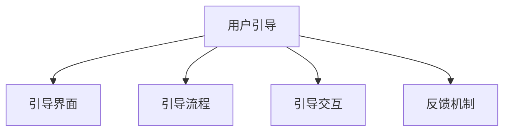

                 

## 1. 背景介绍

在现代信息化社会中，良好的用户体验(UX)不仅关系到产品的商业成功，更是提升品牌价值和社会影响力的关键因素。用户引导(User Guidance)作为UX设计中不可或缺的一部分，旨在通过有效的视觉和交互设计，帮助用户理解和操作复杂产品，提升使用体验。

### 1.1 问题由来

随着移动互联网和智能设备的普及，越来越多的应用需要在多平台、多设备间实现一致的体验，同时为用户提供高效、友好的使用界面。然而，许多产品在设计上过于复杂，导致用户在初次使用时感到困惑，最终选择了放弃。

### 1.2 问题核心关键点

用户引导的核心在于如何通过设计和内容，为用户提供清晰、简明的指导。其关键点在于：

- **目标明确**：用户引导应以用户为中心，明确产品的核心功能和使用方法。
- **简洁直观**：引导界面应简洁明了，避免复杂的操作流程和多余的装饰元素。
- **动态反馈**：通过动态的视觉和交互反馈，及时告知用户操作结果，增强用户信心。
- **可定制化**：根据用户的行为和偏好，提供个性化的引导内容，提升用户体验。

本文将深入探讨如何进行有效的用户引导，帮助开发者和设计师在产品设计中实现这一目标。

## 2. 核心概念与联系

### 2.1 核心概念概述

为更好地理解用户引导的设计原理，本节将介绍几个关键概念：

- **用户引导(User Guidance)**：通过视觉和交互设计，为用户提供操作指导和信息反馈的过程。
- **引导界面(Guide Interface)**：用于呈现引导信息的界面，通常包括步骤指示、提示框、动画等元素。
- **引导流程(Guide Flow)**：引导界面组织和呈现信息的逻辑顺序，决定了用户的学习路径。
- **引导交互(Interactive Guidance)**：通过交互元素，如按钮、滑块等，实现用户对引导流程的控制。
- **反馈机制(Feedback Mechanism)**：通过视觉和听觉反馈，向用户传递操作结果和状态信息。

这些概念之间的关系可以通过以下Mermaid流程图来展示：



这个流程图展示了一些基本概念及其之间的关系：

1. 用户引导以引导界面为载体，向用户展示信息和指导。
2. 引导流程决定了引导界面的组织和呈现顺序。
3. 引导交互提供了用户对引导流程的控制手段。
4. 反馈机制及时告知用户操作结果和状态，增强用户体验。

## 3. 核心算法原理 & 具体操作步骤

### 3.1 算法原理概述

用户引导的本质是一种交互设计，其核心目标是帮助用户快速掌握产品功能和使用方法，提升用户体验。形式化地，我们可以将用户引导的过程表示为一个从初始状态到目标状态的映射，即：

$$
\text{Guidance} : \text{Initial State} \rightarrow \text{Target State}
$$

其中，初始状态指的是用户首次接触产品的状态，目标状态指的是用户掌握产品功能和使用方法后的状态。引导过程需要经过一系列步骤，每个步骤的目标是将用户从当前状态引导到下一个状态，最终达到目标状态。

### 3.2 算法步骤详解

用户引导的设计可以分为以下几个关键步骤：

**Step 1: 确定用户引导目标**

- 明确产品的核心功能和使用场景，确定用户需要掌握的关键操作和知识。
- 通过用户调研和反馈，分析用户在使用产品时遇到的主要困难和障碍。

**Step 2: 设计引导界面**

- 根据引导目标，设计引导界面，包含必要的步骤指示、提示框、动画等元素。
- 界面设计应简洁明了，避免复杂的操作流程和多余的装饰元素。

**Step 3: 定义引导流程**

- 根据引导目标和用户行为，设计引导流程，包含各个步骤的顺序和逻辑关系。
- 流程设计应考虑用户的操作习惯和认知负荷，避免不必要的信息过载。

**Step 4: 实现引导交互**

- 通过交互元素，如按钮、滑块等，实现用户对引导流程的控制。
- 交互设计应直观易用，便于用户快速理解和使用。

**Step 5: 实现反馈机制**

- 通过视觉和听觉反馈，向用户传递操作结果和状态信息。
- 反馈设计应及时、准确，增强用户信心。

**Step 6: 测试与优化**

- 通过用户测试，评估引导效果，收集反馈和建议。
- 根据测试结果，不断优化引导界面、流程和交互设计。

### 3.3 算法优缺点

用户引导的设计具有以下优点：

1. **提升用户体验**：通过清晰的引导，用户能够更快掌握产品使用方法，提升满意度。
2. **增强用户信心**：动态的反馈机制及时告知用户操作结果和状态，增强用户信心。
3. **提高转化率**：良好的引导过程能够减少用户流失，提高产品的转化率和用户留存率。

同时，用户引导也存在一些局限性：

1. **设计复杂**：设计一个有效的引导流程需要深入理解产品功能和用户需求，设计过程复杂。
2. **测试成本高**：引导效果需要通过用户测试进行验证，测试成本较高。
3. **用户差异性**：不同用户对引导的需求和接受度不同，设计需要考虑多样性。
4. **维护成本高**：产品功能更新后，引导流程也需要相应更新，维护成本较高。

尽管存在这些局限性，但用户引导仍然是提升产品用户体验的重要手段。未来相关研究的重点在于如何进一步简化引导流程，降低设计和测试成本，同时兼顾不同用户的需求和接受度。

### 3.4 算法应用领域

用户引导技术已经广泛应用于各种应用场景，例如：

- **移动应用**：如社交媒体、电商、游戏等，提供初始注册、功能引导、操作帮助等。
- **网页应用**：如在线教育、金融、电商等，提供产品介绍、使用教程、交易指导等。
- **智能设备**：如智能家居、可穿戴设备等，提供设备设置、功能介绍、使用教程等。
- **虚拟现实(VR)/增强现实(AR)**：如虚拟旅游、虚拟培训等，提供交互指导、任务提示、操作帮助等。

除了这些经典应用外，用户引导还被创新性地应用到更多场景中，如可控用户界面(UI)、微交互(UI)、服务型机器人等，为用户提供了更直观、高效的使用体验。

## 4. 数学模型和公式 & 详细讲解 & 举例说明

### 4.1 数学模型构建

用户引导的过程可以通过数学模型进行描述。我们以移动应用的引导流程为例，构建一个简单的引导过程模型：

设用户引导过程由 $n$ 个步骤组成，每个步骤的目标是将用户从当前状态 $s_i$ 引导到下一个状态 $s_{i+1}$。设每个步骤的引导时间为 $t_i$，每个步骤的成功率为 $p_i$。则用户引导的总时间为：

$$
T = \sum_{i=1}^n t_i
$$

用户引导的成功概率为：

$$
P = \prod_{i=1}^n p_i
$$

通过优化 $t_i$ 和 $p_i$，可以提升引导效率和成功率。

### 4.2 公式推导过程

在实际应用中，为了提升引导效果，我们通常采用以下策略：

- **逐步引导**：将引导过程分解为多个步骤，每个步骤逐步引导用户掌握关键操作和知识。
- **动态反馈**：在每个步骤结束后，通过反馈机制告知用户操作结果和状态，增强用户信心。
- **个性化引导**：根据用户的行为和偏好，提供个性化的引导内容，提升用户体验。

以社交媒体应用的引导流程为例，我们可以设计如下引导步骤：

1. **注册流程**：引导用户完成注册，选择头像、填写基本信息等。
2. **功能介绍**：通过引导界面展示核心功能，如消息、朋友圈、扫一扫等。
3. **操作演示**：通过视频或动画演示关键操作，如如何添加好友、如何发帖等。
4. **反馈机制**：通过提示框、按钮等交互元素，告知用户操作结果，如好友添加成功、发帖成功等。

通过这些步骤，用户可以逐步掌握产品使用方法，提升体验。

### 4.3 案例分析与讲解

以电商应用的引导流程为例，我们可以分析如下：

1. **注册登录**：引导用户完成注册和登录，选择收货地址、支付方式等。
2. **商品浏览**：通过引导界面展示热门商品，提供搜索、筛选功能。
3. **购物车引导**：通过引导界面展示购物车，提供添加、删除、修改商品的功能。
4. **结算流程**：通过引导界面展示结算流程，提供订单确认、支付方式选择等。

每个步骤的设计都需要考虑用户的操作习惯和认知负荷，避免不必要的信息过载。例如，在结算流程中，我们可以通过动态的视觉和交互反馈，及时告知用户订单状态和支付结果。

## 5. 项目实践：代码实例和详细解释说明

### 5.1 开发环境搭建

在进行用户引导的实践前，我们需要准备好开发环境。以下是使用Python进行React开发的开发环境配置流程：

1. 安装Node.js：从官网下载并安装Node.js，用于JavaScript的运行环境。
2. 安装React和相关依赖：通过npm或yarn安装React及其相关依赖，如react-router-dom、axios等。
3. 创建项目：通过create-react-app命令创建React项目，初始化开发环境。

完成上述步骤后，即可在项目目录下开始开发。

### 5.2 源代码详细实现

下面我们以电商应用的引导流程为例，给出使用React实现用户引导的代码实现。

首先，定义引导组件的UI设计：

```jsx
import React, { useState } from 'react';
import { Link } from 'react-router-dom';

function GuideComponent() {
  const [step, setStep] = useState(1);
  
  const handleStepChange = (step) => {
    setStep(step);
  };
  
  return (
    <div className="guide-container">
      <h2>欢迎使用{step === 1 ? '注册' : '登录'}向导</h2>
      <div className="guide-steps">
        <div className={`guide-step ${step === 1 ? 'active' : ''}`}>
          <h3>第1步：注册登录</h3>
          <p>请输入用户名和密码，开始您的购物之旅。</p>
          <button onClick={() => handleStepChange(2)}>下一步</button>
        </div>
        <div className={`guide-step ${step === 2 ? 'active' : ''}`}>
          <h3>第2步：商品浏览</h3>
          <p>浏览热门商品，寻找您喜欢的商品。</p>
          <Link to="/products">
            <button>浏览商品</button>
          </Link>
        </div>
        <div className={`guide-step ${step === 3 ? 'active' : ''}`}>
          <h3>第3步：购物车引导</h3>
          <p>将商品加入购物车，进行结算。</p>
          <Link to="/cart">
            <button>前往购物车</button>
          </Link>
        </div>
        <div className={`guide-step ${step === 4 ? 'active' : ''}`}>
          <h3>第4步：结算流程</h3>
          <p>确认订单信息，选择支付方式，完成支付。</p>
          <button onClick={() => handleStepChange(1)}>返回上一步</button>
          <Link to="/checkout">
            <button>完成支付</button>
          </Link>
        </div>
      </div>
    </div>
  );
}

export default GuideComponent;
```

接着，定义引导流程的逻辑：

```jsx
import React, { useState, useEffect } from 'react';
import GuideComponent from './GuideComponent';

function App() {
  const [step, setStep] = useState(1);
  
  useEffect(() => {
    setStep(1);
  }, []);
  
  const handleStepChange = (step) => {
    setStep(step);
  };
  
  return (
    <div className="app-container">
      <GuideComponent step={step} handleStepChange={handleStepChange} />
    </div>
  );
}

export default App;
```

最后，在应用中测试和优化引导效果：

1. 在应用中添加引导界面，测试用户引导效果。
2. 通过用户测试，收集反馈和建议，优化引导流程和UI设计。
3. 根据测试结果，不断迭代和优化引导界面、流程和交互设计。

### 5.3 代码解读与分析

让我们再详细解读一下关键代码的实现细节：

**GuideComponent类**：
- `useState`方法：用于状态管理，实现引导步骤的动态更新。
- `handleStepChange`方法：用于处理用户点击事件，更新引导步骤。
- `return`方法：渲染引导界面，包含步骤指示、提示框、按钮等元素。

**App类**：
- `useState`方法：用于状态管理，记录当前引导步骤。
- `useEffect`方法：在应用启动时，初始化引导步骤。
- `return`方法：渲染引导组件，实现用户引导流程。

在实际应用中，还需要根据具体需求进行个性化设计和优化。例如，可以通过动态加载引导界面、实现动态反馈、引入第三方引导库等方式，提升引导效果。

## 6. 实际应用场景

### 6.1 智能家居应用

在智能家居应用中，用户引导可以帮助用户快速设置和管理设备。例如，可以通过引导界面指导用户完成设备配对、功能设置等操作，提升用户使用体验。

### 6.2 健康医疗应用

在健康医疗应用中，用户引导可以帮助用户完成健康监测、疾病管理等操作。例如，可以通过引导界面指导用户填写健康信息、使用监测设备等，提升用户使用体验。

### 6.3 金融理财应用

在金融理财应用中，用户引导可以帮助用户完成账户设置、投资管理等操作。例如，可以通过引导界面指导用户设置账户信息、选择投资方案等，提升用户使用体验。

### 6.4 教育培训应用

在教育培训应用中，用户引导可以帮助用户完成课程学习、考试等操作。例如，可以通过引导界面指导用户选择课程、参加考试等，提升用户使用体验。

## 7. 工具和资源推荐

### 7.1 学习资源推荐

为了帮助开发者和设计师系统掌握用户引导的设计原理和实践技巧，这里推荐一些优质的学习资源：

1. **《设计心理学》**：由UX专家撰写的经典著作，系统讲解了用户体验设计的心理学基础和设计原则。
2. **《人机交互设计》**：斯坦福大学开设的经典课程，系统讲解了交互设计的原理和实践。
3. **《React指南》**：React官方文档，提供了React开发的详细指南和最佳实践。
4. **《UX设计模式》**：经典的设计模式书籍，提供了丰富的用户引导设计模式和实例。
5. **《NRF设计原则》**：国际用户研究协会（NRF）发布的设计原则，提供系统化的UX设计指南。

通过对这些资源的学习实践，相信你一定能够快速掌握用户引导的设计精髓，并用于解决实际的UX问题。

### 7.2 开发工具推荐

高效的开发离不开优秀的工具支持。以下是几款用于用户引导开发的常用工具：

1. **React**：开源的JavaScript库，提供了强大的UI组件和状态管理能力，适用于Web应用的引导设计。
2. **Figma**：在线设计工具，提供协作设计和实时预览功能，方便团队成员共同完成引导设计。
3. **Sketch**：流行的UI设计工具，支持多种平台的设计需求，适合个人和团队使用。
4. **InVision**：原型设计工具，提供高效的交互原型和用户测试功能，方便评估引导效果。
5. **Axure**：原型设计工具，支持复杂的交互和动画设计，适合创建高保真的用户引导原型。

合理利用这些工具，可以显著提升用户引导设计的开发效率，加快创新迭代的步伐。

### 7.3 相关论文推荐

用户引导技术的发展源于学界的持续研究。以下是几篇奠基性的相关论文，推荐阅读：

1. **《用户界面设计指南》**：经典的用户界面设计书籍，提供了丰富的用户引导设计案例和最佳实践。
2. **《交互设计基础》**：斯坦福大学开设的经典课程，提供了交互设计的原理和实践指南。
3. **《交互设计模式》**：经典的设计模式书籍，提供了丰富的用户引导设计模式和实例。
4. **《NRF设计原则》**：国际用户研究协会（NRF）发布的设计原则，提供系统化的UX设计指南。

这些论文代表了大用户引导设计的发展脉络。通过学习这些前沿成果，可以帮助研究者把握学科前进方向，激发更多的创新灵感。

## 8. 总结：未来发展趋势与挑战

### 8.1 总结

本文对用户引导的设计原理进行了全面系统的介绍。首先阐述了用户引导的背景和意义，明确了用户引导在提升用户体验方面的重要价值。其次，从原理到实践，详细讲解了用户引导的设计方法和操作步骤，给出了用户引导任务开发的完整代码实例。同时，本文还探讨了用户引导技术在智能家居、健康医疗、金融理财等众多领域的应用前景，展示了用户引导范式的巨大潜力。

通过本文的系统梳理，可以看到，用户引导技术正在成为UX设计的重要手段，极大地提升产品用户体验。未来，伴随设计工具和技术的不断进步，用户引导将更加智能化、个性化，成为构建卓越用户体验的重要保障。

### 8.2 未来发展趋势

展望未来，用户引导技术将呈现以下几个发展趋势：

1. **智能化引导**：通过AI技术实现动态个性化引导，根据用户行为和偏好，提供更贴合需求的引导内容。
2. **增强现实(AR)引导**：结合AR技术，提供沉浸式的引导体验，增强用户的参与感和互动性。
3. **语音引导**：通过语音交互，实现无障碍的用户引导，提升老年人和残障用户的使用体验。
4. **自适应引导**：根据用户的操作习惯和认知负荷，动态调整引导流程和内容，提升用户体验。
5. **情感引导**：结合情感计算技术，实现情感化的引导体验，增强用户的情感共鸣和满意度。

这些趋势凸显了用户引导技术的未来发展方向。这些方向的探索发展，必将进一步提升用户体验，推动产品设计的创新和优化。

### 8.3 面临的挑战

尽管用户引导技术已经取得了瞩目成就，但在迈向更加智能化、普适化应用的过程中，它仍面临着诸多挑战：

1. **设计复杂性**：用户引导设计需要深入理解产品功能和用户需求，设计过程复杂。
2. **测试成本高**：引导效果需要通过用户测试进行验证，测试成本较高。
3. **用户差异性**：不同用户对引导的需求和接受度不同，设计需要考虑多样性。
4. **维护成本高**：产品功能更新后，引导流程也需要相应更新，维护成本较高。
5. **交互复杂性**：在复杂的交互设计中，引导界面和流程设计需要考虑多方面的因素，提升设计难度。

尽管存在这些挑战，但用户引导技术仍然是大势所趋，需要在设计、测试、维护等多个环节不断优化和改进。唯有从用户需求、设计工具、交互体验等多个维度协同发力，才能真正实现用户体验的提升。

### 8.4 研究展望

面对用户引导面临的挑战，未来的研究需要在以下几个方面寻求新的突破：

1. **系统化设计**：制定系统的用户引导设计规范和标准，提供设计指南和工具支持。
2. **自动化测试**：开发自动化测试工具，减少测试成本，提升测试效率。
3. **个性化优化**：通过AI技术实现动态个性化引导，提升用户体验。
4. **人机协同设计**：结合人机协同设计方法，实现更高效、更智能的用户引导设计。
5. **用户参与设计**：引入用户反馈和参与机制，提升设计的适用性和用户满意度。

这些研究方向的探索，必将引领用户引导技术迈向更高的台阶，为构建人机协同的智能系统铺平道路。面向未来，用户引导技术还需要与其他人工智能技术进行更深入的融合，如语音识别、情感计算、增强现实等，多路径协同发力，共同推动用户体验的进步。只有勇于创新、敢于突破，才能不断拓展用户体验的边界，让智能技术更好地造福人类社会。

## 9. 附录：常见问题与解答

**Q1：用户引导是否适用于所有产品？**

A: 用户引导适用于大多数产品，尤其是那些功能复杂、操作繁琐的产品。对于简单的产品，用户引导可能并不需要，但依然可以通过引导界面提供操作提示和帮助。

**Q2：如何评估用户引导的效果？**

A: 评估用户引导的效果需要结合用户反馈和数据分析。具体方法包括：
1. 用户调研：通过问卷调查、用户访谈等方式收集用户反馈。
2. 数据分析：通过分析用户行为数据，评估引导效果。
3. 用户测试：通过A/B测试等方式，对比引导前后的用户留存、转化率等指标。

**Q3：用户引导的设计需要注意哪些因素？**

A: 用户引导的设计需要注意以下因素：
1. 目标明确：引导内容应明确指向产品核心功能和使用方法。
2. 简洁直观：引导界面应简洁明了，避免复杂的操作流程和多余的装饰元素。
3. 动态反馈：通过动态的视觉和交互反馈，及时告知用户操作结果和状态。
4. 可定制化：根据用户的行为和偏好，提供个性化的引导内容。

**Q4：用户引导的设计如何考虑用户差异性？**

A: 用户引导的设计需要考虑用户差异性，具体方法包括：
1. 用户细分：根据用户属性（如年龄、性别、职业等），设计不同的引导方案。
2. 个性化内容：根据用户行为和偏好，提供个性化的引导内容。
3. 渐进引导：根据用户的使用经验，设计渐进式的引导流程。

**Q5：用户引导的设计如何实现动态反馈？**

A: 用户引导的设计可以通过以下方式实现动态反馈：
1. 提示框：通过提示框展示操作结果和状态，增强用户信心。
2. 动画效果：通过动画效果展示操作过程，提升用户体验。
3. 声音提示：通过声音提示告知用户操作结果和状态，增强用户的沉浸感。

**Q6：用户引导的设计如何实现个性化引导？**

A: 用户引导的设计可以通过以下方式实现个性化引导：
1. 用户数据分析：通过分析用户行为数据，了解用户偏好和需求。
2. 动态调整内容：根据用户的行为和偏好，动态调整引导内容。
3. 推荐算法：引入推荐算法，提供个性化的引导方案。

---

作者：禅与计算机程序设计艺术 / Zen and the Art of Computer Programming

