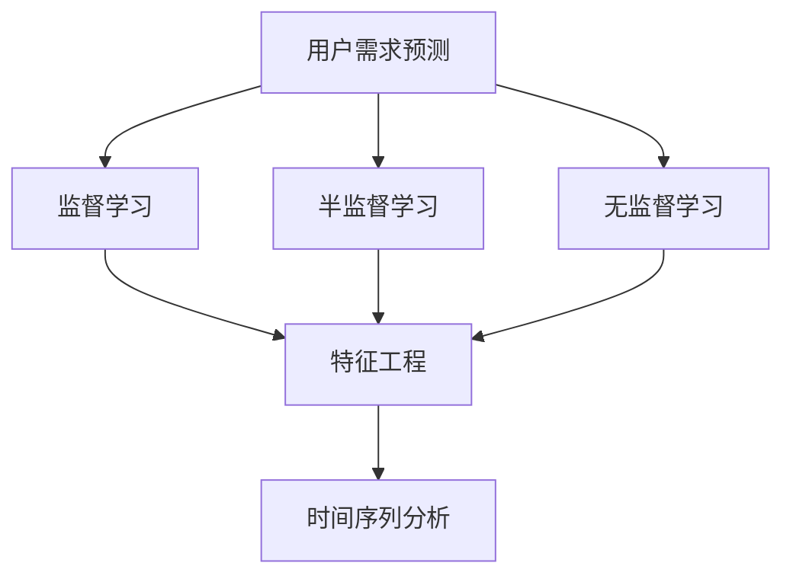

                 

# 如何进行有效的用户需求预测

## 1. 背景介绍

### 1.1 问题由来

在数字化和智能化的浪潮下，无论是电商平台、社交平台还是在线服务，用户需求预测都成为了提升用户体验、优化资源分配、驱动业务增长的重要手段。预测用户行为、偏好和需求，对于个性化推荐、库存管理、广告投放、内容推送等方面具有重要意义。

### 1.2 问题核心关键点

用户需求预测的核心在于如何从用户历史行为和特征中，学习并预测其未来的需求。该问题通常可以用监督学习、半监督学习或无监督学习框架来解决。

- **监督学习**：利用有标注的用户数据，构建预测模型。常见的方法包括回归、分类、序列预测等。
- **半监督学习**：利用少量的标注数据和大量的无标注数据，构建预测模型。适用于标注数据稀缺的场景。
- **无监督学习**：利用用户行为数据本身，发现数据的内在结构和规律，用于预测用户需求。适用于无标注数据或标注数据难以获得的情况。

### 1.3 问题研究意义

用户需求预测的准确性直接影响到产品或服务的用户体验和满意度。通过预测用户需求，可以提前预见市场趋势，优化资源配置，提高运营效率，从而在竞争激烈的互联网市场中占据优势。

## 2. 核心概念与联系

### 2.1 核心概念概述

为更好地理解用户需求预测的原理和实现方法，本节将介绍几个核心概念：

- **用户需求预测**：根据用户历史行为和特征，预测其未来的需求，包括购买意向、浏览偏好、搜索查询等。
- **监督学习**：利用有标注的数据集，构建预测模型。通过最小化预测误差，提高模型预测准确性。
- **半监督学习**：结合少量标注数据和大量无标注数据，构建预测模型。利用无标注数据的信息，提高模型泛化能力。
- **无监督学习**：仅利用用户行为数据本身，发现数据的内在结构和规律，用于预测用户需求。
- **特征工程**：从原始数据中提取和构造新的特征，用于提高预测模型的性能。
- **时间序列分析**：关注数据随时间变化的规律，用于预测用户未来的行为。

这些核心概念之间的逻辑关系可以通过以下Mermaid流程图来展示：



这个流程图展示了几大核心概念及其之间的关系：

1. 用户需求预测是最终目标。
2. 监督学习、半监督学习和无监督学习是实现预测的几种主要方法。
3. 特征工程是提升模型预测精度的重要手段。
4. 时间序列分析用于捕捉数据随时间变化的规律。

这些概念共同构成了用户需求预测的理论框架，为其研究和应用提供了基础。

## 3. 核心算法原理 & 具体操作步骤
### 3.1 算法原理概述

用户需求预测通常采用监督学习框架，利用历史标注数据训练预测模型，并通过验证集和测试集进行模型评估和选择。预测模型的构建包括以下几个步骤：

1. **数据预处理**：收集和清洗用户历史行为数据，包括点击、购买、浏览、搜索等行为数据。
2. **特征工程**：从原始数据中提取和构造新的特征，如用户ID、时间戳、商品类别、行为序列等。
3. **模型选择**：选择适合的预测模型，如线性回归、决策树、随机森林、神经网络等。
4. **模型训练**：利用历史标注数据训练预测模型，调整模型参数以最小化预测误差。
5. **模型评估**：在验证集上评估模型性能，选择表现最优的模型进行预测。
6. **模型部署**：将模型部署到生产环境，对新用户行为进行预测。

### 3.2 算法步骤详解

以下是一个典型的用户需求预测流程，以电商平台用户购买行为预测为例：

1. **数据预处理**：
   - 收集用户历史购买数据，包括购买时间、商品ID、用户ID等。
   - 清洗数据，去除无效或异常记录。
   - 对缺失值进行填充或删除。
   - 标准化数据格式，便于模型处理。

2. **特征工程**：
   - 提取用户特征，如用户ID、性别、年龄、消费金额等。
   - 提取商品特征，如商品类别、品牌、价格等。
   - 构造用户行为序列，如最近购买商品列表、最近访问商品列表等。
   - 构造时间特征，如星期几、月份、季节等。
   - 构造交互特征，如用户-商品交互次数、商品类别交互次数等。

3. **模型选择**：
   - 选择适合的预测模型，如线性回归、决策树、随机森林、神经网络等。
   - 选择合适的评估指标，如均方误差(MSE)、平均绝对误差(MAE)、准确率、召回率、F1分数等。
   - 确定模型的超参数，如学习率、树深、神经网络层数等。

4. **模型训练**：
   - 将数据集分为训练集和验证集，70%用于训练，30%用于验证。
   - 利用训练集训练模型，最小化预测误差。
   - 在验证集上评估模型性能，调整模型参数。
   - 选择表现最优的模型进行预测。

5. **模型评估**：
   - 在测试集上评估模型性能，选择表现最优的模型进行预测。
   - 计算预测误差，如MSE、MAE等。
   - 可视化预测结果，如绘制预测值与实际值分布图。

6. **模型部署**：
   - 将模型部署到生产环境，实时处理新用户行为数据。
   - 对新用户购买行为进行预测。
   - 根据预测结果，推荐商品或提供个性化服务。

### 3.3 算法优缺点

用户需求预测算法具有以下优点：
1. 可解释性强。基于监督学习构建的模型，其预测过程可解释性强，能够解释为什么对某个用户进行特定预测。
2. 预测精度高。利用历史标注数据训练模型，能够在保证预测精度的前提下，获取较好的预测效果。
3. 适应性强。通过特征工程和模型选择，模型能够适应不同领域和场景的用户需求预测。

同时，该算法也存在以下局限性：
1. 依赖标注数据。预测模型的训练和评估依赖标注数据，标注数据的获取成本较高。
2. 数据质量和特征工程影响模型性能。如果数据质量差或特征工程不当，模型性能将受到影响。
3. 模型复杂度高。复杂的模型可能存在过拟合的风险，需要通过正则化等方法进行控制。

尽管存在这些局限性，但就目前而言，用户需求预测仍然是目前应用最广泛和最有效的方法之一。未来相关研究的重点在于如何进一步降低对标注数据的依赖，提高模型的泛化能力和可解释性。

### 3.4 算法应用领域

用户需求预测在多个领域得到了广泛应用，如：

- 电子商务：预测用户购买意向，优化库存管理，提高销售转化率。
- 社交网络：预测用户兴趣，推荐内容或广告，提高用户活跃度。
- 金融服务：预测用户消费行为，推荐理财产品，提升用户满意度。
- 在线教育：预测用户学习需求，推荐课程或教材，提高学习效果。
- 医疗健康：预测用户健康需求，推荐健康产品或服务，提升用户健康管理。

这些应用场景展示了用户需求预测的广泛适用性，也为其技术发展提供了广阔的天地。

## 4. 数学模型和公式 & 详细讲解 & 举例说明

### 4.1 数学模型构建

假设我们有一个电商平台用户购买行为数据集，包含用户ID、商品ID、购买时间、购买金额等。我们的目标是预测用户未来的购买金额。

假设用户ID为$x_i$，商品ID为$y_i$，购买时间为$t_i$，购买金额为$a_i$。我们希望构建一个模型$f(x_i,y_i,t_i)$，使得预测值$f(x_i,y_i,t_i)$与实际购买金额$a_i$尽量接近。

设预测模型为$f(x_i,y_i,t_i)=\sum_{j=1}^M\theta_j\phi_j(x_i,y_i,t_i)$，其中$\theta_j$为模型参数，$\phi_j(x_i,y_i,t_i)$为特征函数。

### 4.2 公式推导过程

我们以线性回归模型为例，推导预测模型的公式。假设预测模型为：

$$
f(x_i,y_i,t_i)=\theta_0+\theta_1x_i+\theta_2y_i+\theta_3t_i
$$

其中$\theta_0$、$\theta_1$、$\theta_2$、$\theta_3$为模型参数。

对于每个样本$(x_i,y_i,t_i,a_i)$，我们希望最小化预测误差，即：

$$
\min_{\theta_0,\theta_1,\theta_2,\theta_3} \sum_{i=1}^N (a_i - f(x_i,y_i,t_i))^2
$$

根据梯度下降算法，我们计算损失函数对模型参数的梯度，并更新参数值：

$$
\theta_j \leftarrow \theta_j - \eta \frac{\partial L}{\partial \theta_j}
$$

其中$\eta$为学习率，$L$为损失函数。

利用梯度下降算法，我们可以训练得到预测模型$f(x_i,y_i,t_i)$，用于预测用户未来的购买金额。

### 4.3 案例分析与讲解

假设我们有一个电商平台的用户购买行为数据集，包含10,000个用户、1,000个商品，以及10,000次购买记录。我们希望预测用户未来的购买金额。

我们首先将数据集划分为训练集和验证集，70%用于训练，30%用于验证。

我们选择了线性回归模型作为预测模型，并选择了均方误差(MSE)作为评估指标。

我们利用训练集训练模型，并计算验证集上的MSE值，选择表现最优的模型进行预测。

在模型训练过程中，我们发现模型的MSE值在训练集和验证集上均逐渐减小，最终达到了一个稳定的值。

我们利用模型对新用户的行为进行预测，并根据预测结果推荐商品。

## 5. 项目实践：代码实例和详细解释说明

### 5.1 开发环境搭建

在进行用户需求预测项目实践前，我们需要准备好开发环境。以下是使用Python进行Scikit-learn开发的环境配置流程：

1. 安装Anaconda：从官网下载并安装Anaconda，用于创建独立的Python环境。

2. 创建并激活虚拟环境：
```bash
conda create -n prediction-env python=3.8 
conda activate prediction-env
```

3. 安装Scikit-learn：
```bash
conda install scikit-learn
```

4. 安装各类工具包：
```bash
pip install numpy pandas scikit-learn matplotlib tqdm jupyter notebook ipython
```

完成上述步骤后，即可在`prediction-env`环境中开始项目实践。

### 5.2 源代码详细实现

下面我们以电商平台用户购买行为预测为例，给出使用Scikit-learn进行预测的Python代码实现。

首先，定义数据预处理函数：

```python
import pandas as pd
import numpy as np
from sklearn.model_selection import train_test_split
from sklearn.preprocessing import StandardScaler

def preprocess_data(data_path):
    # 读取数据
    data = pd.read_csv(data_path)
    
    # 数据清洗
    data = data.dropna()
    
    # 数据标准化
    scaler = StandardScaler()
    data = scaler.fit_transform(data)
    
    # 数据拆分
    X = data[:, :3]  # 特征
    y = data[:, 3]   # 目标变量
    
    return X, y
```

然后，定义特征工程函数：

```python
from sklearn.feature_selection import SelectKBest, f_regression

def feature_engineering(X, y):
    # 特征选择
    selector = SelectKBest(score_func=f_regression, k=3)
    X_new = selector.fit_transform(X, y)
    
    # 特征编码
    X_new = pd.get_dummies(X_new, columns=[0])
    
    return X_new
```

接着，定义模型训练函数：

```python
from sklearn.linear_model import LinearRegression
from sklearn.metrics import mean_squared_error

def train_model(X_train, y_train):
    # 训练模型
    model = LinearRegression()
    model.fit(X_train, y_train)
    
    # 评估模型
    y_pred = model.predict(X_train)
    mse = mean_squared_error(y_train, y_pred)
    print(f"MSE: {mse:.2f}")
    
    return model
```

最后，启动训练流程并在测试集上评估：

```python
data_path = 'data.csv'
X, y = preprocess_data(data_path)

X_train, X_test, y_train, y_test = train_test_split(X, y, test_size=0.3)

X_train = feature_engineering(X_train, y_train)
X_test = feature_engineering(X_test, y_test)

model = train_model(X_train, y_train)

print(f"Test MSE: {mean_squared_error(y_test, model.predict(X_test)):.2f}")
```

以上就是使用Scikit-learn对电商平台用户购买行为进行预测的完整代码实现。可以看到，利用Scikit-learn，我们可以用相对简洁的代码实现用户需求预测模型的训练和评估。

### 5.3 代码解读与分析

让我们再详细解读一下关键代码的实现细节：

**preprocess_data函数**：
- `pd.read_csv(data_path)`：读取数据文件。
- `data.dropna()`：清洗数据，去除缺失值。
- `StandardScaler()`：标准化数据。
- `X = data[:, :3]`：提取特征。
- `y = data[:, 3]`：提取目标变量。

**feature_engineering函数**：
- `SelectKBest()`：特征选择。
- `f_regression`：特征选择评分函数。
- `selector.fit_transform(X, y)`：特征选择并转换。
- `pd.get_dummies()`：特征编码。

**train_model函数**：
- `LinearRegression()`：创建线性回归模型。
- `model.fit(X_train, y_train)`：训练模型。
- `y_pred = model.predict(X_train)`：预测训练集结果。
- `mean_squared_error(y_train, y_pred)`：计算均方误差。

**训练流程**：
- `train_test_split(X, y, test_size=0.3)`：数据拆分。
- `X_train = feature_engineering(X_train, y_train)`：特征选择和编码。
- `X_test = feature_engineering(X_test, y_test)`：特征选择和编码。
- `model = train_model(X_train, y_train)`：模型训练。
- `mean_squared_error(y_test, model.predict(X_test))`：模型评估。

可以看到，Scikit-learn使得用户需求预测的代码实现变得简洁高效。开发者可以将更多精力放在数据处理、模型改进等高层逻辑上，而不必过多关注底层的实现细节。

当然，工业级的系统实现还需考虑更多因素，如模型的保存和部署、超参数的自动搜索、更灵活的特征选择策略等。但核心的预测范式基本与此类似。

## 6. 实际应用场景

### 6.1 智能推荐系统

用户需求预测在智能推荐系统中的应用非常广泛。通过预测用户未来的需求，推荐系统可以提前准备好用户可能感兴趣的商品，提升用户体验和满意度。

在技术实现上，可以利用用户的历史行为数据，如浏览、点击、购买等行为，预测用户未来的购买意向，并根据预测结果进行个性化推荐。利用推荐系统，电商平台上每个用户都可以看到自己可能感兴趣的商品，显著提高了用户的购买转化率。

### 6.2 广告投放优化

在广告投放中，用户需求预测可以帮助广告主精确投放广告，提高广告投放效果。通过预测用户的兴趣和行为，广告系统可以在合适的时间、地点、方式下，向用户展示最合适的广告，从而提升广告点击率和转化率。

### 6.3 库存管理优化

库存管理是电商平台运营中非常重要的一环。通过用户需求预测，电商平台可以提前了解用户未来的购买意向，优化库存管理和物流配送，避免因库存不足或过剩带来的损失。

### 6.4 未来应用展望

随着用户需求预测技术的发展，其应用领域将进一步扩大。未来，该技术将在更多领域中得到应用，如金融风控、医疗诊断、交通管理等，为社会经济带来更深远的影响。

## 7. 工具和资源推荐

### 7.1 学习资源推荐

为了帮助开发者系统掌握用户需求预测的理论基础和实践技巧，这里推荐一些优质的学习资源：

1. 《机器学习实战》系列书籍：由机器学习专家撰写，系统介绍了机器学习的基本概念和算法，包括监督学习、回归、分类、聚类等。
2. Coursera《机器学习》课程：由斯坦福大学教授Andrew Ng开设的机器学习课程，包含大量实例和实验，适合入门学习。
3. Kaggle竞赛：参加Kaggle竞赛，通过实际案例练习机器学习技术，提升实战能力。
4. GitHub开源项目：Github上有很多优秀的用户需求预测项目，可以学习他人的实现方法，提高开发效率。
5. PyTorch官方文档：PyTorch是当前最流行的深度学习框架之一，其文档详细介绍了如何使用PyTorch进行用户需求预测。

通过对这些资源的学习实践，相信你一定能够快速掌握用户需求预测的精髓，并用于解决实际的业务问题。

### 7.2 开发工具推荐

高效的开发离不开优秀的工具支持。以下是几款用于用户需求预测开发的常用工具：

1. Python：作为机器学习领域的主流编程语言，Python具有丰富的库和工具，适合进行数据分析和模型训练。
2. Scikit-learn：Python的机器学习库，提供了丰富的算法和模型，简单易用。
3. TensorFlow和PyTorch：深度学习框架，支持分布式训练和部署，适合大规模数据和模型。
4. Jupyter Notebook：交互式编程环境，支持代码编写、可视化展示，适合科研和教学。
5. Matplotlib和Seaborn：数据可视化库，支持绘制各种图表，适合数据分析和报告撰写。

合理利用这些工具，可以显著提升用户需求预测任务的开发效率，加快创新迭代的步伐。

### 7.3 相关论文推荐

用户需求预测技术的发展源于学界的持续研究。以下是几篇奠基性的相关论文，推荐阅读：

1. "Prediction of User Behavior in E-Commerce"：提出了基于用户行为数据的预测模型，用于预测用户购买意向。
2. "Customer Segmentation for Personalized Recommendation Systems"：介绍了用户分群的方法，用于个性化推荐系统。
3. "Adaptive Personalization for Online Stores"：提出了基于用户行为数据的个性化推荐算法，用于优化广告投放。
4. "Predicting User Future Interactions with Social Media"：利用社交媒体数据，预测用户未来的行为，用于推荐系统和广告投放。
5. "Online Education Recommendation System"：介绍了在线教育推荐系统，用于推荐学习内容和资源。

这些论文代表了大规模用户需求预测的研究脉络。通过学习这些前沿成果，可以帮助研究者把握学科前进方向，激发更多的创新灵感。

## 8. 总结：未来发展趋势与挑战

### 8.1 总结

本文对用户需求预测进行了全面系统的介绍。首先阐述了用户需求预测的研究背景和意义，明确了预测在提升用户体验和业务增长方面的重要性。其次，从原理到实践，详细讲解了预测的数学模型和关键步骤，给出了项目实践的完整代码实例。同时，本文还广泛探讨了预测在推荐系统、广告投放等多个行业领域的应用前景，展示了预测技术的广阔应用空间。最后，本文精选了预测技术的各类学习资源，力求为读者提供全方位的技术指引。

通过本文的系统梳理，可以看到，用户需求预测技术正在成为推荐系统和广告投放的重要工具，极大地提升了电商、社交、金融等行业的服务质量和用户满意度。未来，伴随预测技术的不断演进，必将为更多行业带来颠覆性的变革。

### 8.2 未来发展趋势

展望未来，用户需求预测技术将呈现以下几个发展趋势：

1. 深度学习模型将取代传统模型。随着深度学习技术的进步，深度学习模型如神经网络、Transformer等将在用户需求预测中占据主导地位。
2. 多模态预测将得到应用。用户需求预测不仅涉及文本数据，还涉及图像、视频、音频等多模态数据。多模态预测将利用多源信息，提升预测准确性。
3. 个性化推荐将更加精准。通过结合用户历史行为数据、社交网络数据、地理位置数据等，用户需求预测将更加个性化，提升推荐效果。
4. 实时预测将成为常态。随着计算资源的提升和算法优化，实时预测将成为可能，能够即时响应用户需求，提升服务响应速度。
5. 预测模型将更加轻量化。轻量化模型将更加适用于移动设备和边缘计算，提升用户体验和系统性能。
6. 模型可解释性将得到重视。用户需求预测模型的可解释性将直接影响其应用可信度，模型解释技术将得到广泛应用。

以上趋势凸显了用户需求预测技术的广阔前景。这些方向的探索发展，必将进一步提升预测模型的精度和应用范围，为社会经济带来深远影响。

### 8.3 面临的挑战

尽管用户需求预测技术已经取得了显著进展，但在迈向更加智能化、普适化应用的过程中，仍面临诸多挑战：

1. 数据隐私和安全。用户需求预测依赖大量用户数据，如何保护用户隐私和数据安全成为重要问题。
2. 模型复杂度和可解释性。深度学习模型的复杂性可能导致解释困难，如何提高模型的可解释性是重要挑战。
3. 数据质量和多样性。预测模型依赖数据质量，数据多样性不足可能影响模型性能。
4. 实时处理性能。实时预测需要高性能计算资源，如何提升计算效率是重要挑战。
5. 预测模型的鲁棒性。预测模型需要具备鲁棒性，能够应对数据分布变化和异常值。

这些挑战需要研究者共同应对，推动预测技术不断进步。只有在数据、模型、工程、伦理等多方面协同发力，才能真正实现预测技术在实际应用中的广泛应用。

### 8.4 研究展望

面对用户需求预测所面临的种种挑战，未来的研究需要在以下几个方面寻求新的突破：

1. 探索无监督学习和强化学习范式。摆脱对标注数据的依赖，利用无监督学习和强化学习，提高预测模型的泛化能力和可解释性。
2. 研究跨领域预测技术。利用跨领域数据，提升预测模型的通用性和适应性，应对不同领域的预测需求。
3. 引入多源数据融合技术。将用户行为数据与其他数据源如社交网络数据、地理位置数据等结合，提升预测模型的准确性。
4. 开发可解释性模型。引入可解释性技术，如LIME、SHAP等，提升预测模型的解释性。
5. 研究模型轻量化技术。开发轻量化模型，提升实时预测的性能和用户体验。
6. 纳入伦理道德约束。在预测模型的设计中引入伦理导向的评估指标，避免有偏见、有害的输出。

这些研究方向的探索，必将引领用户需求预测技术迈向更高的台阶，为构建安全、可靠、可解释、可控的智能系统铺平道路。面向未来，用户需求预测技术还需要与其他人工智能技术进行更深入的融合，如知识表示、因果推理、强化学习等，多路径协同发力，共同推动预测技术的发展。只有勇于创新、敢于突破，才能不断拓展预测模型的边界，让智能技术更好地服务于人类社会。

## 9. 附录：常见问题与解答

**Q1：用户需求预测是否适用于所有行业？**

A: 用户需求预测适用于大多数行业，但不同行业的预测目标和方式可能有所不同。例如，电子商务主要关注用户购买意向和行为预测，社交网络主要关注用户兴趣和互动预测，金融行业主要关注用户消费和信用预测。需要根据具体行业特点选择合适的预测方法和评估指标。

**Q2：用户需求预测是否需要大量标注数据？**

A: 用户需求预测通常需要一定量的标注数据，但不一定需要大量数据。通过特征工程和模型优化，可以在较少的标注数据上获得较好的预测效果。例如，利用半监督学习、无监督学习等方法，可以在标注数据稀缺的情况下提升预测性能。

**Q3：用户需求预测模型如何更新？**

A: 用户需求预测模型需要定期更新，以适应数据分布的变化和新用户需求的变化。可以通过重新训练模型、添加新数据、调整特征工程方法等方式进行模型更新。需要注意的是，模型的更新不能频繁进行，否则可能影响预测的稳定性和可解释性。

**Q4：用户需求预测模型的评估指标有哪些？**

A: 用户需求预测模型的评估指标包括均方误差(MSE)、平均绝对误差(MAE)、准确率、召回率、F1分数等。不同的预测任务可能需要选择不同的评估指标，以更全面地衡量模型性能。

**Q5：用户需求预测的模型选择有哪些？**

A: 用户需求预测的模型选择包括线性回归、决策树、随机森林、神经网络等。不同模型适用于不同的预测任务和数据类型，需要根据具体场景进行选择。此外，也可以使用集成学习方法，如Bagging、Boosting等，提升预测效果。

---

作者：禅与计算机程序设计艺术 / Zen and the Art of Computer Programming

