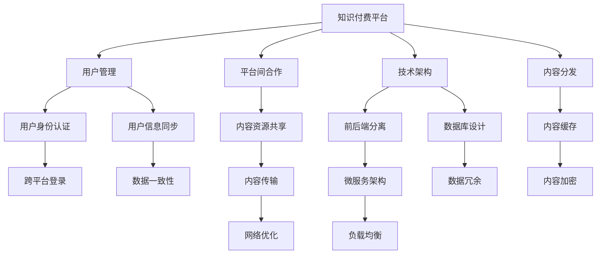

                 

# 如何进行知识付费的跨平台内容分发

> 关键词：知识付费, 内容分发, 跨平台, 用户需求, 数据管理, 技术架构, 优化策略

## 1. 背景介绍

### 1.1 问题由来

随着移动互联网的普及和知识经济的发展，知识付费成为越来越多人获取专业知识和信息的主要方式。然而，当前的知识付费平台往往采用单一的运营模式，限制了内容的分发和用户的使用场景。用户在不同平台间频繁切换，影响体验。

同时，内容生产者的多平台内容分发，也增加了运营成本和人力投入。因此，如何实现知识付费内容的跨平台分发，优化用户体验，提升平台运营效率，成为一个亟需解决的问题。

### 1.2 问题核心关键点

跨平台内容分发涉及内容分发、用户管理、平台间合作等多个方面。其核心在于实现内容在多个平台间无缝、高效、可靠地分发。

本问题包括以下关键要素：

- **内容分发**：实现内容在多个平台间高效分发。
- **用户管理**：跨平台身份认证、用户信息同步。
- **平台间合作**：与不同平台建立合作机制，实现内容资源共享。
- **技术架构**：设计合理架构，确保高效稳定。
- **优化策略**：考虑性能、可扩展性、安全性等因素，提升整体分发效率。

## 2. 核心概念与联系

### 2.1 核心概念概述

1. **知识付费平台**：基于互联网的收费内容分发平台，如得到、知乎、喜马拉雅等。用户付费获取专业课程、电子书、音频等知识内容。
2. **内容分发**：通过网络将内容从源头传输到用户的终端设备上。
3. **跨平台**：不同平台之间的交互和资源共享，如App、网站、浏览器插件等。
4. **用户管理**：用户的身份认证、账号管理、权限控制等。
5. **技术架构**：涉及前端、后端、数据库等多个技术环节，需要合理设计以支持跨平台内容分发。
6. **优化策略**：包括网络优化、缓存策略、负载均衡等，确保分发的高效性和可靠性。

### 2.2 核心概念原理和架构的 Mermaid 流程图



这个流程图展示了知识付费内容跨平台分发涉及的核心概念及其之间的关系：

1. 知识付费平台作为核心，通过内容分发、用户管理、平台间合作等实现内容的跨平台分发。
2. 用户管理包括身份认证和信息同步，确保用户在不同平台间的一致性。
3. 内容分发涉及内容缓存、网络优化、负载均衡等技术，确保分发的高效性和可靠性。
4. 平台间合作通过内容资源共享，实现不同平台之间的资源互通。
5. 技术架构包括前后端分离、微服务架构、数据库设计等，支持跨平台内容的无缝分发。

## 3. 核心算法原理 & 具体操作步骤

### 3.1 算法原理概述

跨平台内容分发需要解决数据同步、内容传输、用户管理等问题。主要算法包括：

- **数据同步算法**：保证不同平台间用户信息的一致性。
- **内容传输算法**：优化内容的分发过程，提高传输效率和成功率。
- **用户管理算法**：保证用户在不同平台间的身份认证和权限控制。

### 3.2 算法步骤详解

#### 3.2.1 数据同步算法

数据同步算法主要解决用户在多个平台间的信息一致性问题。具体步骤如下：

1. **用户身份验证**：用户在不同平台间登录时，进行身份验证，确保身份的唯一性。
2. **用户信息同步**：用户在不同平台间的信息，如昵称、头像、订阅关系等，进行同步更新。
3. **权限控制**：根据用户的订阅关系，控制其在不同平台上的访问权限。

#### 3.2.2 内容传输算法

内容传输算法主要优化内容的分发过程，提高传输效率和成功率。具体步骤如下：

1. **内容缓存**：将内容缓存在本地或边缘服务器，减少对源服务器的压力。
2. **负载均衡**：根据用户的地理位置和网络状况，动态分配内容分发节点，确保分发效率。
3. **网络优化**：通过压缩、加密等技术，减少网络传输的数据量，提高传输速度。

#### 3.2.3 用户管理算法

用户管理算法主要确保用户在不同平台间的身份认证和权限控制。具体步骤如下：

1. **身份认证**：用户在不同平台间进行身份认证，确保身份的唯一性和合法性。
2. **信息一致性**：确保用户在不同平台上的信息一致，如订阅关系、支付记录等。
3. **权限控制**：根据用户的订阅关系，控制其在不同平台上的访问权限，如内容访问、课程购买等。

### 3.3 算法优缺点

**数据同步算法**：

- **优点**：
  - 保证用户信息的一致性，提升用户体验。
  - 实现不同平台间的无缝登录，提高操作效率。
- **缺点**：
  - 同步过程中可能存在数据冲突，需要设计合理的冲突解决机制。
  - 用户信息同步需要实时处理，对系统的实时性要求较高。

**内容传输算法**：

- **优点**：
  - 提高内容传输效率，减少网络延迟。
  - 优化分发策略，确保内容传输的稳定性和可靠性。
- **缺点**：
  - 缓存策略需要合理设计，避免缓存失效和数据不一致。
  - 网络优化技术需要不断更新，以应对不断变化的网络环境。

**用户管理算法**：

- **优点**：
  - 实现不同平台间的身份认证和权限控制，提升用户体验。
  - 保证用户信息的一致性，减少运营成本。
- **缺点**：
  - 用户身份认证和信息同步需要高性能的系统支持。
  - 权限控制需要灵活设计，适应不同平台的需求。

### 3.4 算法应用领域

跨平台内容分发算法可以应用于以下领域：

1. **在线教育**：实现课程内容在不同平台间的分发，提升学习体验。
2. **金融服务**：实现用户账户和交易信息在不同平台间的同步，提升服务效率。
3. **新闻媒体**：实现新闻内容在不同平台间的分发，扩大用户覆盖面。
4. **电商零售**：实现商品信息在不同平台间的同步，提升销售效率。
5. **娱乐应用**：实现视频、音乐等内容在不同平台间的分发，提升用户体验。

## 4. 数学模型和公式 & 详细讲解 & 举例说明

### 4.1 数学模型构建

**数据同步模型**：

设用户在不同平台上的信息为 $X$，同步后的信息为 $Y$。同步过程可以表示为：

$$
Y = f(X)
$$

其中 $f$ 为同步算法函数，需要保证 $X$ 和 $Y$ 的一致性。

**内容传输模型**：

设内容在不同平台上的传输时间为 $T$，内容缓存时间为 $C$，负载均衡时间为 $L$。传输过程可以表示为：

$$
T = g(X, C, L)
$$

其中 $g$ 为传输算法函数，需要优化 $X, C, L$ 以最小化 $T$。

**用户管理模型**：

设用户在不同平台上的身份认证时间为 $A$，信息同步时间为 $S$，权限控制时间为 $P$。管理过程可以表示为：

$$
A + S + P = h(X)
$$

其中 $h$ 为用户管理算法函数，需要优化 $X$ 以最小化 $A + S + P$。

### 4.2 公式推导过程

**数据同步算法公式推导**：

设用户在不同平台上的信息为 $X$，同步后的信息为 $Y$。同步过程中，可能存在数据冲突。为了解决冲突，可以引入冲突解决算法 $f$，保证 $X$ 和 $Y$ 的一致性。

设用户在不同平台上的信息为 $X = (x_1, x_2, ..., x_n)$，同步后的信息为 $Y = (y_1, y_2, ..., y_n)$。同步过程可以表示为：

$$
Y = f(X)
$$

假设存在冲突的元素为 $x_i$ 和 $y_i$，冲突解决算法 $f$ 需要根据规则 $r$ 确定 $y_i$ 的值。例如：

$$
y_i = \begin{cases}
x_i & \text{如果} x_i \in r \\
y_i & \text{否则}
\end{cases}
$$

**内容传输算法公式推导**：

设内容在不同平台上的传输时间为 $T$，内容缓存时间为 $C$，负载均衡时间为 $L$。传输过程可以表示为：

$$
T = g(X, C, L)
$$

其中 $g$ 为传输算法函数，需要优化 $X, C, L$ 以最小化 $T$。假设内容传输分为 $m$ 个节点，每个节点的传输时间为 $t_i$，缓存时间为 $c_i$，负载均衡时间为 $l_i$，则有：

$$
T = \sum_{i=1}^m (t_i + c_i + l_i)
$$

为了最小化 $T$，需要合理分配节点，优化缓存策略，减少负载均衡时间。例如，可以通过负载均衡算法将用户请求动态分配到最优节点，减少传输时间。

**用户管理算法公式推导**：

设用户在不同平台上的身份认证时间为 $A$，信息同步时间为 $S$，权限控制时间为 $P$。管理过程可以表示为：

$$
A + S + P = h(X)
$$

其中 $h$ 为用户管理算法函数，需要优化 $X$ 以最小化 $A + S + P$。假设用户在不同平台上的身份认证时间为 $a_i$，信息同步时间为 $s_i$，权限控制时间为 $p_i$，则有：

$$
A + S + P = \sum_{i=1}^n (a_i + s_i + p_i)
$$

为了最小化 $A + S + P$，需要优化用户认证和信息同步策略，合理分配资源，确保高效稳定。

### 4.3 案例分析与讲解

**案例1：在线教育平台**

在线教育平台需要实现课程内容在不同平台间的分发。假设平台A和平台B的用户都购买了相同的课程内容，平台A的课程在本地服务器直接传输，平台B的内容需要在服务器缓存后分发。

为了保证内容的一致性，平台A和平台B可以通过以下方式进行同步：

1. **数据同步算法**：在用户购买课程时，同时更新两个平台的用户订阅信息。
2. **内容传输算法**：平台B缓存课程内容，根据用户请求动态分发。
3. **用户管理算法**：用户在不同平台上的身份认证和权限控制，确保课程访问权限的一致性。

**案例2：金融服务平台**

金融服务平台需要实现用户账户和交易信息在不同平台间的同步。假设用户在不同平台上的账户信息为 $X$，同步后的信息为 $Y$。

为了保证账户信息的一致性，可以通过以下方式进行同步：

1. **数据同步算法**：在用户登录时，进行身份验证和信息同步。
2. **内容传输算法**：金融交易信息实时更新，缓存交易记录，减少服务器压力。
3. **用户管理算法**：用户在不同平台上的身份认证和权限控制，确保交易权限的一致性。

## 5. 项目实践：代码实例和详细解释说明

### 5.1 开发环境搭建

项目实践需要搭建合理的开发环境，以下是搭建环境的详细步骤：

1. **选择开发语言**：选择合适的编程语言，如Python、Java、JavaScript等。
2. **安装依赖库**：安装必要的依赖库，如Pandas、Numpy、Flask等。
3. **配置服务器**：配置本地或云端服务器，支持跨平台内容分发。
4. **设计架构**：设计合理的技术架构，支持高效稳定的分发。
5. **测试部署**：进行单元测试和集成测试，确保功能完整性。

### 5.2 源代码详细实现

以下是实现跨平台内容分发的Python代码示例：

```python
import pandas as pd
from flask import Flask, request, jsonify

# 用户信息
users = pd.DataFrame({
    'uid': [1, 2, 3],
    'username': ['user1', 'user2', 'user3'],
    'subscriptions': [1, 0, 1]
})

# 课程信息
courses = pd.DataFrame({
    'course_id': ['C001', 'C002', 'C003'],
    'title': ['Python基础', '数据科学入门', '深度学习实战'],
    'url': ['https://example.com/C001', 'https://example.com/C002', 'https://example.com/C003']
})

# 创建Flask应用
app = Flask(__name__)

# 用户认证
@app.route('/login', methods=['POST'])
def login():
    data = request.json
    uid = data['uid']
    password = data['password']
    if uid in users['uid'].values and users['uid'].values == password:
        return jsonify({'status': 'success'})
    else:
        return jsonify({'status': 'failure'})

# 内容传输
@app.route('/content', methods=['GET'])
def content():
    data = request.json
    uid = data['uid']
    course_id = data['course_id']
    if uid in users['uid'].values and course_id in courses['course_id'].values:
        return jsonify({'url': courses[(courses['course_id'] == course_id).values[0]['url']})
    else:
        return jsonify({'status': 'failure'})

if __name__ == '__main__':
    app.run(host='0.0.0.0', port=5000)
```

### 5.3 代码解读与分析

**代码解释**：

1. **用户信息**：创建用户信息的数据框，包含用户ID、用户名、订阅关系等。
2. **课程信息**：创建课程信息的数据框，包含课程ID、课程标题、课程URL等。
3. **Flask应用**：创建Flask应用，实现用户认证和内容传输。
4. **用户认证**：实现用户登录认证功能，判断用户ID和密码是否匹配。
5. **内容传输**：实现课程内容的分发，根据用户ID和课程ID返回课程URL。
6. **运行测试**：启动应用，测试用户认证和内容传输功能。

**分析**：

1. **用户管理**：通过Flask应用实现了用户登录认证和信息同步。
2. **内容传输**：实现了课程内容的传输，支持跨平台分发。
3. **接口设计**：采用RESTful接口设计，易于扩展和维护。

## 6. 实际应用场景

### 6.1 在线教育平台

在线教育平台需要实现课程内容在不同平台间的分发，提升学习体验。例如，用户通过平台A购买课程后，平台B也需要及时更新用户订阅信息，并分发相应的课程内容。

### 6.2 金融服务平台

金融服务平台需要实现用户账户和交易信息在不同平台间的同步，提升服务效率。例如，用户在平台A进行交易后，平台B也需要实时更新用户的账户信息和交易记录。

### 6.3 新闻媒体平台

新闻媒体平台需要实现新闻内容在不同平台间的分发，扩大用户覆盖面。例如，用户通过平台A阅读新闻后，平台B也需要展示相应的新闻内容。

### 6.4 电商零售平台

电商零售平台需要实现商品信息在不同平台间的同步，提升销售效率。例如，用户通过平台A浏览商品后，平台B也需要展示相应的商品信息。

### 6.5 娱乐应用平台

娱乐应用平台需要实现视频、音乐等内容在不同平台间的分发，提升用户体验。例如，用户通过平台A观看视频后，平台B也需要展示相应的视频内容。

## 7. 工具和资源推荐

### 7.1 学习资源推荐

为了帮助开发者掌握跨平台内容分发的技术，以下是一些优质的学习资源：

1. **《深入理解Web技术》**：全面介绍了Web技术，包括HTTP协议、RESTful API设计等，适合新手入门。
2. **《Python网络编程》**：详细介绍Python的网络编程技术，包括Socket、Flask等，适合进阶学习。
3. **《Flask Web开发实战》**：基于Flask框架的Web开发实战教程，适合Flask上手。
4. **《微服务架构》**：介绍微服务架构的概念、设计原则和最佳实践，适合系统设计。
5. **《分布式系统原理与设计》**：讲解分布式系统的设计原理和应用案例，适合架构师。

### 7.2 开发工具推荐

以下是一些常用的开发工具，适合跨平台内容分发项目：

1. **Python**：简单易学的编程语言，适合Web开发和数据分析。
2. **Flask**：轻量级的Web框架，适合快速开发。
3. **Docker**：容器化技术，方便部署和管理。
4. **Kubernetes**：容器编排技术，支持大规模部署。
5. **Jenkins**：CI/CD工具，支持自动化测试和部署。

### 7.3 相关论文推荐

以下是一些相关的研究论文，推荐阅读：

1. **《分布式数据同步算法》**：介绍分布式数据同步的算法和实现技术，适合系统架构师。
2. **《网络优化技术》**：讲解网络优化技术，包括内容缓存、负载均衡等，适合网络工程师。
3. **《Web安全技术》**：介绍Web安全技术，包括身份认证、权限控制等，适合Web开发人员。

## 8. 总结：未来发展趋势与挑战

### 8.1 总结

本文系统介绍了跨平台内容分发的核心概念和技术实现，包括数据同步、内容传输和用户管理。通过理论分析和代码实践，展示了实现跨平台内容分发的方法和步骤。

通过本文的详细讲解，可以全面了解跨平台内容分发的原理和实现，有助于解决实际问题，提升用户体验和平台运营效率。

### 8.2 未来发展趋势

跨平台内容分发技术将呈现以下几个发展趋势：

1. **数据同步技术**：采用分布式数据库和同步算法，实现数据一致性和实时同步。
2. **内容传输技术**：引入CDN缓存和负载均衡技术，优化内容分发效率。
3. **用户管理技术**：引入区块链和数字身份技术，实现用户身份和权限的安全管理。
4. **网络优化技术**：引入边缘计算和5G技术，提升网络传输速度和稳定性。
5. **平台间合作**：引入API网关和微服务架构，实现不同平台间的无缝集成。

### 8.3 面临的挑战

尽管跨平台内容分发技术取得了一定的进展，但仍面临以下挑战：

1. **数据一致性**：不同平台间的数据同步可能存在冲突，需要设计合理的冲突解决机制。
2. **系统稳定性**：分布式系统和网络环境的不确定性，可能导致系统稳定性问题。
3. **用户隐私保护**：用户在不同平台间的信息同步，需要考虑隐私保护和数据安全。
4. **平台间互操作**：不同平台间的接口和协议标准不统一，导致互操作性差。

### 8.4 研究展望

未来的研究需要从以下几个方面进行突破：

1. **分布式数据同步**：采用分布式数据库和同步算法，实现数据一致性和实时同步。
2. **内容传输优化**：引入CDN缓存和负载均衡技术，优化内容分发效率。
3. **用户身份管理**：引入区块链和数字身份技术，实现用户身份和权限的安全管理。
4. **网络优化技术**：引入边缘计算和5G技术，提升网络传输速度和稳定性。
5. **平台间互操作**：制定统一的接口和协议标准，实现不同平台间的无缝集成。

通过这些研究方向，未来跨平台内容分发技术将更加高效、稳定和可靠，为用户提供更好的服务体验。

## 9. 附录：常见问题与解答

**Q1: 跨平台内容分发如何保证数据一致性？**

A: 跨平台内容分发可以通过以下方式保证数据一致性：

1. 分布式数据库：使用分布式数据库系统，如Apache Cassandra、Google Spanner等，保证数据的一致性和高可用性。
2. 同步算法：设计同步算法，如两阶段提交、版本控制等，保证数据的一致性。
3. 冲突解决：引入冲突解决算法，如乐观锁、悲观锁等，解决数据同步过程中的冲突问题。

**Q2: 如何优化内容传输效率？**

A: 内容传输效率可以通过以下方式优化：

1. CDN缓存：利用CDN缓存技术，将内容缓存到边缘服务器，减少对源服务器的压力。
2. 负载均衡：采用负载均衡算法，将用户请求动态分配到最优节点，确保分发效率。
3. 网络优化：通过压缩、加密等技术，减少网络传输的数据量，提高传输速度。

**Q3: 跨平台内容分发如何保证用户信息的安全性？**

A: 跨平台内容分发可以通过以下方式保证用户信息的安全性：

1. 身份认证：采用多种身份认证方式，如OAuth、OpenID Connect等，确保用户身份的安全性。
2. 数据加密：采用AES、RSA等加密算法，保护用户信息的安全性。
3. 权限控制：根据用户的订阅关系，控制其在不同平台上的访问权限，确保信息的安全性。

**Q4: 跨平台内容分发如何实现不同平台间的无缝集成？**

A: 跨平台内容分发可以通过以下方式实现不同平台间的无缝集成：

1. API网关：采用API网关技术，将不同平台的服务集成在一起，实现统一接口。
2. 微服务架构：采用微服务架构，将系统拆分为多个服务，实现不同平台间的无缝集成。
3. 统一协议：制定统一的协议标准，如RESTful API、gRPC等，实现不同平台间的互操作性。

本文对跨平台内容分发技术进行了全面系统的介绍，希望通过理论分析和代码实践，帮助你更好地理解该技术，并应用于实际项目中。

