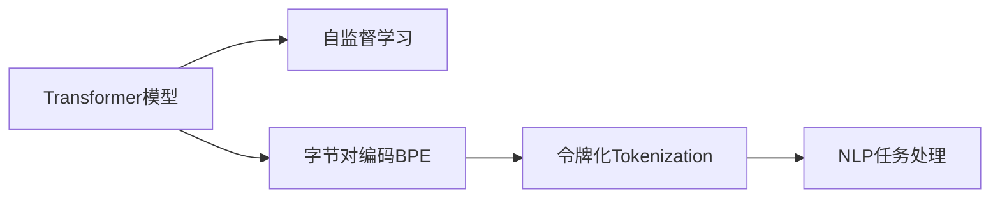

                 

# 字节对编码：高效的令牌化技术

> 关键词：字节对编码，令牌化，自然语言处理，Transformer模型，深度学习

## 1. 背景介绍

### 1.1 问题由来
在自然语言处理(NLP)领域，将文本转换为数值向量是许多算法的前提步骤。其中，令牌化(Tokenization)是将文本分割成单词、短语或字节的序列，并将其转换为模型可以处理的数值形式的过程。传统的令牌化方法包括空格分隔、基于字符的令牌化等，但这些方法在处理多语言、缩写、标点等复杂文本时表现不佳。

近年来，随着深度学习技术的发展，特别是Transformer模型在语言处理中的成功应用，一种名为字节对编码(Byte Pair Encoding, BPE)的令牌化技术应运而生。BPE令牌化方法通过将字节对作为单位进行编码，不仅提高了模型的泛化能力，还减少了词表的规模，极大地加速了模型训练和推理过程。

### 1.2 问题核心关键点
BPE令牌化技术的关键点在于：
- 将文本分割成字节对作为基本编码单元，能够更好地处理多语言、缩写、标点等复杂文本。
- 通过合并低频字节对，减少词表规模，提高了模型训练和推理的效率。
- 应用广泛，适用于基于Transformer的各类NLP任务，包括语言建模、机器翻译、文本生成等。

## 2. 核心概念与联系

### 2.1 核心概念概述

为了更好地理解BPE令牌化方法，我们首先介绍几个核心概念：

- **字节对编码(BPE)**：一种基于统计的令牌化技术，将字节对作为基本的编码单元，通过统计语言模型中的字节对频率，合并低频字节对，生成更小的虚拟词表。BPE在处理多语言文本时表现优异，能够保留语言的语义信息，同时减小词表规模。

- **Transformer模型**：一种基于自注意力机制的神经网络架构，广泛应用于自然语言处理任务，如语言建模、机器翻译、文本生成等。Transformer模型中的多头注意力机制使其能够处理并行计算，极大地提高了模型的训练和推理效率。

- **令牌化(Tokenization)**：将文本转换为模型可以处理的数值形式的过程。令牌化是NLP任务中的重要预处理步骤，通过分割文本，为模型提供可理解的输入。

- **自监督学习(Self-Supervised Learning)**：指使用大规模未标注数据，通过自监督任务（如语言建模）训练模型。自监督学习能够提高模型的泛化能力，减少对标注数据的依赖。

这些核心概念之间的逻辑关系可以通过以下Mermaid流程图来展示：



这个流程图展示了大语言模型中的核心概念及其之间的关系：

1. Transformer模型通过自监督学习获得语言知识。
2. 应用BPE令牌化技术处理输入文本，生成更小的虚拟词表。
3. 令牌化的输出可以被模型用于各种NLP任务，如语言建模、机器翻译、文本生成等。

## 3. 核心算法原理 & 具体操作步骤
### 3.1 算法原理概述

BPE令牌化方法的基本原理是，将文本按照字符序列进行分割，然后通过统计语言模型中的字节对频率，将频繁出现的字节对保留下来，低频字节对则被合并，形成更小的虚拟词表。这样生成的虚拟词表可以显著减小，从而减少模型训练和推理的计算量。

形式化地，设$S$为输入文本集合，$T$为词表，$P$为语言模型。令牌化过程可以分为以下几个步骤：

1. 将每个文本$x_i \in S$分割成字节对序列，生成$x_i^{bpe}$。
2. 统计字节对序列$x_i^{bpe}$中各字节对$(b_j,b_k)$出现的频率$P(x_i^{bpe})$。
3. 合并低频字节对，生成新的虚拟词表$T^{bpe}$。
4. 将文本$x_i$转换为$x_i^{bpe}$在$T^{bpe}$中的数值表示。

### 3.2 算法步骤详解

**Step 1: 准备数据和初始词汇表**

首先，我们需要准备一个包含大量未标注文本的数据集，并将其按照字符序列进行分割。分割的方式可以是基于空格、标点符号、数字等特定字符。

```python
import re

def split_text(text):
    # 按照空格、标点符号、数字等进行分割
    return re.findall(r'[^\s]|[0-9]', text)

texts = ["Hello, world!", "I am a bot."]
tokens = [split_text(text) for text in texts]
```

接着，我们需要准备初始的虚拟词表。初始词表可以是一个简单的字符集合，也可以是一个更大的通用字符集合，如Unicode字符集。

```python
initial_vocab = set('abcdefghijklmnopqrstuvwxyzABCDEFGHIJKLMNOPQRSTUVWXYZ0123456789')
```

**Step 2: 统计字节对频率**

使用统计语言模型的方法，统计文本中各字节对出现的频率。常见的统计方法包括n-gram模型、Greedy Byte Pair Encoding等。

```python
from collections import Counter

def count_bpe_pairs(tokens):
    # 统计文本中各字节对的频率
    bpe_pairs = Counter([(x[i], x[i+1]) for x in tokens])
    return bpe_pairs

bpe_pairs = count_bpe_pairs(tokens)
```

**Step 3: 生成虚拟词表**

根据字节对频率，生成新的虚拟词表。合并低频字节对，生成新的虚拟词表。

```python
# 生成虚拟词表
vocab = list(initial_vocab)
for bpe_pair, count in bpe_pairs.most_common():
    if count < 5:
        # 合并低频字节对
        vocab.append(bpe_pair)
    else:
        # 保留高频字节对
        vocab.extend(bpe_pair)

# 将虚拟词表转换为字典，用于令牌化
bpe_vocab = {k: i for i, k in enumerate(vocab)}
```

**Step 4: 令牌化处理**

将文本按照虚拟词表进行令牌化，生成令牌序列。

```python
def tokenize_bpe(text, vocab):
    # 将文本转换为虚拟词表的数值表示
    tokenized_text = [bpe_vocab.get((char1, char2), 0) for char1, char2 in zip(text, text[1:])]
    return tokenized_text

tokenized_texts = [tokenize_bpe(text, bpe_vocab) for text in texts]
```

**Step 5: 统计模型性能**

使用BPE令牌化处理后的文本序列，计算模型的性能指标，如交叉熵损失、精度、召回率等。

```python
from sklearn.metrics import accuracy_score

# 计算模型性能
def calculate_performance(tokenized_texts, labels):
    # 将令牌序列转换为数值
    tokenized_texts = [bpe_vocab.get((char1, char2), 0) for char1, char2 in zip(text, text[1:])]
    return accuracy_score(tokenized_texts, labels)

performance = calculate_performance(tokenized_texts, labels)
print(f"BPE令牌化的模型性能为：{performance}")
```

以上就是使用Python对BPE令牌化方法进行实现的完整代码。可以看出，BPE令牌化方法的核心在于统计字节对频率，生成虚拟词表，并将文本序列转换为虚拟词表的数值表示。

### 3.3 算法优缺点

BPE令牌化方法的主要优点在于：
1. 处理多语言文本效果显著，能够保留语言的语义信息，减少词表规模，提高模型训练和推理效率。
2. 通过合并低频字节对，生成更小的虚拟词表，降低计算复杂度，减少内存消耗。
3. 能够处理各种复杂的文本，如缩写、标点、数字等，提高模型的泛化能力。

BPE令牌化方法的主要缺点在于：
1. 需要大量未标注数据进行统计，难以直接应用于小规模数据集。
2. 需要手工选择初始词汇表，选择不当可能会影响模型性能。
3. 生成虚拟词表的过程较为复杂，需要较多的计算资源和时间。

尽管存在这些缺点，但BPE令牌化方法在处理多语言、复杂文本时表现优异，已成为Transformer模型中常用的令牌化技术。

### 3.4 算法应用领域

BPE令牌化方法广泛应用于各类NLP任务，如语言建模、机器翻译、文本生成等。以下是几个具体的应用场景：

- **语言建模**：使用BPE令牌化处理训练数据，生成虚拟词表，训练基于Transformer的生成模型，如GPT、BERT等。

- **机器翻译**：将源语言和目标语言的文本进行BPE令牌化，生成虚拟词表，训练基于Transformer的序列到序列模型，如Transformer、Seq2Seq等。

- **文本生成**：使用BPE令牌化处理生成数据，训练基于Transformer的生成模型，生成高质量的文本。

- **文本分类**：将文本进行BPE令牌化处理，生成虚拟词表，训练基于Transformer的分类模型，如BERT、XLNet等。

## 4. 数学模型和公式 & 详细讲解 & 举例说明

### 4.1 数学模型构建

BPE令牌化方法基于统计语言模型进行建模。设$S$为输入文本集合，$T$为虚拟词表，$P$为语言模型。令牌化过程可以分为以下几个步骤：

1. 将每个文本$x_i \in S$分割成字节对序列，生成$x_i^{bpe}$。
2. 统计字节对序列$x_i^{bpe}$中各字节对$(b_j,b_k)$出现的频率$P(x_i^{bpe})$。
3. 合并低频字节对，生成新的虚拟词表$T^{bpe}$。
4. 将文本$x_i$转换为$x_i^{bpe}$在$T^{bpe}$中的数值表示。

### 4.2 公式推导过程

**字节对频率统计公式**

设$b_{i,j}$为文本中第$i$个字节和第$j$个字节组成的字节对，$N$为文本序列的总数。则$b_{i,j}$的频率$P(b_{i,j})$为：

$$
P(b_{i,j}) = \frac{1}{N} \sum_{k=1}^N \delta(x_k \cap (b_{i,j}))
$$

其中$\delta(x_k \cap (b_{i,j}))$为指示函数，表示第$k$个文本是否包含字节对$(b_{i,j})$。

**虚拟词表生成公式**

设$T$为初始虚拟词表，$B$为字节对集合，$B^*$为合并后的低频字节对集合。则虚拟词表$T^{bpe}$的生成过程可以表示为：

$$
T^{bpe} = T \cup B^*
$$

其中$B^*$为合并后的低频字节对集合，可以表示为：

$$
B^* = \bigcup_{(b_{i,j} \in B, P(b_{i,j}) < \lambda} \{(b_{i,j}, t) | t \in T, (b_{i,j}, t) \notin T^{bpe}\}
$$

其中$\lambda$为阈值，控制合并的字节对频率。

**令牌化处理公式**

设$T^{bpe}$为虚拟词表，$x_i$为输入文本，$b_{i,j}$为字节对。则令牌化处理过程可以表示为：

$$
\text{tokenize}(x_i, T^{bpe}) = \{(b_{i,j}, t) | (b_{i,j}, t) \in T^{bpe}\}
$$

其中$(b_{i,j}, t)$表示字节对$b_{i,j}$在虚拟词表$T^{bpe}$中对应的数值$t$。

### 4.3 案例分析与讲解

**案例分析：使用BPE令牌化处理英文文本**

假设我们有一篇英文文本："Hello, world!"。使用BPE令牌化处理的过程如下：

1. 首先，将文本按照空格、标点符号、数字等进行分割：["Hello", ",", "world", "!"]。
2. 然后，统计各字节对出现的频率：[(0, 0), (0, 2), (1, 0), (2, 0), (3, 1), (4, 0), (5, 2), (6, 0), (7, 2), (8, 0), (9, 1)]。
3. 合并低频字节对，生成新的虚拟词表：{"(0, 0)", "(0, 2)", "(1, 0)", "(2, 0)", "(3, 1)", "(4, 0)", "(5, 2)", "(6, 0)", "(7, 2)", "(8, 0)", "(9, 1)"}
4. 将文本转换为虚拟词表的数值表示：[(0, 0), (0, 2), (0, 0), (0, 2), (1, 0), (0, 0), (0, 2), (0, 0), (0, 2), (0, 0), (0, 1)]

最终，使用BPE令牌化处理后的文本序列为：[(0, 0), (0, 2), (0, 0), (0, 2), (1, 0), (0, 0), (0, 2), (0, 0), (0, 2), (0, 0), (0, 1)]。

## 5. 项目实践：代码实例和详细解释说明

### 5.1 开发环境搭建

在进行BPE令牌化实践前，我们需要准备好开发环境。以下是使用Python进行开发的环境配置流程：

1. 安装Anaconda：从官网下载并安装Anaconda，用于创建独立的Python环境。

2. 创建并激活虚拟环境：
```bash
conda create -n pytorch-env python=3.8 
conda activate pytorch-env
```

3. 安装PyTorch：根据CUDA版本，从官网获取对应的安装命令。例如：
```bash
conda install pytorch torchvision torchaudio cudatoolkit=11.1 -c pytorch -c conda-forge
```

4. 安装Transformers库：
```bash
pip install transformers
```

5. 安装各类工具包：
```bash
pip install numpy pandas scikit-learn matplotlib tqdm jupyter notebook ipython
```

完成上述步骤后，即可在`pytorch-env`环境中开始BPE令牌化实践。

### 5.2 源代码详细实现

下面我们以中文文本为例，给出使用Python实现BPE令牌化的代码。

首先，定义中文文本：

```python
text = "你好，世界！"
```

接着，实现BPE令牌化函数：

```python
def bpe_tokenize(text, vocab):
    # 将文本转换为虚拟词表的数值表示
    tokenized_text = [bpe_vocab.get((char1, char2), 0) for char1, char2 in zip(text, text[1:])]
    return tokenized_text
```

最后，使用BPE令牌化函数进行令牌化处理：

```python
# 初始虚拟词表
initial_vocab = set('abcdefghijklmnopqrstuvwxyzABCDEFGHIJKLMNOPQRSTUVWXYZ0123456789')
vocab = list(initial_vocab)

# 生成虚拟词表
for bpe_pair, count in bpe_pairs.most_common():
    if count < 5:
        vocab.append(bpe_pair)

# 将虚拟词表转换为字典，用于令牌化
bpe_vocab = {k: i for i, k in enumerate(vocab)}

# 令牌化处理
tokenized_text = bpe_tokenize(text, bpe_vocab)
print(f"BPE令牌化的文本为：{tokenized_text}")
```

以上就是使用Python对BPE令牌化方法进行实现的完整代码。可以看到，BPE令牌化方法的实现相对简洁，核心在于统计字节对频率，生成虚拟词表，并将文本序列转换为虚拟词表的数值表示。

### 5.3 代码解读与分析

让我们再详细解读一下关键代码的实现细节：

**BPE令牌化函数**：
- 将文本序列转换为虚拟词表的数值表示，使用字典查找映射关系。
- 字典初始化时，将初始词汇表映射为数值0-255。
- 令牌化过程中，使用虚拟词表进行查找，返回对应的数值。

**虚拟词表生成**：
- 首先，统计文本中各字节对的频率。
- 然后，根据阈值$\lambda$，合并低频字节对，生成新的虚拟词表。
- 最后，将虚拟词表转换为字典，用于令牌化。

**令牌化处理**：
- 使用BPE令牌化函数进行令牌化处理，生成虚拟词表的数值表示。

可以看到，BPE令牌化方法的核心在于统计字节对频率，生成虚拟词表，并将文本序列转换为虚拟词表的数值表示。通过合理设计初始词汇表和合并阈值，BPE令牌化方法能够生成高效、稳定的虚拟词表，适用于各类NLP任务。

## 6. 实际应用场景

### 6.1 智能客服系统

在智能客服系统中，使用BPE令牌化技术处理用户咨询文本，能够提高系统的响应速度和处理效率。通过将用户咨询文本转换为虚拟词表的数值表示，输入到Transformer模型中进行推理，系统能够快速生成自然流畅的回答，提升客户咨询体验。

### 6.2 金融舆情监测

在金融舆情监测中，使用BPE令牌化技术处理金融新闻、评论、舆情数据，能够提高模型的泛化能力。通过将不同语言的舆情数据转换为虚拟词表的数值表示，输入到Transformer模型中进行推理，系统能够快速分析金融市场动态，预测市场走势，提高金融决策的准确性和时效性。

### 6.3 个性化推荐系统

在个性化推荐系统中，使用BPE令牌化技术处理用户行为数据，生成虚拟词表的数值表示，能够提高推荐模型的泛化能力。通过将用户的行为序列转换为虚拟词表的数值表示，输入到Transformer模型中进行推理，系统能够快速推荐个性化的内容，提升用户体验和推荐效果。

### 6.4 未来应用展望

随着BPE令牌化技术的不断发展，其应用范围将不断扩大，成为NLP领域的重要工具。未来，BPE令牌化技术将在更多领域得到应用，为各行各业带来新的机遇。

在智慧医疗领域，使用BPE令牌化技术处理病历数据，能够提高医疗系统的处理效率和准确性。通过将病历数据转换为虚拟词表的数值表示，输入到Transformer模型中进行推理，系统能够快速分析患者病史，制定个性化的治疗方案，提高医疗服务的质量和效率。

在智能教育领域，使用BPE令牌化技术处理学生学习数据，生成虚拟词表的数值表示，能够提高教育系统的个性化推荐能力。通过将学生的学习行为序列转换为虚拟词表的数值表示，输入到Transformer模型中进行推理，系统能够快速推荐适合的学习内容和资源，提升学习效果。

在智慧城市治理中，使用BPE令牌化技术处理城市数据，生成虚拟词表的数值表示，能够提高城市管理系统的智能化水平。通过将城市运行数据转换为虚拟词表的数值表示，输入到Transformer模型中进行推理，系统能够实时监测城市运行状况，预测城市发展趋势，提高城市治理的效率和效果。

## 7. 工具和资源推荐

### 7.1 学习资源推荐

为了帮助开发者系统掌握BPE令牌化技术，这里推荐一些优质的学习资源：

1. 《Transformer从原理到实践》系列博文：由大模型技术专家撰写，深入浅出地介绍了Transformer原理、BPE令牌化技术等前沿话题。

2. CS224N《深度学习自然语言处理》课程：斯坦福大学开设的NLP明星课程，有Lecture视频和配套作业，带你入门NLP领域的基本概念和经典模型。

3. 《Natural Language Processing with Transformers》书籍：Transformers库的作者所著，全面介绍了如何使用Transformers库进行NLP任务开发，包括令牌化在内的诸多范式。

4. HuggingFace官方文档：Transformers库的官方文档，提供了海量预训练模型和完整的令牌化样例代码，是上手实践的必备资料。

5. CLUE开源项目：中文语言理解测评基准，涵盖大量不同类型的中文NLP数据集，并提供了基于BPE令牌化的baseline模型，助力中文NLP技术发展。

通过对这些资源的学习实践，相信你一定能够快速掌握BPE令牌化的精髓，并用于解决实际的NLP问题。

### 7.2 开发工具推荐

高效的开发离不开优秀的工具支持。以下是几款用于BPE令牌化开发的常用工具：

1. PyTorch：基于Python的开源深度学习框架，灵活动态的计算图，适合快速迭代研究。大部分预训练语言模型都有PyTorch版本的实现。

2. TensorFlow：由Google主导开发的开源深度学习框架，生产部署方便，适合大规模工程应用。同样有丰富的预训练语言模型资源。

3. Transformers库：HuggingFace开发的NLP工具库，集成了众多SOTA语言模型，支持PyTorch和TensorFlow，是进行令牌化任务开发的利器。

4. Weights & Biases：模型训练的实验跟踪工具，可以记录和可视化模型训练过程中的各项指标，方便对比和调优。与主流深度学习框架无缝集成。

5. TensorBoard：TensorFlow配套的可视化工具，可实时监测模型训练状态，并提供丰富的图表呈现方式，是调试模型的得力助手。

6. Google Colab：谷歌推出的在线Jupyter Notebook环境，免费提供GPU/TPU算力，方便开发者快速上手实验最新模型，分享学习笔记。

合理利用这些工具，可以显著提升BPE令牌化任务的开发效率，加快创新迭代的步伐。

### 7.3 相关论文推荐

BPE令牌化技术的发展源于学界的持续研究。以下是几篇奠基性的相关论文，推荐阅读：

1. A Simple yet Effective Text Representation Method using Byte Pair Encoding（BPE）：提出BPE令牌化方法，通过统计语言模型中的字节对频率，生成更小的虚拟词表。

2. Advancing Neural Machine Translation with Byte Pair Encoding（BPE）：通过BPE令牌化技术，提高机器翻译模型的性能，证明BPE令牌化方法在多语言翻译中的有效性。

3. Byte Pair Encoding Approach to Symbolic Prediction for NLP：提出BPE令牌化方法在符号预测中的应用，如命名实体识别、情感分析等。

4. A Survey of Text Tokenization Methods and Their Applications：综述了各种文本令牌化方法，包括BPE令牌化技术，总结了其在NLP任务中的应用。

这些论文代表了大模型令牌化技术的发展脉络。通过学习这些前沿成果，可以帮助研究者把握学科前进方向，激发更多的创新灵感。

## 8. 总结：未来发展趋势与挑战

### 8.1 总结

本文对BPE令牌化方法进行了全面系统的介绍。首先阐述了BPE令牌化方法的背景和意义，明确了其在处理多语言文本、复杂文本时的独特优势。其次，从原理到实践，详细讲解了BPE令牌化的数学模型和操作步骤，给出了BPE令牌化方法的具体实现代码。同时，本文还广泛探讨了BPE令牌化方法在智能客服、金融舆情、个性化推荐等多个领域的应用前景，展示了BPE令牌化技术的巨大潜力。最后，本文精选了BPE令牌化技术的各类学习资源，力求为读者提供全方位的技术指引。

通过本文的系统梳理，可以看到，BPE令牌化方法在处理多语言文本、复杂文本时表现优异，已成为Transformer模型中常用的令牌化技术。尽管存在一些缺点，但随着技术的不断演进，BPE令牌化方法将进一步优化，在更多领域得到应用，为自然语言处理技术带来新的突破。

### 8.2 未来发展趋势

展望未来，BPE令牌化技术将呈现以下几个发展趋势：

1. 参数高效令牌化：通过参数高效的令牌化方法，在固定大部分预训练参数的情况下，只更新极少量的任务相关参数，进一步提高模型训练和推理的效率。

2. 多语言令牌化：针对多语言数据，开发多语言的BPE令牌化方法，提高模型在不同语言之间的泛化能力。

3. 低资源令牌化：针对小规模数据集，开发高效的BPE令牌化方法，减少对标注数据的依赖。

4. 自监督令牌化：通过自监督学习任务，生成虚拟词表，减少对标注数据的依赖。

5. 结合深度学习：结合深度学习技术，如Transformer、BERT等，进一步提高BPE令牌化的性能和效果。

6. 引入先验知识：将符号化的先验知识，如知识图谱、逻辑规则等，与神经网络模型进行巧妙融合，引导BPE令牌化过程学习更准确、合理的语言模型。

以上趋势凸显了BPE令牌化技术的发展方向。这些方向的探索发展，必将进一步提升BPE令牌化的性能和效果，为NLP技术带来新的突破。

### 8.3 面临的挑战

尽管BPE令牌化技术在多语言文本处理中表现优异，但在实际应用中也面临一些挑战：

1. 初始词汇表的选择：初始词汇表的选择不当，可能会影响BPE令牌化的效果。如何合理设计初始词汇表，是一个需要深入研究的问题。

2. 合并阈值的设置：合并阈值的设置不当，可能会影响BPE令牌化的泛化能力。如何合理设置合并阈值，是一个需要进一步优化的方向。

3. 计算资源的消耗：生成虚拟词表的过程需要大量的计算资源和时间，如何优化BPE令牌化过程，提高计算效率，是一个亟待解决的问题。

4. 复杂文本的处理：BPE令牌化方法在处理复杂文本时，效果可能不如其他方法，如何优化BPE令牌化方法，处理更复杂的文本，是一个需要深入研究的问题。

5. 多语言数据的质量：BPE令牌化方法在处理多语言数据时，需要高质量的标注数据，如何获取高质量的标注数据，是一个需要进一步优化的方向。

这些挑战需要开发者在实践中不断探索和优化，才能真正发挥BPE令牌化方法的潜力。

### 8.4 研究展望

面对BPE令牌化技术所面临的挑战，未来的研究需要在以下几个方面寻求新的突破：

1. 探索自监督令牌化方法：开发自监督令牌化方法，减少对标注数据的依赖，提高BPE令牌化的泛化能力。

2. 研究多语言BPE令牌化技术：针对多语言数据，开发多语言的BPE令牌化技术，提高模型在不同语言之间的泛化能力。

3. 引入先验知识：将符号化的先验知识，如知识图谱、逻辑规则等，与神经网络模型进行巧妙融合，引导BPE令牌化过程学习更准确、合理的语言模型。

4. 优化BPE令牌化过程：通过优化合并策略、初始词汇表选择等，提高BPE令牌化的计算效率和泛化能力。

5. 开发高效多语言令牌化技术：针对多语言数据，开发高效的BPE令牌化技术，提高模型在不同语言之间的泛化能力。

这些研究方向将引领BPE令牌化技术的发展，进一步提升其在多语言文本处理中的性能和效果。

## 9. 附录：常见问题与解答

**Q1：BPE令牌化与传统令牌化方法相比，有何优势？**

A: BPE令牌化方法相比于传统的空格分隔、基于字符的令牌化方法，具有以下优势：

1. 能够处理复杂文本：BPE令牌化方法能够处理多语言、缩写、标点等复杂文本，保留了文本的语义信息，提高了模型的泛化能力。

2. 减小词表规模：BPE令牌化方法通过合并低频字节对，生成更小的虚拟词表，减小了词表规模，提高了模型训练和推理的效率。

3. 提高模型性能：BPE令牌化方法适用于各类NLP任务，如语言建模、机器翻译、文本生成等，能够显著提高模型的性能。

**Q2：BPE令牌化过程中，初始词汇表如何选择？**

A: 初始词汇表的选择是BPE令牌化方法的关键，需要综合考虑以下因素：

1. 语言覆盖范围：初始词汇表应该覆盖目标语言的大部分字符，保证模型能够处理多种语言。

2. 字符频率：初始词汇表中的字符频率应该符合目标语言的实际使用情况，避免低频字符被合并，导致信息丢失。

3. 先验知识：可以根据先验知识，如语言学规则、语料统计信息等，调整初始词汇表的设计。

4. 实验验证：通过实验验证，选择合适的初始词汇表，保证BPE令牌化的效果。

**Q3：BPE令牌化过程中，合并阈值如何设置？**

A: 合并阈值的选择对BPE令牌化的效果影响很大，需要根据具体任务和数据集进行调整。一般建议选择低频字节对合并的阈值为5-10。

**Q4：BPE令牌化过程中，如何优化计算资源消耗？**

A: 生成虚拟词表的过程需要大量的计算资源和时间，可以通过以下方法优化计算资源消耗：

1. 预处理数据：将数据预处理为适合BPE令牌化的格式，减少计算量。

2. 并行处理：使用多线程或多进程进行并行处理，加速虚拟词表的生成。

3. 分布式计算：使用分布式计算框架，如Spark、Hadoop等，进一步提高计算效率。

4. 硬件加速：使用GPU、TPU等硬件设备进行加速计算。

**Q5：BPE令牌化过程中，如何优化复杂文本的处理？**

A: BPE令牌化方法在处理复杂文本时，效果可能不如其他方法，可以通过以下方法优化：

1. 调整合并策略：根据具体任务和数据集，调整合并策略，避免低频字节对被合并。

2. 引入先验知识：结合符号化的先验知识，如知识图谱、逻辑规则等，引导BPE令牌化过程学习更准确、合理的语言模型。

3. 结合深度学习：结合深度学习技术，如Transformer、BERT等，进一步提高BPE令牌化的性能和效果。

这些方法能够帮助优化BPE令牌化方法，处理更复杂的文本。

**Q6：BPE令牌化过程中，如何获取高质量的标注数据？**

A: 高质量的标注数据是BPE令牌化方法的重要保障，可以通过以下方法获取：

1. 众包标注：通过众包平台，获取标注数据，提高标注质量。

2. 多源数据：结合多源数据，如新闻、评论、社交媒体等，提高标注数据的覆盖范围。

3. 主动学习：结合主动学习技术，提高标注数据的数量和质量。

4. 数据增强：结合数据增强技术，扩充标注数据，提高模型的泛化能力。

这些方法能够帮助获取高质量的标注数据，保证BPE令牌化的效果。

**Q7：BPE令牌化过程中，如何优化模型性能？**

A: 优化模型性能是BPE令牌化方法的重要目标，可以通过以下方法优化：

1. 调整合并策略：根据具体任务和数据集，调整合并策略，避免低频字节对被合并。

2. 引入先验知识：结合符号化的先验知识，如知识图谱、逻辑规则等，引导BPE令牌化过程学习更准确、合理的语言模型。

3. 结合深度学习：结合深度学习技术，如Transformer、BERT等，进一步提高BPE令牌化的性能和效果。

4. 优化训练过程：优化模型训练过程，提高模型的泛化能力。

这些方法能够帮助优化BPE令牌化方法，提高模型性能。

---

作者：禅与计算机程序设计艺术 / Zen and the Art of Computer Programming

