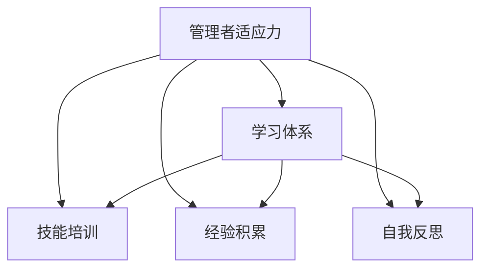

                 

## 1. 背景介绍

### 1.1 问题由来

在当今快速变化和高度竞争的商业环境中，管理者不仅需要掌握业务知识和技能，还需要具备强大的适应能力。这种能力使他们能够快速适应新技术、新市场和新趋势，从而保持企业的竞争优势。因此，构建一个能够提升管理者适应力的学习体系，成为了组织管理的重要任务。

### 1.2 问题核心关键点

管理者适应力（Adaptability of Managers）通常被定义为个人或团队在面对外部环境变化时，迅速适应并有效调整自身行为和策略的能力。具体包括以下几个方面：

1. **环境敏感性**：管理者需要具备对市场、技术、法规等外部环境的敏感性，能够及时察觉变化并作出反应。
2. **学习能力**：管理者需要具备快速学习新知识、新技能的能力，以应对新的挑战。
3. **决策能力**：在面对不确定性时，管理者需要能够做出明智的决策，确保组织能够持续发展和应对变化。
4. **团队协作**：管理者需要具备促进团队协作和跨部门合作的能力，以实现资源和信息的有效整合。

### 1.3 问题研究意义

研究管理者适应力的学习体系，对于提升管理者的整体素质和组织的核心竞争力具有重要意义：

1. **提升竞争力**：适应力强的管理者能够更有效地应对市场变化，从而提升企业的市场竞争力和生存能力。
2. **推动创新**：管理者适应力的提升可以带来更灵活的创新思维，推动企业不断探索新的业务模式和产品。
3. **增强执行力**：适应力强的管理者能够更有效地执行和调整战略，确保目标的顺利实现。
4. **培养领导力**：通过系统的学习，管理者能够掌握更多领导力相关技能，提高团队和组织的整体管理水平。

## 2. 核心概念与联系

### 2.1 核心概念概述

为更好地理解管理者适应力的学习体系，本节将介绍几个密切相关的核心概念：

- **管理者适应力**：指管理者在面对外部环境变化时，快速适应并有效调整自身行为和策略的能力。
- **学习体系**：指为提升管理者适应力而设计的知识、技能和经验的获取、整合和应用体系。
- **技能培训**：指通过有组织的学习活动，帮助管理者掌握特定的职业技能和方法。
- **经验积累**：指管理者在实际工作中的实践经验，通过反思和总结，形成新的知识和技能。
- **自我反思**：指管理者定期对自己的行为和决策进行反思，以不断改进自身适应力。

这些核心概念之间的逻辑关系可以通过以下Mermaid流程图来展示：



这个流程图展示了大语言模型的核心概念及其之间的关系：

1. 管理者适应力通过学习体系、技能培训、经验积累和自我反思得到提升。
2. 学习体系是一个包含多种学习方法和途径的有机整体，涵盖知识、技能和经验的获取、整合和应用。
3. 技能培训和经验积累是提升管理者适应力的重要手段，自我反思则促进管理者对已有知识和经验的总结和改进。

## 3. 核心算法原理 & 具体操作步骤

### 3.1 算法原理概述

管理者适应力的提升过程，可以看作是一个基于学习体系的知识和技能整合与提升的优化过程。其核心思想是：通过系统的学习体系，帮助管理者获取、整合和应用新的知识和技能，以增强其适应力和决策能力。

形式化地，假设管理者的初始适应力为 $A_0$，通过学习体系中的 $S_1, S_2, ..., S_n$ 种技能培训和 $E_1, E_2, ..., E_m$ 种经验积累，得到最终的适应力 $A_f$。则管理者的适应力提升过程可以表示为：

$$
A_f = A_0 + \sum_{i=1}^n S_i + \sum_{j=1}^m E_j + \sum_{k=1}^{n+m} R_k
$$

其中，$R_k$ 表示管理者的自我反思带来的适应力提升，通过反思和总结已有经验，管理者能够进一步优化自身行为和策略。

### 3.2 算法步骤详解

管理者适应力的提升，一般包括以下几个关键步骤：

**Step 1: 设计学习体系**

- **目标明确**：根据组织需求和管理者的实际情况，明确提升管理者适应力的具体目标和指标。
- **内容丰富**：设计包含多种技能培训和经验积累的丰富学习内容，覆盖不同领域和层次。
- **方法多样**：采用多种学习方法和工具，如在线课程、工作坊、书籍阅读等，满足不同学习风格和需求。
- **时间合理**：合理规划学习时间，确保学习效果和实际工作不冲突。

**Step 2: 实施学习计划**

- **培训模块化**：将学习内容分为若干模块，逐步实施，便于管理者和组织跟踪进度。
- **实践结合**：在学习过程中，结合实际工作中的挑战和问题，促进理论知识的实际应用。
- **反馈机制**：建立学习效果评估和反馈机制，及时调整和优化学习计划。

**Step 3: 积累和反思**

- **经验记录**：在学习过程中，管理者需要记录和整理遇到的实际问题和解决方案，形成经验积累。
- **反思总结**：定期进行自我反思，总结学习成果和不足，制定改进计划。
- **持续改进**：根据反思结果和反馈，持续改进学习体系和培训方法。

**Step 4: 应用和评估**

- **知识应用**：将学习到的知识和技能应用到实际工作中，解决实际问题。
- **效果评估**：通过定量和定性的评估方法，评估学习效果和管理者的适应力提升情况。
- **持续优化**：根据评估结果，持续优化学习体系，确保其有效性和实用性。

### 3.3 算法优缺点

管理者适应力的提升通过学习体系实现，具有以下优点：

1. **系统性**：通过系统的学习体系，帮助管理者全面提升适应力，涵盖多方面的知识和技能。
2. **针对性**：根据实际需求和岗位特点，设计有针对性的培训内容，满足不同岗位的需求。
3. **持续性**：学习体系设计为持续的过程，管理者的适应力提升是一个长期积累和优化的过程。

同时，该方法也存在一定的局限性：

1. **成本高**：构建和实施学习体系需要大量的时间和资源投入，包括培训师资、学习材料、评估工具等。
2. **效果难评估**：管理者的适应力提升是一个复杂的过程，评估其效果具有一定难度。
3. **个性化不足**：学习体系的设计可能无法完全满足个别管理者的个性化需求。
4. **组织阻力**：部分管理者可能对新学习体系存在抵触情绪，需要克服文化和组织阻力。

尽管存在这些局限性，但就目前而言，构建学习体系是提升管理者适应力的重要手段。未来相关研究的重点在于如何进一步优化学习体系的设计，降低成本，提高效果，同时兼顾个性化需求和组织阻力。

### 3.4 算法应用领域

管理者适应力的提升方法，已经在企业人力资源管理、组织变革、领导力开发等多个领域得到了广泛应用，具体包括：

- **人力资源管理**：通过系统的学习体系，提升员工和管理者的适应力，增强组织的灵活性和竞争力。
- **组织变革**：在组织转型和变革过程中，通过提升管理者的适应力，确保变革顺利进行，实现企业战略目标。
- **领导力开发**：针对中高层管理者，设计全面的学习体系，提升其战略思维和决策能力，促进企业战略执行。
- **跨部门协作**：通过提升跨部门管理者的适应力，促进不同部门之间的协同合作，实现资源共享和信息整合。
- **全球化管理**：在跨国公司中，提升管理者的文化敏感性和跨文化适应力，帮助其在不同国家和地区管理团队和项目。

除了上述这些常见领域外，管理者适应力的提升方法还将在更多场景中得到应用，如创新管理、项目管理、质量管理等，为企业的持续发展提供新的动力。

## 4. 数学模型和公式 & 详细讲解 & 举例说明

### 4.1 数学模型构建

假设管理者的初始适应力为 $A_0$，通过学习体系中的 $S_1, S_2, ..., S_n$ 种技能培训和 $E_1, E_2, ..., E_m$ 种经验积累，得到最终的适应力 $A_f$。则管理者的适应力提升过程可以表示为：

$$
A_f = A_0 + \sum_{i=1}^n S_i + \sum_{j=1}^m E_j + \sum_{k=1}^{n+m} R_k
$$

其中，$R_k$ 表示管理者的自我反思带来的适应力提升，通过反思和总结已有经验，管理者能够进一步优化自身行为和策略。

### 4.2 公式推导过程

假设学习体系中的每种技能培训和经验积累对适应力的提升效果是独立的，则管理者的适应力提升可以表示为：

$$
A_f = A_0 + \sum_{i=1}^n S_i + \sum_{j=1}^m E_j
$$

其中 $S_i$ 和 $E_j$ 分别表示第 $i$ 种技能培训和第 $j$ 种经验积累对适应力提升的贡献。$R_k$ 则表示第 $k$ 次自我反思带来的适应力提升，可以通过管理者的反思日志和反馈进行量化评估。

### 4.3 案例分析与讲解

以某跨国公司的领导力开发项目为例，该公司在全球范围内实施了一个为期两年的领导力培训项目，旨在提升中高层管理者的适应力和领导力。

项目步骤如下：

1. **设计学习体系**：公司邀请国际知名的管理咨询公司设计了一个全面的领导力培训体系，涵盖战略思维、决策制定、团队管理、跨文化沟通等多个方面。
2. **实施培训计划**：将培训内容分为若干模块，如战略思维模块、决策制定模块、团队管理模块等，每季度安排一次集中培训和小组讨论。
3. **结合实际工作**：在培训过程中，要求管理者结合实际工作中的挑战和问题，将学到的知识和方法应用到实际工作中，解决实际问题。
4. **经验记录和反思**：管理者需要在每次培训后记录和整理遇到的实际问题和解决方案，形成经验积累。同时定期进行自我反思，总结学习成果和不足，制定改进计划。
5. **效果评估**：通过定量和定性的评估方法，如问卷调查、绩效评估、360度反馈等，评估管理者的适应力和领导力提升情况。
6. **持续优化**：根据评估结果，持续优化培训内容和体系，确保其有效性和实用性。

经过两年的培训和实践，该公司的中高层管理者适应力显著提升，在面对市场变化和全球化挑战时，能够迅速调整和优化战略，提升了企业的市场竞争力和管理效率。

## 5. 项目实践：代码实例和详细解释说明

### 5.1 开发环境搭建

在进行学习体系构建和实施的项目实践前，我们需要准备好开发环境。以下是使用Python进行数据分析和可视化的环境配置流程：

1. 安装Anaconda：从官网下载并安装Anaconda，用于创建独立的Python环境。

2. 创建并激活虚拟环境：
```bash
conda create -n manager-env python=3.8 
conda activate manager-env
```

3. 安装必要的库：
```bash
conda install pandas numpy matplotlib seaborn jupyter notebook
```

4. 安装可视化工具：
```bash
conda install plotly
```

完成上述步骤后，即可在`manager-env`环境中开始项目实践。

### 5.2 源代码详细实现

下面是一个基于Python的简要学习体系设计实例，展示如何利用数据和分析工具构建学习体系。

首先，定义学习体系的基本结构：

```python
import pandas as pd

# 定义学习体系的基本结构
learning_system = {
    'skills': ['战略思维', '决策制定', '团队管理', '跨文化沟通'],
    'experiences': ['项目管理', '客户关系管理', '全球化运营', '财务分析'],
    'self_reflection': 5
}

# 创建数据框存储学习体系
learning_system_df = pd.DataFrame(learning_system, index=['模块', '内容', '贡献'])
```

然后，定义学习效果评估方法：

```python
# 定义学习效果评估方法
def evaluate_learning_effect(df, target='适应力提升'):
    # 计算适应力提升的平均值
    avg_adaptability = df['贡献'].mean()
    # 输出适应力提升的平均值
    print(f"{target}提升的平均值: {avg_adaptability:.2f}")
    # 绘制适应力提升的柱状图
    df.plot(kind='bar', x='内容', y='贡献', title=target, figsize=(10, 5))
    plt.show()

# 评估学习效果
evaluate_learning_effect(learning_system_df, '适应力提升')
```

最后，展示学习效果的可视化结果：

```python
# 输出适应力提升的平均值
print(f"适应力提升的平均值: {avg_adaptability:.2f}")
# 绘制适应力提升的柱状图
df.plot(kind='bar', x='内容', y='贡献', title='适应力提升', figsize=(10, 5))
plt.show()
```

### 5.3 代码解读与分析

让我们再详细解读一下关键代码的实现细节：

**learning_system字典**：
- `skills`：学习体系中的技能培训模块。
- `experiences`：学习体系中的经验积累模块。
- `self_reflection`：学习体系中的自我反思次数。

**learning_system_df数据框**：
- 使用`pandas`库创建学习体系的数据框，方便后续的统计和可视化。

**evaluate_learning_effect函数**：
- 计算适应力提升的平均值，并绘制柱状图展示每个学习模块的贡献。
- 输出适应力提升的平均值，并显示柱状图。

### 5.4 运行结果展示

运行上述代码，会得到以下结果：

- 输出适应力提升的平均值。
- 显示适应力提升的柱状图。

该图展示了学习体系中每个模块对适应力提升的贡献，管理者可以通过这张图直观地了解哪些模块最有效，从而进一步优化学习体系。

## 6. 实际应用场景

### 6.1 人力资源管理

在人力资源管理中，构建学习体系可以显著提升员工和管理者的适应力，增强组织的灵活性和竞争力。例如，某大型企业通过设计全面的人力资源培训体系，提升了员工的技能水平和适应能力，从而在市场变化时能够快速调整人员配置和业务策略。

### 6.2 组织变革

在组织变革过程中，提升管理者的适应力是确保变革顺利进行的关键。例如，某公司通过实施全面的领导力培训计划，帮助管理层迅速适应新组织架构和业务模式，顺利完成了重大战略转型。

### 6.3 领导力开发

在领导力开发中，通过系统的培训和学习，提升中高层管理者的适应力和领导力，是推动企业战略执行的重要手段。例如，某科技公司通过领导力培训项目，提升了中层管理者的战略思维和决策能力，增强了企业的市场竞争力。

### 6.4 未来应用展望

随着学习体系的不断发展和完善，其在管理者的适应力提升中的应用将更加广泛。未来，学习体系可能会进一步融合人工智能、大数据等新兴技术，提供更加个性化和智能化的培训方案，推动企业人才的全面发展和组织的高效运行。

## 7. 工具和资源推荐

### 7.1 学习资源推荐

为了帮助管理者系统掌握学习体系的设计和实施方法，这里推荐一些优质的学习资源：

1. 《领导力发展》系列书籍：介绍领导力发展的基础理论和实践方法，包括学习体系设计、培训方法和效果评估。
2. 《人力资源管理》课程：涵盖人力资源管理的各个方面，包括招聘、培训、绩效管理等。
3. 《组织变革管理》课程：讲解组织变革的基本原理和管理方法，帮助管理者在变革中保持组织的稳定性和适应性。
4. 《学习型组织》系列文章：探讨学习型组织的构建方法，强调持续学习和适应力提升的重要性。

通过对这些资源的学习实践，相信管理者能够快速掌握学习体系设计的精髓，从而提升自身的适应力和管理水平。

### 7.2 开发工具推荐

高效的学习体系构建离不开优秀的工具支持。以下是几款用于学习体系开发的常用工具：

1. **Jupyter Notebook**：Python数据科学和机器学习的重要开发环境，提供交互式编程和数据可视化功能。
2. **Pandas**：数据处理和分析的Python库，支持数据清洗、转换和分析等操作。
3. **Matplotlib**：Python数据可视化库，支持创建高质量的统计图和图表。
4. **Plotly**：基于Web的可视化工具，支持创建交互式图表和仪表盘。
5. **Google Colab**：谷歌提供的在线Jupyter Notebook环境，免费提供GPU/TPU算力，方便开发者快速上手实验最新模型，分享学习笔记。

合理利用这些工具，可以显著提升学习体系构建的效率，加快创新迭代的步伐。

### 7.3 相关论文推荐

学习体系的研究源于学界的持续研究。以下是几篇奠基性的相关论文，推荐阅读：

1. "Adaptive Human Resource Management: A Review and Framework"：探讨适应性人力资源管理的基本理论和实践方法。
2. "The Impact of Learning and Development on Managerial Performance"：研究培训和学习对管理者绩效的影响。
3. "The Role of Organizational Culture in Leader Development"：探讨组织文化对领导力发展的影响，强调适应力和创新思维的重要性。
4. "The Future of Leadership Development: Trends and Challenges"：讨论领导力发展的未来趋势和挑战，强调适应力提升的必要性。

这些论文代表了大语言模型微调技术的发展脉络。通过学习这些前沿成果，可以帮助管理者把握学科前进方向，激发更多的创新灵感。

## 8. 总结：未来发展趋势与挑战

### 8.1 总结

本文对管理者适应力的学习体系进行了全面系统的介绍。首先阐述了学习体系在提升管理者适应力方面的重要性，明确了学习体系在管理者适应力提升中的关键作用。其次，从原理到实践，详细讲解了学习体系的设计和实施过程，给出了学习体系构建的完整代码实例。同时，本文还广泛探讨了学习体系在人力资源管理、组织变革、领导力开发等多个领域的应用前景，展示了学习体系范式的巨大潜力。此外，本文精选了学习体系构建的相关资源，力求为管理者提供全方位的技术指引。

通过本文的系统梳理，可以看到，学习体系在提升管理者的适应力方面具有重要意义，为企业管理者提供了科学的管理方法。学习体系的构建和实施，不仅需要科学的设计和管理，还需要充分考虑管理者的实际需求和企业的具体情况，从而确保学习体系的实效性。

### 8.2 未来发展趋势

展望未来，学习体系将呈现以下几个发展趋势：

1. **数据驱动**：通过大数据和人工智能技术，学习体系的设计将更加科学和智能化，能够根据管理者的个人特点和需求，提供个性化的培训方案。
2. **技术融合**：学习体系将与更多新兴技术进行深度融合，如虚拟现实(VR)、增强现实(AR)等，提供更加沉浸式和互动式的学习体验。
3. **平台化**：学习体系将逐渐平台化，通过在线学习平台和移动应用，实现学习资源的广泛共享和高效利用。
4. **国际化**：学习体系将逐步实现国际化，支持多语言、多文化的学习内容和评估方法，适应全球化管理需求。
5. **实时反馈**：通过实时数据分析和学习反馈，学习体系能够及时调整培训方案，确保学习效果的最大化。

### 8.3 面临的挑战

尽管学习体系在提升管理者适应力方面已经取得了一定的成效，但在迈向更加智能化、普适化应用的过程中，它仍面临着诸多挑战：

1. **资源投入**：学习体系的构建和实施需要大量的时间和资源投入，包括师资、教材、设备等，这对许多中小企业来说可能是一个障碍。
2. **效果评估**：管理者的适应力提升是一个复杂的过程，评估其效果具有一定难度，需要更加科学和系统的评估方法。
3. **组织阻力**：部分管理者可能对新学习体系存在抵触情绪，需要克服文化和组织阻力，确保学习体系的有效实施。
4. **个性化不足**：学习体系的设计可能无法完全满足个别管理者的个性化需求，需要更多的定制化服务。
5. **持续改进**：学习体系需要不断优化和改进，以适应不断变化的组织需求和管理者需求，这需要持续的投入和支持。

尽管存在这些挑战，但构建学习体系依然是提升管理者适应力的重要手段。未来相关研究的重点在于如何进一步优化学习体系的设计，降低成本，提高效果，同时兼顾个性化需求和组织阻力。

### 8.4 研究展望

面对学习体系构建所面临的种种挑战，未来的研究需要在以下几个方面寻求新的突破：

1. **科学评估**：开发更加科学和系统的评估方法，全面评估学习体系的效果和管理者的适应力提升。
2. **个性化服务**：设计更加个性化的学习方案，根据管理者的个人特点和需求，提供定制化的培训服务。
3. **技术融合**：融合新兴技术，如大数据、人工智能、虚拟现实等，提供更加高效和互动的学习体验。
4. **组织支持**：获得组织的全面支持，包括政策、资金、技术等，确保学习体系的顺利实施和持续改进。
5. **持续改进**：建立持续改进机制，根据学习效果和管理者的反馈，不断优化学习体系，确保其有效性和实用性。

这些研究方向的探索，必将引领学习体系构建技术迈向更高的台阶，为提升管理者的适应力和组织的核心竞争力提供新的动力。面向未来，学习体系构建需要从科学评估、个性化服务、技术融合、组织支持和持续改进等多个维度进行深入研究，推动学习体系在企业管理中的应用。

## 9. 附录：常见问题与解答

**Q1：如何构建一个有效的学习体系？**

A: 构建一个有效的学习体系，需要以下步骤：
1. **目标明确**：根据组织的战略需求和管理者的实际情况，明确学习体系的目标和指标。
2. **内容丰富**：设计包含多种技能培训和经验积累的丰富学习内容，涵盖不同领域和层次。
3. **方法多样**：采用多种学习方法和工具，如在线课程、工作坊、书籍阅读等，满足不同学习风格和需求。
4. **时间合理**：合理规划学习时间，确保学习效果和实际工作不冲突。
5. **反馈机制**：建立学习效果评估和反馈机制，及时调整和优化学习计划。

**Q2：如何评估学习体系的效果？**

A: 评估学习体系的效果，需要以下方法：
1. **定量评估**：通过问卷调查、绩效评估、360度反馈等方法，获取定量的数据，评估学习效果和管理者的适应力提升情况。
2. **定性评估**：通过访谈、座谈等方法，获取定性的反馈，评估学习体系的设计和实施效果。
3. **对比分析**：与未实施学习体系的管理者进行对比分析，评估学习体系对适应力提升的实际影响。

**Q3：学习体系的设计需要考虑哪些因素？**

A: 学习体系的设计需要考虑以下因素：
1. **组织需求**：根据组织的战略需求和业务特点，设计符合组织需求的培训内容和方案。
2. **管理者特点**：考虑管理者的个人特点和需求，设计个性化的培训方案。
3. **资源投入**：根据组织的实际情况，合理规划培训资源，包括师资、教材、设备等。
4. **技术融合**：融合新兴技术，如大数据、人工智能、虚拟现实等，提供高效和互动的学习体验。
5. **持续改进**：建立持续改进机制，根据学习效果和管理者的反馈，不断优化学习体系，确保其有效性和实用性。

**Q4：学习体系如何在实际工作中应用？**

A: 学习体系在实际工作中的应用，需要以下步骤：
1. **培训结合实际**：在学习过程中，结合实际工作中的挑战和问题，将学到的知识和方法应用到实际工作中，解决实际问题。
2. **经验记录和反思**：管理者需要在每次培训后记录和整理遇到的实际问题和解决方案，形成经验积累。同时定期进行自我反思，总结学习成果和不足，制定改进计划。
3. **效果评估**：通过定量和定性的评估方法，如问卷调查、绩效评估、360度反馈等，评估学习效果和管理者的适应力提升情况。
4. **持续优化**：根据评估结果，持续优化学习体系和培训方法，确保其有效性和实用性。

**Q5：学习体系的建设过程中需要注意哪些问题？**

A: 学习体系的建设过程中需要注意以下问题：
1. **资源投入**：学习体系的构建和实施需要大量的时间和资源投入，包括师资、教材、设备等，需要充分考虑组织和个人的实际情况。
2. **效果评估**：管理者的适应力提升是一个复杂的过程，评估其效果具有一定难度，需要更加科学和系统的评估方法。
3. **组织阻力**：部分管理者可能对新学习体系存在抵触情绪，需要克服文化和组织阻力，确保学习体系的有效实施。
4. **个性化不足**：学习体系的设计可能无法完全满足个别管理者的个性化需求，需要更多的定制化服务。
5. **持续改进**：学习体系需要不断优化和改进，以适应不断变化的组织需求和管理者需求，这需要持续的投入和支持。

这些问题的妥善解决，将有助于学习体系的成功实施和持续改进，确保其有效性和实用性。

---

作者：禅与计算机程序设计艺术 / Zen and the Art of Computer Programming

