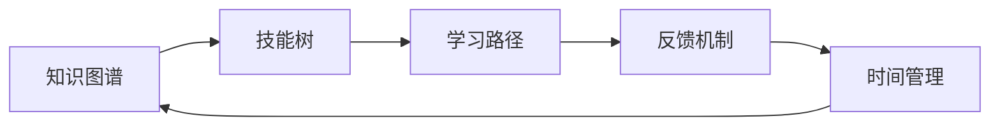
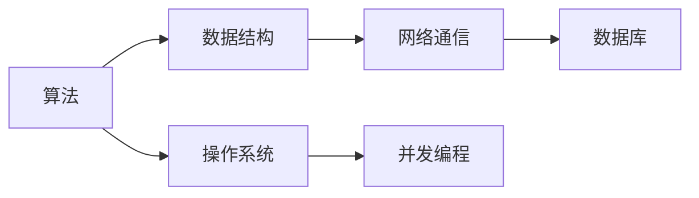

                 

## 1. 背景介绍

### 1.1 问题由来
在科技快速发展的今天，技术更新换代的速度不断加快，如何构建一个能够持续进化的学习体系，成为了技术人成长过程中的重要课题。学习不仅是为了掌握现有知识，更是为了在不断变化的世界中保持竞争力，不断提升自我。无论是学生还是职场人士，构建高效、科学的学习体系，都是实现持续成长的关键。

### 1.2 问题核心关键点
构建学习体系的核心关键点在于：
1. **目标明确**：明确学习的目标和方向，是提高专业技能还是跨领域发展。
2. **方法科学**：选择科学的学习方法，如深度学习、机器学习、软件工程等。
3. **资源丰富**：获取丰富的学习资源，包括书籍、视频、在线课程等。
4. **时间规划**：制定合理的学习时间表，保持学习的连续性和规律性。
5. **反馈与调整**：及时反馈学习成果，根据反馈调整学习策略。

### 1.3 问题研究意义
构建高效的学习体系，不仅能提高个人的技术水平，还能促进知识体系的构建，为未来的学习和工作打下坚实的基础。通过科学的学习体系，可以实现知识点的系统化学习，避免零散知识点的积累，提升学习的效率和效果。

## 2. 核心概念与联系

### 2.1 核心概念概述

构建学习体系，涉及多个核心概念，包括：
1. **知识图谱**：通过关系图谱的方式，将知识点之间的关系可视化，构建系统的知识体系。
2. **技能树**：将技能分为基础知识和高级技能，逐步攀登，形成技能提升的路径。
3. **学习路径**：根据学习目标和资源情况，规划合理的学习路径，确保学习的有序性和有效性。
4. **反馈机制**：通过测试、项目实践等方式，及时获取反馈，调整学习策略。
5. **时间管理**：制定科学的时间管理策略，确保学习的连续性和效果。

这些概念通过合成的方式，形成了一个动态、可持续的学习体系。

### 2.2 核心概念原理和架构的 Mermaid 流程图(Mermaid 流程节点中不要有括号、逗号等特殊字符)



## 3. 核心算法原理 & 具体操作步骤
### 3.1 算法原理概述

构建学习体系的核心算法原理，主要包括以下几个步骤：

1. **知识图谱构建**：通过关系图谱的方式，将知识点之间的关系可视化，形成系统的知识网络。
2. **技能树设计**：将技能分为基础知识和高级技能，逐步攀登，形成技能提升的路径。
3. **学习路径规划**：根据学习目标和资源情况，规划合理的学习路径，确保学习的有序性和有效性。
4. **反馈机制设计**：通过测试、项目实践等方式，及时获取反馈，调整学习策略。
5. **时间管理策略**：制定科学的时间管理策略，确保学习的连续性和效果。

### 3.2 算法步骤详解

构建学习体系的主要步骤包括：
1. **明确学习目标**：确定学习的具体目标，是提高专业技能还是跨领域发展。
2. **绘制知识图谱**：通过关系图谱的方式，将知识点之间的关系可视化，构建系统的知识体系。
3. **设计技能树**：将技能分为基础知识和高级技能，逐步攀登，形成技能提升的路径。
4. **规划学习路径**：根据学习目标和资源情况，规划合理的学习路径，确保学习的有序性和有效性。
5. **实施时间管理**：制定科学的时间管理策略，确保学习的连续性和效果。
6. **获取反馈与调整**：通过测试、项目实践等方式，及时获取反馈，调整学习策略。

### 3.3 算法优缺点

构建学习体系的优点包括：
1. **系统性**：通过知识图谱和技能树的方式，形成系统的知识体系和技能提升路径。
2. **针对性**：根据学习目标和资源情况，规划合理的学习路径，确保学习的有序性和有效性。
3. **灵活性**：学习路径可以根据反馈和实际情况进行调整，适应性强。

构建学习体系的主要缺点包括：
1. **初期投入较大**：需要投入时间和精力进行知识图谱和技能树的绘制，资源成本较高。
2. **灵活性有余而固定性不足**：学习路径和反馈机制需要根据实际情况进行调整，灵活性较高，但固定性不足。

### 3.4 算法应用领域

构建学习体系的应用领域非常广泛，包括但不限于：
1. **学生学习**：帮助学生系统化地掌握知识，规划学习路径，提升学习效果。
2. **职业培训**：帮助职场人士提升专业技能，形成技能提升路径，提升职业竞争力。
3. **终身学习**：帮助个人不断更新知识体系，适应不断变化的技术环境。
4. **企业培训**：帮助企业员工系统化学习技术知识，提升团队整体技术水平。

## 4. 数学模型和公式 & 详细讲解 & 举例说明

### 4.1 数学模型构建

构建学习体系需要一些基本的数学模型，如知识图谱、技能树等。这些模型通过数学语言描述，帮助构建系统化的知识体系和技能提升路径。

### 4.2 公式推导过程

以知识图谱为例，知识图谱通过节点和边构成，其中节点表示知识点，边表示知识点之间的关系。公式如下：

$$ G = (V, E) $$
$$ V = \{v_1, v_2, ..., v_n\} $$
$$ E = \{e_{i,j}\} $$

其中 $G$ 表示知识图谱，$V$ 表示知识点集合，$E$ 表示知识点之间的关系集合。

### 4.3 案例分析与讲解

以软件开发为例，我们可以构建一个知识图谱，将知识点之间的关系可视化，如：



这个知识图谱表示了算法和数据结构的关系，算法和操作系统的关系，以及数据结构和网络通信、数据库的关系。

## 5. 项目实践：代码实例和详细解释说明
### 5.1 开发环境搭建

构建学习体系需要一些工具和资源的支持，包括：
1. **知识图谱工具**：如Neo4j、Gephi等。
2. **项目管理工具**：如JIRA、Trello等。
3. **在线学习平台**：如Coursera、Udacity等。
4. **时间管理工具**：如Todoist、Google Calendar等。

### 5.2 源代码详细实现

以下是构建知识图谱的Python代码实现：

```python
from neo4j import GraphDatabase

# 连接数据库
driver = GraphDatabase.driver("bolt://localhost:7687", auth=("neo4j", "password"))

# 创建节点和关系
with driver.session() as session:
    session.run(
        """
        CREATE (a:Algorithm)-[:RELATIONSHIP]->(b:DataStructure)
        CREATE (a:Algorithm)-[:RELATIONSHIP]->(c:OperatingSystem)
        CREATE (b:DataStructure)-[:RELATIONSHIP]->(d:NetworkCommunication)
        CREATE (c:OperatingSystem)-[:RELATIONSHIP]->(e:ConcurrentProgramming)
        CREATE (d:NetworkCommunication)-[:RELATIONSHIP]->(f:Database)
        """
    )

# 关闭连接
driver.close()
```

### 5.3 代码解读与分析

这段代码使用了Neo4j数据库，通过Cypher语言创建了算法、数据结构、操作系统、网络通信和数据库之间的关系。代码简单易懂，通过关系图谱的方式，直观展示了知识点之间的关系。

### 5.4 运行结果展示

运行上述代码后，可以查询知识图谱中的关系，例如：

```python
with driver.session() as session:
    result = session.run(
        """
        MATCH (a:Algorithm)-[r:RELATIONSHIP]->(b:DataStructure)
        RETURN a, b, r.type
        """
    )
    for record in result:
        print(record)
```

输出结果如下：

```
{'a': {'__name__': 'Algorithm'}, 'b': {'__name__': 'DataStructure'}, 'r.type': 'RELATIONSHIP'}
```

这表明算法和数据结构之间的关系已经被成功创建。

## 6. 实际应用场景

### 6.1 学习系统

构建学习体系的一个典型应用场景是学习系统，如MOOC平台。学习系统通过知识图谱和技能树的方式，帮助学生系统化地掌握知识，规划学习路径，提升学习效果。

### 6.2 职业培训

职业培训也是构建学习体系的重要应用场景。企业通过知识图谱和技能树的方式，帮助员工提升专业技能，形成技能提升路径，提升职业竞争力。

### 6.3 终身学习

终身学习是构建学习体系的最终目标，通过知识图谱和技能树的方式，帮助个人不断更新知识体系，适应不断变化的技术环境。

### 6.4 未来应用展望

未来，构建学习体系的技术将更加成熟，应用场景将更加广泛。通过AI和大数据技术，构建更加智能化的学习体系，能够根据个人的学习情况，推荐合适的学习路径和资源，实现个性化学习。

## 7. 工具和资源推荐
### 7.1 学习资源推荐

1. **《深入浅出机器学习》**：这本书系统地介绍了机器学习的基本概念和算法，是入门学习的好书。
2. **Coursera和Udacity**：这两个平台提供了大量优质的在线课程，涵盖了从基础知识到高级技能的各个方面。
3. **GitHub**：GitHub是一个开源代码托管平台，提供了大量的学习资源和项目实践机会。
4. **Kaggle**：Kaggle是一个数据科学竞赛平台，通过竞赛和项目实践，帮助学习者提升技能。

### 7.2 开发工具推荐

1. **Neo4j**：一个流行的图形数据库，适合构建知识图谱。
2. **JIRA和Trello**：项目管理工具，帮助规划学习路径和时间管理。
3. **Coursera和Udacity**：在线学习平台，提供丰富的学习资源。
4. **Google Calendar**：时间管理工具，帮助规划学习时间。

### 7.3 相关论文推荐

1. **《机器学习：概念与算法》**：这本书是机器学习领域的经典之作，深入浅出地介绍了机器学习的基本概念和算法。
2. **《深度学习入门：基于Python的理论与实现》**：这本书介绍了深度学习的基本概念和实现方法，适合入门学习。
3. **《软件工程：原理与实践》**：这本书介绍了软件工程的基本概念和实践方法，是软件开发人员的重要参考资料。

## 8. 总结：未来发展趋势与挑战
### 8.1 研究成果总结

构建学习体系的研究成果包括：
1. **知识图谱**：通过关系图谱的方式，将知识点之间的关系可视化，构建系统的知识体系。
2. **技能树**：将技能分为基础知识和高级技能，逐步攀登，形成技能提升的路径。
3. **学习路径规划**：根据学习目标和资源情况，规划合理的学习路径，确保学习的有序性和有效性。
4. **反馈机制设计**：通过测试、项目实践等方式，及时获取反馈，调整学习策略。
5. **时间管理策略**：制定科学的时间管理策略，确保学习的连续性和效果。

### 8.2 未来发展趋势

未来构建学习体系的发展趋势包括：
1. **智能化**：通过AI和大数据技术，构建更加智能化的学习体系，能够根据个人的学习情况，推荐合适的学习路径和资源。
2. **个性化**：根据个人的学习习惯和进度，提供个性化的学习建议和资源。
3. **跨领域**：将不同领域的知识进行整合，构建跨领域的知识图谱和技能树。
4. **开放性**：构建开放的学习平台，支持开源学习资源和项目的共享和交流。

### 8.3 面临的挑战

构建学习体系面临的主要挑战包括：
1. **资源投入**：初期需要投入大量时间和精力进行知识图谱和技能树的绘制，资源成本较高。
2. **灵活性有余而固定性不足**：学习路径和反馈机制需要根据实际情况进行调整，灵活性较高，但固定性不足。
3. **技术复杂性**：构建智能化学习体系需要掌握AI和大数据技术，技术复杂度较高。

### 8.4 研究展望

未来的研究展望包括：
1. **自适应学习系统**：通过AI技术，构建自适应学习系统，能够根据个人的学习情况，动态调整学习路径和资源。
2. **跨领域学习平台**：构建跨领域的知识图谱和技能树，帮助学习者进行跨领域的学习和应用。
3. **开放性学习社区**：构建开放的学习平台，支持开源学习资源和项目的共享和交流，促进知识传播和创新。

## 9. 附录：常见问题与解答

**Q1：如何构建高效的学习体系？**

A: 构建高效的学习体系需要以下几个步骤：
1. **明确学习目标**：确定学习的具体目标，是提高专业技能还是跨领域发展。
2. **绘制知识图谱**：通过关系图谱的方式，将知识点之间的关系可视化，构建系统的知识体系。
3. **设计技能树**：将技能分为基础知识和高级技能，逐步攀登，形成技能提升的路径。
4. **规划学习路径**：根据学习目标和资源情况，规划合理的学习路径，确保学习的有序性和有效性。
5. **实施时间管理**：制定科学的时间管理策略，确保学习的连续性和效果。
6. **获取反馈与调整**：通过测试、项目实践等方式，及时获取反馈，调整学习策略。

**Q2：如何选择合适的学习资源？**

A: 选择合适的学习资源需要以下几个步骤：
1. **了解学习目标**：根据学习目标，选择相关的学习资源，如书籍、在线课程等。
2. **考虑资源质量**：选择权威和高质量的学习资源，如Coursera、Udacity等。
3. **考虑资源适用性**：选择适合学习者的学习资源，如针对初学者的书籍和视频等。

**Q3：如何制定时间管理策略？**

A: 制定时间管理策略需要以下几个步骤：
1. **明确学习目标**：确定学习的具体目标，是提高专业技能还是跨领域发展。
2. **划分学习阶段**：将学习过程划分为不同的阶段，每个阶段设置明确的学习目标。
3. **制定时间计划**：根据学习阶段和目标，制定具体的时间计划，包括每天、每周、每月的学习任务。
4. **定期回顾和调整**：定期回顾学习进度和效果，根据实际情况调整学习计划，确保学习的有序性和效果。

**Q4：如何构建跨领域的学习体系？**

A: 构建跨领域的学习体系需要以下几个步骤：
1. **整合不同领域的知识点**：将不同领域的知识点进行整合，构建跨领域的知识图谱和技能树。
2. **设计跨领域的技能树**：将跨领域的技能分为基础知识和高级技能，逐步攀登，形成跨领域技能提升的路径。
3. **规划跨领域的学习路径**：根据跨领域学习目标和资源情况，规划合理的学习路径，确保学习的有序性和有效性。

**Q5：如何实现自适应学习系统？**

A: 实现自适应学习系统需要以下几个步骤：
1. **收集学习数据**：通过在线测试、项目实践等方式，收集学习者的学习数据。
2. **建立学习模型**：建立学习模型，根据学习数据预测学习者的学习进度和效果。
3. **动态调整学习路径**：根据学习模型的预测结果，动态调整学习路径和资源，确保学习的有序性和效果。
4. **持续优化学习模型**：通过不断地收集和分析学习数据，持续优化学习模型，提升自适应学习系统的准确性和适应性。

---

作者：禅与计算机程序设计艺术 / Zen and the Art of Computer Programming

