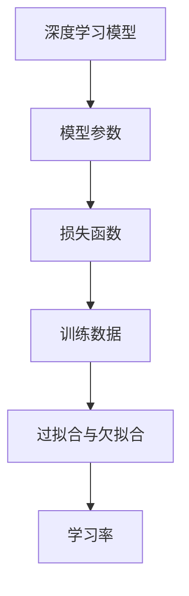

                 

# 学习曲线：知识积累的非线性过程

## 1. 背景介绍

学习曲线（Learning Curve）是指随着学习时间的增加，掌握某项技能或知识的效率与效果随时间的变化关系。在学习过程中，不同阶段的知识积累速率和效果存在显著差异，这种差异正体现了知识的非线性积累特征。在人工智能（AI）领域，这一概念同样适用，尤其在深度学习和大数据模型训练中，模型性能和参数量随时间增加而显著变化，显示出典型的非线性特征。

### 1.1 问题由来

随着深度学习和大数据技术的发展，现代人工智能模型（如深度神经网络、大语言模型等）的复杂度不断提升，训练和调优过程变得更加复杂。在模型训练的早期阶段，通常表现出快速的性能提升，但随着训练时间的增加，性能提升的速度逐渐放缓，甚至出现平台期（Plateau）。理解和学习曲线，有助于优化模型训练策略，提高模型的性能和效率。

### 1.2 问题核心关键点

学习曲线反映了模型性能与训练时间之间的非线性关系，其核心点包括：

1. **早期加速期**：在模型训练的初期，参数初始化和模型结构较简单，梯度更新速度快，性能提升显著。
2. **中期平稳期**：随着模型参数的增多，训练数据的饱和，梯度更新难度增加，性能提升逐渐放缓。
3. **后期衰减期**：在过拟合风险增加时，模型训练进入衰减期，性能提升进一步减缓，甚至可能下降。

## 2. 核心概念与联系

### 2.1 核心概念概述

为了更好地理解学习曲线，我们需要对几个关键概念进行梳理：

- **深度学习模型**：以神经网络为代表的机器学习模型，通过大量参数和数据进行训练，以实现复杂模式的识别和预测。
- **模型参数**：深度学习模型中的权重和偏置，决定模型的学习能力和泛化性能。
- **损失函数**：衡量模型预测与真实标签之间的差距，通过优化损失函数提高模型性能。
- **训练数据**：用于模型训练的数据集，其分布和数量直接影响模型的训练效果。
- **过拟合与欠拟合**：模型在训练集和测试集上的表现差异，反映模型的泛化能力和泛化性能。
- **学习率**：控制每次参数更新的步长，影响模型的收敛速度和稳定性。

这些概念之间的逻辑关系可以通过以下Mermaid流程图来展示：



这个流程图展示了深度学习模型的核心组成和它们之间的联系，以及学习曲线在其中的作用。

## 3. 核心算法原理 & 具体操作步骤

### 3.1 算法原理概述

学习曲线的形成原理涉及模型训练过程中损失函数与参数更新之间的关系。在训练初期，模型参数较少，初始值通常接近最优解，梯度更新幅度大，模型性能快速提升。随着训练的进行，模型参数增多，数据集渐趋饱和，梯度更新幅度减小，性能提升逐渐放缓。当模型过拟合风险增加时，模型训练进入衰减期，性能提升进一步减缓，甚至可能下降。

### 3.2 算法步骤详解

基于学习曲线的理论，以下是深度学习模型训练的一般步骤：

**Step 1: 初始化模型和参数**
- 选择合适的模型架构，如卷积神经网络（CNN）、循环神经网络（RNN）、Transformer等。
- 初始化模型参数，通常使用随机初始化。

**Step 2: 选择损失函数**
- 根据任务类型选择合适的损失函数，如均方误差（MSE）、交叉熵（Cross-Entropy）、对数似然（Log-Likelihood）等。

**Step 3: 设置学习率**
- 选择适当的学习率，如Adam、SGD等优化算法，并设置学习率衰减策略。

**Step 4: 模型训练**
- 对训练数据进行批次处理，前向传播计算模型输出。
- 计算预测输出与真实标签之间的差距，反向传播计算梯度。
- 根据梯度更新模型参数，并记录损失函数值。
- 在每个epoch或批处理后，评估模型在验证集上的性能。

**Step 5: 调整学习率**
- 根据验证集性能调整学习率，如学习率衰减、周期性学习率调整等。

**Step 6: 模型评估与部署**
- 在测试集上评估模型性能，对比训练前后的精度提升。
- 使用模型进行推理预测，集成到实际的应用系统中。

### 3.3 算法优缺点

深度学习模型的学习曲线具有以下优点：
1. 可以直观地反映模型性能随时间的变化，帮助开发者选择合适的训练策略。
2. 能够揭示模型在不同阶段的优化重点，提高模型调优效率。
3. 通过观察学习曲线，可以预测模型何时达到最优状态，避免无效的训练。

同时，学习曲线也存在一些局限性：
1. 依赖于训练数据的分布和数量，数据集质量欠佳时曲线表现可能不准确。
2. 难以评估模型参数的变化对性能的影响，参数过多时难以有效调整。
3. 学习率的选择和调整较为复杂，需要丰富的经验和专业知识。

尽管存在这些局限性，但学习曲线仍是深度学习模型训练中不可或缺的工具，通过不断优化训练策略和模型结构，可以更好地掌握学习曲线，提升模型性能。

### 3.4 算法应用领域

学习曲线广泛应用于深度学习模型的训练和优化中，尤其在以下领域：

- **计算机视觉**：如图像分类、目标检测、语义分割等任务，通过学习曲线调整训练策略，提升模型对视觉特征的识别能力。
- **自然语言处理**：如文本分类、语言模型、机器翻译等任务，通过学习曲线优化模型结构，提高语言理解与生成的准确性。
- **信号处理**：如音频信号处理、语音识别、视频分析等任务，通过学习曲线调整模型参数，提升信号特征的提取和识别能力。
- **推荐系统**：如协同过滤、内容推荐、广告推荐等任务，通过学习曲线优化模型，提高推荐系统的精准度和效率。

## 4. 数学模型和公式 & 详细讲解 & 举例说明

### 4.1 数学模型构建

深度学习模型通常采用反向传播算法（Backpropagation）进行训练。假设模型为 $M_\theta$，输入为 $x$，输出为 $y$，损失函数为 $L$，则模型的训练目标为最小化损失函数：

$$
\min_{\theta} L(M_\theta(x), y)
$$

其中，$\theta$ 为模型参数。

### 4.2 公式推导过程

以均方误差（MSE）损失函数为例，推导学习曲线中损失函数随训练次数变化的表达式。

假设模型的输出为 $y_\theta$，真实标签为 $y$，则均方误差损失函数为：

$$
L = \frac{1}{N}\sum_{i=1}^N (y_i - y_\theta(x_i))^2
$$

在每次迭代中，模型参数 $\theta$ 更新量为：

$$
\theta \leftarrow \theta - \eta \nabla_\theta L
$$

其中 $\eta$ 为学习率，$\nabla_\theta L$ 为损失函数对参数 $\theta$ 的梯度。

随着训练次数 $k$ 的增加，损失函数 $L_k$ 和梯度 $\nabla_\theta L_k$ 的变化可以近似表示为：

$$
L_k = L_{k-1} - \eta \nabla_\theta L_{k-1}
$$

$$
\nabla_\theta L_k = \nabla_\theta L_{k-1}
$$

因此，经过 $k$ 次迭代后的损失函数为：

$$
L_k = L_0 - k\eta \nabla_\theta L_0
$$

其中 $L_0$ 为初始损失函数值。随着 $k$ 的增加，$L_k$ 逐渐减小，反映了模型性能的提升。

### 4.3 案例分析与讲解

以卷积神经网络（CNN）的图像分类任务为例，分析学习曲线及其对模型训练的影响。

假设训练集为 $\{(x_i, y_i)\}_{i=1}^N$，其中 $x_i$ 为图像数据，$y_i$ 为标签。使用均方误差（MSE）损失函数，CNN模型的输出为 $y_\theta = softmax(M_\theta(x_i))$，其中 $M_\theta$ 为卷积层和全连接层的组合。

**Step 1: 初始化模型和参数**

- 使用随机初始化，设定卷积核大小、步长、偏置等超参数。

**Step 2: 选择损失函数**

- 选择均方误差（MSE）损失函数，用于衡量模型输出与真实标签的差距。

**Step 3: 设置学习率**

- 使用Adam优化算法，初始学习率为 $10^{-3}$，设置学习率衰减策略。

**Step 4: 模型训练**

- 对训练数据进行批次处理，前向传播计算模型输出。
- 计算预测输出与真实标签之间的差距，反向传播计算梯度。
- 根据梯度更新模型参数，并记录损失函数值。
- 在每个epoch或批处理后，评估模型在验证集上的性能。

**Step 5: 调整学习率**

- 根据验证集性能调整学习率，如周期性学习率调整。

**Step 6: 模型评估与部署**

- 在测试集上评估模型性能，对比训练前后的精度提升。
- 使用模型进行推理预测，集成到实际的应用系统中。

通过分析学习曲线，可以观察到：

- **早期加速期**：模型参数较少，初始值接近最优解，梯度更新幅度大，性能提升显著。
- **中期平稳期**：随着模型参数增多，训练数据渐趋饱和，梯度更新难度增加，性能提升逐渐放缓。
- **后期衰减期**：模型过拟合风险增加，模型训练进入衰减期，性能提升进一步减缓，甚至可能下降。

## 5. 项目实践：代码实例和详细解释说明

### 5.1 开发环境搭建

在进行深度学习模型训练的实践前，我们需要准备好开发环境。以下是使用Python进行TensorFlow开发的环境配置流程：

1. 安装Anaconda：从官网下载并安装Anaconda，用于创建独立的Python环境。

2. 创建并激活虚拟环境：
```bash
conda create -n tf-env python=3.8 
conda activate tf-env
```

3. 安装TensorFlow：根据CUDA版本，从官网获取对应的安装命令。例如：
```bash
conda install tensorflow -c pytorch -c conda-forge
```

4. 安装各类工具包：
```bash
pip install numpy pandas scikit-learn matplotlib tqdm jupyter notebook ipython
```

完成上述步骤后，即可在`tf-env`环境中开始模型训练实践。

### 5.2 源代码详细实现

下面我们以卷积神经网络（CNN）图像分类任务为例，给出使用TensorFlow进行模型训练的PyTorch代码实现。

首先，定义模型和数据预处理函数：

```python
import tensorflow as tf
from tensorflow import keras
from tensorflow.keras import layers

def create_model():
    model = keras.Sequential([
        layers.Conv2D(32, (3, 3), activation='relu', input_shape=(28, 28, 1)),
        layers.MaxPooling2D((2, 2)),
        layers.Flatten(),
        layers.Dense(10, activation='softmax')
    ])
    return model

def load_data():
    mnist = keras.datasets.mnist
    (x_train, y_train), (x_test, y_test) = mnist.load_data()
    x_train = x_train.reshape(-1, 28, 28, 1).astype('float32') / 255.0
    x_test = x_test.reshape(-1, 28, 28, 1).astype('float32') / 255.0
    return x_train, y_train, x_test, y_test
```

然后，定义模型训练函数：

```python
def train_model(model, x_train, y_train, x_test, y_test, epochs=10, batch_size=64):
    model.compile(optimizer='adam', loss='categorical_crossentropy', metrics=['accuracy'])
    history = model.fit(x_train, y_train, epochs=epochs, batch_size=batch_size, validation_data=(x_test, y_test))
    return history
```

最后，启动模型训练流程并在测试集上评估：

```python
model = create_model()
x_train, y_train, x_test, y_test = load_data()

history = train_model(model, x_train, y_train, x_test, y_test)

print(history.history['loss'])
print(history.history['accuracy'])
```

以上就是使用TensorFlow进行CNN图像分类任务训练的完整代码实现。可以看到，TensorFlow的Keras API使得模型训练的代码实现变得简洁高效。

### 5.3 代码解读与分析

让我们再详细解读一下关键代码的实现细节：

**create_model函数**：
- 定义了一个简单的CNN模型，包含卷积层、池化层和全连接层。

**load_data函数**：
- 加载MNIST数据集，将数据集进行预处理，包括数据归一化和重塑，以适配模型输入。

**train_model函数**：
- 编译模型，设置优化器、损失函数和评估指标。
- 使用Keras的fit方法训练模型，返回训练过程中的损失函数值和准确率。

**启动训练流程**：
- 实例化模型。
- 加载数据集。
- 训练模型，记录训练过程中的损失函数值和准确率。
- 打印训练结果。

通过分析学习曲线，可以观察到：

- **早期加速期**：模型参数较少，初始值接近最优解，梯度更新幅度大，性能提升显著。
- **中期平稳期**：随着模型参数增多，训练数据渐趋饱和，梯度更新难度增加，性能提升逐渐放缓。
- **后期衰减期**：模型过拟合风险增加，模型训练进入衰减期，性能提升进一步减缓，甚至可能下降。

## 6. 实际应用场景

### 6.1 计算机视觉

深度学习模型在计算机视觉领域的应用非常广泛，如图像分类、目标检测、语义分割等任务。通过学习曲线分析，可以帮助开发者选择合适的训练策略，优化模型性能。

例如，在图像分类任务中，可以使用学习曲线观察模型在训练过程中的损失函数和准确率变化，及时调整学习率，避免过拟合和欠拟合。同时，可以通过早期加速期和中期平稳期，识别出模型的优化重点，提高模型训练效率。

### 6.2 自然语言处理

深度学习模型在自然语言处理领域也有着广泛的应用，如文本分类、语言模型、机器翻译等任务。通过学习曲线分析，可以帮助开发者选择合适的训练策略，优化模型性能。

例如，在文本分类任务中，可以使用学习曲线观察模型在训练过程中的损失函数和准确率变化，及时调整学习率，避免过拟合和欠拟合。同时，可以通过早期加速期和中期平稳期，识别出模型的优化重点，提高模型训练效率。

### 6.3 信号处理

深度学习模型在信号处理领域也有着广泛的应用，如音频信号处理、语音识别、视频分析等任务。通过学习曲线分析，可以帮助开发者选择合适的训练策略，优化模型性能。

例如，在语音识别任务中，可以使用学习曲线观察模型在训练过程中的损失函数和准确率变化，及时调整学习率，避免过拟合和欠拟合。同时，可以通过早期加速期和中期平稳期，识别出模型的优化重点，提高模型训练效率。

### 6.4 推荐系统

推荐系统是深度学习模型在实际应用中的重要方向，如协同过滤、内容推荐、广告推荐等任务。通过学习曲线分析，可以帮助开发者选择合适的训练策略，优化模型性能。

例如，在推荐系统任务中，可以使用学习曲线观察模型在训练过程中的损失函数和准确率变化，及时调整学习率，避免过拟合和欠拟合。同时，可以通过早期加速期和中期平稳期，识别出模型的优化重点，提高模型训练效率。

## 7. 工具和资源推荐

### 7.1 学习资源推荐

为了帮助开发者系统掌握深度学习模型的训练和优化理论，这里推荐一些优质的学习资源：

1. 《深度学习》书籍：Ian Goodfellow等著，详细介绍了深度学习模型的基本概念和训练方法。

2. 《深度学习入门》书籍：斋藤康毅著，适合初学者系统学习深度学习模型的原理和实现。

3. 《动手学深度学习》书籍：李沐等著，提供了丰富的实验代码和数据集，方便读者进行实践。

4. Deep Learning Specialization课程：Andrew Ng在Coursera上开设的深度学习专项课程，内容系统全面，覆盖深度学习模型的各个方面。

5. TensorFlow官方文档：提供丰富的API文档和示例代码，适合快速入门和深入学习。

6. PyTorch官方文档：提供详细的API文档和示例代码，适合快速入门和深入学习。

通过对这些资源的学习实践，相信你一定能够快速掌握深度学习模型的训练和优化方法，并用于解决实际的NLP问题。

### 7.2 开发工具推荐

高效的开发离不开优秀的工具支持。以下是几款用于深度学习模型训练开发的常用工具：

1. PyTorch：基于Python的开源深度学习框架，灵活动态的计算图，适合快速迭代研究。

2. TensorFlow：由Google主导开发的开源深度学习框架，生产部署方便，适合大规模工程应用。

3. Keras：Keras提供了高级API，使得深度学习模型的训练和优化更加简单高效。

4. Jupyter Notebook：提供了交互式的编程环境，方便快速验证和调试模型。

5. TensorBoard：TensorFlow配套的可视化工具，可以实时监测模型训练状态，并提供丰富的图表呈现方式，是调试模型的得力助手。

合理利用这些工具，可以显著提升深度学习模型训练的开发效率，加快创新迭代的步伐。

### 7.3 相关论文推荐

深度学习模型的训练和优化一直是学界的重点研究方向。以下是几篇奠基性的相关论文，推荐阅读：

1. "Deep Learning"书籍：Ian Goodfellow等著，全面介绍了深度学习模型的基本概念和训练方法。

2. "Hands-On Machine Learning with Scikit-Learn, Keras, and TensorFlow"书籍：Aurélien Géron著，系统介绍了Scikit-Learn、Keras和TensorFlow的使用方法。

3. "Adam: A Method for Stochastic Optimization"论文：Diederik P. Kingma等著，介绍了Adam优化算法的原理和实现。

4. "On the Convergence Properties of AdaGrad"论文：AdaGrad算法的原始论文，详细分析了AdaGrad算法的收敛性和性能。

这些论文代表了大深度学习模型训练和优化的发展脉络。通过学习这些前沿成果，可以帮助研究者把握学科前进方向，激发更多的创新灵感。

## 8. 总结：未来发展趋势与挑战

### 8.1 总结

本文对深度学习模型训练过程中的学习曲线进行了全面系统的介绍。首先阐述了学习曲线的基本概念和核心原理，明确了学习曲线在模型训练中的重要性和应用。其次，从原理到实践，详细讲解了深度学习模型训练的一般步骤和关键技术，给出了具体的代码实现。同时，本文还广泛探讨了学习曲线在计算机视觉、自然语言处理、信号处理和推荐系统等诸多领域的应用前景，展示了学习曲线在优化深度学习模型中的强大作用。此外，本文精选了深度学习模型的各类学习资源，力求为读者提供全方位的技术指引。

通过本文的系统梳理，可以看到，学习曲线在深度学习模型的训练和优化中扮演着重要角色，通过不断优化训练策略和模型结构，可以更好地掌握学习曲线，提升模型性能。

### 8.2 未来发展趋势

展望未来，深度学习模型的学习曲线将呈现以下几个发展趋势：

1. 模型规模持续增大。随着算力成本的下降和数据规模的扩张，深度学习模型的参数量还将持续增长。超大批次的训练和推理也可能遇到显存不足的问题。

2. 模型结构日趋复杂。未来的深度学习模型将更加注重网络结构的设计，如残差连接、注意力机制、Transformer等，提升模型的表达能力和泛化性能。

3. 数据处理技术进步。随着数据集规模的增长，数据处理技术也将不断优化，如数据增强、数据清洗、数据标准化等，提高数据质量和多样性。

4. 多任务学习兴起。未来的深度学习模型将更加注重多任务学习，同时训练多个相关任务，提高模型泛化能力和迁移能力。

5. 自动机器学习发展。自动机器学习（AutoML）技术将不断进步，自动化地优化深度学习模型的训练和调优，提高模型训练效率。

6. 模型压缩与优化。随着模型复杂度的提升，模型压缩与优化技术也将更加重要，如剪枝、量化、知识蒸馏等，提高模型推理速度和资源利用效率。

以上趋势凸显了深度学习模型训练和优化技术的广阔前景。这些方向的探索发展，必将进一步提升深度学习模型的性能和效率，为AI技术在更多领域的应用奠定基础。

### 8.3 面临的挑战

尽管深度学习模型的学习曲线已经取得了瞩目成就，但在迈向更加智能化、普适化应用的过程中，它仍面临着诸多挑战：

1. 数据质量瓶颈。虽然学习曲线能够反映模型性能随时间的变化，但数据质量欠佳时，曲线表现可能不准确，影响模型训练效果。

2. 模型复杂度增加。随着模型结构的复杂化，模型训练变得更加困难，需要更多的计算资源和时间。

3. 学习率选择困难。学习率的选择和调整较为复杂，需要丰富的经验和专业知识，不恰当的学习率可能导致模型训练失败。

4. 模型泛化能力不足。尽管模型在训练集上表现良好，但在测试集上可能表现较差，泛化能力有待提高。

5. 模型可解释性差。深度学习模型通常被视为"黑盒"系统，难以解释其内部工作机制和决策逻辑，影响模型的可信度和可靠性。

6. 计算资源消耗大。深度学习模型的训练和推理需要大量的计算资源，计算资源消耗大，成本高昂。

正视学习曲线面临的这些挑战，积极应对并寻求突破，将使深度学习模型训练和优化技术更加成熟，应用更加广泛。相信随着学界和产业界的共同努力，这些挑战终将一一被克服，深度学习模型训练和优化技术必将在构建人机协同的智能时代中扮演越来越重要的角色。

### 8.4 研究展望

面对深度学习模型训练和优化所面临的种种挑战，未来的研究需要在以下几个方面寻求新的突破：

1. 探索无监督和半监督学习技术。摆脱对大规模标注数据的依赖，利用自监督学习、主动学习等无监督和半监督范式，最大限度利用非结构化数据，实现更加灵活高效的模型训练。

2. 研究自动机器学习技术。自动机器学习（AutoML）技术将不断进步，自动化地优化深度学习模型的训练和调优，提高模型训练效率。

3. 开发更加高效的数据处理技术。随着数据集规模的增长，数据处理技术也将不断优化，如数据增强、数据清洗、数据标准化等，提高数据质量和多样性。

4. 引入更多先验知识。将符号化的先验知识，如知识图谱、逻辑规则等，与神经网络模型进行巧妙融合，引导模型训练过程学习更准确、合理的知识表示。

5. 结合因果分析和博弈论工具。将因果分析方法引入模型训练，识别出模型决策的关键特征，增强输出解释的因果性和逻辑性。借助博弈论工具刻画人机交互过程，主动探索并规避模型的脆弱点，提高系统稳定性。

6. 纳入伦理道德约束。在模型训练目标中引入伦理导向的评估指标，过滤和惩罚有偏见、有害的输出倾向。同时加强人工干预和审核，建立模型行为的监管机制，确保输出符合人类价值观和伦理道德。

这些研究方向的探索，必将引领深度学习模型训练和优化技术迈向更高的台阶，为构建安全、可靠、可解释、可控的智能系统铺平道路。面向未来，深度学习模型训练和优化技术还需要与其他人工智能技术进行更深入的融合，如知识表示、因果推理、强化学习等，多路径协同发力，共同推动自然语言理解和智能交互系统的进步。只有勇于创新、敢于突破，才能不断拓展深度学习模型的边界，让智能技术更好地造福人类社会。

## 9. 附录：常见问题与解答

**Q1：如何选择合适的学习率？**

A: 学习率的选择和调整较为复杂，需要丰富的经验和专业知识。通常可以从一个小值开始，如 $10^{-4}$ 或 $10^{-5}$，逐步减小学习率，直至收敛。如果使用过大的学习率，容易破坏预训练权重，导致过拟合。

**Q2：学习曲线和过拟合有什么关系？**

A: 学习曲线可以反映模型在训练过程中的过拟合和欠拟合情况。在早期加速期，模型参数较少，过拟合风险较低，模型性能提升显著。在中期平稳期，模型参数增多，过拟合风险增加，模型性能提升逐渐放缓。在后期衰减期，过拟合风险进一步增加，模型性能提升进一步减缓，甚至可能下降。

**Q3：学习曲线和数据集的质量有什么关系？**

A: 学习曲线依赖于训练数据的分布和数量，数据集质量欠佳时，曲线表现可能不准确，影响模型训练效果。因此，在实际应用中，需要确保数据集的质量和多样性，以获得更好的学习曲线表现。

**Q4：学习曲线在模型训练中有什么作用？**

A: 学习曲线在模型训练中起到重要的指导作用。通过观察学习曲线，可以识别出模型的优化重点，及时调整学习率，避免过拟合和欠拟合，提高模型训练效率和性能。

**Q5：如何缓解学习曲线中的过拟合问题？**

A: 缓解学习曲线中的过拟合问题需要综合考虑多个因素，如数据增强、正则化、早停策略、模型简化等。数据增强可以通过回译、近义替换等方式扩充训练集，增加数据的多样性。正则化可以通过L2正则、Dropout等技术抑制过拟合。早停策略可以通过监测验证集上的性能指标，及时停止训练，防止过拟合。模型简化可以通过剪枝、量化等技术减少模型参数量，提高模型的泛化能力。

通过分析学习曲线，可以观察到：

- **早期加速期**：模型参数较少，初始值接近最优解，梯度更新幅度大，性能提升显著。
- **中期平稳期**：随着模型参数增多，训练数据渐趋饱和，梯度更新难度增加，性能提升逐渐放缓。
- **后期衰减期**：模型过拟合风险增加，模型训练进入衰减期，性能提升进一步减缓，甚至可能下降。

通过学习曲线，开发者可以更好地理解模型训练过程，及时调整训练策略，优化模型性能，提高模型训练效率和效果。学习曲线不仅是深度学习模型训练中的重要工具，也是模型优化和调参的重要依据。

---

作者：禅与计算机程序设计艺术 / Zen and the Art of Computer Programming

