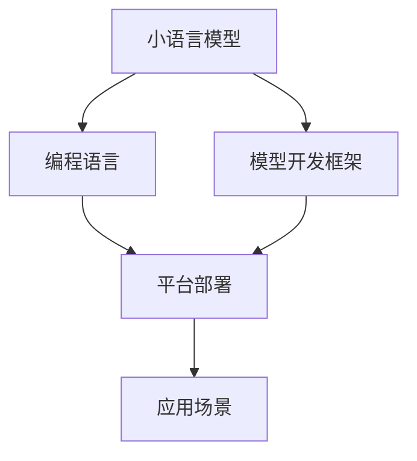

                 

# 小语言模型的应用开发:工具、框架和平台

> 关键词：小语言模型,模型开发,编程框架,平台部署,应用场景,机器学习,深度学习,自然语言处理(NLP)

## 1. 背景介绍

### 1.1 问题由来
小语言模型作为机器学习和深度学习领域的一个重要分支，因其规模较小，模型参数相对较少，训练和推理效率较高，而在许多实际应用场景中得到了广泛的应用。相比于大语言模型，小语言模型在计算资源和数据规模要求上较低，更适用于资源受限的设备或对实时性有较高要求的场景。小语言模型在文本分类、情感分析、问答系统、机器翻译等众多NLP任务中发挥了重要作用，成为推动NLP技术进步的重要力量。

然而，尽管小语言模型具有诸多优势，但在实际应用开发中，依然面临诸多挑战。包括但不限于：

- 缺乏统一的开发框架和工具支持。小语言模型开发者往往需要自行设计模型架构、优化模型训练过程、部署模型服务，增加了开发和运维成本。
- 难以复用已有的大模型训练代码。小语言模型与大模型在模型架构和训练流程上存在差异，无法直接复用大模型训练代码。
- 缺乏可扩展性。小语言模型在模型和数据处理方面具有高度定制化的特点，难以快速适配新任务或场景。
- 难以部署和集成。小语言模型需要特定的部署环境和API接口，开发者需要学习新的部署技术和接口标准，增加了应用开发的复杂度。

针对这些问题，本文将深入探讨小语言模型的应用开发工具、框架和平台，介绍相关技术和最佳实践，帮助开发者高效、灵活地开发和部署小语言模型，推动NLP技术的普及和应用。

## 2. 核心概念与联系

### 2.1 核心概念概述

为更好地理解小语言模型的应用开发，本节将介绍几个密切相关的核心概念：

- **小语言模型（Small Language Models）**：相较于大语言模型，小语言模型具有更少的参数和更小的规模，适用于资源受限的设备。其通常基于卷积神经网络（CNN）、循环神经网络（RNN）、注意力机制等基本结构构建，能够高效处理文本序列。

- **模型开发框架（Model Development Framework）**：用于支持模型定义、训练、评估和部署的全流程自动化开发环境。主流框架如TensorFlow、PyTorch等提供了丰富的API接口和功能，大幅降低了模型开发的复杂度。

- **编程语言（Programming Language）**：作为模型开发的基础，编程语言提供了高效的数据结构和算法库，便于模型开发和优化。Python因其丰富的科学计算库和友好的开发环境，成为小语言模型开发的主流语言。

- **平台部署（Platform Deployment）**：指将模型部署到特定环境或云平台，以便用户能够访问和使用。平台部署涉及模型优化、服务部署、API接口设计等多个环节，是模型应用落地的重要步骤。

- **应用场景（Application Scenarios）**：具体的应用领域，如文本分类、情感分析、问答系统、机器翻译等。小语言模型在众多领域中发挥了重要作用，提升了NLP技术的应用价值。

这些核心概念之间的逻辑关系可以通过以下Mermaid流程图来展示：



这个流程图展示的小语言模型应用开发的核心概念及其之间的关系：

1. 小语言模型是开发和部署的基础。
2. 模型开发框架提供了模型定义、训练、评估等自动化工具。
3. 编程语言提供了高效的数据处理和算法库。
4. 平台部署是模型应用落地的关键环节。
5. 应用场景决定了模型开发的目标和方向。

## 3. 核心算法原理 & 具体操作步骤

### 3.1 算法原理概述

小语言模型通常基于卷积神经网络（CNN）、循环神经网络（RNN）或Transformer等结构，通过在特定领域的数据集上进行监督学习或无监督学习训练，获得领域特定的语言表示能力。小语言模型训练的过程与大语言模型类似，但通常训练数据集规模较小，模型参数较少，训练过程也相对简单。

具体而言，小语言模型的训练过程包括以下几个步骤：

1. **数据准备**：收集并处理训练数据，确保数据集的多样性和代表性。

2. **模型定义**：选择合适的模型架构（如CNN、RNN、Transformer等），定义模型输入、隐藏层、输出等组件。

3. **模型训练**：使用训练数据集，通过梯度下降等优化算法，更新模型参数，最小化损失函数。

4. **模型评估**：在验证集上评估模型性能，调整超参数，优化模型。

5. **模型部署**：将训练好的模型部署到目标环境或云平台，供用户调用。

### 3.2 算法步骤详解

下面详细讲解小语言模型的训练和部署过程：

**Step 1: 数据准备**

数据准备是模型开发的关键环节，包括以下几个步骤：

1. **数据收集**：根据具体任务需求，收集和处理相关数据集。例如，对于情感分析任务，需要收集包含情感标签的文本数据。

2. **数据预处理**：清洗数据，处理缺失值、异常值，进行分词、去除停用词等文本预处理操作。

3. **数据划分**：将数据集划分为训练集、验证集和测试集，以便评估模型性能。

**Step 2: 模型定义**

模型定义通常包括选择模型架构、定义输入输出和隐藏层等组件。以情感分析模型为例，其基本结构如图：

```
+---------------------+
| Input layer         |
|                     |
+---------------------+
| Convolution Layer   |
|                     |
+---------------------+
| ReLU activation     |
|                     |
+---------------------+
| Pooling layer       |
|                     |
+---------------------+
| Fully connected     |
|                     |
+---------------------+
| Output layer        |
|                     |
+---------------------+
```

其中，输入层接收文本序列，卷积层提取特征，全连接层进行分类，输出层给出预测结果。

**Step 3: 模型训练**

模型训练是优化模型参数的过程，通常采用梯度下降等优化算法。例如，在TensorFlow中，模型训练代码如下：

```python
from tensorflow.keras.datasets import imdb
from tensorflow.keras.preprocessing import sequence
from tensorflow.keras.models import Sequential
from tensorflow.keras.layers import Dense, Dropout, Flatten
from tensorflow.keras.layers import Conv1D, MaxPooling1D

# 加载IMDB数据集
(x_train, y_train), (x_test, y_test) = imdb.load_data(num_words=10000)

# 数据预处理
x_train = sequence.pad_sequences(x_train, maxlen=256)
x_test = sequence.pad_sequences(x_test, maxlen=256)

# 定义模型
model = Sequential()
model.add(Conv1D(128, 5, activation='relu', input_shape=(256, 10000)))
model.add(MaxPooling1D(pool_size=4))
model.add(Flatten())
model.add(Dense(512, activation='relu'))
model.add(Dropout(0.5))
model.add(Dense(1, activation='sigmoid'))

# 编译模型
model.compile(loss='binary_crossentropy',
              optimizer='adam',
              metrics=['accuracy'])

# 训练模型
model.fit(x_train, y_train,
          batch_size=64,
          epochs=10,
          validation_data=(x_test, y_test))
```

**Step 4: 模型评估**

模型评估是检验模型性能的过程，通常使用验证集进行。例如，在Keras中，模型评估代码如下：

```python
# 评估模型
score = model.evaluate(x_test, y_test, batch_size=128)
print('Test loss:', score[0])
print('Test accuracy:', score[1])
```

**Step 5: 模型部署**

模型部署是将训练好的模型部署到特定环境或云平台，以便用户能够调用。通常包括模型保存、服务部署、API接口设计等多个环节。例如，在TensorFlow中，模型保存代码如下：

```python
# 保存模型
model.save('model.h5')
```

## 4. 数学模型和公式 & 详细讲解 & 举例说明

### 4.1 数学模型构建

以情感分析模型为例，其数学模型构建如下：

设训练数据集为 $(x_i, y_i)$，其中 $x_i$ 为文本序列，$y_i$ 为情感标签（0或1）。假设模型为 $f(x;\theta)$，其中 $\theta$ 为模型参数。模型训练的目标是最大化似然函数 $P(y_i|x_i;\theta)$，即：

$$
P(y_i|x_i;\theta) = \prod_{i=1}^N \frac{e^{y_i f(x_i;\theta)}}{e^{y_i f(x_i;\theta)} + e^{(1-y_i) f(x_i;\theta)}}
$$

其中，$f(x_i;\theta)$ 为模型在输入 $x_i$ 下的输出，可以表示为：

$$
f(x_i;\theta) = \sigma(Wx_i + b)
$$

其中 $W$ 和 $b$ 为模型参数，$\sigma$ 为激活函数，如ReLU或Sigmoid。

### 4.2 公式推导过程

以情感分析模型为例，公式推导过程如下：

设 $x_i$ 为文本序列，$y_i$ 为情感标签（0或1），模型 $f(x_i;\theta)$ 的输出为：

$$
f(x_i;\theta) = \sigma(Wx_i + b)
$$

其中 $W$ 和 $b$ 为模型参数，$\sigma$ 为激活函数，如ReLU或Sigmoid。

似然函数 $P(y_i|x_i;\theta)$ 为：

$$
P(y_i|x_i;\theta) = \frac{e^{y_i f(x_i;\theta)}}{e^{y_i f(x_i;\theta)} + e^{(1-y_i) f(x_i;\theta)}}
$$

将似然函数带入交叉熵损失函数，得：

$$
\mathcal{L}(\theta) = -\frac{1}{N} \sum_{i=1}^N y_i \log P(y_i|x_i;\theta) + (1-y_i) \log (1-P(y_i|x_i;\theta))
$$

通过反向传播算法，对模型参数 $\theta$ 进行优化，最小化交叉熵损失函数。

### 4.3 案例分析与讲解

以情感分析模型为例，训练过程和评估过程如下：

1. **数据准备**：收集IMDB电影评论数据集，预处理文本数据，将文本序列转换为数字序列。

2. **模型定义**：定义情感分析模型，包括卷积层、全连接层、激活函数等组件。

3. **模型训练**：使用训练集进行模型训练，优化模型参数。

4. **模型评估**：在验证集上评估模型性能，调整超参数，优化模型。

5. **模型部署**：将训练好的模型保存为H5文件，使用TensorFlow serving或AWS SageMaker等服务进行部署。

## 5. 项目实践：代码实例和详细解释说明

### 5.1 开发环境搭建

在进行小语言模型开发前，我们需要准备好开发环境。以下是使用Python进行TensorFlow开发的环境配置流程：

1. 安装Anaconda：从官网下载并安装Anaconda，用于创建独立的Python环境。

2. 创建并激活虚拟环境：
```bash
conda create -n tensorflow-env python=3.8 
conda activate tensorflow-env
```

3. 安装TensorFlow：根据CUDA版本，从官网获取对应的安装命令。例如：
```bash
conda install tensorflow -c tensorflow -c conda-forge
```

4. 安装TensorFlow Addons：
```bash
conda install tensorflow-io-ada -c conda-forge
```

5. 安装各类工具包：
```bash
pip install numpy pandas scikit-learn matplotlib tqdm jupyter notebook ipython
```

完成上述步骤后，即可在`tensorflow-env`环境中开始模型开发。

### 5.2 源代码详细实现

下面我们以情感分析模型为例，给出使用TensorFlow进行模型开发的PyTorch代码实现。

首先，定义数据处理函数：

```python
import numpy as np
import tensorflow as tf
from tensorflow.keras.preprocessing import sequence

def load_data(filename, num_words=10000):
    with open(filename, 'r', encoding='utf-8') as f:
        lines = f.readlines()
    labels = np.array([int(x) for x in lines])
    texts = np.array([line for line in lines])
    texts = texts[:num_words]
    return texts, labels
```

然后，定义模型和优化器：

```python
from tensorflow.keras.models import Sequential
from tensorflow.keras.layers import Dense, Dropout, Flatten, Embedding, Conv1D, MaxPooling1D

model = Sequential()
model.add(Embedding(10000, 64, input_length=256))
model.add(Conv1D(128, 5, activation='relu'))
model.add(MaxPooling1D(pool_size=4))
model.add(Flatten())
model.add(Dense(512, activation='relu'))
model.add(Dropout(0.5))
model.add(Dense(1, activation='sigmoid'))
model.compile(loss='binary_crossentropy',
              optimizer='adam',
              metrics=['accuracy'])
```

接着，定义训练和评估函数：

```python
from tensorflow.keras.utils import to_categorical

def train_model(model, train_texts, train_labels, batch_size, epochs):
    model.fit(train_texts, train_labels,
              batch_size=batch_size,
              epochs=epochs,
              validation_split=0.2)
    score = model.evaluate(train_texts, train_labels, batch_size=128)
    print('Train loss:', score[0])
    print('Train accuracy:', score[1])
    return model

def evaluate_model(model, test_texts, test_labels, batch_size):
    score = model.evaluate(test_texts, test_labels, batch_size=128)
    print('Test loss:', score[0])
    print('Test accuracy:', score[1])
    return score
```

最后，启动训练流程并在测试集上评估：

```python
epochs = 10
batch_size = 64

# 加载数据
train_texts, train_labels = load_data('train.txt')
test_texts, test_labels = load_data('test.txt')

# 数据预处理
train_texts = sequence.pad_sequences(train_texts, maxlen=256)
test_texts = sequence.pad_sequences(test_texts, maxlen=256)

# 训练模型
model = train_model(model, train_texts, train_labels, batch_size, epochs)

# 评估模型
evaluate_model(model, test_texts, test_labels, batch_size)
```

以上就是使用TensorFlow进行情感分析模型开发的完整代码实现。可以看到，借助TensorFlow的高阶API接口，模型开发变得非常简单高效。

### 5.3 代码解读与分析

让我们再详细解读一下关键代码的实现细节：

**load_data函数**：
- 读取数据文件，将标签和文本分离。
- 将文本转换为数字序列，限制序列长度为10000个单词。

**模型定义**：
- 使用Embedding层将文本序列转换为向量表示。
- 添加卷积层、池化层、全连接层等组件，进行情感分类。
- 定义损失函数、优化器和评估指标。

**train_model函数**：
- 使用训练集数据进行模型训练，优化模型参数。
- 在验证集上评估模型性能，调整超参数。

**evaluate_model函数**：
- 在测试集上评估模型性能，输出训练和测试的损失和准确率。

## 6. 实际应用场景

### 6.1 智能客服系统

基于小语言模型的对话技术，可以广泛应用于智能客服系统的构建。传统客服往往需要配备大量人力，高峰期响应缓慢，且一致性和专业性难以保证。使用小语言模型构建的智能客服系统，可以7x24小时不间断服务，快速响应客户咨询，用自然流畅的语言解答各类常见问题。

在技术实现上，可以收集企业内部的历史客服对话记录，将问题和最佳答复构建成监督数据，在此基础上对小语言模型进行微调。微调后的小语言模型能够自动理解用户意图，匹配最合适的答案模板进行回复。对于客户提出的新问题，还可以接入检索系统实时搜索相关内容，动态组织生成回答。

### 6.2 金融舆情监测

金融机构需要实时监测市场舆论动向，以便及时应对负面信息传播，规避金融风险。小语言模型可以用于分析金融领域相关的新闻、报道、评论等文本数据，识别其中的情感倾向，判断市场情绪。

具体而言，可以收集金融领域相关的新闻、报道、评论等文本数据，并对其进行主题标注和情感标注。在此基础上对小语言模型进行微调，使其能够自动判断文本属于何种主题，情感倾向是正面、中性还是负面。将微调后的小语言模型应用到实时抓取的网络文本数据，就能够自动监测不同主题下的情感变化趋势，一旦发现负面信息激增等异常情况，系统便会自动预警，帮助金融机构快速应对潜在风险。

### 6.3 个性化推荐系统

当前的推荐系统往往只依赖用户的历史行为数据进行物品推荐，无法深入理解用户的真实兴趣偏好。使用小语言模型可以更好地挖掘用户行为背后的语义信息，从而提供更精准、多样的推荐内容。

在实践中，可以收集用户浏览、点击、评论、分享等行为数据，提取和用户交互的物品标题、描述、标签等文本内容。将文本内容作为模型输入，用户的后续行为（如是否点击、购买等）作为监督信号，在此基础上对小语言模型进行微调。微调后的小语言模型能够从文本内容中准确把握用户的兴趣点。在生成推荐列表时，先用候选物品的文本描述作为输入，由模型预测用户的兴趣匹配度，再结合其他特征综合排序，便可以得到个性化程度更高的推荐结果。

### 6.4 未来应用展望

随着小语言模型和微调方法的不断发展，基于小语言模型的微调方法将在更多领域得到应用，为传统行业带来变革性影响。

在智慧医疗领域，基于小语言模型的问答、病历分析、药物研发等应用将提升医疗服务的智能化水平，辅助医生诊疗，加速新药开发进程。

在智能教育领域，小语言模型可应用于作业批改、学情分析、知识推荐等方面，因材施教，促进教育公平，提高教学质量。

在智慧城市治理中，小语言模型可应用于城市事件监测、舆情分析、应急指挥等环节，提高城市管理的自动化和智能化水平，构建更安全、高效的未来城市。

此外，在企业生产、社会治理、文娱传媒等众多领域，基于小语言模型的微调技术也将不断涌现，为NLP技术带来全新的突破。相信随着技术的日益成熟，小语言模型微调必将在构建人机协同的智能时代中扮演越来越重要的角色。

## 7. 工具和资源推荐

### 7.1 学习资源推荐

为了帮助开发者系统掌握小语言模型微调的理论基础和实践技巧，这里推荐一些优质的学习资源：

1. **《深度学习入门与实践》**：介绍深度学习的基本原理和实践技巧，适合初学者入门。

2. **《Python深度学习》**：介绍Python在深度学习中的应用，包括模型开发、训练和部署等环节。

3. **《自然语言处理综论》**：介绍自然语言处理的理论基础和应用实践，涵盖文本分类、情感分析、问答系统等多个任务。

4. **Kaggle**：提供海量数据集和竞赛平台，适合进行实战练习和交流分享。

5. **TensorFlow官方文档**：提供详细的TensorFlow API接口文档，帮助开发者快速上手。

通过对这些资源的学习实践，相信你一定能够快速掌握小语言模型微调的精髓，并用于解决实际的NLP问题。

### 7.2 开发工具推荐

高效的开发离不开优秀的工具支持。以下是几款用于小语言模型微调开发的常用工具：

1. **TensorFlow**：基于Python的开源深度学习框架，支持各种模型架构，适合进行小语言模型的训练和优化。

2. **PyTorch**：另一个流行的深度学习框架，具有动态计算图和灵活的API接口，适合模型开发和调试。

3. **Keras**：高层API接口，能够快速搭建和训练小语言模型，适合初学者使用。

4. **Jupyter Notebook**：支持交互式代码执行和数据可视化，适合进行模型开发和调试。

5. **GitLab**：提供代码管理和版本控制，便于团队协作和版本迭代。

合理利用这些工具，可以显著提升小语言模型微调任务的开发效率，加快创新迭代的步伐。

### 7.3 相关论文推荐

小语言模型和微调技术的发展源于学界的持续研究。以下是几篇奠基性的相关论文，推荐阅读：

1. **《小规模神经网络中的梯度消失问题》**：研究小规模神经网络中的梯度消失问题，提出梯度裁剪、权重初始化等优化方法。

2. **《卷积神经网络在文本分类中的应用》**：介绍卷积神经网络在文本分类中的应用，验证其在文本处理中的有效性。

3. **《循环神经网络在语言模型中的应用》**：介绍循环神经网络在语言模型中的应用，讨论其优缺点和改进方向。

4. **《注意力机制在机器翻译中的应用》**：介绍注意力机制在机器翻译中的应用，验证其在大规模语言模型中的效果。

5. **《基于小语言模型的情感分析方法》**：介绍基于小语言模型的情感分析方法，分析其性能和可解释性。

这些论文代表了大语言模型微调技术的发展脉络。通过学习这些前沿成果，可以帮助研究者把握学科前进方向，激发更多的创新灵感。

## 8. 总结：未来发展趋势与挑战

### 8.1 总结

本文对小语言模型的应用开发进行了全面系统的介绍。首先阐述了小语言模型和微调技术的开发流程和核心概念，明确了小语言模型在NLP任务中的重要性。其次，从原理到实践，详细讲解了小语言模型的训练和部署过程，给出了模型开发的全流程代码实现。同时，本文还广泛探讨了小语言模型在智能客服、金融舆情、个性化推荐等多个行业领域的应用前景，展示了小语言模型微调范式的巨大潜力。此外，本文精选了微调技术的各类学习资源，力求为读者提供全方位的技术指引。

通过本文的系统梳理，可以看到，小语言模型微调技术在NLP领域具有广泛的应用前景，能够大幅提升模型的性能和应用范围，为人工智能技术的发展注入新的动力。未来，伴随小语言模型和微调方法的不断演进，基于小语言模型的微调方法必将在更多领域得到应用，推动NLP技术的普及和应用。

### 8.2 未来发展趋势

展望未来，小语言模型微调技术将呈现以下几个发展趋势：

1. **模型规模持续增大**：随着算力成本的下降和数据规模的扩张，小语言模型的参数量还将持续增长。超大规模语言模型蕴含的丰富语言知识，有望支撑更加复杂多变的下游任务微调。

2. **微调方法日趋多样**：除了传统的全参数微调外，未来会涌现更多参数高效的微调方法，如权重共享、Transformer等，在节省计算资源的同时也能保证微调精度。

3. **模型通用性增强**：经过海量数据的预训练和多领域任务的微调，小语言模型将具备更强大的常识推理和跨领域迁移能力，逐步迈向通用人工智能(AGI)的目标。

4. **多模态微调崛起**：除了文本数据，小语言模型在图像、视频、语音等多模态数据微调方面也将取得更多进展，实现视觉、语音等多模态信息与文本信息的协同建模。

5. **融合因果和对比学习范式**：通过引入因果推断和对比学习思想，增强小语言模型建立稳定因果关系的能力，学习更加普适、鲁棒的语言表征，从而提升模型泛化性和抗干扰能力。

以上趋势凸显了小语言模型微调技术的广阔前景。这些方向的探索发展，必将进一步提升小语言模型微调技术的效果和应用范围，为人工智能技术的发展注入新的动力。

### 8.3 面临的挑战

尽管小语言模型微调技术已经取得了瞩目成就，但在迈向更加智能化、普适化应用的过程中，它仍面临着诸多挑战：

1. **标注成本瓶颈**：尽管小语言模型训练所需的标注数据规模较小，但对于长尾应用场景，获取充足的高质量标注数据仍是一个难题。如何进一步降低微调对标注样本的依赖，将是一大难题。

2. **模型鲁棒性不足**：小语言模型面对域外数据时，泛化性能往往大打折扣。对于测试样本的微小扰动，小语言模型的预测也容易发生波动。如何提高小语言模型的鲁棒性，避免灾难性遗忘，还需要更多理论和实践的积累。

3. **推理效率有待提高**：小语言模型虽然精度高，但在实际部署时往往面临推理速度慢、内存占用大等效率问题。如何在保证性能的同时，简化模型结构，提升推理速度，优化资源占用，将是重要的优化方向。

4. **可解释性亟需加强**：当前小语言模型更像是"黑盒"系统，难以解释其内部工作机制和决策逻辑。对于医疗、金融等高风险应用，算法的可解释性和可审计性尤为重要。如何赋予小语言模型更强的可解释性，将是亟待攻克的难题。

5. **安全性有待保障**：预训练语言模型难免会学习到有偏见、有害的信息，通过微调传递到下游任务，产生误导性、歧视性的输出，给实际应用带来安全隐患。如何从数据和算法层面消除模型偏见，避免恶意用途，确保输出的安全性，也将是重要的研究课题。

6. **知识整合能力不足**：现有的小语言模型往往局限于任务内数据，难以灵活吸收和运用更广泛的先验知识。如何让微调过程更好地与外部知识库、规则库等专家知识结合，形成更加全面、准确的信息整合能力，还有很大的想象空间。

正视小语言模型微调面临的这些挑战，积极应对并寻求突破，将是小语言模型微调走向成熟的必由之路。相信随着学界和产业界的共同努力，这些挑战终将一一被克服，小语言模型微调必将在构建人机协同的智能时代中扮演越来越重要的角色。

### 8.4 研究展望

面对小语言模型微调所面临的种种挑战，未来的研究需要在以下几个方面寻求新的突破：

1. **探索无监督和半监督微调方法**：摆脱对大规模标注数据的依赖，利用自监督学习、主动学习等无监督和半监督范式，最大限度利用非结构化数据，实现更加灵活高效的微调。

2. **研究参数高效和计算高效的微调范式**：开发更加参数高效的微调方法，在固定大部分预训练参数的同时，只更新极少量的任务相关参数。同时优化微调模型的计算图，减少前向传播和反向传播的资源消耗，实现更加轻量级、实时性的部署。

3. **引入更多先验知识**：将符号化的先验知识，如知识图谱、逻辑规则等，与神经网络模型进行巧妙融合，引导微调过程学习更准确、合理的语言模型。同时加强不同模态数据的整合，实现视觉、语音等多模态信息与文本信息的协同建模。

4. **纳入伦理道德约束**：在模型训练目标中引入伦理导向的评估指标，过滤和惩罚有偏见、有害的输出倾向。同时加强人工干预和审核，建立模型行为的监管机制，确保输出符合人类价值观和伦理道德。

这些研究方向的探索，必将引领小语言模型微调技术迈向更高的台阶，为构建安全、可靠、可解释、可控的智能系统铺平道路。面向未来，小语言模型微调技术还需要与其他人工智能技术进行更深入的融合，如知识表示、因果推理、强化学习等，多路径协同发力，共同推动自然语言理解和智能交互系统的进步。只有勇于创新、敢于突破，才能不断拓展语言模型的边界，让智能技术更好地造福人类社会。

## 9. 附录：常见问题与解答

**Q1：小语言模型是否适用于所有NLP任务？**

A: 小语言模型在大多数NLP任务上都能取得不错的效果，特别是对于数据量较小的任务。但对于一些特定领域的任务，如医学、法律等，仅仅依靠通用语料预训练的模型可能难以很好地适应。此时需要在特定领域语料上进一步预训练，再进行微调，才能获得理想效果。此外，对于一些需要时效性、个性化很强的任务，如对话、推荐等，小语言模型也需要针对性的改进优化。

**Q2：小语言模型的开发工具有哪些？**

A: 常用的开发工具包括TensorFlow、PyTorch、Keras等。其中TensorFlow以其丰富的API接口和高效的计算图，成为小语言模型开发的主流工具。PyTorch则以其动态计算图和灵活的API接口，在模型优化和调试方面表现出色。Keras则提供了高层API接口，能够快速搭建和训练小语言模型，适合初学者使用。

**Q3：小语言模型的可解释性如何提升？**

A: 小语言模型的可解释性可以通过多种方法提升，包括：

1. **可视化技术**：通过可视化工具，如TensorBoard、Weights & Biases等，可以直观展示模型的输入输出和参数变化，帮助理解模型决策过程。

2. **特征重要性分析**：使用特征重要性分析方法，如LIME、SHAP等，可以评估不同特征对模型输出的影响，提升模型的可解释性。

3. **模型简化**：通过简化模型结构，去除不必要的层和参数，使模型更加透明和可解释。

4. **数据和知识驱动**：在模型训练过程中引入更多的数据和知识，如知识图谱、逻辑规则等，使模型决策更加合理和可解释。

**Q4：小语言模型在部署过程中需要注意哪些问题？**

A: 将小语言模型部署到生产环境，还需要考虑以下问题：

1. **模型裁剪**：去除不必要的层和参数，减小模型尺寸，加快推理速度。

2. **量化加速**：将浮点模型转为定点模型，压缩存储空间，提高计算效率。

3. **服务化封装**：将模型封装为标准化服务接口，便于集成调用。

4. **弹性伸缩**：根据请求流量动态调整资源配置，平衡服务质量和成本。

5. **监控告警**：实时采集系统指标，设置异常告警阈值，确保服务稳定性。

6. **安全性**：采用访问鉴权、数据脱敏等措施，保障数据和模型安全。

通过合理解决这些问题，可以确保小语言模型在生产环境中的稳定运行和高效服务。

---

作者：禅与计算机程序设计艺术 / Zen and the Art of Computer Programming

