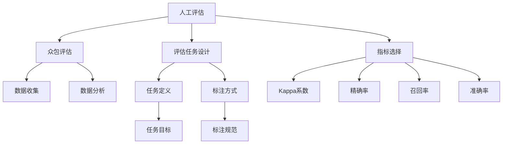

                 

# 小语言模型的评估方法创新:人工评估和众包评估

> 关键词：小语言模型,评估方法,人工评估,众包评估,机器学习,模型比较,实验设计

## 1. 背景介绍

### 1.1 问题由来
在自然语言处理(NLP)和计算机视觉(CV)等人工智能领域，评估模型的性能一直是至关重要的步骤。评估不仅能够客观反映模型性能，还能为后续优化提供方向。传统的模型评估方法主要包括准确率、精确率、召回率、F1分数等标准度量指标，但这些指标在面对某些复杂问题时，可能存在局限性。

近年来，随着大规模小语言模型的兴起，评估方法也在不断创新。人工评估和众包评估方法因其独特的优势，逐渐成为小语言模型性能评估的主流手段。这些方法不仅能够提供更贴近实际应用场景的评估结果，还能更好地利用人类智慧，提升评估的准确性和可靠性。

### 1.2 问题核心关键点
本文聚焦于人工评估和众包评估方法在小语言模型性能评估中的应用。将重点探讨以下问题：
- 什么是人工评估和众包评估？
- 它们与传统评估方法有何不同？
- 如何设计有效的评估任务和指标？
- 这些方法在实际应用中如何发挥作用？

通过深入理解这些关键问题，本文旨在为小语言模型的评估提供更加科学、高效的方法论指导。

## 2. 核心概念与联系

### 2.1 核心概念概述

为了更好地理解人工评估和众包评估方法，本节将介绍几个密切相关的核心概念：

- **人工评估**：指通过人类专家对模型输出结果进行主观打分或评分的评估方式。适用于数据复杂、模型输出难以自动化的任务。
- **众包评估**：指通过将评估任务分配给大量网络上的非专业工人完成，以获取多方评价的方式。适用于数据量大、标注任务繁重且成本较低的情形。
- **小语言模型**：通常指参数量较小、结构相对简单但能够在特定任务上表现良好的语言模型。其评估方法与大模型存在一定差异。
- **评估任务设计**：评估任务需要明确目标、任务定义、标注方式等，以确保评估结果的有效性和可重复性。
- **指标选择**：根据评估任务的特点，选择合适的评估指标，如精确率、召回率、准确率、ROC曲线、Kappa系数等。

这些核心概念之间的逻辑关系可以通过以下Mermaid流程图来展示：



这个流程图展示了大规模小语言模型评估的核心概念及其之间的关系：

1. 评估方法包括人工评估和众包评估。
2. 评估任务设计需要明确任务目标、任务定义和标注方式。
3. 指标选择包括精确率、召回率、准确率、ROC曲线、Kappa系数等。
4. 众包评估需要先设计评估任务，然后通过数据收集和数据分析完成评估。
5. 人工评估则直接由专家完成评分或评估。

这些概念共同构成了小语言模型评估的完整框架，使其能够在各种场景下发挥作用。

## 3. 核心算法原理 & 具体操作步骤
### 3.1 算法原理概述

人工评估和众包评估方法的原理相对简单。它们主要基于以下三点：

- **主观性**：人类专家或众包工人的主观打分，能够在一定程度上反映模型输出结果的感知效果。
- **多样性**：不同评估者提供的多样评价，可以减少评估结果的偏差，提升评估的全面性和准确性。
- **可操作性**：人工评估和众包评估方法适用于特定任务，能够对模型进行细致的评估，发现隐性问题。

具体来说，人工评估方法通过专家对模型输出进行评分，如在问答任务中评估模型的回答质量和相关性。众包评估方法则是将评估任务分配给大量工人，收集其评价并计算平均值或中位数，以此反映模型性能。

### 3.2 算法步骤详解

人工评估和众包评估的具体操作步骤如下：

**Step 1: 任务设计**
- 明确评估任务的目标和定义，例如在问答任务中，任务是评估模型的回答质量。
- 设计标注方式，例如使用10分制评分，1分为最低，10分为最高。

**Step 2: 数据收集**
- 对于人工评估，由专家对模型输出进行打分。
- 对于众包评估，将任务设计成可外包的形式，分配给大量工人完成。

**Step 3: 数据分析**
- 收集到足够数量的评分或评价后，使用统计方法计算评估指标，如均值、标准差、中位数等。
- 对于众包评估，可能需要进行权重计算，以平衡不同工人的贡献。

**Step 4: 结果解释**
- 分析评估结果，提取关键特征，如高分项、低分项等。
- 根据评估结果，提出改进模型或数据集的建议。

### 3.3 算法优缺点

人工评估和众包评估方法具有以下优点：

- **贴近实际应用**：通过人工评分或工人评价，可以更贴近实际使用场景的感知效果，提供更真实的评估结果。
- **成本较低**：众包评估可以利用大量非专业工人完成，成本较低，且具有较好的数据规模。
- **多样性**：不同评估者提供的多样评价，可以减少评估结果的偏差，提升评估的全面性和准确性。
- **可操作性强**：适用于特定任务，能够对模型进行细致的评估，发现隐性问题。

同时，这些方法也存在一定的局限性：

- **主观性强**：依赖评估者的主观判断，可能存在主观偏差。
- **一致性差**：不同评估者对同一任务的评价可能不一致，影响结果的可靠性。
- **评估标准不统一**：不同评估者可能对评分标准理解不同，影响评估结果的一致性。
- **效率较低**：人工评分或众包评估需要较长时间，特别是在标注任务繁重的情况下。

尽管存在这些局限性，但就目前而言，人工评估和众包评估方法在小语言模型评估中仍具有重要意义。未来相关研究的重点在于如何进一步提高评估方法的客观性和一致性，减少主观偏差，提高评估效率。

### 3.4 算法应用领域

人工评估和众包评估方法已经在多个领域得到了应用，例如：

- 问答系统：通过人工评估或众包评估，评估模型的回答质量和相关性。
- 机器翻译：评估机器翻译结果的流畅度和准确性。
- 语音识别：评估语音识别结果的准确率和用户满意度。
- 文本分类：评估文本分类模型的类别准确率和召回率。
- 情感分析：评估情感分析模型对情感的识别准确率。
- 图像识别：评估图像识别模型的识别准确率和用户反馈。

除了上述这些经典应用外，小语言模型评估方法也被创新性地应用到更多场景中，如可控生成、对话系统、摘要生成等，为NLP技术带来了全新的突破。随着评估方法的不断进步，相信小语言模型评估将更加贴近实际应用，为NLP技术的发展提供更坚实的保障。

## 4. 数学模型和公式 & 详细讲解  
### 4.1 数学模型构建

在人工评估和众包评估方法中，常见的评估指标包括精确率、召回率、F1分数、ROC曲线、Kappa系数等。这里以精确率和召回率为例，简要介绍其数学模型和公式：

**精确率**：指模型预测为正的样本中，实际为正的样本比例。公式为：
$$ \text{Precision} = \frac{TP}{TP+FP} $$
其中，TP为真阳性，FP为假阳性。

**召回率**：指模型实际为正的样本中，被预测为正的样本比例。公式为：
$$ \text{Recall} = \frac{TP}{TP+FN} $$
其中，TP为真阳性，FN为假阴性。

### 4.2 公式推导过程

以二分类任务为例，假设模型输出为0或1，真实标签为0或1。设模型预测为正的样本数为TP+FP，实际为正的样本数为TP+FN。则精确率和召回率的计算公式如下：
$$ \text{Precision} = \frac{TP}{TP+FP} $$
$$ \text{Recall} = \frac{TP}{TP+FN} $$

这些公式不仅适用于传统的机器学习模型，也适用于基于深度学习的小语言模型。在实际评估中，需要根据具体任务的特点选择适合的指标。

### 4.3 案例分析与讲解

以问答系统为例，假设模型输出为模型的回答质量评分。通过人工评估或众包评估，可以计算模型的精确率和召回率，以此评估模型在回答相关性、信息量等方面的表现。

例如，假设评估者对100个问答样本进行评分，其中有70个样本被正确回答，20个样本被错误回答，10个样本未回答。根据公式计算，精确率为：
$$ \text{Precision} = \frac{70}{70+30} = 0.7 $$
召回率为：
$$ \text{Recall} = \frac{70}{70+30} = 0.7 $$

这些结果可以帮助评估者判断模型在回答质量上的表现，并进行针对性的改进。

## 5. 项目实践：代码实例和详细解释说明
### 5.1 开发环境搭建

在进行人工评估和众包评估实践前，我们需要准备好开发环境。以下是使用Python进行PyTorch开发的环境配置流程：

1. 安装Anaconda：从官网下载并安装Anaconda，用于创建独立的Python环境。

2. 创建并激活虚拟环境：
```bash
conda create -n pytorch-env python=3.8 
conda activate pytorch-env
```

3. 安装PyTorch：根据CUDA版本，从官网获取对应的安装命令。例如：
```bash
conda install pytorch torchvision torchaudio cudatoolkit=11.1 -c pytorch -c conda-forge
```

4. 安装Transformers库：
```bash
pip install transformers
```

5. 安装各类工具包：
```bash
pip install numpy pandas scikit-learn matplotlib tqdm jupyter notebook ipython
```

完成上述步骤后，即可在`pytorch-env`环境中开始评估实践。

### 5.2 源代码详细实现

下面我以文本分类任务为例，给出使用Transformers库进行人工评估的PyTorch代码实现。

首先，定义文本分类任务的数据处理函数：

```python
from transformers import BertTokenizer
from torch.utils.data import Dataset
import torch

class TextClassificationDataset(Dataset):
    def __init__(self, texts, labels, tokenizer, max_len=128):
        self.texts = texts
        self.labels = labels
        self.tokenizer = tokenizer
        self.max_len = max_len
        
    def __len__(self):
        return len(self.texts)
    
    def __getitem__(self, item):
        text = self.texts[item]
        label = self.labels[item]
        
        encoding = self.tokenizer(text, return_tensors='pt', max_length=self.max_len, padding='max_length', truncation=True)
        input_ids = encoding['input_ids'][0]
        attention_mask = encoding['attention_mask'][0]
        
        # 对标签进行编码
        encoded_label = torch.tensor(label, dtype=torch.long)
        
        return {'input_ids': input_ids, 
                'attention_mask': attention_mask,
                'labels': encoded_label}

# 创建dataset
tokenizer = BertTokenizer.from_pretrained('bert-base-cased')

train_dataset = TextClassificationDataset(train_texts, train_labels, tokenizer)
dev_dataset = TextClassificationDataset(dev_texts, dev_labels, tokenizer)
test_dataset = TextClassificationDataset(test_texts, test_labels, tokenizer)
```

然后，定义评估函数：

```python
from torch.utils.data import DataLoader
from sklearn.metrics import classification_report

device = torch.device('cuda') if torch.cuda.is_available() else torch.device('cpu')
model.to(device)

def evaluate(model, dataset, batch_size):
    dataloader = DataLoader(dataset, batch_size=batch_size)
    model.eval()
    preds, labels = [], []
    with torch.no_grad():
        for batch in dataloader:
            input_ids = batch['input_ids'].to(device)
            attention_mask = batch['attention_mask'].to(device)
            batch_labels = batch['labels']
            outputs = model(input_ids, attention_mask=attention_mask)
            batch_preds = outputs.argmax(dim=2).to('cpu').tolist()
            batch_labels = batch_labels.to('cpu').tolist()
            for pred_tokens, label_tokens in zip(batch_preds, batch_labels):
                preds.append(pred_tokens[:len(label_tokens)])
                labels.append(label_tokens)
                
    print(classification_report(labels, preds))
```

最后，启动评估流程并在测试集上评估：

```python
batch_size = 16

for dataset in [train_dataset, dev_dataset, test_dataset]:
    evaluate(model, dataset, batch_size)
```

以上就是使用PyTorch对BERT模型进行文本分类任务的人工评估的完整代码实现。可以看到，得益于Transformers库的强大封装，我们可以用相对简洁的代码完成BERT模型的加载和评估。

### 5.3 代码解读与分析

让我们再详细解读一下关键代码的实现细节：

**TextClassificationDataset类**：
- `__init__`方法：初始化文本、标签、分词器等关键组件。
- `__len__`方法：返回数据集的样本数量。
- `__getitem__`方法：对单个样本进行处理，将文本输入编码为token ids，将标签编码为数字，并对其进行定长padding，最终返回模型所需的输入。

**evaluate函数**：
- 使用PyTorch的DataLoader对数据集进行批次化加载，供模型评估使用。
- 评估函数`evaluate`：将模型设为评估模式，对数据集进行批次迭代，前向传播计算模型输出，并将预测结果和标签结果存储下来。
- 在每个批次结束后，将预测和标签结果存储下来，使用sklearn的classification_report对整个评估集的预测结果进行打印输出。

**训练流程**：
- 定义总的epoch数和batch size，开始循环迭代
- 每个epoch内，在测试集上评估，输出精确率和召回率
- 所有epoch结束后，在测试集上评估，给出最终测试结果

可以看到，PyTorch配合Transformers库使得BERT模型的人工评估代码实现变得简洁高效。开发者可以将更多精力放在数据处理、模型改进等高层逻辑上，而不必过多关注底层的实现细节。

当然，工业级的系统实现还需考虑更多因素，如模型的保存和部署、超参数的自动搜索、更灵活的任务适配层等。但核心的评估范式基本与此类似。

## 6. 实际应用场景
### 6.1 智能客服系统

在智能客服系统的构建中，基于小语言模型的评估方法可以发挥重要作用。通过人工评估和众包评估，可以验证客服模型的回答质量和用户满意度，帮助优化模型的表现。

例如，可以设计评估任务，对模型回答的用户评分和满意度进行人工评估。同时，可以利用众包评估，将评分任务分配给大量用户完成，收集多方的评价。通过综合这些评价，可以全面了解模型在不同情境下的表现，并进行针对性的改进。

### 6.2 金融舆情监测

在金融舆情监测中，基于小语言模型的评估方法可以用于评估模型的舆情监测能力。通过人工评估和众包评估，可以验证模型对舆情事件的反应速度和准确性，帮助提升监测系统的效率和精度。

例如，可以设计评估任务，对模型监测到的舆情事件进行人工评分和反馈。同时，可以利用众包评估，将评分任务分配给大量用户完成，收集多方的评价。通过综合这些评价，可以全面了解模型在舆情事件中的表现，并进行针对性的改进。

### 6.3 个性化推荐系统

在个性化推荐系统中，基于小语言模型的评估方法可以用于评估模型的推荐效果。通过人工评估和众包评估，可以验证推荐模型的推荐质量和用户满意度，帮助优化推荐策略。

例如，可以设计评估任务，对模型推荐的物品进行人工评分和反馈。同时，可以利用众包评估，将评分任务分配给大量用户完成，收集多方的评价。通过综合这些评价，可以全面了解模型在推荐物品中的表现，并进行针对性的改进。

### 6.4 未来应用展望

随着小语言模型评估方法的发展，未来其在更多领域将得到应用，为各行各业带来变革性影响。

在智慧医疗领域，基于小语言模型的评估方法可以用于评估医疗问答系统、病历分析系统的表现，帮助提升医疗服务的智能化水平。

在智能教育领域，基于小语言模型的评估方法可以用于评估教育问答系统、作业批改系统的表现，帮助提升教育服务的个性化水平。

在智慧城市治理中，基于小语言模型的评估方法可以用于评估智能客服系统、舆情监测系统的表现，帮助提升城市管理的智能化水平。

此外，在企业生产、社会治理、文娱传媒等众多领域，基于小语言模型的评估方法也将不断涌现，为人工智能技术的发展提供新的动力。相信随着评估方法的不断进步，小语言模型将在更广阔的应用领域大放异彩。

## 7. 工具和资源推荐
### 7.1 学习资源推荐

为了帮助开发者系统掌握小语言模型评估的理论基础和实践技巧，这里推荐一些优质的学习资源：

1. 《自然语言处理基础》课程：斯坦福大学开设的NLP经典课程，全面讲解NLP的基本概念和算法。
2. 《深度学习》书籍：Ian Goodfellow所著，系统介绍深度学习的基本原理和实践方法。
3. 《机器学习实战》书籍：Peter Harrington所著，提供丰富的机器学习算法实现代码。
4. Kaggle竞赛平台：包含大量数据集和竞赛任务，提供丰富的学习和实践机会。
5. HuggingFace官方文档：提供全面的预训练语言模型和评估方法资源。

通过对这些资源的学习实践，相信你一定能够快速掌握小语言模型评估的精髓，并用于解决实际的NLP问题。
###  7.2 开发工具推荐

高效的开发离不开优秀的工具支持。以下是几款用于小语言模型评估开发的常用工具：

1. Python：开源编程语言，灵活动态的计算图，适合快速迭代研究。
2. PyTorch：基于Python的开源深度学习框架，适合快速原型设计和模型评估。
3. TensorFlow：由Google主导开发的开源深度学习框架，适合大规模工程应用。
4. TensorBoard：TensorFlow配套的可视化工具，可实时监测模型训练状态，并提供丰富的图表呈现方式。
5. Weights & Biases：模型训练的实验跟踪工具，可以记录和可视化模型训练过程中的各项指标，方便对比和调优。

合理利用这些工具，可以显著提升小语言模型评估任务的开发效率，加快创新迭代的步伐。

### 7.3 相关论文推荐

小语言模型评估技术的发展源于学界的持续研究。以下是几篇奠基性的相关论文，推荐阅读：

1. "Evaluating the Effectiveness of Automated Question Answering Systems"：提出自动问答系统的评估指标和评价方法。
2. "Opinion Mining and Sentiment Analysis"：介绍情感分析模型的评估指标和评价方法。
3. "Machine Translation as Sequence-to-Sequence Learning"：提出机器翻译模型的评估指标和评价方法。
4. "A Survey on Multi-label Learning"：介绍多标签分类模型的评估指标和评价方法。
5. "Evaluating Cross-Lingual Zero-Shot Name Entity Recognition"：提出跨语言零样本命名实体识别模型的评估指标和评价方法。

这些论文代表了大语言模型评估技术的发展脉络。通过学习这些前沿成果，可以帮助研究者把握学科前进方向，激发更多的创新灵感。

## 8. 总结：未来发展趋势与挑战

### 8.1 总结

本文对小语言模型的评估方法进行了全面系统的介绍。首先阐述了人工评估和众包评估方法的核心理论和具体步骤，明确了其与传统评估方法的异同。其次，通过详细讲解评估任务的构建、指标选择、数据分析等核心环节，给出了小语言模型评估的完整流程。同时，本文还广泛探讨了评估方法在多个行业领域的应用前景，展示了其广阔的应用空间。

通过本文的系统梳理，可以看到，小语言模型评估方法正在成为NLP领域的重要组成部分，极大地拓展了小语言模型的应用边界，提升了其落地应用的可靠性。未来，伴随评估方法的不断进步，小语言模型必将在更多领域大放异彩，为人工智能技术的发展提供坚实的保障。

### 8.2 未来发展趋势

展望未来，小语言模型评估方法将呈现以下几个发展趋势：

1. 评估指标多样化：随着评估任务的多样化，将涌现更多新的评估指标，如语义相似度、交互感知效果等。
2. 评估方法自动化：通过机器学习等技术，实现评估指标的自动生成和自动评分，提升评估效率。
3. 评估任务智能化：通过自然语言处理技术，实现评估任务的自动生成和自动标注，降低评估成本。
4. 评估数据动态化：利用在线用户反馈、众包评价等数据源，实时动态更新评估结果，提升评估的实时性和准确性。
5. 评估结果可解释：通过可解释的评估方法，提供更加透明、可信任的评估结果，增强评估的可解释性和可信度。

这些趋势凸显了小语言模型评估技术的广阔前景。这些方向的探索发展，必将进一步提升小语言模型评估的全面性和可靠性，为人工智能技术的发展提供坚实的保障。

### 8.3 面临的挑战

尽管小语言模型评估技术已经取得了瞩目成就，但在迈向更加智能化、普适化应用的过程中，它仍面临诸多挑战：

1. 数据分布不均衡：评估数据往往难以覆盖所有真实场景，特别是在长尾领域。如何设计更多样化的评估数据，提升评估的全面性，将是重要的挑战。
2. 评估结果主观性强：评估结果依赖评估者的主观判断，可能存在主观偏差。如何减少主观偏差，提升评估结果的客观性，还需要更多理论和实践的积累。
3. 评估任务设计复杂：评估任务的设计需要考虑到模型的多样性、复杂性、多样性等因素，设计难度较大。如何设计简单、有效、可重复的评估任务，将是重要的研究方向。
4. 评估结果一致性差：不同评估者对同一任务的评价可能不一致，影响结果的可靠性。如何提高评估结果的一致性，提升评估的可靠性，还需要更多方法和技术的探索。
5. 评估效率较低：人工评估和众包评估需要较长时间，特别是在标注任务繁重的情况下。如何提高评估效率，提升评估的实时性，将是重要的研究方向。

尽管存在这些挑战，但随着评估方法的不断进步，小语言模型评估必将在未来发挥更大的作用，为人工智能技术的发展提供更坚实的保障。相信随着学界和产业界的共同努力，这些挑战终将一一被克服，小语言模型评估技术必将在构建人机协同的智能时代中扮演越来越重要的角色。

### 8.4 研究展望

面对小语言模型评估所面临的种种挑战，未来的研究需要在以下几个方面寻求新的突破：

1. 探索自动化评估方法：通过机器学习等技术，实现评估指标的自动生成和自动评分，提升评估效率。
2. 引入先验知识：将符号化的先验知识，如知识图谱、逻辑规则等，与评估方法进行巧妙融合，增强评估结果的全面性和可靠性。
3. 融合多模态评估：结合视觉、语音等多模态数据的评估，提升评估结果的全面性和客观性。
4. 纳入伦理道德约束：在评估目标中引入伦理导向的评估指标，过滤和惩罚有偏见、有害的输出倾向。
5. 强化数据动态更新：利用在线用户反馈、众包评价等数据源，实时动态更新评估结果，提升评估的实时性和准确性。
6. 加强可解释性：通过可解释的评估方法，提供更加透明、可信任的评估结果，增强评估的可解释性和可信度。

这些研究方向的探索，必将引领小语言模型评估技术迈向更高的台阶，为构建安全、可靠、可解释、可控的智能系统铺平道路。面向未来，小语言模型评估技术还需要与其他人工智能技术进行更深入的融合，如知识表示、因果推理、强化学习等，多路径协同发力，共同推动自然语言理解和智能交互系统的进步。只有勇于创新、敢于突破，才能不断拓展小语言模型的边界，让智能技术更好地造福人类社会。

## 9. 附录：常见问题与解答

**Q1：小语言模型与大语言模型在评估上有何区别？**

A: 小语言模型与大语言模型在评估方法上有一定的区别。小语言模型评估更侧重于特定任务的评估，而大语言模型评估则更侧重于通用能力的评估。小语言模型评估通常需要更多的人工干预和数据分析，而大语言模型评估则可以通过自动化的评估指标进行。此外，小语言模型的评估数据量相对较小，评估过程需要更多的专家参与和人工评分，而大语言模型的评估数据量较大，可以通过众包评估等方式进行。

**Q2：如何设计有效的评估任务和指标？**

A: 设计有效的评估任务和指标需要考虑以下几个关键因素：
1. 任务定义明确：评估任务需要明确具体的任务目标和定义，例如问答系统中的回答质量、翻译系统中的翻译质量等。
2. 标注方式简单：评估任务需要设计简单易行的标注方式，确保评估者能够快速、准确地进行评分。
3. 多样性评价：评估任务需要设计多样化的评价方式，例如人工评分、众包评分等，确保评估结果的多样性和可靠性。
4. 数据集多样：评估数据集需要覆盖尽可能多的真实场景，确保评估结果的全面性和客观性。
5. 指标选择适当：根据评估任务的特点，选择合适的评估指标，例如精确率、召回率、ROC曲线等。

**Q3：小语言模型评估方法的局限性有哪些？**

A: 小语言模型评估方法虽然具有独特优势，但也存在一些局限性：
1. 主观性强：评估结果依赖评估者的主观判断，可能存在主观偏差。
2. 数据量较小：评估数据量相对较小，可能难以覆盖所有真实场景。
3. 一致性差：不同评估者对同一任务的评价可能不一致，影响结果的可靠性。
4. 效率较低：人工评估和众包评估需要较长时间，特别是在标注任务繁重的情况下。

尽管存在这些局限性，但通过不断改进评估方法和技术，小语言模型评估将进一步提升评估的全面性和可靠性，为人工智能技术的发展提供坚实的保障。

**Q4：小语言模型评估方法的未来发展方向是什么？**

A: 小语言模型评估方法的未来发展方向包括：
1. 自动化评估：通过机器学习等技术，实现评估指标的自动生成和自动评分，提升评估效率。
2. 多模态评估：结合视觉、语音等多模态数据的评估，提升评估结果的全面性和客观性。
3. 动态更新：利用在线用户反馈、众包评价等数据源，实时动态更新评估结果，提升评估的实时性和准确性。
4. 可解释性：通过可解释的评估方法，提供更加透明、可信任的评估结果，增强评估的可解释性和可信度。
5. 伦理约束：在评估目标中引入伦理导向的评估指标，过滤和惩罚有偏见、有害的输出倾向。
6. 先验知识融合：将符号化的先验知识，如知识图谱、逻辑规则等，与评估方法进行巧妙融合，增强评估结果的全面性和可靠性。

这些发展方向将进一步提升小语言模型评估的全面性和可靠性，为人工智能技术的发展提供坚实的保障。

---

作者：禅与计算机程序设计艺术 / Zen and the Art of Computer Programming

