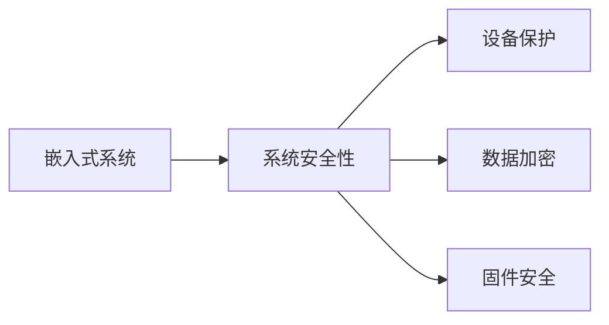

                 

# 嵌入式系统安全性：保护设备和数据

> 关键词：嵌入式系统,系统安全性,设备保护,数据加密,固件安全

## 1. 背景介绍

随着物联网(IoT)和智能设备的普及，嵌入式系统在医疗、工业、交通、家居等领域的应用越来越广泛。然而，这些系统通常部署在资源有限的设备上，面临网络威胁、固件漏洞、数据泄露等安全问题，一旦被攻击，将带来不可估量的损失。

嵌入式系统是软件与硬件结合的产物，安全防护需要从开发、部署、运行、维护的整个生命周期进行全面考虑。本文将从系统安全性设计、设备保护技术、数据加密和固件安全防护四个方面，探讨如何构建安全可靠的嵌入式系统，确保设备与数据的安全性。

## 2. 核心概念与联系

### 2.1 核心概念概述

在嵌入式系统安全性的讨论中，我们需要了解以下几个核心概念：

- **嵌入式系统(Embedded Systems)**：嵌入在物理产品中、具备特定功能的软件与硬件组合体。如智能家居设备的控制器、工业设备的传感器等。
- **系统安全性(System Security)**：指嵌入式系统在生命周期内，避免遭受各类威胁，确保数据的机密性、完整性和可用性。
- **设备保护(Device Protection)**：指对嵌入式设备进行物理防护、网络隔离、身份认证等措施，避免设备被非法访问和篡改。
- **数据加密(Data Encryption)**：指对设备中的敏感数据进行加密保护，防止数据泄露和篡改。
- **固件安全(Firmware Security)**：指对嵌入式系统的固件进行安全防护，防止固件被恶意篡改。

这些概念之间存在紧密的联系，系统安全性是嵌入式系统的核心目标，设备保护、数据加密和固件安全是其重要组成部分。有效的设备保护、数据加密和固件安全措施，能够大幅提升系统的安全性，避免攻击者通过不同途径入侵设备。

### 2.2 核心概念原理和架构的 Mermaid 流程图



## 3. 核心算法原理 & 具体操作步骤

### 3.1 算法原理概述

嵌入式系统安全性的实现涉及多个方面，包括硬件安全、软件安全、网络安全等。核心算法原理可以分为以下几个步骤：

1. **硬件安全(Hardware Security)**：
   - **TPM(Trusted Platform Module)**：一种硬件安全模块，用于存储密钥、证书等敏感信息，保护设备不被非法侵入。
   - **加密芯片**：如AES、RSA等加密算法，用于保护数据加密过程中的密钥和加密数据。

2. **软件安全(Software Security)**：
   - **身份认证**：如用户名和密码、双因素认证等，确保只有授权用户可以访问系统。
   - **权限管理**：基于角色的访问控制(RBAC)等策略，限制不同用户的操作权限。
   - **数据加密**：如AES、RSA等加密算法，确保数据传输和存储的安全性。

3. **网络安全(Network Security)**：
   - **防火墙**：用于隔离网络攻击，保护系统不受外部威胁。
   - **VPN(Virtual Private Network)**：通过加密隧道，保护数据传输安全。

### 3.2 算法步骤详解

以嵌入式系统的网络安全为例，详细的步骤包括：

1. **网络隔离**：将嵌入式系统与互联网物理隔离，只允许可信网络访问。
2. **防火墙配置**：在网络边界部署防火墙，只允许特定IP地址和端口进行通信。
3. **VPN部署**：建立VPN连接，通过加密隧道保护数据传输。
4. **入侵检测**：部署IDS(入侵检测系统)，实时监控网络流量，发现异常行为。
5. **威胁响应**：一旦检测到异常行为，自动响应并采取隔离措施。

### 3.3 算法优缺点

嵌入式系统安全性算法具有以下优点：

1. **全面防护**：通过硬件安全、软件安全、网络安全等多层次防护，能够有效抵御各种威胁。
2. **灵活配置**：可以根据不同的应用场景，灵活调整安全策略。
3. **高效性能**：在嵌入式设备上部署安全算法，能够高效利用资源，避免对性能的影响。

同时，也存在一些缺点：

1. **资源限制**：嵌入式设备资源有限，安全算法的部署和维护成本较高。
2. **开发复杂**：需要同时考虑软件和硬件的协同设计，增加了开发难度。
3. **维护难度**：安全策略需要定期更新和维护，增加了系统复杂性。

### 3.4 算法应用领域

嵌入式系统安全性的算法应用广泛，包括：

1. **医疗设备**：如心电图机、血氧仪等医疗设备，保护患者隐私数据。
2. **工业控制**：如自动化生产线、智能电网等，防止恶意攻击破坏设备。
3. **智能家居**：如智能音箱、智能锁等，保护用户隐私和数据安全。
4. **交通系统**：如智能交通信号灯、自动驾驶系统等，确保系统稳定运行。

## 4. 数学模型和公式 & 详细讲解 & 举例说明

### 4.1 数学模型构建

嵌入式系统安全性涉及的数学模型包括加密算法、身份认证算法、权限管理算法等。这里以AES加密算法为例，构建数学模型：

**输入**：明文Plaintext，密钥Key。

**输出**：密文Ciphertext。

AES算法是一种对称加密算法，具有以下几个关键步骤：

1. **字节代换**：将明文中的每个字节进行代换。
2. **行移位**：将明文按行进行移位操作。
3. **列混淆**：将明文按列进行置换操作。
4. **轮密钥加**：将明文与轮密钥进行异或运算。

数学模型如下：

$$
C = (P \oplus K_0), (P_{1} \oplus K_1), (P_{2} \oplus K_2), ..., (P_{14} \oplus K_{14})
$$

其中 $\oplus$ 表示异或运算。

### 4.2 公式推导过程

AES算法的推导过程复杂，此处仅以第一轮为例进行简要说明。

**明文和密钥**：

$$
P = (64 \text{位明文}), K = (128 \text{位密钥})
$$

**字节代换**：

$$
\sigma(P) = P_0 \oplus P_1 \oplus P_2 \oplus P_3
$$

**行移位**：

$$
R_0 = P_0, R_1 = \sigma(P_4) \oplus P_4 \oplus P_5 \oplus P_6 \oplus P_7
$$

**列混淆**：

$$
C_0 = R_0, C_1 = R_1, C_2 = R_2, ..., C_{15}
$$

**轮密钥加**：

$$
K_0 = K_0
$$

**密文输出**：

$$
C_0 \oplus K_0 = C_0
$$

### 4.3 案例分析与讲解

假设有一个医疗设备，采集患者的生理数据并传输到云端进行分析。为确保数据安全，可以使用AES算法对数据进行加密。

**加密过程**：

1. **生成密钥**：从TPM中获取256位密钥。
2. **明文准备**：将生理数据按照AES算法要求进行处理。
3. **加密计算**：使用AES算法计算密文。
4. **密文传输**：将密文传输到云端。

**解密过程**：

1. **密文准备**：从云端获取密文。
2. **密钥获取**：从TPM中获取与加密时相同的密钥。
3. **解密计算**：使用AES算法计算明文。
4. **明文分析**：对明文进行分析，获取患者的生理数据。

## 5. 项目实践：代码实例和详细解释说明

### 5.1 开发环境搭建

嵌入式系统开发需要搭建一定的开发环境，包括编译器、调试器等工具。以ARM Cortex-A系列为例，开发环境搭建步骤如下：

1. **交叉编译器**：安装Cortex-A系列芯片的交叉编译器，如GCC等。
2. **调试器**：安装GDB等调试器，用于程序调试。
3. **开发板**：将开发板连接至电脑，进行程序下载和调试。
4. **操作系统**：安装Linux或RTOS等操作系统，支持系统开发。

### 5.2 源代码详细实现

以下是使用GCC和ARM Cortex-A系列芯片进行AES加密的代码实现：

```c
#include <stdio.h>
#include <string.h>
#include <openssl/aes.h>

void aes_encrypt(char *plaintext, char *key, char *ciphertext) {
    int plaintext_len = strlen(plaintext);
    int ciphertext_len = plaintext_len * 8 / 8 + 16;

    AES_KEY aes_key;
    AES_set_encrypt_key((unsigned char *)key, 128, &aes_key);

    unsigned char iv[AES_BLOCK_SIZE];
    memset(iv, 0, AES_BLOCK_SIZE);

    unsigned char plaintext_arr[plaintext_len];
    memcpy(plaintext_arr, plaintext, plaintext_len);

    unsigned char ciphertext_arr[ciphertext_len];
    memset(ciphertext_arr, 0, ciphertext_len);

    AES_cbc_encrypt(plaintext_arr, ciphertext_arr, plaintext_len, &aes_key, iv, AES_ENCRYPT);

    char ciphertext_str[128];
    for (int i = 0; i < ciphertext_len; i++) {
        sprintf(ciphertext_str + i * 2, "%02x", ciphertext_arr[i]);
    }
    ciphertext_str[ciphertext_len * 2] = '\0';
    strcpy(ciphertext, ciphertext_str);
}
```

### 5.3 代码解读与分析

上述代码实现了AES加密算法，包含以下几个关键步骤：

1. **密钥设置**：通过AES_set_encrypt_key函数设置密钥。
2. **初始化向量**：设置初始化向量IV。
3. **明文处理**：将明文数据转换为字节数组。
4. **加密计算**：使用AES_cbc_encrypt函数进行加密。
5. **密文生成**：将加密结果转换为十六进制字符串。

## 6. 实际应用场景

### 6.1 智能家居设备

智能家居设备（如智能门锁、智能灯泡等）通常具备网络通信功能，容易成为攻击者的目标。在设备设计中，可以采用以下措施进行安全性保护：

1. **设备隔离**：将智能设备部署在专用网络上，与互联网物理隔离。
2. **固件签名**：对固件进行签名验证，确保固件未被篡改。
3. **数据加密**：对设备间通信数据进行加密，防止窃听和篡改。
4. **双因素认证**：用户登录时需同时提供密码和手机验证码，提高安全性。

### 6.2 医疗设备

医疗设备（如心电图机、血氧仪等）对数据安全性要求极高，泄露患者隐私数据将造成严重后果。在设备设计中，可以采用以下措施进行安全性保护：

1. **设备隔离**：将医疗设备部署在专用网络上，与互联网物理隔离。
2. **数据加密**：对生理数据进行加密，防止传输过程中被窃取。
3. **权限管理**：医生和护士等角色需按照权限访问数据，避免数据泄露。
4. **日志记录**：记录设备使用情况和数据访问日志，便于审计和溯源。

### 6.3 工业控制设备

工业控制设备（如自动化生产线、智能电网等）对设备稳定性要求极高，被攻击后可能导致生产中断、数据篡改等严重后果。在设备设计中，可以采用以下措施进行安全性保护：

1. **网络隔离**：将工业控制设备部署在专用网络上，与互联网物理隔离。
2. **固件签名**：对固件进行签名验证，确保固件未被篡改。
3. **入侵检测**：部署IDS系统，实时监控设备通信，发现异常行为。
4. **告警机制**：一旦检测到异常行为，自动发出告警，便于及时处理。

## 7. 工具和资源推荐

### 7.1 学习资源推荐

为了帮助开发者掌握嵌入式系统安全性设计，推荐以下学习资源：

1. **《嵌入式系统安全》课程**：讲授嵌入式系统安全的基础知识和实现方法。
2. **《物联网安全》书籍**：详细讲解物联网设备的安全防护措施。
3. **《嵌入式系统设计与实现》课程**：介绍嵌入式系统的硬件和软件设计。
4. **《网络安全技术》课程**：讲解网络安全的基本原理和实现方法。

### 7.2 开发工具推荐

嵌入式系统安全性的开发需要多种工具，以下是推荐的开发工具：

1. **GCC**：Gnu Compiler Collection，支持多种嵌入式芯片的编译。
2. **GDB**：GNU Debugger，支持调试嵌入式程序。
3. **Keil MDK**：Keil公司的IDE，支持Cortex-A系列芯片的开发。
4. **RTOS**：如FreeRTOS、µC/OS等，支持嵌入式系统的实时操作。

### 7.3 相关论文推荐

嵌入式系统安全性领域的研究不断深入，以下是几篇重要的相关论文，推荐阅读：

1. **《嵌入式系统安全设计》论文**：介绍嵌入式系统的安全设计原则和实现方法。
2. **《物联网设备安全性研究》论文**：探讨物联网设备的安全性和防护措施。
3. **《工业控制系统安全性研究》论文**：研究工业控制系统的安全性和防护技术。
4. **《嵌入式设备身份认证技术》论文**：探讨嵌入式设备身份认证的实现方法。

## 8. 总结：未来发展趋势与挑战

### 8.1 研究成果总结

本文对嵌入式系统安全性设计进行了全面的介绍，包括以下几个方面：

1. **嵌入式系统安全性的定义**：明确嵌入式系统的安全目标，包括设备保护、数据加密和固件安全。
2. **核心算法原理**：详细讲解了AES加密算法和身份认证算法的实现方法。
3. **操作步骤**：介绍了嵌入式系统安全性的开发和部署流程。
4. **实际应用场景**：探讨了智能家居、医疗设备和工业控制设备的安全性保护措施。
5. **工具和资源推荐**：推荐了学习资源、开发工具和相关论文，供开发者参考。

### 8.2 未来发展趋势

嵌入式系统安全性技术将呈现以下几个发展趋势：

1. **智能化安全防护**：未来的嵌入式系统将具备自我学习的能力，能够根据环境变化动态调整安全策略。
2. **多层次防护**：结合硬件、软件和网络多重防护措施，提升系统的安全性。
3. **模型驱动安全**：利用机器学习算法，分析设备运行状态，预测潜在安全风险，提前采取防护措施。
4. **跨域安全**：解决嵌入式设备间和系统间的安全互操作性问题，实现整体安全防护。

### 8.3 面临的挑战

尽管嵌入式系统安全性技术取得了一定进展，但在实际应用中仍面临诸多挑战：

1. **资源限制**：嵌入式设备资源有限，难以部署复杂的安全算法。
2. **开发复杂**：嵌入式系统的安全性设计和实现复杂，需要综合考虑软硬件因素。
3. **维护困难**：嵌入式系统的安全性策略需要定期更新和维护，增加了系统复杂性。

### 8.4 研究展望

未来的研究需要解决以下几个问题：

1. **轻量级算法**：开发轻量级、高效的加密和身份认证算法，适配嵌入式设备的资源限制。
2. **自动化安全测试**：开发自动化安全测试工具，提高嵌入式系统测试的效率和准确性。
3. **智能预警**：结合机器学习算法，实现对异常行为的实时预警和处理。
4. **跨平台互操作性**：解决不同嵌入式设备和系统间的安全互操作性问题。

## 9. 附录：常见问题与解答

**Q1：嵌入式系统安全性设计和实现中需要注意哪些关键点？**

A: 嵌入式系统安全性设计和实现中需要注意以下几点：

1. **硬件安全**：确保设备物理上的安全，防止非法物理访问。
2. **软件安全**：设计安全的操作系统和应用软件，防止软件漏洞。
3. **网络安全**：部署防火墙、VPN等措施，保护设备不受网络攻击。
4. **数据加密**：对传输和存储的数据进行加密，防止数据泄露。
5. **固件安全**：对固件进行签名验证，确保固件未被篡改。

**Q2：嵌入式系统安全性开发时常用的开发工具有哪些？**

A: 嵌入式系统安全性开发常用的开发工具包括：

1. **GCC**：支持多种嵌入式芯片的编译。
2. **GDB**：调试嵌入式程序。
3. **Keil MDK**：Cortex-A系列芯片的开发IDE。
4. **RTOS**：支持嵌入式系统的实时操作。

**Q3：嵌入式系统安全性在部署和维护过程中需要注意哪些问题？**

A: 嵌入式系统安全性在部署和维护过程中需要注意以下几点：

1. **资源限制**：嵌入式设备资源有限，需要合理选择安全算法。
2. **性能优化**：优化算法的实现，减少对系统性能的影响。
3. **定期更新**：定期更新安全策略和算法，应对新的威胁。
4. **日志记录**：记录系统运行状态和安全事件，便于审计和溯源。

**Q4：嵌入式系统安全性面临的挑战有哪些？**

A: 嵌入式系统安全性面临的挑战包括：

1. **资源限制**：嵌入式设备资源有限，难以部署复杂的安全算法。
2. **开发复杂**：嵌入式系统的安全性设计和实现复杂，需要综合考虑软硬件因素。
3. **维护困难**：嵌入式系统的安全性策略需要定期更新和维护，增加了系统复杂性。

**Q5：嵌入式系统安全性未来的发展方向有哪些？**

A: 嵌入式系统安全性未来的发展方向包括：

1. **智能化安全防护**：利用机器学习算法，实现自我学习，动态调整安全策略。
2. **多层次防护**：结合硬件、软件和网络多重防护措施，提升系统的安全性。
3. **模型驱动安全**：利用模型驱动安全，分析设备运行状态，预测潜在安全风险。
4. **跨域安全**：解决不同嵌入式设备和系统间的安全互操作性问题。

---

作者：禅与计算机程序设计艺术 / Zen and the Art of Computer Programming

