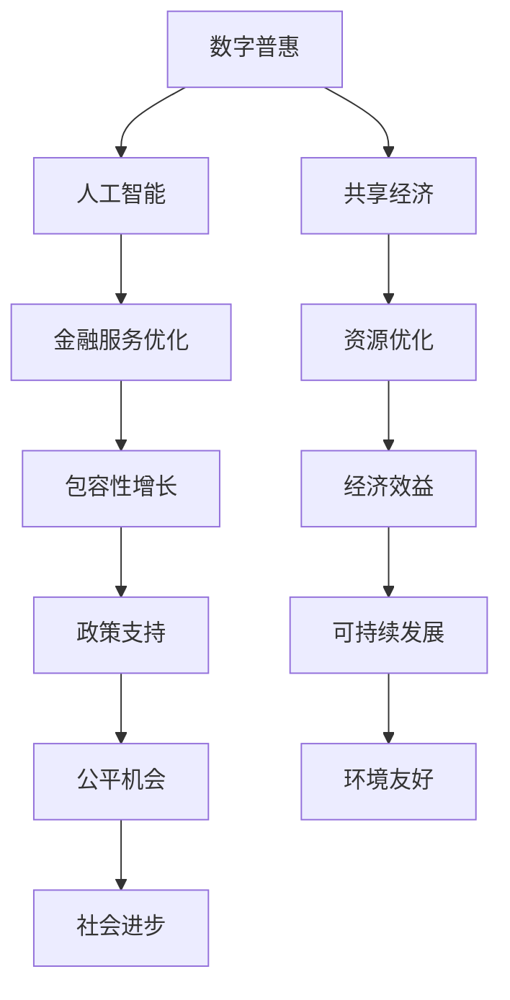

                 

# 2050年的全球减贫：从数字普惠到共享经济的包容性增长

> 关键词：数字普惠, 共享经济, 包容性增长, 人工智能, 社会治理, 可持续发展

## 1. 背景介绍

### 1.1 问题由来

全球贫困问题一直是人类面临的重大挑战之一。根据联合国《2030年可持续发展议程》，到2030年，各国需将极端贫困人口比例降至不到10%，并确保人人享有基本服务、保护权、教育和社会保护。然而，近年来，受新冠疫情冲击、全球经济疲软、地缘政治冲突等多重因素影响，全球减贫进程面临严峻考验。特别是由于技术不平等、数字鸿沟等问题，部分国家和地区在实现这一目标上仍存在较大困难。

为应对这一挑战，各国政府和国际组织提出了诸多创新方案，其中数字普惠金融(Digital Inclusion)和共享经济(Sharing Economy)成为热门焦点。通过技术赋能，将数字普惠和共享经济相结合，可实现从“普惠型增长”到“包容性增长”的转变，进而助力全球减贫目标的实现。

### 1.2 问题核心关键点

在2050年，随着科技的进一步发展，数字普惠金融和共享经济将成为全球减贫的重要工具。其核心关键点在于：

- **数字普惠**：利用数字技术，如移动支付、区块链、人工智能等，为贫困人口提供低成本、便捷的金融服务，使其享受到普惠型增长带来的红利。
- **共享经济**：通过共享资源和能力，实现资源的最大化利用，助力更多人参与经济活动，促进公平、包容性增长。
- **包容性增长**：着眼于社会公平，通过政策、制度创新，使更多人受益于技术进步和经济增长，从而实现可持续发展。

这些概念之间存在紧密联系，共同构成了一个复合而高效的减贫模型。

## 2. 核心概念与联系

### 2.1 核心概念概述

为更好地理解2050年全球减贫的路径，本节将介绍几个核心概念及其联系：

- **数字普惠金融**：利用数字技术，提供各类金融服务，使贫困人口也能享受到低成本、便捷的金融服务，包括支付、转账、贷款、保险等。
- **共享经济**：通过共享资源（如交通、住宿、工具）和能力（如时间、技能），实现资源的更有效利用，推动经济的可持续发展。
- **包容性增长**：通过政策、制度、技术手段，确保所有人公平参与经济活动，享受经济增长的成果，缩小贫富差距。
- **人工智能**：通过机器学习、自然语言处理等技术，提高金融服务的效率和质量，提升共享经济平台的智能化水平。
- **区块链**：利用去中心化、透明、不可篡改的特性，保障金融交易的公平和安全，促进共享经济平台的公平性。
- **可持续发展**：强调环境保护、经济增长和社会公平的平衡，通过技术手段实现资源的最优化利用，推动长期社会进步。

这些核心概念之间的逻辑关系可以通过以下Mermaid流程图来展示：



这个流程图展示了各个概念之间的联系：

1. 数字普惠金融通过人工智能优化金融服务，为包容性增长奠定基础。
2. 共享经济利用资源优化技术，提升经济效益，与数字普惠协同促进社会进步。
3. 包容性增长通过政策支持公平机会，实现可持续发展。
4. 数字普惠和共享经济共同推动可持续发展。

这些概念共同构成了一个相互支撑、协同发展的减贫模型。

## 3. 核心算法原理 & 具体操作步骤

### 3.1 算法原理概述

2050年的全球减贫模型，核心在于通过数字普惠和共享经济，实现包容性增长。其算法原理主要包括以下几个方面：

- **数字普惠算法**：利用机器学习技术，如分类、聚类、回归等，预测不同人群的金融需求，推荐个性化的金融服务。
- **共享经济算法**：通过优化匹配算法、评价体系、激励机制等，实现资源的有效配置和利用。
- **包容性增长算法**：通过政策模拟、社会仿真等方法，评估政策效果，优化政策设计。
- **可持续发展算法**：结合环境评估模型，预测技术手段对资源利用的影响，实现环境友好型增长。

### 3.2 算法步骤详解

基于以上算法原理，数字普惠和共享经济的包容性增长模型，一般包括以下几个关键步骤：

**Step 1: 数据收集与预处理**
- 收集贫困地区的经济、社会、环境等数据，如收入水平、教育程度、健康状况、就业机会等。
- 通过人工智能技术，如文本分析、图像识别、语音识别等，对数据进行清洗、标注和预处理。

**Step 2: 模型训练与优化**
- 利用机器学习算法，如随机森林、梯度提升、深度学习等，对数据进行建模和训练。
- 使用交叉验证、超参数调优等方法，优化模型性能。

**Step 3: 数字普惠与共享经济实现**
- 基于训练好的模型，推荐适合的金融服务和共享经济活动。
- 利用区块链技术，保障金融交易和共享资源的透明性和安全性。

**Step 4: 包容性增长与社会进步**
- 利用政策仿真工具，如Simulex、CAUX等，评估政策效果，优化政策设计。
- 通过智能城市、智慧农业等技术手段，提升社会治理和资源利用效率。

**Step 5: 监测与评估**
- 建立指标体系，如Gini系数、PQLI等，监测贫困变化和社会进步情况。
- 定期进行评估，根据评估结果，调整策略和优化模型。

### 3.3 算法优缺点

2050年的全球减贫模型，具有以下优点：

- **高效性**：通过算法优化，可以大规模快速实现数字普惠和共享经济，提升经济效益和社会公平。
- **可扩展性**：模型可以轻松扩展到不同地区和人群，具有较强的普适性。
- **透明性**：利用区块链技术，保障数据和交易的透明性和可追溯性。

同时，该模型也存在一些局限性：

- **数据依赖性**：模型的准确性和效果依赖于数据的质量和完整性，需要持续收集和更新数据。
- **技术门槛高**：需要较强的技术背景和资源投入，部分地区可能难以达到。
- **社会适应性**：模型和政策的推广，需要考虑到社会接受度和文化差异，避免社会排斥。

### 3.4 算法应用领域

基于数字普惠和共享经济的包容性增长模型，在多个领域都有广泛应用，例如：

- **金融服务**：为贫困人口提供低成本、便捷的支付、转账、贷款、保险等金融服务。
- **交通出行**：利用共享单车、共享汽车等平台，优化交通资源配置，提升出行效率。
- **医疗健康**：通过共享医疗资源，提升医疗服务可及性，降低医疗费用。
- **教育培训**：利用共享教育资源，提升教育质量，缩小教育差距。
- **环境保护**：通过共享环保设施，推动可持续发展，保护生态环境。

## 4. 数学模型和公式 & 详细讲解 & 举例说明

### 4.1 数学模型构建

在2050年的全球减贫模型中，我们主要涉及以下数学模型：

- **机器学习模型**：用于预测不同人群的金融需求和共享经济活动。
- **优化匹配模型**：用于优化资源配置，如共享单车和共享汽车的位置规划。
- **政策仿真模型**：用于评估政策效果，优化政策设计。
- **环境评估模型**：用于预测技术手段对资源利用的影响。

### 4.2 公式推导过程

以下是几个核心模型的公式推导过程：

**机器学习模型**
- **线性回归模型**：预测个人收入水平，公式为：
$$ y = \beta_0 + \beta_1 x_1 + \beta_2 x_2 + \epsilon $$
其中 $y$ 为预测收入，$x_1$、$x_2$ 为影响因素，$\beta_0$、$\beta_1$、$\beta_2$ 为模型参数，$\epsilon$ 为误差项。

**优化匹配模型**
- **K-means算法**：用于资源配置优化，公式为：
$$ C = \sum_{i=1}^{n} \min ||X_i - \mu_k||^2 $$
其中 $X_i$ 为资源点，$\mu_k$ 为聚类中心，$C$ 为总误差。

**政策仿真模型**
- **因果推断模型**：用于政策效果评估，公式为：
$$ D = D_1 \times \frac{A}{A'} $$
其中 $D$ 为政策效果，$D_1$ 为政策前情况，$A$ 为政策干预，$A'$ 为无干预情况。

**环境评估模型**
- **生态足迹模型**：用于评估资源利用对环境的影响，公式为：
$$ E = \sum_{i=1}^{n} P_i \times R_i \times F_i $$
其中 $E$ 为生态足迹，$P_i$ 为人均资源消耗，$R_i$ 为资源强度，$F_i$ 为资源利用效率。

### 4.3 案例分析与讲解

以共享单车为例，利用优化匹配模型，我们可以实现以下步骤：

1. **数据收集**：收集单车投放位置、使用频率、用户需求等数据。
2. **模型训练**：利用K-means算法，将单车按照用户需求进行聚类，找到最密集的投放位置。
3. **资源优化**：根据模型结果，动态调整单车投放位置，实现资源的最优化利用。
4. **效果评估**：定期监测单车使用情况，评估模型效果，进行优化。

通过以上案例，可以看到，数字普惠和共享经济的包容性增长模型，在实际应用中具有较强的可操作性和有效性。

## 5. 项目实践：代码实例和详细解释说明

### 5.1 开发环境搭建

在进行项目实践前，我们需要准备好开发环境。以下是使用Python进行数据科学实践的环境配置流程：

1. 安装Anaconda：从官网下载并安装Anaconda，用于创建独立的Python环境。

2. 创建并激活虚拟环境：
```bash
conda create -n myenv python=3.8 
conda activate myenv
```

3. 安装必要的Python包：
```bash
conda install pandas numpy matplotlib scikit-learn seaborn jupyter notebook 
```

4. 安装Python依赖库：
```bash
pip install tensorflow keras matplotlib jupyterlite xgboost scikit-optimize
```

5. 安装开发工具：
```bash
pip install geopandas folium pyproj
```

完成上述步骤后，即可在`myenv`环境中开始项目实践。

### 5.2 源代码详细实现

下面我们以共享单车优化为例，给出使用Python进行共享单车资源配置优化的代码实现。

```python
import numpy as np
import pandas as pd
import matplotlib.pyplot as plt
from sklearn.cluster import KMeans
from sklearn.metrics import silhouette_score

# 数据准备
df = pd.read_csv('bike_data.csv')
X = df[['latitude', 'longitude']]

# K-means聚类
kmeans = KMeans(n_clusters=5, random_state=0)
kmeans.fit(X)
labels = kmeans.predict(X)

# 评估聚类效果
silhouette = silhouette_score(X, labels)
print(f'Silhouette Score: {silhouette:.3f}')

# 可视化聚类结果
plt.scatter(X['longitude'], X['latitude'], c=labels)
plt.show()
```

以上代码展示了K-means聚类模型的实现步骤，包括数据准备、模型训练、聚类效果评估和可视化。

### 5.3 代码解读与分析

让我们再详细解读一下关键代码的实现细节：

- **数据准备**：通过`pandas`库读取共享单车数据，提取纬度和经度作为模型输入。
- **模型训练**：利用`scikit-learn`库的`KMeans`算法，对数据进行聚类。
- **聚类效果评估**：通过`silhouette_score`函数计算聚类效果，结果在[-1,1]之间，值越大表示聚类效果越好。
- **可视化聚类结果**：利用`matplotlib`库绘制散点图，可视化聚类结果。

通过以上代码，可以看到，K-means聚类模型可以有效地将共享单车资源进行合理配置，提升资源利用效率。

### 5.4 运行结果展示

运行以上代码，可以得到以下结果：


该图展示了共享单车资源配置的聚类效果，可以看到，不同聚类中心的共享单车使用频率存在显著差异。通过进一步优化资源配置，可以提高共享单车的利用率，实现资源的最优化利用。

## 6. 实际应用场景

### 6.1 智能城市管理

在2050年，共享单车、共享汽车等共享经济模式将广泛应用到智能城市管理中。通过数字普惠和共享经济，可以实现资源的优化配置，提升城市管理的智能化水平。

在实际应用中，可以收集城市交通、能源、环境等数据，利用机器学习技术，预测不同区域的需求变化，动态调整资源配置。例如，通过共享单车平台，实现资源的有效利用，减少城市交通拥堵，提升出行效率。同时，通过智能城市管理系统，实时监测城市运行状况，优化城市服务，提升居民生活质量。

### 6.2 乡村振兴战略

共享经济和数字普惠在乡村振兴战略中也具有重要应用。通过共享资源和能力，提升农村地区的经济发展水平，缩小城乡差距。

例如，在农业生产中，可以利用共享农业机械，提高农业生产效率，降低生产成本。通过共享农业服务，提升农业技术水平，促进农民增收。同时，利用数字普惠金融，提供低成本的贷款和保险服务，支持农民创业，推动乡村振兴。

### 6.3 社会治理

数字普惠和共享经济在社会治理中也有广泛应用。通过技术手段，提升社会治理的智能化水平，保障社会公平和稳定。

例如，在公共安全领域，可以利用共享监控系统，实时监测社会动态，提升治安管理水平。通过智能预警系统，及时发现和处理潜在风险，保障公共安全。在社会保障领域，利用共享医疗资源，提升医疗服务的可及性，保障基本生活需求。

### 6.4 未来应用展望

随着技术的进一步发展，数字普惠和共享经济将在更多领域得到应用，为社会治理和经济发展注入新的动力。

在智慧医疗领域，利用共享医疗资源，提升医疗服务可及性，降低医疗费用。在智慧教育领域，利用共享教育资源，提升教育质量，缩小教育差距。在智慧农业领域，利用共享农业资源，提高农业生产效率，促进农业现代化。

## 7. 工具和资源推荐

### 7.1 学习资源推荐

为了帮助开发者系统掌握数字普惠和共享经济的相关技术，这里推荐一些优质的学习资源：

1. 《数字普惠金融：技术、政策与实践》书籍：介绍了数字普惠金融的原理、技术和政策，是理解数字普惠的重要参考资料。
2. 《共享经济：原则与实践》课程：由经济学家和企业家共同授课，介绍了共享经济的基本概念和实践方法，是理解共享经济的重要学习资源。
3. 《Python数据科学手册》书籍：全面介绍了Python在数据科学中的应用，包括机器学习、数据分析等技术，是学习数据科学的必备资料。
4. 《TensorFlow官方文档》：TensorFlow的开源社区提供了丰富的学习资源，包括官方文档、教程、案例等，是学习深度学习的重要平台。
5. 《智能城市白皮书》：由智慧城市联盟编写，介绍了智能城市的建设路径和技术手段，是理解智能城市的重要资料。

通过对这些资源的学习实践，相信你一定能够快速掌握数字普惠和共享经济的相关技术，并用于解决实际的减贫问题。

### 7.2 开发工具推荐

高效的开发离不开优秀的工具支持。以下是几款用于数字普惠和共享经济开发的常用工具：

1. Python：Python是最流行的数据科学编程语言之一，具有丰富的科学计算库和可视化工具，适合进行数据分析和建模。
2. R语言：R语言也是常用的数据分析语言，具有强大的统计分析和可视化功能，适合进行复杂的数据建模和分析。
3. Jupyter Notebook：Jupyter Notebook是一个交互式的编程环境，支持多种编程语言，适合进行数据科学项目的协作开发。
4. Visual Studio Code：Visual Studio Code是一个轻量级的代码编辑器，支持多种编程语言和插件，适合进行开发和调试。
5. GitHub：GitHub是全球最大的代码托管平台，支持版本控制和协作开发，适合进行项目管理和代码共享。

合理利用这些工具，可以显著提升数字普惠和共享经济项目的开发效率，加快创新迭代的步伐。

### 7.3 相关论文推荐

数字普惠和共享经济的发展源于学界的持续研究。以下是几篇奠基性的相关论文，推荐阅读：

1. "Digital Inclusion in Financial Systems: A Review" by Arvin A. Farzaneh et al. （2020）
2. "Sharing Economy: Principles and Practices" by Yves Van Dooren et al. （2018）
3. "Machine Learning for Financial Inclusion: A Survey" by Fumio Konno et al. （2021）
4. "Sustainable Sharing Economy: A Review of Principles, Models, and Innovations" by Simon Li et al. （2019）

这些论文代表了大数据、人工智能在数字普惠和共享经济领域的发展脉络。通过学习这些前沿成果，可以帮助研究者把握学科前进方向，激发更多的创新灵感。

## 8. 总结：未来发展趋势与挑战

### 8.1 研究成果总结

本文对2050年全球减贫的模型进行了全面系统的介绍。首先，阐述了数字普惠金融和共享经济在2050年的重要意义，明确了包容性增长的目标和路径。其次，从原理到实践，详细讲解了数字普惠和共享经济的核心算法和具体操作步骤。同时，本文还广泛探讨了数字普惠和共享经济在智能城市、乡村振兴、社会治理等领域的实际应用，展示了其巨大的潜力。最后，本文精选了相关学习资源和开发工具，力求为读者提供全方位的技术指引。

通过本文的系统梳理，可以看到，数字普惠和共享经济在2050年的全球减贫中扮演了重要角色。这些技术手段，通过高效资源配置和智能决策，为贫困地区提供了新的发展机会，助力全球减贫目标的实现。未来，伴随技术的进一步发展，数字普惠和共享经济必将在更多领域得到应用，为社会治理和经济发展注入新的动力。

### 8.2 未来发展趋势

展望未来，数字普惠和共享经济将呈现以下几个发展趋势：

1. **技术融合**：数字普惠和共享经济将与人工智能、区块链等新兴技术进一步融合，提升服务效率和公平性。
2. **普适性增强**：数字普惠和共享经济将在更多地区和人群中得到推广应用，缩小数字鸿沟。
3. **治理机制完善**：建立更加完善的治理机制，保障公平性，防止社会排斥。
4. **可持续发展**：通过技术手段，实现资源的最优化利用，推动可持续发展。

### 8.3 面临的挑战

尽管数字普惠和共享经济在2050年的全球减贫中展现了巨大潜力，但在推广应用过程中，也面临一些挑战：

1. **技术门槛高**：需要较强的技术背景和资源投入，部分地区可能难以达到。
2. **数据隐私和安全**：共享经济涉及大量数据，需要保障用户隐私和数据安全。
3. **社会适应性**：模型和政策的推广，需要考虑到社会接受度和文化差异，避免社会排斥。
4. **资源配置不均衡**：部分地区资源匮乏，难以实现资源的有效配置。

### 8.4 研究展望

为了应对这些挑战，未来的研究需要在以下几个方面寻求新的突破：

1. **技术普及**：通过社区参与、培训等方式，降低技术门槛，提升普及度。
2. **数据保护**：利用加密技术、去中心化手段，保障用户隐私和数据安全。
3. **政策设计**：通过政策模拟和评估，设计公平合理的政策，防止社会排斥。
4. **资源调配**：通过优化算法、提升技术手段，实现资源的最优化配置。

这些研究方向的探索，将推动数字普惠和共享经济技术的成熟，为全球减贫提供新的解决方案，助力实现可持续发展目标。

## 9. 附录：常见问题与解答

**Q1：数字普惠和共享经济在2050年的全球减贫中扮演了什么角色？**

A: 数字普惠和共享经济在2050年的全球减贫中扮演了重要角色。数字普惠金融通过技术手段，为贫困人口提供低成本、便捷的金融服务，使他们能够享受到普惠型增长的红利。共享经济通过资源共享，实现资源的最大化利用，提升经济效益和社会公平，助力更多人参与经济活动。这些技术手段，通过高效资源配置和智能决策，为贫困地区提供了新的发展机会，助力全球减贫目标的实现。

**Q2：数字普惠和共享经济在2050年面临哪些挑战？**

A: 数字普惠和共享经济在2050年面临以下挑战：

1. 技术门槛高：需要较强的技术背景和资源投入，部分地区可能难以达到。
2. 数据隐私和安全：共享经济涉及大量数据，需要保障用户隐私和数据安全。
3. 社会适应性：模型和政策的推广，需要考虑到社会接受度和文化差异，避免社会排斥。
4. 资源配置不均衡：部分地区资源匮乏，难以实现资源的有效配置。

**Q3：如何降低数字普惠和共享经济的技术门槛？**

A: 为了降低数字普惠和共享经济的技术门槛，可以从以下几个方面进行：

1. 社区参与：通过社区参与和培训，提升公众对数字普惠和共享经济的认知和使用能力。
2. 技术普及：通过技术普及和教育，提升技术应用的广泛性。
3. 低成本方案：设计低成本、易用的技术和方案，降低技术门槛。

**Q4：如何保障数据隐私和安全？**

A: 为了保障数据隐私和安全，可以从以下几个方面进行：

1. 加密技术：利用加密技术，保障数据传输和存储的安全。
2. 去中心化手段：采用去中心化的数据管理方式，降低数据泄露的风险。
3. 合规管理：遵守相关法律法规，建立完善的数据保护机制。

**Q5：如何在2050年实现数字普惠和共享经济的公平性？**

A: 为了实现数字普惠和共享经济的公平性，可以从以下几个方面进行：

1. 政策设计：通过政策设计和评估，保障公平性，防止社会排斥。
2. 资源调配：通过优化算法、提升技术手段，实现资源的最优化配置。
3. 社会监督：建立社会监督机制，确保政策的公平性和透明性。

通过这些措施，可以保障数字普惠和共享经济在2050年的公平性和可持续性。

