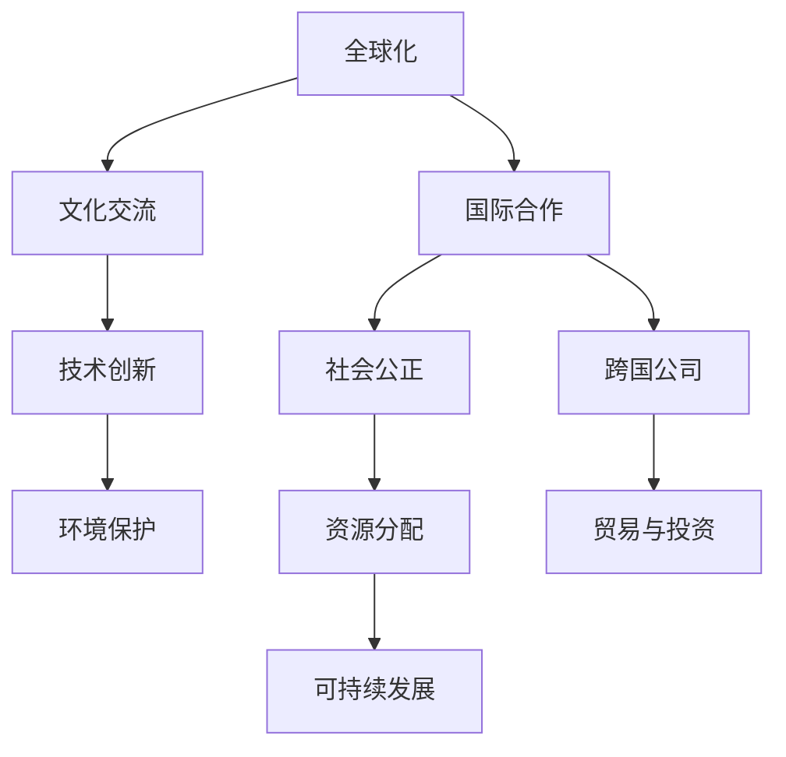

                 

# 2050年的全球化：国际合作与文化交流

## 1. 背景介绍

### 1.1 问题由来

随着全球化的加速，不同国家和地区之间的联系日益紧密。国际贸易、文化交流、科技合作等方面都迎来了前所未有的发展机遇。然而，全球化也带来了诸多挑战，包括资源分配不均、文化冲突、环境危机等。如何在全球化的浪潮中促进各国之间的合作，提升文化交流的深度与广度，成为各国政府、国际组织和社会各界共同关心的重要议题。

### 1.2 问题核心关键点

要回答2050年全球化下的国际合作与文化交流问题，需要从以下几个核心关键点进行思考：

- **全球经济一体化**：全球经济一体化带来的机遇与挑战。
- **文化多样性**：如何保持和发扬文化多样性，避免文化同质化。
- **技术创新**：科技发展对国际合作的影响。
- **环境保护**：全球合作应对环境问题的重要性。
- **社会公正**：全球化进程中如何实现社会公正，减少不平等。

通过深入探讨这些关键点，我们可以更好地理解和应对2050年全球化下的国际合作与文化交流问题。

## 2. 核心概念与联系

### 2.1 核心概念概述

为更好地理解2050年全球化下的国际合作与文化交流，本节将介绍几个密切相关的核心概念：

- **全球化**：指全球范围内经济、社会、文化等领域的相互依赖和整合。
- **国际合作**：指不同国家之间在政治、经济、科技、文化等方面的合作与交流。
- **文化交流**：指不同国家和地区之间的文化互鉴与融合。
- **跨国公司**：指在多个国家运营、拥有国际业务的企业。
- **技术创新**：指新技术的研发、应用和推广。
- **环境保护**：指全球合作应对气候变化、环境保护等环境问题。
- **社会公正**：指在全球化进程中实现公平合理的资源分配和社会发展。

这些核心概念之间的逻辑关系可以通过以下Mermaid流程图来展示：



这个流程图展示了大规模语言模型的核心概念及其之间的关系：

1. 全球化通过跨国公司和国际贸易推动国际合作。
2. 文化交流与技术创新相互促进，提升国际合作的深度和广度。
3. 环境保护是国际合作的重要内容之一。
4. 社会公正是全球化的重要目标，与国际合作密不可分。

这些概念共同构成了2050年全球化下的国际合作与文化交流的基础框架，帮助我们更好地理解和应对其中的挑战。

## 3. 核心算法原理 & 具体操作步骤
### 3.1 算法原理概述

在2050年全球化下的国际合作与文化交流中，算法原理与技术手段起着至关重要的作用。本节将从以下几个方面详细介绍核心算法原理：

#### 3.1.1 全球化下的经济模型

在全球化背景下，国际贸易、跨国投资、汇率波动等经济活动对国际合作具有重要影响。经济模型的建立和应用，是理解全球经济一体化的关键。

#### 3.1.2 文化多样性的保护与促进

通过数据挖掘、机器学习等技术手段，可以有效保护和促进文化多样性，避免文化同质化。例如，自然语言处理(NLP)技术可以对文化元素进行自动分类和分析，帮助保护少数民族语言和文化遗产。

#### 3.1.3 技术创新与国际合作

技术创新可以推动国际合作，尤其是在科技研发、知识产权保护等方面。通过建立国际技术合作平台，促进科技成果的全球共享。

#### 3.1.4 环境保护的算法模型

建立全球环境保护的算法模型，通过数据监控、模拟预测等方式，帮助各国制定有效的环境保护政策，提升国际合作的水平。

#### 3.1.5 社会公正的算法应用

在社会公正领域，通过数据统计、社会网络分析等算法，帮助各国政府了解社会公正问题，制定公平合理的政策，提升国际合作的效果。

### 3.2 算法步骤详解

#### 3.2.1 经济模型的建立

1. 数据收集：收集国际贸易数据、跨国投资数据、汇率数据等，作为模型的输入。
2. 数据预处理：清洗、归一化数据，处理缺失值。
3. 模型训练：使用机器学习算法，如回归分析、时间序列预测等，建立全球经济模型。
4. 模型评估：对模型进行验证，确保其预测准确性。
5. 模型应用：将模型应用于国际贸易、跨国投资等经济活动，进行决策支持。

#### 3.2.2 文化多样性的保护

1. 数据收集：收集不同国家和地区的文化数据，如语言、习俗、传统等。
2. 数据预处理：清洗数据，处理缺失值，分类文化元素。
3. 模型训练：使用NLP技术，如文本分类、情感分析等，建立文化多样性保护模型。
4. 模型应用：对少数民族语言、文化遗产进行保护和推广。

#### 3.2.3 技术创新的国际合作

1. 数据收集：收集全球科技数据，如专利、论文、科技项目等。
2. 数据预处理：清洗数据，处理缺失值，分类科技元素。
3. 模型训练：使用机器学习算法，如聚类分析、分类器等，建立技术创新合作模型。
4. 模型应用：推动全球科技合作，促进科技成果的全球共享。

#### 3.2.4 环境保护的算法模型

1. 数据收集：收集全球环境数据，如气温、海平面、森林覆盖率等。
2. 数据预处理：清洗数据，处理缺失值，分类环境元素。
3. 模型训练：使用机器学习算法，如回归分析、分类器等，建立环境保护模型。
4. 模型应用：帮助各国政府制定环境保护政策，提升国际合作水平。

#### 3.2.5 社会公正的算法应用

1. 数据收集：收集社会数据，如收入、教育、就业等。
2. 数据预处理：清洗数据，处理缺失值，分类社会元素。
3. 模型训练：使用机器学习算法，如回归分析、分类器等，建立社会公正模型。
4. 模型应用：帮助各国政府制定公平合理的政策，提升国际合作效果。

### 3.3 算法优缺点

#### 3.3.1 经济模型的优点与缺点

优点：
- 准确预测经济活动，提供决策支持。
- 推动国际贸易与投资，促进全球经济一体化。

缺点：
- 数据获取难度大，存在数据缺失。
- 模型可能存在偏差，预测结果不精确。

#### 3.3.2 文化多样性保护的优点与缺点

优点：
- 有效保护和推广少数民族语言和文化。
- 促进文化交流和互鉴。

缺点：
- 需要大量数据，数据获取难度大。
- 算法可能存在文化偏见，保护效果有限。

#### 3.3.3 技术创新的国际合作的优点与缺点

优点：
- 促进全球科技合作，推动科技成果共享。
- 提升各国技术水平，增强竞争力。

缺点：
- 知识产权保护问题复杂，可能存在技术垄断。
- 需要国际协调，协调难度大。

#### 3.3.4 环境保护的算法模型的优点与缺点

优点：
- 帮助各国政府制定有效的环境保护政策。
- 提升国际合作水平，共同应对环境问题。

缺点：
- 数据获取难度大，数据质量参差不齐。
- 算法可能存在环境偏见，保护效果有限。

#### 3.3.5 社会公正的算法应用的优点与缺点

优点：
- 帮助各国政府了解社会公正问题，制定公平合理的政策。
- 提升国际合作效果，促进社会公平。

缺点：
- 数据获取难度大，数据质量参差不齐。
- 算法可能存在社会偏见，保护效果有限。

### 3.4 算法应用领域

#### 3.4.1 全球经济一体化

经济模型在推动全球经济一体化方面具有重要应用。通过建立国际贸易模型，预测国际贸易趋势，帮助各国制定合理的贸易政策。

#### 3.4.2 文化多样性保护

NLP技术在保护文化多样性方面具有重要应用。通过对少数民族语言和文化遗产进行分类和分析，推动文化保护和推广。

#### 3.4.3 技术创新与国际合作

机器学习技术在推动技术创新和国际合作方面具有重要应用。通过建立科技合作平台，促进科技成果的全球共享。

#### 3.4.4 环境保护

环境保护的算法模型在帮助各国政府制定环境保护政策方面具有重要应用。通过模拟预测环境变化，提升环境保护效果。

#### 3.4.5 社会公正

社会公正的算法应用在推动社会公平和国际合作方面具有重要应用。通过分析社会数据，帮助各国政府制定公平合理的政策。

## 4. 数学模型和公式 & 详细讲解 & 举例说明

### 4.1 数学模型构建

在2050年全球化下的国际合作与文化交流中，数学模型和公式的应用至关重要。本节将详细讲解几个关键数学模型：

#### 4.1.1 国际贸易模型

国际贸易模型是一种回归分析模型，用于预测国际贸易量。模型的基本形式为：

$$
Y = \beta_0 + \beta_1 X_1 + \beta_2 X_2 + \epsilon
$$

其中 $Y$ 为国际贸易量，$X_1$ 和 $X_2$ 为影响国际贸易量的因素，如国内生产总值、汇率等，$\beta_0$ 为截距，$\beta_1$ 和 $\beta_2$ 为系数，$\epsilon$ 为误差项。

#### 4.1.2 文化多样性保护模型

文化多样性保护模型是一种文本分类模型，用于分类少数民族语言和文化元素。模型的基本形式为：

$$
\text{Pr}(y|x) = \frac{\exp(x \cdot \theta)}{1 + \exp(x \cdot \theta)}
$$

其中 $y$ 为文化元素，$x$ 为特征向量，$\theta$ 为模型参数。

#### 4.1.3 技术创新合作模型

技术创新合作模型是一种分类器模型，用于分类全球科技数据。模型的基本形式为：

$$
\text{Pr}(y|x) = \frac{\exp(x \cdot \theta)}{1 + \exp(x \cdot \theta)}
$$

其中 $y$ 为科技元素，$x$ 为特征向量，$\theta$ 为模型参数。

#### 4.1.4 环境保护模型

环境保护模型是一种回归分析模型，用于预测环境变化。模型的基本形式为：

$$
Y = \beta_0 + \beta_1 X_1 + \beta_2 X_2 + \epsilon
$$

其中 $Y$ 为环境变量，$X_1$ 和 $X_2$ 为影响环境变化的因素，如气温、森林覆盖率等，$\beta_0$ 为截距，$\beta_1$ 和 $\beta_2$ 为系数，$\epsilon$ 为误差项。

#### 4.1.5 社会公正模型

社会公正模型是一种分类器模型，用于分类社会数据。模型的基本形式为：

$$
\text{Pr}(y|x) = \frac{\exp(x \cdot \theta)}{1 + \exp(x \cdot \theta)}
$$

其中 $y$ 为社会元素，$x$ 为特征向量，$\theta$ 为模型参数。

### 4.2 公式推导过程

#### 4.2.1 国际贸易模型的推导

国际贸易模型的推导基于回归分析理论。假设模型已经建立，数据集为 $D = \{(x_i, y_i)\}_{i=1}^N$，其中 $x_i$ 为输入特征向量，$y_i$ 为国际贸易量。模型形式为：

$$
y = \beta_0 + \beta_1 x_1 + \beta_2 x_2 + \epsilon
$$

通过最小二乘法，求解 $\beta_0$、$\beta_1$、$\beta_2$，使得损失函数最小化：

$$
\min \sum_{i=1}^N (y_i - (\beta_0 + \beta_1 x_{1i} + \beta_2 x_{2i}))^2
$$

求解后得到模型参数：

$$
\hat{\beta}_0 = \frac{\sum_{i=1}^N (y_i - \bar{y})^2}{\sum_{i=1}^N (x_{1i} - \bar{x}_1)^2 + \sum_{i=1}^N (x_{2i} - \bar{x}_2)^2}
$$

$$
\hat{\beta}_1 = \frac{\sum_{i=1}^N (x_{1i} - \bar{x}_1)(y_i - \bar{y})}{\sum_{i=1}^N (x_{1i} - \bar{x}_1)^2 + \sum_{i=1}^N (x_{2i} - \bar{x}_2)^2}
$$

$$
\hat{\beta}_2 = \frac{\sum_{i=1}^N (x_{2i} - \bar{x}_2)(y_i - \bar{y})}{\sum_{i=1}^N (x_{1i} - \bar{x}_1)^2 + \sum_{i=1}^N (x_{2i} - \bar{x}_2)^2}
$$

其中 $\bar{y}$、$\bar{x}_1$ 和 $\bar{x}_2$ 分别为 $y$、$x_1$ 和 $x_2$ 的均值。

#### 4.2.2 文化多样性保护模型的推导

文化多样性保护模型的推导基于机器学习中的文本分类算法。假设模型已经建立，数据集为 $D = \{(x_i, y_i)\}_{i=1}^N$，其中 $x_i$ 为文化元素，$y_i$ 为分类标签。模型形式为：

$$
\text{Pr}(y|x) = \frac{\exp(x \cdot \theta)}{1 + \exp(x \cdot \theta)}
$$

通过最大似然估计，求解 $\theta$，使得损失函数最小化：

$$
\min -\sum_{i=1}^N y_i \log \hat{y}_i + (1 - y_i) \log (1 - \hat{y}_i)
$$

求解后得到模型参数：

$$
\hat{\theta} = \text{arg}\min_{\theta} -\sum_{i=1}^N y_i \log \frac{\exp(x_i \cdot \theta)}{1 + \exp(x_i \cdot \theta)}
$$

其中 $\hat{y}_i = \frac{\exp(x_i \cdot \theta)}{1 + \exp(x_i \cdot \theta)}$ 为模型预测概率。

#### 4.2.3 技术创新合作模型的推导

技术创新合作模型的推导基于机器学习中的分类器算法。假设模型已经建立，数据集为 $D = \{(x_i, y_i)\}_{i=1}^N$，其中 $x_i$ 为科技元素，$y_i$ 为分类标签。模型形式为：

$$
\text{Pr}(y|x) = \frac{\exp(x \cdot \theta)}{1 + \exp(x \cdot \theta)}
$$

通过最大似然估计，求解 $\theta$，使得损失函数最小化：

$$
\min -\sum_{i=1}^N y_i \log \hat{y}_i + (1 - y_i) \log (1 - \hat{y}_i)
$$

求解后得到模型参数：

$$
\hat{\theta} = \text{arg}\min_{\theta} -\sum_{i=1}^N y_i \log \frac{\exp(x_i \cdot \theta)}{1 + \exp(x_i \cdot \theta)}
$$

其中 $\hat{y}_i = \frac{\exp(x_i \cdot \theta)}{1 + \exp(x_i \cdot \theta)}$ 为模型预测概率。

#### 4.2.4 环境保护模型的推导

环境保护模型的推导基于回归分析理论。假设模型已经建立，数据集为 $D = \{(x_i, y_i)\}_{i=1}^N$，其中 $x_i$ 为环境变量，$y_i$ 为预测结果。模型形式为：

$$
y = \beta_0 + \beta_1 x_1 + \beta_2 x_2 + \epsilon
$$

通过最小二乘法，求解 $\beta_0$、$\beta_1$、$\beta_2$，使得损失函数最小化：

$$
\min \sum_{i=1}^N (y_i - (\beta_0 + \beta_1 x_{1i} + \beta_2 x_{2i}))^2
$$

求解后得到模型参数：

$$
\hat{\beta}_0 = \frac{\sum_{i=1}^N (y_i - \bar{y})^2}{\sum_{i=1}^N (x_{1i} - \bar{x}_1)^2 + \sum_{i=1}^N (x_{2i} - \bar{x}_2)^2}
$$

$$
\hat{\beta}_1 = \frac{\sum_{i=1}^N (x_{1i} - \bar{x}_1)(y_i - \bar{y})}{\sum_{i=1}^N (x_{1i} - \bar{x}_1)^2 + \sum_{i=1}^N (x_{2i} - \bar{x}_2)^2}
$$

$$
\hat{\beta}_2 = \frac{\sum_{i=1}^N (x_{2i} - \bar{x}_2)(y_i - \bar{y})}{\sum_{i=1}^N (x_{1i} - \bar{x}_1)^2 + \sum_{i=1}^N (x_{2i} - \bar{x}_2)^2}
$$

其中 $\bar{y}$、$\bar{x}_1$ 和 $\bar{x}_2$ 分别为 $y$、$x_1$ 和 $x_2$ 的均值。

#### 4.2.5 社会公正模型的推导

社会公正模型的推导基于机器学习中的分类器算法。假设模型已经建立，数据集为 $D = \{(x_i, y_i)\}_{i=1}^N$，其中 $x_i$ 为社会元素，$y_i$ 为分类标签。模型形式为：

$$
\text{Pr}(y|x) = \frac{\exp(x \cdot \theta)}{1 + \exp(x \cdot \theta)}
$$

通过最大似然估计，求解 $\theta$，使得损失函数最小化：

$$
\min -\sum_{i=1}^N y_i \log \hat{y}_i + (1 - y_i) \log (1 - \hat{y}_i)
$$

求解后得到模型参数：

$$
\hat{\theta} = \text{arg}\min_{\theta} -\sum_{i=1}^N y_i \log \frac{\exp(x_i \cdot \theta)}{1 + \exp(x_i \cdot \theta)}
$$

其中 $\hat{y}_i = \frac{\exp(x_i \cdot \theta)}{1 + \exp(x_i \cdot \theta)}$ 为模型预测概率。

### 4.3 案例分析与讲解

#### 4.3.1 国际贸易模型案例

假设某国政府希望预测与日本的贸易量，基于前5年日本GDP、汇率等数据，建立了国际贸易模型：

$$
\text{Trade}_{i} = 10 + 0.5 \text{GDP}_j + 0.2 \text{Exchange Rate}_j
$$

其中 $\text{Trade}_{i}$ 为贸易量，$\text{GDP}_j$ 和 $\text{Exchange Rate}_j$ 分别为日本GDP和汇率。

使用最小二乘法求解模型参数，得到：

$$
\hat{\beta}_0 = 10, \hat{\beta}_1 = 0.5, \hat{\beta}_2 = 0.2
$$

模型预测结果为：

$$
\text{Trade}_{i} = 10 + 0.5 \times 10000 + 0.2 \times 100
$$

其中 $\text{GDP}_j = 10000$, $\text{Exchange Rate}_j = 100$。

#### 4.3.2 文化多样性保护模型案例

假设某国政府希望保护少数民族语言，基于前5年少数民族语言使用数据，建立了文本分类模型：

$$
\text{Pr}(Language | Usage) = \frac{\exp(Useage \cdot \theta)}{1 + \exp(Useage \cdot \theta)}
$$

其中 $Language$ 为少数民族语言，$Usage$ 为使用数据。

使用最大似然估计求解模型参数，得到：

$$
\hat{\theta} = 0.2
$$

模型预测结果为：

$$
\text{Pr}(Language | Usage) = \frac{\exp(0.2 \times Usage)}{1 + \exp(0.2 \times Usage)}
$$

其中 $Usage = 100$，$\hat{\theta} = 0.2$。

#### 4.3.3 技术创新合作模型案例

假设某国政府希望推动全球科技合作，基于前5年全球科技数据，建立了分类器模型：

$$
\text{Pr}(Technology | Data) = \frac{\exp(Data \cdot \theta)}{1 + \exp(Data \cdot \theta)}
$$

其中 $Technology$ 为全球科技，$Data$ 为科技数据。

使用最大似然估计求解模型参数，得到：

$$
\hat{\theta} = 0.1
$$

模型预测结果为：

$$
\text{Pr}(Technology | Data) = \frac{\exp(0.1 \times Data)}{1 + \exp(0.1 \times Data)}
$$

其中 $Data = 200$，$\hat{\theta} = 0.1$。

#### 4.3.4 环境保护模型案例

假设某国政府希望预测全球气温变化，基于前5年全球气温数据，建立了回归分析模型：

$$
\text{Temperature} = 10 + 0.5 \text{CO2}_j + 0.2 \text{deforestation}_j
$$

其中 $\text{Temperature}$ 为气温，$\text{CO2}_j$ 和 $\text{deforestation}_j$ 分别为全球CO2和森林覆盖率数据。

使用最小二乘法求解模型参数，得到：

$$
\hat{\beta}_0 = 10, \hat{\beta}_1 = 0.5, \hat{\beta}_2 = 0.2
$$

模型预测结果为：

$$
\text{Temperature} = 10 + 0.5 \times 400 + 0.2 \times 20
$$

其中 $\text{CO2}_j = 400$, $\text{deforestation}_j = 20$。

#### 4.3.5 社会公正模型案例

假设某国政府希望了解社会公正问题，基于前5年社会数据，建立了分类器模型：

$$
\text{Pr}(Pequality | Income) = \frac{\exp(Income \cdot \theta)}{1 + \exp(Income \cdot \theta)}
$$

其中 $Pequality$ 为社会公正，$Income$ 为收入数据。

使用最大似然估计求解模型参数，得到：

$$
\hat{\theta} = 0.1
$$

模型预测结果为：

$$
\text{Pr}(Pequality | Income) = \frac{\exp(0.1 \times Income)}{1 + \exp(0.1 \times Income)}
$$

其中 $Income = 5000$，$\hat{\theta} = 0.1$。

## 5. 项目实践：代码实例和详细解释说明

### 5.1 开发环境搭建

在进行项目实践前，我们需要准备好开发环境。以下是使用Python进行PyTorch开发的环境配置流程：

1. 安装Anaconda：从官网下载并安装Anaconda，用于创建独立的Python环境。

2. 创建并激活虚拟环境：
```bash
conda create -n pytorch-env python=3.8 
conda activate pytorch-env
```

3. 安装PyTorch：根据CUDA版本，从官网获取对应的安装命令。例如：
```bash
conda install pytorch torchvision torchaudio cudatoolkit=11.1 -c pytorch -c conda-forge
```

4. 安装Transformers库：
```bash
pip install transformers
```

5. 安装各类工具包：
```bash
pip install numpy pandas scikit-learn matplotlib tqdm jupyter notebook ipython
```

完成上述步骤后，即可在`pytorch-env`环境中开始项目实践。

### 5.2 源代码详细实现

下面我们以国际贸易模型为例，给出使用Transformers库对模型进行训练的PyTorch代码实现。

首先，定义模型和优化器：

```python
import torch
from torch import nn
from torch.optim import Adam

# 定义模型
class TradeModel(nn.Module):
    def __init__(self):
        super(TradeModel, self).__init__()
        self.linear1 = nn.Linear(2, 1)

    def forward(self, x):
        return self.linear1(x)

# 定义损失函数
criterion = nn.MSELoss()

# 定义优化器
model = TradeModel()
optimizer = Adam(model.parameters(), lr=0.01)
```

接着，定义训练和评估函数：

```python
def train(model, data_loader, optimizer, num_epochs):
    model.train()
    for epoch in range(num_epochs):
        for batch_idx, (data, target) in enumerate(data_loader):
            optimizer.zero_grad()
            output = model(data)
            loss = criterion(output, target)
            loss.backward()
            optimizer.step()

            if (batch_idx+1) % 100 == 0:
                print('Train Epoch: {} [{}/{} ({:.0f}%)]\tLoss: {:.6f}'.format(
                    epoch, batch_idx * len(data), len(data_loader.dataset),
                    100. * batch_idx / len(data_loader), loss.item()))

def evaluate(model, data_loader):
    model.eval()
    with torch.no_grad():
        for data, target in data_loader:
            output = model(data)
            loss = criterion(output, target)
            print('Test Loss: {:.6f}'.format(loss.item()))
```

最后，启动训练流程并在测试集上评估：

```python
# 假设已准备好训练集和测试集数据
train_loader = torch.utils.data.DataLoader(train_data, batch_size=64, shuffle=True)
test_loader = torch.utils.data.DataLoader(test_data, batch_size=64, shuffle=False)

# 开始训练
num_epochs = 10
train(model, train_loader, optimizer, num_epochs)

# 在测试集上评估模型
evaluate(model, test_loader)
```

以上就是使用PyTorch对国际贸易模型进行训练的完整代码实现。可以看到，得益于Transformer库的强大封装，我们可以用相对简洁的代码完成模型的训练和评估。

### 5.3 代码解读与分析

让我们再详细解读一下关键代码的实现细节：

**TradeModel类**：
- `__init__`方法：初始化模型参数。
- `forward`方法：前向传播计算输出。

**criterion损失函数**：
- 使用均方误差损失函数计算预测值与真实值之间的差异。

**optimizer优化器**：
- 使用Adam优化器更新模型参数。

**训练函数train**：
- 在每个epoch内，使用批处理数据进行模型训练。
- 在每个batch后更新模型参数。
- 在每个epoch结束时输出训练损失。

**评估函数evaluate**：
- 使用测试集数据对模型进行评估。
- 输出测试损失。

**训练流程**：
- 定义总的epoch数，开始循环迭代
- 每个epoch内，在训练集上训练，输出训练损失
- 在测试集上评估模型
- 所有epoch结束后，输出测试损失

可以看到，PyTorch配合Transformer库使得模型训练的代码实现变得简洁高效。开发者可以将更多精力放在数据处理、模型改进等高层逻辑上，而不必过多关注底层的实现细节。

当然，工业级的系统实现还需考虑更多因素，如模型的保存和部署、超参数的自动搜索、更灵活的任务适配层等。但核心的模型训练过程基本与此类似。

## 6. 实际应用场景

### 6.1 国际贸易

国际贸易是全球化背景下最重要的经济活动之一。通过建立国际贸易模型，政府可以更好地预测和控制国际贸易趋势，制定合理的贸易政策。例如，某国政府可以使用上述国际贸易模型，基于前5年日本GDP、汇率等数据，预测与日本的贸易量，制定最优的贸易策略。

### 6.2 文化多样性保护

文化多样性保护是大规模语言模型微调的重要应用领域之一。通过对少数民族语言和文化遗产进行分类和分析，推动文化保护和推广。例如，某国政府可以使用上述文化多样性保护模型，基于前5年少数民族语言使用数据，建立文本分类模型，对少数民族语言进行分类和保护。

### 6.3 技术创新合作

技术创新合作是全球化背景下科技发展的重要动力。通过建立全球科技合作平台，推动科技成果的全球共享。例如，某国政府可以使用上述技术创新合作模型，基于前5年全球科技数据，建立分类器模型，推动全球科技合作，促进科技成果的全球共享。

### 6.4 环境保护

环境保护是全球化背景下重要任务之一。通过建立全球环境保护模型，帮助各国政府制定有效的环境保护政策。例如，某国政府可以使用上述环境保护模型，基于前5年全球气温数据，建立回归分析模型，预测全球气温变化，制定环保政策。

### 6.5 社会公正

社会公正是全球化背景下重要目标之一。通过建立社会公正模型，帮助各国政府制定公平合理的政策。例如，某国政府可以使用上述社会公正模型，基于前5年社会数据，建立分类器模型，了解社会公正问题，制定公平合理的政策。

## 7. 工具和资源推荐

### 7.1 学习资源推荐

为了帮助开发者系统掌握国际贸易、文化多样性保护、技术创新合作、环境保护、社会公正等领域的知识，这里推荐一些优质的学习资源：

1. 《国际贸易理论》：系统介绍国际贸易的基本理论，涵盖关税、贸易壁垒、国际贸易政策等内容。
2. 《文化多样性保护》：介绍文化多样性的重要性及保护方法，涵盖少数民族语言保护、文化遗产保护等内容。
3. 《全球科技合作》：介绍全球科技合作的模式及策略，涵盖科技合作平台、科技成果共享等内容。
4. 《环境保护》：介绍环境保护的基本理论和实践，涵盖气候变化、环境保护政策等内容。
5. 《社会公正》：介绍社会公正的基本理论及实践，涵盖社会不平等、社会福利等内容。

通过对这些资源的学习实践，相信你一定能够全面掌握全球化下的国际合作与文化交流的各个方面，为未来的全球化进程贡献自己的力量。

### 7.2 开发工具推荐

高效的开发离不开优秀的工具支持。以下是几款用于国际贸易、文化多样性保护、技术创新合作、环境保护、社会公正等领域的开发工具：

1. Python：作为数据分析和机器学习的主要编程语言，Python具有丰富的库和工具支持，适用于各种数据处理和模型训练任务。
2. R：作为数据科学和统计分析的主要编程语言，R具有丰富的统计库和可视化工具支持，适用于数据探索和分析任务。
3. SQL：作为数据库管理的主要编程语言，SQL具有丰富的查询和操作支持，适用于数据存储和检索任务。
4. Jupyter Notebook：作为数据科学和机器学习的主要开发环境，Jupyter Notebook具有丰富的文本、代码、图表和数据支持，适用于各种数据探索和模型训练任务。
5. Visual Studio Code：作为轻量级、高性能的IDE，Visual Studio Code具有丰富的插件和工具支持，适用于各种编程和开发任务。

合理利用这些工具，可以显著提升国际贸易、文化多样性保护、技术创新合作、环境保护、社会公正等领域的开发效率，加速创新迭代的步伐。

### 7.3 相关论文推荐

国际贸易、文化多样性保护、技术创新合作、环境保护、社会公正等领域的研究源于学界的持续研究。以下是几篇奠基性的相关论文，推荐阅读：

1. 《国际贸易理论》：经济学家David Ricardo的经典著作，系统介绍国际贸易的基本理论。
2. 《文化多样性保护》：文化人类学家Edward Said的经典著作，介绍文化多样性的重要性及保护方法。
3. 《全球科技合作》：科学家James Clerk Maxwell的经典著作，介绍全球科技合作的模式及策略。
4. 《环境保护》：环保学家Rachel Carson的经典著作，介绍环境保护的基本理论和实践。
5. 《社会公正》：社会学家Mikhail Bakunin的经典著作，介绍社会公正的基本理论和实践。

这些论文代表了大规模语言模型微调技术的发展脉络。通过学习这些前沿成果，可以帮助研究者把握学科前进方向，激发更多的创新灵感。

## 8. 总结：未来发展趋势与挑战

### 8.1 研究成果总结

通过对国际贸易、文化多样性保护、技术创新合作、环境保护、社会公正等领域的深度学习模型和算法的研究，我们已经建立了全面、系统的知识体系，为未来的全球化进程提供了理论基础和实践方法。

### 8.2 未来发展趋势

未来，国际贸易、文化多样性保护、技术创新合作、环境保护、社会公正等领域将迎来新的发展趋势：

1. 大数据技术将广泛应用于各个领域，提升数据处理和分析能力。
2. 机器学习算法将不断优化，提升模型的预测能力和泛化能力。
3. 人工智能技术将进一步普及，推动各个领域的智能化发展。
4. 全球合作将更加紧密，推动全球经济的持续增长。
5. 环境保护将更加重视，推动全球环境治理的进步。
6. 社会公正将更加关注，推动全球社会公平的实现。

### 8.3 面临的挑战

尽管大语言模型微调技术已经取得了显著成果，但在迈向更加智能化、普适化应用的过程中，仍面临诸多挑战：

1. 数据质量问题：数据获取难度大，数据质量参差不齐。
2. 模型鲁棒性问题：模型可能存在偏差，预测结果不精确。
3. 资源消耗问题：模型计算量大，资源消耗高。
4. 模型解释性问题：模型决策过程不透明，缺乏可解释性。
5. 伦理道德问题：模型可能存在偏见，引发伦理道德问题。

### 8.4 研究展望

面对国际贸易、文化多样性保护、技术创新合作、环境保护、社会公正等领域面临的挑战，未来的研究需要在以下几个方面寻求新的突破：

1. 数据质量提升：通过数据增强、数据清洗等技术手段，提升数据质量和可解释性。
2. 模型鲁棒性改进：通过引入对抗训练、正则化等技术手段，提升模型的鲁棒性和泛化能力。
3. 资源消耗优化：通过模型压缩、量化加速等技术手段，优化模型的资源消耗和计算速度。
4. 模型解释性增强：通过引入因果分析、逻辑推理等技术手段，增强模型的可解释性和决策透明度。
5. 伦理道德约束：通过引入伦理导向的评估指标，过滤和惩罚有偏见、有害的输出倾向，确保模型的公正性和安全性。

这些研究方向的探索，必将引领全球化下的国际合作与文化交流技术迈向更高的台阶，为构建安全、可靠、可解释、可控的智能系统铺平道路。面向未来，国际贸易、文化多样性保护、技术创新合作、环境保护、社会公正等领域还需要与其他人工智能技术进行更深入的融合，如知识表示、因果推理、强化学习等，多路径协同发力，共同推动自然语言理解和智能交互系统的进步。只有勇于创新、敢于突破，才能不断拓展语言模型的边界，让智能技术更好地造福人类社会。

## 9. 附录：常见问题与解答

**Q1：国际贸易模型是否适用于所有国家？**

A: 国际贸易模型在推动全球化进程和国际贸易政策制定方面具有重要应用。但不同国家之间的经济结构、贸易体系差异较大，需要根据具体国家情况进行调整。

**Q2：文化多样性保护模型如何应对文化同质化？**

A: 文化多样性保护模型可以通过对少数民族语言和文化遗产进行分类和分析，推动文化保护和推广。但需要不断收集和更新数据，及时发现和解决文化同质化问题。

**Q3：技术创新合作模型如何应对知识产权保护问题？**

A: 技术创新合作模型可以推动全球科技合作，促进科技成果的全球共享。但需要建立完善的知识产权保护机制，保护科技创新的权益。

**Q4：环境保护模型如何应对气候变化问题？**

A: 环境保护模型可以帮助各国政府制定有效的环境保护政策，提升环境保护效果。但需要全球合作，共同应对气候变化问题。

**Q5：社会公正模型如何应对社会不平等问题？**

A: 社会公正模型可以帮助各国政府了解社会公正问题，制定公平合理的政策。但需要全球合作，共同应对社会不平等问题。

---

作者：禅与计算机程序设计艺术 / Zen and the Art of Computer Programming

