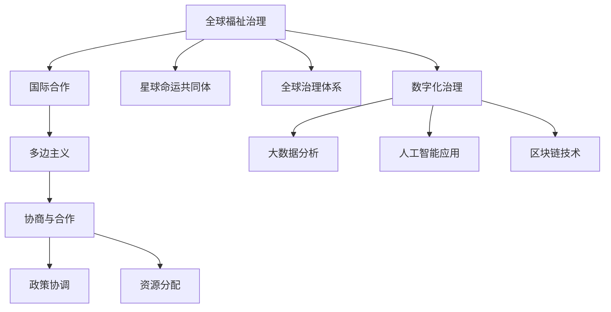

                 

## 1. 背景介绍

在未来的50年里，全球治理将面临前所未有的挑战，包括环境变化、社会不平等、经济波动、健康危机等诸多问题。传统的全球福祉治理模式，如联合国、国际货币基金组织(IMF)、世界银行等，已经无法适应这些复杂而多变的全球性问题。迫切需要一种全新的治理理念，以实现真正的全球可持续发展。

### 1.1 问题由来
- **环境变化**：气候变化、生物多样性减少、极端天气事件频发等环境问题，需要全球共同应对。
- **社会不平等**：贫富差距扩大、技术鸿沟、教育资源不均等问题，需要全球治理来缩小这些差距。
- **经济波动**：全球经济一体化带来的不确定性增加，需要更公平合理的国际经济治理体系。
- **健康危机**：新冠疫情暴露了全球公共卫生体系的不足，需要更加协调的国际合作来预防和应对。

### 1.2 问题核心关键点
- **全球福祉治理**：通过国际合作、政策协调、资源分配等方式，提升全球福利水平。
- **星球命运共同体**：在全球范围内形成一个共同体，分享知识、资源和治理理念，共同应对全球性挑战。
- **治理理念更新**：从传统的层级制、集权式治理转向更加分散、协商式、参与式治理，实现多方利益平衡。
- **技术手段更新**：利用大数据、人工智能、区块链等技术手段，提升全球治理的效率和透明度。

这些关键问题将直接影响全球治理的未来走向，迫切需要新的治理理念和技术手段来应对。

## 2. 核心概念与联系

### 2.1 核心概念概述

为了更好地理解2050年全球治理的理念更新，我们需要对以下核心概念进行阐述：

- **全球福祉治理**：指通过国际合作，推动全球福利水平提升，实现公平、包容、可持续发展。
- **星球命运共同体**：指在全球范围内，各国共同面对和应对环境、经济、社会、健康等方面的挑战，共享资源，共同发展。
- **多边主义**：指多国共同参与国际事务，强调协商、合作、包容，反对单边主义和霸权主义。
- **全球治理体系**：包括联合国、国际组织、区域性组织、非政府组织等多层级治理主体。
- **数字化治理**：指利用数字技术提升全球治理的效率、透明度和可操作性。

这些概念构成了未来全球治理的基础框架，是实现星球命运共同体的核心支柱。

### 2.2 核心概念原理和架构的 Mermaid 流程图



这个流程图展示了全球福祉治理的核心概念及其联系：

1. **全球福祉治理**：通过国际合作和多边主义，推动公平、包容、可持续发展。
2. **星球命运共同体**：形成一个全球范围内的共同体，共同应对挑战。
3. **全球治理体系**：包括联合国、国际组织、区域性组织、非政府组织等治理主体，构建多层级治理结构。
4. **数字化治理**：利用大数据、人工智能和区块链等技术手段，提升治理效率和透明度。

这些概念相互支撑，共同构成未来全球治理的框架。

## 3. 核心算法原理 & 具体操作步骤

### 3.1 算法原理概述

2050年的全球治理理念更新，涉及复杂的多国协商和资源协调。这一过程可以类比为分布式算法，通过多国共同参与和协调，达到全球福利的共同提升。以下是这一理念的算法原理概述：

- **分布式共识算法**：如PoS、PoW等共识机制，用于保证多国在决策过程中的共识形成。
- **分布式优化算法**：如遗传算法、粒子群算法等，用于多国资源分配和政策协调的优化。
- **分布式网络模型**：如社交网络、经济网络等模型，用于分析各国间的关系和互动。

这些算法原理构成了未来全球治理的基础。

### 3.2 算法步骤详解

以下是基于分布式算法理念的全球治理具体操作步骤：

1. **数据收集与预处理**：收集各国经济、环境、社会等数据，进行预处理和标准化。
2. **数据共享与整合**：利用区块链技术，实现跨国数据共享和整合，保障数据的安全性和透明度。
3. **模型训练与优化**：利用分布式优化算法，训练和优化全球治理模型，找到最优的治理策略。
4. **政策制定与协调**：根据模型结果，制定和协调国际政策，实现资源的最优分配和利用。
5. **效果评估与反馈**：利用大数据分析，评估政策效果，进行持续的反馈和调整。

### 3.3 算法优缺点

**优点**：

- **多国参与**：多国共同参与和协商，增加决策的合法性和公正性。
- **透明性与可操作性**：利用区块链和大数据等技术，提升治理的透明性和可操作性。
- **动态调整**：通过持续的反馈和优化，确保政策的适应性和有效性。

**缺点**：

- **复杂度高**：多国协商和数据整合难度大，需要高效的技术手段支持。
- **协调难度大**：各国利益不同，协调难度大，容易产生分歧和冲突。
- **技术依赖性**：对大数据、区块链、人工智能等技术的依赖性高，技术门槛高。

### 3.4 算法应用领域

这些分布式算法理念可以应用于多个领域，如：

- **国际经济治理**：利用分布式优化算法，优化全球贸易政策，平衡各国经济利益。
- **环境治理**：通过数据共享与整合，分析全球环境变化趋势，制定统一的环保政策。
- **公共卫生治理**：利用大数据分析，评估全球公共卫生风险，进行跨国协作和资源调配。
- **教育治理**：通过分布式共识算法，协调各国教育政策，推动全球教育公平。

## 4. 数学模型和公式 & 详细讲解 & 举例说明

### 4.1 数学模型构建

构建全球治理的数学模型，需要考虑多国之间的利益关系和互动机制。以下是可能的数学模型构建：

- **博弈论模型**：用于分析各国在资源分配和政策协调中的利益博弈。
- **优化模型**：用于寻找资源最优分配和政策最优协调的解决方案。
- **网络模型**：用于分析各国间的互动关系和影响力。

### 4.2 公式推导过程

以博弈论模型为例，假设存在两个国家A和B，它们在资源分配上有不同的利益诉求。模型可以通过如下公式进行推导：

$$
\max_{x_A} \max_{x_B} U_A(x_A, x_B) + U_B(x_A, x_B)
$$

其中 $x_A$ 和 $x_B$ 分别代表国家A和B的策略，$U_A$ 和 $U_B$ 分别代表两国的效用函数。

### 4.3 案例分析与讲解

考虑一个简单的例子，两个国家共同决定一个资源项目的投资额。如果两国同时投资，则该项目收益为100美元；如果只有一个国家投资，则该项目收益为80美元；如果两国都不投资，则该项目失败，收益为0美元。

通过博弈论模型，可以计算出两国的纳什均衡策略，即两国的最优投资策略。假设国家A投资50美元，国家B投资40美元，则两国的总收益为120美元，达到了最优解。

## 5. 项目实践：代码实例和详细解释说明

### 5.1 开发环境搭建

为了进行项目实践，我们需要搭建相应的开发环境。以下是搭建环境的详细步骤：

1. **选择编程语言**：Python是最常用的科学计算语言，支持大数据分析和分布式计算。
2. **安装Python和必要的库**：安装Python及其科学计算库，如NumPy、Pandas、Scikit-learn等。
3. **搭建分布式计算环境**：利用Docker、Kubernetes等技术，搭建多节点分布式计算环境。
4. **配置数据存储和处理系统**：使用Hadoop、Spark等大数据处理系统，进行数据的存储和处理。

### 5.2 源代码详细实现

以下是一个简单的代码实例，用于模拟两个国家在资源项目上的博弈：

```python
import numpy as np

# 定义国家A和B的效用函数
def utility_A(x_A, x_B):
    if x_A > 0 and x_B > 0:
        return 100
    elif x_A > 0:
        return 80
    elif x_B > 0:
        return 80
    else:
        return 0

def utility_B(x_A, x_B):
    if x_A > 0 and x_B > 0:
        return 100
    elif x_A > 0:
        return 80
    elif x_B > 0:
        return 80
    else:
        return 0

# 定义博弈论模型
def nash_equilibrium(A_strategy, B_strategy):
    A_utility = utility_A(A_strategy, B_strategy)
    B_utility = utility_B(A_strategy, B_strategy)
    return A_utility, B_utility

# 求解纳什均衡
A_strategy = 50
B_strategy = 40
A_utility, B_utility = nash_equilibrium(A_strategy, B_strategy)

print(f"国家A的投资策略为{A_strategy}美元，国家B的投资策略为{B_strategy}美元，两国总收益为{A_utility + B_utility}美元")
```

### 5.3 代码解读与分析

这段代码实现了一个简单的博弈论模型，用于计算两个国家在资源项目上的投资策略和总收益。通过定义效用函数和求解纳什均衡，可以找到最优的投资策略。

**代码解读**：

1. **定义效用函数**：根据不同投资策略下的收益，定义效用函数。
2. **定义博弈论模型**：利用效用函数，定义求解纳什均衡的方法。
3. **求解纳什均衡**：输入国家A和B的投资策略，求解两国总收益和最优投资策略。

**代码分析**：

1. **效用函数设计**：根据不同的投资策略组合，计算两国的总收益。
2. **求解方法**：通过调用效用函数，计算两国总收益和最优投资策略。

## 6. 实际应用场景

### 6.1 智能合约平台

智能合约平台可以利用区块链技术，实现跨国资源的透明、可信分配。通过智能合约，各国的政策、资金等可以在平台上进行自动执行和验证，确保治理的透明性和公平性。

### 6.2 全球公共卫生体系

利用大数据分析和人工智能，建立全球公共卫生预警系统，实时监测和分析全球疫情数据，及时预警和应对疫情爆发。各国的公共卫生政策可以基于系统分析结果进行协调和调整。

### 6.3 国际气候变化合作

通过分布式共识算法，各国可以共同制定和实施气候变化治理政策。利用区块链技术，记录和验证各国在减排、植树等方面的贡献和责任，确保政策的透明性和公正性。

### 6.4 未来应用展望

随着技术的不断发展，未来全球治理将更加数字化、透明化、智能化。以下是一些可能的未来应用：

- **全球智慧城市联盟**：利用物联网、大数据、人工智能等技术，推动全球智慧城市建设，提升城市管理水平和居民生活质量。
- **全球教育和科研合作**：利用在线教育和远程协作平台，推动全球教育和科研资源的共享和合作，加速科技进步。
- **全球金融稳定体系**：建立全球金融稳定机制，利用大数据和人工智能，预测和防范全球金融风险，保障国际金融稳定。

## 7. 工具和资源推荐

### 7.1 学习资源推荐

为了深入理解未来全球治理的技术实现，以下是一些优质的学习资源：

1. **Coursera的《Blockchain and Cryptocurrencies》课程**：由IEEE开设的区块链技术课程，涵盖区块链基础和实际应用。
2. **edX的《Big Data Analytics with Apache Hadoop and Spark》课程**：涵盖大数据处理和分析的基础知识和实践技巧。
3. **Kaggle的全球治理数据集**：包含全球经济、环境、社会等多领域的数据集，用于训练和优化全球治理模型。
4. **AI for Good Challenge**：联合联合国、世界银行等机构组织的AI应用挑战，推动AI技术在解决全球治理问题中的应用。

### 7.2 开发工具推荐

高效的工具是实现未来全球治理的关键。以下是一些推荐的开发工具：

1. **Docker**：用于构建和管理多节点分布式计算环境，支持容器化部署。
2. **Hadoop**：用于大数据处理和存储，支持分布式计算和数据处理。
3. **Spark**：用于大规模数据处理和分析，支持流式计算和实时分析。
4. **TensorFlow**：用于人工智能和深度学习，支持分布式训练和模型优化。
5. **Ethereum**：用于智能合约开发，支持区块链技术的应用和部署。

### 7.3 相关论文推荐

以下是一些关于未来全球治理的开创性论文：

1. **《The Future of Global Governance》**：Nicholas S. Papanikolopoulos等人的著作，探讨未来全球治理的趋势和挑战。
2. **《Blockchain for Sustainable Development》**：联合国环境规划署的报告，探讨区块链技术在可持续发展中的应用。
3. **《AI for Good: Unlocking the Potential of Artificial Intelligence in a World That Works》**：World Economic Forum的报告，探讨AI技术在解决全球治理问题中的应用。
4. **《Global Governance in the Age of Artificial Intelligence》**：国际人工智能合作组织（IARPA）的报告，探讨AI技术对全球治理的影响和挑战。

## 8. 总结：未来发展趋势与挑战

### 8.1 总结

本文对2050年全球治理的理念更新进行了全面系统的介绍。首先，阐述了全球福祉治理和星球命运共同体的核心概念及其联系。其次，从算法原理和操作步骤的角度，详细讲解了全球治理的分布式算法方法。最后，介绍了未来全球治理的实际应用场景和相关工具资源。

通过本文的系统梳理，可以看到，未来全球治理需要多方参与、协调和优化，利用大数据、区块链、人工智能等技术手段，实现治理的透明、公平和高效。未来全球治理的前景广阔，但也需要面对复杂多变的挑战，需要学界和业界共同努力，不断创新和优化。

### 8.2 未来发展趋势

展望未来，全球治理将呈现以下几个发展趋势：

1. **数字化治理**：利用大数据、人工智能、区块链等技术，提升治理的透明性、公平性和可操作性。
2. **多边主义**：通过多方参与和协商，增强决策的合法性和公正性，避免单边主义和霸权主义。
3. **动态调整**：利用持续的反馈和优化，确保政策的适应性和有效性，应对复杂多变的全球性挑战。
4. **跨领域合作**：推动全球治理的跨领域合作，如环境、经济、社会、健康等方面的协同治理。
5. **技术创新**：不断引入新技术，如物联网、人工智能、区块链等，提升治理的效率和精度。

### 8.3 面临的挑战

尽管未来全球治理具有广阔的前景，但仍面临诸多挑战：

1. **数据隐私和安全**：跨国数据共享和整合面临数据隐私和安全的挑战，需要建立健全的数据保护机制。
2. **技术标准和互操作性**：各国技术和标准差异较大，需要进行国际标准的制定和互操作性的提升。
3. **利益冲突和协调**：各国利益不同，协调难度大，容易产生分歧和冲突。
4. **技术依赖性和门槛**：对大数据、区块链、人工智能等技术的依赖性高，技术门槛高。
5. **资源和能力不均**：各国资源和能力不均，需要国际合作和支持，避免资源分配不均。

### 8.4 研究展望

未来研究需要在以下几个方面寻求新的突破：

1. **分布式共识算法**：进一步优化和改进共识算法，提高跨国协作的效率和公平性。
2. **分布式优化算法**：开发更高效的分布式优化算法，实现资源的最优分配和政策的最优协调。
3. **分布式网络模型**：建立更全面和精准的分布式网络模型，分析各国间的互动关系和影响力。
4. **多方参与机制**：设计和优化多方参与机制，增强全球治理的包容性和多样性。
5. **全球治理理论**：深入研究全球治理的理论基础和实践模式，为全球治理提供更坚实的理论支撑。

这些研究方向将推动未来全球治理的进一步发展，实现真正的全球福祉治理和星球命运共同体的构建。

## 9. 附录：常见问题与解答

**Q1：未来全球治理中的数据隐私和安全如何保障？**

A: 保障数据隐私和安全是未来全球治理的关键问题之一。以下是一些可能的解决方案：

- **数据加密**：利用先进的数据加密技术，保护数据的传输和存储安全。
- **分布式存储**：采用分布式存储技术，如Hadoop、Spark等，分散存储数据，降低单点故障风险。
- **去中心化设计**：设计去中心化的数据存储和处理系统，减少数据集中管理和泄漏的风险。
- **数据匿名化**：对数据进行匿名化处理，保护用户的隐私。

**Q2：全球治理中的技术标准和互操作性如何解决？**

A: 解决全球治理中的技术标准和互操作性问题，需要多方合作和共同努力：

- **国际标准制定**：各国共同参与，制定全球通用的技术标准和协议，如ISO、IEC等。
- **标准化工具**：开发标准化的工具和接口，支持不同技术和系统的互操作。
- **跨领域合作**：推动不同领域（如金融、医疗、教育等）的合作，制定统一的技术标准和规范。

**Q3：如何协调不同国家在全球治理中的利益冲突？**

A: 协调不同国家在全球治理中的利益冲突，需要建立有效的协商和合作机制：

- **多边主义**：通过多边协商，达成各方都能接受的决策，增强决策的合法性和公正性。
- **利益平衡**：在政策制定和资源分配中，考虑各国的利益平衡，避免单边主义和霸权主义。
- **透明度和问责机制**：建立透明的政策制定和执行机制，保障各国的知情权和参与权。

**Q4：未来全球治理的技术门槛如何降低？**

A: 降低未来全球治理的技术门槛，需要采取以下措施：

- **技术普及教育**：提高全球技术普及率，通过在线教育、技术培训等方式，提升各国的技术能力。
- **开源工具和框架**：推广开源工具和框架，降低技术门槛，提升技术可操作性。
- **技术支持和合作**：建立技术支持和合作机制，促进各国之间的技术交流和合作。

**Q5：未来全球治理面临的资源和能力不均如何解决？**

A: 解决未来全球治理中的资源和能力不均问题，需要多方合作和支持：

- **国际援助和合作**：发达国家向发展中国家提供技术和资金支持，促进全球资源公平分配。
- **能力建设**：通过国际合作，帮助发展中国家提升技术和管理能力，增强其在全球治理中的参与能力。
- **全球基金和机构**：设立全球基金和机构，支持各国的全球治理项目和计划。

通过上述问题的解答，可以看到，未来全球治理需要多方共同努力，通过技术手段和政策协调，实现真正的全球福祉治理和星球命运共同体的构建。

---

作者：禅与计算机程序设计艺术 / Zen and the Art of Computer Programming

