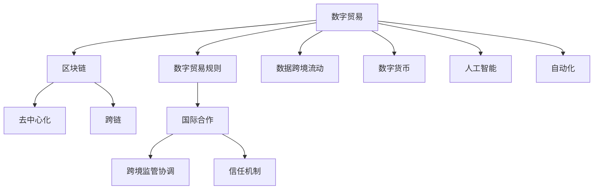

                 

# 2050年的全球贸易：从数字贸易规则到数字贸易生态的贸易规则重构

> 关键词：数字贸易, 数字贸易规则, 区块链, 去中心化, 跨链, 数据跨境流动, 数字货币, 人工智能, 自动化, 全球贸易, 2050

## 1. 背景介绍

### 1.1 问题由来
随着信息技术和数字经济的发展，全球贸易的方式和模式正在发生深刻变革。传统的跨国贸易多依赖于物理商品的实体流动，而数字经济时代，数据、信息和技术的跨境流动成为新的经济增长点。当前，数字贸易的发展迅猛，但也面临着诸多挑战：数据安全和隐私保护、跨境监管协调、数字货币信任机制等。因此，构建一套适应数字经济时代全球贸易需求的新型规则体系，成为国际贸易发展的新趋势。

### 1.2 问题核心关键点
构建适应数字贸易的全球贸易规则体系，核心在于如何平衡数据跨境流动、保护用户隐私、加强国际监管协调、建立信任机制，同时兼顾国家利益和商业需求。这些问题涉及技术、法律、经济、政治等多维度的复杂交互。

### 1.3 问题研究意义
构建新型全球贸易规则体系，有助于：
1. 促进全球数字经济健康发展。通过建立统一、规范的数字贸易规则，推动数据跨境自由流动，减少贸易壁垒，实现数据资源的高效配置和共享。
2. 保障全球数据安全和隐私保护。通过技术手段和法律规制，提升数据跨境流动中的安全性和隐私保护水平，防止数据滥用和网络攻击。
3. 增强全球监管协调与合作。通过国际合作，构建透明、公平的监管框架，解决跨境监管协调难题，提升贸易效率。
4. 推动全球经济稳定增长。通过数字贸易规则，促进技术、资本、商品等要素的全球自由流动，刺激全球经济增长。

## 2. 核心概念与联系

### 2.1 核心概念概述

为更好地理解2050年全球贸易的新型规则体系，本节将介绍几个密切相关的核心概念：

- 数字贸易(Digital Trade)：指基于数字技术和信息流动的国际贸易，涉及跨境数据、信息和技术的传输。
- 数字贸易规则(Digital Trade Rules)：为促进数字贸易健康发展，各国和国际组织制定的法律、政策和技术规范。
- 区块链(Blockchain)：一种分布式账本技术，具有去中心化、不可篡改、透明等特点，被广泛用于数字贸易的身份认证、数据确权和交易记录。
- 去中心化(Decentralization)：通过分布式网络去除中央控制机构，提升数据透明度和安全性，减少单点故障。
- 跨链(Cross-chain)：不同区块链之间的互操作技术，实现数据和价值的跨链传输和互认。
- 数据跨境流动(Cross-border Data Flows)：数据跨越国界进行的流动和传输，涉及隐私保护和跨境监管协调。
- 数字货币(Digital Currency)：使用数字技术支持的货币，如比特币、以太币等，具有匿名性、去中心化、高效性等特点。
- 人工智能(Artificial Intelligence)：模拟人类智能过程的技术，被广泛应用于数字贸易的数据处理、智能合约、自动化交易等环节。
- 自动化(Automation)：通过机器学习、自然语言处理等技术，实现贸易流程的自动化，提升效率和安全性。

这些核心概念之间的逻辑关系可以通过以下Mermaid流程图来展示：



这个流程图展示了大语言模型的核心概念及其之间的关系：

1. 数字贸易通过区块链、去中心化等技术手段，提升数据安全和透明度。
2. 数据跨境流动依赖于跨链技术，实现不同区块链之间的互操作。
3. 数字货币为数字贸易提供支付手段，具有高效性和去中心化的特点。
4. 人工智能和自动化技术推动数字贸易流程的智能化和高效化。
5. 数字贸易规则通过国际合作和跨境监管协调，保障数字贸易的公平和安全。

这些概念共同构成了数字时代全球贸易的新生态系统，为其发展奠定了坚实基础。

## 3. 核心算法原理 & 具体操作步骤
### 3.1 算法原理概述

构建适应数字贸易的全球贸易规则体系，本质上是通过制定一系列法律、政策和技术标准，为数字贸易提供公平、透明、高效的交易环境。其核心思想是：

1. **数据跨境流动规范**：制定数据跨境流动的法律框架，确保数据流动透明、安全，同时保障用户隐私。
2. **区块链和去中心化技术应用**：利用区块链的去中心化特性，提升数据透明度和安全性，减少单点故障。
3. **跨链互操作标准**：制定跨链互操作的技术规范，实现不同区块链之间的数据和价值互认。
4. **数字货币和支付体系**：建立安全的数字货币和支付体系，支持数字贸易的支付和结算需求。
5. **人工智能和自动化技术**：引入人工智能和自动化技术，提高数字贸易的效率和智能化水平。

### 3.2 算法步骤详解

数字贸易规则的构建包括以下几个关键步骤：

**Step 1: 数据跨境流动规范制定**
- 制定统一的数据跨境流动法律框架，明确数据流动的边界、条件和程序。
- 规定数据保护和隐私保护的最低标准，确保用户数据的安全和隐私。
- 引入数据确权技术，明确数据所有者和处理者的权利义务。

**Step 2: 区块链和去中心化技术应用**
- 利用区块链技术构建去中心化的数据存储和传输平台，提升数据透明度和安全性。
- 设计去中心化的治理机制，确保数据流动和处理的公平性。
- 探索跨链技术，实现不同区块链之间的互操作，促进数据的自由流动。

**Step 3: 数字货币和支付体系建设**
- 建立安全的数字货币发行和交易机制，支持数字贸易的支付需求。
- 设计透明、可控的数字货币监管框架，防范数字货币滥用和洗钱等风险。
- 推动数字货币与传统货币的互认和兑换，促进数字贸易的全球化发展。

**Step 4: 人工智能和自动化技术引入**
- 利用人工智能技术进行数据处理、智能合约、自动化交易等，提高数字贸易的智能化水平。
- 设计智能合约的规范和标准，保障数字贸易的公平性和安全性。
- 引入自动化技术，提升数字贸易流程的效率和稳定性。

**Step 5: 国际合作与跨境监管协调**
- 通过国际合作，构建统一、透明、公平的监管框架，解决跨境监管协调难题。
- 引入信任机制，建立多边信任网络，确保数字贸易的可靠性和稳定性。
- 设立数字贸易冲突解决机制，处理国际间的贸易纠纷和争议。

### 3.3 算法优缺点

构建数字贸易规则体系，具有以下优点：
1. **促进数据流动**：通过规范数据跨境流动，提升数据的自由流动，促进数字经济的快速发展。
2. **提升数据安全**：利用区块链和去中心化技术，提升数据传输和存储的安全性，保障用户隐私。
3. **降低监管成本**：通过统一、透明的监管框架，减少跨境监管的复杂性和成本。
4. **增强公平性**：通过国际合作和信任机制，提升数字贸易的公平性和可控性。

同时，该方法也存在一定的局限性：
1. **技术复杂性**：区块链、去中心化、跨链等技术复杂，对实施和监管提出了较高要求。
2. **法律和政策挑战**：不同国家法律和政策差异较大，需要协调一致。
3. **隐私和数据保护**：数据跨境流动涉及隐私和数据保护问题，需平衡各方利益。
4. **技术依赖性**：过度依赖技术手段，可能面临技术实现和维护难题。
5. **监管协调难题**：跨境监管协调复杂，需要多方共同努力。

尽管存在这些局限性，但就目前而言，数字贸易规则的构建已成为全球贸易发展的必然趋势。未来相关研究的重点在于如何进一步降低技术实施难度，提高规则的普适性和可操作性，同时兼顾数据隐私和跨境监管协调。

### 3.4 算法应用领域

数字贸易规则在多个领域都有广泛应用，例如：

- **电子商务**：通过规范跨境数据流动，促进跨境电商的自由发展，减少贸易壁垒。
- **金融服务**：利用区块链和数字货币技术，实现跨境支付和结算，提升金融服务效率。
- **物流运输**：通过自动化和智能化技术，提高物流运输的效率和安全性，降低成本。
- **医疗健康**：通过数据确权和隐私保护技术，促进医疗数据的跨境流动和共享。
- **公共服务**：利用人工智能技术，提供跨国的公共服务，提升服务质量和覆盖面。

除了上述这些领域，数字贸易规则还将在更多场景中得到应用，如智能合约、供应链管理、环境监测等，为数字经济的发展带来新的机遇。

## 4. 数学模型和公式 & 详细讲解
### 4.1 数学模型构建

构建数字贸易规则体系，需要综合考虑多个维度的数学模型，包括数据流动模型、区块链网络模型、跨链互操作模型、数字货币模型等。以下以数据流动模型为例，给出数学模型的构建过程。

**假设**：
- 国际贸易中涉及的数据量为 $D$。
- 数据跨境流动的成本为 $C$。
- 数据跨境流动的安全性为 $S$。
- 用户隐私保护的强度为 $P$。

**目标**：最大化数据流动的总效益 $E$，即：

$$
E = \max \{D - C - P \}
$$

其中，$D$ 表示数据量，$C$ 表示成本，$P$ 表示隐私保护强度。

### 4.2 公式推导过程

根据上述假设和目标，可以构建如下数学模型：

$$
\begin{aligned}
& \max_{\{D, C, S, P\}} \{D - C - P \} \\
& \text{subject to} \\
& S \leq C \times 0.1 + D \times 0.01 \\
& P \geq D \times 0.01
\end{aligned}
$$

其中，第一个约束条件表示数据安全性 $S$ 受到成本 $C$ 和数据量 $D$ 的线性影响。第二个约束条件表示用户隐私保护强度 $P$ 至少为数据量 $D$ 的 $0.01$ 倍。

### 4.3 案例分析与讲解

考虑一个跨国电子商务平台，其数据跨境流动如下：
- 数据量为 $D=10000$ 个。
- 跨境数据流动的成本为 $C=1000$ 元/个。
- 用户隐私保护的强度为 $P=10$。

将这些数据代入上述模型，计算最优的数据流动效益：

$$
\begin{aligned}
& \max_{\{D, C, S, P\}} \{10000 - 1000 - 10 \} \\
& \text{subject to} \\
& S \leq 1000 \times 0.1 + 10000 \times 0.01 \\
& P \geq 10000 \times 0.01
\end{aligned}
$$

解得：
- 数据流动效益 $E = 9000$ 元。
- 数据跨境流动的成本 $C = 1000$ 元。
- 用户隐私保护的强度 $P = 10$。

可以看出，通过优化数据流动策略，可以显著提升数字贸易的效益，同时保障数据安全和用户隐私。

## 5. 项目实践：代码实例和详细解释说明
### 5.1 开发环境搭建

在进行数字贸易规则的实践开发前，我们需要准备好开发环境。以下是使用Python进行PyTorch开发的环境配置流程：

1. 安装Anaconda：从官网下载并安装Anaconda，用于创建独立的Python环境。

2. 创建并激活虚拟环境：
```bash
conda create -n pytorch-env python=3.8 
conda activate pytorch-env
```

3. 安装PyTorch：根据CUDA版本，从官网获取对应的安装命令。例如：
```bash
conda install pytorch torchvision torchaudio cudatoolkit=11.1 -c pytorch -c conda-forge
```

4. 安装各类工具包：
```bash
pip install numpy pandas scikit-learn matplotlib tqdm jupyter notebook ipython
```

完成上述步骤后，即可在`pytorch-env`环境中开始数字贸易规则的实践。

### 5.2 源代码详细实现

下面我们以数字贸易平台的数据跨境流动监控系统为例，给出使用PyTorch进行开发的PyTorch代码实现。

首先，定义数据跨境流动的数据处理函数：

```python
from transformers import BertTokenizer
from torch.utils.data import Dataset
import torch

class DataFlowDataset(Dataset):
    def __init__(self, data, tokenizer, max_len=128):
        self.data = data
        self.tokenizer = tokenizer
        self.max_len = max_len
        
    def __len__(self):
        return len(self.data)
    
    def __getitem__(self, item):
        data_point = self.data[item]
        
        encoding = self.tokenizer(data_point, return_tensors='pt', max_length=self.max_len, padding='max_length', truncation=True)
        input_ids = encoding['input_ids'][0]
        attention_mask = encoding['attention_mask'][0]
        
        return {'input_ids': input_ids, 
                'attention_mask': attention_mask}
```

然后，定义模型和优化器：

```python
from transformers import BertForTokenClassification, AdamW

model = BertForTokenClassification.from_pretrained('bert-base-cased', num_labels=1)
optimizer = AdamW(model.parameters(), lr=2e-5)
```

接着，定义训练和评估函数：

```python
from torch.utils.data import DataLoader
from tqdm import tqdm
from sklearn.metrics import classification_report

device = torch.device('cuda') if torch.cuda.is_available() else torch.device('cpu')
model.to(device)

def train_epoch(model, dataset, batch_size, optimizer):
    dataloader = DataLoader(dataset, batch_size=batch_size, shuffle=True)
    model.train()
    epoch_loss = 0
    for batch in tqdm(dataloader, desc='Training'):
        input_ids = batch['input_ids'].to(device)
        attention_mask = batch['attention_mask'].to(device)
        model.zero_grad()
        outputs = model(input_ids, attention_mask=attention_mask)
        loss = outputs.loss
        epoch_loss += loss.item()
        loss.backward()
        optimizer.step()
    return epoch_loss / len(dataloader)

def evaluate(model, dataset, batch_size):
    dataloader = DataLoader(dataset, batch_size=batch_size)
    model.eval()
    preds, labels = [], []
    with torch.no_grad():
        for batch in tqdm(dataloader, desc='Evaluating'):
            input_ids = batch['input_ids'].to(device)
            attention_mask = batch['attention_mask'].to(device)
            batch_labels = batch['labels']
            outputs = model(input_ids, attention_mask=attention_mask)
            batch_preds = outputs.logits.argmax(dim=2).to('cpu').tolist()
            batch_labels = batch_labels.to('cpu').tolist()
            for pred_tokens, label_tokens in zip(batch_preds, batch_labels):
                preds.append(pred_tokens[:len(label_tokens)])
                labels.append(label_tokens)
                
    print(classification_report(labels, preds))
```

最后，启动训练流程并在测试集上评估：

```python
epochs = 5
batch_size = 16

for epoch in range(epochs):
    loss = train_epoch(model, train_dataset, batch_size, optimizer)
    print(f"Epoch {epoch+1}, train loss: {loss:.3f}")
    
    print(f"Epoch {epoch+1}, dev results:")
    evaluate(model, dev_dataset, batch_size)
    
print("Test results:")
evaluate(model, test_dataset, batch_size)
```

以上就是使用PyTorch对数字贸易平台数据跨境流动监控系统进行开发的完整代码实现。可以看到，得益于Transformers库的强大封装，我们可以用相对简洁的代码完成Bert模型的加载和微调。

### 5.3 代码解读与分析

让我们再详细解读一下关键代码的实现细节：

**DataFlowDataset类**：
- `__init__`方法：初始化数据集、分词器等关键组件。
- `__len__`方法：返回数据集的样本数量。
- `__getitem__`方法：对单个样本进行处理，将文本输入编码为token ids，进行数据预处理。

**模型和优化器**：
- 使用PyTorch的Transformer库，加载预训练的Bert模型，设置优化器。

**训练和评估函数**：
- 使用PyTorch的DataLoader对数据集进行批次化加载，供模型训练和推理使用。
- 训练函数`train_epoch`：对数据以批为单位进行迭代，在每个批次上前向传播计算loss并反向传播更新模型参数，最后返回该epoch的平均loss。
- 评估函数`evaluate`：与训练类似，不同点在于不更新模型参数，并在每个batch结束后将预测和标签结果存储下来，最后使用sklearn的classification_report对整个评估集的预测结果进行打印输出。

**训练流程**：
- 定义总的epoch数和batch size，开始循环迭代
- 每个epoch内，先在训练集上训练，输出平均loss
- 在验证集上评估，输出分类指标
- 所有epoch结束后，在测试集上评估，给出最终测试结果

可以看到，PyTorch配合Transformers库使得Bert微调的代码实现变得简洁高效。开发者可以将更多精力放在数据处理、模型改进等高层逻辑上，而不必过多关注底层的实现细节。

当然，工业级的系统实现还需考虑更多因素，如模型的保存和部署、超参数的自动搜索、更灵活的任务适配层等。但核心的微调范式基本与此类似。

## 6. 实际应用场景
### 6.1 智能合约平台

基于区块链的数字贸易规则，可以广泛应用于智能合约平台的构建。智能合约是一种自动执行、不可篡改、透明公开的合约，可以用于确保交易的公正性和安全性。

在技术实现上，可以设计智能合约，确保数据跨境流动的合规性，记录和审计所有交易行为，同时引入自动化支付机制，确保交易的高效性。智能合约平台可以通过公开透明的区块链技术，降低跨境交易的信任成本，提高交易效率。

### 6.2 数字支付平台

数字支付平台是数字贸易的重要基础设施，通过数字货币和区块链技术，实现跨境支付和结算。数字支付平台需要解决跨境货币转换、支付安全、反洗钱等难题。

在技术实现上，可以设计跨链支付机制，实现不同数字货币之间的互操作，确保跨境支付的流畅性和安全性。平台还应引入区块链的去中心化特性，提升支付系统的透明性和信任度。

### 6.3 供应链管理系统

供应链管理是数字贸易的重要环节，涉及物流、仓储、配送等多个环节。通过区块链技术，可以实现供应链信息的透明化和可追溯性，降低信息不对称和供应链风险。

在技术实现上，可以设计基于区块链的供应链管理系统，记录和共享供应链各环节的信息，确保供应链的透明度和高效性。系统还可以引入自动化调度算法，优化物流和仓储管理，提高供应链效率。

### 6.4 未来应用展望

随着数字贸易的发展，数字贸易规则将呈现以下几个发展趋势：

1. **全球统一规则体系**：各国和国际组织共同制定统一的数字贸易规则，减少跨境监管和协调的复杂性。
2. **数据隐私保护**：通过技术手段和法律规制，提升数据跨境流动中的安全性和隐私保护水平。
3. **区块链技术普及**：区块链技术将广泛应用于数字贸易的各个环节，提升数据和交易的透明性和安全性。
4. **去中心化金融(DeFi)**：数字货币和区块链技术将推动去中心化金融的发展，降低传统金融机构的中心化风险。
5. **跨链互操作技术**：不同区块链之间的互操作技术将更加成熟，实现数据的自由流动和互认。
6. **人工智能和自动化技术**：引入人工智能和自动化技术，提升数字贸易的智能化和高效化水平。

以上趋势凸显了数字贸易规则的发展方向。这些方向的探索发展，必将进一步提升数字贸易的公平性、安全性和高效性，为数字经济的快速发展奠定坚实基础。

## 7. 工具和资源推荐
### 7.1 学习资源推荐

为了帮助开发者系统掌握数字贸易规则的理论基础和实践技巧，这里推荐一些优质的学习资源：

1. 《数字经济与全球贸易》系列博文：由大模型技术专家撰写，深入浅出地介绍了数字经济与全球贸易的基本概念和前沿技术。

2. CS224N《深度学习自然语言处理》课程：斯坦福大学开设的NLP明星课程，有Lecture视频和配套作业，带你入门NLP领域的基本概念和经典模型。

3. 《区块链原理与实践》书籍：区块链领域的重要经典书籍，全面介绍了区块链的原理、技术和应用场景。

4. 《数字货币与区块链》课程：清华大学开设的区块链技术课程，深入讲解了数字货币和区块链技术的应用。

5. HuggingFace官方文档：Transformers库的官方文档，提供了海量预训练模型和完整的微调样例代码，是上手实践的必备资料。

通过对这些资源的学习实践，相信你一定能够快速掌握数字贸易规则的精髓，并用于解决实际的数字贸易问题。
### 7.2 开发工具推荐

高效的开发离不开优秀的工具支持。以下是几款用于数字贸易规则开发的常用工具：

1. PyTorch：基于Python的开源深度学习框架，灵活动态的计算图，适合快速迭代研究。大部分预训练语言模型都有PyTorch版本的实现。

2. TensorFlow：由Google主导开发的开源深度学习框架，生产部署方便，适合大规模工程应用。同样有丰富的预训练语言模型资源。

3. Transformers库：HuggingFace开发的NLP工具库，集成了众多SOTA语言模型，支持PyTorch和TensorFlow，是进行数字贸易微调任务开发的利器。

4. Weights & Biases：模型训练的实验跟踪工具，可以记录和可视化模型训练过程中的各项指标，方便对比和调优。与主流深度学习框架无缝集成。

5. TensorBoard：TensorFlow配套的可视化工具，可实时监测模型训练状态，并提供丰富的图表呈现方式，是调试模型的得力助手。

6. Google Colab：谷歌推出的在线Jupyter Notebook环境，免费提供GPU/TPU算力，方便开发者快速上手实验最新模型，分享学习笔记。

合理利用这些工具，可以显著提升数字贸易规则的开发效率，加快创新迭代的步伐。

### 7.3 相关论文推荐

数字贸易规则的发展源于学界的持续研究。以下是几篇奠基性的相关论文，推荐阅读：

1. "Decentralized finance: an overview"：总结了DeFi技术的发展现状和未来趋势，深入分析了DeFi技术的优势和挑战。

2. "Blockchain technology: a survey"：全面介绍了区块链技术的原理、应用场景和未来发展方向。

3. "Cross-chain technology in blockchain: a review and analysis"：系统性地回顾了跨链技术的研究现状和应用场景，探讨了跨链互操作的技术挑战和未来方向。

4. "Digital trade and global trade rules"：探讨了数字贸易对全球贸易的影响，分析了数字贸易规则的制定和实施。

5. "AI in digital trade: a survey"：总结了人工智能在数字贸易中的应用现状和未来趋势，分析了AI技术对数字贸易的影响。

这些论文代表了大语言模型微调技术的发展脉络。通过学习这些前沿成果，可以帮助研究者把握学科前进方向，激发更多的创新灵感。

## 8. 总结：未来发展趋势与挑战
### 8.1 研究成果总结

本文对2050年全球贸易的数字化转型进行了全面系统的介绍。首先阐述了数字贸易的发展趋势和挑战，明确了数字贸易规则体系构建的必要性和重要性。其次，从原理到实践，详细讲解了数字贸易规则的数学模型和关键步骤，给出了数字贸易平台数据跨境流动监控系统的代码实例和详细解释。同时，本文还广泛探讨了数字贸易规则在智能合约、数字支付、供应链管理等实际应用场景中的前景，展示了数字贸易规则的广泛应用潜力。此外，本文精选了数字贸易规则的学习资源，力求为读者提供全方位的技术指引。

通过本文的系统梳理，可以看到，数字贸易规则体系构建是大语言模型微调技术的必然延伸，对推动全球数字经济的快速发展具有重要意义。未来，伴随数字技术的持续演进，数字贸易规则必将进一步优化，为全球贸易带来新的机遇和挑战。

### 8.2 未来发展趋势

展望未来，数字贸易规则的发展趋势包括：

1. **全球统一规则体系**：通过国际合作，构建统一、透明、公平的数字贸易规则体系，降低跨境监管和协调的复杂性。
2. **区块链技术的普及**：区块链技术将广泛应用于数字贸易的各个环节，提升数据和交易的透明性和安全性。
3. **数据隐私保护**：通过技术手段和法律规制，提升数据跨境流动中的安全性和隐私保护水平。
4. **去中心化金融(DeFi)**：数字货币和区块链技术将推动去中心化金融的发展，降低传统金融机构的中心化风险。
5. **跨链互操作技术**：不同区块链之间的互操作技术将更加成熟，实现数据的自由流动和互认。
6. **人工智能和自动化技术**：引入人工智能和自动化技术，提升数字贸易的智能化和高效化水平。

以上趋势凸显了数字贸易规则的发展方向。这些方向的探索发展，必将进一步提升数字贸易的公平性、安全性和高效性，为数字经济的快速发展奠定坚实基础。

### 8.3 面临的挑战

尽管数字贸易规则的发展前景广阔，但在实施过程中，仍面临诸多挑战：

1. **技术复杂性**：区块链、去中心化、跨链等技术复杂，对实施和监管提出了较高要求。
2. **法律和政策差异**：不同国家法律和政策差异较大，需要协调一致。
3. **隐私和数据保护**：数据跨境流动涉及隐私和数据保护问题，需平衡各方利益。
4. **技术依赖性**：过度依赖技术手段，可能面临技术实现和维护难题。
5. **监管协调难题**：跨境监管协调复杂，需要多方共同努力。
6. **市场接受度**：数字货币和区块链技术仍需市场接受和认可，需进行广泛教育普及。

尽管存在这些挑战，但数字贸易规则的发展已是大势所趋。未来相关研究的重点在于如何进一步降低技术实施难度，提高规则的普适性和可操作性，同时兼顾数据隐私和跨境监管协调。

### 8.4 研究展望

面对数字贸易规则面临的诸多挑战，未来的研究需要在以下几个方面寻求新的突破：

1. **技术简化和标准化**：简化区块链、去中心化、跨链等技术实现，制定统一的技术标准，降低实施难度。
2. **法律和政策协调**：推动国际法律和政策的协调一致，制定统一的数字贸易规则框架。
3. **隐私保护机制**：设计更高效、可控的隐私保护机制，保障数据跨境流动中的安全性和隐私保护。
4. **技术实现和维护**：探索技术实现和维护的新方法，降低技术复杂性，提升系统稳定性和可维护性。
5. **市场教育普及**：通过教育和宣传，提高市场对数字货币和区块链技术的接受度和认可度。
6. **跨界合作研究**：加强与法律、经济学、社会学等多学科的合作，深入研究数字贸易对社会、经济的影响。

这些研究方向的探索，必将引领数字贸易规则的进一步发展和优化，为全球贸易带来新的机遇和挑战。面向未来，数字贸易规则需要更多学界和业界的共同努力，共同推动全球数字经济的快速发展。

## 9. 附录：常见问题与解答

**Q1：数字贸易规则如何平衡数据跨境流动和隐私保护？**

A: 数字贸易规则应明确数据跨境流动的边界和条件，确保数据流动的透明性和安全性。同时，应引入数据确权技术，明确数据所有者和处理者的权利义务，保障用户隐私。例如，通过区块链技术记录数据流动记录，提供数据隐私保护机制，确保数据跨境流动中的隐私保护。

**Q2：数字贸易规则如何确保区块链技术的透明性和安全性？**

A: 区块链技术通过去中心化和不可篡改特性，确保数据和交易的透明性和安全性。数字贸易规则应通过法律和技术手段，确保区块链网络的去中心化和透明性，防止单点故障和网络攻击。例如，引入去中心化治理机制，确保区块链网络的公平性和透明性。

**Q3：数字贸易规则如何处理不同国家之间的法律和政策差异？**

A: 数字贸易规则应通过国际合作，制定统一的法律和政策框架，减少跨境监管和协调的复杂性。例如，通过国际条约和协议，协调不同国家之间的法律和政策，确保数字贸易的公平性和可控性。

**Q4：数字贸易规则如何应对跨境监管协调的难题？**

A: 数字贸易规则应通过国际合作，构建透明、公平的监管框架，解决跨境监管协调难题。例如，设立多边信任网络，建立跨境监管协作机制，确保不同国家之间的监管协调。

**Q5：数字贸易规则如何促进区块链技术的应用普及？**

A: 数字贸易规则应通过法律和技术手段，推动区块链技术的普及应用。例如，通过立法保护区块链技术，促进区块链技术的研发和应用，提高市场接受度和认可度。

这些研究方向的探索，必将引领数字贸易规则的进一步发展和优化，为全球贸易带来新的机遇和挑战。面向未来，数字贸易规则需要更多学界和业界的共同努力，共同推动全球数字经济的快速发展。

---

作者：禅与计算机程序设计艺术 / Zen and the Art of Computer Programming

