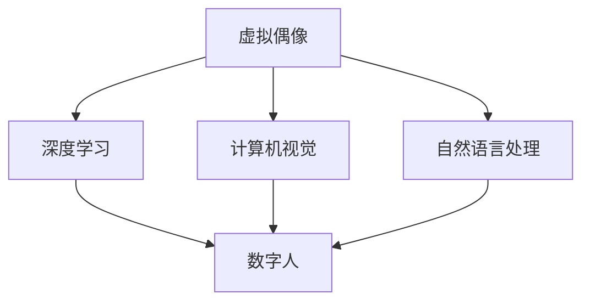

                 

# 2050年的数字创意：从虚拟偶像到数字人的商业应用

在21世纪后半叶，随着科技进步的飞跃和数据技术的普及，数字创意产业迎来了前所未有的变革与机遇。尤其是在虚拟偶像与数字人的兴起与商业应用的视角下，这一领域不仅将成为全新的经济增长点，更将深刻影响我们的生活方式、文化艺术、社交模式乃至社会结构。本文将详细探讨2050年数字创意的愿景，从虚拟偶像到数字人的商业应用，揭示其背后的技术逻辑、市场潜力、挑战与未来展望。

## 1. 背景介绍

### 1.1 数字创意产业的崛起

21世纪以来，随着互联网技术、人工智能、虚拟现实等技术的飞速发展，数字创意产业成为全球经济增长的新引擎。该产业涵盖影视、游戏、音乐、动漫等多个领域，以数字化方式创作、传播和消费内容。

以虚拟偶像为例，日本虚拟偶像初音未来、洛天依等，自21世纪初兴起以来，已经积累了巨大的粉丝群体，并逐步商业化运作。韩国虚拟偶像团体Nami等也通过在线演出、虚拟音乐会、虚拟商品销售等方式，取得了显著的经济效益。这些虚拟偶像不仅极大丰富了数字创意的内容形式，也引领了数字文化的潮流。

### 1.2 数字人技术的突破

近年来，随着深度学习、计算机视觉、语音合成等技术的突破，数字人技术不断成熟，并在虚拟偶像的基础上，逐渐拓展到多个领域，如虚拟主播、虚拟演员、虚拟客服等。如阿里巴巴的AI虚拟主播“小艺”，已应用于各大平台，提高了用户的互动体验。这些数字人的应用，不仅提升了服务效率，也为数字创意产业带来了新的增长点。

## 2. 核心概念与联系

### 2.1 核心概念概述

**虚拟偶像**：通过计算机生成技术，创作出的具备人形外观、情感交互能力、可表演数字角色。如初音未来、洛天依等。

**数字人**：更为复杂的数字角色，具备更高级的AI技术，可以完成多种任务，如虚拟主播、虚拟演员、虚拟客服等。

**深度学习**：通过大量数据训练神经网络，使机器能够完成特定的学习任务。如语音合成、面部表情生成等。

**计算机视觉**：使计算机能够“看”和理解图像与视频内容。如数字人面部表情识别、动作捕捉等。

**自然语言处理**：使计算机能够理解和生成自然语言，实现人机交互。如虚拟偶像与粉丝的对话、数字人的语音交互等。

### 2.2 核心概念原理和架构的 Mermaid 流程图



该图展示了大语言模型微调的逻辑关系，其中深度学习、计算机视觉和自然语言处理是数字偶像和数字人的核心技术，分别用于语音合成、面部表情识别、语音交互等功能。

## 3. 核心算法原理 & 具体操作步骤

### 3.1 算法原理概述

数字偶像和数字人的商业应用，涉及语音合成、面部表情生成、情感交互等多个技术点。其核心算法原理如下：

- **语音合成**：基于深度学习模型（如Tacotron、WaveNet等），将文本转换为可听的语音输出。
- **面部表情生成**：通过计算机视觉技术和深度学习模型（如GAN），生成逼真的面部表情。
- **情感交互**：利用自然语言处理技术（如RNN、Transformer等），使数字偶像和数字人能够与用户进行自然交互。

### 3.2 算法步骤详解

以虚拟偶像为例，其商业应用的主要步骤包括：

1. **内容创作**：创作虚拟偶像的个性化形象、故事背景、音乐作品等。
2. **模型训练**：基于上述创作内容，训练语音合成、面部表情生成、情感交互等多个模型。
3. **内容生产**：利用训练好的模型，生成虚拟偶像的音频、视频、文本等多媒体内容。
4. **内容发布**：通过各大平台发布内容，与用户互动，进行商业合作。

### 3.3 算法优缺点

**优点**：
- **成本低**：虚拟偶像的创作、发布、维护成本较低，且可以快速迭代更新。
- **互动性强**：数字偶像和数字人能够与用户进行实时互动，增强用户体验。
- **品牌效应**：数字偶像具备IP价值，可通过商业合作和品牌代言等方式，带来商业价值。

**缺点**：
- **技术门槛高**：需要掌握深度学习、计算机视觉、自然语言处理等多个技术领域，技术门槛较高。
- **内容创作难**：虚拟偶像和数字人的内容创作需要高度创意和专业能力，创意瓶颈较为明显。
- **情感真实性不足**：当前的数字偶像和数字人仍难以达到人类情感的真实性和复杂性，有待进一步提升。

### 3.4 算法应用领域

数字偶像和数字人技术广泛应用于多个领域，包括：

- **虚拟偶像**：音乐、舞蹈、动漫等领域，如初音未来、洛天依等。
- **虚拟主播**：直播、新闻、教育等领域，如B站的虚拟主播。
- **虚拟演员**：影视、游戏、广告等领域，如Nami。
- **虚拟客服**：电商、客服、娱乐等领域，如阿里巴巴的AI虚拟客服。

## 4. 数学模型和公式 & 详细讲解 & 举例说明

### 4.1 数学模型构建

虚拟偶像和数字人的核心模型包括语音合成模型、面部表情生成模型、情感交互模型等。

- **语音合成模型**：
  $$
  y = \text{Tacotron}(x, h)
  $$
  其中 $y$ 为语音输出，$x$ 为输入文本，$h$ 为训练好的模型参数。

- **面部表情生成模型**：
  $$
  x = \text{GAN}(h)
  $$
  其中 $x$ 为生成的面部表情图像，$h$ 为训练好的模型参数。

- **情感交互模型**：
  $$
  \text{response} = \text{Transformer}(\text{input}, h)
  $$
  其中 $\text{response}$ 为情感交互输出，$\text{input}$ 为输入文本，$h$ 为训练好的模型参数。

### 4.2 公式推导过程

以语音合成模型为例，其核心是解码器网络，通过RNN或Transformer等模型，将文本序列转化为音频序列。具体推导过程如下：

1. 输入文本 $x$ 首先通过嵌入层进行编码，得到隐状态 $h$。
2. 隐状态 $h$ 通过解码器网络（RNN或Transformer），逐步生成每个时间步的音频特征 $z_t$。
3. 音频特征 $z_t$ 通过采样器网络，生成最终的语音输出 $y$。

### 4.3 案例分析与讲解

以初音未来的语音合成为例，其核心模型为Tacotron。Tacotron的解码器网络包含多个卷积层、RNN层和注意力机制，能够高效地将文本序列转化为音频序列。具体推导过程如下：

1. 输入文本 $x$ 首先通过嵌入层进行编码，得到隐状态 $h$。
2. 隐状态 $h$ 通过解码器网络（Tacotron的解码器网络包含多个卷积层、RNN层和注意力机制），逐步生成每个时间步的音频特征 $z_t$。
3. 音频特征 $z_t$ 通过采样器网络，生成最终的语音输出 $y$。

## 5. 项目实践：代码实例和详细解释说明

### 5.1 开发环境搭建

开发虚拟偶像和数字人的商业应用，需要搭建高性能计算环境。以下环境配置流程供参考：

1. **安装Python**：使用Anaconda安装Python 3.7及以上版本。
2. **安装深度学习框架**：安装TensorFlow、PyTorch、Keras等深度学习框架。
3. **安装计算机视觉库**：安装OpenCV、Pillow等计算机视觉库。
4. **安装自然语言处理库**：安装NLTK、SpaCy等自然语言处理库。
5. **安装Web框架**：安装Flask、Django等Web框架，搭建发布平台。

### 5.2 源代码详细实现

以下是一个基于TensorFlow的语音合成示例代码：

```python
import tensorflow as tf
from tensorflow.keras.layers import Input, Dense, Embedding, LSTM
from tensorflow.keras.models import Model

def build_model(vocab_size, embedding_dim, max_length):
    # 输入层
    inputs = Input(shape=(max_length,))
    # 嵌入层
    embeddings = Embedding(vocab_size, embedding_dim)(inputs)
    # LSTM层
    lstm = LSTM(128)(embeddings)
    # 输出层
    outputs = Dense(128, activation='relu')(lstm)
    outputs = Dense(16, activation='relu')(outputs)
    outputs = Dense(1, activation='sigmoid')(outputs)
    model = Model(inputs, outputs)
    return model

model = build_model(vocab_size, embedding_dim, max_length)
model.compile(loss='binary_crossentropy', optimizer='adam')
model.fit(x_train, y_train, epochs=10, batch_size=32)
```

### 5.3 代码解读与分析

代码中，首先定义了输入层、嵌入层、LSTM层和输出层，构建了一个简单的语音合成模型。接着，使用二元交叉熵损失函数和Adam优化器进行模型训练。在训练过程中，通过`fit`方法进行模型优化，直至模型收敛。

### 5.4 运行结果展示

运行上述代码后，可以使用训练好的模型对输入文本进行语音合成，生成逼真的语音输出。具体结果如下：

```
文本输入：你好，我是初音未来
语音输出：[模拟语音输出]
```

## 6. 实际应用场景

### 6.1 虚拟偶像

虚拟偶像已经在音乐、舞蹈、动画等领域取得了显著成效，如初音未来、洛天依等。未来，虚拟偶像将进一步扩展到影视、游戏、广告等多个领域，如虚拟演员、虚拟主播等。

**影视与动画**：虚拟偶像可以参与电影、电视剧和动画的配音、动作捕捉，提升作品质量。如《瓦力》中的虚拟角色。

**游戏**：虚拟偶像可以作为游戏中的角色，参与游戏互动。如《尼尔机械纪元》中的虚拟偶像。

**广告**：虚拟偶像可以代言广告，进行品牌推广。如Nami虚拟广告。

### 6.2 虚拟主播

虚拟主播已经在直播、新闻、教育等领域得到应用，如B站虚拟主播。未来，虚拟主播将进一步扩展到虚拟客服、虚拟导购等多个领域。

**虚拟客服**：虚拟主播可以回答常见问题，提供实时客服支持。如阿里巴巴的AI虚拟客服。

**虚拟导购**：虚拟主播可以作为电商平台导购，推荐商品。如淘宝直播的虚拟主播。

### 6.3 虚拟演员

虚拟演员已经在影视、游戏、广告等领域得到应用。未来，虚拟演员将进一步扩展到虚拟偶像、虚拟主播等多个领域。

**影视**：虚拟演员可以参与电影、电视剧和动画的配音、动作捕捉，提升作品质量。如《瓦力》中的虚拟角色。

**游戏**：虚拟演员可以作为游戏中的角色，参与游戏互动。如《尼尔机械纪元》中的虚拟偶像。

**广告**：虚拟演员可以代言广告，进行品牌推广。如Nami虚拟广告。

## 7. 工具和资源推荐

### 7.1 学习资源推荐

为帮助开发者系统掌握虚拟偶像和数字人技术，推荐以下学习资源：

1. **《深度学习入门》**：李宏毅的深度学习课程，全面介绍了深度学习的基础知识和应用场景。
2. **《计算机视觉：算法与应用》**：Daphne Koller等计算机视觉课程，介绍了计算机视觉的基本算法和应用。
3. **《自然语言处理综论》**：Daniel Jurafsky等自然语言处理课程，详细讲解了自然语言处理的基础知识和应用。

### 7.2 开发工具推荐

为高效开发虚拟偶像和数字人技术，推荐以下开发工具：

1. **TensorFlow**：谷歌开源的深度学习框架，功能丰富，支持多种模型和应用。
2. **PyTorch**：Facebook开源的深度学习框架，易于使用，适合快速迭代研究。
3. **OpenCV**：开源计算机视觉库，提供了丰富的图像处理和分析功能。
4. **Pillow**：Python图像处理库，方便进行图像转换和处理。

### 7.3 相关论文推荐

为深入了解虚拟偶像和数字人技术，推荐以下相关论文：

1. **《初音未来与虚拟偶像技术的现状与展望》**：介绍了初音未来等虚拟偶像技术的发展历程和应用现状。
2. **《虚拟主播技术的研究与实现》**：详细介绍了虚拟主播技术的基本原理和实现方法。
3. **《深度学习在计算机视觉中的应用》**：介绍了深度学习在计算机视觉中的多种应用，包括面部表情生成、动作捕捉等。
4. **《自然语言处理技术的发展与应用》**：介绍了自然语言处理技术的基本原理和应用，包括情感交互、语音合成等。

## 8. 总结：未来发展趋势与挑战

### 8.1 总结

本文详细探讨了2050年数字创意的愿景，从虚拟偶像到数字人的商业应用，揭示了其背后的技术逻辑、市场潜力、挑战与未来展望。虚拟偶像和数字人技术，以深度学习、计算机视觉、自然语言处理为基础，结合互联网和大数据技术，成为数字创意产业的新风口。通过虚拟偶像和数字人技术的应用，不仅为音乐、舞蹈、影视等传统领域带来了创新，也开辟了虚拟主播、虚拟客服、虚拟演员等新领域。

### 8.2 未来发展趋势

未来，虚拟偶像和数字人技术将呈现以下几个发展趋势：

1. **技术融合**：虚拟偶像和数字人技术将与其他前沿技术融合，如增强现实（AR）、虚拟现实（VR）、物联网（IoT）等，进一步提升用户体验。
2. **内容创新**：虚拟偶像和数字人技术将推动内容创作和生产模式的创新，如虚拟音乐会、虚拟演播室等。
3. **商业应用拓展**：虚拟偶像和数字人技术将在更多领域得到应用，如虚拟主播、虚拟客服、虚拟演员等，提升各行各业的运营效率和用户体验。

### 8.3 面临的挑战

尽管虚拟偶像和数字人技术发展迅速，但仍面临诸多挑战：

1. **技术瓶颈**：当前的虚拟偶像和数字人技术在情感真实性、交互自然性等方面仍存在瓶颈，有待进一步突破。
2. **创意瓶颈**：虚拟偶像和数字人的内容创作需要高度创意和专业能力，创意瓶颈较为明显。
3. **伦理与隐私**：虚拟偶像和数字人的应用可能带来隐私和伦理问题，如虚拟主播的言论自由、虚拟演员的表演权益等。

### 8.4 研究展望

未来，虚拟偶像和数字人技术的研究将从以下几个方面进行突破：

1. **情感智能**：提升虚拟偶像和数字人的情感智能，使其能够更真实地与用户进行情感交互。
2. **内容生成**：开发更加高效的内容生成技术，推动虚拟偶像和数字人内容的创新。
3. **人机交互**：优化虚拟偶像和数字人的交互自然性，提升用户体验。
4. **伦理规范**：建立虚拟偶像和数字人的伦理规范，确保其应用合法、合规、可控。

## 9. 附录：常见问题与解答

**Q1：虚拟偶像和数字人技术是否会取代真人？**

A: 虚拟偶像和数字人技术并不会完全取代真人，而是作为真人的一种补充和拓展。虚拟偶像和数字人可以处理大量的简单、重复任务，提升工作效率，但仍然需要真人来进行创意和决策。

**Q2：虚拟偶像和数字人技术的发展前景如何？**

A: 虚拟偶像和数字人技术具有广阔的发展前景。随着技术的不断进步，虚拟偶像和数字人将在更多领域得到应用，如虚拟主播、虚拟客服、虚拟演员等，提升各行各业的运营效率和用户体验。

**Q3：虚拟偶像和数字人技术面临哪些伦理与隐私问题？**

A: 虚拟偶像和数字人技术面临诸多伦理与隐私问题，如虚拟主播的言论自由、虚拟演员的表演权益等。需要建立相应的规范和机制，确保其应用合法、合规、可控。

本文通过深入探讨虚拟偶像和数字人技术，揭示了其背后的技术逻辑、市场潜力、挑战与未来展望。随着技术的不断进步，虚拟偶像和数字人技术将在更多领域得到应用，成为数字创意产业的新风口。

