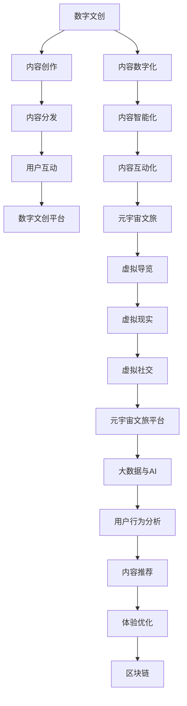

                 

## 1. 背景介绍

### 1.1 问题由来
在数字化时代，文化产业已不仅仅是传统意义上的影视、音乐、出版等行业，而是包括了数字文创、元宇宙文旅等新兴业态的复合型产业。数字文化的崛起，带来了新的商业模式、消费场景和用户体验，也提出了全新的技术挑战。如何有效整合数字文创和元宇宙文旅，为数字文化产业带来全面的升级，成为当下及未来面临的重要课题。

### 1.2 问题核心关键点
数字文化产业升级的核心在于：

- **数字文创**：利用数字技术创新传统文化表达，推动文化内容的数字化、智能化、互动化。
- **元宇宙文旅**：将虚拟与现实融合，实现沉浸式、交互式的文旅体验，拓展文旅产业边界。
- **技术融合**：将大数据、云计算、人工智能等技术深度整合，提升文化产业的数字化水平。
- **用户参与**：构建以用户为中心的生态系统，增强用户体验，提升用户粘性。
- **数据治理**：建立健全数据治理体系，保障数据安全与隐私，提升数据利用价值。

### 1.3 问题研究意义
数字文化产业升级的研究，对实现文化与科技的深度融合、提升文化产品的市场竞争力、推动产业结构升级、促进数字经济的全面发展具有重要意义：

- **增强文化影响力**：通过数字化手段，将文化内容触达更多人群，增强文化影响力。
- **提升用户体验**：以用户为中心，创新文旅体验，提升用户满意度和参与度。
- **促进产业升级**：推动传统文创、文旅产业的数字化转型，实现产业结构优化。
- **助力数字经济**：通过文化与数字经济的融合，形成新的经济增长点，推动经济全面发展。

## 2. 核心概念与联系

### 2.1 核心概念概述

为更好地理解数字文化产业升级，本节将介绍几个密切相关的核心概念：

- **数字文创**：通过数字技术，如虚拟现实(VR)、增强现实(AR)、3D建模等，创新传统文化内容表达，推动文化内容数字化、智能化、互动化。
- **元宇宙文旅**：构建虚拟空间与现实世界的无缝连接，实现沉浸式、交互式的文旅体验，拓展文旅产业边界。
- **数字文创平台**：集成内容创作、版权交易、用户互动等功能，推动数字文创生态的构建。
- **元宇宙文旅平台**：提供虚拟导览、虚拟现实体验、虚拟社交等功能，实现元宇宙文旅的商业化运营。
- **大数据与AI**：运用大数据分析和人工智能技术，实现对用户行为、内容推荐、体验优化等的精准把握。
- **区块链**：为数字文化内容确权、版权交易、智能合约等提供保障，提升文化产业的信任度与透明度。

这些核心概念之间的逻辑关系可以通过以下Mermaid流程图来展示：



这个流程图展示了大数字文化产业的核心概念及其之间的关系：

1. 数字文创通过内容创作、分发、互动，实现文化内容的数字化和智能化。
2. 元宇宙文旅通过虚拟导览、现实、社交，拓展文旅产业的边界。
3. 数字文创平台和元宇宙文旅平台，是内容与用户交互的主要载体。
4. 大数据与AI技术，是平台提升用户体验和精准运营的关键。
5. 区块链技术，为文化内容的版权保护和信任机制提供保障。

## 3. 核心算法原理 & 具体操作步骤

### 3.1 算法原理概述

数字文化产业升级的核心算法原理，主要围绕以下几个方面展开：

- **内容创作算法**：利用生成对抗网络(GAN)、变分自编码器(VAE)等算法，实现文化内容的创新表达。
- **用户行为分析算法**：运用聚类、分类、关联规则等算法，分析用户行为，优化用户体验。
- **推荐系统算法**：采用协同过滤、内容推荐、混合推荐等算法，实现个性化内容推荐。
- **虚拟现实与增强现实技术**：利用空间定位、运动跟踪、图像识别等技术，实现虚拟与现实的融合。
- **区块链算法**：应用密码学、共识算法、智能合约等技术，实现数字文化内容的版权保护和交易。

### 3.2 算法步骤详解

数字文化产业升级的算法步骤，一般包括以下几个关键环节：

**Step 1: 数据采集与处理**
- 收集用户行为数据、内容数据、环境数据等，通过数据清洗、特征提取、数据增强等步骤，构建高质量的数据集。

**Step 2: 模型训练与优化**
- 根据具体需求，选择合适的算法模型，如GAN、VAE、协同过滤、内容推荐等。
- 使用大规模数据集对模型进行训练，通过交叉验证、超参数调优等方法，优化模型性能。

**Step 3: 模型部署与评估**
- 将训练好的模型部署到文创平台、文旅平台等应用场景中，实现内容生成、用户行为分析、个性化推荐等功能。
- 定期收集用户反馈、行为数据等，评估模型效果，持续优化模型性能。

**Step 4: 业务集成与迭代**
- 将模型算法与业务流程进行集成，实现数字文创和元宇宙文旅的业务闭环。
- 根据用户反馈和新业务需求，不断迭代优化算法和模型，提升用户体验和业务价值。

### 3.3 算法优缺点

数字文化产业升级的算法具有以下优点：

1. **创新性**：通过大数据、AI等技术，创新文化内容的表达方式，提升文化产品的竞争力。
2. **个性化**：实现精准的用户行为分析与个性化推荐，提升用户体验。
3. **可扩展性**：基于统一的数据与算法平台，实现多领域、多业态的业务拓展。
4. **自动化**：通过算法自动化处理，提升运营效率，降低人工成本。

同时，也存在一些缺点：

1. **数据隐私问题**：数据采集与处理中可能存在隐私泄露风险，需加强数据安全防护。
2. **算法偏见**：算法模型的训练数据可能存在偏见，需进行模型公平性评估与优化。
3. **技术复杂性**：涉及多种复杂技术，技术门槛较高，需投入大量资源进行研发。
4. **市场接受度**：用户对新技术的接受度可能较低，需进行市场教育与推广。

### 3.4 算法应用领域

数字文化产业升级的算法，在多个领域均有广泛应用，例如：

- **数字文创**：影视、音乐、游戏、文学等领域，通过内容创作、分发、互动，推动文化内容的数字化和智能化。
- **元宇宙文旅**：虚拟导览、虚拟现实、虚拟社交等应用场景，实现沉浸式、交互式的文旅体验。
- **文化教育**：在线教育、远程教学等场景，通过虚拟现实技术，增强教学互动性。
- **文化遗产保护**：数字复原、虚拟展览等应用，实现文化遗产的保护与传播。
- **文化产业交易**：版权确权、版权交易、智能合约等场景，实现文化内容的数字化交易。

## 4. 数学模型和公式 & 详细讲解 & 举例说明

### 4.1 数学模型构建

本节将使用数学语言对数字文化产业升级的核心算法进行更加严格的刻画。

记数字文创内容为 $C$，用户行为数据为 $U$，环境数据为 $E$。设数字文创平台为 $P$，元宇宙文旅平台为 $V$。算法模型的目标是最小化用户行为误差 $e$，并最大化用户满意度 $s$。

定义用户行为误差 $e$ 为：

$$
e = \sum_{i=1}^n \|c_i - u_i\|^2
$$

其中 $c_i$ 为第 $i$ 个用户的文化内容推荐，$u_i$ 为用户行为。

定义用户满意度 $s$ 为：

$$
s = \prod_{i=1}^n f(u_i)
$$

其中 $f(u_i)$ 为第 $i$ 个用户的满意度函数。

### 4.2 公式推导过程

以协同过滤算法为例，推导其基本公式。

假设用户 $i$ 对物品 $j$ 的评分 $r_{ij}$ 已知，需要推导出用户 $i$ 对物品 $k$ 的评分 $r_{ik}$。

根据协同过滤算法的基本思想，用户 $i$ 对物品 $k$ 的评分可以通过已知的评分数据推断得出。具体公式如下：

$$
r_{ik} = \frac{\sum_{j \in N_i} r_{ij} r_{jk}}{\sqrt{\sum_{j \in N_i} r_{ij}^2} \sqrt{\sum_{j \in N_k} r_{jk}^2}}
$$

其中 $N_i$ 为用户 $i$ 已评分物品的集合，$N_k$ 为用户 $k$ 已评分物品的集合。

### 4.3 案例分析与讲解

以推荐系统的协同过滤算法为例，探讨其应用与效果。

假设某数字文创平台收集了大量用户对文化内容的评分数据，利用协同过滤算法，为用户推荐可能感兴趣的文化内容。

具体步骤如下：

1. 数据预处理：清洗、归一化评分数据，构建用户物品评分矩阵 $R$。
2. 相似度计算：计算用户间的相似度矩阵 $S$。
3. 评分预测：利用相似度矩阵 $S$ 预测用户对未评分物品的评分。
4. 推荐排序：根据预测评分，对未评分物品进行排序，推荐给用户。

通过协同过滤算法，平台能够实现对用户行为的精准分析与个性化推荐，显著提升用户体验。

## 5. 项目实践：代码实例和详细解释说明

### 5.1 开发环境搭建

在进行数字文化产业升级的项目实践前，我们需要准备好开发环境。以下是使用Python进行TensorFlow开发的环境配置流程：

1. 安装Anaconda：从官网下载并安装Anaconda，用于创建独立的Python环境。

2. 创建并激活虚拟环境：
```bash
conda create -n tensorflow-env python=3.8 
conda activate tensorflow-env
```

3. 安装TensorFlow：根据CUDA版本，从官网获取对应的安装命令。例如：
```bash
conda install tensorflow tensorflow-gpu -c conda-forge
```

4. 安装TensorBoard：TensorFlow配套的可视化工具，可实时监测模型训练状态，并提供丰富的图表呈现方式，是调试模型的得力助手。

5. 安装pandas、numpy等数据处理库：
```bash
pip install pandas numpy scipy scikit-learn
```

完成上述步骤后，即可在`tensorflow-env`环境中开始项目实践。

### 5.2 源代码详细实现

这里我们以协同过滤算法为例，给出使用TensorFlow进行推荐系统的Python代码实现。

首先，定义推荐系统的训练数据和模型结构：

```python
import tensorflow as tf
from tensorflow.keras.layers import Input, Embedding, Dot, Dense
from tensorflow.keras.models import Model

# 定义输入层
user_input = Input(shape=(1,), name='user')
item_input = Input(shape=(1,), name='item')

# 定义嵌入层
user_embedding = Embedding(input_dim=num_users, output_dim=embedding_size, name='user_embedding')
item_embedding = Embedding(input_dim=num_items, output_dim=embedding_size, name='item_embedding')

# 定义相似度层
dot = Dot(axes=(2,), normalize=True, name='dot')

# 定义输出层
output = Dense(1, activation='sigmoid', name='output')

# 构建模型
model = Model(inputs=[user_input, item_input], outputs=output)

# 编译模型
model.compile(optimizer=tf.keras.optimizers.Adam(learning_rate=0.01), loss='binary_crossentropy', metrics=['accuracy'])

# 训练模型
model.fit(x_train, y_train, epochs=10, batch_size=32, validation_data=(x_val, y_val))
```

然后，定义推荐系统的评估函数：

```python
def evaluate(model, x_test, y_test):
    # 计算模型在测试集上的准确率
    test_loss, test_acc = model.evaluate(x_test, y_test)
    print(f'Test Loss: {test_loss:.4f}')
    print(f'Test Accuracy: {test_acc:.4f}')

# 评估模型
evaluate(model, x_test, y_test)
```

最后，启动推荐系统：

```python
# 使用训练好的模型进行推荐
predictions = model.predict([user_input, item_input])
print(predictions)
```

以上就是使用TensorFlow进行推荐系统的完整代码实现。可以看到，TensorFlow提供了便捷的API，方便进行模型定义和训练。

### 5.3 代码解读与分析

让我们再详细解读一下关键代码的实现细节：

**Model类**：
- `Input` 层：定义用户和物品的输入。
- `Embedding` 层：将用户和物品嵌入到低维空间中。
- `Dot` 层：计算用户和物品的相似度。
- `Dense` 层：输出预测结果。

**compile方法**：
- `optimizer` 参数：设置优化器，如Adam。
- `loss` 参数：设置损失函数，如二分类交叉熵。
- `metrics` 参数：设置评估指标，如准确率。

**fit方法**：
- `x_train` 参数：训练集特征。
- `y_train` 参数：训练集标签。
- `epochs` 参数：迭代次数。
- `batch_size` 参数：批量大小。
- `validation_data` 参数：验证集数据。

这些关键代码的实现细节展示了TensorFlow框架的基本使用方法，为开发者提供了实用的工具和方法，方便进行推荐系统的开发和部署。

## 6. 实际应用场景

### 6.1 数字文创平台

数字文创平台是数字文化产业的核心载体，通过内容创作、分发、互动，推动文化内容的数字化和智能化。数字文创平台的应用场景包括：

- **影视制作**：利用VR、AR技术，打造沉浸式观影体验。
- **游戏开发**：通过AI生成角色、场景等，提升游戏互动性。
- **文学创作**：利用自然语言处理技术，生成小说、诗歌等内容。
- **音乐创作**：通过深度学习生成音乐，推动音乐产业创新。

以影视制作为例，平台收集用户观影数据，利用内容推荐算法，为用户推荐感兴趣的影片。通过VR技术，用户可在虚拟环境中观影，增强沉浸感和互动性。

### 6.2 元宇宙文旅平台

元宇宙文旅平台通过虚拟与现实的融合，实现沉浸式、交互式的文旅体验，拓展文旅产业边界。元宇宙文旅平台的应用场景包括：

- **虚拟导览**：利用VR技术，构建虚拟博物馆、历史遗迹等场景。
- **虚拟现实**：通过AR技术，将虚拟世界与现实场景相结合。
- **虚拟社交**：在虚拟空间中，用户可进行虚拟社交、互动。
- **虚拟旅游**：用户可通过VR技术，进行虚拟旅游，探索不同文化风情。

以虚拟导览为例，平台收集用户参观数据，利用用户行为分析算法，对虚拟导览路线进行优化。通过VR技术，用户可沉浸式体验虚拟博物馆，了解不同文化历史。

### 6.3 未来应用展望

随着数字文化产业的不断演进，未来将涌现更多应用场景：

1. **数字博物馆**：通过虚拟现实技术，将博物馆藏品数字化，提供线上参观服务。
2. **虚拟图书馆**：通过AR技术，将虚拟书籍与现实图书馆相结合，提升阅读体验。
3. **虚拟剧场**：利用VR技术，打造虚拟剧场，提供沉浸式观剧体验。
4. **虚拟教育**：通过虚拟现实技术，实现虚拟课堂、虚拟实验等，提升教育互动性。
5. **数字展览**：通过VR技术，将数字展览带入用户家中，提供灵活参观体验。
6. **数字艺术**：利用AI生成艺术作品，推动数字艺术创新。

未来，数字文化产业将在更多领域实现突破，为文化内容传播、文旅产业拓展、数字经济增长带来新的动力。

## 7. 工具和资源推荐

### 7.1 学习资源推荐

为了帮助开发者系统掌握数字文化产业升级的理论基础和实践技巧，这里推荐一些优质的学习资源：

1. **《深度学习：理论与算法》**：介绍深度学习的基本原理与算法，涵盖推荐系统、内容生成等领域。
2. **《TensorFlow实战》**：TensorFlow的官方文档，提供详细的使用指南和案例分析。
3. **《数字文创与元宇宙文旅》**：相关领域的前沿论文、书籍，涵盖推荐系统、虚拟现实、内容生成等技术。
4. **Coursera《深度学习》课程**：斯坦福大学开设的深度学习课程，涵盖深度学习的基本原理与实践。
5. **Kaggle《推荐系统》竞赛**：通过参加竞赛，实践推荐系统的开发与应用。

通过对这些资源的学习实践，相信你一定能够快速掌握数字文化产业升级的精髓，并用于解决实际的业务问题。

### 7.2 开发工具推荐

高效的开发离不开优秀的工具支持。以下是几款用于数字文化产业升级开发的常用工具：

1. **PyTorch**：基于Python的开源深度学习框架，灵活动态的计算图，适合快速迭代研究。
2. **TensorFlow**：由Google主导开发的开源深度学习框架，生产部署方便，适合大规模工程应用。
3. **TensorBoard**：TensorFlow配套的可视化工具，可实时监测模型训练状态，并提供丰富的图表呈现方式。
4. **Jupyter Notebook**：强大的交互式编程环境，适合进行数据分析、模型开发与测试。
5. **Git**：版本控制系统，方便团队协作与代码管理。
6. **Docker**：容器化技术，方便模型部署与迁移。

合理利用这些工具，可以显著提升数字文化产业升级的开发效率，加快创新迭代的步伐。

### 7.3 相关论文推荐

数字文化产业升级的研究源于学界的持续研究。以下是几篇奠基性的相关论文，推荐阅读：

1. **《基于协同过滤的推荐系统研究》**：介绍协同过滤算法的基本原理与应用，推动推荐系统的发展。
2. **《数字文创平台的设计与实现》**：介绍数字文创平台的设计理念与实现方法，推动数字文创的创新发展。
3. **《元宇宙文旅技术的应用与挑战》**：探讨元宇宙文旅技术的应用场景与技术挑战，推动元宇宙文旅的创新发展。
4. **《数字文创与文化产业融合的创新》**：介绍数字文创与文化产业融合的创新路径，推动文化产业的数字化转型。
5. **《数字文化产业的伦理与安全》**：探讨数字文化产业的伦理与安全问题，推动数字文化产业的健康发展。

这些论文代表了大数字文化产业的发展脉络。通过学习这些前沿成果，可以帮助研究者把握学科前进方向，激发更多的创新灵感。

## 8. 总结：未来发展趋势与挑战

### 8.1 总结

本文对数字文化产业升级进行了全面系统的介绍。首先阐述了数字文化产业升级的研究背景和意义，明确了数字文创和元宇宙文旅在产业升级中的重要地位。其次，从原理到实践，详细讲解了数字文化产业升级的算法原理和操作步骤，给出了数字文化产业升级的完整代码实例。同时，本文还广泛探讨了数字文化产业升级在影视制作、游戏开发、文学创作、音乐创作等多个领域的实际应用场景，展示了数字文化产业升级的广阔前景。最后，本文精选了数字文化产业升级的学习资源、开发工具和相关论文，力求为开发者提供全方位的技术指引。

通过本文的系统梳理，可以看到，数字文化产业升级正在成为数字文化发展的重要方向，推动文化内容数字化、智能化、互动化，拓展文旅产业边界，为文化产业带来全新的发展机遇。

### 8.2 未来发展趋势

展望未来，数字文化产业升级将呈现以下几个发展趋势：

1. **技术融合深化**：大数据、AI、VR、AR等技术的深度融合，将推动数字文化产业的全面升级。
2. **用户体验提升**：通过个性化推荐、沉浸式体验等手段，提升用户粘性和满意度。
3. **内容创新加速**：利用AI、生成对抗网络等技术，推动文化内容的创新表达。
4. **产业生态完善**：构建以用户为中心的生态系统，推动产业链上下游协同发展。
5. **伦理安全保障**：建立健全数据治理和伦理规范，保障用户隐私和数据安全。

### 8.3 面临的挑战

尽管数字文化产业升级取得了显著进展，但在迈向更加智能化、普适化应用的过程中，仍面临诸多挑战：

1. **技术标准不统一**：不同技术平台之间缺乏统一的标准，导致系统互操作性差。
2. **用户接受度低**：新技术的推广需要用户教育和市场教育，初期接受度可能较低。
3. **版权保护难**：数字文化内容的版权保护仍面临挑战，需加强技术手段和法律保护。
4. **成本高昂**：数字文化产业升级需要大量投资，技术研发和设备购置成本较高。
5. **数据隐私问题**：用户数据隐私保护需加强，避免数据泄露和滥用。

### 8.4 研究展望

面对数字文化产业升级所面临的挑战，未来的研究需要在以下几个方面寻求新的突破：

1. **技术标准化**：推动数字文化产业的技术标准化，提升系统互操作性。
2. **市场教育**：加强用户教育和市场推广，提升用户接受度和市场潜力。
3. **版权保护**：利用区块链、智能合约等技术，提升数字文化内容的版权保护。
4. **成本控制**：推动技术创新和规模化应用，降低数字文化产业升级的投入成本。
5. **数据安全**：建立健全数据治理体系，保障用户数据隐私和安全。

这些研究方向将为数字文化产业升级带来新的思路和方法，推动数字文化产业健康、可持续发展。

## 9. 附录：常见问题与解答

**Q1：数字文化产业升级的核心是什么？**

A: 数字文化产业升级的核心在于通过数字化、智能化、互动化手段，创新文化内容的表达，提升用户体验，拓展文旅产业边界，推动产业结构优化，促进数字经济全面发展。

**Q2：数字文创和元宇宙文旅的区别是什么？**

A: 数字文创主要是指通过数字技术创新传统文化表达，推动文化内容的数字化、智能化、互动化。元宇宙文旅则将虚拟与现实融合，实现沉浸式、交互式的文旅体验，拓展文旅产业边界。

**Q3：数字文化产业升级的技术难点有哪些？**

A: 数字文化产业升级的技术难点主要包括：技术标准不统一、用户接受度低、版权保护难、成本高昂、数据隐私问题等。

**Q4：数字文化产业升级的未来发展方向是什么？**

A: 数字文化产业升级的未来发展方向包括技术融合深化、用户体验提升、内容创新加速、产业生态完善、伦理安全保障等。

**Q5：如何保障数字文化内容的版权？**

A: 数字文化内容的版权保护可以通过区块链、智能合约等技术手段，实现数字版权确权和智能合约签订，确保内容的合法使用。

---

作者：禅与计算机程序设计艺术 / Zen and the Art of Computer Programming

