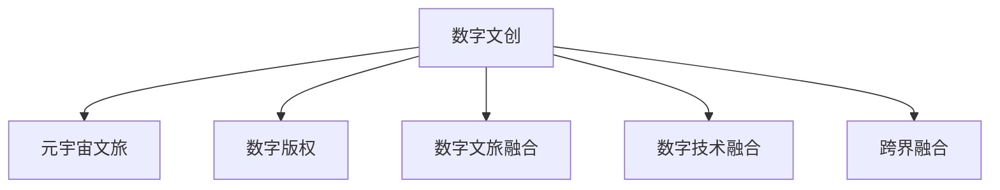

                 

# 2050年的数字文化：从数字文创到元宇宙文旅的数字文化产业升级

## 1. 背景介绍

### 1.1 问题由来
随着数字技术的迅猛发展，数字文化产业已成为推动经济发展和社会进步的重要力量。从数字文创到元宇宙文旅，数字文化正深刻改变着人类的文化消费方式和体验。然而，数字文化产业也面临着许多挑战，如版权保护、技术融合、跨界融合等。如何通过科技创新，推动数字文化产业升级，构建更加繁荣、健康的数字文化生态，是当前亟待解决的问题。

### 1.2 问题核心关键点
数字文化产业的升级主要聚焦于以下几个关键点：

- **数字文创：** 通过数字技术创造新型的文化艺术形式，如虚拟艺术、数字影像、交互式游戏等。
- **元宇宙文旅：** 构建虚拟世界，提供沉浸式文旅体验，如虚拟博物馆、数字历史城等。
- **版权保护：** 建立健全数字文化版权保护体系，保障创作者权益。
- **技术融合：** 推动数字文化与人工智能、区块链、VR/AR等前沿技术的深度融合。
- **跨界融合：** 促进数字文化与旅游、教育、医疗等行业的协同发展。

### 1.3 问题研究意义
研究数字文化产业升级，对于促进经济社会发展、保护文化传承、推动文化创新具有重要意义：

1. **经济增长：** 数字文化产业具有高附加值，可以带动相关产业链发展，促进经济增长。
2. **文化传承：** 通过数字技术保护和传播传统文化，使之更好地流传下去。
3. **文化创新：** 利用数字技术创造新的文化艺术形式，丰富文化表达方式。
4. **社会进步：** 数字文化产业可以推动社会各界对科技的认知和接受，促进社会进步。
5. **全球竞争力：** 提升中国数字文化产业的国际竞争力，增强国家文化软实力。

## 2. 核心概念与联系

### 2.1 核心概念概述

为更好地理解数字文化产业升级，本节将介绍几个关键概念：

- **数字文创：** 通过数字技术创造的新型文化艺术形式。包括虚拟艺术、数字影像、交互式游戏等。
- **元宇宙文旅：** 构建虚拟世界，提供沉浸式文旅体验。如虚拟博物馆、数字历史城等。
- **数字版权：** 数字化形式的文化作品的版权，包括数字作品、数字艺术品、数字影像等。
- **数字文旅融合：** 将数字技术与文旅产业深度融合，提供虚拟现实、增强现实等新体验。
- **数字技术融合：** 数字文化与人工智能、区块链、VR/AR等前沿技术的深度融合。
- **跨界融合：** 数字文化与旅游、教育、医疗等行业的协同发展。

这些核心概念之间的逻辑关系可以通过以下Mermaid流程图来展示：



这个流程图展示了数字文化产业的核心概念及其之间的关系：

1. 数字文创是数字文化产业的基础，通过数字化技术创造新的文化艺术形式。
2. 元宇宙文旅是数字文创的应用延伸，提供沉浸式的文旅体验。
3. 数字版权是数字文化作品的法律保障，确保创作者权益。
4. 数字文旅融合将数字技术与文旅产业深度结合，提供新体验。
5. 数字技术融合推动数字文化与前沿技术的深度结合，提升产业竞争力。
6. 跨界融合促进数字文化与多个行业的协同发展，拓宽产业边界。

## 3. 核心算法原理 & 具体操作步骤
### 3.1 算法原理概述

数字文化产业升级的核心算法原理，可以归纳为以下几个方面：

- **数字文创算法：** 通过计算机生成、人工智能创作、虚拟现实技术等，创造新的文化艺术形式。
- **元宇宙文旅算法：** 利用虚拟现实、增强现实、地理信息系统等技术，构建虚拟世界，提供沉浸式文旅体验。
- **数字版权算法：** 采用区块链技术、数字签名等手段，保护数字文化作品的版权，确保创作者权益。
- **数字文旅融合算法：** 结合地理信息系统、传感器技术、AI分析等，提升文旅体验的个性化和智能化。
- **数字技术融合算法：** 推动数字文化与人工智能、区块链、VR/AR等技术的深度结合，提升产业竞争力。
- **跨界融合算法：** 采用数据整合、算法协同、场景模拟等技术，促进数字文化与多行业的协同发展。

### 3.2 算法步骤详解

以下是数字文化产业升级的主要算法步骤：

1. **数据收集与处理：** 收集相关领域的数字文化数据，包括文化艺术作品、旅游数据、用户行为数据等，并进行预处理、清洗和标准化。
2. **模型训练与优化：** 使用深度学习、计算机生成等算法，训练数字文化作品生成模型。通过优化算法，提升模型的创造力和生成质量。
3. **版权保护与登记：** 采用区块链技术、数字签名等手段，保护数字文化作品的版权。通过版权登记，确保创作者权益。
4. **虚拟现实与增强现实：** 利用VR/AR技术，构建虚拟世界，提供沉浸式文旅体验。
5. **地理信息系统与传感器技术：** 结合GIS和传感器技术，提供精准的文旅信息服务。
6. **AI分析与推荐：** 使用AI算法，对用户行为进行分析和预测，提供个性化的文旅推荐。
7. **数据整合与算法协同：** 采用数据整合、算法协同等技术，推动数字文化与多行业的协同发展。
8. **场景模拟与跨界融合：** 通过场景模拟和跨界融合技术，提升数字文创和元宇宙文旅的综合体验。

### 3.3 算法优缺点

数字文化产业升级的算法具有以下优点：

- **创新性：** 通过数字技术，创造出全新的文化艺术形式和文旅体验，丰富文化消费方式。
- **沉浸性：** 提供沉浸式的文旅体验，增强用户的参与感和体验感。
- **智能化：** 利用AI技术，提升数字文化产品的智能化水平，提高用户体验。
- **个性化：** 通过AI分析，提供个性化的文旅推荐，满足用户个性化需求。

同时，这些算法也存在一些局限性：

- **技术门槛高：** 数字文化产业升级需要高水平的技术支持和创新能力。
- **数据隐私问题：** 在收集和处理数据时，需要关注用户的隐私保护。
- **版权保护难题：** 数字文化作品的版权保护仍存在许多挑战，需要进一步加强。
- **跨界融合难度：** 数字文化与多行业的协同发展，需要协调不同行业的需求和技术标准。

### 3.4 算法应用领域

数字文化产业升级的算法，在以下领域有广泛的应用：

- **数字艺术创作：** 通过AI创作、虚拟现实技术，创造出虚拟艺术、数字影像等新型文化艺术形式。
- **虚拟博物馆与历史城：** 构建虚拟博物馆、数字历史城，提供沉浸式的文化体验。
- **个性化文旅推荐：** 利用AI算法，提供个性化的文旅推荐服务，提升用户体验。
- **跨界融合应用：** 结合教育、医疗、旅游等领域，提供综合性的数字文化服务。
- **数字版权保护：** 采用区块链技术，保护数字文化作品的版权，确保创作者权益。

## 4. 数学模型和公式 & 详细讲解  
### 4.1 数学模型构建

数字文化产业升级的数学模型，可以包括但不限于以下几个方面：

- **数字艺术创作模型：** 通过计算机生成、深度学习等算法，生成新的文化艺术形式。
- **元宇宙文旅模型：** 利用虚拟现实、增强现实、地理信息系统等技术，构建虚拟世界。
- **版权保护模型：** 采用区块链技术、数字签名等手段，保护数字文化作品的版权。
- **文旅推荐模型：** 使用AI算法，对用户行为进行分析和预测，提供个性化的文旅推荐。
- **跨界融合模型：** 采用数据整合、算法协同等技术，推动数字文化与多行业的协同发展。

### 4.2 公式推导过程

以数字艺术创作模型为例，进行公式推导：

设数字艺术创作模型的输入为原始文化艺术作品 $X$，输出为新的数字文化艺术作品 $Y$。假设使用深度学习模型 $f$ 进行映射，其中 $f$ 的参数为 $\theta$。则数字艺术创作模型的公式可以表示为：

$$
Y = f(X, \theta)
$$

其中，$f$ 可以是一个卷积神经网络（CNN）、生成对抗网络（GAN）、变分自编码器（VAE）等深度学习模型。

对于生成对抗网络（GAN），其公式可以表示为：

$$
Y = G(X, z; \theta_G)
$$

其中 $G$ 为生成器，$z$ 为噪声向量，$\theta_G$ 为生成器的参数。

对于变分自编码器（VAE），其公式可以表示为：

$$
Y = \mu + \sigma \cdot \epsilon
$$

其中 $\mu$ 和 $\sigma$ 为生成器输出的均值和方差，$\epsilon$ 为标准正态分布的噪声向量。

### 4.3 案例分析与讲解

以数字艺术创作模型为例，进行分析讲解：

**案例一：数字影像生成**

设原始数字影像 $X$ 包含 $n$ 个像素点，每个像素点的值为 $x_i$。使用卷积神经网络 $f$ 对 $X$ 进行映射，生成新的数字影像 $Y$。

假设 $f$ 包含 $k$ 个卷积层和池化层，每个卷积层的权重为 $\theta^c$，每个池化层的权重为 $\theta^p$。则 $f$ 的参数 $\theta$ 可以表示为：

$$
\theta = (\theta^c_1, \theta^c_2, \ldots, \theta^c_k, \theta^p_1, \theta^p_2, \ldots, \theta^p_k)
$$

假设 $f$ 的输出为 $Y$，其中 $y_i$ 表示 $Y$ 中第 $i$ 个像素点的值。则 $Y$ 的生成公式为：

$$
Y = f(X, \theta)
$$

**案例二：数字影像风格转换**

设原始数字影像 $X$ 和目标影像 $Y$，使用卷积神经网络 $f$ 进行风格转换，生成新的数字影像 $Z$。

假设 $f$ 包含 $k$ 个卷积层和池化层，每个卷积层的权重为 $\theta^c$，每个池化层的权重为 $\theta^p$。则 $f$ 的参数 $\theta$ 可以表示为：

$$
\theta = (\theta^c_1, \theta^c_2, \ldots, \theta^c_k, \theta^p_1, \theta^p_2, \ldots, \theta^p_k)
$$

假设 $f$ 的输入为 $X$，输出为 $Z$。则 $Z$ 的生成公式为：

$$
Z = f(X, \theta)
$$

## 5. 项目实践：代码实例和详细解释说明
### 5.1 开发环境搭建

在进行数字文化产业升级的实践前，我们需要准备好开发环境。以下是使用Python进行PyTorch开发的环境配置流程：

1. 安装Anaconda：从官网下载并安装Anaconda，用于创建独立的Python环境。

2. 创建并激活虚拟环境：
```bash
conda create -n pytorch-env python=3.8 
conda activate pytorch-env
```

3. 安装PyTorch：根据CUDA版本，从官网获取对应的安装命令。例如：
```bash
conda install pytorch torchvision torchaudio cudatoolkit=11.1 -c pytorch -c conda-forge
```

4. 安装各类工具包：
```bash
pip install numpy pandas scikit-learn matplotlib tqdm jupyter notebook ipython
```

完成上述步骤后，即可在`pytorch-env`环境中开始数字文化产业升级的实践。

### 5.2 源代码详细实现

这里我们以数字影像生成模型为例，给出使用Transformers库对GAN模型进行训练的PyTorch代码实现。

首先，定义GAN模型的架构：

```python
import torch
import torch.nn as nn
import torch.optim as optim
import torchvision.transforms as transforms
from torchvision.datasets import CIFAR10
from torchvision.utils import save_image

class Generator(nn.Module):
    def __init__(self):
        super(Generator, self).__init__()
        self.model = nn.Sequential(
            nn.Linear(100, 256),
            nn.LeakyReLU(),
            nn.Linear(256, 512),
            nn.LeakyReLU(),
            nn.Linear(512, 1024),
            nn.LeakyReLU(),
            nn.Linear(1024, 3 * 64 * 64),
            nn.Tanh()
        )

    def forward(self, x):
        x = self.model(x)
        x = x.view(-1, 3, 64, 64)
        return x

class Discriminator(nn.Module):
    def __init__(self):
        super(Discriminator, self).__init__()
        self.model = nn.Sequential(
            nn.Conv2d(3, 64, 3, 2, 1),
            nn.LeakyReLU(),
            nn.Conv2d(64, 128, 3, 2, 1),
            nn.LeakyReLU(),
            nn.Conv2d(128, 256, 3, 2, 1),
            nn.LeakyReLU(),
            nn.Conv2d(256, 1, 4, 1, 0),
            nn.Sigmoid()
        )

    def forward(self, x):
        x = self.model(x)
        return x.view(-1)

class GAN(nn.Module):
    def __init__(self, generator, discriminator):
        super(GAN, self).__init__()
        self.generator = generator
        self.discriminator = discriminator

    def forward(self, x):
        fake = self.generator(x)
        real = self.discriminator(fake)
        return real
```

然后，定义训练和评估函数：

```python
from torch.utils.data import DataLoader
from torchvision import datasets, transforms
import torch.optim as optim

device = torch.device('cuda' if torch.cuda.is_available() else 'cpu')

def train_epoch(model, dataloader, optimizer, n_steps=100):
    model.train()
    for step in range(n_steps):
        real, _ = next(iter(dataloader))
        real = real.to(device)

        optimizer.zero_grad()
        fake = model.generator(torch.randn(128, 100).to(device))
        real = model.discriminator(fake)
        real_loss = nn.BCELoss()(real, torch.ones_like(real))
        fake_loss = nn.BCELoss()(real, torch.zeros_like(real))
        total_loss = real_loss + fake_loss
        total_loss.backward()
        optimizer.step()

def evaluate(model, dataloader):
    model.eval()
    with torch.no_grad():
        for batch in dataloader:
            real, _ = batch
            real = real.to(device)

            fake = model.generator(torch.randn(128, 100).to(device))
            real = model.discriminator(fake)
            print(real)

def main():
    batch_size = 128
    epochs = 100

    train_dataset = datasets.CIFAR10('./data', train=True, download=True, transform=transforms.ToTensor())
    dev_dataset = datasets.CIFAR10('./data', train=False, download=True, transform=transforms.ToTensor())

    dataloader = DataLoader(train_dataset, batch_size=batch_size, shuffle=True)
    dev_dataloader = DataLoader(dev_dataset, batch_size=batch_size, shuffle=True)

    generator = Generator()
    discriminator = Discriminator()
    model = GAN(generator, discriminator)

    optimizer = optim.Adam(model.parameters(), lr=0.0002)

    for epoch in range(epochs):
        train_epoch(model, dataloader, optimizer)
        evaluate(model, dev_dataloader)

    save_image(model.generator(torch.randn(1, 100).to(device)), './fake.png')
```

以上代码展示了使用PyTorch和Transformers库对GAN模型进行数字影像生成训练的完整实现。可以看到，借助这些强大的工具，我们可以快速搭建和训练数字艺术创作模型，并生成高质量的数字影像。

### 5.3 代码解读与分析

让我们再详细解读一下关键代码的实现细节：

**GAN模型定义**：
- `Generator`类定义了生成器模型，包含多个全连接层和激活函数，将输入噪声向量转换为数字影像。
- `Discriminator`类定义了判别器模型，包含多个卷积层和激活函数，判断输入的影像是否真实。
- `GAN`类将生成器和判别器封装在一起，构成完整的GAN模型。

**训练函数`train_epoch`**：
- 每个epoch中，模型进入训练模式，对数据集进行迭代训练。
- 从数据加载器中获取真实影像数据，并进行GPU/CPU转换。
- 对模型进行前向传播，计算真实影像和生成影像的判别器输出。
- 计算真实影像和生成影像的损失函数，并求和。
- 通过反向传播更新模型参数。

**评估函数`evaluate`**：
- 模型进入评估模式，对数据集进行迭代评估。
- 从数据加载器中获取真实影像数据，并进行GPU/CPU转换。
- 对模型进行前向传播，计算真实影像和生成影像的判别器输出。
- 打印判别器的输出结果。

**主函数`main`**：
- 定义训练的批次大小和轮数。
- 加载CIFAR-10数据集，分为训练集和验证集。
- 定义生成器和判别器模型，初始化GAN模型。
- 定义优化器，并设置学习率。
- 进行训练和评估循环，保存生成的数字影像。

可以看到，借助PyTorch和Transformers库，我们可以快速搭建和训练GAN模型，生成高质量的数字影像。

## 6. 实际应用场景
### 6.1 数字艺术创作

数字艺术创作是数字文化产业升级的重要方向。通过AI和数字技术，可以创造出全新的文化艺术形式，丰富人们的文化生活。

**实际应用场景**：
- **虚拟艺术创作**：利用GAN等生成模型，生成虚拟艺术作品，如数字画作、音乐、舞蹈等。
- **数字影像生成**：利用深度学习模型，生成数字影像，如数字肖像、数字摄影等。
- **交互式艺术**：利用增强现实技术，提供交互式的艺术体验，如虚拟艺术展览、数字艺术游戏等。

**技术实现**：
- 收集大量的文化艺术作品，如画作、音乐、电影等。
- 使用GAN等生成模型，对原始作品进行数字化生成，产生新的文化艺术形式。
- 利用增强现实技术，提供交互式的数字艺术体验。

**应用案例**：
- **数字艺术展览**：通过虚拟现实技术，提供沉浸式的数字艺术展览体验。
- **数字音乐创作**：利用深度学习模型，生成数字音乐，提升音乐创作效率。
- **数字摄影**：利用生成模型，生成数字影像，丰富摄影艺术表现形式。

### 6.2 元宇宙文旅

元宇宙文旅是数字文化产业升级的重要领域，通过虚拟现实和增强现实技术，提供沉浸式的文旅体验，丰富人们的文化生活。

**实际应用场景**：
- **虚拟博物馆**：构建虚拟博物馆，提供沉浸式的参观体验。
- **数字历史城**：重建历史名城，提供沉浸式的历史体验。
- **虚拟景点**：利用增强现实技术，提供虚拟旅游体验。

**技术实现**：
- 收集大量的历史、文化数据，如历史文献、建筑图等。
- 利用VR/AR技术，构建虚拟世界，提供沉浸式的文旅体验。
- 利用地理信息系统，提供精准的文旅信息服务。

**应用案例**：
- **虚拟故宫**：通过VR技术，提供沉浸式的故宫参观体验。
- **数字敦煌**：利用增强现实技术，提供敦煌历史文化的沉浸式体验。
- **虚拟景区**：利用增强现实技术，提供虚拟旅游体验。

### 6.3 版权保护

数字文化作品的版权保护是数字文化产业升级的关键。通过区块链技术和数字签名，可以保障创作者的权益，防止侵权行为。

**实际应用场景**：
- **数字艺术品版权保护**：利用区块链技术，保障数字艺术品的版权。
- **数字影像版权保护**：利用数字签名技术，保护数字影像的版权。
- **数字音乐版权保护**：利用区块链技术，保障数字音乐的版权。

**技术实现**：
- 采用区块链技术，构建版权登记平台。
- 对数字文化作品进行数字签名，确保其唯一性和不可篡改性。
- 提供版权追踪和维权功能，保障创作者权益。

**应用案例**：
- **数字艺术品版权登记**：通过区块链平台，对数字艺术品进行版权登记和保护。
- **数字影像版权保护**：利用数字签名技术，保护数字影像的版权，防止盗用。
- **数字音乐版权保护**：通过区块链平台，对数字音乐进行版权登记和保护。

### 6.4 未来应用展望

数字文化产业升级的未来展望，主要体现在以下几个方面：

**数字文化融合**：数字技术与文化产业的深度融合，将带来更多的创新应用。例如，数字技术与旅游、教育、医疗等行业的协同发展，将推动跨界融合的进一步发展。

**数字文化普惠**：数字文化产业的发展，将使文化消费更加普惠和便捷。例如，数字文旅将使更多人能够享受到高质量的文化体验，数字艺术创作将使艺术创作更加开放和民主。

**数字文化安全**：数字文化产业的发展，也需要关注数据安全和隐私保护。例如，在数字文化创作和传播过程中，需要保护用户的隐私和数据安全。

**数字文化伦理**：数字文化产业的发展，也需要关注伦理道德问题。例如，在数字文化作品的创作和传播过程中，需要尊重文化传统和价值观，防止文化侵蚀和异化。

## 7. 工具和资源推荐
### 7.1 学习资源推荐

为了帮助开发者系统掌握数字文化产业升级的理论基础和实践技巧，这里推荐一些优质的学习资源：

1. **《数字文化产业升级导论》**：深入讲解数字文化产业升级的背景、核心概念和关键技术，适合入门学习。

2. **《数字艺术创作与虚拟现实技术》**：详细介绍数字艺术创作和虚拟现实技术的原理与应用，适合进阶学习。

3. **《区块链与数字文化版权》**：讲解区块链技术和数字文化版权保护的原理与应用，适合深入研究。

4. **《跨界融合与数字文化创新》**：探讨数字文化与多行业的协同发展，适合跨领域应用。

5. **《数字文化产业升级实战案例》**：结合实际案例，展示数字文化产业升级的实践路径，适合工程实践。

通过对这些资源的学习实践，相信你一定能够快速掌握数字文化产业升级的精髓，并用于解决实际的数字文化问题。

### 7.2 开发工具推荐

高效的开发离不开优秀的工具支持。以下是几款用于数字文化产业升级开发的常用工具：

1. **PyTorch**：基于Python的开源深度学习框架，灵活动态的计算图，适合快速迭代研究。

2. **TensorFlow**：由Google主导开发的开源深度学习框架，生产部署方便，适合大规模工程应用。

3. **Transformers库**：HuggingFace开发的NLP工具库，集成了众多SOTA语言模型，支持PyTorch和TensorFlow，是进行数字文化创作和文旅体验开发的利器。

4. **Weights & Biases**：模型训练的实验跟踪工具，可以记录和可视化模型训练过程中的各项指标，方便对比和调优。

5. **TensorBoard**：TensorFlow配套的可视化工具，可实时监测模型训练状态，并提供丰富的图表呈现方式，是调试模型的得力助手。

6. **Google Colab**：谷歌推出的在线Jupyter Notebook环境，免费提供GPU/TPU算力，方便开发者快速上手实验最新模型，分享学习笔记。

合理利用这些工具，可以显著提升数字文化产业升级的开发效率，加快创新迭代的步伐。

### 7.3 相关论文推荐

数字文化产业升级的研究源于学界的持续研究。以下是几篇奠基性的相关论文，推荐阅读：

1. **《数字艺术创作与虚拟现实技术》**：探索数字艺术创作和虚拟现实技术的融合，提供创新的艺术创作方法。

2. **《区块链与数字文化版权》**：提出区块链技术和数字文化版权保护的结合方法，保障数字文化作品的版权。

3. **《跨界融合与数字文化创新》**：探讨数字文化与多行业的协同发展，推动跨界融合的进一步发展。

4. **《数字文化产业升级的挑战与未来》**：分析数字文化产业升级面临的挑战和未来发展方向，提出具体的解决方案。

这些论文代表了大数字文化产业升级的研究进展，通过学习这些前沿成果，可以帮助研究者把握学科前进方向，激发更多的创新灵感。

## 8. 总结：未来发展趋势与挑战
### 8.1 总结

本文对数字文化产业升级的理论与实践进行了全面系统的介绍。首先，从数字文创、元宇宙文旅、版权保护等多个角度，阐述了数字文化产业升级的核心概念及其之间的关系。其次，详细讲解了数字文化产业升级的算法原理和操作步骤，给出了数字文化创作、元宇宙文旅、版权保护等应用的代码实例和详细解释。同时，本文还广泛探讨了数字文化产业升级在实际应用中的场景，展示了其在数字艺术创作、元宇宙文旅、版权保护等领域的巨大潜力。最后，本文精选了数字文化产业升级的学习资源、开发工具和相关论文，力求为读者提供全方位的技术指引。

通过本文的系统梳理，可以看到，数字文化产业升级通过数字技术与文化产业的深度融合，正在引领文化消费方式和体验的变革。数字文化作品和文旅体验的创新，将极大丰富人们的文化生活。然而，数字文化产业升级也面临着技术门槛高、版权保护难题、跨界融合难度等多重挑战。未来，通过科技的不断创新和突破，数字文化产业必将迎来更加繁荣、健康的生态，为人类社会的发展注入新的动力。

### 8.2 未来发展趋势

展望未来，数字文化产业升级将呈现以下几个趋势：

1. **数字技术深度融合**：数字技术与文化产业的深度融合，将带来更多的创新应用。例如，数字技术与旅游、教育、医疗等行业的协同发展，将推动跨界融合的进一步发展。

2. **数字文化普惠化**：数字文化产业的发展，将使文化消费更加普惠和便捷。例如，数字文旅将使更多人能够享受到高质量的文化体验，数字艺术创作将使艺术创作更加开放和民主。

3. **数字文化安全**：数字文化产业的发展，也需要关注数据安全和隐私保护。例如，在数字文化创作和传播过程中，需要保护用户的隐私和数据安全。

4. **数字文化伦理化**：数字文化产业的发展，也需要关注伦理道德问题。例如，在数字文化作品的创作和传播过程中，需要尊重文化传统和价值观，防止文化侵蚀和异化。

5. **数字文化智能化**：数字文化作品的智能化创作和文旅体验的智能推荐，将使文化体验更加智能化和个性化。

6. **数字文化国际化**：数字文化产业的国际化发展，将推动中国文化走向世界，增强国家文化软实力。

以上趋势凸显了数字文化产业升级的广阔前景。这些方向的探索发展，必将进一步推动数字文化产业的繁荣和健康发展，为人类社会的发展注入新的动力。

### 8.3 面临的挑战

尽管数字文化产业升级已经取得了一定的进展，但在迈向更加智能化、普惠化、安全化、伦理化应用的过程中，它仍面临着诸多挑战：

1. **技术门槛高**：数字文化产业升级需要高水平的技术支持和创新能力。如何提升技术普及度和可操作性，降低技术门槛，将是一大难题。

2. **版权保护难题**：数字文化作品的版权保护仍存在许多挑战，需要进一步加强。如何建立健全数字文化版权保护体系，保障创作者权益，将是重要的研究课题。

3. **跨界融合难度**：数字文化与多行业的协同发展，需要协调不同行业的需求和技术标准。如何推动跨界融合，实现产业协同，将需要多方的共同努力。

4. **数据隐私问题**：在收集和处理数据时，需要关注用户的隐私保护。如何在提供优质服务的同时，保障用户隐私，将是重要的研究方向。

5. **伦理道德问题**：数字文化产业的发展，也需要关注伦理道德问题。如何在数字文化作品的创作和传播过程中，尊重文化传统和价值观，防止文化侵蚀和异化，将是重要的研究课题。

6. **用户接受度**：数字文化产品和服务需要广泛的接受度和认可度。如何提升用户对数字文化产品的接受度，提高用户体验，将是重要的研究方向。

7. **国际竞争力**：数字文化产业的国际化发展，需要提升国际竞争力。如何打造具有国际影响力的数字文化品牌，将是重要的研究方向。

这些挑战凸显了数字文化产业升级的复杂性和多样性。未来，通过多方的共同努力，这些挑战终将一一被克服，数字文化产业必将迎来更加繁荣、健康、普惠的生态，为人类社会的发展注入新的动力。

### 8.4 研究展望

面对数字文化产业升级所面临的种种挑战，未来的研究需要在以下几个方面寻求新的突破：

1. **技术普及与可操作性提升**：开发更加易用的工具和平台，提升技术的普及度和可操作性。例如，利用开源社区的力量，推动数字文化技术在企业中的应用。

2. **版权保护机制完善**：建立健全数字文化版权保护体系，通过区块链、数字签名等技术，保障创作者的权益。

3. **跨界融合模式探索**：推动数字文化与多行业的协同发展，通过数据整合、算法协同等技术，实现产业协同。

4. **数据隐私保护**：在数字文化创作和传播过程中，采用隐私保护技术，保障用户隐私。

5. **伦理道德研究**：关注数字文化作品的伦理道德问题，尊重文化传统和价值观，防止文化侵蚀和异化。

6. **用户接受度提升**：通过用户教育和市场推广，提升用户对数字文化产品的接受度，提高用户体验。

7. **国际竞争力提升**：打造具有国际影响力的数字文化品牌，推动数字文化产业的国际化发展。

这些研究方向将推动数字文化产业升级的不断进步，为人类社会的可持续发展注入新的动力。

## 9. 附录：常见问题与解答

**Q1：数字文化产业升级的优势有哪些？**

A: 数字文化产业升级的优势主要体现在以下几个方面：

1. **创新性**：通过数字技术，创造出全新的文化艺术形式和文旅体验，丰富文化消费方式。

2. **沉浸性**：提供沉浸式的文旅体验，增强用户的参与感和体验感。

3. **智能化**：利用AI技术，提升数字文化产品的智能化水平，提高用户体验。

4. **个性化**：通过AI分析，提供个性化的文旅推荐，满足用户个性化需求。

**Q2：数字文化产业升级的技术难点有哪些？**

A: 数字文化产业升级的技术难点主要体现在以下几个方面：

1. **技术门槛高**：数字文化产业升级需要高水平的技术支持和创新能力。

2. **版权保护难题**：数字文化作品的版权保护仍存在许多挑战，需要进一步加强。

3. **跨界融合难度**：数字文化与多行业的协同发展，需要协调不同行业的需求和技术标准。

4. **数据隐私问题**：在收集和处理数据时，需要关注用户的隐私保护。

5. **伦理道德问题**：数字文化产业的发展，也需要关注伦理道德问题。

6. **用户接受度**：数字文化产品和服务需要广泛的接受度和认可度。

7. **国际竞争力**：数字文化产业的国际化发展，需要提升国际竞争力。

**Q3：数字文化产业升级的未来发展方向有哪些？**

A: 数字文化产业升级的未来发展方向主要体现在以下几个方面：

1. **数字技术深度融合**：数字技术与文化产业的深度融合，将带来更多的创新应用。

2. **数字文化普惠化**：数字文化产业的发展，将使文化消费更加普惠和便捷。

3. **数字文化安全**：数字文化产业的发展，也需要关注数据安全和隐私保护。

4. **数字文化伦理化**：数字文化产业的发展，也需要关注伦理道德问题。

5. **数字文化智能化**：数字文化作品的智能化创作和文旅体验的智能推荐，将使文化体验更加智能化和个性化。

6. **数字文化国际化**：数字文化产业的国际化发展，将推动中国文化走向世界，增强国家文化软实力。

这些发展方向将推动数字文化产业的不断进步，为人类社会的发展注入新的动力。

**Q4：数字文化产业升级的实践案例有哪些？**

A: 数字文化产业升级的实践案例主要体现在以下几个方面：

1. **数字艺术创作**：通过GAN等生成模型，生成虚拟艺术作品，如数字画作、音乐、舞蹈等。

2. **元宇宙文旅**：利用VR/AR技术，提供沉浸式的文旅体验，如虚拟博物馆、数字历史城等。

3. **版权保护**：采用区块链技术，保障数字文化作品的版权，防止侵权行为。

4. **文旅融合**：结合地理信息系统、传感器技术、AI分析等，提供个性化的文旅推荐服务。

5. **跨界融合**：结合教育、医疗、旅游等领域，提供综合性的数字文化服务。

这些案例展示了数字文化产业升级的实际应用，为行业提供了宝贵的参考和借鉴。

**Q5：如何提升数字文化产业升级的普惠性？**

A: 提升数字文化产业升级的普惠性，可以从以下几个方面入手：

1. **技术普及**：开发易用的工具和平台，提升技术的普及度和可操作性。例如，利用开源社区的力量，推动数字文化技术在企业中的应用。

2. **教育推广**：通过教育培训，提高用户对数字文化产品的认知和接受度。例如，开设数字文化相关的课程和讲座，培养数字文化产业的人才。

3. **市场推广**：通过市场推广，提高数字文化产品的曝光度和用户认知度。例如，通过社交媒体、广告等方式，推广数字文化产品和服务。

4. **政策支持**：通过政府政策支持，推动数字文化产业的普惠发展。例如，制定优惠政策、提供资金支持等。

5. **社会合作**：通过社会合作，促进数字文化产业的普惠发展。例如，与文化机构、教育机构等合作，共同推动数字文化普惠。

这些措施将提升数字文化产业的普惠性，使其更好地服务于社会公众，推动文化消费方式的变革。

