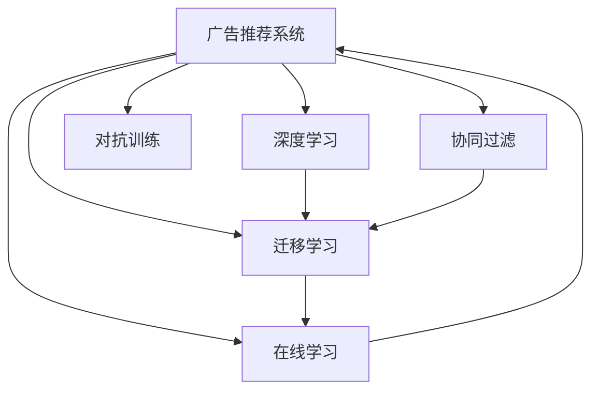

                 

# 广告推荐的未来：大模型的潜力

> 关键词：广告推荐,大模型,个性化推荐系统,协同过滤,深度学习,推荐算法,迁移学习,在线学习

## 1. 背景介绍

### 1.1 问题由来

在互联网时代，广告推荐已经成为各大平台获取收益的重要方式。通过算法预测用户的兴趣，精准推送个性化的广告内容，不仅能够提升用户体验，还能带来丰厚的商业回报。然而，随着用户行为的多样化以及广告市场的竞争加剧，传统的广告推荐系统已经难以满足用户对个性化广告的需求。

大模型的发展为广告推荐带来了新的思路。大模型通常指那些基于深度学习技术，包含数亿甚至数十亿参数的巨大神经网络模型。这些模型通过大规模无监督学习，具备强大的特征提取和泛化能力，可以在广告推荐中发挥巨大的作用。本文将探讨大模型在广告推荐中的应用潜力，以及其背后的方法论和技术框架。

### 1.2 问题核心关键点

大模型在广告推荐中的应用主要体现在以下几个方面：

1. **个性化推荐**：通过深度学习技术，大模型可以从用户的历史行为、兴趣偏好、社交关系等多维度数据中挖掘出深层次的个性化特征，实现精准推荐。

2. **多模态融合**：除了文本数据，大模型还可以利用图像、音频、视频等多种模态数据，提升广告推荐的丰富性和多样性。

3. **动态更新**：大模型具备在线学习的能力，可以通过实时数据持续更新和优化，保持广告推荐系统的时效性和准确性。

4. **迁移学习**：大模型在预训练阶段学习到的通用特征，可以在广告推荐等特定任务上进行微调，提升广告推荐的性能。

5. **对抗训练**：大模型通过对抗训练，提高广告推荐系统的鲁棒性和抗干扰能力，避免遭受恶意攻击和数据污染。

### 1.3 问题研究意义

大模型在广告推荐中的应用，对于提升广告效果、优化用户体验、提升平台收益等方面具有重要意义：

1. **提升广告效果**：通过个性化推荐，大模型能够更好地理解用户需求，提供符合预期的广告内容，提升广告点击率和转化率。

2. **优化用户体验**：大模型能够根据用户行为和偏好，动态调整广告展示方式，减少广告对用户的打扰，提升用户体验。

3. **提升平台收益**：精准的广告推荐能够有效提升广告转化率和点击率，带来更高的商业收益。

4. **推动技术创新**：大模型技术的引入，推动了推荐算法、迁移学习等技术的创新和应用，为广告推荐系统的发展提供了新的方向。

## 2. 核心概念与联系

### 2.1 核心概念概述

为了更好地理解大模型在广告推荐中的应用，本节将介绍几个关键概念及其之间的联系：

- **广告推荐系统(Ad-based Recommendation System)**：通过预测用户对广告的兴趣，向用户推荐个性化广告的系统。

- **深度学习(Deep Learning)**：一种基于神经网络的机器学习方法，通过多层次的非线性映射，实现对复杂数据的深度特征提取。

- **协同过滤(Collaborative Filtering)**：一种基于用户历史行为和用户相似性度量的推荐算法，常用于推荐系统中的广告推荐。

- **迁移学习(Transfer Learning)**：一种通过在预训练模型基础上进行微调的方法，提升模型在特定任务上的性能。

- **在线学习(Online Learning)**：一种在数据流中实时更新模型参数的机器学习方法，适用于广告推荐系统的动态优化。

- **对抗训练(Adversarial Training)**：一种通过引入对抗样本，提高模型鲁棒性的技术，应用于广告推荐系统的安全防护。

这些概念通过以下Mermaid流程图展示其联系：



此流程图展示了广告推荐系统如何通过深度学习、协同过滤、迁移学习、在线学习和对抗训练等方法，进行广告推荐的各个环节。

## 3. 核心算法原理 & 具体操作步骤

### 3.1 算法原理概述

基于大模型的广告推荐系统主要包含两个阶段：预训练和微调。

在预训练阶段，大模型通常使用大规模无监督数据进行训练，学习到丰富的特征表示。这些特征表示不仅能够捕捉用户行为的多样性，还能够通过迁移学习应用于广告推荐任务中。

在微调阶段，大模型被加载到广告推荐系统中，通过标注数据进行有监督学习，调整模型的输出以适应特定的广告推荐任务。微调可以采用多种优化策略，如梯度下降、Adam等，确保模型在数据流中实时更新和优化。

### 3.2 算法步骤详解

基于大模型的广告推荐系统主要包含以下步骤：

**Step 1: 准备数据集**

- 收集广告推荐任务所需的数据集，包括用户历史行为数据、广告特征数据、用户兴趣标签等。

**Step 2: 设计预训练模型**

- 选择合适的预训练模型，如BERT、GPT等，对其进行加载和初始化。

**Step 3: 预训练**

- 使用大规模无监督数据对预训练模型进行训练，学习到通用特征表示。

**Step 4: 微调**

- 在广告推荐数据集上，对预训练模型进行微调，优化广告推荐效果。

**Step 5: 部署**

- 将微调后的模型部署到广告推荐系统中，进行实时广告推荐。

### 3.3 算法优缺点

基于大模型的广告推荐系统具有以下优点：

1. **高精度**：大模型能够从大量数据中学习到丰富的特征表示，提升广告推荐的精准度。

2. **泛化能力强**：大模型通过迁移学习，将通用特征应用于特定的广告推荐任务，提升模型的泛化能力。

3. **实时更新**：大模型具备在线学习的能力，能够根据实时数据动态调整模型参数，保持广告推荐的时效性。

4. **鲁棒性强**：大模型通过对抗训练，提升模型的鲁棒性和抗干扰能力，保障广告推荐系统的安全。

但同时，基于大模型的广告推荐系统也存在一些缺点：

1. **计算资源需求高**：大模型的训练和推理需要大量的计算资源，成本较高。

2. **模型复杂度高**：大模型的结构复杂，训练和推理过程较为耗时，需要较强的计算能力支持。

3. **数据隐私问题**：广告推荐系统中涉及大量用户行为数据，需要严格保护用户隐私。

### 3.4 算法应用领域

基于大模型的广告推荐系统广泛应用于以下领域：

- **电商平台广告推荐**：利用大模型预测用户对商品的兴趣，进行个性化广告推荐。

- **视频平台广告推荐**：通过大模型分析用户的观看行为和偏好，推荐相关视频广告。

- **社交媒体广告推荐**：利用大模型分析用户的社交关系和兴趣，推荐个性化广告。

- **新闻媒体广告推荐**：根据用户的阅读行为和兴趣标签，推荐相关新闻广告。

- **智能电视广告推荐**：通过大模型分析用户的观看历史和偏好，推荐智能电视广告。

以上领域只是大模型在广告推荐中的一部分应用，随着技术的不断进步，大模型将在更多场景下发挥重要作用。

## 4. 数学模型和公式 & 详细讲解 & 举例说明

### 4.1 数学模型构建

广告推荐系统的目标是根据用户的历史行为和当前兴趣，预测用户对广告的兴趣度。假设用户的历史行为表示为 $x$，广告特征表示为 $y$，用户对广告的兴趣度表示为 $z$，则模型的目标函数为：

$$
\min_{\theta} \mathcal{L}(y, \theta) = \frac{1}{N} \sum_{i=1}^N \mathcal{L}_{i}(y_i, \theta)
$$

其中，$\mathcal{L}_i(y_i, \theta)$ 表示第 $i$ 个样本的损失函数，$N$ 表示样本数量。

### 4.2 公式推导过程

假设模型 $M_{\theta}$ 通过多层神经网络实现，每个神经元的输出为 $f_i(x) = \sum_{j=1}^{n} w_{ij} x_j + b_i$，其中 $w_{ij}$ 为权重矩阵，$b_i$ 为偏置向量。

则广告推荐模型的预测值为：

$$
z = M_{\theta}(x, y) = \sigma\left(\sum_{i=1}^{d} w_i y_i + b\right)
$$

其中，$\sigma$ 为激活函数，$w_i$ 为可学习的权重向量，$b$ 为偏置项。

假设用户的真实兴趣度为 $y_t$，则模型的平均损失函数为：

$$
\mathcal{L} = \frac{1}{N} \sum_{i=1}^N \left[ -y_t \log \left( \frac{1}{1 + e^{-z}} \right) - (1 - y_t) \log \left( \frac{e^{-z}}{1 + e^{-z}} \right) \right]
$$

其中，$y_t = 1$ 表示用户对广告感兴趣，$y_t = 0$ 表示用户对广告不感兴趣。

### 4.3 案例分析与讲解

以电商平台广告推荐为例，假设电商平台有 $N$ 个用户和 $M$ 个商品，每个用户对商品的兴趣度表示为一个向量 $x \in R^{N \times M}$，广告特征表示为一个向量 $y \in R^{M \times d}$，其中 $d$ 为广告特征维度。

假设用户对商品 $i$ 的兴趣度为 $x_i$，广告 $j$ 的特征向量为 $y_j$，则模型的预测值为：

$$
z_{ij} = M_{\theta}(x_i, y_j) = \sigma\left(\sum_{i=1}^{d} w_i y_j + b\right)
$$

其中，$w_i$ 为商品 $i$ 的权重向量，$b$ 为偏置项。

假设用户对商品 $i$ 的真实兴趣度为 $y_{ti}$，则模型的平均损失函数为：

$$
\mathcal{L} = \frac{1}{N} \sum_{i=1}^N \left[ -y_{ti} \log \left( \frac{1}{1 + e^{-z_{it}}} \right) - (1 - y_{ti}) \log \left( \frac{e^{-z_{it}}}{1 + e^{-z_{it}}} \right) \right]
$$

通过对该损失函数进行优化，即可训练得到广告推荐模型。

## 5. 项目实践：代码实例和详细解释说明

### 5.1 开发环境搭建

在进行广告推荐系统开发前，需要先准备好开发环境。以下是使用Python进行TensorFlow开发的环境配置流程：

1. 安装Anaconda：从官网下载并安装Anaconda，用于创建独立的Python环境。

2. 创建并激活虚拟环境：
```bash
conda create -n tf-env python=3.8 
conda activate tf-env
```

3. 安装TensorFlow：根据CUDA版本，从官网获取对应的安装命令。例如：
```bash
pip install tensorflow
```

4. 安装其他依赖库：
```bash
pip install numpy pandas scikit-learn jupyter notebook ipython
```

完成上述步骤后，即可在`tf-env`环境中开始广告推荐系统的开发。

### 5.2 源代码详细实现

下面我们以电商平台广告推荐为例，给出使用TensorFlow对深度学习模型进行训练和微调的PyTorch代码实现。

首先，定义广告推荐系统的训练数据：

```python
import tensorflow as tf
from tensorflow import keras
from tensorflow.keras import layers

# 定义训练数据集
train_data = tf.data.Dataset.from_tensor_slices((
    x_train,
    y_train))
train_data = train_data.batch(batch_size, drop_remainder=True)

# 定义验证数据集
val_data = tf.data.Dataset.from_tensor_slices((
    x_val,
    y_val))
val_data = val_data.batch(batch_size, drop_remainder=True)

# 定义测试数据集
test_data = tf.data.Dataset.from_tensor_slices((
    x_test,
    y_test))
test_data = test_data.batch(batch_size, drop_remainder=True)
```

然后，定义深度学习模型：

```python
model = keras.Sequential([
    layers.Dense(128, activation='relu'),
    layers.Dense(1, activation='sigmoid')
])
```

接着，定义优化器和损失函数：

```python
optimizer = keras.optimizers.Adam(learning_rate=0.001)
loss_fn = keras.losses.BinaryCrossentropy(from_logits=True)
```

最后，定义训练和评估函数：

```python
@tf.function
def train_step(x, y):
    with tf.GradientTape() as tape:
        logits = model(x, training=True)
        loss_value = loss_fn(y, logits)
    gradients = tape.gradient(loss_value, model.trainable_variables)
    optimizer.apply_gradients(zip(gradients, model.trainable_variables))

@tf.function
def evaluate(x, y):
    logits = model(x, training=False)
    loss_value = loss_fn(y, logits)
    return loss_value
```

开始训练和评估：

```python
epochs = 10
batch_size = 32

for epoch in range(epochs):
    for x, y in train_data:
        train_step(x, y)

    val_loss = evaluate(x_val, y_val)
    print(f'Epoch {epoch+1}, validation loss: {val_loss.numpy()}')
    
print(f'Final validation loss: {val_loss.numpy()}')
```

以上就是使用TensorFlow对深度学习模型进行广告推荐系统训练的完整代码实现。可以看到，利用TensorFlow，我们可以方便地构建、训练和评估深度学习模型，实现广告推荐系统的自动化和可扩展性。

### 5.3 代码解读与分析

让我们再详细解读一下关键代码的实现细节：

**数据处理**：
- 使用TensorFlow的`tf.data.Dataset`类，将数据集转换为张量形式，并进行批处理。
- `drop_remainder=True`参数确保每个批次的数据大小相同，避免最后不完整批次的数据。

**模型定义**：
- 使用`keras.Sequential`类定义一个多层感知器模型，包含两个全连接层。
- 第一层包含128个神经元，使用ReLU激活函数。
- 第二层输出一个神经元，使用Sigmoid激活函数。

**优化器和损失函数**：
- 使用`keras.optimizers.Adam`定义Adam优化器，学习率为0.001。
- 使用`keras.losses.BinaryCrossentropy`定义二元交叉熵损失函数，适用于二分类问题。

**训练和评估函数**：
- 使用`tf.function`装饰器定义训练和评估函数，编译为TensorFlow可执行函数。
- `train_step`函数中，使用`tf.GradientTape`记录梯度，通过`optimizer.apply_gradients`更新模型参数。
- `evaluate`函数中，直接计算损失函数，不更新模型参数。

**训练流程**：
- 定义训练轮数和批次大小。
- 在每个epoch中，遍历训练数据集，每个批次进行一次前向传播和反向传播。
- 在每个epoch后，评估验证集上的损失值，并输出结果。

可以看到，使用TensorFlow进行广告推荐系统的开发，可以大大简化模型构建和训练过程，提高开发效率。TensorFlow的自动微分和优化器等功能，使得模型训练和评估变得更为便捷和高效。

## 6. 实际应用场景

### 6.1 电商广告推荐

电商平台利用大模型进行广告推荐，可以有效提升广告点击率和转化率，带来更高的商业收益。

具体而言，可以收集用户的历史浏览、购买、评价等行为数据，将用户对商品的不同维度特征进行编码。通过大模型对这些特征进行学习，预测用户对广告的兴趣度。将用户对广告的兴趣度映射到广告投放策略上，实现精准的广告推荐。

### 6.2 视频平台广告推荐

视频平台可以利用大模型分析用户的观看行为和偏好，进行相关视频的广告推荐。

具体而言，可以收集用户观看视频的历史数据，包括视频的类型、时长、观看时间等。通过大模型对这些数据进行学习，预测用户对相关广告的兴趣度。将用户对广告的兴趣度映射到广告投放策略上，实现精准的广告推荐。

### 6.3 社交媒体广告推荐

社交媒体可以利用大模型分析用户的社交关系和兴趣偏好，进行个性化广告推荐。

具体而言，可以收集用户的社交网络数据，包括好友关系、点赞、评论等。通过大模型对这些数据进行学习，预测用户对广告的兴趣度。将用户对广告的兴趣度映射到广告投放策略上，实现精准的广告推荐。

### 6.4 新闻媒体广告推荐

新闻媒体可以利用大模型分析用户的阅读行为和兴趣标签，进行相关新闻的广告推荐。

具体而言，可以收集用户的阅读历史和兴趣标签，包括新闻类型、主题、关键词等。通过大模型对这些数据进行学习，预测用户对相关广告的兴趣度。将用户对广告的兴趣度映射到广告投放策略上，实现精准的广告推荐。

### 6.5 智能电视广告推荐

智能电视可以利用大模型分析用户的观看历史和兴趣偏好，进行相关广告推荐。

具体而言，可以收集用户的观看历史数据，包括观看的电视剧、电影、综艺等。通过大模型对这些数据进行学习，预测用户对相关广告的兴趣度。将用户对广告的兴趣度映射到广告投放策略上，实现精准的广告推荐。

## 7. 工具和资源推荐

### 7.1 学习资源推荐

为了帮助开发者系统掌握大模型在广告推荐中的应用，这里推荐一些优质的学习资源：

1. 《深度学习框架TensorFlow》系列博文：由大模型技术专家撰写，深入浅出地介绍了TensorFlow的使用方法和广告推荐系统开发的详细流程。

2. 《广告推荐系统实战》课程：由知名在线教育平台开设，涵盖广告推荐系统的经典算法和实际案例，适合实战型开发者。

3. 《自然语言处理与深度学习》书籍：涵盖了自然语言处理和深度学习的基础知识和应用案例，包括广告推荐系统在内的多种推荐算法。

4. Google AdWords广告推荐系统：谷歌推出的广告推荐系统，具备大规模数据处理和实时推荐能力，值得学习参考。

5. Facebook News Feed算法：Facebook推出的个性化推荐算法，通过深度学习和协同过滤实现高效推荐，具有极高的研究价值。

通过学习这些资源，相信你一定能够快速掌握大模型在广告推荐中的应用，并用于解决实际的广告推荐问题。

### 7.2 开发工具推荐

高效的开发离不开优秀的工具支持。以下是几款用于广告推荐系统开发的常用工具：

1. TensorFlow：由谷歌主导开发的开源深度学习框架，生产部署方便，适合大规模工程应用。

2. PyTorch：基于Python的开源深度学习框架，灵活动态的计算图，适合快速迭代研究。

3. Weights & Biases：模型训练的实验跟踪工具，可以记录和可视化模型训练过程中的各项指标，方便对比和调优。

4. Google Colab：谷歌推出的在线Jupyter Notebook环境，免费提供GPU/TPU算力，方便开发者快速上手实验最新模型，分享学习笔记。

合理利用这些工具，可以显著提升广告推荐系统的开发效率，加快创新迭代的步伐。

### 7.3 相关论文推荐

大模型在广告推荐中的应用源于学界的持续研究。以下是几篇奠基性的相关论文，推荐阅读：

1. Deep Personalized News Recommendation Using Memory Network：提出基于记忆网络的个性化新闻推荐模型，利用深度学习技术提升广告推荐精度。

2. Neural Collaborative Filtering：提出基于神经网络的协同过滤方法，提升广告推荐系统的准确性和效率。

3. Neural Adaptive Model for Ad-click Prediction：提出基于神经网络的用户点击率预测模型，利用深度学习技术实现广告推荐。

4. Attention is All You Need（即Transformer原论文）：提出了Transformer结构，开启了广告推荐系统的预训练范式，提升了模型的泛化能力和推荐效果。

5. Learning Dynamic Interactions for Recommendation with Relevance Feedback：提出基于交互反馈的学习方法，提升广告推荐系统的实时性和鲁棒性。

这些论文代表了大模型在广告推荐技术的发展脉络。通过学习这些前沿成果，可以帮助研究者把握学科前进方向，激发更多的创新灵感。

## 8. 总结：未来发展趋势与挑战

### 8.1 总结

本文对大模型在广告推荐中的应用进行了全面系统的介绍。首先阐述了大模型和广告推荐系统的研究背景和意义，明确了大模型在广告推荐中的潜力和价值。其次，从原理到实践，详细讲解了大模型在广告推荐中的核心算法和操作步骤，给出了广告推荐系统开发的完整代码实例。同时，本文还广泛探讨了大模型在电商、视频、社交媒体、新闻媒体等多个领域的应用前景，展示了大模型技术的广阔前景。

通过本文的系统梳理，可以看到，大模型在广告推荐中的应用前景广阔，已经在多个实际场景中得到广泛应用。未来，伴随大模型技术的不断进步，广告推荐系统必将迎来新的突破和发展，为各大平台带来更高的商业价值。

### 8.2 未来发展趋势

展望未来，大模型在广告推荐中的应用将呈现以下几个发展趋势：

1. **高精度**：随着大模型的不断优化，广告推荐系统的精度将持续提升，为用户提供更加精准的广告推荐。

2. **多模态融合**：大模型将融合视觉、音频、文本等多种模态数据，提升广告推荐的丰富性和多样性。

3. **实时更新**：大模型具备在线学习的能力，能够根据实时数据动态调整模型参数，保持广告推荐的时效性。

4. **鲁棒性强**：大模型通过对抗训练，提升广告推荐系统的鲁棒性和抗干扰能力，保障广告推荐系统的安全。

5. **跨领域应用**：大模型将在更多领域得到应用，如医疗、金融、教育等，推动人工智能技术的全面发展。

以上趋势凸显了大模型在广告推荐中的广阔前景。这些方向的探索发展，必将进一步提升广告推荐系统的性能和应用范围，为各大平台带来更高的商业价值。

### 8.3 面临的挑战

尽管大模型在广告推荐中的应用已经取得了一定的成果，但在迈向更加智能化、普适化应用的过程中，它仍面临着诸多挑战：

1. **计算资源瓶颈**：大模型的训练和推理需要大量的计算资源，成本较高。

2. **数据隐私问题**：广告推荐系统中涉及大量用户行为数据，需要严格保护用户隐私。

3. **模型复杂度高**：大模型的结构复杂，训练和推理过程较为耗时，需要较强的计算能力支持。

4. **对抗攻击风险**：大模型容易受到对抗样本的攻击，需要加强模型的鲁棒性。

5. **用户兴趣动态变化**：用户的兴趣偏好随时间变化，需要实时更新模型参数。

6. **多模态数据融合**：不同模态的数据具有不同的特征表示，需要进行有效的融合。

这些挑战需要进一步的研究和技术突破，才能使大模型在广告推荐中发挥更大的作用。

### 8.4 研究展望

面对大模型在广告推荐中面临的挑战，未来的研究需要在以下几个方面寻求新的突破：

1. **参数高效微调**：开发更加参数高效的微调方法，在固定大部分预训练参数的同时，只更新极少量的任务相关参数。

2. **多模态数据融合**：利用深度学习技术，实现不同模态数据的有效融合，提升广告推荐的丰富性和多样性。

3. **动态更新**：开发动态更新的算法，实时调整模型参数，保持广告推荐的时效性。

4. **对抗训练**：引入对抗训练技术，提高广告推荐系统的鲁棒性和抗干扰能力。

5. **用户兴趣动态监测**：通过实时监测用户兴趣变化，动态调整广告推荐策略。

6. **隐私保护**：引入隐私保护技术，保障用户数据的安全性和隐私性。

这些研究方向的探索，必将引领大模型在广告推荐中的应用走向新的高度，为各大平台带来更高的商业价值和更好的用户体验。

## 9. 附录：常见问题与解答

**Q1：大模型在广告推荐中的应用是否适用于所有平台？**

A: 大模型在广告推荐中的应用，主要适用于具有大规模数据和高计算能力的平台，如电商平台、视频平台、社交媒体等。对于小型平台，可能需要根据具体情况进行优化和调整。

**Q2：大模型在广告推荐中的应用是否需要大量标注数据？**

A: 大模型在广告推荐中的应用，通常需要大量的标注数据进行微调。但对于一些数据量较小的平台，也可以通过无监督学习或半监督学习等方法，实现广告推荐的优化。

**Q3：大模型在广告推荐中的计算资源需求高，如何解决？**

A: 可以通过分布式训练、模型压缩、模型裁剪等方法，降低大模型的计算资源需求。同时，利用云计算平台，提供按需计算资源，降低计算成本。

**Q4：大模型在广告推荐中如何保证用户隐私？**

A: 可以采用匿名化、加密、去标识化等方法，保护用户数据隐私。同时，严格限制数据的访问权限，确保只有授权人员能够访问用户数据。

**Q5：大模型在广告推荐中的动态更新策略是什么？**

A: 可以通过在线学习、增量学习等方法，实现大模型的动态更新。在广告推荐系统中，利用实时数据进行模型更新，确保广告推荐的及时性和准确性。

通过本文的系统梳理，可以看到，大模型在广告推荐中的应用前景广阔，已经在多个实际场景中得到广泛应用。未来，伴随大模型技术的不断进步，广告推荐系统必将迎来新的突破和发展，为各大平台带来更高的商业价值。

