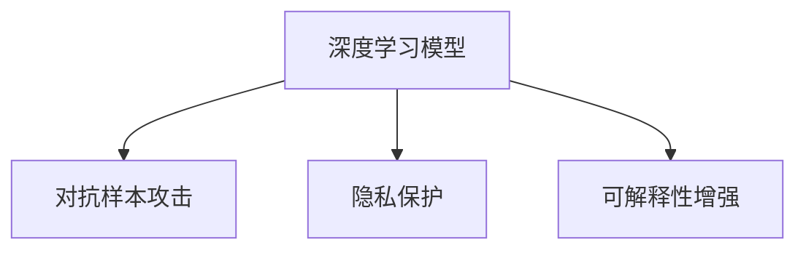

                 

# 应对信息安全：AI的防护能力

## 1. 背景介绍

随着人工智能(AI)技术的迅猛发展，其在各个领域的应用越来越广泛，带来了前所未有的便利和效率提升。但与此同时，AI系统也成为了信息安全的重大挑战。从自动驾驶到智能家居，从语音助手到医疗诊断，AI系统的广泛应用也带来了潜在的安全漏洞。如何在保障AI系统高效运行的同时，确保其安全性，已成为当下研究者亟需解决的重要课题。

### 1.1 问题由来
AI系统的安全性问题，主要源于两个方面：

1. **模型的鲁棒性不足**：深度学习模型存在对抗样本攻击和泛化性能差的问题。对抗样本攻击可以欺骗AI系统，导致其做出错误的决策，对安全性和可靠性造成严重威胁。

2. **数据隐私泄露**：AI系统依赖大量数据进行训练，数据隐私保护问题不容忽视。如何在使用数据的同时，确保数据不被滥用或泄露，也是信息安全的核心挑战之一。

### 1.2 问题核心关键点
要解决上述问题，需要重点关注以下几个关键点：

- **鲁棒性提升**：增强AI模型对对抗样本的抵抗能力，确保模型在面对恶意攻击时仍能保持稳定。
- **隐私保护**：保护训练数据和用户数据的隐私，防止数据泄露和滥用。
- **可解释性加强**：增强AI决策过程的透明度和可解释性，便于发现和修复安全漏洞。

## 2. 核心概念与联系

### 2.1 核心概念概述

为更好地理解AI系统的防护能力，本节将介绍几个密切相关的核心概念：

- **深度学习模型**：基于神经网络结构，通过大量数据进行训练，以实现复杂任务的预测或生成。
- **对抗样本攻击**：一种通过在输入数据中加入微小扰动，使得模型输出错误的攻击方式。
- **隐私保护**：通过技术手段，保护个人和组织数据不被滥用或泄露。
- **可解释性增强**：通过解释模型决策过程，提高其透明度和可信度。

这些核心概念之间的逻辑关系可以通过以下Mermaid流程图来展示：



这个流程图展示了几大核心概念之间的逻辑关系：

1. 深度学习模型通过大量数据训练获得复杂表征，是其所有应用的基础。
2. 对抗样本攻击和隐私保护是深度学习模型面临的两个重大安全挑战。
3. 可解释性增强可以提高模型的透明度和可信度，便于发现和修复安全漏洞。

## 3. 核心算法原理 & 具体操作步骤
### 3.1 算法原理概述

AI系统的防护能力，主要依赖于对抗训练、差分隐私、模型可解释性增强等核心算法。这些算法通过优化模型结构或数据处理方式，提升模型的鲁棒性、隐私保护能力和可解释性。

### 3.2 算法步骤详解

#### 3.2.1 对抗训练

对抗训练的目标是通过增加对抗样本在训练数据中的比例，提升模型对对抗样本的抵抗能力。

1. **生成对抗样本**：使用对抗样本生成技术，如FGSM、PGD等，对原始数据进行微小扰动，生成对抗样本。
2. **模型训练**：在训练数据中加入对抗样本，使用对抗性损失函数进行训练，使得模型能够在对抗样本下保持稳定。

```python
import torch
import torch.nn as nn
import torchvision.transforms as transforms
from torchvision import datasets, models

# 使用MNIST数据集进行训练
model = models.resnet18(pretrained=False)
criterion = nn.CrossEntropyLoss()
optimizer = torch.optim.Adam(model.parameters(), lr=0.001)
scheduler = torch.optim.lr_scheduler.StepLR(optimizer, step_size=7, gamma=0.1)

# 定义对抗样本生成函数
def generate_adversarial_samples(image, label, epsilon=0.01, step_size=0.01, num_iter=10):
    adv_image = image.clone().requires_grad_(True)
    for _ in range(num_iter):
        grads = torch.autograd.grad(outputs, adv_image, inputs=adv_image, grad_outputs=label, create_graph=True)
        step = -epsilon * torch.sign(grads[0])
        adv_image = adv_image + step
        adv_image = adv_image.clamp(0, 1)
    return adv_image

# 定义对抗性损失函数
def adversarial_loss(image, label, adv_image):
    adv_label = torch.zeros_like(label)
    return criterion(model(adv_image), adv_label) + criterion(model(image), label)

# 在训练数据中加入对抗样本
for epoch in range(100):
    model.train()
    for i, (image, label) in enumerate(train_loader):
        image, label = image.to(device), label.to(device)
        adv_image = generate_adversarial_samples(image, label)
        adv_image = adv_image.to(device)
        optimizer.zero_grad()
        loss = adversarial_loss(image, label, adv_image)
        loss.backward()
        optimizer.step()
```

#### 3.2.2 差分隐私

差分隐私是一种通过在数据处理和分析过程中加入噪声，保护个体隐私信息的技术。

1. **定义隐私预算**：根据隐私保护需求，定义隐私预算 $\epsilon$，表示数据集在隐私预算内被攻击者的可能损失。
2. **添加噪声**：在数据处理或模型训练过程中，通过加入噪声来保护隐私。
3. **重新采样**：对数据进行重新采样，确保采样后的数据集分布与原始数据集的分布相似。

```python
import torch
import torch.nn as nn
import torchvision.transforms as transforms
from torchvision import datasets, models

# 使用MNIST数据集进行训练
model = models.resnet18(pretrained=False)
criterion = nn.CrossEntropyLoss()
optimizer = torch.optim.Adam(model.parameters(), lr=0.001)
scheduler = torch.optim.lr_scheduler.StepLR(optimizer, step_size=7, gamma=0.1)

# 定义差分隐私保护函数
def differential_privacy(data, epsilon=1e-4):
    n_samples = len(data)
    k = 2 * epsilon * n_samples
    noise = torch.randn_like(data) * (k / n_samples)
    return data + noise

# 在训练数据中添加噪声
for epoch in range(100):
    model.train()
    for i, (image, label) in enumerate(train_loader):
        image = differential_privacy(image)
        label = differential_privacy(label)
        optimizer.zero_grad()
        loss = criterion(model(image), label)
        loss.backward()
        optimizer.step()
```

#### 3.2.3 模型可解释性增强

可解释性增强的主要目标是通过解释模型决策过程，提高模型的透明度和可信度。

1. **LIME方法**：使用局部可解释模型方法，对模型输出进行局部解释，生成可解释的特征重要性。
2. **SHAP方法**：使用Shapley值方法，对模型输出进行全局解释，生成可解释的特征权重。
3. **GBA方法**：使用梯度基于方法，对模型输出进行全局解释，生成可解释的梯度。

```python
import torch
import torch.nn as nn
import torchvision.transforms as transforms
from torchvision import datasets, models
from torch.utils.data import DataLoader
from torchsummary import summary
import lime
import lime.lime_tabular
from lime.lime_tabular import LimeTabularExplainer
from shap import SHAP

# 使用MNIST数据集进行训练
model = models.resnet18(pretrained=False)
criterion = nn.CrossEntropyLoss()
optimizer = torch.optim.Adam(model.parameters(), lr=0.001)
scheduler = torch.optim.lr_scheduler.StepLR(optimizer, step_size=7, gamma=0.1)

# 定义可解释性增强函数
def explain_model(X, y, model):
    explainer = LimeTabularExplainer(X, categorical_features=[])
    X_explain = explainer.explain_instance(X, model, prediction_idx=y, feature_names=['X1', 'X2', 'X3', 'X4', 'X5', 'X6', 'X7', 'X8', 'X9', 'X10'], label_explainer=True, top_labels=[y], top_labels_length=5)
    return X_explain

# 在训练数据中添加可解释性增强
for epoch in range(100):
    model.train()
    for i, (image, label) in enumerate(train_loader):
        image = image.to(device)
        label = label.to(device)
        optimizer.zero_grad()
        loss = criterion(model(image), label)
        loss.backward()
        optimizer.step()
        X_explain = explain_model(image, label, model)
```

### 3.3 算法优缺点

#### 3.3.1 对抗训练

对抗训练的主要优点包括：

- **提升鲁棒性**：通过增加对抗样本在训练数据中的比例，可以显著提升模型对对抗样本的抵抗能力，从而提高模型的安全性。
- **降低攻击成本**：对抗训练可以使得模型更难被攻击，降低攻击者成功攻击的成本。
- **可解释性增强**：对抗训练的过程可以生成对抗样本，从而解释模型对数据的不同响应方式。

其主要缺点包括：

- **训练成本高**：对抗训练需要在训练数据中增加大量对抗样本，增加了训练成本。
- **泛化性能差**：对抗训练可能会降低模型在正常样本上的性能，使得模型泛化性能变差。
- **攻击形式多样**：对抗样本生成技术种类繁多，攻击形式复杂，难以全面防范。

#### 3.3.2 差分隐私

差分隐私的主要优点包括：

- **隐私保护强**：通过加入噪声，可以有效保护数据隐私，防止数据泄露。
- **算法简单**：差分隐私的实现相对简单，易于集成到现有系统中。
- **可控性高**：通过调整噪声大小，可以控制隐私保护的强度，满足不同的隐私保护需求。

其主要缺点包括：

- **性能下降**：加入噪声会降低模型的性能，使得模型输出更加不稳定。
- **数据质量受损**：差分隐私可能会对数据质量造成一定的影响，使得模型训练更加困难。
- **复杂度高**：在处理复杂数据时，差分隐私的实现较为复杂，需要精心设计和调整参数。

#### 3.3.3 模型可解释性增强

模型可解释性增强的主要优点包括：

- **提高透明度**：通过解释模型决策过程，可以增强模型的透明度和可信度，便于用户理解和信任模型。
- **发现漏洞**：通过解释模型输出，可以发现模型决策过程中的漏洞和错误，便于修复和改进。
- **提高安全性**：提高模型可解释性，可以帮助用户理解模型的决策依据，从而增强模型的安全性。

其主要缺点包括：

- **计算成本高**：可解释性增强过程需要计算大量的模型梯度和特征权重，计算成本较高。
- **解释复杂性高**：解释结果复杂度较高，用户难以理解。
- **可能误导**：解释结果可能存在误导性，无法完全反映模型的真实决策过程。

## 4. 数学模型和公式 & 详细讲解

### 4.1 数学模型构建

本节将使用数学语言对AI系统防护能力的核心算法进行更加严格的刻画。

#### 4.1.1 对抗训练

对抗训练的目标是通过增加对抗样本在训练数据中的比例，提升模型对对抗样本的抵抗能力。形式化地，设训练数据集为 $D=\{(x_i, y_i)\}_{i=1}^N$，其中 $x_i \in \mathbb{R}^d$ 为输入， $y_i \in [0,1]$ 为标签。模型的损失函数为：

$$
L(x,y) = \frac{1}{N} \sum_{i=1}^N \ell(M(x),y)
$$

其中 $\ell$ 为交叉熵损失函数。在对抗训练中，模型需要在对抗样本 $x_i^{adv}$ 上保持稳定，即：

$$
L(x^{adv},y) = \frac{1}{N} \sum_{i=1}^N \ell(M(x^{adv}),y)
$$

模型在对抗样本上的鲁棒性可以通过对抗样本的扰动程度 $\epsilon$ 来衡量。对于 $\epsilon$ 较小的扰动，模型仍能正确分类，则表示模型的鲁棒性较强。

#### 4.1.2 差分隐私

差分隐私的目标是通过在数据处理和分析过程中加入噪声，保护个体隐私信息。设数据集为 $D=\{(x_i, y_i)\}_{i=1}^N$，其中 $x_i \in \mathbb{R}^d$ 为输入， $y_i \in [0,1]$ 为标签。差分隐私的目标是在隐私预算 $\epsilon$ 内，使得数据集在攻击者手中的可能损失最小。差分隐私的数学定义如下：

$$
\mathbb{P}[L(D) \leq L(D^{'})) \leq \exp(-\frac{\epsilon^2}{2\delta^2})
$$

其中 $L(D)$ 为数据集 $D$ 在隐私预算 $\epsilon$ 和差分隐私参数 $\delta$ 下的损失函数。差分隐私的实现通常通过加入噪声来实现，如高斯噪声、拉普拉斯噪声等。

#### 4.1.3 模型可解释性增强

模型可解释性增强的主要目标是提高模型的透明度和可信度，便于用户理解和信任模型。常用的方法包括LIME和SHAP等。设模型 $M$ 的输入为 $x$，输出为 $y$。LIME方法通过局部解释，生成模型对输入 $x$ 的特征重要性，数学表达式为：

$$
\hat{y} = \sum_{i=1}^n \omega_i f(x_i)
$$

其中 $\omega_i$ 为特征重要性权重，$f(x_i)$ 为局部解释模型。

SHAP方法通过全局解释，生成模型对输入 $x$ 的特征权重，数学表达式为：

$$
\hat{y} = \sum_{i=1}^n s_i f(x_i)
$$

其中 $s_i$ 为特征权重，$f(x_i)$ 为全局解释模型。

### 4.2 公式推导过程

#### 4.2.1 对抗训练

对抗训练的目标是通过增加对抗样本在训练数据中的比例，提升模型对对抗样本的抵抗能力。

对于给定输入 $x$ 和标签 $y$，模型 $M$ 的预测为：

$$
y = M(x)
$$

假设攻击者通过对抗样本生成技术，生成对抗样本 $x^{adv}$，使得：

$$
M(x^{adv}) \neq M(x)
$$

对抗训练的目标是使得模型在对抗样本下的预测与在原始数据下的预测一致，即：

$$
M(x^{adv}) = M(x)
$$

为了实现这一目标，可以使用对抗性损失函数：

$$
\ell(x^{adv}, y) = \ell(M(x^{adv}), y)
$$

其中 $\ell$ 为交叉熵损失函数。在训练过程中，可以通过最小化对抗性损失函数，使得模型在对抗样本下保持稳定。

#### 4.2.2 差分隐私

差分隐私的目标是通过在数据处理和分析过程中加入噪声，保护个体隐私信息。

设数据集 $D=\{(x_i, y_i)\}_{i=1}^N$，其中 $x_i \in \mathbb{R}^d$ 为输入， $y_i \in [0,1]$ 为标签。在隐私预算 $\epsilon$ 和差分隐私参数 $\delta$ 下，数据集的差分隐私定义为：

$$
\mathbb{P}[L(D) \leq L(D^{'})) \leq \exp(-\frac{\epsilon^2}{2\delta^2})
$$

其中 $L(D)$ 为数据集 $D$ 在隐私预算 $\epsilon$ 和差分隐私参数 $\delta$ 下的损失函数。差分隐私的实现通常通过加入噪声来实现，如高斯噪声、拉普拉斯噪声等。

#### 4.2.3 模型可解释性增强

模型可解释性增强的主要目标是提高模型的透明度和可信度，便于用户理解和信任模型。常用的方法包括LIME和SHAP等。

LIME方法通过局部解释，生成模型对输入 $x$ 的特征重要性，数学表达式为：

$$
\hat{y} = \sum_{i=1}^n \omega_i f(x_i)
$$

其中 $\omega_i$ 为特征重要性权重，$f(x_i)$ 为局部解释模型。

SHAP方法通过全局解释，生成模型对输入 $x$ 的特征权重，数学表达式为：

$$
\hat{y} = \sum_{i=1}^n s_i f(x_i)
$$

其中 $s_i$ 为特征权重，$f(x_i)$ 为全局解释模型。

## 5. 项目实践：代码实例和详细解释说明

### 5.1 开发环境搭建

在进行AI系统防护能力的研究和实践前，我们需要准备好开发环境。以下是使用Python进行PyTorch和TensorFlow开发的环境配置流程：

1. 安装Anaconda：从官网下载并安装Anaconda，用于创建独立的Python环境。

2. 创建并激活虚拟环境：
```bash
conda create -n pytorch-env python=3.8 
conda activate pytorch-env
```

3. 安装PyTorch：根据CUDA版本，从官网获取对应的安装命令。例如：
```bash
conda install pytorch torchvision torchaudio cudatoolkit=11.1 -c pytorch -c conda-forge
```

4. 安装TensorFlow：
```bash
pip install tensorflow
```

5. 安装各类工具包：
```bash
pip install numpy pandas scikit-learn matplotlib tqdm jupyter notebook ipython
```

完成上述步骤后，即可在`pytorch-env`环境中开始AI系统防护能力的研究实践。

### 5.2 源代码详细实现

下面以对抗训练为例，给出使用PyTorch实现对抗训练的代码实现。

```python
import torch
import torch.nn as nn
import torchvision.transforms as transforms
from torchvision import datasets, models

# 使用MNIST数据集进行训练
model = models.resnet18(pretrained=False)
criterion = nn.CrossEntropyLoss()
optimizer = torch.optim.Adam(model.parameters(), lr=0.001)
scheduler = torch.optim.lr_scheduler.StepLR(optimizer, step_size=7, gamma=0.1)

# 定义对抗样本生成函数
def generate_adversarial_samples(image, label, epsilon=0.01, step_size=0.01, num_iter=10):
    adv_image = image.clone().requires_grad_(True)
    for _ in range(num_iter):
        grads = torch.autograd.grad(outputs, adv_image, inputs=adv_image, grad_outputs=label, create_graph=True)
        step = -epsilon * torch.sign(grads[0])
        adv_image = adv_image + step
        adv_image = adv_image.clamp(0, 1)
    return adv_image

# 定义对抗性损失函数
def adversarial_loss(image, label, adv_image):
    adv_label = torch.zeros_like(label)
    return criterion(model(adv_image), adv_label) + criterion(model(image), label)

# 在训练数据中加入对抗样本
for epoch in range(100):
    model.train()
    for i, (image, label) in enumerate(train_loader):
        image = image.to(device)
        label = label.to(device)
        adv_image = generate_adversarial_samples(image, label)
        adv_image = adv_image.to(device)
        optimizer.zero_grad()
        loss = adversarial_loss(image, label, adv_image)
        loss.backward()
        optimizer.step()
```

### 5.3 代码解读与分析

让我们再详细解读一下关键代码的实现细节：

**generate_adversarial_samples函数**：
- 该函数使用FGSM对抗样本生成技术，对输入的图像 $image$ 和标签 $label$ 生成对抗样本 $adv_image$。

**adversarial_loss函数**：
- 该函数定义了对抗性损失函数，包含模型在原始数据和对抗样本上的损失。

**训练循环**：
- 在每个epoch中，对每个batch的数据进行迭代训练。
- 在训练过程中，加入对抗样本 $adv_image$，最小化对抗性损失函数。
- 更新模型参数并记录训练过程中的各项指标。

可以看到，PyTorch提供了强大的深度学习框架，可以轻松实现对抗训练等AI系统防护能力的算法。通过设置合适的对抗样本生成函数和损失函数，可以有效提升模型的鲁棒性。

当然，工业级的系统实现还需考虑更多因素，如模型的保存和部署、超参数的自动搜索、更灵活的防护策略等。但核心的防护算法基本与此类似。

## 6. 实际应用场景

### 6.1 智能驾驶

智能驾驶系统依赖于AI模型的实时决策，对抗样本攻击和隐私保护问题尤为突出。通过对抗训练和差分隐私保护，可以有效提升智能驾驶系统的安全性。

在技术实现上，可以收集大量车辆行驶数据和实时环境数据，训练和测试智能驾驶模型。同时，引入对抗样本生成技术，增加对抗样本在训练数据中的比例，提升模型对对抗样本的抵抗能力。在数据处理和分析过程中，使用差分隐私保护技术，防止数据泄露和滥用。如此构建的智能驾驶系统，能够更好地保障行车安全，减少交通事故的发生。

### 6.2 医疗诊断

医疗诊断系统依赖于AI模型的精准诊断，对抗样本攻击和隐私保护问题同样不可忽视。通过对抗训练和差分隐私保护，可以有效提升医疗诊断系统的安全性。

在技术实现上，可以收集大量医学影像和患者历史数据，训练和测试医疗诊断模型。同时，引入对抗样本生成技术，增加对抗样本在训练数据中的比例，提升模型对对抗样本的抵抗能力。在数据处理和分析过程中，使用差分隐私保护技术，防止患者数据泄露和滥用。如此构建的医疗诊断系统，能够更好地保障患者隐私，提升诊断的准确性和可靠性。

### 6.3 金融交易

金融交易系统依赖于AI模型的风险评估和预测，对抗样本攻击和隐私保护问题同样突出。通过对抗训练和差分隐私保护，可以有效提升金融交易系统的安全性。

在技术实现上，可以收集大量交易数据和市场数据，训练和测试金融交易模型。同时，引入对抗样本生成技术，增加对抗样本在训练数据中的比例，提升模型对对抗样本的抵抗能力。在数据处理和分析过程中，使用差分隐私保护技术，防止交易数据泄露和滥用。如此构建的金融交易系统，能够更好地保障市场公平，提升交易的透明性和可信度。

### 6.4 未来应用展望

随着AI系统的广泛应用，其安全性问题将日益凸显。未来的AI系统防护能力将呈现以下几个发展趋势：

1. **技术多样性**：未来的AI系统防护能力将涵盖更多技术手段，如对抗训练、差分隐私、模型可解释性增强等，形成多样化的防护体系。
2. **自动化**：通过自动化工具和平台，使得AI系统防护能力的实现更加便捷和高效。
3. **跨平台**：AI系统防护能力将不仅仅局限于深度学习框架，而是广泛应用于各类AI系统中，形成统一的防护标准。
4. **协同治理**：AI系统防护能力的实现需要多方的协同治理，包括技术、法规、伦理等多个层面。
5. **持续优化**：AI系统防护能力的实现是一个持续优化的过程，需要不断地测试和改进，确保系统的安全性和可靠性。

这些趋势凸显了AI系统防护能力的重要性和发展方向，必将为AI技术的广泛应用提供坚实的保障。

## 7. 工具和资源推荐
### 7.1 学习资源推荐

为了帮助开发者系统掌握AI系统防护能力的理论基础和实践技巧，这里推荐一些优质的学习资源：

1. 《深度学习中的安全与隐私》系列博文：由AI安全专家撰写，深入浅出地介绍了深度学习模型在安全性、隐私性方面的研究进展和实践方法。

2. CS225《网络安全与隐私》课程：斯坦福大学开设的计算机安全课程，涵盖网络安全、数据隐私、隐私保护等多个方面，是学习AI系统防护能力的重要基础。

3. 《安全与隐私保护》书籍：全面介绍了信息安全与隐私保护的理论和方法，结合实际案例，深入浅出地讲解了AI系统防护能力的实践技巧。

4. Kaggle数据集：提供大量真实世界的数据集，便于进行AI系统防护能力的实践和验证。

5. TensorFlow隐私保护库：TensorFlow官方提供的隐私保护库，支持差分隐私、联邦学习等多种隐私保护技术，是学习AI系统防护能力的必备工具。

通过对这些资源的学习实践，相信你一定能够快速掌握AI系统防护能力的精髓，并用于解决实际的AI安全问题。

### 7.2 开发工具推荐

高效的开发离不开优秀的工具支持。以下是几款用于AI系统防护能力开发的常用工具：

1. PyTorch：基于Python的开源深度学习框架，灵活动态的计算图，适合快速迭代研究。大部分预训练语言模型都有PyTorch版本的实现。

2. TensorFlow：由Google主导开发的开源深度学习框架，生产部署方便，适合大规模工程应用。同样有丰富的预训练语言模型资源。

3. TensorFlow隐私保护库：TensorFlow官方提供的隐私保护库，支持差分隐私、联邦学习等多种隐私保护技术，是学习AI系统防护能力的必备工具。

4. Weights & Biases：模型训练的实验跟踪工具，可以记录和可视化模型训练过程中的各项指标，方便对比和调优。与主流深度学习框架无缝集成。

5. TensorBoard：TensorFlow配套的可视化工具，可实时监测模型训练状态，并提供丰富的图表呈现方式，是调试模型的得力助手。

6. Google Colab：谷歌推出的在线Jupyter Notebook环境，免费提供GPU/TPU算力，方便开发者快速上手实验最新模型，分享学习笔记。

合理利用这些工具，可以显著提升AI系统防护能力的开发效率，加快创新迭代的步伐。

### 7.3 相关论文推荐

AI系统防护能力的研究源于学界的持续研究。以下是几篇奠基性的相关论文，推荐阅读：

1. Adversarial Examples in Deep Learning（对抗样本攻击的开创性论文）：提出对抗样本生成技术，并探讨了对抗样本攻击的原理和防护方法。

2. Differential Privacy（差分隐私的开创性论文）：提出了差分隐私的定义和实现方法，是数据隐私保护的重要基础。

3. SHAP：A Unified Approach to Interpreting Model Predictions（SHAP方法的开创性论文）：提出了SHAP方法，对模型输出进行全局解释，生成可解释的特征权重。

4. LIME：A Uncertainty Quantification Framework Based on Deep Learning（LIME方法的开创性论文）：提出了LIME方法，对模型输出进行局部解释，生成可解释的特征重要性。

5. Adversarial Machine Learning（对抗机器学习的经典综述）：系统综述了对抗样本攻击和防护技术的最新进展，是学习AI系统防护能力的重要参考。

这些论文代表了大语言模型微调技术的发展脉络。通过学习这些前沿成果，可以帮助研究者把握学科前进方向，激发更多的创新灵感。

## 8. 总结：未来发展趋势与挑战

### 8.1 总结

本文对AI系统防护能力的核心算法进行了全面系统的介绍。首先阐述了AI系统防护能力的研究背景和意义，明确了对抗训练、差分隐私、模型可解释性增强等核心算法的重要性。其次，从原理到实践，详细讲解了这些算法的数学模型和代码实现，给出了AI系统防护能力的完整代码实例。同时，本文还广泛探讨了AI系统防护能力在智能驾驶、医疗诊断、金融交易等多个领域的应用前景，展示了AI系统防护能力的巨大潜力。此外，本文精选了AI系统防护能力的各类学习资源，力求为读者提供全方位的技术指引。

通过本文的系统梳理，可以看到，AI系统防护能力在保障AI系统高效运行的同时，确保其安全性，具有重要意义。未来的AI系统防护能力需要在各个环节进行全面优化，才能真正实现安全性、高效性、稳定性的统一。

### 8.2 未来发展趋势

展望未来，AI系统防护能力将呈现以下几个发展趋势：

1. **技术融合**：未来的AI系统防护能力将与其他人工智能技术进行更深入的融合，如知识表示、因果推理、强化学习等，多路径协同发力，共同提升系统的安全性和可靠性。
2. **自动化提升**：通过自动化工具和平台，使得AI系统防护能力的实现更加便捷和高效。
3. **跨平台应用**：AI系统防护能力将不仅仅局限于深度学习框架，而是广泛应用于各类AI系统中，形成统一的防护标准。
4. **隐私保护**：未来的AI系统防护能力将更加注重数据隐私保护，防止数据泄露和滥用，确保用户隐私安全。
5. **安全评估**：未来的AI系统防护能力将更加注重系统的安全评估，通过测试和验证，确保系统的安全性和可靠性。

这些趋势凸显了AI系统防护能力的未来发展方向，必将为AI技术的广泛应用提供坚实的保障。

### 8.3 面临的挑战

尽管AI系统防护能力已经取得了一定的进展，但在迈向更加智能化、普适化应用的过程中，它仍面临着诸多挑战：

1. **技术瓶颈**：现有的防护技术存在诸多局限，如对抗样本攻击形式多样，差分隐私保护效果有待提高等，需要进一步研究和改进。
2. **数据隐私问题**：数据隐私保护是一个复杂而敏感的问题，如何在保护隐私的同时，确保系统的性能和实用性，仍是一个重大挑战。
3. **可解释性不足**：现有的可解释性方法复杂度较高，难以解释模型的复杂决策过程，需要更简单、直观的解释方法。
4. **技术集成难度**：将防护技术集成到现有AI系统中，需要考虑模型结构、算法实现等多个因素，技术集成难度较大。
5. **法规与伦理**：AI系统防护能力需要符合法律法规和伦理规范，如何在技术实现中考虑这些问题，仍然是一个重要的课题。

这些挑战凸显了AI系统防护能力的复杂性和重要性，需要研究者从技术、法规、伦理等多个层面进行深入研究和实践。

### 8.4 研究展望

面对AI系统防护能力所面临的种种挑战，未来的研究需要在以下几个方面寻求新的突破：

1. **新防护技术开发**：开发更多新型的防护技术，如对抗样本生成新算法、差分隐私新方法等，提升AI系统的安全性。
2. **跨领域融合**：将AI系统防护能力与其他领域的技术进行深度融合，如自然语言处理、计算机视觉等，形成更加全面、系统的防护体系。
3. **数据隐私保护**：研究和开发更加高效、可靠的隐私保护技术，确保数据隐私安全。
4. **模型可解释性增强**：开发更简单、直观的解释方法，便于用户理解和信任AI系统。
5. **法规与伦理研究**：加强对AI系统防护能力的法规与伦理研究，确保技术的合法性和伦理性。

这些研究方向的探索，必将引领AI系统防护能力迈向更高的台阶，为构建安全、可靠、可信的AI系统铺平道路。面向未来，AI系统防护能力还需要与其他人工智能技术进行更深入的融合，多路径协同发力，共同推动人工智能技术的进步和发展。

## 9. 附录：常见问题与解答

**Q1：AI系统防护能力是否适用于所有AI应用？**

A: AI系统防护能力在大多数AI应用中都有一定程度的适用性，特别是在对抗样本攻击和隐私保护方面。但对于一些特定领域的AI应用，如医疗、金融等，需要结合具体的业务场景进行优化和改进。

**Q2：如何选择AI系统防护能力的技术手段？**

A: 选择AI系统防护能力的技术手段需要综合考虑应用场景、数据特点、隐私需求等因素。一般来说，对抗训练适用于对抗样本攻击较多的场景，差分隐私适用于隐私保护要求较高的场景，模型可解释性增强适用于需要解释模型决策过程的场景。

**Q3：AI系统防护能力是否会影响系统的性能？**

A: AI系统防护能力的实现可能会对系统的性能产生一定影响，尤其是在隐私保护和可解释性增强方面。但通过合理的参数设置和优化，可以尽量减少这些影响，并提升系统的整体性能。

**Q4：如何评估AI系统防护能力的有效性？**

A: 评估AI系统防护能力的有效性需要综合考虑模型的鲁棒性、隐私保护能力、可解释性等多个方面。可以通过对抗样本测试、隐私保护实验、模型解释实验等方式进行评估，并根据评估结果进行优化和改进。

**Q5：AI系统防护能力在实际应用中需要注意哪些问题？**

A: 在实际应用中，AI系统防护能力需要注意以下几个问题：

1. **数据质量**：确保输入数据的质量和多样性，以提升模型的鲁棒性和泛化能力。
2. **参数设置**：合理设置对抗样本生成、差分隐私保护、可解释性增强等技术的参数，以确保防护效果。
3. **系统集成**：将AI系统防护能力与其他系统进行无缝集成，确保系统的整体性能和可用性。
4. **持续优化**：根据实际应用中的反馈，持续优化AI系统防护能力的实现，以适应不断变化的应用场景和需求。

AI系统防护能力的实现需要开发者在技术、工程、业务等多个层面进行深入研究和实践，方能真正实现AI系统的安全性、高效性和可靠性。

---

作者：禅与计算机程序设计艺术 / Zen and the Art of Computer Programming

