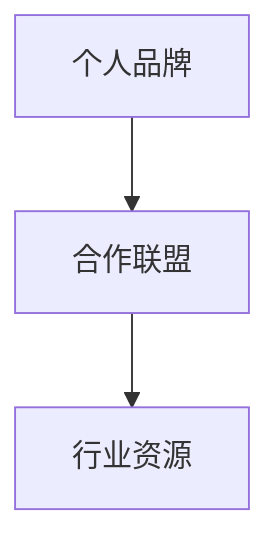
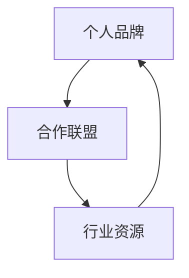

                 

# 建立个人品牌合作联盟：整合行业资源

## 1. 背景介绍

在当今这个高度竞争和快速变化的市场环境中，个人品牌的力量不容小觑。一个强有力的个人品牌不仅能够提升个人知名度，还能为合作伙伴带来更多的机会。如何通过建立个人品牌合作联盟，整合行业资源，充分发挥个人品牌的潜力，成为企业竞争和创新发展的关键。本文将深入探讨这一主题，帮助读者理解个人品牌合作联盟的重要性和实施方法。

## 2. 核心概念与联系

### 2.1 核心概念概述

- **个人品牌**：个人在特定领域内通过自己的技能、知识、个性和行为塑造的独特形象和声誉。
- **合作联盟**：由多个个人或组织共同组成的合作网络，旨在通过资源共享、知识交流和协同工作，实现共同的目标和利益。
- **行业资源**：特定领域内的人脉、技术、资金、数据等资源，是企业和个人发展的关键因素。

这些概念之间的联系可以通过以下Mermaid流程图来展示：



这个流程图展示了个人品牌通过建立合作联盟来整合行业资源的逻辑关系：

1. 个人品牌是合作联盟的基础，汇集了志同道合的个人，共同分享和利用行业资源。
2. 合作联盟是整合行业资源的平台，提供了一个协同工作的环境，使得资源共享和知识交流成为可能。
3. 行业资源是合作联盟的目标，通过资源整合和优化配置，实现共同的目标和利益。

### 2.2 核心概念原理和架构的 Mermaid 流程图



这个图表示了个人品牌、合作联盟和行业资源之间的双向联系：

1. 个人品牌通过参与合作联盟，获取和共享行业资源。
2. 合作联盟通过个人品牌的联合，整合和优化行业资源。
3. 行业资源通过合作联盟和个人的互动，被充分利用和提升。

## 3. 核心算法原理 & 具体操作步骤

### 3.1 算法原理概述

个人品牌合作联盟的建立，基于一个基本原则：价值交换。每个参与的个人或组织，通过提供自己独特的资源和能力，同时获取所需的资源和能力，实现互惠互利。这一过程可以通过数学模型来表示，我们定义一个**合作指数**（Cooperation Index, CI），用于量化个人品牌在合作联盟中的贡献和收益：

$$ CI = \frac{\text{贡献资源} \times \text{获取资源}}{\text{预期成本} \times \text{预期收益}} $$

其中，贡献资源包括专业知识、技能、人脉等，获取资源包括资金、数据、设备等，预期成本是预期的合作中需要投入的资源，预期收益是预期的合作中可以获得的收益。

### 3.2 算法步骤详解

建立个人品牌合作联盟的具体操作步骤如下：

**Step 1: 识别和评估潜在合作伙伴**

- 确定目标行业和领域，并识别潜在的合作伙伴。这可以包括业内专家、潜在客户、竞争对手等。
- 评估潜在合作伙伴的资源和能力，包括专业知识、技术能力、人脉资源等。

**Step 2: 建立沟通渠道**

- 通过邮件、社交媒体、专业论坛等渠道，建立与潜在合作伙伴的沟通。
- 通过定期会议、研讨会等形式，增强合作意愿和信任。

**Step 3: 定义合作目标和方式**

- 明确合作的具体目标，如共同开发新产品、共享技术资源、联合市场推广等。
- 定义合作的详细方式，包括合作的具体任务分配、资源共享、利益分配等。

**Step 4: 签署合作协议**

- 通过正式的合作协议，明确各方的权利和义务。
- 确定合作的期限、退出机制、知识产权分配等细节。

**Step 5: 实施和监督合作**

- 根据合作协议，实施具体的合作任务。
- 定期监督合作进展，确保各方按计划执行。

**Step 6: 评估和调整合作**

- 定期评估合作的效果，并根据评估结果进行必要的调整。
- 对合作中的问题进行沟通和解决，确保合作顺利进行。

### 3.3 算法优缺点

#### 3.3.1 优点

- **资源共享**：通过合作联盟，各方可以共享资源和能力，减少重复投入，提高效率。
- **风险分担**：多个合作伙伴共同承担合作中的风险，降低单个成员的风险。
- **知识交流**：合作过程中，各方可以互相学习和借鉴，提升整体竞争力。

#### 3.3.2 缺点

- **协调成本**：建立和维护合作联盟需要花费大量时间和精力，协调各方利益和目标。
- **信任问题**：各方对合作的信任和承诺不足，可能导致合作效果不理想。
- **资源不对等**：不同合作伙伴的资源和能力差异较大，可能导致资源分配不均衡。

### 3.4 算法应用领域

个人品牌合作联盟可以在多个领域得到应用，如：

- **技术创新**：通过联合开发和资源共享，加速新技术的研发和应用。
- **市场营销**：通过联合推广和资源整合，提升市场影响力。
- **产品开发**：通过合作开发和市场测试，快速推出满足市场需求的产品。
- **行业标准**：通过联合制定和推广行业标准，提升行业整体水平。

## 4. 数学模型和公式 & 详细讲解 & 举例说明

### 4.1 数学模型构建

我们可以使用**效用函数**（Utility Function）来量化个人品牌在合作联盟中的收益和成本。设个人品牌 $A$ 的效用函数为 $U_A$，合作伙伴 $B$ 的效用函数为 $U_B$，则合作的总效用 $U$ 可以表示为：

$$ U = U_A + U_B $$

通过效用函数，我们可以计算合作前后的效用变化，从而评估合作的潜在价值。

### 4.2 公式推导过程

以技术创新为例，设合作前个人品牌 $A$ 的效用为 $U_A^0$，合作伙伴 $B$ 的效用为 $U_B^0$，合作后的效用分别为 $U_A^1$ 和 $U_B^1$，则合作的总效用变化 $\Delta U$ 可以表示为：

$$ \Delta U = (U_A^1 + U_B^1) - (U_A^0 + U_B^0) $$

通过这个公式，我们可以计算合作前后效用的变化，从而评估合作的潜在价值。

### 4.3 案例分析与讲解

假设一家初创公司希望进入某个技术领域，但缺乏相关技术和资源。它通过与另一家拥有丰富技术储备的公司建立合作联盟，共享技术和市场资源。合作前，初创公司需要投入大量资金和人力进行技术研发，市场推广等。通过合作，初创公司可以共享对方的技术资源，减少研发成本，同时获取对方的市场渠道，提升市场份额。

## 5. 项目实践：代码实例和详细解释说明

### 5.1 开发环境搭建

在开发合作联盟平台时，需要搭建一个功能齐全的Web应用程序。以下是搭建开发环境的详细步骤：

1. 安装Python和Django框架。
2. 安装相关库，如SQLAlchemy、Flask、Jinja等。
3. 创建虚拟环境，安装必要的依赖包。
4. 搭建数据库，配置应用服务器。

### 5.2 源代码详细实现

下面是一个简单的Python代码示例，用于管理合作联盟的成员和任务分配：

```python
from flask import Flask, request
from flask_sqlalchemy import SQLAlchemy

app = Flask(__name__)
app.config['SQLALCHEMY_DATABASE_URI'] = 'sqlite:///members.db'
db = SQLAlchemy(app)

class Member(db.Model):
    id = db.Column(db.Integer, primary_key=True)
    name = db.Column(db.String(50))
    resources = db.Column(db.String(100))

class Task(db.Model):
    id = db.Column(db.Integer, primary_key=True)
    name = db.Column(db.String(50))
    members = db.relationship('Member', backref=backref('tasks', lazy='dynamic'))

@app.route('/add_member', methods=['POST'])
def add_member():
    name = request.form['name']
    resources = request.form['resources']
    member = Member(name=name, resources=resources)
    db.session.add(member)
    db.session.commit()
    return 'Member added successfully'

@app.route('/add_task', methods=['POST'])
def add_task():
    name = request.form['name']
    members = request.form['members'].split(',')
    task = Task(name=name)
    for member in members:
        member_obj = Member.query.filter_by(name=member).first()
        if member_obj:
            task.members.append(member_obj)
    db.session.add(task)
    db.session.commit()
    return 'Task added successfully'

if __name__ == '__main__':
    app.run(debug=True)
```

### 5.3 代码解读与分析

以上代码示例是一个简单的Flask应用，用于管理合作联盟的成员和任务分配。主要功能包括：

- 添加成员和任务：通过RESTful接口，向数据库添加新的成员和任务信息。
- 关系映射：使用SQLAlchemy库进行数据库的CRUD操作，并实现成员和任务的关联。
- 接口设计：提供简洁的API接口，方便前端调用。

## 6. 实际应用场景

### 6.1 技术创新

技术创新是个人品牌合作联盟的重要应用场景之一。通过合作，初创公司可以快速获取行业内的技术资源，加速产品开发和市场推广。例如，某初创公司希望进入人工智能领域，但缺乏相关技术和人才。通过与一家拥有丰富AI技术的合作联盟，它可以快速获取先进的算法和模型，快速推出市场。

### 6.2 市场营销

市场营销是另一个重要的应用场景。通过合作联盟，企业可以共享市场资源，提升市场影响力。例如，某企业希望进入新的市场，但缺乏品牌知名度。通过与当地的知名企业建立合作联盟，它可以借助对方的品牌和渠道，快速提升市场份额。

### 6.3 产品开发

产品开发也是个人品牌合作联盟的重要应用场景。通过合作，企业可以快速推出满足市场需求的产品。例如，某初创公司希望开发一款新应用，但缺乏用户需求数据。通过与多家企业建立合作联盟，它可以获得用户的反馈和需求，快速调整产品策略。

## 7. 工具和资源推荐

### 7.1 学习资源推荐

- **《个人品牌管理》**：介绍个人品牌管理的基本知识和策略，帮助个人提升品牌价值。
- **《合作共赢：建立强大的合作联盟》**：介绍如何建立和维护合作联盟，提升企业竞争力。
- **《资源整合：在竞争中脱颖而出》**：介绍如何整合行业资源，实现资源优化配置。

### 7.2 开发工具推荐

- **JIRA**：项目管理工具，用于跟踪和管理合作任务。
- **Confluence**：知识管理工具，用于记录和分享合作过程中的关键信息。
- **Zoom**：视频会议工具，用于在线沟通和协作。

### 7.3 相关论文推荐

- **《合作联盟与资源整合的数学模型》**：介绍如何使用数学模型评估合作联盟的潜在价值。
- **《个人品牌在合作联盟中的作用》**：探讨个人品牌在合作联盟中的作用和影响。

## 8. 总结：未来发展趋势与挑战

### 8.1 研究成果总结

个人品牌合作联盟的研究成果主要集中在以下几个方面：

- **理论模型**：建立了合作指数和效用函数的数学模型，用于量化合作联盟的贡献和收益。
- **实践案例**：通过实际案例分析，展示了合作联盟在技术创新、市场营销、产品开发等方面的应用。
- **技术工具**：推荐了多种项目管理、知识管理和在线协作工具，用于支持合作联盟的建立和维护。

### 8.2 未来发展趋势

未来，个人品牌合作联盟的发展趋势主要体现在以下几个方面：

- **智能化管理**：利用人工智能技术进行合作资源的智能分配和管理，提升合作效率。
- **全球化拓展**：利用互联网和跨境合作，拓展合作联盟的国际影响力。
- **多元化应用**：除了技术创新、市场营销、产品开发外，合作联盟还将拓展到更多领域，如社会公益、环境保护等。

### 8.3 面临的挑战

尽管个人品牌合作联盟有诸多优势，但也面临一些挑战：

- **信任问题**：各成员之间缺乏信任，可能导致合作效果不理想。
- **资源不对等**：不同成员的资源和能力差异较大，可能导致资源分配不均衡。
- **利益冲突**：合作中各方的利益冲突，可能导致合作联盟不稳定。

### 8.4 研究展望

未来的研究将重点关注以下几个方面：

- **信任机制**：建立更加有效的信任机制，确保各成员之间的合作意愿和承诺。
- **资源均衡**：开发更加均衡的资源分配算法，确保各成员的利益最大化。
- **利益协调**：研究各方利益协调的方法，确保合作联盟的长期稳定。

## 9. 附录：常见问题与解答

**Q1：如何选择合适的合作伙伴？**

A: 选择合作伙伴时，应考虑以下因素：

- **领域相关性**：选择与自身业务相关的合作伙伴。
- **资源互补性**：选择资源互补的合作伙伴，实现资源共享。
- **信用记录**：选择信用记录良好的合作伙伴，确保合作的可靠性。

**Q2：如何维护合作联盟的稳定？**

A: 维护合作联盟的稳定需要从以下几个方面入手：

- **定期沟通**：通过定期会议、交流等方式，保持各方的沟通和信任。
- **共同目标**：确保各成员对合作的目标和方向有清晰的共识。
- **利益分配**：制定公平合理的利益分配机制，确保各方的利益得到保障。

**Q3：如何在合作联盟中发挥个人品牌的作用？**

A: 在合作联盟中，个人品牌可以发挥以下几个作用：

- **品牌背书**：利用个人品牌的影响力，提升合作联盟的知名度和信誉。
- **知识分享**：通过分享个人知识和经验，提升合作联盟的整体能力。
- **资源整合**：利用个人品牌的人脉资源，整合和优化合作联盟的资源。

---

作者：禅与计算机程序设计艺术 / Zen and the Art of Computer Programming

