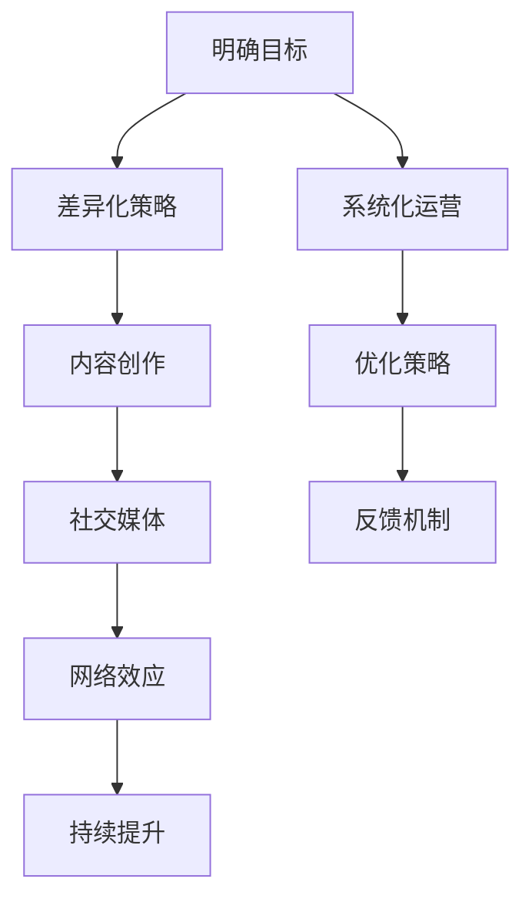

                 

# 建立个人品牌的步骤和技巧

> 关键词：个人品牌, 建立, 策略, 营销, 社交媒体, 内容创作, 数字时代

## 1. 背景介绍

### 1.1 问题由来
在数字时代，个人品牌建设已成为职业发展和个人增值的重要途径。无论是在职场还是在创业领域，一个良好的个人品牌不仅能够提升个人影响力，还能吸引更多机会。然而，许多人在建立个人品牌的过程中，往往缺乏系统化的策略和技巧。本文旨在帮助读者理解个人品牌的重要性，并详细介绍一套建立个人品牌的步骤和技巧，以期为你的职业发展提供指引。

### 1.2 问题核心关键点
个人品牌建设的核心关键点包括：
1. **明确目标**：清晰定义个人品牌的核心价值和目标受众。
2. **差异化策略**：打造独特而有吸引力的个人品牌形象。
3. **系统化运营**：通过多种渠道持续输出价值。
4. **网络效应**：利用社交媒体和专业网络扩大影响力。
5. **持续提升**：不断优化个人品牌，适应行业变化。

这些关键点贯穿于个人品牌建设的全过程，是确保个人品牌长期健康发展的基础。

### 1.3 问题研究意义
在高度竞争的职场环境中，一个强大的个人品牌可以帮助你脱颖而出，赢得更多关注和机会。通过系统化的策略和技巧，你可以有效地展示自己的专业知识和独特价值，构建具有竞争力的个人品牌。个人品牌的成功建立不仅能够促进个人职业发展，还能对行业产生积极影响，推动整个领域的进步。

## 2. 核心概念与联系

### 2.1 核心概念概述

建立个人品牌涉及多个核心概念，包括但不限于：
- **个人品牌**：个人在特定领域内的知名度和认可度，代表了个人的专业形象和价值主张。
- **差异化策略**：通过独特定位、风格和内容，使自己在竞争中脱颖而出。
- **内容创作**：通过高质量的内容输出，展示专业知识和价值。
- **社交媒体**：利用社交平台进行品牌传播和互动。
- **网络效应**：通过不断积累的人脉和影响力，增强品牌的权重。
- **持续提升**：根据反馈和行业变化，不断优化个人品牌形象。

这些概念相互关联，共同构成个人品牌建设的整体框架。通过理解并应用这些概念，你可以构建一个稳定、有影响力的个人品牌。

### 2.2 核心概念原理和架构的 Mermaid 流程图



这个流程图展示了个人品牌建设的整体流程，从目标设定到内容创作，再到社交媒体互动和持续优化，每一步都至关重要。

## 3. 核心算法原理 & 具体操作步骤
### 3.1 算法原理概述

建立个人品牌的基本原理是通过持续的价值输出和互动，逐渐构建并强化个人在特定领域内的知名度和认可度。具体步骤包括：

1. **目标设定**：明确个人品牌的目标受众和核心价值。
2. **差异化策略**：确定个人品牌的独特卖点，形成差异化。
3. **内容创作**：创建高质量的内容，展示专业知识和价值。
4. **社交媒体运营**：通过多种社交平台进行品牌传播和互动。
5. **网络效应**：积累人脉和影响力，增强品牌的权重。
6. **持续提升**：根据反馈和行业变化，不断优化个人品牌形象。

这些步骤构成了个人品牌建设的系统化流程，确保个人品牌在动态市场中保持竞争力。

### 3.2 算法步骤详解

以下是建立个人品牌的具体操作步骤：

#### 第一步：明确目标
- **确定目标受众**：分析目标受众的特征、需求和行为习惯。
- **设定核心价值**：明确个人品牌的核心价值主张，如专业技能、行业洞见或独特视角。

#### 第二步：差异化策略
- **定位分析**：分析市场竞争环境，找出自己的独特定位。
- **风格塑造**：通过视觉设计、写作风格和语言表达，塑造独特的个人品牌形象。

#### 第三步：内容创作
- **内容类型**：选择合适的内容类型，如博客、视频、播客等。
- **价值传递**：确保内容能够传递个人品牌的核心价值。
- **质量控制**：保持内容的高质量，确保一致性和深度。

#### 第四步：社交媒体运营
- **平台选择**：选择与目标受众匹配的社交平台。
- **内容发布**：定期发布高质量的内容，保持活跃度。
- **互动回应**：积极回应评论和私信，建立良好的互动关系。

#### 第五步：网络效应
- **人脉积累**：通过专业社交平台（如LinkedIn）建立并维护职业人脉。
- **影响力扩散**：借助人脉和社交效应，扩大个人品牌的影响力。

#### 第六步：持续提升
- **反馈收集**：定期收集受众和同行的反馈，了解品牌效果。
- **策略优化**：根据反馈调整品牌策略，不断优化和提升。

### 3.3 算法优缺点

建立个人品牌的方法具有以下优点：
1. **提升知名度**：通过高质量的内容和互动，提升个人在特定领域内的知名度。
2. **增强专业性**：通过差异化策略和高质量内容，增强个人品牌的专业性和权威性。
3. **扩大网络**：通过社交媒体和专业人脉，扩大个人品牌的覆盖范围。
4. **持续发展**：通过持续优化和反馈机制，确保个人品牌的长远发展。

同时，该方法也存在一些局限性：
1. **时间和资源投入**：建立个人品牌需要大量的时间和资源投入，特别是在内容创作和社交媒体运营方面。
2. **技术门槛**：需要掌握一定的技术知识，特别是内容创作和社交媒体操作。
3. **市场变化**：市场环境的变化可能影响个人品牌的长期效果，需要不断适应和调整。

尽管存在这些局限性，但通过系统的策略和技巧，个人品牌建设仍可以在数字时代中取得显著成效。

### 3.4 算法应用领域

个人品牌建设的应用领域广泛，包括但不限于：
1. **职场发展**：通过个人品牌吸引更多职业机会和升职机会。
2. **创业发展**：通过品牌效应吸引投资者和客户，推动企业成长。
3. **教育培训**：通过个人品牌吸引学生和同行，提升教学效果。
4. **咨询顾问**：通过品牌效应获取更多咨询和顾问机会。

在这些领域中，个人品牌建设不仅可以提升个人价值，还能对行业产生积极影响。

## 4. 数学模型和公式 & 详细讲解 & 举例说明

### 4.1 数学模型构建

个人品牌建设的数学模型可以简化为一个多变量优化问题，目标是最大化个人品牌的影响力和认可度。设目标受众为 $T$，个人品牌的核心价值为 $V$，差异化策略为 $S$，内容质量为 $C$，社交媒体活跃度为 $A$，网络效应为 $N$，持续提升策略为 $U$。则目标函数为：

$$
\max_{V,S,C,A,N,U} \text{Influence}_{T}(V,S,C,A,N,U)
$$

其中 $\text{Influence}_{T}$ 表示目标受众对个人品牌的认可度和影响力。

### 4.2 公式推导过程

为了简化计算，我们假设每个变量的影响为线性关系，则目标函数可以表示为：

$$
\max_{V,S,C,A,N,U} \sum_{t \in T} w_t(V \times \alpha_t + S \times \beta_t + C \times \gamma_t + A \times \delta_t + N \times \epsilon_t + U \times \eta_t)
$$

其中 $w_t$ 表示目标受众 $t$ 的权重，$\alpha_t, \beta_t, \gamma_t, \delta_t, \epsilon_t, \eta_t$ 为不同的系数，代表各个变量对目标受众认可度的影响程度。

### 4.3 案例分析与讲解

假设我们要为一名软件工程师建立个人品牌，其核心价值为技术深度和创新能力，差异化策略为开源贡献和博客文章，内容质量高，社交媒体活跃度高，网络效应强，持续提升策略包括定期更新博客和技术分享会。根据上述模型，我们可以通过优化这些变量，最大化其在目标受众（如软件开发者社区）中的影响力。

## 5. 项目实践：代码实例和详细解释说明

### 5.1 开发环境搭建

建立个人品牌的实践需要借助一些开发工具和平台，以下是常用的开发环境搭建步骤：

1. **开发平台选择**：选择合适的开发平台，如Github、LinkedIn、Medium等。
2. **技术工具安装**：安装必要的技术工具，如Git、Markdown编辑器、社交媒体管理工具等。
3. **内容发布工具**：选择合适的内容发布工具，如ContentHub、Buffer等。

### 5.2 源代码详细实现

以下是一个简单的个人品牌管理系统，用于管理个人品牌的内容发布和社交媒体互动：

```python
class BrandManager:
    def __init__(self, platform, content_type):
        self.platform = platform
        self.content_type = content_type
        self.content = []
        self.follower_count = 0
    
    def create_content(self, title, content):
        self.content.append({'title': title, 'content': content})
    
    def publish_content(self):
        for item in self.content:
            self.platform.publish(item)
    
    def interact_with_follower(self, message):
        for follower in self.platform.followers:
            follower.interact_with(self, message)
    
    def analyze_feedback(self):
        feedback = self.platform.analyze_feedback()
        return feedback
```

### 5.3 代码解读与分析

- **BrandManager类**：封装了个人品牌管理的核心功能，包括内容创建、发布、互动和反馈分析。
- **create_content方法**：用于创建高质量的内容，确保内容与个人品牌定位一致。
- **publish_content方法**：将内容发布到选择的社交平台，保持品牌活跃度。
- **interact_with_follower方法**：积极回应受众和同行的互动，建立良好的互动关系。
- **analyze_feedback方法**：定期分析受众和同行的反馈，调整品牌策略。

### 5.4 运行结果展示

运行上述代码后，可以通过以下方式展示个人品牌的运营结果：

- **内容发布**：定期检查平台上的内容发布情况，确保内容质量和频率。
- **互动反馈**：分析互动反馈，了解受众和同行的反馈和建议，优化个人品牌策略。
- **影响力分析**：通过分析粉丝数、评论数、点赞数等指标，评估个人品牌的影响力。

## 6. 实际应用场景

### 6.1 职场发展

在职场中，个人品牌建设可以帮助你脱颖而出，吸引更多职业机会和升职机会。通过定期发布行业洞见、技术文章和案例分析等内容，展示你的专业知识和经验，从而在同行和上级中建立良好的形象。同时，积极参与行业会议、讲座和专业论坛，进一步提升个人品牌的知名度和影响力。

### 6.2 创业发展

创业者建立个人品牌不仅能够吸引投资者和客户，还能提升企业的品牌价值。通过发布公司动态、技术文章和产品评测等内容，展示公司的技术实力和创新能力，建立企业的行业声誉。同时，通过社交媒体互动和行业活动参与，扩大企业的品牌影响力。

### 6.3 教育培训

教育培训行业的专家通过建立个人品牌，可以吸引更多的学生和同行，提升教学效果。通过发布课程预告、案例分析和教学心得等内容，展示自己的专业知识和教学方法，建立良好的教师形象。同时，积极参与行业活动和学术研讨，提升个人品牌的学术影响力。

### 6.4 咨询顾问

咨询顾问通过建立个人品牌，可以获取更多咨询和顾问机会。通过发布行业分析、案例研究和专家观点等内容，展示自己的专业见解和行业洞见，建立权威的顾问形象。同时，通过社交媒体互动和行业活动参与，进一步扩大个人品牌的影响力。

## 7. 工具和资源推荐

### 7.1 学习资源推荐

为了帮助读者系统掌握个人品牌建设的方法，推荐以下学习资源：

1. **《个人品牌打造的艺术》**：系统介绍个人品牌建设的理论基础和实践技巧。
2. **LinkedIn Learning**：提供丰富的在线课程，涵盖个人品牌建设、内容创作和社交媒体运营等方面。
3. **Google Digital Garage**：提供免费的在线课程，涵盖数字营销、品牌建设和社交媒体运营等主题。

### 7.2 开发工具推荐

个人品牌建设的实践离不开优秀的工具支持，以下是几款推荐的开发工具：

1. **Github**：用于代码托管和个人项目展示。
2. **LinkedIn**：用于职业人脉管理和品牌传播。
3. **Medium**：用于发布高质量的技术文章和行业洞见。
4. **ContentHub**：用于内容管理和社交媒体发布。
5. **Buffer**：用于社交媒体内容发布和互动管理。

### 7.3 相关论文推荐

以下是几篇相关的经典论文，推荐阅读：

1. **《个人品牌建设：理论与实践》**：全面介绍个人品牌建设的方法和策略。
2. **《社交媒体对个人品牌的影响》**：研究社交媒体在个人品牌建设中的作用和效果。
3. **《内容营销对品牌影响力的作用》**：探讨高质量内容对品牌建设的影响和机制。

## 8. 总结：未来发展趋势与挑战

### 8.1 研究成果总结

个人品牌建设已成为数字时代的重要趋势，通过系统化的策略和技巧，建立具有竞争力的个人品牌，可以显著提升职业发展和业务机会。本文系统介绍了个人品牌建设的方法和步骤，希望能为读者提供有益的指导和参考。

### 8.2 未来发展趋势

未来，个人品牌建设将呈现以下几个发展趋势：
1. **内容创作的多样化**：除了传统的博客和文章，视频、播客和互动直播等形式将更加普及。
2. **社交媒体的整合**：社交媒体平台之间的整合和互操作性将进一步增强，形成更加无缝的互动体验。
3. **数据分析的深入应用**：利用大数据和人工智能技术，进行更精准的品牌策略优化。
4. **个性化营销的兴起**：通过个性化推荐和定制化内容，提升品牌互动和转化率。

### 8.3 面临的挑战

尽管个人品牌建设潜力巨大，但仍面临以下挑战：
1. **时间管理**：如何平衡个人品牌建设与日常工作，避免过度投入。
2. **内容质量**：保持高质量的内容输出，确保内容的一致性和深度。
3. **市场变化**：适应市场环境的变化，调整品牌策略。
4. **技术门槛**：掌握必要的技术知识，特别是社交媒体操作和数据分析。

### 8.4 研究展望

未来的研究需要在以下几个方面进行深入探索：
1. **自动化工具**：开发自动化的内容创作和发布工具，提升效率和质量。
2. **跨平台整合**：研究社交媒体平台的整合技术，实现跨平台的品牌统一管理。
3. **情感分析**：利用情感分析技术，优化品牌互动策略，提升用户体验。
4. **多渠道互动**：探索多渠道的品牌互动方式，增强品牌粘性。

## 9. 附录：常见问题与解答

**Q1：如何确定个人品牌的目标受众？**

A: 通过市场调研和数据分析，了解目标受众的特征、需求和行为习惯。可以利用工具如Google Analytics、社交媒体分析工具等，进行受众分析。

**Q2：内容创作有哪些策略？**

A: 内容创作策略包括：
1. **专业知识分享**：定期发布技术文章、行业洞见、案例分析等内容，展示专业知识和见解。
2. **互动式内容**：制作互动视频、直播问答等，增强受众的参与感和互动性。
3. **用户生成内容**：鼓励受众参与内容创作，如博客评论、技术分享等，形成社区氛围。

**Q3：如何利用社交媒体提升品牌影响力？**

A: 社交媒体提升品牌影响力的策略包括：
1. **内容发布**：定期发布高质量内容，保持品牌活跃度。
2. **互动回应**：积极回应评论和私信，建立良好的互动关系。
3. **社交活动**：参与行业活动、研讨会和社交聚会，扩大品牌影响力。

**Q4：如何持续提升个人品牌？**

A: 持续提升个人品牌的策略包括：
1. **定期反馈**：定期收集受众和同行的反馈，了解品牌效果。
2. **策略优化**：根据反馈调整品牌策略，不断优化和提升。
3. **跨领域扩展**：尝试跨领域合作，扩大品牌影响力。

---

作者：禅与计算机程序设计艺术 / Zen and the Art of Computer Programming

