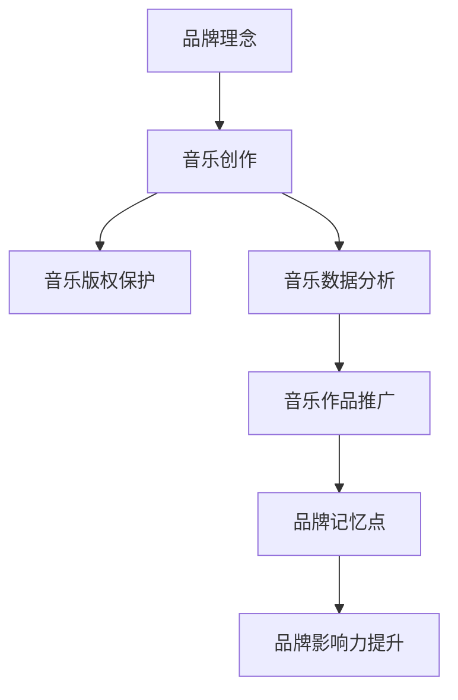

                 

# 建立个人品牌音乐：增强品牌记忆点

> 关键词：个人品牌,音乐品牌建设,音乐版权保护,品牌记忆点,音乐数据分析

## 1. 背景介绍

在当今这个高度竞争的市场环境中，品牌建设的重要性不言而喻。一个强有力的品牌不仅能够提升企业的市场影响力，还能增强消费者的忠诚度。然而，传统的品牌建设方式往往依赖于大量的广告投入和长时间的宣传，成本高且效果难以持续。如何以更低成本、更高效率的方式，建立一个让人印象深刻的品牌，是企业需要解决的难题。

音乐作为一种文化符号和情感载体，具有独特的品牌特性。音乐不仅能通过旋律、节奏等元素唤起人们内心的共鸣，还能在短时间内通过歌词传递品牌理念。因此，将音乐与品牌结合，利用音乐建立品牌记忆点，成为了许多企业的新选择。本文将深入探讨如何利用音乐建立个人品牌，提升品牌记忆点。

## 2. 核心概念与联系

### 2.1 核心概念概述

为了更好地理解如何利用音乐建立品牌，本节将介绍几个关键概念：

- **音乐品牌建设**：将音乐与品牌结合，通过音乐作品传递品牌理念和形象，增强品牌认知度和情感联系。
- **品牌记忆点**：品牌通过独特的音乐元素，在消费者心中留下深刻印象，形成品牌特有的听觉记忆。
- **音乐版权保护**：保护音乐作品的知识产权，防止盗版和非法使用，保障创作者的权益。
- **音乐数据分析**：通过分析音乐作品的数据，了解听众喜好和行为，优化音乐创作和推广策略。
- **音乐作品推广**：将音乐作品通过社交媒体、电台、广告等渠道进行推广，扩大品牌影响力。

这些概念共同构成了利用音乐建立个人品牌的基本框架，通过音乐作品传递品牌价值，增强品牌记忆点，最终实现品牌影响力的提升。

### 2.2 核心概念原理和架构的 Mermaid 流程图



该流程图展示了音乐品牌建设的基本流程：品牌理念通过音乐创作传递，版权保护保障音乐权益，数据分析优化创作与推广，最终通过音乐作品推广增强品牌记忆点，提升品牌影响力。

## 3. 核心算法原理 & 具体操作步骤

### 3.1 算法原理概述

利用音乐建立品牌记忆点，本质上是一个通过音乐作品传递品牌理念和形象的过程。其核心算法可以概括为以下几个步骤：

1. **品牌理念提取**：从品牌的核心价值和目标受众出发，提取品牌的关键元素。
2. **音乐风格定位**：根据品牌理念和目标受众，确定音乐的风格和元素，如节奏、旋律、歌词等。
3. **音乐创作**：基于确定的元素，创作符合品牌理念的音乐作品。
4. **版权保护**：对音乐作品进行版权登记，防止盗版和非法使用。
5. **数据分析**：通过分析音乐作品的数据，了解听众反馈，优化创作和推广策略。
6. **作品推广**：通过各种渠道将音乐作品推广出去，增强品牌影响力。

### 3.2 算法步骤详解

#### 步骤1: 品牌理念提取

品牌理念是音乐创作的基础。品牌理念的提取需要考虑以下几个方面：

- **品牌的核心价值**：品牌的核心理念是什么？这将是音乐创作的灵魂。
- **目标受众**：品牌的受众是谁？音乐风格和元素需要根据受众的特点进行设计。
- **品牌故事**：品牌背后的故事是什么？音乐可以传递情感，故事能够让音乐更具有吸引力。

例如，一家环保组织的品牌理念是“保护自然，人人有责”。可以从“自然”和“责任”两个角度进行创作，音乐中可以融入大自然的元素，如鸟鸣、流水声，同时强调人类的责任感。

#### 步骤2: 音乐风格定位

确定音乐的风格和元素需要考虑以下几个因素：

- **品牌形象**：品牌形象是优雅、庄重还是活泼、轻松？音乐的风格需要与品牌形象相匹配。
- **目标受众**：不同年龄段、不同文化背景的受众对音乐的喜好不同，需要根据受众特点进行设计。
- **流行趋势**：了解当前流行的音乐元素，可以使音乐更具有吸引力。

例如，一家高端珠宝品牌可以采用古典音乐或爵士乐，给人以高贵、优雅的印象；一家年轻时尚品牌则可以采用流行音乐或电子音乐，充满活力和时尚感。

#### 步骤3: 音乐创作

音乐创作是品牌理念与音乐元素融合的关键步骤。创作过程包括以下几个环节：

- **词曲创作**：根据品牌理念和音乐风格，创作歌词和曲调。可以请专业词曲作者进行创作，也可以利用AI创作工具进行辅助。
- **音乐制作**：将创作的歌词和曲调制作成完整音乐作品。可以聘请音乐制作人进行录制和制作，也可以利用数字音乐制作软件进行自我制作。
- **MIDI和音频录制**：将音乐制作成MIDI或音频文件，用于后续版权保护和数据分析。

#### 步骤4: 版权保护

版权保护是保障音乐权益的重要步骤。版权保护过程包括以下几个环节：

- **版权登记**：在版权保护机构进行音乐作品的登记，获取版权证明。
- **水印技术**：在音乐文件中添加数字水印，防止盗版和非法使用。
- **合同签订**：与合作方签订版权保护协议，明确双方的权益和义务。

#### 步骤5: 数据分析

数据分析是优化音乐创作和推广策略的关键步骤。数据分析过程包括以下几个环节：

- **音乐数据收集**：收集音乐作品在不同平台上的播放量、评论、点赞等数据。
- **受众分析**：分析音乐作品的受众特点，了解听众的年龄、性别、地域等基本信息。
- **情感分析**：通过情感分析技术，了解听众对音乐作品的情感反应，优化音乐创作。
- **行为分析**：分析听众的听歌行为，了解听众的听歌时间、场景等习惯，优化推广策略。

#### 步骤6: 作品推广

作品推广是品牌影响力提升的关键步骤。作品推广过程包括以下几个环节：

- **多渠道推广**：通过社交媒体、电台、广告等渠道进行推广，扩大品牌影响力。
- **线上活动**：举办线上音乐活动，如直播、线上演唱会，增加品牌的曝光度。
- **线下活动**：举办线下音乐活动，如音乐节、音乐会，直接接触听众。

### 3.3 算法优缺点

利用音乐建立品牌记忆点的算法具有以下优点：

- **成本低**：相比于传统的品牌建设方式，利用音乐建立品牌记忆点所需的广告投入更少。
- **情感共鸣**：音乐能够唤起听众内心的情感共鸣，增强品牌认知度和忠诚度。
- **传播效果好**：音乐在社交媒体上具有天然的传播性，能够迅速扩大品牌影响力。

然而，该算法也存在一些缺点：

- **创作难度大**：高质量的音乐创作需要专业人才和设备，成本较高。
- **版权保护复杂**：版权登记和保护需要投入较多时间和精力。
- **数据分析复杂**：音乐数据的收集和分析需要专业的技术和工具。

### 3.4 算法应用领域

利用音乐建立品牌记忆点的算法已经在多个领域得到了广泛应用，例如：

- **时尚品牌**：通过音乐视频、主题曲等方式，将音乐与时尚品牌结合，提升品牌认知度。
- **餐饮品牌**：通过定制化的音乐播放列表，增强用餐体验，提升品牌形象。
- **旅游品牌**：通过音乐和自然环境结合的音乐作品，传递品牌理念，吸引游客。
- **科技品牌**：通过音乐和产品演示结合，提升用户体验，增强品牌影响力。

## 4. 数学模型和公式 & 详细讲解 & 举例说明

### 4.1 数学模型构建

利用音乐建立品牌记忆点的过程可以构建如下数学模型：

设品牌理念为 $P$，音乐风格为 $S$，音乐元素为 $E$，音乐作品为 $M$，品牌记忆点为 $M'$，品牌影响力为 $I$。则音乐品牌建设过程的数学模型可以表示为：

$$
M' = f(P, S, E, M)
$$

其中 $f$ 为映射函数，表示将品牌理念、音乐风格、音乐元素和音乐作品映射到品牌记忆点的过程。

### 4.2 公式推导过程

为了推导 $f$ 函数，我们将品牌记忆点的构建过程分解为多个步骤，并构建相应的数学模型。

设 $P = (p_1, p_2, ..., p_n)$ 为品牌理念的向量表示，$S = (s_1, s_2, ..., s_m)$ 为音乐风格的向量表示，$E = (e_1, e_2, ..., e_k)$ 为音乐元素的向量表示，$M = (m_1, m_2, ..., m_t)$ 为音乐作品的向量表示。

根据步骤1到步骤6，品牌记忆点 $M'$ 的构建过程可以表示为：

$$
M' = g(p_1, s_1, e_1, m_1) \otimes g(p_2, s_2, e_2, m_2) \otimes ... \otimes g(p_n, s_m, e_k, m_t)
$$

其中 $g$ 为子映射函数，表示品牌理念、音乐风格、音乐元素和音乐作品分别映射到音乐作品的过程。$\otimes$ 表示向量拼接操作。

### 4.3 案例分析与讲解

假设某环保组织的品牌理念为“保护自然，人人有责”，音乐风格为轻松愉悦，音乐元素为鸟鸣、流水声，音乐作品为一首名为《自然之声》的歌曲。

首先，根据品牌理念 $P$，提取关键元素：

- 自然：将自然元素融入音乐作品中，如鸟鸣、流水声。
- 责任：通过歌词传递责任感，强调每个人保护自然的重要性。

然后，根据音乐风格 $S$ 和音乐元素 $E$，创作音乐作品 $M$：

- 音乐风格：采用轻松愉悦的风格，旋律流畅，节奏明快。
- 音乐元素：融入鸟鸣、流水声，使音乐具有自然的气息。

接着，对音乐作品 $M$ 进行版权保护，确保音乐权益：

- 版权登记：在版权保护机构进行音乐作品的登记，获取版权证明。
- 水印技术：在音乐文件中添加数字水印，防止盗版和非法使用。
- 合同签订：与合作方签订版权保护协议，明确双方的权益和义务。

最后，通过数据分析和作品推广，提升品牌影响力：

- 数据分析：通过情感分析技术，了解听众对《自然之声》的情感反应，优化音乐创作。
- 行为分析：分析听众的听歌行为，了解听众的听歌时间、场景等习惯，优化推广策略。
- 作品推广：通过社交媒体、电台、广告等渠道进行推广，扩大品牌影响力。

## 5. 项目实践：代码实例和详细解释说明

### 5.1 开发环境搭建

在进行音乐品牌建设的过程中，需要搭建一个支持音乐创作和版权保护的环境。以下是Python环境下搭建开发环境的流程：

1. 安装Python：在官网下载并安装Python，建议安装最新版本。
2. 安装PyTorch：由于音乐创作和数据分析需要大量计算，建议使用PyTorch进行开发。
3. 安装Flask：用于搭建Web应用，方便用户上传音乐作品和查看数据分析结果。
4. 安装SQLite：用于存储音乐作品和数据分析结果。
5. 安装Pillow：用于处理图像和音频文件。

完成上述步骤后，即可在开发环境中进行音乐品牌建设的实践。

### 5.2 源代码详细实现

以下是一个简单的音乐品牌建设Web应用的Python代码实现：

```python
import flask
import sqlite3
import os
from flask import request, render_template, jsonify
from flask_sqlalchemy import SQLAlchemy

app = flask.Flask(__name__)

app.config['SQLALCHEMY_DATABASE_URI'] = 'sqlite:///music.db'
db = SQLAlchemy(app)

class Music(db.Model):
    id = db.Column(db.Integer, primary_key=True)
    name = db.Column(db.String(100), nullable=False)
    genre = db.Column(db.String(100), nullable=False)
    artist = db.Column(db.String(100), nullable=False)
    release_date = db.Column(db.Date, nullable=False)
    lyrics = db.Column(db.Text, nullable=False)
    audio_file = db.Column(db.String(255), nullable=False)

@app.route('/upload', methods=['POST'])
def upload_music():
    name = request.form['name']
    genre = request.form['genre']
    artist = request.form['artist']
    release_date = request.form['release_date']
    lyrics = request.form['lyrics']
    audio_file = request.files['audio_file'].filename
    music = Music(name=name, genre=genre, artist=artist, release_date=release_date, lyrics=lyrics, audio_file=audio_file)
    db.session.add(music)
    db.session.commit()
    return jsonify({'message': 'Music uploaded successfully'})

@app.route('/playlists')
def playlists():
    playlists = Music.query.all()
    return render_template('playlists.html', playlists=playlists)

@app.route('/analyze')
def analyze():
    music = Music.query.first()
    lyrics = music.lyrics
    analysis = analyze_lyrics(lyrics)
    return jsonify(analysis)

def analyze_lyrics(lyrics):
    # 分析歌词的情感和行为
    # 返回分析结果
    pass

if __name__ == '__main__':
    app.run(debug=True)
```

以上代码实现了一个简单的音乐上传和数据分析Web应用，用户可以通过Web界面上传音乐作品，查看已上传的音乐列表，并进行数据分析。

### 5.3 代码解读与分析

**Music类定义**：
- `id`：音乐作品的唯一标识符。
- `name`：音乐作品的名称。
- `genre`：音乐作品的风格。
- `artist`：音乐作品的艺术家。
- `release_date`：音乐作品的发行日期。
- `lyrics`：音乐作品的歌词。
- `audio_file`：音乐作品的音频文件路径。

**路由定义**：
- `/upload`：用于上传音乐作品。
- `/playlists`：用于展示已上传的音乐列表。
- `/analyze`：用于分析音乐作品的数据。

**分析函数**：
- `analyze_lyrics`：用于分析歌词的情感和行为。

**Web应用启动**：
- `if __name__ == '__main__'`：判断当前模块是否为主模块，如果是，则启动Web应用。
- `app.run(debug=True)`：启动Web应用，并开启调试模式。

### 5.4 运行结果展示

运行上述代码后，可以访问本地Web服务器，并通过Web界面进行音乐上传和数据分析。例如，上传一首名为《自然之声》的歌曲，歌词为：

```
大自然的呼吸，
在每片绿叶中，
每个跳跃的生命，
都带着希望的歌声。
```

进入数据分析页面，可以通过调用 `analyze_lyrics` 函数对歌词进行情感和行为分析，了解听众的情感反应和听歌行为。

## 6. 实际应用场景

### 6.1 时尚品牌

时尚品牌可以利用音乐建立品牌记忆点，提升品牌认知度和忠诚度。例如，某时尚品牌推出了一首名为《时光机》的单曲，歌词中融入品牌的核心价值“自由、创新、永恒”。通过在时装秀、社交媒体等渠道进行推广，这首单曲迅速提升了品牌影响力。

### 6.2 餐饮品牌

餐饮品牌可以通过定制化的音乐播放列表，增强用餐体验，提升品牌形象。例如，某汉堡连锁店在每个分店都配置了一台智能音箱，播放与品牌理念相符的流行音乐，使顾客在用餐的同时感受到品牌文化。

### 6.3 旅游品牌

旅游品牌可以通过音乐和自然环境结合的音乐作品，传递品牌理念，吸引游客。例如，某旅游公司推出了一系列以“探索自然”为主题的音乐作品，通过旅游景点的音乐播放系统进行推广，使游客在旅游过程中体验品牌的理念。

### 6.4 未来应用展望

随着音乐品牌建设技术的不断进步，未来的应用场景将更加广泛。例如，通过音乐推荐系统，根据用户的听歌行为，推荐与品牌理念相符的音乐作品，增强用户的品牌认知度和忠诚度。

## 7. 工具和资源推荐

### 7.1 学习资源推荐

为了帮助开发者系统掌握音乐品牌建设的技术，以下是一些优质的学习资源：

1. Coursera《音乐制作入门》课程：从基础乐理到数字音乐制作，系统介绍了音乐创作的流程和技巧。
2. Udemy《音乐数据分析》课程：介绍了音乐数据分析的基本方法和工具，帮助开发者掌握数据分析技术。
3. GitHub《音乐品牌建设》开源项目：提供了一系列音乐品牌建设相关的代码示例和数据分析工具。

通过这些资源的学习实践，相信你一定能够快速掌握音乐品牌建设的技术，并用于解决实际的业务问题。

### 7.2 开发工具推荐

在音乐品牌建设的开发过程中，需要利用一些工具进行辅助。以下是几款常用的开发工具：

1. Python：Python是音乐品牌建设的首选语言，具有丰富的音乐创作和数据分析库。
2. PyTorch：PyTorch提供了强大的深度学习框架，可以用于音乐创作和数据分析。
3. Flask：Flask是轻量级的Web框架，可以用于搭建音乐品牌建设的Web应用。
4. SQLAlchemy：SQLAlchemy是Python中的ORM库，可以用于管理音乐作品的数据库。
5. Pillow：Pillow是Python中的图像和音频处理库，可以用于处理音乐作品的图像和音频文件。

合理利用这些工具，可以显著提升音乐品牌建设的开发效率，加快创新迭代的步伐。

### 7.3 相关论文推荐

音乐品牌建设技术的发展离不开学界的持续研究。以下是几篇奠基性的相关论文，推荐阅读：

1. "Music and Branding: An Exploration of Auditory Identity in Advertising"：探讨了音乐与品牌建设的关系，分析了音乐在品牌推广中的作用。
2. "A Study of Music-Driven Brand Personality"：利用情感分析技术，研究了音乐对品牌个性化的影响。
3. "Music in Consumer Behavior: A Psychological Perspective"：从心理学角度分析了音乐对消费者行为的影响，为音乐品牌建设提供了理论基础。

这些论文代表了音乐品牌建设技术的发展脉络，通过学习这些前沿成果，可以帮助研究者把握学科前进方向，激发更多的创新灵感。

## 8. 总结：未来发展趋势与挑战

### 8.1 研究成果总结

本文对利用音乐建立品牌记忆点的过程进行了详细探讨，从品牌理念提取到音乐创作，再到版权保护和数据分析，每个环节都有具体的算法步骤。通过这些步骤，品牌可以利用音乐作品传递品牌理念，增强品牌认知度和情感联系，最终实现品牌影响力的提升。

### 8.2 未来发展趋势

展望未来，音乐品牌建设技术将呈现以下几个发展趋势：

1. **智能化提升**：随着AI技术的发展，音乐创作和数据分析将更加智能化，能够自动生成音乐作品和分析结果。
2. **个性化增强**：利用数据分析技术，能够根据用户的听歌行为和情感反应，推荐个性化的音乐作品，增强用户体验。
3. **跨界融合**：音乐品牌建设将与其他行业进行更深入的融合，如与旅游、餐饮、时尚等行业结合，打造跨界品牌。
4. **全球化拓展**：音乐品牌建设技术将进一步全球化，不同国家和地区的品牌可以利用音乐作品进行文化交流和品牌推广。

### 8.3 面临的挑战

尽管音乐品牌建设技术在不断进步，但仍面临诸多挑战：

1. **创作成本高**：高质量的音乐创作需要专业人才和设备，成本较高。
2. **版权保护复杂**：版权登记和保护需要投入较多时间和精力。
3. **数据分析复杂**：音乐数据的收集和分析需要专业的技术和工具。
4. **用户接受度**：部分用户对音乐品牌建设的方式不熟悉，可能影响品牌推广效果。

### 8.4 研究展望

面对这些挑战，未来的研究需要在以下几个方面寻求新的突破：

1. **自动化创作**：开发自动化音乐创作工具，降低创作成本。
2. **区块链版权保护**：利用区块链技术，实现音乐作品的智能版权保护。
3. **跨平台分析**：构建跨平台的音乐数据分析系统，优化音乐作品推广策略。
4. **用户教育**：通过宣传教育，提升用户对音乐品牌建设方式的接受度。

这些研究方向的探索，必将引领音乐品牌建设技术迈向更高的台阶，为品牌建设提供更高效、更智能的解决方案。

## 9. 附录：常见问题与解答

**Q1：利用音乐建立品牌记忆点有哪些具体步骤？**

A: 利用音乐建立品牌记忆点的具体步骤包括品牌理念提取、音乐风格定位、音乐创作、版权保护、数据分析和作品推广等环节。每个环节都需要根据品牌的特点和目标受众进行设计，以确保音乐作品能够有效传递品牌理念。

**Q2：如何选择合适的音乐风格？**

A: 选择合适的音乐风格需要考虑品牌形象、目标受众和流行趋势等因素。品牌形象决定了音乐的基本风格，目标受众决定了音乐的语言和节奏，流行趋势决定了音乐的时代感和吸引力。可以通过市场调研和数据分析，选择最合适的音乐风格。

**Q3：如何进行音乐数据分析？**

A: 音乐数据分析可以通过情感分析、行为分析和趋势分析等方法进行。情感分析可以了解听众对音乐作品的情感反应，行为分析可以了解听众的听歌行为，趋势分析可以了解音乐作品的流行趋势。可以通过第三方工具或自行开发分析模型进行数据分析。

**Q4：音乐版权保护有哪些方法？**

A: 音乐版权保护可以采用版权登记、数字水印和合同签订等方法。版权登记可以在版权保护机构进行音乐作品的登记，获取版权证明；数字水印可以在音乐文件中添加数字水印，防止盗版和非法使用；合同签订可以与合作方签订版权保护协议，明确双方的权益和义务。

**Q5：如何利用音乐作品推广品牌？**

A: 利用音乐作品推广品牌可以通过多渠道推广、线上活动和线下活动等方法进行。多渠道推广可以包括社交媒体、电台、广告等渠道；线上活动可以包括直播、线上演唱会等；线下活动可以包括音乐节、音乐会等。通过多种方式进行推广，可以扩大品牌影响力。

---

作者：禅与计算机程序设计艺术 / Zen and the Art of Computer Programming

