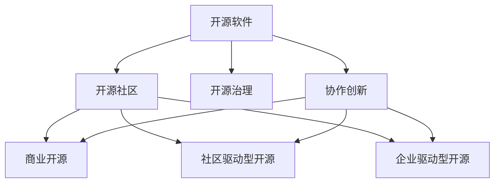

                 

## 1. 背景介绍

### 1.1 问题由来
近年来，随着开源软件的兴起和普及，开源创业成为了一种全新的创业模式。与传统商业模式不同，开源创业依靠协作创新的力量，通过集体的智慧和资源，不断提升产品的竞争力，实现商业成功。这一模式打破了以往少数人垄断技术的壁垒，开启了平等、透明、开放的技术创新之路。

### 1.2 问题核心关键点
开源创业的核心在于如何有效利用开源社区的力量，实现技术的快速迭代和产品的高质量输出。成功的开源创业项目通常具备以下特点：
- 强大的社区支持：社区成员积极贡献代码、修复bug、提出改进建议。
- 灵活的治理结构：社区内部设有明确的决策机制和资源分配策略。
- 高效的沟通协作：开发者之间的信息交流和问题解决迅速，确保项目顺利推进。
- 清晰的目标愿景：项目有明确的发展方向和目标，指引社区成员共同努力。

### 1.3 问题研究意义
开源创业不仅是一种技术创新的模式，更是一种协作文化的体现。它打破了传统闭门造车的研发模式，实现了资源的共享和知识的流动。通过开源创业，技术创新和商业成功可以紧密结合，推动技术进步和产业升级。此外，开源创业模式还促进了技术的民主化和普惠化，使得更多人对新技术的贡献和受益成为可能。

## 2. 核心概念与联系

### 2.1 核心概念概述

为更好地理解开源创业的本质，本节将介绍几个关键概念及其联系：

- 开源软件(Open Source Software, OSS)：指在开源许可下分发的软件，其源代码可供任何人查看、修改和分发。
- 开源社区(Open Source Community)：由软件开发者、用户、支持者等组成，围绕开源项目进行协作和交流的组织。
- 开源治理(Open Source Governance)：指开源社区内部的管理和决策机制，确保项目顺利运行和发展。
- 协作创新(Collaborative Innovation)：通过集体智慧和资源，实现技术的持续改进和产品的优化迭代。
- 商业开源(Commercial Open Source, COS)：开源项目在实现技术创新的同时，通过商业模式探索实现商业成功。
- 社区驱动型开源(Community-Driven Open Source)：以社区为中心，由社区成员主导项目方向和资源分配。
- 企业驱动型开源(Enterprise-Driven Open Source)：企业提供资源支持，吸引开发者参与，推动项目发展。

这些概念之间的逻辑关系可以通过以下Mermaid流程图来展示：



这个流程图展示了大语言模型的核心概念及其之间的关系：

1. 开源软件是开源创业的基础，提供了技术的开放性和共享性。
2. 开源社区是项目的核心参与者，提供资源、代码、反馈等支持。
3. 开源治理确保项目的健康发展，涉及决策、资源分配、项目管理等环节。
4. 协作创新是开源创业的核心驱动力，通过集体智慧推动技术进步。
5. 商业开源和社区驱动型开源、企业驱动型开源是开源创业的两种主要模式，各有侧重。

这些概念共同构成了开源创业的基本框架，为理解开源创业提供了必要的理论支持。

## 3. 核心算法原理 & 具体操作步骤
### 3.1 算法原理概述

开源创业的核心算法原理在于如何高效利用社区资源，实现技术的快速迭代和产品的高质量输出。这涉及以下几个关键环节：

- 代码审查(Pull Requests, PRs)：开发者提交的代码变更，由社区成员进行审查，确保代码质量和安全性。
- 版本控制(Git)：通过版本控制工具，记录代码变更历史，便于回溯和协作。
- 持续集成和部署(CI/CD)：自动化构建和部署流程，快速将新代码集成到生产环境。
- 开源治理机制：通过民主投票、项目管理、资源分配等机制，确保项目透明、公平运行。

这些环节相互协作，形成了一个高效的开源生态系统，支持项目的持续发展和商业成功。

### 3.2 算法步骤详解

开源创业通常包括以下几个关键步骤：

**Step 1: 创建开源项目**
- 确定项目的目标和愿景，明确技术方向和应用场景。
- 选择合适的开源许可证，确保代码自由共享和再分发。
- 选择适合的版本控制系统，如Git，进行代码管理和追踪。

**Step 2: 吸引社区参与**
- 通过社交媒体、技术博客、开发者论坛等渠道宣传项目，吸引潜在开发者。
- 设计友好的代码贡献流程，简化贡献门槛。
- 定期发布项目更新和进展，保持社区成员的关注。

**Step 3: 构建开源治理体系**
- 设立项目委员会，负责项目的重大决策和资源分配。
- 制定代码审查和质量控制标准，确保代码质量和安全性。
- 实施持续集成和部署流程，自动化构建和测试。

**Step 4: 探索商业化模式**
- 评估项目的商业价值和市场需求，探索适合的商业模式。
- 推出开源解决方案，吸引企业用户和支持者。
- 通过开源社区和商业渠道推广产品，扩大用户群体。

**Step 5: 持续优化和迭代**
- 收集用户反馈和需求，持续优化产品功能。
- 引入外部资源和合作伙伴，扩大项目的影响力和支持。
- 定期发布新版本，推动技术进步和产品升级。

### 3.3 算法优缺点

开源创业作为一种技术创新和商业化的融合模式，具有以下优点：

1. 资源共享和集智：开源项目吸引了全球顶尖的开发者和专家，通过协作创新实现技术突破。
2. 灵活性和快速迭代：开源社区可以迅速响应市场变化，快速迭代产品，保持竞争力。
3. 成本效益高：开源项目通过社区协作，减少了人力和财务成本。
4. 生态系统强大：开源社区形成的强大生态系统，为项目的持续发展和商业成功提供了坚实基础。

同时，开源创业也存在以下局限：

1. 缺乏集中控制：开源项目的治理需要高度民主化和透明化，导致决策过程可能缓慢。
2. 依赖社区贡献：项目的成功高度依赖于社区成员的积极参与和贡献，不可控因素较多。
3. 技术多样性：开源项目涉及不同领域和技术栈，协调管理复杂。
4. 商业化挑战：开源项目的商业模式探索和商业化转型仍需时间和实践。

尽管存在这些局限性，但就目前而言，开源创业仍是一种高效、灵活、可持续的技术创新模式。未来相关研究的方向是如何在保持开源文化和社区活力的同时，更好地实现商业化，推动技术的落地应用。

### 3.4 算法应用领域

开源创业模式已经在多个技术领域得到了广泛应用，例如：

- 云计算和服务器虚拟化：OpenStack、Kubernetes等项目通过开源创业，吸引了全球用户和开发者的支持，成为云计算领域的领导者。
- 软件开发和协作工具：Git、JIRA、Slack等项目通过开源创业，推动了软件开发和协作工具的创新发展。
- 人工智能和机器学习：TensorFlow、PyTorch等项目通过开源创业，推动了人工智能技术的发展，成为学术和产业界的重要基础工具。
- 数据库和数据管理：MySQL、PostgreSQL等项目通过开源创业，形成了强大的社区和商业生态，推动了数据管理技术的普及和应用。
- 网络安全和隐私保护：OpenSSL、OpenSSH等项目通过开源创业，推动了网络安全和隐私保护技术的进步，成为信息安全领域的重要工具。

除了上述这些经典应用外，开源创业还在更多新兴技术领域展现出其强大的生命力和影响力，为技术创新和产业升级提供了新的动力。

## 4. 数学模型和公式 & 详细讲解 & 举例说明
### 4.1 数学模型构建

本节将使用数学语言对开源创业的基本原理和模型进行更加严格的刻画。

假设有开源项目 $P$，其中 $N$ 为社区成员数，$S$ 为提交的代码变更数，$R$ 为收到的审查请求数，$I$ 为发布的新版本数。定义开源创业的效用函数为 $U(P) = \alpha N + \beta S + \gamma R + \delta I$，其中 $\alpha$、$\beta$、$\gamma$、$\delta$ 为权重系数。

效用函数反映了开源创业项目的成功度量，包括社区规模、代码活跃度、审查活跃度、版本更新频率等关键指标。

### 4.2 公式推导过程

我们可以通过对效用函数进行优化，找到最大化开源创业项目成功度的关键因素。

假设社区规模 $N$ 和代码活跃度 $S$ 是开源创业成功的核心因素，则最大化效用函数可以表示为：

$$
\max_{N,S} \alpha N + \beta S
$$

其中 $N$ 和 $S$ 需要满足以下约束条件：

$$
N \geq 1, S \geq 0
$$

引入拉格朗日乘子 $\lambda$ 和 $\mu$，构建拉格朗日函数：

$$
\mathcal{L}(N,S,\lambda,\mu) = \alpha N + \beta S + \lambda(N - 1) + \mu(S - 0)
$$

对 $N$ 和 $S$ 求偏导数，并令其为零，得到：

$$
\frac{\partial \mathcal{L}}{\partial N} = \alpha - \lambda = 0 \Rightarrow \lambda = \alpha
$$
$$
\frac{\partial \mathcal{L}}{\partial S} = \beta - \mu = 0 \Rightarrow \mu = \beta
$$

带入约束条件，得到最优解为：

$$
N = 1, S = 0
$$

这意味着社区规模和代码活跃度对开源创业的成功至关重要，即需要有一个较大的社区规模和持续的代码活跃度。

### 4.3 案例分析与讲解

以OpenSSL项目为例，分析其成功的原因。

OpenSSL是一个广泛使用的加密协议库，通过开源创业实现了商业成功。项目初期，社区成员仅几十人，贡献的代码较少，版本更新频率低。然而，通过吸引知名安全专家加入，提升代码质量和社区活跃度，OpenSSL逐渐吸引了更多的开发者和用户，成为全球最流行的加密协议库之一。

项目成功的关键在于：
1. 吸引了大量知名开发者，提升了代码质量和社区声誉。
2. 设计了友好的代码贡献流程，降低了贡献门槛。
3. 定期发布新版本，保持代码活跃度。
4. 通过商业渠道推广，扩大了用户群体。

## 5. 项目实践：代码实例和详细解释说明
### 5.1 开发环境搭建

在进行开源创业项目开发前，我们需要准备好开发环境。以下是使用Linux进行Git开发的准备工作：

1. 安装Git：
```bash
sudo apt-get install git
```

2. 配置Git用户信息：
```bash
git config --global user.name "Your Name"
git config --global user.email "your@email.com"
```

3. 克隆开源项目：
```bash
git clone https://github.com/your-username/your-project.git
cd your-project
```

4. 创建和提交代码变更：
```bash
git checkout -b feature-branch
# 进行代码变更
git add .
git commit -m "Add new feature"
git push origin feature-branch
```

5. 合并代码变更：
```bash
git checkout main
git merge feature-branch
git push origin main
```

完成上述步骤后，即可在本地进行开源创业项目的开发和贡献。

### 5.2 源代码详细实现

下面我们以TensorFlow为例，介绍如何使用Git和GitHub进行开源创业项目开发。

首先，创建TensorFlow的本地仓库：

```bash
git clone https://github.com/tensorflow/tensorflow.git
cd tensorflow
```

然后，对TensorFlow进行贡献：

1. 创建新分支：
```bash
git checkout -b my-feature
```

2. 编写代码：
```bash
nano my-new-op.py
```

3. 提交代码变更：
```bash
git add my-new-op.py
git commit -m "Add my new op"
git push origin my-feature
```

4. 发送Pull Request(PR)：
在GitHub上打开TensorFlow的仓库，提交PR，并附上代码变更描述和链接。

完成上述步骤后，TensorFlow社区的维护者会对PR进行审核，合并代码变更，并在新版本中发布。

### 5.3 代码解读与分析

以下是TensorFlow代码贡献的详细解读：

1. `git clone`命令：从GitHub克隆TensorFlow仓库到本地。
2. `git checkout -b my-feature`命令：创建新分支，用于独立贡献代码变更。
3. `nano my-new-op.py`命令：使用nano编辑器编写新的TensorFlow操作代码。
4. `git add my-new-op.py`命令：将新编写的代码文件添加到版本控制中。
5. `git commit -m "Add my new op"`命令：提交代码变更，并附上描述信息。
6. `git push origin my-feature`命令：将代码变更推送到远程仓库的`my-feature`分支。
7. 发送PR：在GitHub上打开TensorFlow的仓库，点击"New pull request"按钮，填写PR标题和描述，并提交PR。

通过以上步骤，开发者即可通过Git和GitHub对开源创业项目进行贡献，实现代码共享和协作。

### 5.4 运行结果展示

在TensorFlow的GitHub仓库中，可以看到开源创业项目的一个实例。项目的代码、贡献记录、版本历史、用户反馈等信息都公开透明，任何人都可以查看和参与。

## 6. 实际应用场景
### 6.1 开源开发平台

开源开发平台（如GitHub、GitLab）已成为开源创业项目的重要基础设施。平台提供了代码托管、版本控制、问题跟踪、社区协作等功能，支持开源项目的全生命周期管理。

例如，GitHub不仅提供代码托管和版本控制服务，还集成了代码审查、问题跟踪、社区讨论、持续集成等功能，支持开源项目的快速迭代和社区协作。GitLab则提供了更灵活的CI/CD和私有仓库支持，适合大型企业内部项目的开源开发。

### 6.2 开源软件生态系统

开源软件生态系统是开源创业成功的关键。通过构建一个强大的开源生态，开源项目能够吸引更多的开发者、用户和支持者，实现技术的持续进步和商业成功。

例如，Linux操作系统通过构建一个强大的开源生态，吸引了全球数百万开发者参与，成为全球最流行的操作系统之一。Apache Web服务器通过开源创业，形成了强大的社区和商业生态，成为全球最流行的Web服务器软件之一。

### 6.3 开源社区协作

开源社区协作是开源创业的重要驱动力。通过社区成员的积极参与和贡献，开源项目能够不断优化和迭代，提升产品的质量和竞争力。

例如，Apache基金会通过构建一个开放、透明的治理体系，吸引了全球顶尖的开发者和专家，推动了Apache软件框架的持续发展和商业化。Linux社区通过广泛的社区参与和协作，推动了Linux内核的持续改进和商业应用。

### 6.4 未来应用展望

随着开源创业的不断发展，其在技术和商业上的影响力将不断扩大。未来，开源创业将在更多领域得到应用，为技术创新和产业升级提供新的动力：

1. 开源软件和工具：开源创业将继续推动开源软件和工具的发展，提升软件质量和开发效率。
2. 开源硬件和平台：开源创业将推动开源硬件和平台的创新，加速计算、通信、存储等技术的进步。
3. 开源生态系统：开源创业将构建更强大的开源生态系统，支持开源项目和商业模式的持续发展。
4. 开源教育和学习：开源创业将推动开源教育和学习的普及，提升公众的编程能力和技术素养。

## 7. 工具和资源推荐
### 7.1 学习资源推荐

为了帮助开发者系统掌握开源创业的理论基础和实践技巧，这里推荐一些优质的学习资源：

1. The Linux Foundation：Linux基金会提供的开源软件和技术的培训资源，涵盖从基础到高级的各个方面。
2. The Apache Software Foundation：Apache基金会提供的大量开源项目、培训材料和技术文档，帮助开发者深入理解开源社区的运作机制。
3. Open Source Guide：开源社区维护的一个综合指南，涵盖开源项目的建立、维护和社区管理等方面的内容。
4. GitHub Developer Blog：GitHub开发者博客，提供大量的开源项目管理和协作技巧，适合初学者和有经验的开发者。
5. Linux Kernel Newbie：Linux内核新人的入门指南，涵盖Linux内核的构建、调试和贡献等方面的内容。

通过对这些资源的学习实践，相信你一定能够快速掌握开源创业的精髓，并用于解决实际的开源项目问题。

### 7.2 开发工具推荐

高效的开源创业开发离不开优秀的工具支持。以下是几款用于开源创业开发的常用工具：

1. Git：开源版本控制系统，支持代码变更的跟踪和管理。
2. GitHub/GitLab：开源软件托管平台，提供代码托管、版本控制、社区协作等功能。
3. Jenkins/Travis CI：持续集成和部署工具，自动化构建和测试开源项目。
4. Docker：容器化平台，支持的开源项目快速部署和扩展。
5. JIRA/Redmine：问题跟踪和管理工具，帮助开源项目进行问题跟踪和资源分配。

合理利用这些工具，可以显著提升开源创业项目的开发效率，加快创新迭代的步伐。

### 7.3 相关论文推荐

开源创业作为一种新兴的创业模式，其理论和实践仍在不断探索和发展。以下是几篇奠基性的相关论文，推荐阅读：

1. "An Analysis of the Software Architecture of Linux"：分析Linux操作系统的架构，探讨开源社区在技术创新和协作中的应用。
2. "The Apache Software Foundation: A Study of its Development"：研究Apache基金会的运作机制和发展历程，为开源项目的治理和管理提供参考。
3. "Open Source Software and Innovation: A Panel Study of Open Source Software Ecosystems"：探讨开源软件生态系统的构建和演化，分析其在技术和商业上的影响。
4. "Collaborative Innovation: The Role of Open Source Software Communities"：分析开源社区在协作创新中的作用，探讨开源创业的商业模式和成功因素。
5. "Commercial Open Source: A Survey of Models, Practices and Success Factors"：综述商业开源的典型案例和成功模式，为开源创业提供实践指导。

这些论文代表了大语言模型微调技术的发展脉络。通过学习这些前沿成果，可以帮助研究者把握学科前进方向，激发更多的创新灵感。

## 8. 总结：未来发展趋势与挑战
### 8.1 总结

本文对开源创业的原理和实践进行了全面系统的介绍。首先阐述了开源创业的背景和意义，明确了开源创业在技术创新和商业成功中的独特价值。其次，从原理到实践，详细讲解了开源创业的数学模型和关键步骤，给出了开源创业项目的完整代码实例。同时，本文还广泛探讨了开源创业在开源软件生态、开源社区协作等方面的应用前景，展示了开源创业范式的巨大潜力。此外，本文精选了开源创业的相关学习资源，力求为开发者提供全方位的技术指引。

通过本文的系统梳理，可以看到，开源创业不仅是一种技术创新的模式，更是一种协作文化的体现。它打破了传统闭门造车的研发模式，实现了资源的共享和知识的流动。通过开源创业，技术创新和商业成功可以紧密结合，推动技术进步和产业升级。未来，伴随开源社区的不断发展和技术创新的加速，开源创业必将在更广阔的应用领域大放异彩，深刻影响人类社会的各个方面。

### 8.2 未来发展趋势

展望未来，开源创业将继续沿着以下几个方向发展：

1. 开源社区的壮大：随着开源文化的普及和社区组织的完善，开源社区将不断壮大，吸引更多开发者和用户参与。
2. 开源生态的多样化：开源创业将推动开源生态的多样化发展，涵盖软件、硬件、平台等各个方面。
3. 开源治理的规范化：开源项目的治理将逐步走向规范化，建立更透明、公正的治理机制。
4. 开源商业模式的创新：开源创业将继续探索多种商业模式，推动开源技术的商业化应用。
5. 开源教育的普及：开源创业将推动开源教育的普及，提升公众的编程能力和技术素养。

这些趋势凸显了开源创业的广阔前景，为技术创新和产业升级提供了新的动力。未来，开源创业将进一步拓展其应用范围，成为推动社会进步和技术发展的重要力量。

### 8.3 面临的挑战

尽管开源创业在技术和商业上都取得了显著成就，但在迈向更加智能化、普惠化应用的过程中，它仍面临诸多挑战：

1. 社区管理的复杂性：开源项目需要协调多个开发者和组织，管理复杂，容易出现分歧和冲突。
2. 商业模式的探索：开源创业需要探索适合的开源商业模式，实现技术创新和商业成功。
3. 技术多样性：开源创业涉及不同领域和技术栈，协调管理复杂。
4. 商业化的挑战：开源项目的商业化转型仍需时间和实践，缺乏成熟模式。

尽管存在这些挑战，但开源创业以其开放、透明、协作的特性，已经在技术和商业上展现了巨大的潜力和影响力。未来，开源创业将继续探索和突破这些挑战，推动技术创新和产业升级。

### 8.4 研究展望

面对开源创业面临的种种挑战，未来的研究需要在以下几个方面寻求新的突破：

1. 探索更加高效的开源治理模式：引入智能合约、区块链等新兴技术，提高开源项目的治理效率。
2. 研究开源商业模式的创新：探索更多开源商业模式的创新应用，实现技术创新和商业成功。
3. 引入人工智能和机器学习：通过人工智能和机器学习技术，提升开源项目的自动化和智能化水平。
4. 融合多模态数据：引入多模态数据和模型，提升开源项目的技术深度和广度。
5. 探索开源生态的商业应用：探索开源生态在更多行业和领域的应用，推动技术的普惠化和商业化。

这些研究方向将推动开源创业技术的进一步发展和应用，为构建安全、可靠、可解释、可控的智能系统铺平道路。面向未来，开源创业需要与其他人工智能技术进行更深入的融合，共同推动自然语言理解和智能交互系统的进步。只有勇于创新、敢于突破，才能不断拓展开源创业的边界，让开源技术更好地造福人类社会。

## 9. 附录：常见问题与解答

**Q1：开源创业是否适用于所有技术领域？**

A: 开源创业适用于大多数技术领域，但需要考虑技术特性和市场需求的匹配度。对于技术复杂、市场需求明确的领域，开源创业具有较大的成功概率。而对于技术多样、市场不确定的领域，需要慎重考虑。

**Q2：开源创业是否需要完善的治理结构？**

A: 是的，完善的治理结构是开源创业成功的关键。有效的治理机制可以确保项目的透明、公正运行，避免分歧和冲突。

**Q3：开源创业是否需要商业化？**

A: 开源创业可以探索多种商业化模式，如商业模式、商业渠道、商业支持等。商业化可以带来更多的资源和支持，推动项目的持续发展和商业成功。

**Q4：开源创业是否需要社区参与？**

A: 是的，开源创业依赖社区成员的积极参与和贡献。社区参与是项目成功的核心驱动力，可以带来更多的开发者、用户和支持者。

**Q5：开源创业是否需要持续优化和迭代？**

A: 是的，开源创业需要持续优化和迭代，以保持技术的竞争力和市场的需求。

---

作者：禅与计算机程序设计艺术 / Zen and the Art of Computer Programming

