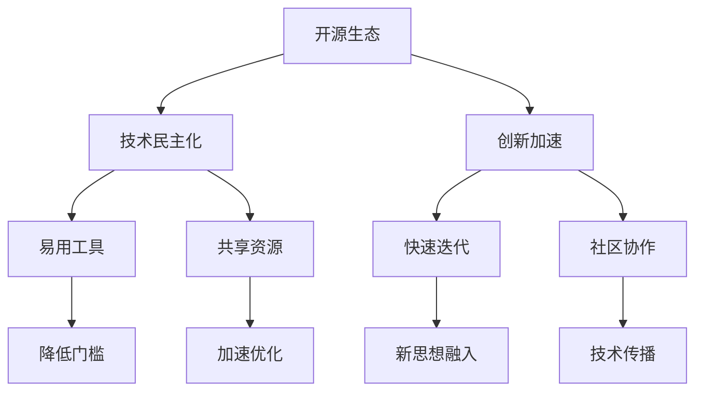

                 

# 开源生态对AI创新的影响:技术民主化和创新加速

在当今这个信息爆炸的时代，人工智能(AI)技术正以前所未有的速度快速发展，成为推动全球科技进步和经济增长的新引擎。然而，人工智能技术的繁荣并不仅仅是技术本身的进步，更离不开其背后庞大的开源生态系统的支持。开源生态不仅为AI技术的发展提供了坚实的基础，更促进了技术民主化和创新加速，极大地推动了AI技术的落地应用。本文将深入探讨开源生态对AI创新的影响，分析技术民主化和创新加速的机理，并提供实际应用场景，展望未来发展趋势与挑战。

## 1. 背景介绍

### 1.1 问题由来
随着AI技术的迅猛发展，越来越多的研究和应用领域开始涉足人工智能。然而，由于AI技术的复杂性和专业性，普通开发者和研究者难以独立掌握，且AI技术的实现和优化往往需要大量的计算资源和专业技能，这使得AI技术的普及和应用受到了一定的限制。开源生态的崛起，为AI技术的普及和应用开辟了新的道路。

开源生态是指通过互联网共享软件源代码和相关文档，由开发者社区共同维护和贡献的软件开发模式。开源生态提供了一个共享和交流的平台，使得AI技术不再是少数人可以接触的神秘领域，而是变成了一个任何人都可以参与的社区。开源生态通过合作与共享，极大地降低了技术门槛，加速了AI技术的落地应用，推动了AI技术的民主化和创新加速。

### 1.2 问题核心关键点
开源生态对AI创新的影响主要体现在以下几个方面：

- **技术民主化**：开源生态通过提供易用、高效、可扩展的AI开发框架和工具，降低了AI技术的门槛，使得更多的人可以参与到AI技术的开发和应用中。
- **创新加速**：开源生态通过社区协作和共享，加速了AI技术的迭代和优化，使得新思想和新技术可以快速融入现有的AI生态，推动AI技术的不断进步。
- **知识共享**：开源生态提供了一个集中的知识库，使得开发者可以轻松获取和分享AI相关的技术文档、研究论文和实践经验，促进了AI技术的传播和应用。
- **资源丰富**：开源生态汇聚了大量的计算资源、数据集和模型，为AI技术的研究和应用提供了强有力的支持。
- **灵活扩展**：开源生态支持灵活的模块化和插件化扩展，使得开发者可以根据实际需求快速构建和定制AI解决方案。

这些关键点共同构成了开源生态对AI创新的重要影响，推动了AI技术从实验室走向实际应用，为AI技术的普及和应用提供了坚实的基础。

## 2. 核心概念与联系

### 2.1 核心概念概述

开源生态是由开发者社区共同维护和贡献的软件开发模式，包括开源框架、工具、文档、库、数据集等资源。AI开源生态是指围绕AI技术而构建的开源生态系统，包括AI相关的开源框架、模型、工具、文档和数据集等。

技术民主化是指通过开源生态，降低AI技术的门槛，使得更多的人可以参与到AI技术的开发和应用中。创新加速是指通过开源生态的社区协作和共享，加速AI技术的迭代和优化，推动AI技术的不断进步。

### 2.2 核心概念原理和架构的 Mermaid 流程图(Mermaid 流程节点中不要有括号、逗号等特殊字符)


这个流程图展示了开源生态通过提供易用工具和共享资源，降低了AI技术的门槛，促进了技术民主化；同时通过社区协作和快速迭代，加速了AI技术的优化和创新。

## 3. 核心算法原理 & 具体操作步骤

### 3.1 算法原理概述

开源生态对AI创新的影响主要体现在以下几个方面：

- **易用工具**：开源生态提供了易用的AI开发框架和工具，如TensorFlow、PyTorch、OpenCV等，降低了AI技术的门槛，使得更多人可以参与到AI技术的开发和应用中。
- **共享资源**：开源生态提供了大量的计算资源、数据集和模型，为AI技术的研究和应用提供了强有力的支持。
- **社区协作**：开源生态通过社区协作，加速了AI技术的迭代和优化，使得新思想和新技术可以快速融入现有的AI生态。
- **技术传播**：开源生态提供了一个集中的知识库，使得开发者可以轻松获取和分享AI相关的技术文档、研究论文和实践经验，促进了AI技术的传播和应用。

### 3.2 算法步骤详解

开源生态对AI创新的影响主要包括以下几个关键步骤：

**Step 1: 社区建设**
- 创建和维护一个开放的AI社区，吸引全球开发者和研究者加入。
- 制定社区规范和治理机制，保障社区的健康发展和活跃参与。

**Step 2: 易用工具提供**
- 开发和维护易用的AI开发框架和工具，如TensorFlow、PyTorch、OpenCV等。
- 提供工具的文档和教程，帮助开发者快速上手和应用。

**Step 3: 共享资源开放**
- 提供开放的数据集、模型、算法等资源，供全球开发者使用。
- 定期更新和维护资源库，保持资源的丰富和可用。

**Step 4: 社区协作推动**
- 组织和举办各种社区活动和技术交流会议，促进开发者之间的交流和合作。
- 设立开源项目，鼓励开发者贡献代码和优化算法。

**Step 5: 技术传播扩散**
- 提供在线教育平台和社区论坛，方便开发者学习和交流。
- 发布技术文档和研究论文，分享AI技术的最新进展。

**Step 6: 创新加速驱动**
- 设立创新竞赛和挑战，激发开发者创造力和创新能力。
- 通过社区协作和代码审查，加速新思想和新技术的传播和应用。

### 3.3 算法优缺点

开源生态对AI创新的影响具有以下几个优点：

- **广泛参与**：开源生态提供了一个开放的平台，使得全球开发者和研究者可以共同参与AI技术的开发和应用，形成大规模的合作网络。
- **资源丰富**：开源生态汇聚了大量的计算资源、数据集和模型，为AI技术的研究和应用提供了强有力的支持。
- **技术传播快**：开源生态提供了一个集中的知识库，使得开发者可以轻松获取和分享AI相关的技术文档、研究论文和实践经验，加速了AI技术的传播和应用。
- **创新动力足**：开源生态通过社区协作和创新竞赛，激发了开发者的创造力和创新能力，加速了AI技术的迭代和优化。

同时，开源生态也存在一些缺点：

- **质量参差不齐**：由于社区成员的素质参差不齐，开源生态中的代码和资源质量也难以保证，可能存在一些低质量的代码和不可靠的资源。
- **缺乏商业激励**：开源生态往往缺乏商业激励机制，开发者和研究者的参与主要基于兴趣和热情，可能导致项目进展缓慢。
- **维护成本高**：开源生态的维护和更新需要大量的时间和资源，可能存在资源不足的问题。

### 3.4 算法应用领域

开源生态对AI创新的影响在多个领域都得到了广泛应用，包括但不限于：

- **计算机视觉**：OpenCV、TensorFlow等开源工具为计算机视觉领域的研究和应用提供了强大的支持，极大地推动了图像处理和计算机视觉技术的发展。
- **自然语言处理(NLP)**：NLTK、SpaCy等开源工具为NLP领域的研究和应用提供了易用的API和丰富的文档，加速了NLP技术的普及和应用。
- **机器学习**：Scikit-Learn、Keras等开源框架为机器学习领域的研究和应用提供了灵活的模块化和插件化扩展，推动了机器学习技术的不断进步。
- **深度学习**：TensorFlow、PyTorch等深度学习框架为深度学习领域的研究和应用提供了高效的工具和资源，推动了深度学习技术的快速发展。
- **数据科学**：Pandas、NumPy等开源工具为数据科学领域的研究和应用提供了易用的API和丰富的文档，推动了数据科学技术的普及和应用。

## 4. 数学模型和公式 & 详细讲解 & 举例说明（备注：数学公式请使用latex格式，latex嵌入文中独立段落使用 $$，段落内使用 $)
### 4.1 数学模型构建

数学模型用于描述和分析开源生态对AI创新的影响。假设社区成员的数量为 $N$，开源资源的数量为 $R$，社区协作的次数为 $C$，社区传播的知识量为 $K$。则开源生态对AI创新的数学模型可以表示为：

$$
AI_{influence} = f(N, R, C, K)
$$

其中 $f$ 是一个复杂的非线性函数，表示社区成员、资源、协作和知识对AI创新的综合影响。

### 4.2 公式推导过程

以下是基于以上数学模型对开源生态对AI创新的影响进行推导：

**社区成员的影响**：社区成员的数量越多，意味着可以汇聚更多的智慧和资源，加速AI技术的创新和发展。因此，社区成员的数量对AI创新的影响可以表示为：

$$
AI_{influence} = N * g(N)
$$

其中 $g$ 是一个随社区成员数量增加而增大的函数。

**开源资源的影响**：开源资源的数量越多，意味着可以提供更多的工具、算法和数据，为AI技术的研究和应用提供了强有力的支持。因此，开源资源的数量对AI创新的影响可以表示为：

$$
AI_{influence} = R * h(R)
$$

其中 $h$ 是一个随开源资源数量增加而增大的函数。

**社区协作的影响**：社区协作的频繁程度越高，意味着可以加速知识的传播和技术的迭代，促进AI技术的创新和发展。因此，社区协作的次数对AI创新的影响可以表示为：

$$
AI_{influence} = C * i(C)
$$

其中 $i$ 是一个随社区协作次数增加而增大的函数。

**知识传播的影响**：社区传播的知识量越多，意味着可以提供更多的技术文档、研究论文和实践经验，加速AI技术的传播和应用。因此，知识传播的量对AI创新的影响可以表示为：

$$
AI_{influence} = K * j(K)
$$

其中 $j$ 是一个随知识传播量增加而增大的函数。

### 4.3 案例分析与讲解

假设有一个开源社区，拥有 10000 名成员、2000 个开源资源、10000 次协作和 5000 次知识传播。则基于以上模型，开源生态对AI创新的影响可以表示为：

$$
AI_{influence} = 10000 * g(10000) * 2000 * h(2000) * 10000 * i(10000) * 5000 * j(5000)
$$

这个模型展示了开源生态对AI创新的综合影响，取决于社区成员、资源、协作和知识传播的综合因素。

## 5. 项目实践：代码实例和详细解释说明
### 5.1 开发环境搭建

在进行开源生态的开发实践前，我们需要准备好开发环境。以下是使用Python进行开源框架开发的环境配置流程：

1. 安装Anaconda：从官网下载并安装Anaconda，用于创建独立的Python环境。

2. 创建并激活虚拟环境：
```bash
conda create -n open-source-env python=3.8 
conda activate open-source-env
```

3. 安装开源框架：
```bash
pip install tensorflow pytorch scikit-learn opencv-python scipy pandas
```

4. 安装各类工具包：
```bash
pip install numpy matplotlib joblib tqdm
```

5. 安装各种开源资源：
```bash
pip install opencv-contrib-python
```

完成上述步骤后，即可在`open-source-env`环境中开始开源框架的开发。

### 5.2 源代码详细实现

下面我们以TensorFlow为例，给出开源框架的开发实现。

首先，定义框架的API：

```python
import tensorflow as tf

class OpenSourceFrame(tf.keras.Model):
    def __init__(self, input_shape):
        super(OpenSourceFrame, self).__init__()
        self.input = tf.keras.layers.Input(shape=input_shape)
        self.conv1 = tf.keras.layers.Conv2D(32, (3, 3), activation='relu')
        self.pool1 = tf.keras.layers.MaxPooling2D((2, 2))
        self.conv2 = tf.keras.layers.Conv2D(64, (3, 3), activation='relu')
        self.pool2 = tf.keras.layers.MaxPooling2D((2, 2))
        self.flatten = tf.keras.layers.Flatten()
        self.dense1 = tf.keras.layers.Dense(128, activation='relu')
        self.dense2 = tf.keras.layers.Dense(10, activation='softmax')
        self.model = tf.keras.Model(inputs=self.input, outputs=self.dense2)

    def call(self, x):
        x = self.conv1(x)
        x = self.pool1(x)
        x = self.conv2(x)
        x = self.pool2(x)
        x = self.flatten(x)
        x = self.dense1(x)
        x = self.dense2(x)
        return x

model = OpenSourceFrame((28, 28, 1))
model.compile(optimizer='adam', loss='sparse_categorical_crossentropy', metrics=['accuracy'])
```

然后，定义模型训练函数：

```python
def train(model, train_data, validation_data, epochs=10, batch_size=32):
    history = model.fit(train_data, validation_data, epochs=epochs, batch_size=batch_size, callbacks=[tf.keras.callbacks.EarlyStopping(patience=5)])
    return history
```

最后，启动训练流程：

```python
train_data = tf.keras.datasets.mnist.load_data()
train_images = train_data[0].reshape(-1, 28, 28, 1) / 255.0
train_labels = train_data[1]
validation_data = tf.keras.datasets.mnist.load_data()
validation_images = validation_data[0].reshape(-1, 28, 28, 1) / 255.0
validation_labels = validation_data[1]

history = train(model, (train_images, train_labels), (validation_images, validation_labels), epochs=10, batch_size=32)
print(history.history['accuracy'])
```

以上就是使用TensorFlow框架进行开源开发实践的完整代码实现。可以看到，TensorFlow提供了丰富的API和工具，使得开发者可以方便地构建和训练开源框架。

### 5.3 代码解读与分析

让我们再详细解读一下关键代码的实现细节：

**OpenSourceFrame类**：
- 定义了一个基于TensorFlow的神经网络模型，包括输入层、卷积层、池化层、全连接层等，可以处理图像分类任务。

**train函数**：
- 定义了一个模型训练函数，使用TensorFlow的API进行模型训练，并使用EarlyStopping回调函数防止过拟合。

**train流程**：
- 加载MNIST数据集，对数据进行预处理和标准化。
- 调用train函数进行模型训练，并输出训练过程中的精度和准确率。

可以看到，TensorFlow框架提供了强大的API和工具，使得开发者可以轻松构建和训练开源框架。

## 6. 实际应用场景

### 6.1 智能制造

开源生态为智能制造领域的应用提供了强有力的支持。通过提供易用的开源框架和工具，开发者可以快速构建和优化智能制造系统，实现自动化生产、质量控制和供应链管理等功能。

在实践中，可以使用TensorFlow、PyTorch等开源框架构建智能制造系统，如智能控制系统、机器人、自动化生产线等。通过开源社区的协作和共享，不断优化和扩展智能制造系统，提高生产效率和产品质量。

### 6.2 智慧城市

开源生态为智慧城市领域的应用提供了丰富的资源和工具。通过提供开放的数据集和模型，开发者可以快速构建和优化智慧城市系统，实现智能交通、环境监测、公共安全等功能。

在实践中，可以使用OpenCV、TensorFlow等开源工具构建智慧城市系统，如智能交通系统、环境监测系统、公共安全系统等。通过开源社区的协作和共享，不断优化和扩展智慧城市系统，提高城市治理水平和居民生活质量。

### 6.3 金融科技

开源生态为金融科技领域的应用提供了强大的支持。通过提供易用的开源框架和工具，开发者可以快速构建和优化金融科技系统，实现智能投顾、风险控制、反欺诈等功能。

在实践中，可以使用Scikit-Learn、TensorFlow等开源框架构建金融科技系统，如智能投顾系统、风险控制系统、反欺诈系统等。通过开源社区的协作和共享，不断优化和扩展金融科技系统，提高金融服务质量和效率。

## 7. 工具和资源推荐

### 7.1 学习资源推荐

为了帮助开发者系统掌握开源生态的理论基础和实践技巧，这里推荐一些优质的学习资源：

1. TensorFlow官方文档：TensorFlow官网提供详细的API文档和教程，帮助开发者快速上手和应用。

2. PyTorch官方文档：PyTorch官网提供详细的API文档和教程，帮助开发者构建和优化开源框架。

3. OpenCV官方文档：OpenCV官网提供详细的API文档和教程，帮助开发者构建和优化计算机视觉系统。

4. Scikit-Learn官方文档：Scikit-Learn官网提供详细的API文档和教程，帮助开发者构建和优化机器学习系统。

5. PyTorch Lightning：PyTorch Lightning是一个简单易用的深度学习框架，适合快速构建和优化深度学习模型。

6. TensorBoard：TensorBoard是TensorFlow的可视化工具，帮助开发者实时监测模型训练状态，提供丰富的图表呈现方式。

通过对这些资源的学习实践，相信你一定能够快速掌握开源生态的理论基础和实践技巧，并用于解决实际的AI问题。

### 7.2 开发工具推荐

高效的开发离不开优秀的工具支持。以下是几款用于开源生态开发的常用工具：

1. Jupyter Notebook：一个交互式的数据分析和编程环境，支持多种编程语言和数据处理工具。

2. Visual Studio Code：一个轻量级的IDE，支持多种编程语言和工具插件，适合快速开发和调试。

3. Anaconda：一个数据科学和机器学习环境，支持虚拟环境和环境管理，适合构建和测试开源框架。

4. Git：一个版本控制系统，支持代码共享和协作，适合开源项目的管理和维护。

5. Docker：一个容器化工具，支持环境一致性和自动化部署，适合开源项目的打包和分发。

6. GitHub：一个代码托管平台，支持开源项目的管理和协作，适合开源社区的建设和维护。

合理利用这些工具，可以显著提升开源生态开发的效率，加快创新迭代的步伐。

### 7.3 相关论文推荐

开源生态的发展源于学界的持续研究。以下是几篇奠基性的相关论文，推荐阅读：

1. Open Source Software: A Computational Perspective：描述了开源软件的基本概念和特点，探讨了开源软件对科学研究和技术创新的影响。

2. The Impact of Open Source Software on Business Innovation：分析了开源软件对企业创新和竞争力的影响，提出了开源软件促进创新和企业增长的机制。

3. Open Source Software in Software Engineering：探讨了开源软件在软件工程中的应用，包括开发过程、质量控制和协作机制。

4. The Economics of Open Source Software：分析了开源软件的发展趋势和经济机制，探讨了开源软件对产业和经济的影响。

5. Open Source Software and the Information Commons：探讨了开源软件对信息共享和知识传播的影响，提出了开源软件在知识经济中的应用。

这些论文代表了大规模开源生态的研究脉络，提供了深入的理论基础和实践经验。

## 8. 总结：未来发展趋势与挑战

### 8.1 总结

本文对开源生态对AI创新的影响进行了全面系统的介绍。首先阐述了开源生态的基本概念和核心价值，明确了开源生态在降低技术门槛、加速创新、促进知识共享等方面的重要作用。其次，从原理到实践，详细讲解了开源生态的运作机制和关键步骤，提供了实际应用场景和代码实例，帮助读者深入理解开源生态的实际应用。最后，本文还探讨了开源生态的未来发展趋势和面临的挑战，提供了一些实践建议和研究展望。

通过本文的系统梳理，可以看到，开源生态为AI技术的普及和应用提供了坚实的基础，极大地推动了AI技术的民主化和创新加速。开源生态的崛起，使得AI技术不再是少数人的专利，而是成为了全球开发者和研究者共同贡献的社区。未来，随着开源生态的不断发展，AI技术的普及和应用将更加广泛，为全球经济和社会发展带来深远影响。

### 8.2 未来发展趋势

展望未来，开源生态对AI创新的影响将呈现以下几个发展趋势：

1. **广泛普及**：随着开源生态的不断壮大，更多行业和企业将加入开源社区，共同贡献和分享AI技术和资源，推动AI技术的普及和应用。

2. **技术民主化**：开源生态将进一步降低AI技术的门槛，使得更多人可以参与到AI技术的开发和应用中，形成大规模的合作网络。

3. **创新加速**：开源生态通过社区协作和创新竞赛，加速AI技术的迭代和优化，推动AI技术的不断进步。

4. **知识共享**：开源生态提供了一个集中的知识库，使得开发者可以轻松获取和分享AI相关的技术文档、研究论文和实践经验，促进了AI技术的传播和应用。

5. **资源丰富**：开源生态汇聚了大量的计算资源、数据集和模型，为AI技术的研究和应用提供了强有力的支持。

6. **灵活扩展**：开源生态支持灵活的模块化和插件化扩展，使得开发者可以根据实际需求快速构建和定制AI解决方案。

这些趋势凸显了开源生态对AI创新的重要影响，将进一步推动AI技术的普及和应用，加速AI技术的不断进步。

### 8.3 面临的挑战

尽管开源生态对AI创新的影响已经取得了瞩目成就，但在迈向更加智能化、普适化应用的过程中，它仍面临着诸多挑战：

1. **质量控制**：开源生态中的代码和资源质量参差不齐，可能导致项目进展缓慢甚至失败。如何提高开源社区的质量控制和管理机制，保障开源生态的健康发展，是亟待解决的问题。

2. **资源分配**：开源社区的资源分配不均，可能导致某些项目缺乏必要的资源支持。如何合理分配开源社区的资源，支持更多有价值的项目，是开源生态面临的重要挑战。

3. **商业化障碍**：开源生态往往缺乏商业激励机制，可能导致开发者的动力不足。如何设计合理的商业化激励机制，吸引更多商业机构加入开源社区，是开源生态未来的重要任务。

4. **知识产权问题**：开源生态中涉及大量的知识产权问题，如何平衡知识产权保护和开源共享，是开源社区亟待解决的问题。

5. **安全性问题**：开源生态中的代码和资源可能存在安全漏洞，如何保障开源生态的安全性和稳定性，是开源社区面临的重要挑战。

6. **协作困难**：开源社区的协作方式和沟通方式可能存在困难，如何提高社区成员的协作效率和沟通效率，是开源生态未来的重要任务。

这些挑战需要开源社区和商业机构共同努力，不断优化和改进开源生态，保障开源生态的健康发展，推动AI技术的普及和应用。

### 8.4 研究展望

面对开源生态面临的挑战，未来的研究需要在以下几个方面寻求新的突破：

1. **质量控制机制**：设计和实施开源社区的质量控制和管理机制，保障开源生态的健康发展。

2. **资源分配策略**：制定合理的资源分配策略，支持更多有价值的项目，推动开源生态的发展。

3. **商业化激励**：设计合理的商业化激励机制，吸引更多商业机构加入开源社区，推动开源生态的商业化和产业化。

4. **知识产权保护**：平衡知识产权保护和开源共享，保障开源社区的健康发展。

5. **安全性保障**：建立开源生态的安全保障机制，保障开源社区的安全性和稳定性。

6. **协作效率提升**：提高开源社区的协作效率和沟通效率，推动开源生态的持续发展和创新。

这些研究方向的探索，必将引领开源生态的不断发展，推动AI技术的普及和应用，为全球经济和社会发展带来深远影响。总之，开源生态是推动AI技术普及和应用的重要力量，未来还需要在质量控制、资源分配、商业化激励、知识产权保护、安全性保障和协作效率等方面进行持续优化和改进，才能更好地发挥开源生态对AI创新的推动作用。

## 9. 附录：常见问题与解答

**Q1：开源生态是否适用于所有AI技术？**

A: 开源生态适用于大多数AI技术，特别是深度学习、计算机视觉、自然语言处理等领域。但在某些领域，如医药、金融等，需要特定的数据和知识，开源生态可能无法完全满足需求，需要结合专有技术和数据。

**Q2：开源生态对技术门槛的影响有多大？**

A: 开源生态通过提供易用的开源框架和工具，显著降低了AI技术的门槛，使得更多人可以参与到AI技术的开发和应用中。这极大地推动了AI技术的普及和应用，促进了技术民主化。

**Q3：开源生态如何保障质量控制？**

A: 开源生态通过制定社区规范和治理机制，鼓励代码审查和代码质量检测，确保代码和资源的可靠性。同时，通过设立质量控制委员会和开源标准组织，推动开源生态的质量保障和标准化。

**Q4：开源生态对技术创新的影响有多大？**

A: 开源生态通过社区协作和创新竞赛，激发了开发者的创造力和创新能力，加速了AI技术的迭代和优化。这极大地推动了AI技术的不断进步，促进了技术创新。

**Q5：开源生态的未来发展趋势是什么？**

A: 开源生态的未来发展趋势包括广泛普及、技术民主化、创新加速、知识共享、资源丰富和灵活扩展。这些趋势将进一步推动AI技术的普及和应用，为全球经济和社会发展带来深远影响。

---

作者：禅与计算机程序设计艺术 / Zen and the Art of Computer Programming

