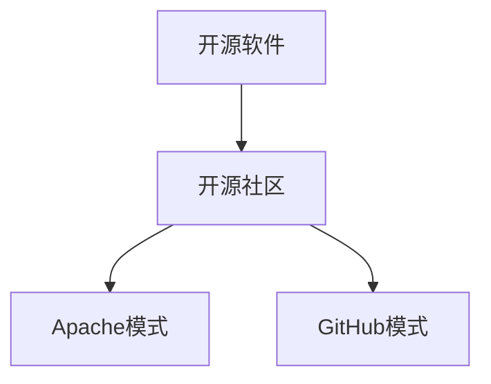

                 

# 开源社区的治理模式:Apache模式和GitHub模式

## 1. 背景介绍

### 1.1 问题由来

开源软件项目的治理问题由来已久。在开源项目中，开发者、贡献者、使用者三方在项目方向、贡献方式、社区治理等方面存在各种分歧。为了解决这些问题，产生了许多不同的开源社区治理模式。其中，Apache和GitHub是两个典型的开源社区治理模式。

### 1.2 问题核心关键点

开源社区治理的核心在于如何平衡好项目的长远发展和即刻贡献，如何保证项目的独立性和可扩展性，同时确保社区的活跃和参与度。Apache模式和GitHub模式正是在这些关键点上提出了不同的解决方案。

### 1.3 问题研究意义

研究开源社区的治理模式，对于促进开源项目的健康发展、提高社区参与度、保障项目的持续创新，具有重要意义。了解和对比不同模式的优缺点，有助于开发者和贡献者找到最适合自己的治理方式，实现项目的长远目标。

## 2. 核心概念与联系

### 2.1 核心概念概述

为更好地理解Apache模式和GitHub模式，本节将介绍几个密切相关的核心概念：

- 开源软件：指通过公开源码和版权的方式，让更多人能够修改、分发和使用源码的软件。
- 开源社区：指基于开源软件项目建立的开发者、贡献者、使用者之间的协作平台。
- 治理模式：指开源社区在项目方向、贡献方式、社区参与等方面的管理方式。
- Apache模式：指Apache基金会采用的治理模式，强调项目独立性和社区自治，并采用严格的贡献者审核和代码审查机制。
- GitHub模式：指GitHub平台上的开源社区采用的治理模式，强调项目的可扩展性和社区参与度，通过工具和机制激励社区贡献者。

这些核心概念之间的逻辑关系可以通过以下Mermaid流程图来展示：



这个流程图展示了大语言模型的核心概念及其之间的关系：

1. 开源软件通过开源社区连接开发者、贡献者、使用者。
2. 开源社区的治理模式决定项目的独立性、可扩展性和社区参与度。
3. Apache模式和GitHub模式是两种主要的开源社区治理模式。

## 3. 核心算法原理 & 具体操作步骤
### 3.1 算法原理概述

Apache模式和GitHub模式的核心算法原理都基于“参与者共同决策”的理念，但侧重点和实现方式略有不同。

**Apache模式**：
- 强调项目的独立性，通常通过设立独立项目，避免被母公司或其他组织控制。
- 社区治理由核心开发团队负责，采用严格的贡献者审核和代码审查机制。
- 通过许可证规范，确保代码的自由使用和修改。

**GitHub模式**：
- 强调项目的可扩展性和社区参与度，通常通过托管在GitHub平台，提供丰富的工具和机制激励社区贡献者。
- 社区治理由社区成员共同参与，通过合并请求、拉取请求等方式实现代码的贡献和审核。
- 通过GitHub平台提供的丰富工具，简化开发流程和项目管理。

### 3.2 算法步骤详解

**Apache模式的实现步骤**：

1. **项目设立**：设立独立项目，确保项目的独立性。
2. **贡献者审核**：设立严格的贡献者审核机制，如邮件审核、代码审查等。
3. **代码审查**：设立代码审查机制，确保代码质量和项目规范。
4. **许可证规范**：采用开源许可证规范，确保代码的自由使用和修改。
5. **社区参与**：设立社区参与机制，如邮件列表、会议等，促进社区交流。

**GitHub模式的实现步骤**：

1. **项目托管**：将项目托管在GitHub平台上，利用其丰富的工具和机制。
2. **代码贡献**：通过GitHub平台提供的工具，如合并请求、拉取请求等，简化代码贡献流程。
3. **社区治理**：利用GitHub平台的社区治理工具，如Issues、Pull Request等，实现社区成员共同决策。
4. **代码审查**：利用GitHub平台提供的代码审查工具，如Pull Request Review，确保代码质量和项目规范。
5. **社区激励**：利用GitHub平台的激励机制，如star、fork、contribution等，激励社区成员积极贡献。

### 3.3 算法优缺点

**Apache模式**：
- **优点**：
  - 确保项目的独立性，减少外部干扰。
  - 严格的贡献者审核和代码审查机制，确保高质量的代码贡献。
  - 严格的许可证规范，保障代码的自由使用和修改。
- **缺点**：
  - 审核流程较为严格，可能会限制新贡献者的参与。
  - 代码审查和许可证规范可能会增加开发成本。
  - 社区参与度相对较低，可能影响项目的活跃度。

**GitHub模式**：
- **优点**：
  - 丰富的工具和机制，简化开发流程和项目管理。
  - 社区成员共同决策，提高项目的参与度和活跃度。
  - 通过star、fork等激励机制，吸引更多开发者和贡献者。
- **缺点**：
  - 项目可能被GitHub平台控制，影响项目的独立性。
  - 代码质量和规范可能依赖社区成员的自觉性，难以保证。
  - 社区参与机制可能过于依赖工具，不够灵活。

### 3.4 算法应用领域

**Apache模式**：
- 适用于对独立性和安全性要求较高的项目，如安全工具、企业级应用等。
- 适用于对贡献质量要求较高的项目，如操作系统、数据库等。
- 适用于具有明确规范和标准的项目，如Apache Hadoop、Apache Kafka等。

**GitHub模式**：
- 适用于对可扩展性和社区参与度要求较高的项目，如开源框架、社区驱动的应用等。
- 适用于具有大量开发者和贡献者的项目，如GitHub本身、jQuery等。
- 适用于希望快速获取反馈和改进的项目，如Web应用、工具类库等。

## 4. 数学模型和公式 & 详细讲解 & 举例说明
### 4.1 数学模型构建

本节将使用数学语言对Apache模式和GitHub模式的治理过程进行更加严格的刻画。

设开源项目为 $P$，社区成员为 $C$，贡献者审核为 $R$，代码审查为 $CQ$，许可证规范为 $L$，社区参与为 $P$。

则Apache模式和GitHub模式的数学模型可以表示为：

$$
\text{Apache模式} = f(P, R, CQ, L, P)
$$

$$
\text{GitHub模式} = g(P, CQ, L, P)
$$

其中，$f$ 和 $g$ 表示不同的治理函数，用于描述不同的治理过程。

### 4.2 公式推导过程

以Apache模式为例，其治理函数 $f$ 的推导如下：

1. **项目设立**：$P \leftarrow \text{Project Initialization}$
2. **贡献者审核**：$R \leftarrow \text{Contributor Review}$
3. **代码审查**：$CQ \leftarrow \text{Code Review}$
4. **许可证规范**：$L \leftarrow \text{License Compliance}$
5. **社区参与**：$P \leftarrow \text{Community Participation}$

将这些步骤组合起来，可以得到：

$$
f(P, R, CQ, L, P) = P \leftarrow \text{Project Initialization}
$$

$$
f(P, R, CQ, L, P) = R \leftarrow \text{Contributor Review}(P)
$$

$$
f(P, R, CQ, L, P) = CQ \leftarrow \text{Code Review}(P, R)
$$

$$
f(P, R, CQ, L, P) = L \leftarrow \text{License Compliance}(P, CQ)
$$

$$
f(P, R, CQ, L, P) = P \leftarrow \text{Community Participation}(P, R, CQ, L)
$$

同理，GitHub模式的治理函数 $g$ 可以推导如下：

1. **项目托管**：$P \leftarrow \text{Project Hosting}$
2. **代码贡献**：$CQ \leftarrow \text{Code Contribution}$
3. **代码审查**：$CQ \leftarrow \text{Code Review}$
4. **许可证规范**：$L \leftarrow \text{License Compliance}$
5. **社区参与**：$P \leftarrow \text{Community Participation}$

将这些步骤组合起来，可以得到：

$$
g(P, CQ, L, P) = P \leftarrow \text{Project Hosting}(P)
$$

$$
g(P, CQ, L, P) = CQ \leftarrow \text{Code Contribution}(P)
$$

$$
g(P, CQ, L, P) = CQ \leftarrow \text{Code Review}(P, CQ)
$$

$$
g(P, CQ, L, P) = L \leftarrow \text{License Compliance}(P, CQ)
$$

$$
g(P, CQ, L, P) = P \leftarrow \text{Community Participation}(P, CQ, L)
$$

### 4.3 案例分析与讲解

以Apache Hadoop和GitHub的Git项目为例，展示两种模式的具体应用：

**Apache Hadoop**：
- **项目设立**：由Apache基金会独立设立。
- **贡献者审核**：采用严格的邮件审核机制，确保贡献者的资质。
- **代码审查**：由核心开发团队进行代码审查，确保代码质量和规范。
- **许可证规范**：采用Apache License规范，保障代码的自由使用和修改。
- **社区参与**：设立邮件列表和会议，促进社区交流和参与。

**Git项目的GitHub模式**：
- **项目托管**：托管在GitHub平台上，利用其丰富的工具和机制。
- **代码贡献**：通过Pull Request进行代码贡献，简化流程。
- **代码审查**：利用Pull Request Review进行代码审查，确保代码质量和规范。
- **许可证规范**：利用GitHub平台提供的许可证选择工具，确保代码的自由使用和修改。
- **社区参与**：利用Issues、Pull Request等工具，实现社区成员共同决策。

## 5. 项目实践：代码实例和详细解释说明
### 5.1 开发环境搭建

在进行开源项目治理模式实践前，我们需要准备好开发环境。以下是使用Python进行Git平台开发的环境配置流程：

1. 安装Git：从官网下载并安装Git客户端，用于版本控制和项目管理。
2. 配置Git账号：在GitHub平台上注册账号，并配置SSH密钥。
3. 安装GitHub Desktop：从官网下载并安装GitHub Desktop，用于与GitHub平台的交互。
4. 安装GitHub Action：从官网下载并安装GitHub Action，用于自动化构建、测试和部署。
5. 安装其他必要的工具：如Jenkins、CI/CD等，用于项目自动化管理。

完成上述步骤后，即可在开发环境中进行开源项目治理模式的实践。

### 5.2 源代码详细实现

这里我们以Apache Hadoop为例，展示如何使用Git进行开源项目治理。

首先，创建新的Git仓库：

```bash
git init
git remote add origin https://github.com/apache/hadoop.git
```

然后，克隆项目到本地：

```bash
git clone origin master
cd hadoop
```

接下来，进行代码贡献和审查：

```bash
git checkout -b feature-branch
# 进行代码贡献，将代码提交到feature-branch分支
git commit -m "Add new feature"
git push origin feature-branch

# 进行代码审查，创建Pull Request
git push origin feature-branch
git pull-request -m "Add new feature"
```

最后，进行许可证规范和社区参与：

```bash
# 选择Apache License规范
# 发布Pull Request，等待审核
# 参与社区讨论和邮件列表交流
```

以上就是使用Git进行Apache模式开源项目治理的完整代码实现。可以看到，Git平台提供了一整套工具链，方便开发者进行代码贡献和审查，同时确保了项目的独立性和规范性。

### 5.3 代码解读与分析

让我们再详细解读一下关键代码的实现细节：

**git init**：初始化新的Git仓库，创建 .git目录。

**git remote add origin**：添加远程仓库地址 origin，用于将本地代码推送到GitHub平台。

**git clone origin master**：克隆远程仓库master分支到本地。

**git checkout -b feature-branch**：创建新的feature-branch分支，用于代码贡献和审查。

**git commit -m "Add new feature"**：提交代码，并添加提交信息。

**git push origin feature-branch**：将feature-branch分支推送到GitHub平台。

**git pull-request -m "Add new feature"**：创建Pull Request，描述代码贡献内容。

**git push origin feature-branch**：将Pull Request推送到GitHub平台。

**git pull-request -m "Add new feature"**：等待审核通过，将代码合并到master分支。

**git push origin feature-branch**：发布Pull Request，通知社区成员。

**git pull-request -m "Add new feature"**：参与社区讨论和邮件列表交流。

可以看到，Git平台提供了一整套工具链，方便开发者进行代码贡献和审查，同时确保了项目的独立性和规范性。

当然，工业级的系统实现还需考虑更多因素，如许可证选择、社区参与机制、项目依赖管理等。但核心的治理流程基本与此类似。

## 6. 实际应用场景
### 6.1 智能客服系统

基于开源社区的治理模式，智能客服系统可以广泛应用于智能客服系统的构建。传统客服往往需要配备大量人力，高峰期响应缓慢，且一致性和专业性难以保证。而使用开源社区的治理模式，可以7x24小时不间断服务，快速响应客户咨询，用自然流畅的语言解答各类常见问题。

在技术实现上，可以采用Apache模式，设立独立的开源项目，利用严格的审核和代码审查机制，确保客服系统的高质量和稳定性。同时，通过社区参与机制，吸纳更多的贡献者，提升系统的活跃度和可扩展性。

### 6.2 金融舆情监测

金融机构需要实时监测市场舆论动向，以便及时应对负面信息传播，规避金融风险。传统的人工监测方式成本高、效率低，难以应对网络时代海量信息爆发的挑战。基于开源社区的治理模式，可以构建金融舆情监测系统。

具体而言，可以设立独立的开源项目，利用GitHub平台丰富的工具和机制，自动化收集金融领域相关的新闻、报道、评论等文本数据，并自动进行分类和情感分析。利用社区成员的贡献和审查，提升系统的准确性和鲁棒性。同时，通过Pull Request机制，快速迭代和优化系统。

### 6.3 个性化推荐系统

当前的推荐系统往往只依赖用户的历史行为数据进行物品推荐，无法深入理解用户的真实兴趣偏好。基于开源社区的治理模式，个性化推荐系统可以更好地挖掘用户行为背后的语义信息，从而提供更精准、多样的推荐内容。

在实践中，可以设立独立的开源项目，利用GitHub平台提供的工具和机制，自动化收集用户浏览、点击、评论、分享等行为数据，并提取和用户交互的物品标题、描述、标签等文本内容。利用社区成员的贡献和审查，提升系统的准确性和鲁棒性。同时，通过Pull Request机制，快速迭代和优化系统。

### 6.4 未来应用展望

随着开源社区的不断发展，基于社区的治理模式将在更多领域得到应用，为传统行业带来变革性影响。

在智慧医疗领域，基于开源社区的治理模式，可以构建医疗问答、病历分析、药物研发等应用，促进医疗服务的智能化水平，辅助医生诊疗，加速新药开发进程。

在智能教育领域，利用开源社区的治理模式，可以构建作业批改、学情分析、知识推荐等应用，因材施教，促进教育公平，提高教学质量。

在智慧城市治理中，利用开源社区的治理模式，可以构建城市事件监测、舆情分析、应急指挥等应用，提高城市管理的自动化和智能化水平，构建更安全、高效的未来城市。

此外，在企业生产、社会治理、文娱传媒等众多领域，基于开源社区的治理模式的应用也将不断涌现，为经济社会发展注入新的动力。相信随着社区的不断壮大和技术的持续创新，开源社区的治理模式必将在构建人机协同的智能时代中扮演越来越重要的角色。

## 7. 工具和资源推荐
### 7.1 学习资源推荐

为了帮助开发者系统掌握开源社区的治理模式，这里推荐一些优质的学习资源：

1. Apache官方文档：Apache基金会的官方文档，包含详细的项目设立、审核和规范等信息。
2. GitHub官方文档：GitHub平台的官方文档，包含丰富的工具和机制使用指南。
3. Git教程：Git官方提供的教程，适合初学者快速上手。
4. GitHub Actions教程：GitHub官方提供的GitHub Actions教程，介绍自动化构建、测试和部署的最佳实践。
5. GitHub社区：GitHub平台的社区讨论区，聚集了全球开发者和贡献者，提供丰富的讨论和学习资源。

通过对这些资源的学习实践，相信你一定能够快速掌握开源社区的治理模式，并用于解决实际的开发问题。
###  7.2 开发工具推荐

高效的开发离不开优秀的工具支持。以下是几款用于开源社区治理的常用工具：

1. Git：开源版本控制系统，用于版本控制和项目管理。
2. GitHub Desktop：GitHub平台的桌面客户端，方便开发者进行代码贡献和审查。
3. GitHub Action：GitHub平台提供的自动化构建、测试和部署工具。
4. Jenkins：开源的CI/CD工具，支持多种构建工具和插件。
5. Docker：开源的容器技术，方便开发者进行代码部署和测试。

合理利用这些工具，可以显著提升开源社区的治理效率，加快创新迭代的步伐。

### 7.3 相关论文推荐

开源社区的治理模式的发展源于学界的持续研究。以下是几篇奠基性的相关论文，推荐阅读：

1. Apache基金会治理模式研究：详细介绍Apache基金会的治理机制和实践经验。
2. GitHub平台的社区治理：研究GitHub平台的社区治理模式和机制。
3. Git版本控制与项目管理：深入探讨Git版本控制和项目管理的最佳实践。
4. GitHub Actions的最佳实践：介绍GitHub Actions的高级用法和最佳实践。
5. Git社区和开源项目管理：探讨Git社区和开源项目管理的成功经验和挑战。

这些论文代表了大语言模型微调技术的发展脉络。通过学习这些前沿成果，可以帮助研究者把握学科前进方向，激发更多的创新灵感。

## 8. 总结：未来发展趋势与挑战
### 8.1 总结

本文对开源社区的治理模式Apache模式和GitHub模式进行了全面系统的介绍。首先阐述了开源软件项目和开源社区的概念及其治理模式的重要性，明确了Apache模式和GitHub模式的治理机制和实践方式。其次，从原理到实践，详细讲解了Apache模式和GitHub模式的数学模型和具体步骤，给出了开源社区治理模式的完整代码实例。同时，本文还广泛探讨了Apache模式和GitHub模式在智能客服、金融舆情、个性化推荐等多个行业领域的应用前景，展示了开源社区治理模式的巨大潜力。此外，本文精选了开源社区的各类学习资源，力求为读者提供全方位的技术指引。

通过本文的系统梳理，可以看到，Apache模式和GitHub模式正在成为开源社区治理的重要范式，极大地促进了开源项目的健康发展、提高了社区参与度、保障了项目的持续创新。未来，伴随开源社区的不断壮大和技术的持续创新，Apache模式和GitHub模式必将在构建人机协同的智能时代中扮演越来越重要的角色。

### 8.2 未来发展趋势

展望未来，开源社区的治理模式将呈现以下几个发展趋势：

1. 开源项目将更加多元化：随着开源社区的壮大，项目类型将更加多样，从企业级应用到个人项目，从基础工具到垂直应用，都能找到适合自己的开源项目。

2. 社区治理将更加民主化：开源社区将更加注重社区成员的参与和贡献，通过投票、决策等方式实现社区自治，减少外部干预。

3. 代码质量将更加严格：开源社区将更加注重代码质量和规范，通过严格的代码审查和贡献者审核，确保项目的高质量和稳定性。

4. 工具和机制将更加完善：开源社区将不断丰富工具和机制，通过自动化构建、测试、部署等方式，提高项目的开发效率和可维护性。

5. 开源项目将更加开放：开源社区将更加注重开放和共享，通过开源许可证规范，保障代码的自由使用和修改。

以上趋势凸显了开源社区治理模式的广阔前景。这些方向的探索发展，必将进一步提升开源社区的治理水平，促进开源项目的健康发展。

### 8.3 面临的挑战

尽管开源社区的治理模式已经取得了显著成果，但在迈向更加智能化、普适化应用的过程中，仍面临诸多挑战：

1. 项目独立性受限：开源社区的项目独立性可能会受到GitHub平台或其他因素的限制，影响项目的自由发展。

2. 代码质量和规范难以保证：开源社区的项目质量和规范依赖社区成员的自觉性，难以全面保障。

3. 社区参与度不够高：开源社区的社区参与度可能会受到工具和机制的限制，影响项目的活跃度。

4. 贡献者审核流程复杂：开源社区的贡献者审核流程可能过于繁琐，限制了新贡献者的参与。

5. 许可证规范复杂：开源社区的许可证规范可能过于复杂，增加了开发者的学习成本。

6. 社区治理机制不完善：开源社区的治理机制可能过于依赖工具，不够灵活。

正视开源社区治理面临的这些挑战，积极应对并寻求突破，将是开源社区治理走向成熟的必由之路。相信随着学界和产业界的共同努力，这些挑战终将一一被克服，开源社区的治理模式必将在构建人机协同的智能时代中扮演越来越重要的角色。

### 8.4 研究展望

面对开源社区治理所面临的种种挑战，未来的研究需要在以下几个方面寻求新的突破：

1. 探索无监督和半监督贡献审核机制。摆脱对大量贡献者审核的依赖，利用自监督学习、主动学习等无监督和半监督范式，最大限度利用非结构化数据，实现更加灵活高效的贡献审核。

2. 研究更灵活的代码审查机制。开发更加灵活的代码审查工具，减少审查流程对贡献者的限制，提高项目的可扩展性。

3. 融合更多开源工具和机制。将更多开源工具和机制与社区治理结合，简化贡献流程和项目管理，提高项目的开发效率和可维护性。

4. 引入更多社区激励机制。通过更多的社区激励机制，如star、fork、contribution等，激励社区成员积极贡献，提升项目的活跃度和参与度。

5. 结合更多开源平台。将开源社区治理模式与其他开源平台结合，如Apache、Google Cloud等，实现跨平台协作，提升项目的可扩展性和影响力。

6. 加强开源社区的伦理和安全保障。建立开源社区的伦理和安全保障机制，确保开源项目的健康发展，防止恶意攻击和数据泄露。

这些研究方向的探索，必将引领开源社区的治理模式迈向更高的台阶，为开源项目的健康发展提供更坚实的保障。面向未来，开源社区的治理模式还需要与其他人工智能技术进行更深入的融合，如知识表示、因果推理、强化学习等，多路径协同发力，共同推动开源社区的持续发展和创新。

## 9. 附录：常见问题与解答

**Q1：开源社区的治理模式有哪些优缺点？**

A: 开源社区的治理模式具有以下优缺点：

**优点**：
- 开源社区的治理模式具有高度的自治性和开放性，能够吸引全球开发者和贡献者的积极参与。
- 开源社区的治理模式具有高度的灵活性和可扩展性，能够适应各种类型的开源项目。
- 开源社区的治理模式具有高度的透明性和可追溯性，能够确保项目的公正性和可信度。

**缺点**：
- 开源社区的治理模式可能会受到GitHub平台或其他因素的限制，影响项目的独立性。
- 开源社区的治理模式可能会受到社区成员的自觉性和规范性的限制，难以全面保障项目的质量和规范。
- 开源社区的治理模式可能会受到社区参与度的限制，影响项目的活跃度和可扩展性。

**Q2：如何选择合适的开源社区治理模式？**

A: 选择开源社区治理模式时，需要考虑以下因素：

1. 项目的独立性：对于需要高度独立性的项目，选择Apache模式更为适合。
2. 项目的可扩展性：对于需要高度可扩展性的项目，选择GitHub模式更为适合。
3. 项目的参与度：对于需要高度社区参与的项目，选择GitHub模式更为适合。
4. 项目的规范性：对于需要高度规范性的项目，选择Apache模式更为适合。
5. 项目的开发效率：对于需要高度开发效率的项目，选择GitHub模式更为适合。

**Q3：开源社区的治理模式是否适用于所有类型的项目？**

A: 开源社区的治理模式适用于大多数类型的项目，但并不适用于所有类型的项目。对于一些需要高度独立性和安全性要求的项目，选择Apache模式更为适合。对于一些需要高度可扩展性和社区参与度的项目，选择GitHub模式更为适合。对于一些需要高度规范性和开发效率的项目，选择GitHub模式更为适合。

总之，选择合适的开源社区治理模式需要根据项目的实际需求和特点进行综合考虑。

---

作者：禅与计算机程序设计艺术 / Zen and the Art of Computer Programming

