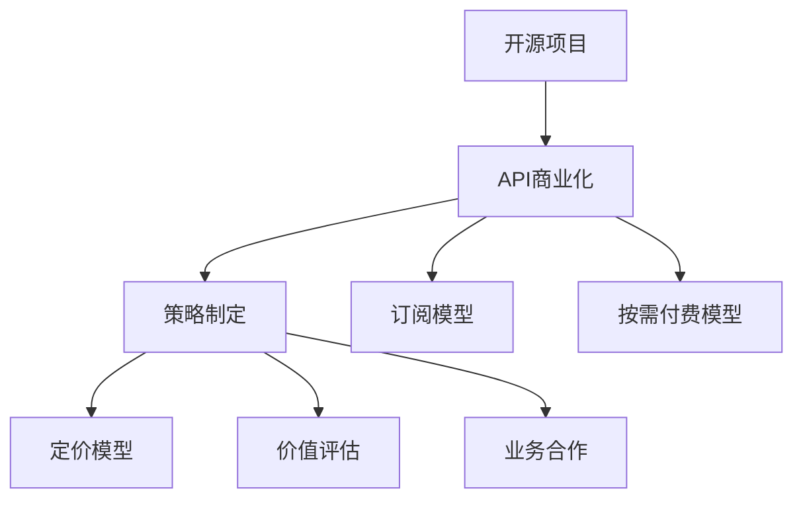

                 

# 开源项目的API商业化：策略和定价模型

> 关键词：开源项目,API商业化,策略制定,定价模型,价值评估,业务合作,订阅模型,按需付费,数据加密,安全保障

## 1. 背景介绍

随着开源软件和开源社区的蓬勃发展，越来越多的企业开始采用开源项目作为其技术栈的重要组成部分。然而，尽管开源项目具有灵活、开放、高效等诸多优势，其商业化仍面临诸多挑战。如何在保护开发者社区利益的同时，实现开源项目的可持续发展和盈利，成为一项亟待解决的重要问题。本文旨在探讨开源项目的API商业化策略和定价模型，为相关企业提供可行的解决方案。

## 2. 核心概念与联系

### 2.1 核心概念概述

为更好地理解开源项目API商业化的策略和定价模型，本节将介绍几个关键概念：

- 开源项目(Open Source Project)：指公开源代码并允许任何人自由使用、修改、分发软件的项目。典型的开源项目包括Linux内核、Apache HTTP Server等。
- API商业化(API Commercialization)：指将开源项目的API服务化并开放给商业用户使用，收取费用以实现盈利的过程。常见的商业化模式包括按需付费、订阅模型等。
- 策略制定(Strategic Planning)：指制定和实施API商业化的具体计划和策略，包括目标设定、市场分析、定价策略、合作模式等。
- 定价模型(Pricing Model)：指基于API服务的成本、价值、市场需求等因素，设计出合理的收费标准。常用的定价模型包括订阅模型、按需付费模型等。
- 价值评估(Value Assessment)：指对API服务的实际价值进行评估，以指导定价和商业模式选择。价值评估通常包括对技术、市场、用户需求的全面考量。
- 业务合作(Business Collaboration)：指与第三方企业或开发者社区合作，共同推广和使用API服务的过程。业务合作有助于提高API服务的知名度和用户数量。
- 订阅模型(Subscription Model)：指用户按固定周期（如月度、年度）订阅API服务，并支付一定费用的模式。
- 按需付费模型(Pay-As-Use Model)：指用户根据实际使用量支付费用的模式，通常用于单次请求量较大、周期性较低的场景。

这些核心概念之间的逻辑关系可以通过以下Mermaid流程图来展示：



这个流程图展示的开源项目API商业化的核心概念及其之间的关系：

1. 开源项目通过API商业化获取商业价值。
2. 策略制定对商业化过程进行指导，包括目标设定、市场分析等。
3. 定价模型设计收费标准，以实现盈利。
4. 价值评估评估API服务的实际价值，指导定价和商业模式选择。
5. 业务合作增加API服务的使用量和用户群体。
6. 订阅模型和按需付费模型是常见的定价模式，需根据市场和用户需求选择合适的模式。

## 3. 核心算法原理 & 具体操作步骤

### 3.1 算法原理概述

开源项目API商业化的核心在于，通过将API服务化并开放给商业用户使用，收取费用以实现盈利。其核心算法原理可以概括为：

1. **需求分析**：通过市场调研和用户反馈，确定目标市场和用户群体。
2. **价值评估**：评估API服务的实际价值，包括技术难度、市场规模、用户需求等。
3. **定价策略**：根据价值评估结果，设计合理的收费标准。
4. **策略实施**：制定具体的商业化策略，包括市场推广、合作模式等。
5. **用户获取**：通过有效渠道获取目标用户，并提供优质的API服务。
6. **客户留存**：通过客户关系管理、定期优惠等方式，提高用户留存率。
7. **持续改进**：根据用户反馈和市场变化，持续改进API服务和商业模式。

### 3.2 算法步骤详解

以下我们将详细介绍开源项目API商业化的各个步骤：

**Step 1: 需求分析**
- **市场调研**：通过问卷调查、用户访谈等方式，了解目标市场和用户需求。
- **竞争分析**：分析同类产品的市场占有率、优势和劣势，确定差异化策略。
- **用户画像**：根据市场调研结果，构建目标用户的详细画像。

**Step 2: 价值评估**
- **技术评估**：评估API服务的技术复杂度、开发成本、维护成本等。
- **市场评估**：评估目标市场的大小、增长潜力、市场占有率等。
- **用户需求评估**：通过问卷调查、访谈等方式，了解用户对API服务的需求和痛点。

**Step 3: 定价策略**
- **成本加成**：根据API服务的开发、维护成本，设计合理的收费标准。
- **价值导向**：根据API服务的价值和用户需求，制定差异化的收费策略。
- **竞争对标**：参考同类产品的定价，调整自己的收费策略。

**Step 4: 策略实施**
- **市场推广**：通过线上线下的多种渠道，推广API服务。
- **合作伙伴**：寻找潜在的合作伙伴，共同推广API服务。
- **用户获取**：通过免费试用、优惠活动等方式，吸引用户注册使用。

**Step 5: 用户获取**
- **注册流程**：设计简洁、易用的注册流程，方便用户快速使用。
- **文档支持**：提供详细的API文档和示例代码，帮助用户快速上手。
- **技术支持**：提供高效的技术支持，解决用户在使用过程中遇到的问题。

**Step 6: 客户留存**
- **客户关系管理**：通过CRM系统，维护客户关系，定期回访客户，了解客户需求。
- **优惠活动**：定期推出优惠活动，提高用户粘性。
- **持续改进**：根据用户反馈，持续改进API服务和功能。

**Step 7: 持续改进**
- **用户反馈**：定期收集用户反馈，了解用户痛点和需求。
- **功能扩展**：根据用户反馈和市场需求，持续扩展API功能和应用场景。
- **市场变化**：根据市场变化，及时调整商业化策略和定价模型。

### 3.3 算法优缺点

开源项目API商业化具有以下优点：
1. 灵活性高。开源项目具有高度的灵活性，可以根据市场需求快速调整API功能和定价策略。
2. 市场潜力大。开源项目的普及性和开放性，使得其市场潜力和用户基数大。
3. 成本低。开源项目初期开发和维护成本较低，有助于实现快速盈利。
4. 社区支持。开源项目的社区支持使得API服务的推广和维护更加容易。

同时，该方法也存在以下局限性：
1. 依赖社区。开源项目的商业化需要依赖开发者社区的支持，一旦社区失去兴趣，商业化进程可能受阻。
2. 商业风险高。开源项目的商业化涉及到社区利益与商业利益的平衡，处理不当可能引发社区反感。
3. 用户留存难。开源项目的商业化需要用户持续付费，如何提高用户粘性和留存率，是一个重要的挑战。
4. 安全性问题。开源项目的商业化涉及到数据安全和技术保密，需要制定相应的安全保障措施。

尽管存在这些局限性，但就目前而言，开源项目的API商业化仍然是一种高效且可行的商业化模式，为开源项目提供了可持续发展的可能性。

### 3.4 算法应用领域

开源项目API商业化的方法在以下几个领域得到了广泛应用：

- 云服务：云计算服务商（如AWS、Google Cloud）将开源软件服务化，提供API接口，用户按需付费使用。
- 软件开发平台：软件开发平台（如GitHub、GitLab）提供API接口，用于代码托管、仓库管理等，用户可以选择按需付费或订阅模型。
- 大数据分析：大数据分析公司（如Cloudera、Databricks）将开源大数据工具（如Hadoop、Spark）封装为API服务，提供按需付费或订阅模式。
- 物联网平台：物联网平台（如ThingWorx）将开源物联网设备管理软件封装为API服务，提供按需付费或订阅模式。

除了上述这些经典应用外，开源项目的API商业化也被创新性地应用到更多场景中，如数字营销、人工智能、区块链等，为相关技术的发展提供了新的动力。

## 4. 数学模型和公式 & 详细讲解 & 举例说明

### 4.1 数学模型构建

本节将使用数学语言对开源项目API商业化的定价模型进行更加严格的刻画。

设API服务的成本为C，用户需求为D，价值为V，市场价格为P，用户数量为U，则定价模型的数学模型可以表示为：

$$
P = \frac{V}{C} \times D
$$

其中，$P$为API服务的收费价格，$C$为API服务的成本，$V$为API服务的价值，$D$为用户需求。

在实际应用中，我们需要根据具体情况调整定价模型的参数，如将成本$C$细分为开发成本、维护成本、运营成本等。

### 4.2 公式推导过程

以下我们将详细推导定价模型的公式：

**Step 1: 成本评估**

设API服务的总成本为$C$，包括开发成本$C_{dev}$、维护成本$C_{maint}$、运营成本$C_{op}$。则：

$$
C = C_{dev} + C_{maint} + C_{op}
$$

**Step 2: 价值评估**

设API服务的价值为$V$，包括技术难度、市场规模、用户需求等因素。根据价值评估结果，我们将$V$表示为：

$$
V = V_{tech} + V_{market} + V_{user}
$$

其中，$V_{tech}$表示API服务的技术难度，$V_{market}$表示市场规模，$V_{user}$表示用户需求。

**Step 3: 定价模型**

根据定价模型的数学模型，将$C$和$V$代入，得到：

$$
P = \frac{V}{C} \times D = \frac{V_{tech} + V_{market} + V_{user}}{C_{dev} + C_{maint} + C_{op}} \times D
$$

在实际应用中，我们需要根据具体情况调整定价模型的参数，如将成本$C$细分为开发成本、维护成本、运营成本等，进一步简化为：

$$
P = \frac{V_{tech} + V_{market} + V_{user}}{C_{dev} + C_{maint} + C_{op}} \times D
$$

### 4.3 案例分析与讲解

以GitHub API商业化为例，我们将详细介绍定价模型的应用：

GitHub提供了一系列的API接口，用于代码托管、仓库管理、问题跟踪等功能。根据市场需求和用户需求，GitHub设计了多种定价策略，包括按需付费模型和订阅模型。

**按需付费模型**：

按需付费模型适用于单次请求量较大、周期性较低的场景。用户可以根据实际使用量支付费用，计算公式为：

$$
P = \frac{V_{tech} + V_{market} + V_{user}}{C_{dev} + C_{maint} + C_{op}} \times D
$$

其中，$V_{tech}$表示GitHub API的技术难度，$V_{market}$表示GitHub的市场规模，$V_{user}$表示用户需求，$D$表示用户需求量，$C$表示GitHub API的成本。

**订阅模型**：

订阅模型适用于单次请求量较小、周期性较高的场景。用户按固定周期（如月度、年度）订阅API服务，并支付一定费用，计算公式为：

$$
P = \frac{V_{tech} + V_{market} + V_{user}}{C_{dev} + C_{maint} + C_{op}} \times D \times k
$$

其中，$k$表示订阅周期（如1个月、1年），$V_{tech}$表示GitHub API的技术难度，$V_{market}$表示GitHub的市场规模，$V_{user}$表示用户需求，$D$表示用户需求量，$C$表示GitHub API的成本。

通过以上定价模型，GitHub成功地实现了商业化，同时保证了开源社区的利益，取得了巨大的商业成功。

## 5. 项目实践：代码实例和详细解释说明

### 5.1 开发环境搭建

在进行API商业化实践前，我们需要准备好开发环境。以下是使用Python进行Flask开发的环境配置流程：

1. 安装Anaconda：从官网下载并安装Anaconda，用于创建独立的Python环境。

2. 创建并激活虚拟环境：
```bash
conda create -n flask-env python=3.8 
conda activate flask-env
```

3. 安装Flask：
```bash
pip install flask
```

4. 安装SQLAlchemy：
```bash
pip install sqlalchemy
```

5. 安装Flask-RESTful：
```bash
pip install Flask-RESTful
```

6. 安装Flask-HTTPAuth：
```bash
pip install Flask-HTTPAuth
```

7. 安装Flask-SQLAlchemy：
```bash
pip install Flask-SQLAlchemy
```

完成上述步骤后，即可在`flask-env`环境中开始API商业化的实践。

### 5.2 源代码详细实现

这里我们以一个简单的API服务为例，给出使用Flask进行API商业化的Python代码实现。

```python
from flask import Flask, request, jsonify
from flask_restful import Resource, Api
from flask_sqlalchemy import SQLAlchemy
from flask_httpauth import HTTPBasicAuth
from werkzeug.security import generate_password_hash, check_password_hash

app = Flask(__name__)
api = Api(app)
auth = HTTPBasicAuth()

# 用户信息
users = {
    'user1': {'password': generate_password_hash('password1')},
    'user2': {'password': generate_password_hash('password2')}
}

# 数据库配置
app.config['SQLALCHEMY_DATABASE_URI'] = 'sqlite:///users.db'
db = SQLAlchemy(app)

# 用户模型
class User(db.Model):
    id = db.Column(db.Integer, primary_key=True)
    name = db.Column(db.String(50))
    password = db.Column(db.String(255))

    def __init__(self, name, password):
        self.name = name
        self.password = password_hash(password)

# 注册API
class RegisterUser(Resource):
    def post(self):
        name = request.form.get('name')
        password = request.form.get('password')
        if name in users:
            return {'message': 'User already exists'}, 400
        user = User(name, password)
        db.session.add(user)
        db.session.commit()
        return {'message': 'User created'}, 201

# 登录API
class LoginUser(Resource):
    def post(self):
        name = request.form.get('name')
        password = request.form.get('password')
        if name not in users or not check_password_hash(users[name]['password'], password):
            return {'message': 'Invalid credentials'}, 401
        return {'message': 'Logged in'}, 200

# 用户信息API
class GetUser(Resource):
    def get(self, name):
        user = User.query.filter_by(name=name).first()
        if user is None:
            return {'message': 'User not found'}, 404
        return {'name': user.name}, 200

# 定价API
class Pricing(Resource):
    def get(self):
        # 根据API服务的成本、价值和用户需求计算定价
        cost = 10000
        value = 20000
        user_demand = 1000
        price = value / cost * user_demand
        return {'price': price}, 200

api.add_resource(RegisterUser, '/register')
api.add_resource(LoginUser, '/login')
api.add_resource(GetUser, '/user/<name>')
api.add_resource(Pricing, '/pricing')
```

这段代码实现了一个简单的API服务，包括用户注册、登录、信息获取和定价计算等功能。

### 5.3 代码解读与分析

让我们再详细解读一下关键代码的实现细节：

**Flask框架**：
- `Flask`是Python中常用的Web框架，支持构建RESTful风格的API服务。
- `Flask-RESTful`是Flask的扩展库，简化了API的实现。
- `Flask-SQLAlchemy`用于数据库操作，支持SQLAlchemy的ORM功能。
- `Flask-HTTPAuth`用于处理HTTP Basic Authentication，实现用户身份验证。

**用户模型**：
- 定义了用户信息存储的数据库模型，包括用户名、密码等字段。
- 通过`generate_password_hash`和`check_password_hash`函数对密码进行加密和验证。

**API实现**：
- 定义了注册用户、登录用户、获取用户信息和计算定价等API接口。
- 每个API接口都对应一个处理函数，通过`request`对象获取HTTP请求参数，返回JSON格式的结果。

**SQLAlchemy数据库**：
- 配置了SQLite数据库，用于存储用户信息。
- 使用ORM技术，将Python对象映射到数据库表，简化了数据库操作。

通过以上代码实现，我们展示了使用Flask进行API商业化的一个简单示例。当然，在实际应用中，还需要考虑更多的因素，如API接口的权限控制、请求的限流、异常处理等，才能构建出高效、稳定、安全的API服务。

## 6. 实际应用场景

### 6.1 云服务

云服务提供商（如AWS、Google Cloud）通过将开源软件服务化并开放API接口，实现商业化。用户可以通过API接口获取和操作云服务资源，按需付费使用。云服务提供商通常会提供丰富的API接口，支持计算、存储、数据库等多种服务。用户可以根据自己的需求，选择不同的API接口和套餐，实现灵活、高效的资源管理。

### 6.2 软件开发平台

软件开发平台（如GitHub、GitLab）通过提供API接口，实现代码托管、仓库管理、问题跟踪等功能。用户可以通过API接口实现自动化操作，提高开发效率。GitHub等平台提供了丰富的API接口，支持用户注册、登录、获取代码、提交问题等操作。用户可以选择按需付费模型或订阅模型，实现API服务的商业化。

### 6.3 大数据分析

大数据分析公司（如Cloudera、Databricks）通过将开源大数据工具（如Hadoop、Spark）封装为API接口，提供按需付费或订阅模式。用户可以通过API接口获取和操作大数据服务，实现数据分析、处理等功能。大数据分析公司通常会提供丰富的API接口，支持数据导入、查询、处理等多种操作。用户可以根据自己的需求，选择不同的API接口和套餐，实现灵活、高效的大数据分析。

### 6.4 物联网平台

物联网平台（如ThingWorx）通过提供API接口，实现设备管理、数据采集、分析等功能。用户可以通过API接口实现设备管理和监控，提高生产效率。物联网平台通常会提供丰富的API接口，支持设备注册、数据采集、命令控制等多种操作。用户可以选择按需付费模型或订阅模型，实现API服务的商业化。

## 7. 工具和资源推荐

### 7.1 学习资源推荐

为了帮助开发者系统掌握开源项目API商业化的理论基础和实践技巧，这里推荐一些优质的学习资源：

1. Flask官方文档：Flask官方提供的详细文档，包括Flask框架的使用、API接口的设计、数据库操作等。
2. Flask-RESTful官方文档：Flask-RESTful扩展库的详细文档，包括RESTful风格的API接口设计、请求处理、响应返回等。
3. Flask-SQLAlchemy官方文档：Flask-SQLAlchemy扩展库的详细文档，包括SQLAlchemy ORM的使用、数据库操作、模型设计等。
4. Flask-HTTPAuth官方文档：Flask-HTTPAuth扩展库的详细文档，包括HTTP Basic Authentication的使用、身份验证、权限控制等。
5. RESTful API设计指南：《RESTful API设计指南》一书，介绍了RESTful API的设计原则、常见问题和实践技巧。

通过对这些资源的学习实践，相信你一定能够快速掌握开源项目API商业化的精髓，并用于解决实际的API服务问题。

### 7.2 开发工具推荐

高效的开发离不开优秀的工具支持。以下是几款用于API商业化开发的常用工具：

1. Flask：Python中常用的Web框架，支持构建RESTful风格的API服务。
2. Django：Python中常用的Web框架，支持丰富的数据模型和后台管理界面。
3. FastAPI：基于Asyncio的现代Web框架，支持异步请求处理，性能更高。
4. Swagger：API设计文档生成工具，支持自动生成API文档和UI界面，方便用户使用。
5. Postman：API测试工具，支持自动化测试和性能测试，确保API服务的稳定性。

合理利用这些工具，可以显著提升API商业化任务的开发效率，加快创新迭代的步伐。

### 7.3 相关论文推荐

开源项目和API商业化的研究源于学界的持续研究。以下是几篇奠基性的相关论文，推荐阅读：

1. RESTful API设计原则：论文《RESTful API设计原则》，介绍了RESTful API的设计原则和常见问题。
2. 大数据平台设计：论文《大数据平台设计》，介绍了大数据平台的架构设计和实现技术。
3. 云服务商业化：论文《云服务商业化》，介绍了云服务商业化的商业模式和成功案例。
4. 开源软件商业化：论文《开源软件商业化》，介绍了开源软件商业化的战略和实践。
5. 物联网平台商业化：论文《物联网平台商业化》，介绍了物联网平台的商业模式和应用场景。

这些论文代表了大规模开源项目和API商业化的发展脉络。通过学习这些前沿成果，可以帮助研究者把握学科前进方向，激发更多的创新灵感。

## 8. 总结：未来发展趋势与挑战

### 8.1 总结

本文对开源项目API商业化的策略和定价模型进行了全面系统的介绍。首先阐述了开源项目商业化的背景和意义，明确了API商业化的重要性和实施方法。其次，从原理到实践，详细讲解了开源项目API商业化的数学模型和关键步骤，给出了API服务开发的完整代码实例。同时，本文还广泛探讨了API服务在云服务、软件开发平台、大数据分析、物联网平台等多个行业领域的应用前景，展示了API商业化的巨大潜力。此外，本文精选了API服务的各类学习资源，力求为开发者提供全方位的技术指引。

通过本文的系统梳理，可以看到，开源项目API商业化是一种高效且可行的商业化模式，为开源项目提供了可持续发展的可能性。未来，伴随API服务的持续优化和创新，相信开源项目将会在更广阔的应用领域大放异彩，深刻影响人类的生产生活方式。

### 8.2 未来发展趋势

展望未来，开源项目API商业化技术将呈现以下几个发展趋势：

1. 服务化程度提升。API服务的丰富程度和功能将进一步提升，支持更多的业务场景和用户需求。
2. 商业化模式多样化。除了传统的按需付费和订阅模型，未来将出现更多创新的商业模式，如按需计费、混合模式等。
3. 技术融合加速。API服务将与其他人工智能技术、物联网技术等进行深度融合，实现更全面、更高效的服务。
4. 安全性保障加强。API服务的商业化需要严格的安全保障措施，避免数据泄露和攻击风险。
5. 用户参与度提高。API服务的商业化需要更多用户的参与和反馈，通过用户投票、评分等方式，优化API服务的功能和性能。
6. 生态系统完善。开源社区和商业用户共同构建API服务的生态系统，实现互利共赢。

以上趋势凸显了开源项目API商业化技术的广阔前景。这些方向的探索发展，必将进一步提升API服务的性能和应用范围，为开源项目带来更大的商业价值和社会效益。

### 8.3 面临的挑战

尽管开源项目API商业化技术已经取得了瞩目成就，但在迈向更加智能化、普适化应用的过程中，它仍面临着诸多挑战：

1. 商业化进程缓慢。尽管开源项目具有高度的灵活性，但其实现商业化的进程仍然较为缓慢，面临社区利益和商业利益的平衡问题。
2. 用户留存难度大。开源项目的商业化需要用户持续付费，如何提高用户粘性和留存率，是一个重要的挑战。
3. 安全性问题突出。开源项目的商业化涉及到数据安全和技术保密，需要制定相应的安全保障措施。
4. 市场竞争激烈。随着越来越多的企业参与开源项目的商业化，市场竞争变得异常激烈，如何突围而出，是企业的关键挑战。
5. 生态系统不完善。开源项目API服务的商业化需要构建完善的生态系统，包括社区支持、技术文档、培训教育等，才能真正实现商业化。

尽管存在这些挑战，但开源项目API商业化的趋势已经不可逆转，伴随着技术的不断进步和市场的逐步成熟，相关问题将逐步得到解决，开源项目API服务将会在更多领域大放异彩。

### 8.4 研究展望

面对开源项目API商业化所面临的种种挑战，未来的研究需要在以下几个方面寻求新的突破：

1. 探索更多商业化模式。除了传统的按需付费和订阅模型，未来将出现更多创新的商业模式，如按需计费、混合模式等，以更好地满足用户需求。
2. 提高用户参与度。通过用户投票、评分等方式，优化API服务的功能和性能，提高用户的参与度和满意度。
3. 加强安全保障。制定严格的安全保障措施，避免数据泄露和攻击风险，增强API服务的可信度。
4. 构建完善的生态系统。构建社区支持、技术文档、培训教育等生态系统，促进开源项目的商业化进程。
5. 推动技术融合。将开源项目与人工智能、物联网等技术进行深度融合，实现更全面、更高效的服务。
6. 优化API服务性能。通过性能优化、功能扩展等方式，提升API服务的性能和用户体验。

这些研究方向的探索，必将引领开源项目API商业化技术迈向更高的台阶，为开源项目带来更大的商业价值和社会效益。面向未来，开源项目API商业化技术还需要与其他人工智能技术进行更深入的融合，多路径协同发力，共同推动自然语言理解和智能交互系统的进步。只有勇于创新、敢于突破，才能不断拓展开源项目的边界，让智能技术更好地造福人类社会。

## 9. 附录：常见问题与解答

**Q1：如何选择合适的API商业化模式？**

A: 选择合适的API商业化模式需要考虑多方面因素，包括用户需求、市场规模、技术难度等。常见的商业化模式包括按需付费模型和订阅模型。按需付费模型适用于单次请求量较大、周期性较低的场景，如数据处理、计算服务等。订阅模型适用于单次请求量较小、周期性较高的场景，如代码托管、仓库管理等。企业可以根据自身需求和市场特点，选择最适合的商业化模式。

**Q2：API商业化过程中需要注意哪些安全问题？**

A: API商业化过程中，需要注意以下安全问题：
1. 数据加密：对传输和存储的数据进行加密，确保数据安全。
2. 身份验证：实现严格的身份验证机制，防止未经授权的访问。
3. 访问控制：限制API接口的访问权限，确保只有授权用户可以访问。
4. 异常检测：实现异常检测机制，及时发现和防范安全威胁。
5. 安全审计：定期进行安全审计，发现和修复潜在的安全漏洞。

**Q3：如何优化API商业化过程中的用户体验？**

A: 优化API商业化过程中的用户体验，可以从以下几个方面入手：
1. 简化API接口：设计简洁、易用的API接口，降低用户的学习成本。
2. 提供文档和示例：提供详细的API文档和示例代码，帮助用户快速上手。
3. 用户反馈机制：建立用户反馈机制，及时收集用户意见和建议，优化API服务。
4. 持续改进：根据用户反馈和市场变化，持续改进API服务和功能。
5. 用户体验测试：进行用户体验测试，发现和解决用户体验问题。

**Q4：API商业化过程中如何制定合理的定价策略？**

A: 制定合理的定价策略需要考虑多方面因素，包括成本、价值、市场需求等。常用的定价策略包括成本加成、价值导向、竞争对标等。成本加成策略根据API服务的成本，设计合理的收费标准。价值导向策略根据API服务的价值和用户需求，制定差异化的收费策略。竞争对标策略参考同类产品的定价，调整自己的收费策略。企业需要根据自身情况，选择最合适的定价策略，以实现商业化和盈利。

通过以上问题解答，相信你能够更好地理解和掌握开源项目API商业化的策略和定价模型，并在实际应用中取得更好的效果。

---

作者：禅与计算机程序设计艺术 / Zen and the Art of Computer Programming

