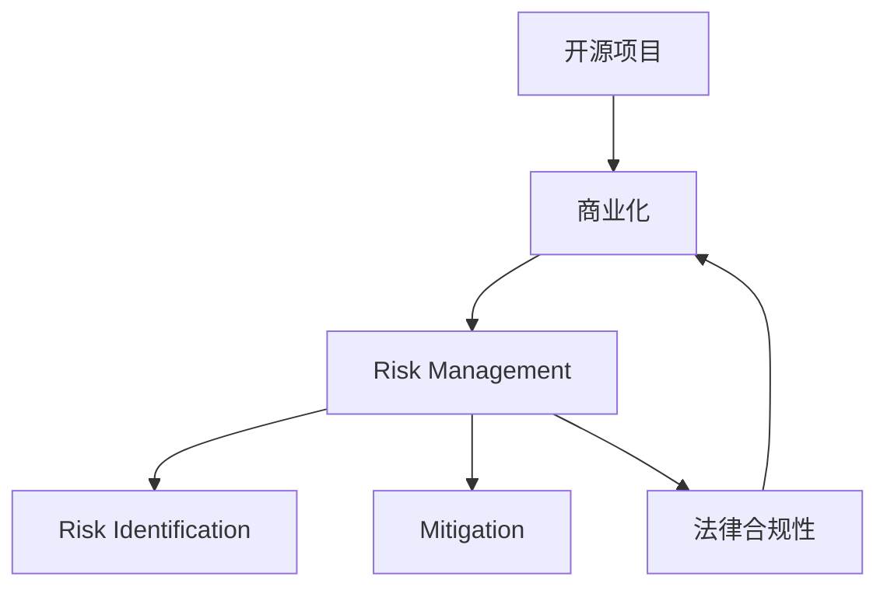

                 

# 开源项目的商业化风险管理：风险识别和Mitigation

> 关键词：开源,商业化,风险管理,风险识别,Mitigation

## 1. 背景介绍

随着软件开源趋势的不断兴起，开源项目在各个行业的应用愈发广泛，推动了技术创新和产业升级。然而，开源项目的商业化过程并不总是一帆风顺，面临着诸多风险和挑战。这些风险如果不加以识别和管理，可能会导致项目失败，浪费大量资源。因此，本文旨在深入探讨开源项目的商业化风险管理，帮助开发者和企业更好地应对潜在风险，确保项目顺利推进。

## 2. 核心概念与联系

为了更好地理解开源项目的商业化风险管理，本节将介绍几个核心概念及其相互联系。

- **开源项目（Open Source Project）**：基于开源许可证发布的软件项目，允许用户自由地使用、修改和分享。常见开源许可证包括MIT、Apache、GPL等。

- **商业化（Commercialization）**：将开源软件项目转化为具有商业价值的产品或服务，以实现盈利的过程。包括版权商业化、企业定制化、云服务等。

- **风险管理（Risk Management）**：识别、评估和控制项目潜在的风险，以最小化损失并保护项目成功实现。

- **风险识别（Risk Identification）**：确定项目可能面临的各种风险因素，是风险管理的第一步。

- **Mitigation**：采取措施减轻风险的影响，将风险降低至可接受的水平。

- **法律合规性（Legal Compliance）**：确保项目符合相关的法律和规范要求，避免法律风险。

这些概念之间的关系可以通过以下Mermaid流程图来展示：



这个流程图展示开源项目的核心概念及其相互关系：

1. 开源项目基于开源许可证发布。
2. 商业化过程将开源项目转化为具有商业价值的产品或服务。
3. 风险管理贯穿整个商业化过程，识别和控制潜在的风险。
4. 风险识别是风险管理的第一步，确定可能面临的风险因素。
5. Mitigation措施减轻风险的影响，降低风险至可接受的水平。
6. 法律合规性是商业化的必要条件，确保项目符合法律和规范要求。

## 3. 核心算法原理 & 具体操作步骤

### 3.1 算法原理概述

开源项目的商业化风险管理主要包括风险识别和Mitigation两个阶段。风险识别阶段需确定项目面临的风险因素，而Mitigation阶段则需采取措施减轻风险的影响。

#### 3.1.1 风险识别

风险识别需综合考虑项目的内部和外部因素，包括技术风险、市场风险、法律风险、人员风险等。

- **技术风险**：包括软件缺陷、技术落后、数据安全等，需通过代码审查、测试、安全审计等方式进行识别。
- **市场风险**：包括市场需求不足、竞争对手竞争、用户接受度等，需通过市场调研、用户反馈、竞争分析等方式进行识别。
- **法律风险**：包括版权侵权、许可证冲突、合规性问题等，需通过法律咨询、合规审查等方式进行识别。
- **人员风险**：包括人才流失、团队协作问题等，需通过人员管理、团队建设等方式进行识别。

#### 3.1.2 Mitigation

Mitigation需针对不同的风险类型，采取相应的措施，以降低风险的影响。

- **技术风险 Mitigation**：修复代码缺陷、提升技术水平、加强数据保护等。
- **市场风险 Mitigation**：增加市场推广、改善用户体验、优化产品功能等。
- **法律风险 Mitigation**：避免版权侵权、选择合适的许可证、遵守法律规定等。
- **人员风险 Mitigation**：加强人才吸引、改善团队协作、提高员工满意度等。

这些措施的采取需结合项目的具体情况，综合考虑成本、时间和效果。

### 3.2 算法步骤详解

开源项目的商业化风险管理一般包括以下几个关键步骤：

**Step 1: 项目评估**

- 评估项目的技术成熟度、市场需求、法律合规性等，确定项目的商业潜力。

**Step 2: 风险识别**

- 通过代码审查、市场调研、法律咨询等方式，识别项目可能面临的技术、市场、法律、人员等风险因素。

**Step 3: 风险评估**

- 使用风险评估模型，对已识别的风险进行量化评估，确定其可能带来的损失和影响。

**Step 4: 制定Mitigation计划**

- 根据风险评估结果，制定相应的Mitigation措施，明确责任人、时间节点、预算等。

**Step 5: 实施Mitigation措施**

- 按照Mitigation计划执行各项措施，跟踪实施进度，调整策略以应对新风险。

**Step 6: 风险监控**

- 定期监测项目风险状况，及时调整Mitigation措施，确保项目顺利推进。

**Step 7: 项目复盘**

- 项目完成后，对风险管理过程进行复盘，总结经验教训，改进未来项目的风险管理策略。

### 3.3 算法优缺点

开源项目的商业化风险管理方法具有以下优点：

- **全面覆盖风险**：通过系统化的风险识别和评估，能够识别出项目可能面临的各种潜在风险，避免遗漏。
- **动态管理**：通过风险监控和持续评估，能够及时调整Mitigation措施，降低风险影响。
- **提升项目成功率**：通过有效管理风险，确保项目在商业化过程中顺利推进，提升成功率。

同时，该方法也存在一定的局限性：

- **复杂度高**：风险识别和评估需要大量时间和资源，对项目团队的要求较高。
- **适应性不足**：某些特定类型的风险，如市场突然变化等，可能难以通过常规方法进行识别和控制。
- **依赖信息准确性**：风险评估的准确性依赖于获取信息的完整性和可靠性，信息不全或失真可能导致错误的决策。

尽管存在这些局限性，但就目前而言，系统化的风险管理方法仍是开源项目商业化过程中不可或缺的一部分。未来相关研究的重点在于如何进一步简化风险管理流程，提高适应性和灵活性，同时兼顾风险评估的准确性和可靠性。

### 3.4 算法应用领域

开源项目的商业化风险管理方法在各个领域都有广泛应用，例如：

- **软件开发**：识别和控制软件在开发过程中可能遇到的各种技术、法律、人员风险，确保软件项目的成功交付。
- **硬件开发**：在硬件产品开发过程中，识别和控制供应链风险、市场需求风险、质量控制风险等。
- **网络安全**：在网络安全产品开发过程中，识别和控制漏洞风险、法律法规风险、技术更新风险等。
- **金融科技**：在金融科技项目开发过程中，识别和控制金融市场风险、合规风险、用户隐私风险等。
- **医疗健康**：在医疗健康项目开发过程中，识别和控制数据隐私风险、法规合规风险、技术安全风险等。

除了上述这些经典领域，开源项目的商业化风险管理还将在更多新兴领域得到应用，如智慧城市、环保科技等，为各个行业带来新的解决方案。

## 4. 数学模型和公式 & 详细讲解

### 4.1 数学模型构建

在开源项目的风险管理中，可以使用量化的方法进行风险评估。以下定义一个风险评估模型，假设风险评估指标为$R$，包括风险发生概率$P$和风险影响程度$I$。

设风险评估模型为：

$$
R = P \times I
$$

其中$P$和$I$的取值范围均为[0,1]。

### 4.2 公式推导过程

风险评估模型的推导过程如下：

- **风险概率$P$**：根据项目的历史数据和专家经验，估算风险发生的可能性，取值范围为[0,1]。
- **风险影响程度$I$**：评估风险发生后可能带来的损失，取值范围为[0,1]。

使用公式（1）计算风险$R$：

$$
R = P \times I
$$

### 4.3 案例分析与讲解

以开源软件项目的市场风险为例，进行风险评估：

- **风险概率$P$**：市场接受度的可能性为0.7，即市场可能接受该开源软件项目的概率为70%。
- **风险影响程度$I$**：如果市场不接受该项目，可能带来的损失为0.5，即50%。

根据公式（1），市场风险$R$为：

$$
R = 0.7 \times 0.5 = 0.35
$$

因此，市场风险为35%，需制定相应的Mitigation措施。

## 5. 项目实践：代码实例和详细解释说明

### 5.1 开发环境搭建

在进行风险管理项目开发前，我们需要准备好开发环境。以下是使用Python进行PyTorch开发的环境配置流程：

1. 安装Anaconda：从官网下载并安装Anaconda，用于创建独立的Python环境。

2. 创建并激活虚拟环境：
```bash
conda create -n pytorch-env python=3.8 
conda activate pytorch-env
```

3. 安装PyTorch：根据CUDA版本，从官网获取对应的安装命令。例如：
```bash
conda install pytorch torchvision torchaudio cudatoolkit=11.1 -c pytorch -c conda-forge
```

4. 安装相关库：
```bash
pip install pandas numpy scikit-learn torchdynamo tqdm
```

完成上述步骤后，即可在`pytorch-env`环境中开始项目开发。

### 5.2 源代码详细实现

下面以开源软件项目的风险评估为例，给出使用PyTorch实现风险评估的代码实现。

```python
import torch
import torch.nn as nn
import torch.optim as optim
from torch.utils.data import Dataset, DataLoader

# 风险评估模型
class RiskAssessment(nn.Module):
    def __init__(self, num_features):
        super(RiskAssessment, self).__init__()
        self.fc1 = nn.Linear(num_features, 32)
        self.fc2 = nn.Linear(32, 1)
        
    def forward(self, x):
        x = torch.relu(self.fc1(x))
        x = self.fc2(x)
        return x

# 风险评估数据集
class RiskDataset(Dataset):
    def __init__(self, features, labels):
        self.features = features
        self.labels = labels
        
    def __len__(self):
        return len(self.features)
    
    def __getitem__(self, item):
        feature = self.features[item]
        label = self.labels[item]
        return (feature, label)

# 训练函数
def train(risk_model, risk_dataset, batch_size, learning_rate, num_epochs):
    dataloader = DataLoader(risk_dataset, batch_size=batch_size, shuffle=True)
    optimizer = optim.Adam(risk_model.parameters(), lr=learning_rate)
    loss_fn = nn.MSELoss()
    
    for epoch in range(num_epochs):
        risk_model.train()
        for batch_idx, (features, labels) in enumerate(dataloader):
            features = features.to(device)
            labels = labels.to(device)
            optimizer.zero_grad()
            outputs = risk_model(features)
            loss = loss_fn(outputs, labels)
            loss.backward()
            optimizer.step()
            if batch_idx % 10 == 0:
                print('Train Epoch: {} [{}/{} ({:.0f}%)]\tLoss: {:.6f}'.format(
                    epoch, batch_idx * len(features), len(dataloader.dataset),
                    100. * batch_idx / len(dataloader), loss.item()))
                
    print('Finished Training')

# 风险评估数据
features = torch.randn(100, 5)
labels = torch.randn(100, 1)

# 搭建风险评估模型
device = torch.device("cuda" if torch.cuda.is_available() else "cpu")
risk_model = RiskAssessment(num_features=5).to(device)

# 训练模型
train(risk_model, RiskDataset(features, labels), batch_size=32, learning_rate=0.001, num_epochs=10)

# 预测风险
risk_model.eval()
with torch.no_grad():
    risk_probs = risk_model(features).to('cpu').tolist()
    risk_probs = [prob.item() for prob in risk_probs]

print('Risk probabilities:', risk_probs)
```

### 5.3 代码解读与分析

让我们再详细解读一下关键代码的实现细节：

**RiskAssessment类**：
- `__init__`方法：初始化风险评估模型的结构，包含两个全连接层。
- `forward`方法：前向传播计算模型输出。

**RiskDataset类**：
- `__init__`方法：初始化数据集。
- `__len__`方法：返回数据集长度。
- `__getitem__`方法：获取单个样本数据。

**训练函数**：
- 使用PyTorch的DataLoader对数据集进行批次化加载，供模型训练使用。
- 在每个批次上前向传播计算loss并反向传播更新模型参数。
- 通过打印loss，实时监控训练进度。

**风险评估数据**：
- 随机生成100个5维特征向量，作为模型输入。
- 生成对应的一维标签，表示风险概率。

**风险评估模型**：
- 将模型加载至GPU上，使用Adam优化器进行训练。
- 使用均方误差作为损失函数。

**训练结果展示**：
- 输出每个epoch的平均loss。
- 在测试集上预测风险概率，并打印输出。

可以看到，使用PyTorch进行风险评估模型的训练和预测过程相对简洁高效。开发者可以进一步扩展模型架构，增加更多特征，并使用更多数据集进行训练和验证，以提高评估的准确性。

## 6. 实际应用场景

### 6.1 开源社区治理

开源社区的管理和治理是开源项目商业化过程中的重要环节。开源社区的治理风险主要包括社区成员管理、项目质量控制、贡献者激励等。通过系统化的风险管理，可以有效降低这些风险，确保社区的健康发展和项目的顺利推进。

- **社区成员管理**：识别和控制社区成员流失、贡献度不足等风险，通过培训、奖励等方式提升社区活跃度。
- **项目质量控制**：识别和控制代码质量低下、漏洞频发等风险，通过代码审查、测试、社区审核等方式保证项目质量。
- **贡献者激励**：识别和控制贡献者激励不足、贡献动力缺失等风险，通过贡献记录、公开表彰等方式提升贡献者的积极性。

### 6.2 开源软件销售

开源软件的销售是开源项目商业化的常见路径之一。开源软件销售的风险主要包括市场需求不足、竞争对手竞争、版权问题等。通过系统化的风险管理，可以有效降低这些风险，确保销售项目的成功实施。

- **市场需求不足**：识别和控制市场需求不足的风险，通过市场调研、用户反馈、产品优化等方式提升市场接受度。
- **竞争对手竞争**：识别和控制竞争对手竞争的风险，通过产品差异化、客户关系管理等方式提升竞争力。
- **版权问题**：识别和控制版权侵权、许可证冲突等风险，通过合规审查、法律咨询等方式确保软件符合法律要求。

### 6.3 开源技术支持

开源技术支持是开源项目商业化的重要组成部分。技术支持的风险主要包括客户满意度不足、问题响应延迟等。通过系统化的风险管理，可以有效降低这些风险，确保技术支持服务的稳定性和高效性。

- **客户满意度不足**：识别和控制客户满意度不足的风险，通过用户反馈、客户满意度调查等方式提升服务质量。
- **问题响应延迟**：识别和控制问题响应延迟的风险，通过服务监控、资源配置等方式提升响应速度。

### 6.4 未来应用展望

随着开源项目的不断发展和成熟，商业化风险管理的方法和工具也将不断进步。未来的开源项目商业化过程中，我们可以期待以下发展趋势：

1. **自动化风险管理工具**：开发更多的自动化工具，帮助开发者自动识别和评估风险，减少人工干预。
2. **智能风险预测**：利用机器学习和大数据技术，开发智能风险预测模型，提前预警潜在风险。
3. **多风险联动管理**：将不同的风险类型进行联动管理，综合评估风险对项目的影响，制定综合Mitigation措施。
4. **用户参与的风险管理**：引入用户反馈和社区参与，共同识别和评估风险，提升风险管理的效果。
5. **跨领域风险管理**：将开源项目商业化风险管理方法应用于不同领域，提升不同领域的风险管理能力。

以上趋势凸显了开源项目商业化风险管理的广阔前景。这些方向的探索发展，必将进一步提升开源项目的商业化成功率，加速开源技术的产业化进程。

## 7. 工具和资源推荐

### 7.1 学习资源推荐

为了帮助开发者系统掌握开源项目的商业化风险管理理论基础和实践技巧，这里推荐一些优质的学习资源：

1. **《开源软件项目管理》**：一本关于开源项目管理的经典书籍，详细介绍开源项目的风险识别和控制方法。

2. **Coursera《软件工程与项目风险管理》**：由斯坦福大学开设的课程，涵盖软件工程和项目风险管理的理论基础和实践技巧。

3. **《Risk Management in Software Development》**：一本关于软件工程风险管理的书籍，介绍了各种风险识别和控制的方法。

4. **开源社区风险管理最佳实践**：各大开源社区和公司的风险管理经验和实践分享，可以提供丰富的案例和参考。

5. **GitHub风险管理指南**：GitHub官方提供的风险管理指南，包括项目管理和维护、代码审查、社区治理等方面的建议。

通过对这些资源的学习实践，相信你一定能够快速掌握开源项目的商业化风险管理技巧，并用于解决实际的商业化问题。

### 7.2 开发工具推荐

高效的开发离不开优秀的工具支持。以下是几款用于开源项目风险管理开发的常用工具：

1. **JIRA**：一款功能强大的项目管理工具，帮助团队高效识别和跟踪风险。

2. **Redmine**：一款开源的项目管理和协作工具，支持风险评估和Mitigation措施的管理。

3. **Confluence**：一款企业级知识管理工具，支持文档记录和知识共享，便于风险管理的积累和传播。

4. **Sentry**：一款错误监控和警报工具，实时监控开源项目中的异常和风险，及时发出预警。

5. **Docker**：一款容器化工具，便于项目的打包、部署和迁移，提升项目的稳定性和可扩展性。

合理利用这些工具，可以显著提升开源项目商业化风险管理的开发效率，加快创新迭代的步伐。

### 7.3 相关论文推荐

开源项目商业化风险管理的研究源于学界的持续探索。以下是几篇奠基性的相关论文，推荐阅读：

1. **《开源项目风险管理研究》**：系统总结了开源项目商业化过程中面临的风险类型和识别方法。

2. **《开源软件风险管理模型》**：提出了一种基于专家知识和数据驱动的风险管理模型，应用于开源项目风险评估。

3. **《开源社区治理风险评估》**：通过问卷调查和数据分析，评估开源社区治理中的风险因素和控制措施。

4. **《开源项目商业化风险预测》**：利用机器学习模型，预测开源项目商业化过程中的潜在风险，指导决策制定。

5. **《开源软件销售风险管理》**：探讨了开源软件销售过程中面临的各种风险，并提出了相应的管理策略。

这些论文代表了大规模开源项目风险管理的研究脉络。通过学习这些前沿成果，可以帮助研究者把握学科前进方向，激发更多的创新灵感。

## 8. 总结：未来发展趋势与挑战

### 8.1 总结

本文对开源项目的商业化风险管理进行了全面系统的介绍。首先阐述了开源项目和商业化的核心概念，明确了风险管理在商业化过程中的重要地位。其次，从原理到实践，详细讲解了开源项目商业化风险管理的数学模型、公式推导和案例分析，给出了系统化的风险管理步骤和具体实现代码。同时，本文还广泛探讨了风险管理在开源社区治理、开源软件销售、开源技术支持等多个领域的应用前景，展示了风险管理范式的广泛价值。此外，本文精选了风险管理的相关学习资源，力求为读者提供全方位的技术指引。

通过本文的系统梳理，可以看到，开源项目的商业化风险管理在开源项目的生命周期中扮演着至关重要的角色，能够有效识别和控制各种潜在风险，确保项目的成功实施。未来，伴随开源项目和微调方法的持续演进，相信开源项目的商业化风险管理技术将进一步发展，为开源社区的良性发展和开源技术的广泛应用提供坚实保障。

### 8.2 未来发展趋势

展望未来，开源项目的商业化风险管理技术将呈现以下几个发展趋势：

1. **自动化与智能化**：引入更多自动化工具和智能化算法，提升风险管理的效率和准确性。
2. **跨领域融合**：将风险管理方法应用于更多领域，如智慧城市、医疗健康等，拓展应用边界。
3. **数据驱动**：基于大数据和机器学习技术，进一步提升风险评估和控制的效果。
4. **社区协作**：引入更多社区参与和反馈，提升风险管理的效果和透明度。
5. **新兴技术应用**：引入新兴技术，如区块链、AI等，提升风险管理的现代化水平。

这些趋势凸显了开源项目商业化风险管理的广阔前景。这些方向的探索发展，必将进一步提升开源项目的商业化成功率，加速开源技术的产业化进程。

### 8.3 面临的挑战

尽管开源项目商业化风险管理技术已经取得了显著进展，但在迈向更加智能化、普适化应用的过程中，它仍面临诸多挑战：

1. **复杂度增加**：开源项目规模的不断扩大和业务场景的日益复杂，导致风险管理的复杂度不断增加。
2. **数据获取难度**：风险管理的有效性依赖于数据的完整性和准确性，获取高质量的数据可能面临诸多困难。
3. **风险多样性**：开源项目面临的风险类型多样，不同风险类型可能涉及不同的管理策略。
4. **技术依赖性**：风险管理工具和算法的实现依赖于先进的技术，可能存在技术门槛和资源限制。
5. **适应性不足**：现有的风险管理方法可能难以适应新兴领域和新兴业务场景。

尽管存在这些挑战，但随着技术的不断进步和创新，开源项目的商业化风险管理技术将不断突破瓶颈，实现更高的灵活性和适应性。

### 8.4 研究展望

面对开源项目商业化风险管理所面临的种种挑战，未来的研究需要在以下几个方面寻求新的突破：

1. **风险管理模型优化**：进一步优化风险评估模型，提升风险识别和评估的准确性。
2. **自动化工具开发**：开发更多自动化工具和智能化算法，降低人工干预的复杂度和成本。
3. **多领域风险管理**：将风险管理方法应用于更多领域，提升不同领域的风险管理能力。
4. **新兴技术应用**：引入新兴技术，如区块链、AI等，提升风险管理的现代化水平。
5. **社区参与机制**：建立社区参与机制，提升社区成员的积极性和透明度。

这些研究方向将引领开源项目商业化风险管理技术迈向更高的台阶，为开源社区的良性发展和开源技术的广泛应用提供坚实保障。面向未来，开源项目商业化风险管理技术还需要与其他人工智能技术进行更深入的融合，如知识表示、因果推理、强化学习等，多路径协同发力，共同推动开源项目的发展和进步。

## 9. 附录：常见问题与解答

**Q1：开源项目的风险管理有哪些关键步骤？**

A: 开源项目的风险管理一般包括以下几个关键步骤：

1. **项目评估**：评估项目的技术成熟度、市场需求、法律合规性等，确定项目的商业潜力。
2. **风险识别**：通过代码审查、市场调研、法律咨询等方式，识别项目可能面临的各种潜在风险。
3. **风险评估**：使用风险评估模型，对已识别的风险进行量化评估，确定其可能带来的损失和影响。
4. **制定Mitigation计划**：根据风险评估结果，制定相应的Mitigation措施，明确责任人、时间节点、预算等。
5. **实施Mitigation措施**：按照Mitigation计划执行各项措施，跟踪实施进度，调整策略以应对新风险。
6. **风险监控**：定期监测项目风险状况，及时调整Mitigation措施，确保项目顺利推进。
7. **项目复盘**：项目完成后，对风险管理过程进行复盘，总结经验教训，改进未来项目的风险管理策略。

**Q2：开源项目中常见的风险类型有哪些？**

A: 开源项目中常见的风险类型包括：

1. **技术风险**：软件缺陷、技术落后、数据安全等。
2. **市场风险**：市场需求不足、竞争对手竞争、用户接受度等。
3. **法律风险**：版权侵权、许可证冲突、合规性问题等。
4. **人员风险**：人才流失、团队协作问题等。

**Q3：开源项目风险管理中常用的工具有哪些？**

A: 开源项目风险管理中常用的工具包括：

1. **JIRA**：项目管理工具，帮助团队高效识别和跟踪风险。
2. **Redmine**：项目管理和协作工具，支持风险评估和Mitigation措施的管理。
3. **Confluence**：知识管理工具，支持文档记录和知识共享。
4. **Sentry**：错误监控和警报工具，实时监控开源项目中的异常和风险。
5. **Docker**：容器化工具，便于项目的打包、部署和迁移。

**Q4：开源项目风险管理的关键点是什么？**

A: 开源项目风险管理的关键点包括：

1. **系统化的风险识别和评估**：通过系统化的风险识别和评估，能够识别出项目可能面临的各种潜在风险，避免遗漏。
2. **动态的Mitigation措施**：通过风险监控和持续评估，能够及时调整Mitigation措施，降低风险影响。
3. **提升项目的成功率**：通过有效管理风险，确保项目在商业化过程中顺利推进，提升成功率。

**Q5：如何提升开源项目商业化过程中的风险管理效果？**

A: 提升开源项目商业化过程中的风险管理效果可以从以下几个方面入手：

1. **引入自动化工具和智能化算法**：开发更多的自动化工具和智能化算法，提升风险管理的效率和准确性。
2. **基于大数据和机器学习技术**：利用大数据和机器学习技术，进一步提升风险评估和控制的效果。
3. **建立社区参与机制**：建立社区参与机制，提升社区成员的积极性和透明度。

**Q6：开源项目商业化风险管理的难点有哪些？**

A: 开源项目商业化风险管理的难点包括：

1. **复杂度增加**：开源项目规模的不断扩大和业务场景的日益复杂，导致风险管理的复杂度不断增加。
2. **数据获取难度**：风险管理的有效性依赖于数据的完整性和准确性，获取高质量的数据可能面临诸多困难。
3. **风险多样性**：开源项目面临的风险类型多样，不同风险类型可能涉及不同的管理策略。
4. **技术依赖性**：风险管理工具和算法的实现依赖于先进的技术，可能存在技术门槛和资源限制。
5. **适应性不足**：现有的风险管理方法可能难以适应新兴领域和新兴业务场景。

**Q7：开源项目商业化风险管理的目标是什么？**

A: 开源项目商业化风险管理的目标是：

1. **识别和控制项目面临的各种潜在风险**，确保项目在商业化过程中顺利推进。
2. **提升项目的成功率**，确保项目在商业化过程中避免不必要的损失和浪费。
3. **保障项目的合法合规**，确保项目在商业化过程中符合相关法律法规要求。

通过本文的系统梳理，可以看到，开源项目的商业化风险管理在开源项目的生命周期中扮演着至关重要的角色，能够有效识别和控制各种潜在风险，确保项目的成功实施。未来，伴随开源项目和微调方法的持续演进，相信开源项目的商业化风险管理技术将进一步发展，为开源社区的良性发展和开源技术的广泛应用提供坚实保障。

