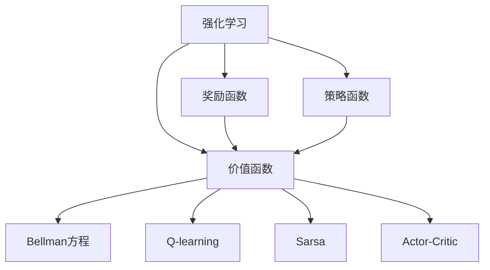

                 

# 强化学习基础：奖励和策略

> 关键词：强化学习, 奖励函数, 策略函数, 价值函数, 贝尔曼方程, Q-learning, Sarsa, Actor-Critic

## 1. 背景介绍

### 1.1 问题由来
强化学习（Reinforcement Learning, RL）是一种从环境中通过交互式学习来优化智能决策的方法。与监督学习和无监督学习不同，强化学习不需要对行为进行明确的标签，而是通过试错来学习最优策略。这种学习范式在诸如游戏AI、机器人控制、自动驾驶等领域都有广泛应用。

### 1.2 问题核心关键点
强化学习的核心在于通过奖励和策略的优化，使智能体（agent）在环境中执行一系列动作，以最大化预期累积奖励。强化学习的核心要素包括：
1. **环境**：智能体与之交互的物理或模拟环境。
2. **状态**：环境中的当前情况，智能体可以感知和操作的状态空间。
3. **动作**：智能体可以采取的行动。
4. **奖励**：智能体采取某个动作后从环境中获得的反馈，用来评估行动的好坏。
5. **策略**：智能体选择动作的概率分布，是智能体的决策规则。
6. **价值函数**：描述智能体在不同状态下或动作下预期累积奖励的函数。

强化学习的目标是学习一个策略，使得智能体在给定状态下选择最佳动作，从而最大化预期的长期累积奖励。

### 1.3 问题研究意义
强化学习是人工智能领域中非常具有前瞻性和挑战性的研究方向。它不仅仅提供了一种解决复杂决策问题的算法，更是一种探索智能体如何在不确定性和动态环境中进行学习、适应和优化的理论框架。通过强化学习，研究人员可以更好地理解人类和动物的行为，以及如何构建具有自主决策能力的智能系统。此外，强化学习还在机器人学、自动控制、金融工程等领域得到了广泛应用，成为推动科技发展的重要动力。

## 2. 核心概念与联系

### 2.1 核心概念概述

为了更好地理解强化学习的核心概念，本节将介绍几个密切相关的核心概念：

- **强化学习**：通过与环境的交互，智能体学习如何执行一系列行动以最大化累积奖励的学习过程。
- **奖励函数**：智能体采取某个行动后从环境中获得的反馈，用来评估行动的好坏。
- **策略函数**：智能体选择动作的概率分布，是智能体的决策规则。
- **价值函数**：描述智能体在不同状态下或动作下预期累积奖励的函数。
- **贝尔曼方程**：描述价值函数更新规律的核心方程。
- **Q-learning**：一种基于经验的最小化Q值误差（即贝尔曼误差）的强化学习方法。
- **Sarsa**：一种基于状态动作-状态动作的（State-Action-S-state-Action）的强化学习方法，用于估计Q值。
- **Actor-Critic**：一种结合了策略函数和价值函数的强化学习方法，策略由Actor负责，Q值由Critic估计。

这些核心概念之间的逻辑关系可以通过以下Mermaid流程图来展示：



这个流程图展示了我强化学习的核心概念及其之间的关系：

1. 强化学习通过与环境的交互，通过奖励和策略函数来优化行动。
2. 奖励函数用来评估行动的好坏，是强化学习的反馈机制。
3. 策略函数描述了智能体选择动作的概率分布，是决策规则。
4. 价值函数描述了在不同状态或动作下的预期累积奖励，是评估行动的价值。
5. 贝尔曼方程描述了价值函数的更新规律，是强化学习的基础。
6. Q-learning和Sarsa是具体的强化学习算法，用来估计价值函数。
7. Actor-Critic算法是结合策略和价值函数的强化学习框架。

这些概念共同构成了强化学习的核心框架，使得智能体可以在动态环境中通过学习最优策略，最大化累积奖励。

## 3. 核心算法原理 & 具体操作步骤
### 3.1 算法原理概述

强化学习的基本思想是通过与环境的交互，使智能体学习如何执行一系列行动以最大化累积奖励。核心原理可以简单概括为：

1. 智能体在当前状态下选择一个动作。
2. 环境根据动作做出反应，并提供奖励和下一个状态。
3. 智能体根据奖励和下一个状态，更新其策略函数或价值函数。
4. 重复上述过程，直到达到终止状态或满足停止条件。

强化学习的核心在于优化策略函数和价值函数，以最大化预期累积奖励。通过与环境的互动，智能体可以逐步学习到最优的行动策略。

### 3.2 算法步骤详解

强化学习的核心算法步骤包括：

**Step 1: 初始化**
- 初始化状态 $s_0$。
- 初始化策略 $\pi$ 或价值函数 $V$。

**Step 2: 执行动作**
- 在当前状态 $s_t$ 下，根据策略 $\pi$ 或探索策略（如$\epsilon$-greedy）选择动作 $a_t$。
- 观察环境反应，得到下一个状态 $s_{t+1}$ 和奖励 $r_{t+1}$。

**Step 3: 更新策略或价值函数**
- 使用贝尔曼方程更新价值函数 $V(s_{t+1})$。
- 更新策略函数 $\pi$ 或Q值函数 $Q$。

**Step 4: 重复执行**
- 重复步骤2和3，直到达到终止状态或满足停止条件。

### 3.3 算法优缺点

强化学习的优点包括：

1. **自适应性强**：能够适应复杂和动态的环境，不需要明确的标签或监督。
2. **通用性强**：可以应用于各种不同的问题领域，如游戏AI、机器人控制等。
3. **具有探索能力**：能够在未知的环境中通过探索来优化策略。
4. **可扩展性好**：能够处理大型和复杂的问题，适用于大规模系统。

但强化学习也存在一些缺点：

1. **探索和利用的平衡**：在探索新动作和利用已知动作之间找到平衡点是一个重要挑战。
2. **状态空间复杂**：高维状态空间导致探索效率低，难以找到全局最优解。
3. **奖励设计困难**：奖励函数的设计往往需要经验和专业知识，难以确定最优奖励。
4. **样本效率低**：需要大量的样本和计算资源来学习最优策略。
5. **非凸优化**：强化学习问题通常是非凸的，导致算法可能收敛到局部最优解。

尽管存在这些缺点，强化学习在许多复杂问题中仍然取得了显著进展，成为解决动态和不确定环境下的智能决策的重要工具。

### 3.4 算法应用领域

强化学习在多个领域中得到了广泛应用，包括但不限于：

1. **游戏AI**：AlphaGo、OpenAI Five等通过强化学习在围棋、Dota等游戏中取得了顶尖水平。
2. **机器人控制**：用于控制机器人手臂、无人车等执行复杂任务。
3. **自动驾驶**：通过强化学习优化车辆的路径规划和避障策略。
4. **金融工程**：用于股票交易、风险管理等金融决策。
5. **智能推荐系统**：通过优化用户行为模型来推荐商品、内容等。
6. **医疗决策**：通过学习医疗数据来辅助诊断和治疗决策。
7. **供应链优化**：通过优化供应链的动态控制来提高效率和降低成本。

这些应用场景展示了强化学习在解决复杂智能决策问题中的强大能力。随着算法和技术的发展，强化学习将在更多领域得到应用，为人类生产生活带来革命性变化。

## 4. 数学模型和公式 & 详细讲解 & 举例说明

### 4.1 数学模型构建

强化学习的数学模型主要包括以下几个部分：

- 状态空间 $S$：环境的所有可能状态。
- 动作空间 $A$：智能体可以采取的行动。
- 奖励函数 $R(s,a)$：智能体采取动作 $a$ 后从状态 $s$ 获得的奖励。
- 状态转移概率 $P(s_{t+1}|s_t,a_t)$：在状态 $s_t$ 下采取行动 $a_t$ 后，环境转移到下一个状态 $s_{t+1}$ 的概率。
- 策略函数 $\pi(a|s)$：智能体在状态 $s$ 下选择动作 $a$ 的概率分布。
- 价值函数 $V(s)$：智能体在状态 $s$ 下的预期累积奖励。

### 4.2 公式推导过程

强化学习的核心公式是贝尔曼方程（Bellman Equation），描述了价值函数 $V$ 的更新规则：

$$
V(s) = \mathbb{E}[\sum_{t=0}^{\infty} \gamma^t R(s_t,a_t)|s_0=s]
$$

其中 $\gamma$ 是折扣因子，控制了未来奖励的权重。贝尔曼方程可以进一步展开为：

$$
V(s) = R(s) + \gamma \sum_{s'} P(s'|s,a) V(s')
$$

这个方程描述了价值函数的递推关系，即当前状态 $s$ 的价值可以通过当前状态下的奖励 $R(s)$ 和下一个状态 $s'$ 的价值 $V(s')$ 加权平均来计算。

### 4.3 案例分析与讲解

考虑一个简单的环境，智能体需要在两个盒子中随机选择，每个盒子中有概率 $p_1$ 和 $p_2$ 分别放置有奖励和惩罚，智能体的目标是在不确定的环境中最大化累积奖励。

智能体的策略函数可以表示为 $\pi(a|s)$，其中 $s=1$ 和 $s=2$ 分别表示选择两个盒子，$a=1$ 和 $a=0$ 分别表示选择两个盒子中的物品。假设智能体可以选择在每次选择之前采取探索策略 $\epsilon$-greedy，探索概率为 $\epsilon$，选择已知最优策略的概率为 $1-\epsilon$。

智能体在每个状态下采取行动后，观察到下一个状态和奖励，并根据贝尔曼方程更新价值函数。设智能体在状态 $s$ 下选择动作 $a$ 的Q值为 $Q(s,a)$，则贝尔曼方程可以表示为：

$$
Q(s,a) = R(s,a) + \gamma \max_a Q(s',a')
$$

其中 $(s',a')$ 是下一个状态和最优动作，智能体通过最大化Q值来更新策略函数。

通过迭代更新Q值和策略函数，智能体可以在不确定环境中逐步学习到最优策略。

## 5. 项目实践：代码实例和详细解释说明

### 5.1 开发环境搭建

在进行强化学习项目实践前，我们需要准备好开发环境。以下是使用Python进行Reinforcement Learning库开发的开发环境配置流程：

1. 安装Anaconda：从官网下载并安装Anaconda，用于创建独立的Python环境。

2. 创建并激活虚拟环境：
```bash
conda create -n rl-env python=3.8 
conda activate rl-env
```

3. 安装Reinforcement Learning库：
```bash
pip install reinforcement-learning
```

4. 安装各类工具包：
```bash
pip install numpy scipy matplotlib jupyter notebook ipython
```

完成上述步骤后，即可在`rl-env`环境中开始强化学习实践。

### 5.2 源代码详细实现

下面我们以Q-learning算法为例，给出使用Reinforcement Learning库对简单环境的Q-learning算法的PyTorch代码实现。

```python
import numpy as np
import reinforcement_learning as rl
import matplotlib.pyplot as plt

# 定义环境
env = rl.MDP(2, 2, np.zeros((2, 2)), reward_func=lambda x, y: 0, transition_func=lambda x, y, a: (x + a - 1, y + a - 1))

# 定义策略函数
def epsilon_greedy(Q, state, epsilon):
    if np.random.rand() < epsilon:
        return np.random.choice([0, 1])
    else:
        return np.argmax(Q[state])

# 定义Q-learning算法
Q = np.zeros((2, 2))
epsilon = 1.0
num_episodes = 10000
alpha = 0.1
gamma = 0.9

for episode in range(num_episodes):
    state = 0
    while True:
        a = epsilon_greedy(Q, state, epsilon)
        state, reward, done = env.step(a)
        Q[state, a] += alpha * (reward + gamma * np.max(Q[state, :]) - Q[state, a])
        if done:
            break
        if np.random.rand() < epsilon:
            a = np.random.choice([0, 1])
        else:
            a = np.argmax(Q[state, :])
        state, reward, done = env.step(a)
        Q[state, a] += alpha * (reward + gamma * np.max(Q[state, :]) - Q[state, a])

    epsilon *= 0.995
    if epsilon < 0.01:
        break

# 绘制Q值表
plt.imshow(Q, cmap='gray')
plt.colorbar()
plt.show()
```

### 5.3 代码解读与分析

让我们再详细解读一下关键代码的实现细节：

**MDP类定义环境**：
- `MDP`类用于定义马尔可夫决策过程（MDP），其中`2`和`2`表示状态和动作空间的大小，`np.zeros((2,2))`表示初始状态转移概率，`reward_func`和`transition_func`分别表示奖励函数和状态转移函数。

**策略函数**：
- `epsilon_greedy`函数实现了$\epsilon$-greedy策略，根据当前状态和探索概率$\epsilon$选择动作。

**Q-learning算法实现**：
- 初始化Q值表，并设置探索概率$\epsilon$和迭代次数`num_episodes`。
- 在每个迭代周期中，智能体从初始状态开始，直到达到终止状态或满足停止条件。
- 在每个状态下，智能体根据$\epsilon$-greedy策略选择动作，并观察到下一个状态和奖励。
- 使用贝尔曼方程更新Q值，并更新策略函数。
- 逐步减小探索概率$\epsilon$，使智能体从探索状态逐步转向利用已知最优策略。

最后，绘制Q值表，可以看到智能体在环境中的学习过程和最终收敛的Q值。

## 6. 实际应用场景

### 6.1 智能推荐系统

强化学习在智能推荐系统中得到了广泛应用。推荐系统需要处理海量的用户行为数据，并从中学习到用户的偏好和需求。通过强化学习，推荐系统可以动态调整推荐策略，最大化用户满意度和点击率。

具体而言，推荐系统可以将用户行为转化为状态，将推荐策略转化为动作，将点击率或满意度作为奖励函数。智能体通过与环境的互动，学习到最优的推荐策略，从而提升推荐效果。

### 6.2 自动驾驶

自动驾驶系统需要实时处理复杂的交通环境，并做出最优的决策。强化学习可以为自动驾驶提供智能决策支持，通过学习最优的路径规划和避障策略，提高行驶安全性和效率。

在自动驾驶中，智能体可以处理传感器数据，将当前状态（如车速、位置、周围车辆等）转化为状态，将可能的行动（如加速、减速、转向等）转化为动作，将安全性和舒适性作为奖励函数。通过强化学习，智能体可以逐步学习到最优的行动策略，提升自动驾驶的性能。

### 6.3 金融交易

金融交易需要处理大量的市场数据和复杂的市场环境，做出最优的买卖决策。强化学习可以帮助金融交易系统学习到最优的交易策略，提升收益和风险控制。

在金融交易中，智能体可以将市场数据转化为状态，将买卖决策转化为动作，将收益作为奖励函数。智能体通过与环境的互动，学习到最优的交易策略，从而提高收益和风险控制能力。

### 6.4 未来应用展望

随着强化学习算法和技术的发展，其应用范围将不断扩大，推动更多领域的智能化发展。

- **医疗决策**：强化学习可以用于辅助医疗决策，通过学习医疗数据和医生的经验，优化治疗方案，提高医疗效果。
- **供应链优化**：通过强化学习，供应链系统可以动态调整生产和物流策略，提高效率和降低成本。
- **智能家居**：智能家居系统可以通过强化学习，学习到用户的生活习惯和偏好，提供个性化的智能服务。
- **智能交通**：通过强化学习，交通系统可以优化交通信号控制和路线规划，提高交通效率和安全性。

强化学习将在更多领域得到应用，为人类生产生活带来革命性变化。随着算法和技术的发展，强化学习将提供更加智能、可靠、高效的系统解决方案。

## 7. 工具和资源推荐

### 7.1 学习资源推荐

为了帮助开发者系统掌握强化学习的理论基础和实践技巧，这里推荐一些优质的学习资源：

1. **《强化学习》书籍**：Richard S. Sutton和Andrew G. Barto的经典著作，全面介绍了强化学习的理论基础和算法实现。
2. **Deep Q-Network论文**：Hinton等人在Nature上发表的Deep Q-Network论文，展示了深度强化学习的潜力。
3. **Reinforcement Learning in PyTorch**：由Reinforcement Learning领域的知名专家编写，提供了使用PyTorch实现强化学习的教程和样例代码。
4. **OpenAI Gym**：一个用于测试和比较强化学习算法的工具，包含大量环境和算法实现。
5. **Reinforcement Learning Course**：Coursera上的强化学习课程，由David Silver教授主讲，深入浅出地讲解了强化学习的各个方面。

通过对这些资源的学习实践，相信你一定能够快速掌握强化学习的精髓，并用于解决实际的智能决策问题。

### 7.2 开发工具推荐

高效的开发离不开优秀的工具支持。以下是几款用于强化学习开发的常用工具：

1. **PyTorch**：基于Python的开源深度学习框架，灵活动态的计算图，适合快速迭代研究。支持Reinforcement Learning库，可以快速实现强化学习算法。
2. **TensorFlow**：由Google主导开发的开源深度学习框架，生产部署方便，适合大规模工程应用。支持Reinforcement Learning库，可以高效实现强化学习算法。
3. **Reinforcement Learning库**：包含大量环境和算法实现，支持多种算法和优化策略。
4. **OpenAI Gym**：一个用于测试和比较强化学习算法的工具，包含大量环境和算法实现。
5. **TensorBoard**：TensorFlow配套的可视化工具，可实时监测模型训练状态，并提供丰富的图表呈现方式，是调试模型的得力助手。

合理利用这些工具，可以显著提升强化学习任务的开发效率，加快创新迭代的步伐。

### 7.3 相关论文推荐

强化学习的研究已经取得了丰硕成果，以下是几篇具有代表性的相关论文，推荐阅读：

1. **Q-learning**：Watkins和Powell提出的基于经验的最小化Q值误差（即贝尔曼误差）的强化学习方法。
2. **Sarsa**：Bair和Ross提出的基于状态动作-状态动作的强化学习方法，用于估计Q值。
3. **Actor-Critic**：Kakushadze提出的结合策略和价值函数的强化学习框架。
4. **Deep Q-Network**：Hinton等人在Nature上发表的Deep Q-Network论文，展示了深度强化学习的潜力。
5. **Proximal Policy Optimization (PPO)**：Schmidhuber等人提出的强化学习算法，结合了策略梯度和期望回溯方法。
6. **Trust Region Policy Optimization (TRPO)**：Schulman等人提出的强化学习算法，结合了策略梯度和信任区域方法。

这些论文代表了强化学习的发展脉络。通过学习这些前沿成果，可以帮助研究者把握学科前进方向，激发更多的创新灵感。

## 8. 总结：未来发展趋势与挑战

### 8.1 总结

本文对强化学习的基本原理和核心算法进行了全面系统的介绍。首先阐述了强化学习的基本概念和核心要素，明确了强化学习在解决复杂智能决策问题中的独特价值。其次，从原理到实践，详细讲解了强化学习的数学模型和核心算法，给出了强化学习任务开发的完整代码实例。同时，本文还广泛探讨了强化学习在智能推荐系统、自动驾驶、金融交易等众多领域的应用前景，展示了强化学习在智能化决策中的强大能力。

通过本文的系统梳理，可以看到，强化学习作为人工智能领域中的重要工具，正在通过优化策略和价值函数，实现智能体的自主决策和优化。随着算法和技术的发展，强化学习必将在更多领域得到应用，为人类生产生活带来革命性变化。

### 8.2 未来发展趋势

展望未来，强化学习的发展趋势主要包括：

1. **深度强化学习**：结合深度学习和强化学习的优势，深度强化学习将进一步提升算法的性能和效率。
2. **多智能体学习**：研究多智能体之间的交互和合作，实现更加复杂和协作的决策过程。
3. **迁移学习**：将强化学习算法应用于跨领域和跨任务的迁移学习，提升算法的泛化能力。
4. **元学习**：研究强化学习算法的泛化能力和适应能力，实现快速学习和适应新环境。
5. **安全强化学习**：结合安全性和鲁棒性，提升强化学习算法在动态和不确定环境中的稳定性和可靠性。
6. **可解释性强化学习**：研究强化学习算法的可解释性和可解释性，提升算法的透明性和可信度。

这些趋势展示了强化学习的前景和潜力，推动其在更多领域得到应用，为人类生产生活带来革命性变化。

### 8.3 面临的挑战

尽管强化学习已经取得了显著进展，但在迈向更加智能化、普适化应用的过程中，它仍面临诸多挑战：

1. **高维状态空间**：高维状态空间导致探索效率低，难以找到全局最优解。
2. **奖励设计困难**：奖励函数的设计往往需要经验和专业知识，难以确定最优奖励。
3. **样本效率低**：需要大量的样本和计算资源来学习最优策略。
4. **非凸优化**：强化学习问题通常是非凸的，导致算法可能收敛到局部最优解。
5. **过拟合问题**：在高维空间中，过拟合问题可能会加剧，导致算法性能下降。
6. **可解释性问题**：强化学习算法缺乏可解释性，难以理解和调试。

这些挑战需要进一步的研究和解决，才能实现强化学习在更多领域的应用和推广。

### 8.4 研究展望

未来的强化学习研究需要在以下几个方面寻求新的突破：

1. **高维状态空间的探索**：研究高维空间中的探索策略和算法，提升探索效率和效果。
2. **奖励函数的设计**：结合先验知识和领域专家经验，设计更加合理和有效的奖励函数。
3. **样本效率的提升**：研究强化学习算法，提升样本利用效率，减少计算资源消耗。
4. **非凸优化问题的解决**：研究强化学习算法，解决非凸优化问题，提升算法收敛性能。
5. **可解释性的提升**：研究强化学习算法的可解释性，提升算法的透明性和可信度。
6. **多智能体学习和协作**：研究多智能体之间的交互和协作，实现更加复杂和协作的决策过程。
7. **元学习和迁移学习**：研究强化学习算法的泛化能力和适应能力，实现快速学习和适应新环境。

这些研究方向的探索，必将引领强化学习技术迈向更高的台阶，为构建更加智能、可靠、高效的系统提供新的解决方案。面向未来，强化学习需要与其他人工智能技术进行更深入的融合，如深度学习、知识表示、因果推理等，多路径协同发力，共同推动人工智能技术的发展。

## 9. 附录：常见问题与解答

**Q1: 强化学习与传统机器学习的区别是什么？**

A: 强化学习和传统机器学习的区别在于学习目标和反馈机制。强化学习通过与环境的交互，学习如何在不确定和动态环境中做出最优决策，而传统机器学习则通过有标签的数据，学习如何拟合模型以预测目标变量。

**Q2: 强化学习中的探索与利用矛盾如何解决？**

A: 强化学习中的探索与利用矛盾通常通过$\epsilon$-greedy策略、$\epsilon$-soft策略、UCB策略等方法来解决。这些策略在不同的探索概率和利用已知最优策略之间找到平衡点，使智能体既能探索新动作，又能利用已知最优策略。

**Q3: 强化学习中的贝尔曼方程是什么？**

A: 贝尔曼方程是强化学习中的核心方程，描述了价值函数的更新规则。它描述了当前状态下的价值函数如何通过下一个状态和动作的价值函数加权平均来计算。

**Q4: 强化学习中的Q-learning算法是什么？**

A: Q-learning算法是一种基于经验的最小化Q值误差（即贝尔曼误差）的强化学习方法。它通过最大化Q值来更新策略函数，通过迭代更新Q值和策略函数，使智能体在环境中逐步学习到最优策略。

**Q5: 强化学习在智能推荐系统中的应用是什么？**

A: 强化学习在智能推荐系统中通过动态调整推荐策略，最大化用户满意度和点击率。推荐系统可以将用户行为转化为状态，将推荐策略转化为动作，将点击率或满意度作为奖励函数。

本文通过对强化学习的全面介绍，帮助读者系统掌握其核心原理和算法，为解决复杂的智能决策问题提供新的思路和方法。通过深入学习和实践，相信读者能够熟练应用强化学习技术，实现智能决策系统的优化和改进。

