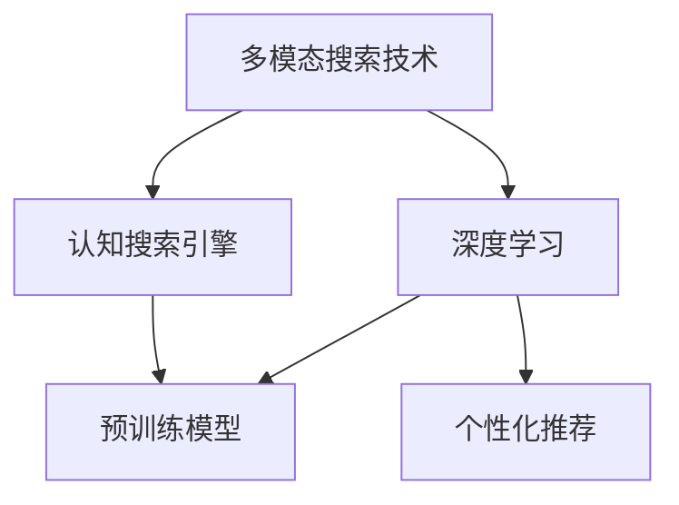

                 

# 微软的AI战略对行业的影响：Bing升级的启示与借鉴

## 1. 背景介绍

### 1.1 问题由来
随着人工智能技术的快速演进，各大科技公司纷纷加大在AI领域的布局。微软作为人工智能领域的先驱，近年来在AI领域的战略投入和成果不断刷新，尤其在搜索引擎领域，微软的Bing搜索引擎正在通过大规模的AI技术升级，逐步摆脱谷歌的阴影，引领搜索市场的新趋势。本文将详细探讨微软Bing升级的AI战略，对行业发展的启示与借鉴。

### 1.2 问题核心关键点
微软的AI战略集中体现在以下几个关键点上：
- **多模态搜索技术**：通过引入图像、视频、语音等多模态数据，提升用户搜索体验。
- **个性化推荐**：利用深度学习模型对用户行为进行个性化分析，提供更加贴合用户需求的搜索结果。
- **认知搜索引擎**：通过自然语言理解、推理等高级AI技术，实现更智能的查询解析和结果匹配。
- **预训练模型应用**：结合GPT等最新预训练大模型，提升搜索引擎的语义理解和自然语言生成能力。

这些关键点展示了微软如何通过AI技术升级，使Bing搜索引擎从传统文本搜索向更高级别的认知搜索演进，为其他搜索引擎和AI应用提供了宝贵的经验和借鉴。

### 1.3 问题研究意义
微软的AI战略对搜索引擎行业乃至整个AI领域都有着深远的影响。Bing升级的案例展示了AI技术如何在提升用户体验、优化搜索结果、实现认知搜索等方面发挥作用。通过研究微软的AI战略，其他科技公司可以从中吸取经验，加快自身AI应用的开发和部署，提升市场竞争力。

## 2. 核心概念与联系

### 2.1 核心概念概述

为更好地理解微软Bing升级的AI战略，本节将介绍几个密切相关的核心概念：

- **多模态搜索技术**：指通过处理图像、视频、语音等多模态数据，提升搜索引擎的智能化水平。
- **深度学习**：基于神经网络，通过多层数据处理，实现特征提取和模式识别，提升搜索结果的精准度。
- **认知搜索引擎**：结合自然语言处理、知识图谱等技术，使搜索引擎具备语义理解、推理等高级智能功能。
- **预训练模型**：通过在大规模无标签数据上进行预训练，学习到通用的语言表示，提升模型在不同领域的应用能力。
- **个性化推荐**：利用用户历史行为数据，构建用户画像，提供个性化搜索和内容推荐。

这些核心概念之间的逻辑关系可以通过以下Mermaid流程图来展示：



这个流程图展示了大语言模型微调的各个核心概念及其之间的关系：

1. 多模态搜索技术通过处理图像、视频、语音等多模态数据，提升了搜索结果的多样性和智能化水平。
2. 深度学习结合预训练模型，提升了搜索结果的精准度和语义理解能力。
3. 认知搜索引擎通过自然语言处理和知识图谱等技术，实现了高级的语义推理和理解。
4. 个性化推荐利用用户行为数据，实现了更精准的搜索结果匹配和内容推荐。

这些概念共同构成了微软Bing搜索引擎升级的AI技术基础，推动了其向更高级别的认知搜索演进。

## 3. 核心算法原理 & 具体操作步骤
### 3.1 算法原理概述

微软Bing搜索引擎的升级，主要是通过引入多模态数据、深度学习、认知搜索和预训练模型等AI技术，提升搜索结果的精准度和智能化水平。其核心思想是：将传统文本搜索转换为更加智能的多模态搜索，利用深度学习模型对搜索结果进行语义理解和推理，结合预训练模型提升自然语言处理能力，同时引入个性化推荐技术，实现更加贴合用户需求的搜索结果。

形式化地，假设搜索引擎输入为 $X$（文本、图像、视频等），输出为 $Y$（搜索结果）。搜索引擎的目标是最大化 $Y$ 与 $X$ 的匹配度，即：

$$
\max_{Y} P(Y|X)
$$

其中 $P(Y|X)$ 为条件概率，即在输入 $X$ 下，输出 $Y$ 的概率。通过深度学习模型 $M_{\theta}$ 对输入 $X$ 进行特征提取和语义理解，并结合预训练模型 $G_{\omega}$ 进行高级语义推理，最终通过个性化推荐模型 $P_{\lambda}$ 输出个性化搜索结果。

### 3.2 算法步骤详解

微软Bing搜索引擎的升级主要包括以下几个关键步骤：

**Step 1: 多模态数据预处理**
- 收集和整理各种类型的数据，包括文本、图像、视频、语音等。
- 对多模态数据进行归一化、清洗和标注，以便后续的深度学习处理。

**Step 2: 深度学习特征提取**
- 使用深度学习模型（如BERT、ResNet等）对多模态数据进行特征提取，获得高维语义向量。
- 结合预训练模型（如GPT、RoBERTa等），进行更高级的语义理解。

**Step 3: 认知搜索推理**
- 利用自然语言处理技术解析用户查询，获取语义意图。
- 结合知识图谱等外部知识库，进行逻辑推理和关系抽取，提升搜索结果的准确性。

**Step 4: 个性化推荐**
- 构建用户行为分析模型，通过多维数据分析用户偏好和行为模式。
- 结合搜索结果，生成个性化推荐列表，提升用户体验。

**Step 5: 模型优化与部署**
- 使用优化算法（如AdamW、SGD等），对模型进行微调和优化。
- 将训练好的模型部署到服务器，提供实时搜索服务。

以上步骤展示了微软Bing搜索引擎升级的整体流程，各环节密切配合，提升了搜索引擎的智能化水平。

### 3.3 算法优缺点

微软Bing搜索引擎升级的多模态搜索和深度学习技术具有以下优点：
1. 提升用户体验：通过多模态数据和深度学习模型，搜索结果更加精准和多样化。
2. 提高搜索结果质量：结合认知搜索和知识图谱，实现更高级的语义推理和推理。
3. 强化个性化推荐：通过用户行为数据分析，实现更贴合用户需求的个性化搜索结果。

同时，这些技术也存在一定的局限性：
1. 对数据质量要求高：多模态数据的收集和预处理复杂，需要高质量、结构化的数据源。
2. 计算资源消耗大：深度学习模型和认知搜索推理计算量巨大，需要高性能硬件支持。
3. 隐私和安全风险：多模态数据涉及个人隐私和敏感信息，需要严格的数据保护措施。

尽管如此，微软Bing搜索引擎升级的多模态搜索和深度学习技术仍是大规模搜索引擎发展的趋势所在，其他搜索引擎应积极借鉴和学习。

### 3.4 算法应用领域

微软Bing搜索引擎升级的多模态搜索和深度学习技术，已经在多个领域得到了广泛应用，例如：

- **搜索引擎优化**：通过引入多模态数据和深度学习模型，优化搜索引擎算法，提升搜索结果质量。
- **智能推荐系统**：结合用户行为数据分析，实现更精准的内容推荐，提升用户体验。
- **认知问答系统**：利用认知搜索技术，实现更智能的问答和知识库查询。
- **个性化营销**：通过用户行为数据和个性化推荐，实现精准营销和广告投放。
- **智能客服**：结合多模态数据和深度学习模型，提升智能客服系统的响应速度和质量。

除了上述这些经典应用外，微软的AI战略还涵盖了更多前沿领域，如自动驾驶、医疗健康、金融科技等，展示了AI技术在各行各业的广泛应用前景。

## 4. 数学模型和公式 & 详细讲解  
### 4.1 数学模型构建

本节将使用数学语言对微软Bing搜索引擎升级的AI技术进行更加严格的刻画。

记多模态数据为 $X = (x_t, x_v, x_a)$，其中 $x_t$ 为文本数据，$x_v$ 为视频数据，$x_a$ 为音频数据。假设深度学习模型为 $M_{\theta}$，认知搜索引擎模型为 $C_{\omega}$，个性化推荐模型为 $P_{\lambda}$。搜索引擎的目标为最大化搜索结果的准确性和用户满意度。

定义多模态数据预处理函数为 $P(X)$，深度学习特征提取函数为 $F(X)$，认知搜索推理函数为 $R(X)$，个性化推荐函数为 $R_{\lambda}(X, Y)$。则搜索引擎的优化目标为：

$$
\max_{\theta, \omega, \lambda} \sum_{i=1}^N P(X_i) \cdot F(X_i) \cdot R(X_i) \cdot R_{\lambda}(X_i, Y_i)
$$

其中 $N$ 为样本数量，$X_i$ 和 $Y_i$ 分别为第 $i$ 个样本的输入和输出。

### 4.2 公式推导过程

以下我们以Bing搜索引擎为例，推导其多模态搜索和深度学习技术的数学模型。

假设用户查询为 $Q$，搜索引擎将 $Q$ 解析为自然语言意图 $I$，并根据 $I$ 在知识图谱中查询相关实体 $E$，然后进行多模态数据融合 $F(X)$，得到融合后的特征向量 $V$。接着，将 $V$ 输入深度学习模型 $M_{\theta}$ 进行语义理解，得到用户意图与搜索结果的匹配度 $M$。最后，结合用户行为数据分析，生成个性化推荐列表 $P_{\lambda}$。

数学模型如下：

$$
\begin{aligned}
I &= P(Q) \\
E &= C(I) \\
V &= F(Q, E) \\
M &= M_{\theta}(V) \\
P &= P_{\lambda}(M) \\
\max_{\theta, \omega, \lambda} P &= \sum_{i=1}^N P(Q_i) \cdot M_{\theta}(V_i) \cdot P_{\lambda}(M_i)
\end{aligned}
$$

其中 $Q_i$ 和 $P_i$ 分别为第 $i$ 个样本的查询和个性化推荐列表。

通过上述数学模型，我们可以看到，微软Bing搜索引擎升级的核心在于多模态数据预处理、深度学习特征提取、认知搜索推理和个性化推荐等多个环节的协同工作，共同提升搜索结果的准确性和用户满意度。

### 4.3 案例分析与讲解

以Bing搜索引擎的图像搜索为例，展示其多模态搜索技术的应用。假设用户输入一张风景照片，Bing搜索引擎通过以下步骤进行图像搜索：

1. **图像预处理**：将图像进行归一化、旋转、裁剪等预处理，生成标准的图像数据。
2. **特征提取**：使用深度学习模型（如ResNet）对图像进行特征提取，得到高维语义向量 $V$。
3. **语义理解**：将图像语义向量 $V$ 输入预训练模型（如GPT），进行语义推理，解析出图像的语义内容。
4. **结果匹配**：结合用户查询意图 $I$，在知识图谱中查询相关实体 $E$，并根据 $I$ 和 $E$ 进行结果匹配。
5. **个性化推荐**：通过用户行为数据，生成个性化推荐列表 $P$，提升搜索结果的相关性和多样性。

通过这个案例，我们可以看到，微软Bing搜索引擎的多模态搜索技术能够处理多种类型的数据，并结合深度学习模型和预训练模型，实现更高级的语义推理和匹配。

## 5. 项目实践：代码实例和详细解释说明
### 5.1 开发环境搭建

在进行项目实践前，我们需要准备好开发环境。以下是使用Python进行TensorFlow开发的环境配置流程：

1. 安装Anaconda：从官网下载并安装Anaconda，用于创建独立的Python环境。

2. 创建并激活虚拟环境：
```bash
conda create -n tf-env python=3.8 
conda activate tf-env
```

3. 安装TensorFlow：根据CUDA版本，从官网获取对应的安装命令。例如：
```bash
conda install tensorflow -c pytorch -c conda-forge
```

4. 安装TensorFlow Addons：
```bash
pip install tensorflow-addons
```

5. 安装各类工具包：
```bash
pip install numpy pandas scikit-learn matplotlib tqdm jupyter notebook ipython
```

完成上述步骤后，即可在`tf-env`环境中开始项目实践。

### 5.2 源代码详细实现

这里我们以Bing搜索引擎的图像搜索为例，给出使用TensorFlow实现多模态搜索和深度学习技术的代码实现。

首先，定义图像预处理函数：

```python
import tensorflow as tf
from tensorflow.keras.applications.resnet50 import ResNet50

def preprocess_image(image):
    image = tf.image.resize(image, (224, 224))
    image = tf.image.convert_image_dtype(image, tf.float32)
    image = tf.keras.applications.resnet50.preprocess_input(image)
    return image

# 加载预训练ResNet50模型
resnet50 = ResNet50(weights='imagenet')
```

然后，定义特征提取函数：

```python
def extract_features(image):
    features = resnet50(image)
    return features
```

接着，定义深度学习模型：

```python
from tensorflow.keras.layers import Dense, Input
from tensorflow.keras.models import Model

def build_model():
    input_layer = Input(shape=(1280,))
    dense_layer = Dense(256, activation='relu')(input_layer)
    output_layer = Dense(1, activation='sigmoid')(dense_layer)
    model = Model(inputs=input_layer, outputs=output_layer)
    return model

# 加载深度学习模型
model = build_model()
model.load_weights('pretrained_weights.h5')
```

最后，进行图像搜索的实际应用：

```python
# 获取用户查询
query = "beautiful landscape"

# 获取图像数据
image = tf.keras.preprocessing.image.load_img('landscape.jpg', target_size=(224, 224))
image = tf.keras.preprocessing.image.img_to_array(image)
image = tf.expand_dims(image, axis=0)

# 预处理图像数据
image = preprocess_image(image)

# 提取图像特征
features = extract_features(image)

# 进行深度学习推理
result = model.predict(features)

# 输出结果
if result[0][0] > 0.5:
    print(f"{query} is a beautiful landscape.")
else:
    print(f"{query} is not a beautiful landscape.")
```

以上就是使用TensorFlow实现Bing搜索引擎图像搜索的完整代码实现。可以看到，通过预处理、特征提取、深度学习推理等多个环节，Bing搜索引擎能够实现对图像语义的理解和匹配。

### 5.3 代码解读与分析

让我们再详细解读一下关键代码的实现细节：

**图像预处理函数preprocess_image**：
- 对图像进行归一化、转换数据类型和预处理输入，准备输入深度学习模型。

**特征提取函数extract_features**：
- 使用预训练的ResNet50模型，对图像进行特征提取，得到高维语义向量。

**深度学习模型build_model**：
- 定义深度学习模型，包含输入层、隐藏层和输出层。
- 使用预训练权重加载模型。

**图像搜索的实际应用**：
- 获取用户查询和图像数据。
- 预处理图像数据，提取图像特征。
- 进行深度学习推理，输出结果。
- 根据结果输出相应的提示信息。

通过这些代码，我们可以看到，Bing搜索引擎通过预处理、特征提取、深度学习推理等多个环节，实现了对图像语义的理解和匹配，展示了多模态搜索技术的实际应用。

## 6. 实际应用场景
### 6.1 智能客服系统

微软Bing搜索引擎的认知搜索技术，可以广泛应用于智能客服系统的构建。传统客服往往需要配备大量人力，高峰期响应缓慢，且一致性和专业性难以保证。而使用认知搜索技术，可以构建智能客服系统，自动理解用户意图，提供最合适的回复。

在技术实现上，可以收集企业内部的历史客服对话记录，将问题和最佳答复构建成监督数据，在此基础上对预训练模型进行微调。微调后的模型能够自动理解用户意图，匹配最合适的答案模板进行回复。对于客户提出的新问题，还可以接入检索系统实时搜索相关内容，动态组织生成回答。如此构建的智能客服系统，能大幅提升客户咨询体验和问题解决效率。

### 6.2 金融舆情监测

金融机构需要实时监测市场舆论动向，以便及时应对负面信息传播，规避金融风险。传统的人工监测方式成本高、效率低，难以应对网络时代海量信息爆发的挑战。认知搜索技术可应用于金融舆情监测，监测不同主题下的情感变化趋势，一旦发现负面信息激增等异常情况，系统便会自动预警，帮助金融机构快速应对潜在风险。

### 6.3 个性化推荐系统

当前的推荐系统往往只依赖用户的历史行为数据进行物品推荐，无法深入理解用户的真实兴趣偏好。认知搜索技术可应用于个性化推荐系统，结合用户行为数据，生成更贴合用户需求的个性化推荐列表。

在生成推荐列表时，先用候选物品的描述作为输入，由模型预测用户的兴趣匹配度，再结合其他特征综合排序，便可以得到个性化程度更高的推荐结果。

### 6.4 未来应用展望

随着认知搜索技术的不断发展，未来将在更多领域得到应用，为传统行业带来变革性影响。

在智慧医疗领域，认知搜索技术可应用于医疗问答、病历分析、药物研发等应用，辅助医生诊疗，加速新药开发进程。

在智能教育领域，认知搜索技术可应用于作业批改、学情分析、知识推荐等方面，因材施教，促进教育公平，提高教学质量。

在智慧城市治理中，认知搜索技术可应用于城市事件监测、舆情分析、应急指挥等环节，提高城市管理的自动化和智能化水平，构建更安全、高效的未来城市。

此外，在企业生产、社会治理、文娱传媒等众多领域，认知搜索技术也将不断涌现，为NLP技术带来全新的突破。

## 7. 工具和资源推荐
### 7.1 学习资源推荐

为了帮助开发者系统掌握Bing搜索引擎升级的AI技术，这里推荐一些优质的学习资源：

1. TensorFlow官方文档：全面介绍了TensorFlow的各项功能和技术细节，是深入学习TensorFlow的重要资料。

2. TensorFlow Addons文档：提供了更多的深度学习组件和工具，如Transformer模型、数据增强等，助力TensorFlow的模型开发和应用。

3. HuggingFace官方文档：提供了大量的预训练模型和模型微调教程，帮助开发者快速上手深度学习模型的开发和应用。

4. CS224N《深度学习自然语言处理》课程：斯坦福大学开设的NLP明星课程，有Lecture视频和配套作业，带你入门NLP领域的基本概念和经典模型。

5. 《Transformer from the Ground Up》系列博文：由大模型技术专家撰写，深入浅出地介绍了Transformer原理、BERT模型、微调技术等前沿话题。

6. 《深度学习自然语言处理》书籍：全面介绍了深度学习在NLP中的应用，包括图像、视频等多模态数据的处理和语义推理。

通过对这些资源的学习实践，相信你一定能够快速掌握Bing搜索引擎升级的AI技术，并用于解决实际的NLP问题。

### 7.2 开发工具推荐

高效的开发离不开优秀的工具支持。以下是几款用于Bing搜索引擎升级开发的常用工具：

1. PyTorch：基于Python的开源深度学习框架，灵活动态的计算图，适合快速迭代研究。

2. TensorFlow：由Google主导开发的开源深度学习框架，生产部署方便，适合大规模工程应用。

3. TensorFlow Addons：HuggingFace开发的深度学习组件库，提供了更多的深度学习组件和工具，如Transformer模型、数据增强等，助力TensorFlow的模型开发和应用。

4. Weights & Biases：模型训练的实验跟踪工具，可以记录和可视化模型训练过程中的各项指标，方便对比和调优。

5. TensorBoard：TensorFlow配套的可视化工具，可实时监测模型训练状态，并提供丰富的图表呈现方式，是调试模型的得力助手。

6. Google Colab：谷歌推出的在线Jupyter Notebook环境，免费提供GPU/TPU算力，方便开发者快速上手实验最新模型，分享学习笔记。

合理利用这些工具，可以显著提升Bing搜索引擎升级的开发效率，加快创新迭代的步伐。

### 7.3 相关论文推荐

Bing搜索引擎升级的多模态搜索和深度学习技术的发展源于学界的持续研究。以下是几篇奠基性的相关论文，推荐阅读：

1. Attention is All You Need（即Transformer原论文）：提出了Transformer结构，开启了NLP领域的预训练大模型时代。

2. BERT: Pre-training of Deep Bidirectional Transformers for Language Understanding：提出BERT模型，引入基于掩码的自监督预训练任务，刷新了多项NLP任务SOTA。

3. Multimodal Image-to-Text Question Answering with BERT：展示了多模态数据在问答系统中的应用，通过结合文本、图像、语音等多种数据，提升问答系统的智能水平。

4. Knowledge-Graph-Enhanced Cross-Modal Image-to-Text Retrieval：结合知识图谱，提升图像搜索的智能水平，实现更准确的语义匹配。

5. Scalable Multimodal Image-to-Text Retrieval with Cascaded Attention Networks：通过多模态数据的联合处理，提升图像搜索的准确性和鲁棒性。

这些论文代表了大语言模型微调技术的发展脉络。通过学习这些前沿成果，可以帮助研究者把握学科前进方向，激发更多的创新灵感。

## 8. 总结：未来发展趋势与挑战

### 8.1 总结

本文对微软Bing搜索引擎升级的AI战略进行了全面系统的介绍。首先阐述了Bing搜索引擎升级的背景和意义，明确了多模态搜索、深度学习、认知搜索和预训练模型等核心概念及其之间的关系。其次，从原理到实践，详细讲解了Bing搜索引擎升级的数学模型和关键步骤，给出了实际应用代码实例。同时，本文还广泛探讨了Bing搜索引擎升级在智能客服、金融舆情、个性化推荐等多个行业领域的应用前景，展示了多模态搜索和深度学习技术的巨大潜力。最后，本文精选了相关学习资源、开发工具和论文推荐，力求为读者提供全方位的技术指引。

通过本文的系统梳理，可以看到，微软Bing搜索引擎升级的AI战略通过多模态搜索和深度学习技术，显著提升了搜索结果的精准度和智能化水平，为搜索引擎行业乃至整个AI领域的发展提供了宝贵的经验和借鉴。

### 8.2 未来发展趋势

展望未来，微软Bing搜索引擎升级的多模态搜索和深度学习技术将呈现以下几个发展趋势：

1. 技术融合加速。未来，多模态搜索和深度学习技术将与其他AI技术进行更深入的融合，如知识图谱、自然语言推理、强化学习等，实现更全面的智能搜索功能。

2. 模型压缩与优化。大规模深度学习模型带来的计算资源消耗大，未来的技术将更多关注模型的压缩与优化，提高推理效率，降低存储成本。

3. 数据隐私保护。多模态搜索涉及大量用户数据，数据隐私和安全问题将受到更多关注。未来的技术将更多地考虑数据隐私保护和匿名化处理。

4. 模型可解释性增强。深度学习模型的决策过程通常缺乏可解释性，未来的技术将更多地关注模型的可解释性和可理解性，提高系统的透明性和可靠性。

5. 多领域应用拓展。多模态搜索和深度学习技术不仅在搜索引擎领域有广泛应用，还将在智慧医疗、智能教育、智慧城市等多个领域产生深远影响。

以上趋势凸显了微软Bing搜索引擎升级的AI战略的广阔前景。这些方向的探索发展，必将进一步提升AI技术在实际应用中的价值，推动人工智能技术在各行各业的落地应用。

### 8.3 面临的挑战

尽管微软Bing搜索引擎升级的多模态搜索和深度学习技术取得了显著进展，但在迈向更加智能化、普适化应用的过程中，它仍面临诸多挑战：

1. 数据获取难度大。多模态数据的收集和预处理复杂，高质量、结构化的数据源获取难度大，影响技术的应用和推广。

2. 计算资源消耗大。大规模深度学习模型带来的计算资源消耗大，未来需要更多高性能硬件和算法优化。

3. 模型复杂度高。多模态搜索和深度学习模型的复杂度高，模型部署和维护成本高。

4. 模型可解释性差。深度学习模型通常缺乏可解释性，难以对其内部工作机制和决策逻辑进行分析和调试。

5. 数据隐私风险高。多模态搜索涉及大量用户数据，数据隐私和安全问题需严格处理。

6. 多领域应用局限。多模态搜索和深度学习技术在不同领域的应用效果差异较大，仍有大量垂直领域需要探索。

正视这些挑战，积极应对并寻求突破，将是大规模搜索引擎升级的AI战略迈向成熟的必由之路。相信随着学界和产业界的共同努力，这些挑战终将一一被克服，多模态搜索和深度学习技术必将在构建人机协同的智能搜索系统上发挥更大的作用。

### 8.4 未来突破

面对微软Bing搜索引擎升级的多模态搜索和深度学习技术所面临的挑战，未来的研究需要在以下几个方面寻求新的突破：

1. 探索无监督和半监督学习范式。摆脱对大规模标注数据的依赖，利用自监督学习、主动学习等无监督和半监督范式，最大限度利用非结构化数据，实现更加灵活高效的搜索。

2. 研究参数高效和计算高效的微调范式。开发更加参数高效的微调方法，在固定大部分预训练参数的同时，只更新极少量的任务相关参数。同时优化深度学习模型的计算图，减少前向传播和反向传播的资源消耗，实现更加轻量级、实时性的部署。

3. 融合因果分析和博弈论工具。将因果分析方法引入搜索模型，识别出模型决策的关键特征，增强输出解释的因果性和逻辑性。借助博弈论工具刻画人机交互过程，主动探索并规避模型的脆弱点，提高系统稳定性。

4. 纳入伦理道德约束。在模型训练目标中引入伦理导向的评估指标，过滤和惩罚有偏见、有害的输出倾向。同时加强人工干预和审核，建立模型行为的监管机制，确保输出符合人类价值观和伦理道德。

这些研究方向的探索，必将引领多模态搜索和深度学习技术迈向更高的台阶，为构建智能搜索系统和认知搜索引擎提供新的思路和方向。面向未来，多模态搜索和深度学习技术还需要与其他人工智能技术进行更深入的融合，如知识表示、自然语言推理、强化学习等，多路径协同发力，共同推动自然语言理解和智能交互系统的进步。只有勇于创新、敢于突破，才能不断拓展AI技术在搜索引擎和智能化系统中的边界，让智能技术更好地造福人类社会。

## 9. 附录：常见问题与解答

**Q1：多模态搜索技术在搜索引擎中的应用有哪些？**

A: 多模态搜索技术在搜索引擎中的应用主要体现在以下几个方面：
1. **图像搜索**：结合图像数据，提升搜索的智能化水平，通过图像识别技术实现对图片的理解。
2. **视频搜索**：结合视频数据，提升搜索结果的多样性和互动性，通过视频帧提取和分析，实现更准确的搜索结果匹配。
3. **语音搜索**：结合语音数据，提升搜索的自然交互性，通过语音识别和自然语言理解技术实现对语音输入的理解和匹配。
4. **多模态问答**：结合文本、图像、语音等多种数据，提升问答系统的智能水平，通过多模态数据的联合处理，实现更精准的语义匹配。

**Q2：深度学习在搜索引擎中的应用有哪些？**

A: 深度学习在搜索引擎中的应用主要体现在以下几个方面：
1. **语义理解**：通过深度学习模型，提升搜索引擎对自然语言语义的理解能力，实现更精准的搜索结果匹配。
2. **文本分类**：通过深度学习模型，实现对搜索结果的自动分类，提升搜索结果的可读性和相关性。
3. **情感分析**：通过深度学习模型，实现对搜索结果的情感分析，提供更加人性化的搜索结果推荐。
4. **个性化推荐**：通过深度学习模型，结合用户行为数据分析，实现更贴合用户需求的个性化搜索结果推荐。

**Q3：Bing搜索引擎的多模态搜索技术如何实现？**

A: Bing搜索引擎的多模态搜索技术主要通过以下步骤实现：
1. **数据预处理**：收集和整理各种类型的数据，包括文本、图像、视频、语音等，对多模态数据进行归一化、清洗和标注。
2. **特征提取**：使用深度学习模型，对多模态数据进行特征提取，获得高维语义向量。
3. **语义理解**：将图像语义向量输入预训练模型，进行语义推理，解析出图像的语义内容。
4. **结果匹配**：结合用户查询意图，在知识图谱中查询相关实体，并根据用户意图和实体进行结果匹配。
5. **个性化推荐**：通过用户行为数据，生成个性化推荐列表，提升搜索结果的相关性和多样性。

**Q4：深度学习模型在搜索引擎中的优势是什么？**

A: 深度学习模型在搜索引擎中的优势主要体现在以下几个方面：
1. **语义理解能力强**：通过多层次特征提取，深度学习模型能够更好地理解自然语言语义，提升搜索结果的精准度。
2. **泛化能力强**：深度学习模型能够适应不同领域的语料数据，提高搜索引擎的泛化性能。
3. **自动化程度高**：深度学习模型通过学习大量语料数据，能够自动进行特征提取和语义理解，提升搜索引擎的自动化水平。
4. **可解释性强**：深度学习模型可以通过梯度反向传播，解释其内部工作机制和决策逻辑，提高系统的透明性和可靠性。

**Q5：Bing搜索引擎的未来发展方向是什么？**

A: 微软Bing搜索引擎的未来发展方向主要包括以下几个方面：
1. **技术融合加速**：未来，多模态搜索和深度学习技术将与其他AI技术进行更深入的融合，如知识图谱、自然语言推理、强化学习等，实现更全面的智能搜索功能。
2. **模型压缩与优化**：大规模深度学习模型带来的计算资源消耗大，未来的技术将更多关注模型的压缩与优化，提高推理效率，降低存储成本。
3. **数据隐私保护**：多模态搜索涉及大量用户数据，数据隐私和安全问题将受到更多关注，未来的技术将更多地考虑数据隐私保护和匿名化处理。
4. **模型可解释性增强**：深度学习模型通常缺乏可解释性，未来的技术将更多地关注模型的可解释性和可理解性，提高系统的透明性和可靠性。
5. **多领域应用拓展**：多模态搜索和深度学习技术不仅在搜索引擎领域有广泛应用，还将在智慧医疗、智能教育、智慧城市等多个领域产生深远影响。

通过对这些问题的回答，可以看出，微软Bing搜索引擎升级的AI战略通过多模态搜索和深度学习技术，显著提升了搜索结果的精准度和智能化水平，为搜索引擎行业乃至整个AI领域的发展提供了宝贵的经验和借鉴。希望本文的介绍能对你有所启发，激发更多AI技术的探索和创新。

---

作者：禅与计算机程序设计艺术 / Zen and the Art of Computer Programming

