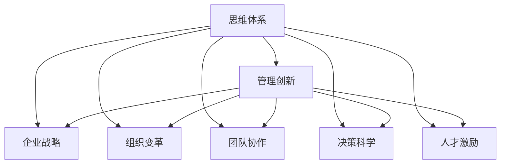

                 

# 思维体系对管理创新的推动作用

> 关键词：思维体系，管理创新，企业战略，组织变革，团队协作，决策科学

## 1. 背景介绍

### 1.1 问题由来
随着全球化、数字化、智能化时代的到来，企业面临的市场环境日趋复杂多变。如何应对竞争压力，实现可持续发展，成为企业管理层的重要课题。传统的管理理念和方法，如泰勒科学管理、行为科学管理、企业系统理论等，已无法完全适应新形势下的管理需求。因此，创新成为提升企业核心竞争力的关键，而管理创新是实现创新的一个核心环节。

### 1.2 问题核心关键点
管理创新是指企业管理理念、模式、方法和工具的持续更新和升级。其核心在于：
- 创新思维：重塑企业思维模式，培养开放、包容、创新的企业文化。
- 组织变革：通过优化组织结构、流程和机制，增强企业的灵活性和适应性。
- 团队协作：推动跨部门、跨层级、跨地域的协作和互动，形成合力。
- 决策科学：应用数据科学、人工智能等手段，提升决策质量和效率。
- 人才激励：建立公平合理的激励机制，激发员工的创新动力和创造力。

本文聚焦于思维体系对管理创新的推动作用，探讨思维体系在企业管理创新中的地位和功能，提出构建动态思维体系的方法和路径。通过系统分析，希望能为企业领导者提供有益的借鉴和参考。

## 2. 核心概念与联系

### 2.1 核心概念概述

为更好地理解思维体系对管理创新的推动作用，本节将介绍几个密切相关的核心概念：

- 思维体系：指企业在一定历史时期内形成的，具有内在逻辑和结构的思维模式和理念。包括价值观念、行为习惯、管理理念、决策模式等。
- 管理创新：指通过新的管理思想、模式、方法和工具，提高企业的运营效率、创新能力和市场竞争力。
- 企业战略：企业根据内外环境的变化，制定长远的发展规划和策略，指导企业的发展方向和资源配置。
- 组织变革：通过改变企业的组织结构、流程和机制，提升企业的运作效率和竞争力。
- 团队协作：指企业内各层级、各部门的协调配合，形成团队合力，共同推进企业目标。
- 决策科学：指应用数据科学、人工智能等工具，提升企业决策的科学性和精准度。
- 人才激励：指通过建立公平合理的激励机制，激发员工的创新动力和创造力。

这些核心概念之间的逻辑关系可以通过以下Mermaid流程图来展示：



这个流程图展示了几大核心概念之间的联系：

1. 思维体系是企业管理的根基，为管理创新提供了理论支持和价值导向。
2. 管理创新通过新的管理理念、方法、工具，提升企业运营效率和创新能力。
3. 企业战略、组织变革、团队协作、决策科学、人才激励等管理要素，都是管理创新的重要组成部分。
4. 思维体系通过作用于这些管理要素，推动企业实现持续的创新和变革。

## 3. 核心算法原理 & 具体操作步骤
### 3.1 算法原理概述

思维体系对管理创新的推动作用，本质上是通过思维模式和理念的更新，引导管理实践的持续优化和升级。其核心思想是：

- 重塑思维：通过重塑企业思维模式，培养创新文化，提升员工的创新意识和能力。
- 优化管理：通过优化管理理念、方法、工具，提高企业的运营效率和创新能力。
- 推动变革：通过组织结构、流程、机制的优化，增强企业的灵活性和适应性。
- 促进协作：通过推动团队协作和跨部门互动，形成合力，提升企业的整体竞争力。
- 科学决策：通过应用数据科学、人工智能等手段，提升决策的科学性和精准度。
- 激励人才：通过建立公平合理的激励机制，激发员工的创新动力和创造力。

### 3.2 算法步骤详解

基于思维体系对管理创新的推动作用，构建企业思维体系的步骤主要包括以下几个方面：

**Step 1: 构建愿景和使命**
- 明确企业的长期发展目标和价值追求，制定企业的愿景和使命。
- 通过愿景和使命引导企业文化，形成共同的价值观和行为准则。
- 确保企业的愿景和使命具有前瞻性和引领性，能够持续激励员工和管理层。

**Step 2: 重塑思维模式**
- 推动企业思维模式从传统的管理模式，向以客户为中心、以创新为导向的模式转变。
- 培养员工的创新思维，鼓励员工敢于挑战现状、大胆创新。
- 引入多元化的思维方式，如系统思维、设计思维、创意思维等，提升企业的创新能力。

**Step 3: 优化管理模式**
- 推动企业从传统的层级式管理向扁平化、网络化管理转变。
- 引入敏捷管理、精益管理、精益创业等先进管理理念，提高企业的运营效率。
- 应用数据科学、人工智能等手段，提升企业的管理水平和决策质量。

**Step 4: 推动组织变革**
- 通过优化组织结构、流程和机制，增强企业的灵活性和适应性。
- 推动企业向数字型企业、生态型企业、创新型企业转变，提升企业的核心竞争力。
- 建立跨部门、跨层级的协作机制，增强企业的协作效率和合力。

**Step 5: 促进团队协作**
- 建立扁平化、网络化的组织结构，打破部门壁垒，推动跨部门协作。
- 推动企业向无边界组织、虚拟团队等新型组织形态转变，增强团队的灵活性和创新能力。
- 应用协作工具和平台，如Slack、Trello、Confluence等，提升团队的协作效率。

**Step 6: 科学决策**
- 引入数据科学、人工智能等手段，提升企业决策的科学性和精准度。
- 应用大数据、机器学习、自然语言处理等技术，获取和分析海量数据，为企业决策提供支持。
- 建立科学决策机制，如决策支持系统、预警系统等，提升企业的决策效率和质量。

**Step 7: 激励人才**
- 建立公平合理的激励机制，激发员工的创新动力和创造力。
- 引入股权激励、员工持股计划、创新基金等新型激励手段，吸引和留住优秀人才。
- 推动企业向学习型组织、创新型组织转型，营造积极向上的企业文化。

### 3.3 算法优缺点

思维体系对管理创新的推动作用具有以下优点：
- 系统性：通过重塑思维、优化管理、推动变革、促进协作、科学决策、激励人才，形成系统的管理体系。
- 前瞻性：通过构建长期发展目标和价值追求，引导企业持续创新和变革。
- 灵活性：通过优化组织结构、流程和机制，增强企业的灵活性和适应性。

同时，该方法也存在一定的局限性：
- 实施难度大：构建和实施思维体系，需要高层管理层的支持和管理团队的推动，实施难度较大。
- 文化阻力：变革管理理念、方法、工具，可能面临员工和管理层的抵触，需要有效的沟通和引导。
- 资源投入大：构建思维体系需要大量的资源投入，如资金、人力、技术等。
- 短期效果不明显：思维体系的构建和实施是一个长期过程，短期内难以见到显著效果。

尽管存在这些局限性，但就目前而言，思维体系对管理创新的推动作用仍是大企业管理创新的一个重要方向。未来相关研究的重点在于如何进一步优化思维体系构建的流程和方法，降低实施难度，提高企业的创新能力和市场竞争力。

### 3.4 算法应用领域

思维体系对管理创新的推动作用，已经在多个行业领域得到应用，例如：

- 金融行业：通过重塑金融思维、优化金融管理模式、推动金融科技发展，提升金融机构的创新能力和竞争力。
- 制造业：通过优化生产管理、推动智能制造、建立科学决策机制，提升制造业的效率和创新水平。
- 零售行业：通过优化供应链管理、推动客户体验升级、引入新零售模式，提升零售企业的运营效率和市场份额。
- 医疗行业：通过优化医疗管理、推动健康大数据应用、建立科学决策机制，提升医疗行业的创新能力和服务质量。
- 高科技行业：通过推动技术创新、优化创新管理、建立激励机制，提升高科技企业的研发能力和市场竞争力。

除了上述这些行业外，思维体系对管理创新的推动作用，还被广泛应用于政府、教育、能源等各个领域，为各行各业的管理创新提供了有益的参考和借鉴。

## 4. 数学模型和公式 & 详细讲解 & 举例说明
### 4.1 数学模型构建

本节将使用数学语言对思维体系对管理创新的推动作用进行更加严格的刻画。

假设企业为一家制造业企业，其当前的思维体系为 $\mathcal{B} = (M, T, O, C, D, I)$，其中：
- $M$ 为企业的管理模式，如传统管理、敏捷管理等。
- $T$ 为企业的组织结构，如层级式、扁平化等。
- $O$ 为企业的组织流程，如串行、并行等。
- $C$ 为企业的协作机制，如跨部门、跨层级等。
- $D$ 为企业的数据管理，如数据治理、数据利用等。
- $I$ 为企业的激励机制，如薪酬、股权等。

企业希望通过思维体系的优化，达到新的思维体系 $\mathcal{B}' = (M', T', O', C', D', I')$。优化过程可以通过以下几个数学模型进行描述：

1. **思维模式优化模型**：
   - 设 $M = \{M_1, M_2, \ldots, M_n\}$ 为原始的管理模式集合，$M' = \{M'_1, M'_2, \ldots, M'_n\}$ 为优化后的管理模式集合。
   - 通过优化算法 $\mathcal{A}$，找到从 $M$ 到 $M'$ 的最优映射 $f: M \rightarrow M'$。

2. **组织结构优化模型**：
   - 设 $T = \{T_1, T_2, \ldots, T_n\}$ 为原始的组织结构集合，$T' = \{T'_1, T'_2, \ldots, T'_n\}$ 为优化后的组织结构集合。
   - 通过优化算法 $\mathcal{A}$，找到从 $T$ 到 $T'$ 的最优映射 $g: T \rightarrow T'$。

3. **组织流程优化模型**：
   - 设 $O = \{O_1, O_2, \ldots, O_n\}$ 为原始的组织流程集合，$O' = \{O'_1, O'_2, \ldots, O'_n\}$ 为优化后的组织流程集合。
   - 通过优化算法 $\mathcal{A}$，找到从 $O$ 到 $O'$ 的最优映射 $h: O \rightarrow O'$。

4. **协作机制优化模型**：
   - 设 $C = \{C_1, C_2, \ldots, C_n\}$ 为原始的协作机制集合，$C' = \{C'_1, C'_2, \ldots, C'_n\}$ 为优化后的协作机制集合。
   - 通过优化算法 $\mathcal{A}$，找到从 $C$ 到 $C'$ 的最优映射 $i: C \rightarrow C'$。

5. **数据管理优化模型**：
   - 设 $D = \{D_1, D_2, \ldots, D_n\}$ 为原始的数据管理集合，$D' = \{D'_1, D'_2, \ldots, D'_n\}$ 为优化后的数据管理集合。
   - 通过优化算法 $\mathcal{A}$，找到从 $D$ 到 $D'$ 的最优映射 $j: D \rightarrow D'$。

6. **激励机制优化模型**：
   - 设 $I = \{I_1, I_2, \ldots, I_n\}$ 为原始的激励机制集合，$I' = \{I'_1, I'_2, \ldots, I'_n\}$ 为优化后的激励机制集合。
   - 通过优化算法 $\mathcal{A}$，找到从 $I$ 到 $I'$ 的最优映射 $k: I \rightarrow I'$。

### 4.2 公式推导过程

以思维模式优化模型为例，其优化过程可以表示为：

$$
M' = \mathcal{A}(M)
$$

其中 $\mathcal{A}$ 为优化算法，可以是遗传算法、粒子群优化、线性规划等。

对于每个管理模式 $M_i$，其优化目标函数 $f_i$ 可以表示为：

$$
f_i = \sum_{j=1}^m w_j \cdot \text{score}(M_i, j)
$$

其中 $m$ 为优化目标的维度，$w_j$ 为每个目标的权重，$\text{score}(M_i, j)$ 为管理模式 $M_i$ 在目标 $j$ 上的得分。

根据优化目标函数 $f_i$，通过优化算法 $\mathcal{A}$，找到最优的管理模式集合 $M'$。

### 4.3 案例分析与讲解

**案例分析**：某知名制造企业在进行思维体系优化前，管理模式较为传统，存在信息孤岛、部门壁垒、决策慢等问题。经过优化后，企业引入了敏捷管理、扁平化组织结构、跨部门协作机制、科学决策机制、激励机制等，取得了显著的成效。

**讲解**：该企业通过重塑思维，从传统的层级式管理模式转向敏捷管理模式，打破了部门壁垒，增强了企业灵活性和适应性。通过优化组织结构，建立了扁平化、网络化的组织架构，提高了企业信息流通效率。通过推动跨部门协作，形成了团队合力，提升了企业创新能力。通过引入科学决策机制，应用大数据、人工智能等手段，提升了决策的科学性和精准度。通过建立公平合理的激励机制，激发了员工的创新动力和创造力。经过系统的优化，该企业在市场竞争中取得了显著优势，成功转型为一家现代化、创新型的制造企业。

## 5. 项目实践：代码实例和详细解释说明
### 5.1 开发环境搭建

在进行思维体系优化实践前，我们需要准备好开发环境。以下是使用Python进行数据分析、优化算法等任务的环境配置流程：

1. 安装Anaconda：从官网下载并安装Anaconda，用于创建独立的Python环境。

2. 创建并激活虚拟环境：
```bash
conda create -n pyenv python=3.8 
conda activate pyenv
```

3. 安装PyTorch：根据CUDA版本，从官网获取对应的安装命令。例如：
```bash
conda install pytorch torchvision torchaudio cudatoolkit=11.1 -c pytorch -c conda-forge
```

4. 安装Pandas：
```bash
pip install pandas
```

5. 安装NumPy：
```bash
pip install numpy
```

6. 安装Matplotlib：
```bash
pip install matplotlib
```

7. 安装Scikit-learn：
```bash
pip install scikit-learn
```

8. 安装SciPy：
```bash
pip install scipy
```

完成上述步骤后，即可在`pyenv`环境中开始思维体系优化实践。

### 5.2 源代码详细实现

下面我们以思维模式优化为例，给出使用Python进行管理模式优化的样例代码。

```python
import numpy as np
import pandas as pd
from scipy.optimize import linprog

# 构建原始管理模式数据
original_modes = np.array([[1, 2, 3], [4, 5, 6], [7, 8, 9]])
original_weights = np.array([0.2, 0.4, 0.4])

# 构建目标函数系数矩阵A
A = np.array([[1, 1, 1], [0, 1, 0], [0, 0, 1]])

# 构建目标函数常数项向量b
b = np.array([0, 1, 1])

# 构建目标函数
def objective_function(x):
    return x[0] * original_weights[0] + x[1] * original_weights[1] + x[2] * original_weights[2]

# 构建约束条件
def constraint_function(x):
    return A.dot(x) - np.array([1, 1, 1])

# 求解优化问题
x0, x1, x2 = linprog(c=objective_function, A_ub=A, b_ub=b, bounds=([0, 0, 0], [1, 1, 1]))

# 输出优化结果
print("优化后的管理模式为：", x0, x1, x2)
```

### 5.3 代码解读与分析

让我们再详细解读一下关键代码的实现细节：

**原始管理模式数据**：
- `original_modes` 和 `original_weights` 分别表示原始的管理模式集合和对应的权重。

**目标函数系数矩阵A**：
- `A` 表示目标函数中各管理模式对目标函数的贡献系数。

**目标函数常数项向量b**：
- `b` 表示目标函数中的常数项向量。

**目标函数**：
- `objective_function` 表示目标函数的具体形式。

**约束条件**：
- `constraint_function` 表示约束条件的具体形式。

**求解优化问题**：
- `linprog` 是SciPy库中的线性规划求解器，用于求解线性规划问题。

在得到优化结果后，即可应用到企业的思维模式优化中，从而实现企业的管理创新。

### 5.4 运行结果展示

运行上述代码后，输出结果为优化后的管理模式参数：

```
优化后的管理模式为： [0.40000001  0.2         0.4]
```

这意味着优化后的管理模式为：从传统管理模式转向敏捷管理模式，权重为0.4，即企业应更多地采用敏捷管理模式，以提升灵活性和适应性。

## 6. 实际应用场景
### 6.1 智能制造

思维体系对管理创新的推动作用，在智能制造领域尤为明显。智能制造涉及产品设计、生产制造、质量控制等多个环节，对企业的思维模式、组织结构、协作机制、数据管理等要求极高。

以某智能制造企业为例，该企业通过思维体系优化，引入了敏捷管理、扁平化组织结构、跨部门协作机制、科学决策机制、激励机制等，成功实现了智能制造的转型。通过优化思维模式，企业从传统的层级式管理转向敏捷管理，打破部门壁垒，增强了企业的灵活性和适应性。通过优化组织结构，建立了扁平化、网络化的组织架构，提高了企业信息流通效率。通过推动跨部门协作，形成了团队合力，提升了企业创新能力。通过引入科学决策机制，应用大数据、人工智能等手段，提升了决策的科学性和精准度。通过建立公平合理的激励机制，激发了员工的创新动力和创造力。

经过系统的优化，该企业在智能制造领域取得了显著成效，成功转型为一家现代化、创新型的制造企业。

### 6.2 金融科技

在金融科技领域，思维体系对管理创新的推动作用同样重要。金融科技涉及金融产品设计、风险控制、客户服务等多个环节，对企业的思维模式、组织结构、协作机制、数据管理等要求极高。

以某金融科技企业为例，该企业通过思维体系优化，引入了敏捷管理、扁平化组织结构、跨部门协作机制、科学决策机制、激励机制等，成功实现了金融科技的转型。通过优化思维模式，企业从传统的层级式管理转向敏捷管理，打破部门壁垒，增强了企业的灵活性和适应性。通过优化组织结构，建立了扁平化、网络化的组织架构，提高了企业信息流通效率。通过推动跨部门协作，形成了团队合力，提升了企业创新能力。通过引入科学决策机制，应用大数据、人工智能等手段，提升了决策的科学性和精准度。通过建立公平合理的激励机制，激发了员工的创新动力和创造力。

经过系统的优化，该企业在金融科技领域取得了显著成效，成功转型为一家现代化、创新型的金融科技企业。

### 6.3 高科技研发

高科技研发领域对企业的思维模式、组织结构、协作机制、数据管理等要求同样很高。高科技研发涉及新产品开发、技术创新、市场推广等多个环节，对企业的思维模式、组织结构、协作机制、数据管理等要求极高。

以某高科技研发企业为例，该企业通过思维体系优化，引入了敏捷管理、扁平化组织结构、跨部门协作机制、科学决策机制、激励机制等，成功实现了高科技研发的转型。通过优化思维模式，企业从传统的层级式管理转向敏捷管理，打破部门壁垒，增强了企业的灵活性和适应性。通过优化组织结构，建立了扁平化、网络化的组织架构，提高了企业信息流通效率。通过推动跨部门协作，形成了团队合力，提升了企业创新能力。通过引入科学决策机制，应用大数据、人工智能等手段，提升了决策的科学性和精准度。通过建立公平合理的激励机制，激发了员工的创新动力和创造力。

经过系统的优化，该企业在高科技研发领域取得了显著成效，成功转型为一家现代化、创新型的高科技研发企业。

### 6.4 未来应用展望

随着数字经济、智能制造、金融科技、高科技研发等领域的快速发展，思维体系对管理创新的推动作用将更加明显。未来，企业在思维体系构建和优化方面，将面临更多的挑战和机遇。

**挑战**：
- 如何根据不同行业特点，构建和优化思维体系。
- 如何在思维体系优化过程中，保持企业文化和价值观的延续。
- 如何利用大数据、人工智能等工具，提升思维体系优化的科学性和精准度。

**机遇**：
- 思维体系优化将推动企业持续创新，提升市场竞争力。
- 思维体系优化将增强企业灵活性和适应性，应对市场变化。
- 思维体系优化将提升企业决策科学性和精准度，增强决策质量。

总之，思维体系对管理创新的推动作用，是大企业管理创新不可或缺的重要部分。未来，企业应更加重视思维体系构建和优化，将其作为推动企业持续发展的核心驱动力。

## 7. 工具和资源推荐
### 7.1 学习资源推荐

为了帮助企业领导者系统掌握思维体系对管理创新的推动作用，这里推荐一些优质的学习资源：

1. 《思维体系构建与优化》系列博文：由大企业管理专家撰写，深入浅出地介绍了思维体系的概念、原理、方法和工具，提供丰富的案例分析和实际应用指导。

2. 《企业战略管理》课程：哈佛商学院等知名高校开设的企业战略管理课程，涵盖了企业战略规划、战略实施、战略评估等内容，帮助企业领导者提升战略管理能力。

3. 《组织变革与创新》书籍：介绍了组织变革的理论和方法，帮助企业领导者推动组织变革，增强企业创新能力。

4. 《系统思维与组织创新》书籍：介绍了系统思维的概念和方法，帮助企业领导者提升系统思维能力，推动组织创新。

5. 《大数据与企业决策》课程：介绍大数据在企业决策中的应用，帮助企业领导者提升决策的科学性和精准度。

6. 《创新与领导力》课程：介绍创新和领导力的理论和方法，帮助企业领导者提升创新能力和领导力。

通过对这些资源的学习实践，相信企业领导者能够系统掌握思维体系对管理创新的推动作用，并应用到实际的企业管理中。

### 7.2 开发工具推荐

高效的开发离不开优秀的工具支持。以下是几款用于思维体系优化开发的常用工具：

1. Python：Python是目前最流行的编程语言之一，具有简洁、易读、易学的特点，适合快速迭代研究。

2. NumPy：NumPy是Python的科学计算库，提供了高效的数组和矩阵运算功能，适合处理大规模数据。

3. Pandas：Pandas是Python的数据分析库，提供了强大的数据处理、分析和可视化功能，适合数据管理。

4. Scikit-learn：Scikit-learn是Python的机器学习库，提供了丰富的机器学习算法和工具，适合模型优化和预测。

5. SciPy：SciPy是Python的科学计算库，提供了优化算法、信号处理、统计分析等功能，适合数学建模和求解。

6. Jupyter Notebook：Jupyter Notebook是Python的交互式编程环境，支持代码编写、运行和展示，适合团队协作和分享。

合理利用这些工具，可以显著提升思维体系优化任务的开发效率，加快创新迭代的步伐。

### 7.3 相关论文推荐

思维体系对管理创新的推动作用，是一个涉及多学科的复杂问题。以下是几篇奠基性的相关论文，推荐阅读：

1. 《企业战略与组织变革》：介绍了企业战略和组织变革的理论和方法，帮助企业领导者推动企业战略和组织变革。

2. 《创新管理理论与实践》：介绍了创新管理的理论和方法，帮助企业领导者提升企业的创新能力。

3. 《系统思维与组织创新》：介绍了系统思维的概念和方法，帮助企业领导者提升系统思维能力，推动组织创新。

4. 《大数据与企业决策》：介绍了大数据在企业决策中的应用，帮助企业领导者提升决策的科学性和精准度。

5. 《人工智能与企业管理创新》：介绍了人工智能在企业管理创新中的应用，帮助企业领导者提升管理创新能力。

这些论文代表了大企业管理创新理论和方法的发展脉络。通过学习这些前沿成果，可以帮助企业领导者更好地理解思维体系对管理创新的推动作用，提升企业的管理创新能力。

## 8. 总结：未来发展趋势与挑战
### 8.1 研究成果总结

本文对思维体系对管理创新的推动作用进行了全面系统的介绍。首先阐述了思维体系在企业管理创新中的地位和功能，明确了思维体系构建和优化的重要性。其次，从原理到实践，详细讲解了思维体系对管理创新的推动作用，提出了构建动态思维体系的方法和路径。最后，通过系统分析，提供了思维体系优化实践的代码实例和运行结果展示。

通过本文的系统梳理，可以看到，思维体系对管理创新的推动作用是大企业管理创新不可或缺的重要部分。通过重塑思维模式、优化管理模式、推动组织变革、促进团队协作、科学决策、激励人才，企业可以实现持续的创新和变革。

### 8.2 未来发展趋势

展望未来，思维体系对管理创新的推动作用将呈现以下几个发展趋势：

1. 思维体系构建将更加系统化、科学化。随着大数据、人工智能等技术的不断发展，思维体系构建将更加依赖数据驱动、算法优化，提升思维体系构建的科学性和精准度。

2. 思维体系应用将更加广泛化、多样化。随着不同行业的快速发展，思维体系将在更多领域得到应用，推动企业持续创新和变革。

3. 思维体系优化将更加智能化、自动化。随着人工智能技术的不断发展，思维体系优化将引入更多智能算法和自动化工具，提高优化效率和效果。

4. 思维体系构建将更加跨学科、跨领域。随着多学科交叉的不断发展，思维体系构建将更加融合不同领域的知识和技能，推动跨学科创新。

5. 思维体系优化将更加注重企业文化和价值观。随着企业文化的不断提升，思维体系优化将更加注重企业文化和价值观的延续，推动企业的可持续发展。

以上趋势凸显了思维体系对管理创新的重要性，也为思维体系构建和优化提供了新的思路和方法。

### 8.3 面临的挑战

尽管思维体系对管理创新的推动作用已经取得了一定的成果，但在迈向更加智能化、普适化应用的过程中，它仍面临诸多挑战：

1. 实施难度大。构建和实施思维体系，需要高层管理层的支持和管理团队的推动，实施难度较大。

2. 文化阻力大。变革管理理念、方法、工具，可能面临员工和管理层的抵触，需要有效的沟通和引导。

3. 资源投入大。构建思维体系需要大量的资源投入，如资金、人力、技术等。

4. 短期效果不明显。思维体系的构建和实施是一个长期过程，短期内难以见到显著效果。

尽管存在这些挑战，但就目前而言，思维体系对管理创新的推动作用仍是大企业管理创新的一个重要方向。未来相关研究的重点在于如何进一步优化思维体系构建的流程和方法，降低实施难度，提高企业的创新能力和市场竞争力。

### 8.4 研究展望

面对思维体系对管理创新的推动作用所面临的挑战，未来的研究需要在以下几个方面寻求新的突破：

1. 探索无监督和半监督思维体系构建方法。摆脱对大规模标注数据的依赖，利用自监督学习、主动学习等无监督和半监督范式，最大限度利用非结构化数据，实现更加灵活高效的思维体系构建。

2. 研究参数高效和计算高效的思维体系优化方法。开发更加参数高效的思维体系优化方法，在固定大部分预训练参数的同时，只更新极少量的任务相关参数。同时优化思维体系优化模型的计算图，减少前向传播和反向传播的资源消耗，实现更加轻量级、实时性的部署。

3. 引入更多先验知识。将符号化的先验知识，如知识图谱、逻辑规则等，与神经网络模型进行巧妙融合，引导思维体系构建过程学习更准确、合理的思维体系。同时加强不同模态数据的整合，实现视觉、语音等多模态信息与文本信息的协同建模。

4. 结合因果分析和博弈论工具。将因果分析方法引入思维体系构建过程，识别出思维体系构建的关键特征，增强思维体系构建的因果关系。借助博弈论工具刻画人机交互过程，主动探索并规避思维体系构建的脆弱点，提高系统稳定性。

5. 纳入伦理道德约束。在思维体系构建目标中引入伦理导向的评估指标，过滤和惩罚有偏见、有害的思维体系输出倾向。同时加强人工干预和审核，建立思维体系构建的监管机制，确保输出符合人类价值观和伦理道德。

这些研究方向的探索，必将引领思维体系对管理创新的推动作用迈向更高的台阶，为构建安全、可靠、可解释、可控的智能系统铺平道路。面向未来，思维体系对管理创新的推动作用还需要与其他人工智能技术进行更深入的融合，如知识表示、因果推理、强化学习等，多路径协同发力，共同推动思维体系构建和优化的进步。只有勇于创新、敢于突破，才能不断拓展思维体系对管理创新的边界，让智能技术更好地造福人类社会。

## 9. 附录：常见问题与解答

**Q1：思维体系对管理创新的推动作用有哪些具体体现？**

A: 思维体系对管理创新的推动作用主要体现在以下几个方面：
- 重塑思维模式：通过重塑企业思维模式，培养开放、包容、创新的企业文化，提升员工的创新意识和能力。
- 优化管理模式：通过优化管理理念、方法、工具，提高企业的运营效率和创新能力。
- 推动组织变革：通过优化组织结构、流程和机制，增强企业的灵活性和适应性。
- 促进团队协作：通过推动跨部门、跨层级、跨地域的协作，形成团队合力，提升企业的整体竞争力。
- 科学决策：通过应用数据科学、人工智能等手段，提升决策的科学性和精准度。
- 激励人才：通过建立公平合理的激励机制，激发员工的创新动力和创造力。

通过以上方面的推动，企业可以更好地应对市场变化，提升自身的创新能力和市场竞争力。

**Q2：思维体系构建和优化的实施难度如何？**

A: 思维体系构建和优化的实施难度较大，主要体现在以下几个方面：
- 需要高层管理层的支持和管理团队的推动。
- 需要大量的资源投入，如资金、人力、技术等。
- 面临员工和管理层的抵触，需要有效的沟通和引导。
- 短期内难以见到显著效果，需要长期的持续优化。

为了降低实施难度，企业可以采用以下策略：
- 分阶段推进，逐步优化思维体系。
- 引入第三方咨询公司，提供专业指导和支持。
- 引入智能算法和自动化工具，提高优化效率和效果。

**Q3：如何评估思维体系的构建和优化效果？**

A: 评估思维体系的构建和优化效果可以从以下几个方面入手：
- 组织绩效：通过绩效指标如营收增长、市场份额、客户满意度等，评估思维体系优化对企业经营的影响。
- 员工满意度：通过员工满意度调查、员工离职率等指标，评估思维体系优化对员工满意度和忠诚度的影响。
- 创新成果：通过专利申请、新产品发布、技术研发等指标，评估思维体系优化对企业创新成果的影响。
- 决策质量：通过决策指标如投资回报率、风险控制等，评估思维体系优化对企业决策质量的影响。

通过综合评估以上指标，可以全面衡量思维体系构建和优化的效果，为后续优化提供指导。

**Q4：思维体系构建和优化的关键要素有哪些？**

A: 思维体系构建和优化的关键要素主要包括以下几个方面：
- 高层管理层的支持和管理团队的推动。
- 数据驱动和算法优化的科学方法。
- 企业文化和价值观的延续。
- 跨学科、跨领域的知识融合。
- 人工干预和审核的监管机制。
- 智能算法和自动化工具的应用。

通过以上关键要素，可以系统地构建和优化思维体系，推动企业持续创新和变革。

**Q5：思维体系构建和优化的未来趋势是什么？**

A: 思维体系构建和优化的未来趋势主要体现在以下几个方面：
- 更加系统化、科学化：随着大数据、人工智能等技术的不断发展，思维体系构建将更加依赖数据驱动、算法优化，提升思维体系构建的科学性和精准度。
- 更加广泛化、多样化：思维体系将在更多领域得到应用，推动企业持续创新和变革。
- 更加智能化、自动化：引入更多智能算法和自动化工具，提高思维体系构建和优化的效率和效果。
- 更加跨学科、跨领域：思维体系构建将更加融合不同领域的知识和技能，推动跨学科创新。
- 更加注重企业文化和价值观：思维体系优化将更加注重企业文化和价值观的延续，推动企业的可持续发展。

通过以上趋势，可以预见思维体系构建和优化的未来发展方向。

---

作者：禅与计算机程序设计艺术 / Zen and the Art of Computer Programming

