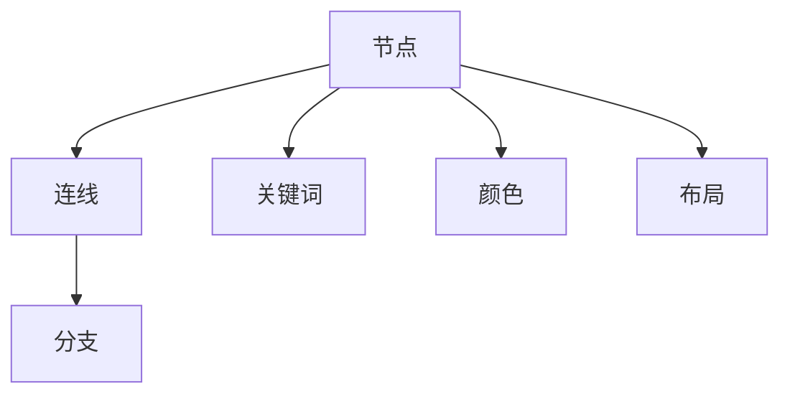
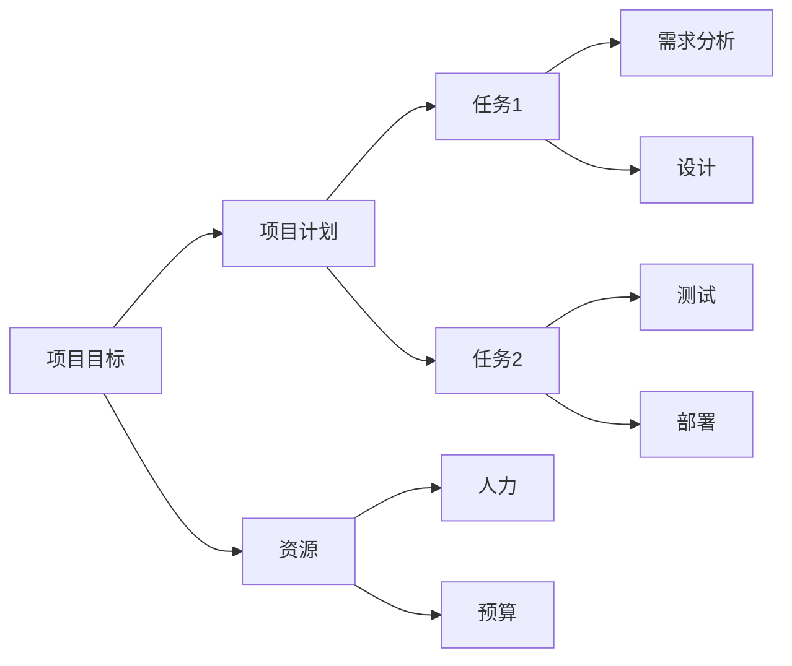

                 

# 思维导图：可视化知识组织工具

> 关键词：思维导图,知识管理,信息可视化,认知科学,知识整理,决策支持

## 1. 背景介绍

### 1.1 问题由来
在信息爆炸的时代，人们面临海量且复杂的信息，如何高效整理、理解和利用这些信息成为现代社会的挑战。随着计算机技术和认知科学的发展，思维导图作为一种直观、有效的信息组织和可视化工具，逐渐成为管理和应用知识的重要方法。本文旨在系统介绍思维导图的基本概念、原理和应用，以帮助读者高效整理、理解和应用知识。

### 1.2 问题核心关键点
思维导图是一种利用图形化方式，将复杂信息结构化、可视化的工具。它通过节点和连线，展示信息间的层次、关系和逻辑。核心关键点包括：

- 知识管理：通过思维导图组织、存储、检索知识。
- 信息可视化：将信息以图形化方式展现，易于理解和记忆。
- 认知科学：利用图形结构提升信息处理和决策支持。
- 知识整理：通过思维导图对信息进行分类、整合，提高信息利用率。
- 决策支持：通过可视化展示，辅助决策过程，减少信息噪音。

这些关键点共同构成了思维导图的核心价值，使其在知识管理、教育培训、项目管理、创意设计等领域得到广泛应用。

### 1.3 问题研究意义
思维导图作为一种高效的信息管理和认知工具，能够帮助人们快速理解和整理复杂信息，提升决策支持能力。在信息时代，其应用意义主要体现在：

1. **提升知识管理效率**：通过图形化组织知识，使知识更易于检索、应用和分享。
2. **强化信息理解**：利用可视化展示，使信息更直观、易记，提升学习效果。
3. **辅助决策过程**：通过结构化的信息展示，辅助决策者快速把握信息要点，减少决策失误。
4. **促进团队协作**：作为沟通工具，思维导图有助于团队成员共享信息，协同工作。
5. **提升创新能力**：通过结构化思考和视觉化表达，激发创新灵感，促进创造性解决问题。

思维导图作为一种实用的信息管理工具，正逐渐成为知识工作者和创新团队的必备技能。本文将详细介绍思维导图的核心概念、原理和应用，以期为读者提供全面的指导。

## 2. 核心概念与联系

### 2.1 核心概念概述

思维导图主要由以下几个核心概念组成：

- **节点(Node)**：表示信息的基本单元，可以是概念、事实、数据等。
- **连线(Line)**：连接节点，表示节点间的关系和层次。
- **分支(Branch)**：从节点延伸出的线，用于组织和扩展信息。
- **关键词(Keywords)**：节点内的关键词，用于精炼信息表达。
- **颜色(Color)**：用于区分节点类型、重要性等。
- **布局(Layout)**：节点和连线的布局方式，影响思维导图的美观和易读性。

这些概念通过图形化的方式，将复杂信息结构化、可视化，使知识更易于管理和应用。

### 2.2 核心概念原理和架构的 Mermaid 流程图



这个流程图展示了思维导图的基本构成元素及其相互关系。节点代表信息的基本单元，通过连线形成结构，分支用于扩展信息，关键词用于精炼表达，颜色和布局则用于增加视觉辨识度和美感。

## 3. 核心算法原理 & 具体操作步骤

### 3.1 算法原理概述

思维导图的核心算法原理基于认知科学的“心智图式”理论，通过图形化方式模拟人脑对信息的处理方式。具体而言，思维导图通过以下几个步骤实现信息可视化：

1. **层次化组织**：将信息按照层级结构组织，形成节点间的层次关系。
2. **关系表达**：通过连线表示节点间的关系，使信息更易于理解。
3. **可视化展示**：通过颜色、关键词等元素，增强信息的可读性和美观性。
4. **多维度整合**：结合文字、图像、颜色等多种信息维度，全面展示信息内容。

### 3.2 算法步骤详解

思维导图的制作过程可以分为以下几个步骤：

**Step 1: 创建中心节点**
- 定义思维导图的主题或核心概念，作为中心节点。

**Step 2: 添加子节点**
- 根据中心节点的层次，添加一级、二级、三级等子节点，表示与中心节点的关系。
- 每个节点可以是具体概念、事实、数据等，根据需要进行详细描述。

**Step 3: 连接节点**
- 使用连线表示节点之间的关系，体现信息的层次和逻辑。
- 可以根据需要添加双向、单向或多向连线。

**Step 4: 添加关键词和注释**
- 在每个节点中添加关键词，精炼表达信息。
- 使用颜色、字体大小等元素，区分节点类型、重要性等。

**Step 5: 调整布局**
- 根据节点的数量和层次，调整思维导图布局，使其美观、易读。
- 可以使用软件的布局工具，自动调整节点和连线的位置。

### 3.3 算法优缺点

思维导图作为一种信息管理工具，具有以下优点：

- **直观易读**：通过图形化方式展示信息，易于理解和记忆。
- **结构化表达**：层次化组织信息，使信息更易于检索和应用。
- **灵活性强**：根据需求自由添加、修改节点和连线，灵活性高。
- **协作便捷**：多人可以共同编辑思维导图，协作完成任务。

同时，思维导图也存在一些缺点：

- **制作复杂度**：特别是对于复杂信息，制作思维导图需要一定时间和精力。
- **美观度依赖于个人**：不同人制作的思维导图在美观度和整洁性上可能存在差异。
- **适用于特定信息**：对于抽象、复杂的信息，思维导图可能难以全面展示。

### 3.4 算法应用领域

思维导图广泛应用于各个领域，包括但不限于：

- **知识管理**：整理、存储和管理知识，提升知识检索和应用效率。
- **教育培训**：辅助教学和学习，帮助学生理解和记忆知识。
- **项目管理**：规划和管理项目，展示任务之间的关系和层次。
- **创意设计**：激发创新灵感，辅助设计过程。
- **会议记录**：记录和整理会议内容，方便回顾和后续跟进。
- **个人规划**：制定和调整个人目标和计划，提高自我管理能力。

思维导图作为一种灵活、高效的信息管理工具，正逐渐成为各行各业的通用技能。

## 4. 数学模型和公式 & 详细讲解 & 举例说明

### 4.1 数学模型构建

思维导图的核心数学模型主要包括以下几个方面：

- **节点层次模型**：将信息按照层级结构组织，形成节点间的层次关系。
- **关系模型**：通过连线表示节点间的关系，体现信息的层次和逻辑。
- **可视模型**：利用颜色、关键词等元素，增强信息的可读性和美观性。

### 4.2 公式推导过程

设思维导图包含 $n$ 个节点，第 $i$ 个节点包含 $k_i$ 个关键词，与 $m_i$ 个节点相连，颜色编码为 $c_i$，层次为 $l_i$。则思维导图的数学模型可以表示为：

$$
\begin{aligned}
\mathcal{M} &= \{ (i,j) | (i,j) \text{ 是节点间的连线} \} \\
\mathcal{N} &= \{ (i,k_i) | i \in [1,n] \} \\
\mathcal{C} &= \{ (i,c_i) | i \in [1,n] \} \\
\mathcal{L} &= \{ (i,l_i) | i \in [1,n] \}
\end{aligned}
$$

其中 $\mathcal{M}$ 表示节点间的关系集合，$\mathcal{N}$ 表示节点内的关键词集合，$\mathcal{C}$ 表示节点的颜色编码集合，$\mathcal{L}$ 表示节点的层次集合。

### 4.3 案例分析与讲解

以一个简单的项目管理思维导图为例：



- **层次化组织**：项目目标为顶层节点，项目计划、任务、资源等依次为下一层节点，体现信息的层次结构。
- **关系表达**：任务1和任务2分别从项目计划节点延伸出来，表示任务与计划的关系；需求分析、设计和测试分别从任务1节点延伸出来，表示任务的细分步骤。
- **可视化展示**：使用不同的颜色和层次，区分节点的类型和重要性，使信息更易于理解。

这个思维导图清晰展示了项目管理的层次结构和任务关系，帮助决策者快速把握项目关键要素。

## 5. 项目实践：代码实例和详细解释说明

### 5.1 开发环境搭建

思维导图的制作可以通过多种软件实现，常见的有MindManager、XMind、MindNode等。这里以XMind为例，介绍思维导图的制作流程。

**Step 1: 安装XMind**
- 从官网下载XMind安装程序，按照提示进行安装。

**Step 2: 创建思维导图**
- 启动XMind，点击“新建”，输入思维导图的主题或核心概念，创建中心节点。
- 使用“添加”按钮，在中心节点下添加一级节点，表示子节点。

**Step 3: 连接节点**
- 使用“连线”工具，在节点间添加连线，表示信息之间的关系。
- 根据需要，选择单向、双向或多向连线。

**Step 4: 添加关键词和注释**
- 在每个节点中添加关键词，精炼表达信息。
- 使用颜色、字体大小等元素，区分节点类型、重要性等。

**Step 5: 调整布局**
- 使用软件的布局工具，自动调整节点和连线的位置。
- 根据需求，调整布局方式，如树状图、圆图、直线图等。

### 5.2 源代码详细实现

虽然思维导图是一种图形化工具，但其制作过程主要依赖于软件的拖拽和布局工具，并不涉及复杂的编程任务。但为了更深入理解思维导图的内在原理，我们可以使用Python编写一个简单的示例代码，用于生成并展示思维导图。

```python
import mindmog import graphical_model as gm

# 创建思维导图
model = gm.GraphicalModel()
model.add_node("项目目标", color='red')
model.add_node("项目计划", color='blue')
model.add_node("任务1", color='green')
model.add_node("任务2", color='green')
model.add_edge("项目目标", "项目计划")
model.add_edge("项目计划", "任务1")
model.add_edge("项目计划", "任务2")
model.add_edge("任务1", "需求分析")
model.add_edge("任务1", "设计")
model.add_edge("任务2", "测试")
model.add_edge("任务2", "部署")
model.add_node("资源", color='purple')
model.add_edge("项目目标", "资源")
model.add_node("人力", color='gray')
model.add_edge("资源", "人力")
model.add_node("预算", color='gray')
model.add_edge("资源", "预算")

# 显示思维导图
model.show()
```

这段代码使用XMind的Python接口，创建了一个简单的项目管理思维导图，并通过`show()`方法展示出来。

### 5.3 代码解读与分析

这段代码展示了如何使用XMind的Python接口创建和管理思维导图：

- **创建节点**：使用`add_node`方法创建节点，并设置节点的颜色和层次。
- **连接节点**：使用`add_edge`方法创建节点间的连线，表示信息的关系。
- **调整布局**：使用`show()`方法展示思维导图，XMind会自动调整节点和连线的位置，确保美观易读。

XMind的Python接口提供了丰富的功能，可以轻松创建和编辑思维导图，非常适合编程爱好者和团队协作使用。

### 5.4 运行结果展示

运行上述代码后，XMind会生成一个项目管理思维导图示例，展示项目目标、项目计划、任务、资源等关键信息，方便决策者快速把握项目要点。


## 6. 实际应用场景

### 6.1 知识管理

在知识管理领域，思维导图可以帮助整理和存储知识，提升知识检索和应用效率。

**案例**：一家科技公司需要整理和存储公司的技术文档和项目资料。使用思维导图，可以将技术文档按照模块、功能、架构等层次结构组织，便于快速检索和应用。

### 6.2 教育培训

在教育培训领域，思维导图可以帮助学生理解知识点，辅助教学和学习。

**案例**：一名教师需要向学生讲解计算机科学中的“数据结构”概念。使用思维导图，可以将数据结构的各种算法和操作可视化展示，帮助学生更好地理解和记忆。

### 6.3 项目管理

在项目管理领域，思维导图可以帮助规划和管理项目，展示任务之间的关系和层次。

**案例**：一个软件开发项目需要制定项目计划和任务安排。使用思维导图，可以将项目目标、任务、资源等要素结构化展示，便于团队成员协作和管理。

### 6.4 创意设计

在创意设计领域，思维导图可以帮助激发创新灵感，辅助设计过程。

**案例**：一名设计师需要设计一款新产品。使用思维导图，可以将产品的功能、特征、市场定位等要素结构化展示，激发创新灵感，辅助设计过程。

### 6.5 会议记录

在会议记录领域，思维导图可以帮助记录和整理会议内容，方便回顾和后续跟进。

**案例**：一个项目管理团队召开每周例会。使用思维导图，可以记录会议的主要议题、决策结果、后续行动等，方便团队成员回顾和跟进。

### 6.6 个人规划

在个人规划领域，思维导图可以帮助制定和调整个人目标和计划，提高自我管理能力。

**案例**：一名学生需要制定学期计划和学习目标。使用思维导图，可以将学期目标、课程安排、学习计划等要素结构化展示，提升自我管理能力。

## 7. 工具和资源推荐

### 7.1 学习资源推荐

为了帮助读者全面掌握思维导图的基本概念和应用方法，这里推荐一些优质的学习资源：

1. **《思维导图手册》**：详细介绍了思维导图的原理、应用和制作方法，是初学者入门的好书。
2. **Coursera《思维导图训练营》**：由专家教授开设的在线课程，系统讲解思维导图的应用和技巧。
3. **YouTube《思维导图应用技巧》**：通过视频教程，展示思维导图的实际应用案例，帮助读者提升制作水平。
4. **MindMeister官方文档**：提供详细的思维导图制作教程和工具使用指南。
5. **Xmind官方网站**：提供丰富的思维导图模板和教程，适合不同层次的读者。

通过这些资源的学习和实践，相信读者能够熟练掌握思维导图的基本技能，并应用于实际场景中。

### 7.2 开发工具推荐

思维导图的制作可以通过多种软件实现，以下是几款常用的思维导图制作工具：

1. **MindManager**：功能强大，适合企业级使用，支持多种文件格式。
2. **XMind**：灵活易用，适合个人和团队使用，支持Python接口。
3. **MindMeister**：云端思维导图工具，支持实时协作和云同步。
4. **MindNode**：macOS平台上的思维导图工具，界面简洁，易于使用。
5. **Lucidchart**：支持多种图表类型，适合复杂信息的管理和展示。

这些工具各有特色，可以根据个人和团队的需求选择合适的软件进行使用。

### 7.3 相关论文推荐

思维导图作为一种高效的信息管理工具，在学术界也得到了广泛的研究。以下是几篇奠基性的相关论文，推荐阅读：

1. **《思维导图在知识管理中的应用》**：探讨了思维导图在知识整理、存储和应用中的作用，提出了具体的实现方法和工具。
2. **《基于思维导图的教学设计》**：研究了思维导图在教育培训中的应用，探讨了其在提升学生学习效果中的作用。
3. **《思维导图的算法和应用》**：详细介绍了思维导图的数学模型和算法原理，提出了多种思维导图的优化方法。
4. **《思维导图在项目管理中的应用》**：探讨了思维导图在项目管理中的作用，提出了具体的应用场景和工具。
5. **《思维导图在创意设计中的应用》**：研究了思维导图在创意设计中的作用，探讨了其在激发创新灵感中的作用。

这些论文代表了大思维导图的研究方向，通过学习这些前沿成果，可以帮助读者更好地理解思维导图的原理和应用，提升实践能力。

## 8. 总结：未来发展趋势与挑战

### 8.1 研究成果总结

思维导图作为一种高效的信息管理工具，已经广泛应用于各个领域，并在实践中不断发展和优化。其主要研究成果包括：

- **知识管理**：思维导图帮助整理、存储和管理知识，提升知识检索和应用效率。
- **教育培训**：思维导图帮助学生理解知识点，辅助教学和学习。
- **项目管理**：思维导图帮助规划和管理项目，展示任务之间的关系和层次。
- **创意设计**：思维导图帮助激发创新灵感，辅助设计过程。
- **会议记录**：思维导图帮助记录和整理会议内容，方便回顾和后续跟进。
- **个人规划**：思维导图帮助制定和调整个人目标和计划，提高自我管理能力。

### 8.2 未来发展趋势

思维导图作为一种高效的信息管理工具，未来将呈现以下几个发展趋势：

1. **智能化扩展**：通过引入AI技术，思维导图将具备更加智能的节点关联和推荐功能，提升信息利用效率。
2. **跨平台协作**：思维导图将支持跨平台协作，方便团队成员实时编辑和共享思维导图。
3. **多模态整合**：思维导图将支持图片、视频、音频等多模态信息的整合，丰富信息展示方式。
4. **大数据分析**：思维导图将支持对大规模数据集的分析，提供更加深入的知识洞察和决策支持。
5. **可视化增强**：思维导图将支持更加复杂和动态的可视化展示，提升信息展示的灵活性和美观性。

### 8.3 面临的挑战

尽管思维导图在信息管理中取得了广泛应用，但其发展过程中也面临一些挑战：

1. **制作复杂度**：特别是对于复杂信息，制作思维导图需要一定时间和精力，难以自动化处理。
2. **美观度依赖于个人**：不同人制作的思维导图在美观度和整洁性上可能存在差异，难以统一标准。
3. **适用场景有限**：对于抽象、复杂的信息，思维导图可能难以全面展示，无法适应所有场景。
4. **协作便捷性有限**：多人协作时，思维导图可能难以实时同步和共享，影响协作效率。
5. **缺乏大数据支持**：思维导图在大数据分析中的应用较少，无法充分利用大数据优势。

### 8.4 研究展望

未来的研究方向可以从以下几个方面进行探索：

1. **自动化制作**：研究自动化的思维导图制作工具，通过人工智能技术，降低制作复杂度，提高制作效率。
2. **多模态融合**：研究思维导图与多模态数据（如图像、视频、音频）的融合方法，提升信息展示的全面性和多样性。
3. **跨平台协作**：研究跨平台的思维导图协作工具，支持实时编辑和共享，提升协作效率。
4. **智能化推荐**：研究基于AI的思维导图推荐算法，提升节点关联和信息推荐的效果。
5. **大数据应用**：研究思维导图在大数据分析中的应用，提供更加深入的知识洞察和决策支持。

这些研究方向将推动思维导图技术进一步发展和优化，使其在更多场景中发挥更大的作用。

## 9. 附录：常见问题与解答

**Q1: 思维导图的核心优点是什么？**

A: 思维导图的核心优点包括直观易读、结构化表达、灵活性强、协作便捷等。通过图形化方式展示信息，易于理解和记忆，层次化组织信息，使信息更易于检索和应用，支持多人协作编辑，灵活性高。

**Q2: 如何提高思维导图的制作效率？**

A: 提高思维导图的制作效率可以从以下几个方面入手：
- 使用软件自带的模板和工具，快速创建思维导图。
- 利用AI技术，自动生成思维导图的部分内容。
- 多人协作制作，共同编辑思维导图，减少单独制作时间。

**Q3: 思维导图在跨领域应用中需要注意什么？**

A: 在跨领域应用中，需要注意以下几点：
- 选择合适的工具和模板，满足不同领域的需求。
- 保持思维导图的简洁性和可读性，避免信息过载。
- 与领域专家合作，确保思维导图的准确性和实用性。

**Q4: 思维导图在未来有哪些应用前景？**

A: 思维导图在未来有以下应用前景：
- 智能化扩展：通过引入AI技术，思维导图将具备更加智能的节点关联和推荐功能，提升信息利用效率。
- 跨平台协作：思维导图将支持跨平台协作，方便团队成员实时编辑和共享思维导图。
- 多模态整合：思维导图将支持图片、视频、音频等多模态信息的整合，丰富信息展示方式。
- 大数据分析：思维导图将支持对大规模数据集的分析，提供更加深入的知识洞察和决策支持。

这些应用前景将进一步提升思维导图在各个领域的应用价值，使其成为不可或缺的信息管理工具。

---

作者：禅与计算机程序设计艺术 / Zen and the Art of Computer Programming

