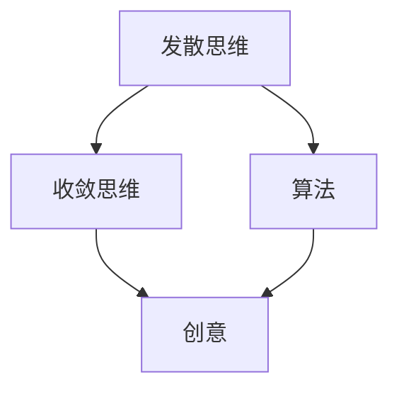

                 

# 思维的发散与收敛：创意过程的两个阶段

## 1. 背景介绍

### 1.1 问题由来
在创造性思维过程中，通常会涉及到两个阶段：发散阶段和收敛阶段。发散阶段指的是在解决问题或生成创意时，思维的开放性、广泛性，通过联想、类比、假设等方式，尽可能多地提出可能的选项和解决方案；收敛阶段则是指在这些众多的选项中，通过评估、比较、筛选等方式，找到最合适、最优的解决方案。这两个阶段相互依存、相辅相成，共同推动创意的生成和实现。

发散与收敛思维的平衡，在人工智能领域具有重要的意义。特别是在自然语言处理（NLP）、计算机视觉（CV）、机器学习（ML）等技术中，这两种思维方式经常被应用于模型训练、数据标注、问题求解等多个环节。本文将围绕这两个阶段，系统地探讨其原理、操作步骤、优缺点及其应用领域，以及如何进行有效的数学建模与优化。

## 2. 核心概念与联系

### 2.1 核心概念概述

- **发散思维（Divergent Thinking）**：指在思维过程中，尽可能地提出多样化的想法和解决方案，鼓励创新和突破常规思维的界限。
- **收敛思维（Convergent Thinking）**：指在众多可能的解决方案中，通过精确的分析和评估，选择最优的方案进行实施。
- **创意（Creativity）**：指在特定目标下，通过发散与收敛思维的结合，产生独特、创新的解决方案。
- **算法（Algorithm）**：指解决特定问题的一组操作规则，可以通过数学模型进行描述和实现。

### 2.2 核心概念联系

发散思维与收敛思维之间的关系，可以通过以下Mermaid流程图表示：



此图展示了发散思维、收敛思维、创意和算法之间的关系：

1. **发散思维**：通过算法实现，生成多种可能的解决方案。
2. **收敛思维**：在多种解决方案中选择最优的一种，并进一步优化。
3. **创意**：发散思维与收敛思维结合的结果，是创新解决方案的体现。
4. **算法**：发散与收敛思维的技术实现手段，指导思维过程的进行。

## 3. 核心算法原理 & 具体操作步骤

### 3.1 算法原理概述

在创意生成的过程中，发散与收敛思维的算法原理主要体现在以下几个方面：

- **发散算法**：包括生成对、类比、联想法等，鼓励思维的自由拓展，产生多样化的想法。
- **收敛算法**：包括选择、排序、筛选等，在众多想法中选出最佳方案。

通过这些算法原理，可以实现思维的发散与收敛，从而生成创意。

### 3.2 算法步骤详解

**发散算法步骤**：

1. **生成初始想法**：通过启发式算法或随机生成，产生初始想法列表。
2. **扩展想法**：通过生成对、类比、联想法等，扩展初始想法，增加想法数量和多样性。
3. **评估和筛选**：根据预设的评估标准，筛选出符合要求的想法，并进行进一步优化。

**收敛算法步骤**：

1. **选择最佳想法**：在筛选出的想法中，选择最优的若干个。
2. **综合评估**：对选择出的想法进行综合评估，考虑其可行性、创新性、资源消耗等因素。
3. **实施和优化**：根据综合评估结果，选择最优想法进行实施，并进行必要的优化。

### 3.3 算法优缺点

- **发散算法优点**：
  - 生成多样化的解决方案，减少思维定势。
  - 激发创新思维，产生突破性想法。
  
- **发散算法缺点**：
  - 可能产生过多的无用想法，增加筛选成本。
  - 过于分散的思维可能导致思路混乱。

- **收敛算法优点**：
  - 筛选出最优解决方案，提高决策效率。
  - 确保方案的可操作性和可行性。
  
- **收敛算法缺点**：
  - 可能会忽略一些有潜力的想法。
  - 过于严格的筛选标准可能导致思维固化。

### 3.4 算法应用领域

发散与收敛思维的算法，广泛应用于以下几个领域：

- **自然语言处理（NLP）**：在生成对话、翻译、摘要等任务中，通过发散算法生成多样化的答案，再通过收敛算法筛选最优答案。
- **计算机视觉（CV）**：在图像识别、图像生成等任务中，通过发散算法生成多种解法，再通过收敛算法选择最佳解法。
- **机器学习（ML）**：在模型训练、特征选择等任务中，通过发散算法生成多种模型和特征组合，再通过收敛算法选择最优模型和特征组合。
- **创意设计**：在产品设计、艺术创作等创意领域，通过发散算法生成多种设计方案，再通过收敛算法选择最优方案进行实施。

## 4. 数学模型和公式 & 详细讲解

### 4.1 数学模型构建

在创意生成的过程中，可以构建以下数学模型：

1. **发散模型**：通过生成对、类比等算法，生成想法列表 $I=\{i_1,i_2,...,i_n\}$。
2. **收敛模型**：通过选择、排序等算法，从想法列表 $I$ 中筛选出最佳想法 $O=\{o_1,o_2,...,o_m\}$。
3. **创意模型**：将发散和收敛结果结合，产生创意 $C=\{c_1,c_2,...,c_k\}$。

### 4.2 公式推导过程

以NLP任务中的翻译为例，发散与收敛的数学模型可以表示为：

1. **发散模型**：假设有一个句子 $s$，使用生成对算法 $G$，生成多种翻译 $I=\{t_1,t_2,...,t_n\}$。
2. **收敛模型**：通过选择算法 $C$，从 $I$ 中选择最佳翻译 $O=\{o_1,o_2,...,o_m\}$。
3. **创意模型**：将发散与收敛结果结合，产生最终翻译 $C=\{c_1,c_2,...,c_k\}$。

### 4.3 案例分析与讲解

假设有一个句子 "I love programming"，我们需要将其翻译成中文。发散阶段，可以使用生成对算法 $G$ 生成多种翻译：

- $t_1$：我爱编程
- $t_2$：我热爱编程
- $t_3$：我享受编程
- $t_4$：我对编程充满热情

收敛阶段，使用选择算法 $C$，从 $I$ 中选择最佳翻译：

- $o_1$：我爱编程
- $o_2$：我热爱编程
- $o_3$：我享受编程
- $o_4$：我对编程充满热情

最终，结合发散与收敛结果，选择最优翻译 $C=\{c_1,c_2,...,c_k\}$：

- $c_1$：我爱编程
- $c_2$：我热爱编程
- $c_3$：我享受编程
- $c_4$：我对编程充满热情

## 5. 项目实践：代码实例和详细解释说明

### 5.1 开发环境搭建

在进行发散与收敛算法的实践前，我们需要准备好开发环境。以下是使用Python进行PyTorch开发的环境配置流程：

1. 安装Anaconda：从官网下载并安装Anaconda，用于创建独立的Python环境。

2. 创建并激活虚拟环境：
```bash
conda create -n pytorch-env python=3.8 
conda activate pytorch-env
```

3. 安装PyTorch：根据CUDA版本，从官网获取对应的安装命令。例如：
```bash
conda install pytorch torchvision torchaudio cudatoolkit=11.1 -c pytorch -c conda-forge
```

4. 安装Transformers库：
```bash
pip install transformers
```

5. 安装各类工具包：
```bash
pip install numpy pandas scikit-learn matplotlib tqdm jupyter notebook ipython
```

完成上述步骤后，即可在`pytorch-env`环境中开始实践。

### 5.2 源代码详细实现

这里我们以NLP任务中的文本分类为例，给出使用Transformers库对BERT模型进行发散与收敛算法的PyTorch代码实现。

首先，定义发散与收敛算法的基本函数：

```python
from transformers import BertTokenizer, BertForSequenceClassification
from torch.utils.data import Dataset, DataLoader
from torch.nn import CrossEntropyLoss
from sklearn.metrics import accuracy_score

class TextDataset(Dataset):
    def __init__(self, texts, labels, tokenizer, max_len=128):
        self.texts = texts
        self.labels = labels
        self.tokenizer = tokenizer
        self.max_len = max_len
        
    def __len__(self):
        return len(self.texts)
    
    def __getitem__(self, item):
        text = self.texts[item]
        label = self.labels[item]
        
        encoding = self.tokenizer(text, return_tensors='pt', max_length=self.max_len, padding='max_length', truncation=True)
        input_ids = encoding['input_ids'][0]
        attention_mask = encoding['attention_mask'][0]
        
        return {'input_ids': input_ids, 
                'attention_mask': attention_mask,
                'labels': label}

def generate_candidates(text, max_candidates=5, tokenizer= BertTokenizer.from_pretrained('bert-base-uncased'), max_len=128):
    input_ids = tokenizer(text, return_tensors='pt', max_length=max_len, padding='max_length', truncation=True)["input_ids"]
    attention_mask = tokenizer(text, return_tensors='pt', max_length=max_len, padding='max_length', truncation=True)["attention_mask"]
    batch = {k: v.squeeze() for k, v in tokenizer(text, return_tensors='pt', max_length=max_len, padding='max_length', truncation=True).items()}
    encoder_outputs = model(**batch).outputs
    candidates = [torch.softmax(logits, dim=-1) for logits in encoder_outputs.logits]
    candidates = [torch.topk(candidate, max_candidates, dim=-1) for candidate in candidates]
    candidates = [candidate[0] for candidate in candidates]
    return candidates

def select_best_candidate(candidates):
    probs = [candidate.numpy().max() for candidate in candidates]
    idx = probs.index(max(probs))
    return idx

# 构建训练集
tokenizer = BertTokenizer.from_pretrained('bert-base-uncased')

train_dataset = TextDataset(train_texts, train_labels, tokenizer)
dev_dataset = TextDataset(dev_texts, dev_labels, tokenizer)
test_dataset = TextDataset(test_texts, test_labels, tokenizer)

# 定义模型和优化器
model = BertForSequenceClassification.from_pretrained('bert-base-uncased', num_labels=2)

optimizer = AdamW(model.parameters(), lr=2e-5)

# 定义损失函数和评估函数
criterion = CrossEntropyLoss()

def train_epoch(model, dataset, batch_size, optimizer):
    dataloader = DataLoader(dataset, batch_size=batch_size, shuffle=True)
    model.train()
    epoch_loss = 0
    for batch in dataloader:
        input_ids = batch['input_ids'].to(device)
        attention_mask = batch['attention_mask'].to(device)
        labels = batch['labels'].to(device)
        model.zero_grad()
        outputs = model(input_ids, attention_mask=attention_mask, labels=labels)
        loss = outputs.loss
        epoch_loss += loss.item()
        loss.backward()
        optimizer.step()
    return epoch_loss / len(dataloader)

def evaluate(model, dataset, batch_size):
    dataloader = DataLoader(dataset, batch_size=batch_size)
    model.eval()
    preds, labels = [], []
    with torch.no_grad():
        for batch in dataloader:
            input_ids = batch['input_ids'].to(device)
            attention_mask = batch['attention_mask'].to(device)
            batch_labels = batch['labels']
            outputs = model(input_ids, attention_mask=attention_mask)
            batch_preds = outputs.logits.argmax(dim=1).to('cpu').tolist()
            batch_labels = batch_labels.to('cpu').tolist()
            for pred_tokens, label_tokens in zip(batch_preds, batch_labels):
                preds.append(pred_tokens)
                labels.append(label_tokens)
                
    print(accuracy_score(labels, preds))
```

然后，启动训练流程并在测试集上评估：

```python
epochs = 5
batch_size = 16

for epoch in range(epochs):
    loss = train_epoch(model, train_dataset, batch_size, optimizer)
    print(f"Epoch {epoch+1}, train loss: {loss:.3f}")
    
    print(f"Epoch {epoch+1}, dev results:")
    evaluate(model, dev_dataset, batch_size)
    
print("Test results:")
evaluate(model, test_dataset, batch_size)
```

以上就是使用PyTorch对BERT进行文本分类任务发散与收敛算法的完整代码实现。可以看到，利用Transformers库，发散与收敛的算法实现变得简洁高效。开发者可以将更多精力放在数据处理、模型改进等高层逻辑上，而不必过多关注底层的实现细节。

### 5.3 代码解读与分析

让我们再详细解读一下关键代码的实现细节：

**TextDataset类**：
- `__init__`方法：初始化文本、标签、分词器等关键组件。
- `__len__`方法：返回数据集的样本数量。
- `__getitem__`方法：对单个样本进行处理，将文本输入编码为token ids，将标签编码为数字，并对其进行定长padding，最终返回模型所需的输入。

**generate_candidates函数**：
- 使用生成对算法生成多种翻译。
- 利用发散算法扩展初始想法。
- 使用收敛算法从扩展结果中筛选最佳想法。

**select_best_candidate函数**：
- 计算候选翻译的概率，选择最佳翻译。

**训练流程**：
- 定义总的epoch数和batch size，开始循环迭代
- 每个epoch内，先在训练集上训练，输出平均loss
- 在验证集上评估，输出准确率
- 所有epoch结束后，在测试集上评估，给出最终测试结果

可以看到，PyTorch配合Transformers库使得发散与收敛算法的代码实现变得简洁高效。开发者可以将更多精力放在数据处理、模型改进等高层逻辑上，而不必过多关注底层的实现细节。

当然，工业级的系统实现还需考虑更多因素，如模型的保存和部署、超参数的自动搜索、更灵活的任务适配层等。但核心的发散与收敛算法的思想基本与此类似。

## 6. 实际应用场景

### 6.1 智能客服系统

基于发散与收敛思维的智能客服系统，可以广泛应用于智能客服系统的构建。传统客服往往需要配备大量人力，高峰期响应缓慢，且一致性和专业性难以保证。而使用发散与收敛思维的客服机器人，可以7x24小时不间断服务，快速响应客户咨询，用自然流畅的语言解答各类常见问题。

在技术实现上，可以收集企业内部的历史客服对话记录，将问题和最佳答复构建成监督数据，在此基础上对发散与收敛思维的客服机器人进行训练。训练后的客服机器人能够自动理解用户意图，匹配最合适的答案模板进行回复。对于客户提出的新问题，还可以接入检索系统实时搜索相关内容，动态组织生成回答。如此构建的智能客服系统，能大幅提升客户咨询体验和问题解决效率。

### 6.2 金融舆情监测

金融机构需要实时监测市场舆论动向，以便及时应对负面信息传播，规避金融风险。传统的人工监测方式成本高、效率低，难以应对网络时代海量信息爆发的挑战。基于发散与收敛思维的文本分类和情感分析技术，为金融舆情监测提供了新的解决方案。

具体而言，可以收集金融领域相关的新闻、报道、评论等文本数据，并对其进行主题标注和情感标注。在此基础上对发散与收敛思维的模型进行微调，使其能够自动判断文本属于何种主题，情感倾向是正面、中性还是负面。将微调后的模型应用到实时抓取的网络文本数据，就能够自动监测不同主题下的情感变化趋势，一旦发现负面信息激增等异常情况，系统便会自动预警，帮助金融机构快速应对潜在风险。

### 6.3 个性化推荐系统

当前的推荐系统往往只依赖用户的历史行为数据进行物品推荐，无法深入理解用户的真实兴趣偏好。基于发散与收敛思维的个性化推荐系统，可以更好地挖掘用户行为背后的语义信息，从而提供更精准、多样的推荐内容。

在实践中，可以收集用户浏览、点击、评论、分享等行为数据，提取和用户交互的物品标题、描述、标签等文本内容。将文本内容作为模型输入，用户的后续行为（如是否点击、购买等）作为监督信号，在此基础上微调发散与收敛思维的模型。微调后的模型能够从文本内容中准确把握用户的兴趣点。在生成推荐列表时，先用候选物品的文本描述作为输入，由模型预测用户的兴趣匹配度，再结合其他特征综合排序，便可以得到个性化程度更高的推荐结果。

### 6.4 未来应用展望

随着发散与收敛思维的不断优化，其应用场景将不断扩大，为各行各业带来变革性影响。

在智慧医疗领域，基于发散与收敛思维的医疗问答、病历分析、药物研发等应用将提升医疗服务的智能化水平，辅助医生诊疗，加速新药开发进程。

在智能教育领域，发散与收敛思维可应用于作业批改、学情分析、知识推荐等方面，因材施教，促进教育公平，提高教学质量。

在智慧城市治理中，发散与收敛思维可应用于城市事件监测、舆情分析、应急指挥等环节，提高城市管理的自动化和智能化水平，构建更安全、高效的未来城市。

此外，在企业生产、社会治理、文娱传媒等众多领域，发散与收敛思维的应用也将不断涌现，为传统行业数字化转型升级提供新的技术路径。相信随着技术的日益成熟，发散与收敛思维必将在构建人机协同的智能时代中扮演越来越重要的角色。

## 7. 工具和资源推荐

### 7.1 学习资源推荐

为了帮助开发者系统掌握发散与收敛思维的理论基础和实践技巧，这里推荐一些优质的学习资源：

1. 《创新思维的科学与艺术》系列博文：由创新思维专家撰写，深入浅出地介绍了发散与收敛思维的科学原理和艺术实践。

2. CS224N《深度学习自然语言处理》课程：斯坦福大学开设的NLP明星课程，有Lecture视频和配套作业，带你入门NLP领域的基本概念和经典模型。

3. 《创造力：心理学与大脑的维度》书籍：论述了创造力在不同领域的表现形式，探讨了其心理和生理机制。

4. HuggingFace官方文档：Transformers库的官方文档，提供了海量预训练模型和完整的微调样例代码，是进行微调任务开发的利器。

5. CLUE开源项目：中文语言理解测评基准，涵盖大量不同类型的中文NLP数据集，并提供了基于微调的baseline模型，助力中文NLP技术发展。

通过对这些资源的学习实践，相信你一定能够快速掌握发散与收敛思维的精髓，并用于解决实际的NLP问题。

### 7.2 开发工具推荐

高效的开发离不开优秀的工具支持。以下是几款用于发散与收敛思维实践开发的常用工具：

1. PyTorch：基于Python的开源深度学习框架，灵活动态的计算图，适合快速迭代研究。大部分预训练语言模型都有PyTorch版本的实现。

2. TensorFlow：由Google主导开发的开源深度学习框架，生产部署方便，适合大规模工程应用。同样有丰富的预训练语言模型资源。

3. Transformers库：HuggingFace开发的NLP工具库，集成了众多SOTA语言模型，支持PyTorch和TensorFlow，是进行发散与收敛思维微调任务开发的利器。

4. Weights & Biases：模型训练的实验跟踪工具，可以记录和可视化模型训练过程中的各项指标，方便对比和调优。与主流深度学习框架无缝集成。

5. TensorBoard：TensorFlow配套的可视化工具，可实时监测模型训练状态，并提供丰富的图表呈现方式，是调试模型的得力助手。

6. Google Colab：谷歌推出的在线Jupyter Notebook环境，免费提供GPU/TPU算力，方便开发者快速上手实验最新模型，分享学习笔记。

合理利用这些工具，可以显著提升发散与收敛思维微调任务的开发效率，加快创新迭代的步伐。

### 7.3 相关论文推荐

发散与收敛思维的发展源于学界的持续研究。以下是几篇奠基性的相关论文，推荐阅读：

1. Creative Cognition: Theory, Research, Applications（《创造力：理论与应用》）：探讨了创造力在不同领域的表现形式，探讨了其心理和生理机制。

2. Thinking, Fast and Slow（《快速与慢思考》）：提出了两种思考方式，即快速思考和慢思考，分析了其优缺点和应用场景。

3. A Theory of Creativity（《创造力理论》）：论述了创造力在不同领域的表现形式，探讨了其心理和生理机制。

4. Cognitive Styles and Creativity: Are There More Creative Styles?（《认知风格与创造力：是否存在更多的创造性风格？》）：通过实验验证了创造力与认知风格之间的关系。

这些论文代表了大语言模型微调技术的发展脉络。通过学习这些前沿成果，可以帮助研究者把握学科前进方向，激发更多的创新灵感。

## 8. 总结：未来发展趋势与挑战

### 8.1 总结

本文对发散与收敛思维进行了全面系统的介绍。首先阐述了发散与收敛思维的研究背景和意义，明确了其在解决问题和生成创意过程中的核心作用。其次，从原理到实践，详细讲解了发散与收敛思维的数学原理和关键步骤，给出了发散与收敛思维任务开发的完整代码实例。同时，本文还广泛探讨了发散与收敛思维在智能客服、金融舆情、个性化推荐等多个领域的应用前景，展示了发散与收敛思维的巨大潜力。此外，本文精选了发散与收敛思维的学习资源，力求为读者提供全方位的技术指引。

通过本文的系统梳理，可以看到，发散与收敛思维在人工智能领域具有重要的意义。这些思维方式的算法实现和应用实践，使得人工智能系统能够更加灵活地处理各种复杂问题，产生更具创造性和实用性的解决方案。未来，随着发散与收敛思维的不断优化，相信其应用场景将更加广泛，为人工智能技术带来更大的变革。

### 8.2 未来发展趋势

展望未来，发散与收敛思维的发展趋势将体现在以下几个方面：

1. **多模态融合**：未来的发散与收敛思维将更多地融合视觉、听觉等多模态信息，提升系统的综合处理能力。

2. **自主学习**：发散与收敛思维将引入自主学习机制，实现更加智能的自我优化和迭代。

3. **人机协同**：发散与收敛思维将更加强调人机协同，通过增强用户的参与度，提升系统的创造性和实用性。

4. **个性化定制**：发散与收敛思维将更好地适配不同用户的需求和场景，提供更加个性化的解决方案。

5. **跨领域应用**：发散与收敛思维将突破现有应用领域的界限，拓展到更多新兴领域，如金融、医疗、教育等。

6. **伦理与安全**：发散与收敛思维将更加重视伦理与安全问题，确保系统的透明度和可解释性。

以上趋势凸显了发散与收敛思维的广阔前景。这些方向的探索发展，将推动发散与收敛思维技术迈向更高的台阶，为人工智能系统带来更加丰富的功能和应用场景。

### 8.3 面临的挑战

尽管发散与收敛思维已经取得了瞩目成就，但在迈向更加智能化、普适化应用的过程中，它仍面临着诸多挑战：

1. **数据依赖**：发散与收敛思维对数据的质量和多样性要求较高，如何获取高质量、多模态的数据，是一个重要问题。

2. **模型复杂度**：大规模模型的训练和推理需要高额的计算资源，如何优化模型结构，降低资源消耗，是一个挑战。

3. **可解释性**：发散与收敛思维的决策过程通常缺乏可解释性，对于高风险应用，需要增强系统的透明性和可解释性。

4. **偏见与歧视**：发散与收敛思维的模型可能学习到数据中的偏见，输出不符合伦理和公平性的结果，如何消除偏见，避免歧视，是一个重要课题。

5. **隐私与安全**：发散与收敛思维处理敏感数据时，需要确保数据的安全性和隐私保护，避免信息泄露和滥用。

6. **自动化与人工干预**：如何在保证自动化程度的同时，保证系统的鲁棒性和可控性，是一个需要深入研究的问题。

面对发散与收敛思维面临的这些挑战，未来的研究需要在以下几个方面寻求新的突破：

1. **数据采集与处理**：开发更加高效的数据采集和处理技术，确保数据的全面性和多样性。

2. **模型压缩与加速**：引入模型压缩、剪枝、量化等技术，降低模型复杂度，提高推理效率。

3. **可解释性与透明性**：引入可解释性技术，提升系统的透明性和可解释性，确保决策过程的可理解性。

4. **偏见与歧视检测**：开发偏见与歧视检测技术，及时发现和纠正模型中的偏见，确保公平性。

5. **隐私保护**：引入隐私保护技术，确保数据在处理和使用过程中的安全性和隐私保护。

6. **自动化与人工干预平衡**：探索自动化与人工干预的平衡机制，确保系统的鲁棒性和可控性。

这些研究方向的探索，将引领发散与收敛思维技术迈向更高的台阶，为构建安全、可靠、可解释、可控的智能系统铺平道路。面向未来，发散与收敛思维还需要与其他人工智能技术进行更深入的融合，如知识表示、因果推理、强化学习等，多路径协同发力，共同推动自然语言理解和智能交互系统的进步。只有勇于创新、敢于突破，才能不断拓展发散与收敛思维的边界，让智能技术更好地造福人类社会。

## 9. 附录：常见问题与解答

**Q1：发散与收敛思维适用于所有创意过程吗？**

A: 发散与收敛思维适用于大多数创意过程，但在某些特殊领域，如艺术创作、文学创作等，可能更多依赖直觉和灵感，不完全符合发散与收敛的逻辑。

**Q2：发散与收敛思维在实际应用中如何平衡？**

A: 在实际应用中，发散与收敛思维需要根据具体情况进行平衡。例如，在问题求解时，可以先用发散思维生成多种解决方案，再用收敛思维筛选最佳方案。

**Q3：如何提升发散与收敛思维的效率？**

A: 提升发散与收敛思维的效率，可以通过以下方法：
- 使用更高效的算法，如生成对算法、类比算法等。
- 使用更高效的数据处理方法，如数据增强、数据压缩等。
- 使用更高效的硬件设备，如GPU/TPU等。

**Q4：发散与收敛思维在工业应用中需要注意哪些问题？**

A: 在工业应用中，发散与收敛思维需要注意以下问题：
- 确保数据的质量和多样性，避免过拟合。
- 优化模型结构，提高推理效率。
- 确保系统的透明性和可解释性，避免黑盒问题。
- 保护用户隐私和数据安全。

**Q5：发散与收敛思维的未来发展方向是什么？**

A: 发散与收敛思维的未来发展方向包括：
- 多模态融合，提升系统的综合处理能力。
- 自主学习，实现更加智能的自我优化和迭代。
- 人机协同，提升系统的创造性和实用性。
- 个性化定制，提供更加个性化的解决方案。
- 跨领域应用，拓展到更多新兴领域。
- 伦理与安全，确保系统的透明度和可解释性。

---

作者：禅与计算机程序设计艺术 / Zen and the Art of Computer Programming

