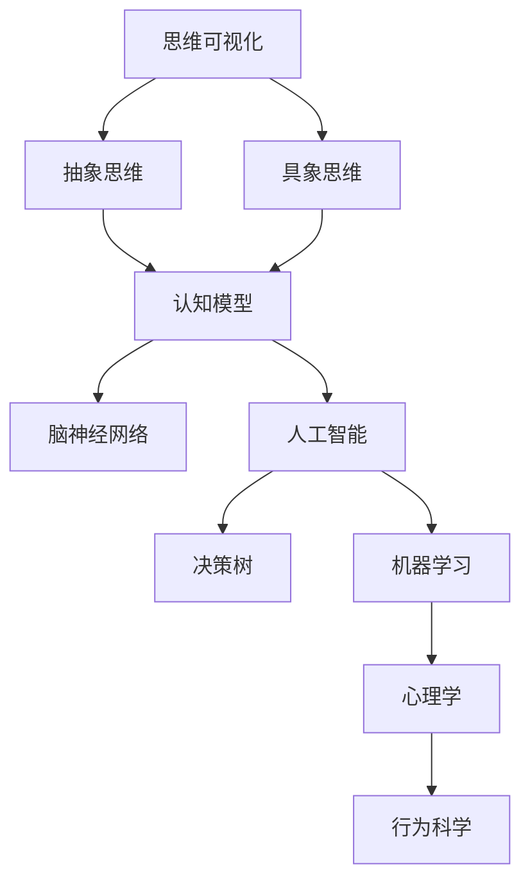

                 

# 思维的可视化：从抽象到具象的转化

> 关键词：思维可视化, 抽象思维, 具象思维, 认知模型, 脑神经网络, 人工智能, 决策树, 机器学习, 心理学, 行为科学

## 1. 背景介绍

### 1.1 问题由来

在当今信息爆炸的时代，人们每天都会接触到大量的数据和信息。从科学研究和数据分析到日常决策和问题解决，高效处理和理解信息的能力变得至关重要。然而，抽象思维在面对复杂问题时，往往显得力不从心。具象化的思维模式可以帮助我们更直观地理解问题，做出更好的决策。

### 1.2 问题核心关键点

如何通过可视化手段，将抽象思维转化为具象思维，使我们更高效地处理和理解复杂信息？这个问题涉及心理学、行为科学、人工智能、机器学习等多个领域。本文将围绕这一核心问题，全面探讨思维可视化的原理、方法和应用，提供深刻的见解和实用的解决方案。

### 1.3 问题研究意义

思维可视化能够帮助我们更直观、高效地理解和处理复杂问题，提高决策的准确性和速度。在科学研究、商业决策、个人发展等多个领域，这一方法的应用前景广阔。掌握思维可视化的原理和技巧，对于提升认知水平和问题解决能力具有重要意义。

## 2. 核心概念与联系

### 2.1 核心概念概述

- **思维可视化**：通过图形、颜色、符号等手段，将抽象思维转化为具象表达，使复杂问题更易于理解和处理。
- **抽象思维**：通过概念、逻辑和符号等手段，处理复杂问题的高级认知方式。
- **具象思维**：通过具体事物、图形和实例等手段，直观、具体地理解和处理问题的方式。
- **认知模型**：描述人类认知过程的数学和计算模型，包括知觉、记忆、注意、学习等基本认知过程。
- **脑神经网络**：神经元间的连接网络，负责处理和存储信息，是思维可视化的神经基础。
- **人工智能**：通过模拟人类智能行为，使计算机能够理解和执行复杂任务的智能系统。
- **决策树**：一种基于树形结构的算法，通过节点的分裂和决策来模拟人类的决策过程。
- **机器学习**：一种通过算法使计算机系统自动学习和改进的技术。
- **心理学**：研究人类思维、情感、行为等的科学。
- **行为科学**：研究人类行为模式的科学。

这些概念之间的联系可以通过以下Mermaid流程图来展示：



这个流程图展示了思维可视化的核心概念及其之间的关系：

1. 思维可视化将抽象思维转化为具象表达。
2. 具象思维和认知模型互相转化，共同构成了人类思维的底层机制。
3. 认知模型和脑神经网络是思维可视化的神经基础。
4. 人工智能和决策树、机器学习技术，为思维可视化提供了算法支持。
5. 心理学和行为科学，为理解人类思维和行为模式提供了理论基础。

这些概念共同构成了思维可视化的理论和实践框架，使其在多个领域得到了广泛应用。

## 3. 核心算法原理 & 具体操作步骤

### 3.1 算法原理概述

思维可视化的核心算法原理是通过图形、颜色、符号等手段，将抽象思维转化为具象表达。具体步骤如下：

1. **数据采集与处理**：收集需要处理的信息数据，进行预处理和清洗。
2. **特征提取与编码**：提取数据的特征，并通过编码转换为可视化的元素（如点、线、颜色等）。
3. **可视化表达**：使用图形、颜色、符号等手段，将编码后的数据转换为可视化的图形或图表。
4. **交互与反馈**：用户通过交互和反馈，进一步优化可视化表达，提升理解效果。
5. **分析与决策**：通过可视化的结果，进行数据分析和决策，指导进一步的行动。

### 3.2 算法步骤详解

**Step 1: 数据采集与处理**

1. **数据来源**：根据问题需求，从各种数据源（如数据库、传感器、文本等）收集数据。
2. **数据清洗**：去除噪音、缺失值和异常值，确保数据质量和一致性。
3. **数据编码**：将数据转换为标准化的格式，如数字、文本、图像等。

**Step 2: 特征提取与编码**

1. **特征选择**：根据问题特点，选择最重要的特征进行可视化表达。
2. **特征编码**：将特征转换为可视化元素。例如，数值数据可以转换为圆形或条形图，文本数据可以转换为词云等。

**Step 3: 可视化表达**

1. **图形绘制**：使用图形工具（如Python的Matplotlib、D3.js等）绘制可视化图表。
2. **颜色和符号**：使用颜色、线条、图标等手段增强可视化效果。
3. **动态交互**：使用JavaScript等技术，实现交互式可视化，如点击事件、鼠标悬停等。

**Step 4: 交互与反馈**

1. **用户交互**：通过交互界面（如鼠标、键盘、触摸屏等），获取用户反馈。
2. **反馈优化**：根据用户反馈，调整和优化可视化表达。

**Step 5: 分析与决策**

1. **数据分析**：通过可视化结果进行数据分析，提取有用的信息。
2. **决策指导**：根据数据分析结果，指导进一步的决策和行动。

### 3.3 算法优缺点

思维可视化方法具有以下优点：

1. **直观易懂**：通过图形和颜色等手段，将复杂问题直观、具体地表达出来，便于理解。
2. **交互性强**：用户可以通过交互界面，进一步探索和优化可视化结果，提升理解效果。
3. **适用性广**：可用于科学研究、商业决策、个人发展等多个领域。

同时，这种方法也存在一些局限：

1. **数据依赖**：需要收集和处理大量的数据，才能进行有效的可视化。
2. **技术门槛**：需要一定的编程和图形绘制技术，对非专业人士有一定的门槛。
3. **信息过载**：在可视化复杂数据时，可能面临信息过载的问题，影响理解效果。

### 3.4 算法应用领域

思维可视化方法在多个领域得到了广泛应用，例如：

- **科学研究**：通过可视化手段，分析科学实验数据，发现规律和趋势。
- **商业决策**：可视化市场数据、财务报表等，辅助决策制定。
- **个人发展**：通过可视化自己的学习进度、健康状况等，指导个人成长。
- **健康医疗**：可视化健康数据，如心率、血压等，辅助医疗诊断和治疗。
- **环境保护**：可视化环境监测数据，如空气质量、水质等，指导环境保护行动。

## 4. 数学模型和公式 & 详细讲解 & 举例说明

### 4.1 数学模型构建

思维可视化的数学模型通常基于图形、颜色、符号等手段，将数据转换为可视化元素。以下是一些常用的数学模型：

1. **点图模型**：将数据点绘制在二维平面上，通过位置和颜色表示不同的数据属性。
2. **散点图模型**：通过散点的分布和密度，表示数据之间的关联性和趋势。
3. **柱状图模型**：通过柱子的高度和颜色，表示数据的变化趋势和比较关系。
4. **饼图模型**：通过扇形的比例，表示各部分数据占总体的比例关系。
5. **热力图模型**：通过颜色的变化，表示数据的热点分布。

### 4.2 公式推导过程

以散点图模型为例，推导其数学公式和推导过程：

1. **数据采集**：假设有一个二维数据集 $(x_i, y_i)$，其中 $x_i$ 和 $y_i$ 分别表示两个特征。
2. **特征编码**：将 $(x_i, y_i)$ 转换为散点 $(X_i, Y_i)$。
3. **图形绘制**：将散点 $(X_i, Y_i)$ 绘制在二维平面上，使用不同的颜色和标记表示不同的数据点。

公式推导过程如下：

$$
(X_i, Y_i) = (x_i, y_i)
$$

**Step 1: 数据采集**

1. 收集数据集 $\{(x_i, y_i)\}_{i=1}^N$，其中 $x_i, y_i \in \mathbb{R}$。

**Step 2: 特征编码**

1. 将数据转换为散点坐标 $(X_i, Y_i)$，其中 $X_i = x_i$，$Y_i = y_i$。

**Step 3: 图形绘制**

1. 在二维平面上，绘制散点 $(X_i, Y_i)$，使用不同的颜色和标记表示不同的数据点。

### 4.3 案例分析与讲解

**案例1: 科学研究**

在一项关于气候变化的科学研究中，研究人员需要分析全球温度和二氧化碳浓度之间的关系。他们收集了多个国家和地区的温度和二氧化碳浓度数据，绘制了散点图，直观地展示了数据之间的关联性。通过观察散点图的趋势，研究人员发现了温度和二氧化碳浓度之间存在明显的正相关关系。

**案例2: 商业决策**

一家电商公司需要分析用户的购买行为和转化率之间的关系。他们收集了用户浏览、购买和退换货等数据，绘制了散点图，分析了不同浏览行为和转化率之间的关联性。通过观察散点图的趋势，公司优化了推荐算法，提高了转化率。

**案例3: 健康医疗**

在健康医疗领域，医生需要分析病人的健康数据，如心率、血压等，进行病情诊断和治疗方案选择。他们收集了病人的健康数据，绘制了散点图，分析了各指标之间的关联性。通过观察散点图的趋势，医生选择了最合适的治疗方案。

## 5. 项目实践：代码实例和详细解释说明

### 5.1 开发环境搭建

在进行思维可视化项目开发前，我们需要准备好开发环境。以下是使用Python进行Matplotlib开发的简单环境配置流程：

1. 安装Python：从官网下载并安装Python。
2. 安装Matplotlib：使用pip命令安装Matplotlib库。
3. 安装相关依赖：安装NumPy、Pandas等库。

```bash
pip install matplotlib numpy pandas
```

### 5.2 源代码详细实现

以下是使用Matplotlib绘制散点图的示例代码：

```python
import matplotlib.pyplot as plt
import numpy as np

# 创建数据集
x = np.random.randn(100)
y = np.random.randn(100)

# 绘制散点图
plt.scatter(x, y, c='b', alpha=0.5)
plt.xlabel('X')
plt.ylabel('Y')
plt.title('Scatter Plot')
plt.show()
```

### 5.3 代码解读与分析

**代码解读**

1. 导入Matplotlib库和NumPy库。
2. 创建随机数据集 $x$ 和 $y$。
3. 使用 `scatter` 函数绘制散点图，设置颜色为蓝色，透明度为0.5。
4. 设置坐标轴标签和图表标题。
5. 显示图表。

**代码分析**

1. `scatter` 函数用于绘制散点图，参数 `c` 用于设置颜色，`alpha` 用于设置透明度。
2. 通过设置坐标轴标签和标题，可以更好地描述图表内容。
3. `show` 函数用于显示图表，确保用户可以看到可视化结果。

### 5.4 运行结果展示

运行上述代码后，将得到一张随机散点图，展示了数据 $x$ 和 $y$ 之间的关系。

## 6. 实际应用场景

### 6.1 科学研究

科学研究中，可视化方法被广泛应用于数据分析和趋势预测。例如，气象学家通过可视化全球气温和降雨量数据，分析气候变化的趋势和模式。

### 6.2 商业决策

商业决策中，可视化方法被用于市场分析和竞争对手分析。例如，电商公司通过可视化用户行为数据，分析用户购买偏好和转化率，优化推荐系统。

### 6.3 健康医疗

健康医疗中，可视化方法被用于疾病分析和治疗方案选择。例如，医生通过可视化病人的健康数据，分析各指标之间的关系，制定最合适的治疗方案。

### 6.4 未来应用展望

未来，随着技术的不断进步，思维可视化方法将在更多领域得到应用，为人类提供更高效、直观的决策支持。例如：

- **智能城市**：通过可视化城市交通数据，优化交通流量和拥堵情况。
- **金融分析**：可视化金融市场数据，辅助投资决策和风险控制。
- **环境保护**：可视化环境监测数据，指导环境保护和资源管理。
- **教育培训**：可视化学生的学习进度和行为数据，指导个性化教育和培训。

## 7. 工具和资源推荐

### 7.1 学习资源推荐

- **《数据可视化之美》**：一本介绍数据可视化的经典书籍，涵盖各种可视化技术及其应用。
- **Coursera数据可视化课程**：由约翰霍普金斯大学开设的数据可视化课程，适合初学者学习。
- **Kaggle数据可视化竞赛**：Kaggle平台上的数据可视化竞赛，可以实践和学习各种可视化技术。

### 7.2 开发工具推荐

- **Matplotlib**：Python中常用的数据可视化库，支持各种图表类型。
- **D3.js**：一个基于JavaScript的数据可视化库，支持交互式可视化。
- **Tableau**：一个强大的商业智能工具，提供丰富的可视化功能和分析能力。

### 7.3 相关论文推荐

- **《数据可视化技术综述》**：综述了数据可视化的技术进展和应用案例，适合深入学习。
- **《交互式数据可视化：原理与实践》**：介绍交互式数据可视化的原理和技术实现，适合技术开发人员参考。
- **《可视化方法在科学决策中的应用》**：研究可视化方法在科学决策中的应用，提供实际案例分析。

## 8. 总结：未来发展趋势与挑战

### 8.1 总结

本文对思维可视化的原理、方法和应用进行了全面系统的介绍。从数据采集和处理、特征提取和编码、可视化表达、交互与反馈、分析与决策等各个环节，详细讲解了思维可视化的具体操作步骤。同时，通过多个实际案例，展示了思维可视化在科学研究、商业决策、健康医疗等领域的广泛应用。

### 8.2 未来发展趋势

未来，思维可视化方法将呈现以下几个发展趋势：

1. **交互性和动态性增强**：通过JavaScript等技术，实现更加交互和动态的可视化，增强用户的使用体验。
2. **多模态融合**：将视觉、听觉、触觉等多种感官信息融合在一起，实现更加全面、直观的可视化。
3. **数据集成和融合**：通过集成和融合多个数据源，提供更全面、深入的可视化结果。
4. **智能分析和预测**：结合机器学习等技术，实现自动化的数据分析和预测，辅助决策制定。
5. **个性化和定制化**：根据用户需求，提供个性化的可视化方案和定制化的交互界面。

### 8.3 面临的挑战

尽管思维可视化方法已经取得了显著进展，但在实际应用中也面临诸多挑战：

1. **数据质量问题**：数据采集和处理过程中，可能会存在数据噪音、缺失值和异常值等问题，影响可视化效果。
2. **技术门槛**：可视化技术和工具的使用需要一定的编程和图形绘制技术，对非专业人士有一定的门槛。
3. **信息过载**：在可视化复杂数据时，可能面临信息过载的问题，影响用户的理解和判断。
4. **隐私和安全**：可视化过程中，可能涉及敏感数据和隐私信息，需要严格的数据安全和隐私保护措施。

### 8.4 研究展望

未来，思维可视化方法需要从以下几个方向进行深入研究：

1. **数据清洗和预处理技术**：开发高效的数据清洗和预处理技术，提高数据质量，减少噪音和缺失值。
2. **智能化和自动化**：结合机器学习和智能算法，实现自动化的数据分析和预测，辅助决策制定。
3. **跨领域和跨模态融合**：研究多模态数据融合技术，将视觉、听觉、触觉等多种感官信息融合在一起，实现更加全面、直观的可视化。
4. **隐私保护和安全技术**：开发隐私保护和安全技术，确保可视化过程中数据的隐私和安全。

这些研究方向的探索，将进一步提升思维可视化方法的效率和效果，为人类提供更高效、直观的决策支持，推动各领域的智能化进程。

## 9. 附录：常见问题与解答

**Q1: 数据采集和处理中常见的问题有哪些？**

A: 数据采集和处理中常见的问题包括数据噪音、缺失值、异常值等。这些问题可能会影响可视化的效果和准确性。为解决这些问题，可以采用数据清洗和预处理技术，如去噪、填补缺失值、异常值处理等。

**Q2: 可视化过程中如何避免信息过载？**

A: 避免信息过载的方法包括：
1. 数据筛选和预处理：在可视化前，对数据进行筛选和预处理，只选择最相关的数据进行可视化。
2. 动态交互：通过交互界面，用户可以根据需要动态调整可视化参数，减少不必要的细节。
3. 分层次展示：将数据分为不同层次，按照重要性和相关性逐步展示，避免展示过多的细节。

**Q3: 如何确保可视化过程中的数据安全和隐私保护？**

A: 确保数据安全和隐私保护的方法包括：
1. 数据加密：对敏感数据进行加密处理，防止未授权访问。
2. 访问控制：设置访问权限，只允许授权人员访问和修改数据。
3. 匿名化处理：对数据进行匿名化处理，去除个人身份信息，保护用户隐私。
4. 合规审查：遵循数据保护法律法规，进行合规审查和审计。

**Q4: 可视化过程中如何结合机器学习和智能算法？**

A: 可视化过程中结合机器学习和智能算法的方法包括：
1. 数据挖掘和分析：使用机器学习算法对数据进行挖掘和分析，提取有用的信息和趋势。
2. 预测和模拟：使用机器学习算法进行预测和模拟，辅助决策制定。
3. 自动可视化：开发自动化的可视化工具，根据数据特征和分析结果自动生成可视化结果。

通过以上问答，我们可以看到，思维可视化方法在多个领域得到了广泛应用，未来还具有巨大的发展潜力。掌握思维可视化的原理和技巧，对于提升认知水平和问题解决能力具有重要意义。

---

作者：禅与计算机程序设计艺术 / Zen and the Art of Computer Programming

