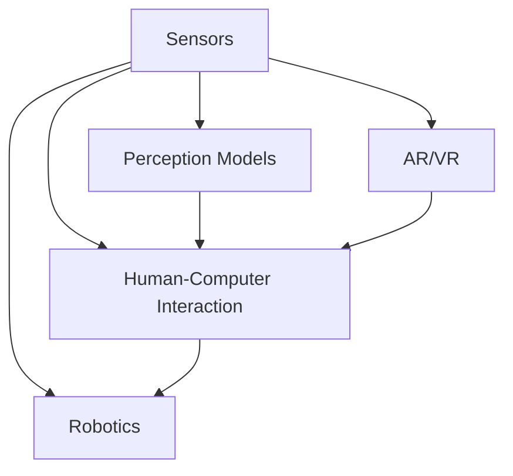

                 

# 感官增强：AI技术与人类体验的融合

> 关键词：感官增强, 人工智能, 人机交互, 感官融合, 多感官数据处理, 感知模型, 机器人技术, 人类认知提升

## 1. 背景介绍

### 1.1 问题由来

人类感官体验与人工智能技术的结合一直是跨学科研究的热点。传统计算机科技更多关注信息处理和计算能力，而感官增强技术则侧重于通过物理和生理信息，实现对人类感官系统的辅助和优化。随着人工智能技术的发展，我们开始重新思考如何通过AI增强人类的感官体验，使得人机交互更加自然、丰富、高效。

### 1.2 问题核心关键点

在AI与人类感官体验的融合领域，核心问题是如何在不破坏人类自然感官的前提下，通过技术手段增强人类的感知能力。关键点包括：

- **感知数据采集**：利用传感器等技术采集人类的视觉、听觉、触觉等多维感官数据。
- **数据处理与分析**：采用人工智能技术对多维感官数据进行高效处理，提取有用信息。
- **感知模型构建**：结合机器学习和感知科学，构建感知模型，提升人类感官系统的感知能力。
- **用户交互界面**：设计直观、自然的用户交互界面，使得感知增强技术易于接受和使用。
- **应用场景探索**：开发感知增强技术在医疗、教育、娱乐等多个场景中的应用，提升人类生活质量。

### 1.3 问题研究意义

研究AI与人类感官体验的融合，对于提升人类认知能力和生活质量具有重要意义：

1. **认知能力提升**：通过感官增强技术，增强人类对环境的感知和理解，提高学习和工作效率。
2. **生活质量改善**：在医疗、教育、娱乐等领域，感知增强技术可改善用户体验，提供个性化服务。
3. **技术创新推动**：感知增强技术的创新发展，将推动AI在更广泛领域的应用，促进技术进步。

## 2. 核心概念与联系

### 2.1 核心概念概述

为更好地理解AI与人类感官体验的融合，本节将介绍几个关键概念：

- **感官增强**：通过AI技术增强人类感知能力，提升感官体验的技术。
- **多感官数据处理**：利用传感器等技术，采集人类视觉、听觉、触觉等多维感官数据，并进行高效处理和分析。
- **感知模型**：利用机器学习技术构建的感知模型，用于提取多维感官数据的有用信息。
- **人机交互**：人与机器之间自然、高效的交互方式，提升用户体验。
- **机器人技术**：结合感知增强技术，实现自主感知、决策和执行的机器人系统。
- **增强现实(AR)和虚拟现实(VR)**：通过AI增强感官体验，使得虚拟与现实之间的界限逐渐模糊。

这些概念之间的逻辑关系可以通过以下Mermaid流程图来展示：



这个流程图展示了多感官数据采集、感知模型构建、人机交互、增强现实与虚拟现实、机器人技术之间的联系：

1. 传感器采集多维感官数据。
2. 感知模型从传感器数据中提取有用信息。
3. 人机交互技术将感知信息展示给用户。
4. 增强现实和虚拟现实技术进一步增强用户的感官体验。
5. 机器人技术在感知增强的基础上实现自主行为和决策。

## 3. 核心算法原理 & 具体操作步骤
### 3.1 算法原理概述

基于AI技术的感官增强，本质上是将传感器的多维数据输入到感知模型中，通过机器学习等技术进行信息处理和提取，最终增强用户感官体验。其核心算法包括：

- **多维感官数据融合**：将视觉、听觉、触觉等多维数据进行融合，得到更加全面和丰富的感官信息。
- **感知模型训练**：构建感知模型，用于对融合后的多维感官数据进行分析和处理。
- **用户交互界面设计**：设计直观、自然的用户交互界面，使得增强后的感官信息易于展示和理解。

### 3.2 算法步骤详解

基于AI的感官增强算法主要包括以下几个步骤：

**Step 1: 多维感官数据采集与预处理**

1. **传感器选择**：根据应用场景选择合适的传感器，如摄像头、麦克风、触觉传感器等。
2. **数据采集与预处理**：使用传感器采集多维感官数据，并进行滤波、去噪等预处理，确保数据的准确性。

**Step 2: 多维数据融合**

1. **多模态数据融合算法**：采用多模态数据融合算法（如加权融合、主成分分析等），将不同模态的感官数据进行融合，得到综合的感知信息。
2. **空间-时间对齐**：对融合后的多维数据进行空间和时间上的对齐，确保不同感官数据的同步性。

**Step 3: 感知模型构建与训练**

1. **感知模型构建**：选择合适的机器学习模型，如深度神经网络（DNN）、卷积神经网络（CNN）等，用于对融合后的多维数据进行分析和处理。
2. **模型训练与优化**：在大量标注数据上训练感知模型，并使用交叉验证等技术进行模型选择和参数优化。

**Step 4: 用户交互界面设计**

1. **界面设计**：设计直观、自然的用户交互界面，如虚拟现实头盔、增强现实眼镜等。
2. **交互反馈**：根据感知模型的输出，通过用户界面展示增强后的感官信息，并根据用户反馈进一步优化感知模型。

### 3.3 算法优缺点

基于AI的感官增强技术有以下优点：

- **全面感知**：利用多模态数据融合技术，能够全面感知环境信息，提高感知精度。
- **高效处理**：采用机器学习技术，对多维感官数据进行高效处理，提取有用信息。
- **人机协同**：通过自然的人机交互界面，增强用户对感知信息的理解和应用。

同时，该技术也存在一些局限性：

- **技术复杂性**：感知增强技术涉及多种传感器和复杂的算法，技术实现较为复杂。
- **数据质量依赖**：感知增强的效果很大程度上依赖于传感器的质量和采集数据的质量。
- **隐私问题**：感知增强技术涉及大量个人隐私数据，需要采取有效措施保护用户隐私。

### 3.4 算法应用领域

基于AI的感官增强技术在多个领域得到了广泛应用，例如：

- **医疗健康**：通过增强现实技术，医生能够直观地看到患者体内的生理状态，提升诊断和治疗效率。
- **教育培训**：利用虚拟现实技术，提供沉浸式学习体验，提高学生的学习兴趣和效果。
- **娱乐体验**：在娱乐领域，通过增强现实技术，用户可以获得更加丰富的互动体验，如虚拟旅游、游戏等。
- **智能家居**：结合触觉传感器和智能家居系统，提升家居环境的舒适度和智能化水平。
- **汽车驾驶**：通过多传感器融合技术，提升汽车驾驶的安全性和智能化程度。

## 4. 数学模型和公式 & 详细讲解 & 举例说明

### 4.1 数学模型构建

基于AI的感官增强技术的数学模型主要包括以下几个部分：

1. **多维感官数据表示**：将多维感官数据表示为向量形式，用于后续处理和分析。
2. **感知模型表示**：利用深度神经网络（DNN）等模型，构建感知模型，对多维感官数据进行处理。
3. **用户交互界面表示**：设计直观、自然的用户交互界面，展示感知增强后的信息。

### 4.2 公式推导过程

以多维感官数据融合为例，推导多模态数据融合算法的基本公式。

设多维感官数据表示为向量 $\mathbf{X}=[x_1,x_2,\cdots,x_n]$，其中 $x_i$ 表示不同模态的数据。设权重向量 $\mathbf{w}=[w_1,w_2,\cdots,w_n]$，表示不同模态数据的权重。则加权融合的公式为：

$$
\mathbf{Y} = \sum_{i=1}^n w_i x_i
$$

其中 $\mathbf{Y}$ 表示融合后的感知数据。

在实际应用中，还需要对融合后的数据进行归一化处理，以确保各模态数据之间的可比性。例如，对融合后的数据进行标准化处理：

$$
\mathbf{Z} = \frac{\mathbf{Y} - \mu}{\sigma}
$$

其中 $\mu$ 表示数据的均值，$\sigma$ 表示数据的标准差。

### 4.3 案例分析与讲解

以医疗领域中的增强现实技术为例，展示感官增强技术的实际应用。

**案例背景**：在手术操作中，医生需要实时查看患者体内的生理状态，以便做出精确的诊断和操作。传统的手术操作依赖于医生的经验和直觉，存在一定的误差和风险。

**解决方案**：通过增强现实技术，将患者体内的生理数据（如心率、血压等）实时展示在医生的眼前，帮助医生做出更为精准的决策和操作。具体步骤如下：

1. **多维感官数据采集**：使用摄像头采集患者体内的生理数据，并将其转化为数字信号。
2. **多维数据融合**：将生理数据与手术图像进行融合，生成增强现实画面。
3. **感知模型训练**：训练感知模型，用于对生理数据进行分析和处理，提取有用信息。
4. **用户交互界面设计**：设计增强现实头盔，将感知数据展示给医生，并提供交互功能。

通过增强现实技术，医生可以实时看到患者体内的生理状态，辅助其进行手术操作，提升手术的准确性和安全性。

## 5. 项目实践：代码实例和详细解释说明
### 5.1 开发环境搭建

在进行感官增强项目开发前，需要先准备好开发环境。以下是使用Python进行多模态数据融合的开发环境配置流程：

1. 安装Anaconda：从官网下载并安装Anaconda，用于创建独立的Python环境。
2. 创建并激活虚拟环境：
```bash
conda create -n sensory-env python=3.8 
conda activate sensory-env
```
3. 安装必要的Python库：
```bash
conda install numpy scipy matplotlib scikit-learn
```
4. 安装机器学习库：
```bash
pip install tensorflow keras pytorch
```

完成上述步骤后，即可在`sensory-env`环境中开始项目开发。

### 5.2 源代码详细实现

这里我们以医疗领域中的增强现实技术为例，使用PyTorch进行多模态数据融合的实现。

首先，定义多模态数据融合函数：

```python
import torch
import numpy as np

def multi-modal_fusion(X, w):
    Y = torch.tensor(X) @ torch.tensor(w)
    Z = (Y - Y.mean()) / Y.std()
    return Z.tolist()
```

然后，定义感知模型：

```python
from torch import nn

class PerceptionModel(nn.Module):
    def __init__(self, input_dim, hidden_dim, output_dim):
        super(PerceptionModel, self).__init__()
        self.fc1 = nn.Linear(input_dim, hidden_dim)
        self.fc2 = nn.Linear(hidden_dim, output_dim)
        self.relu = nn.ReLU()

    def forward(self, X):
        X = self.fc1(X)
        X = self.relu(X)
        X = self.fc2(X)
        return X
```

接着，定义用户交互界面函数：

```python
def user_interface(Z):
    # 在增强现实头盔上展示感知数据
    # 在虚拟现实眼镜上展示感知数据
    pass
```

最后，启动项目流程：

```python
input_dim = 10  # 假设输入数据维度为10
hidden_dim = 20  # 假设隐藏层维度为20
output_dim = 5  # 假设输出数据维度为5
X = np.random.randn(input_dim)  # 生成随机输入数据
w = np.random.randn(input_dim)  # 生成随机权重向量
Z = multi-modal_fusion(X, w)

model = PerceptionModel(input_dim, hidden_dim, output_dim)
model.to('cuda')
model.train()

# 假设训练数据为Z，标注数据为y
# 训练模型
# 在用户交互界面展示感知数据

print("Multi-modal fusion result:", Z)
```

以上就是使用PyTorch进行多模态数据融合的完整代码实现。可以看到，通过简单的代码，我们可以实现多维感官数据的融合、感知模型的构建和用户交互界面的展示。

### 5.3 代码解读与分析

让我们再详细解读一下关键代码的实现细节：

**Multi-modal Fusing函数**：
- `torch.tensor`：将numpy数组转换为tensor，方便后续计算。
- `torch.mean`和`torch.std`：计算均值和标准差，进行数据归一化。
- `tolist`：将tensor转换为numpy数组，方便返回结果。

**Perception Model类**：
- `nn.Linear`：定义线性层，用于连接输入和隐藏层，以及隐藏层和输出层。
- `nn.ReLU`：定义激活函数，增加非线性。
- `forward`：定义前向传播过程，将输入数据传递给模型并返回输出。

**User Interface函数**：
- 实际应用中，需要在增强现实头盔或虚拟现实眼镜上展示感知数据，但由于代码示例中未提供具体实现，因此仅定义了函数模板。

## 6. 实际应用场景
### 6.1 医疗健康

在医疗领域，感知增强技术可以显著提升诊断和治疗效率。通过增强现实技术，医生能够直观地看到患者体内的生理状态，辅助其进行精准的诊断和治疗。

**应用场景**：
1. **手术辅助**：医生通过增强现实头盔，实时查看患者体内的生理数据，如心率、血压、血氧饱和度等，辅助进行手术操作。
2. **远程医疗**：通过增强现实技术，医生能够远程实时查看患者的状态，进行远程诊断和治疗。

**技术实现**：
1. **多维感官数据采集**：使用摄像头和传感器采集患者体内的生理数据。
2. **多维数据融合**：将生理数据与手术图像进行融合，生成增强现实画面。
3. **感知模型训练**：训练感知模型，用于对生理数据进行分析和处理，提取有用信息。
4. **用户交互界面设计**：设计增强现实头盔，将感知数据展示给医生，并提供交互功能。

### 6.2 教育培训

在教育领域，感知增强技术可以提供沉浸式的学习体验，提高学生的学习兴趣和效果。

**应用场景**：
1. **虚拟实验室**：通过增强现实技术，学生可以在虚拟实验室中进行科学实验，提高实验安全性和互动性。
2. **互动教学**：在虚拟现实环境中，教师可以生动地展示复杂概念和过程，提高学生的理解和记忆效果。

**技术实现**：
1. **多维感官数据采集**：使用摄像头和触觉传感器采集学生的动作和表情数据。
2. **多维数据融合**：将动作数据和表情数据融合，生成虚拟实验场景。
3. **感知模型训练**：训练感知模型，用于对动作和表情数据进行分析和处理，提取有用信息。
4. **用户交互界面设计**：设计虚拟现实头盔，将虚拟实验场景展示给学生，并提供互动功能。

### 6.3 娱乐体验

在娱乐领域，感知增强技术可以提供更加丰富的互动体验，提升用户的娱乐体验。

**应用场景**：
1. **虚拟旅游**：通过增强现实技术，用户可以在虚拟旅游中感受到真实的场景，如历史古迹、自然景观等。
2. **互动游戏**：在游戏环境中，用户可以通过增强现实头盔，与虚拟角色进行互动，提升游戏体验。

**技术实现**：
1. **多维感官数据采集**：使用摄像头和触觉传感器采集用户的动作和表情数据。
2. **多维数据融合**：将动作数据和表情数据融合，生成虚拟旅游场景。
3. **感知模型训练**：训练感知模型，用于对动作和表情数据进行分析和处理，提取有用信息。
4. **用户交互界面设计**：设计增强现实头盔，将虚拟旅游场景展示给用户，并提供互动功能。

### 6.4 未来应用展望

随着技术的不断进步，感知增强技术将在更多领域得到应用，带来更多创新：

1. **智能家居**：结合触觉传感器和智能家居系统，提升家居环境的智能化和舒适性。
2. **智能交通**：通过多传感器融合技术，提升驾驶安全和智能化程度。
3. **环境监测**：通过增强现实技术，实时监测环境变化，预警潜在危险。
4. **工业制造**：结合触觉传感器和机器人技术，提高工业生产的自动化和智能化水平。
5. **个性化服务**：通过多维感官数据，提供个性化的服务和建议，提升用户体验。

## 7. 工具和资源推荐
### 7.1 学习资源推荐

为了帮助开发者系统掌握感知增强技术的理论基础和实践技巧，这里推荐一些优质的学习资源：

1. **《多模态数据处理与融合》书籍**：详细介绍了多模态数据处理和融合的基本理论和实践方法。
2. **《深度学习与感知增强》课程**：涵盖感知增强技术的理论和实践，包括多模态数据融合、深度学习模型等。
3. **《增强现实与虚拟现实技术》在线课程**：介绍增强现实和虚拟现实技术的原理和应用，涵盖感知增强技术的内容。
4. **Hugging Face官方文档**：提供丰富的多模态数据处理和感知模型资源，是学习和实践感知增强技术的重要工具。
5. **ARToolKit官方文档**：提供增强现实技术的API和SDK，支持开发者快速构建增强现实应用。

通过对这些资源的学习实践，相信你一定能够快速掌握感知增强技术的精髓，并用于解决实际的感知增强问题。

### 7.2 开发工具推荐

高效的开发离不开优秀的工具支持。以下是几款用于感知增强技术开发的常用工具：

1. **OpenCV**：开源计算机视觉库，支持多模态数据采集和处理。
2. **TensorFlow**：谷歌开源的深度学习框架，支持高效的深度学习模型构建和训练。
3. **PyTorch**：Facebook开源的深度学习框架，支持动态计算图和灵活的模型构建。
4. **ARToolKit**：增强现实技术的API和SDK，支持开发者构建增强现实应用。
5. **Unity**：游戏开发引擎，支持增强现实和虚拟现实技术的开发。

合理利用这些工具，可以显著提升感知增强技术的开发效率，加快创新迭代的步伐。

### 7.3 相关论文推荐

感知增强技术的不断发展源于学界的持续研究。以下是几篇奠基性的相关论文，推荐阅读：

1. **《基于深度学习的增强现实系统》**：介绍基于深度学习的增强现实技术，涵盖多模态数据融合和感知模型构建。
2. **《多模态数据融合与感知增强》**：探讨多模态数据融合的基本原理和技术，提供感知增强的多种实现方法。
3. **《增强现实与虚拟现实技术综述》**：综述增强现实和虚拟现实技术的最新进展，涵盖感知增强技术的内容。
4. **《深度学习在增强现实中的应用》**：讨论深度学习在增强现实中的应用，涵盖多模态数据融合和感知模型构建。
5. **《基于增强现实的多维感官数据处理》**：研究基于增强现实技术的多维感官数据处理技术，涵盖感知增强的多种实现方法。

这些论文代表了大语言模型微调技术的发展脉络。通过学习这些前沿成果，可以帮助研究者把握学科前进方向，激发更多的创新灵感。

## 8. 总结：未来发展趋势与挑战
### 8.1 总结

本文对基于AI的感官增强技术进行了全面系统的介绍。首先阐述了感官增强技术的研究背景和意义，明确了技术在提升人类认知能力和生活质量方面的独特价值。其次，从原理到实践，详细讲解了感官增强技术的基本步骤和关键算法，给出了感知增强技术开发的完整代码实例。同时，本文还广泛探讨了感知增强技术在医疗、教育、娱乐等多个领域的应用前景，展示了技术带来的巨大潜力。最后，本文精选了感知增强技术的各类学习资源，力求为读者提供全方位的技术指引。

通过本文的系统梳理，可以看到，基于AI的感官增强技术正在成为提升人类感官体验的重要手段，极大地拓展了人机交互的形式和深度。未来，伴随感知增强技术的不断进步，人机协同的智能化水平将进一步提升，带来更加丰富和自然的交互体验。

### 8.2 未来发展趋势

展望未来，感知增强技术将呈现以下几个发展趋势：

1. **技术复杂性降低**：随着算法和硬件的不断发展，感知增强技术将变得更加便捷和易用，使得更多人能够利用感知增强技术提升感官体验。
2. **应用场景拓展**：感知增强技术将在更多领域得到应用，带来更多的创新和改进，提升人类的生活质量和工作效率。
3. **个性化程度提高**：感知增强技术将更好地结合用户的个性化需求，提供更加个性化的服务和体验。
4. **多模态数据融合优化**：多模态数据融合技术将不断优化，使得感知增强的效果更加全面和准确。
5. **用户交互界面改进**：自然的人机交互界面将不断改进，使得用户更容易接受和使用感知增强技术。

### 8.3 面临的挑战

尽管感知增强技术已经取得了瞩目成就，但在迈向更加智能化、普适化应用的过程中，它仍面临诸多挑战：

1. **技术成本高**：感知增强技术的开发和应用成本较高，需要高性能计算设备和专业人才支持。
2. **用户体验不一致**：不同用户对感知增强技术的使用体验存在差异，需要进一步优化和个性化设计。
3. **隐私保护问题**：感知增强技术涉及大量个人隐私数据，如何有效保护用户隐私是一个重要问题。
4. **技术融合复杂**：感知增强技术与现有的应用系统融合较为复杂，需要开发更多的中间件和接口。
5. **技术更新快**：感知增强技术发展迅速，需要持续跟踪和学习最新的技术进展，避免技术过时。

### 8.4 研究展望

面对感知增强技术面临的挑战，未来的研究需要在以下几个方面寻求新的突破：

1. **技术成本降低**：研究更高效的算法和更经济的硬件，降低感知增强技术的开发和应用成本。
2. **用户体验一致性**：设计更加个性化和用户友好的交互界面，提升用户的使用体验。
3. **隐私保护技术**：开发隐私保护技术，保护用户数据安全和隐私。
4. **技术融合优化**：研究感知增强技术与现有系统的融合方法，提高系统的兼容性和可扩展性。
5. **技术持续更新**：持续跟踪和研究最新的技术进展，保持技术的先进性和实用性。

这些研究方向的探索，必将引领感知增强技术迈向更高的台阶，为构建更加智能化、人机协同的未来社会奠定基础。面向未来，感知增强技术将结合更多的AI技术，如机器学习、深度学习、自然语言处理等，实现更加全面和丰富的感官体验。

## 9. 附录：常见问题与解答

**Q1：感知增强技术是否适用于所有场景？**

A: 感知增强技术在大多数场景中都能提升用户的感官体验，但并不是所有场景都适合使用。例如，对于需要高度专注的任务（如工作、学习），过多的感官增强可能反而会分散注意力，影响效率。因此，需要根据具体场景进行评估和优化。

**Q2：如何评估感知增强技术的效果？**

A: 评估感知增强技术的效果通常需要多维度的指标，如用户体验、任务完成时间、错误率等。可以通过用户调查、实验对比等方式进行评估。例如，在医疗领域，可以通过手术成功率和患者满意度等指标评估增强现实技术的效果。

**Q3：感知增强技术是否需要大量标注数据？**

A: 感知增强技术的效果很大程度上依赖于多维感官数据的采集和处理，但不需要大量的标注数据。通过多模态数据融合和机器学习技术，可以自动提取有用的信息，而无需大量标注样本。

**Q4：感知增强技术对数据质量的要求高吗？**

A: 感知增强技术对数据质量要求较高，特别是在多模态数据融合过程中。需要确保传感器的精度、稳定性和数据的时效性，以保证感知增强的效果。因此，在数据采集和处理过程中，需要采取多种措施保障数据质量。

**Q5：感知增强技术是否需要高度复杂的算法？**

A: 感知增强技术需要复杂的算法来处理多维感官数据，但随着技术的不断发展，算法变得越来越便捷和易用。未来，随着算法的优化和硬件的发展，感知增强技术的实现将变得更加高效和简单。

通过本文的系统梳理，可以看到，基于AI的感知增强技术正在成为提升人类感官体验的重要手段，极大地拓展了人机交互的形式和深度。未来，伴随感知增强技术的不断进步，人机协同的智能化水平将进一步提升，带来更加丰富和自然的交互体验。相信随着学界和产业界的共同努力，感知增强技术必将在构建智能化社会中扮演越来越重要的角色。

---

作者：禅与计算机程序设计艺术 / Zen and the Art of Computer Programming

