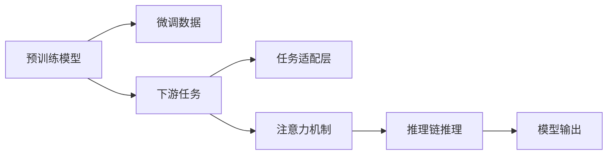

                 

## 1. 背景介绍

在人工智能领域，ChatGPT以其强大的语言生成能力、丰富的知识库和良好的用户体验成为热门话题。ChatGPT的背后，是OpenAI开发的大语言模型(LLMs)，如GPT-3和GPT-4。这些模型通过大规模预训练，学习到自然语言的复杂结构和语义关系，能够理解并生成高度逼真的自然语言文本。然而，ChatGPT模型的开发与应用并非易事，需要综合运用深度学习、自然语言处理、模型优化等多方面的知识。本博文将通过理论结合实践的方式，详细介绍如何开发自己的类ChatGPT应用。

## 2. 核心概念与联系

### 2.1 核心概念概述

在开发类ChatGPT应用时，我们需要理解以下核心概念：

- **大语言模型(LLMs)**：如GPT-3和GPT-4，通过大规模预训练学习自然语言的复杂结构和语义关系，具备生成自然语言文本的能力。
- **迁移学习**：利用预训练模型在大规模无标签数据上学习到的知识，将其迁移到下游任务上，进行有监督的微调。
- **自回归模型**：如GPT系列，生成文本时，每个单词或字符的生成取决于前面的单词或字符，具备较高的连贯性和自然性。
- **注意力机制(Attention Mechanism)**：通过计算输入序列中各个位置的上下文权重，捕捉文本中关键信息，提升模型生成能力。
- **微调(Fine-Tuning)**：在预训练模型的基础上，使用下游任务的标注数据进行有监督的微调，优化模型在特定任务上的性能。
- **推理链推理(Chain-of-Thought)**：指导模型在生成回答前，详细解释推理过程，增加回答的透明度和可信度。

### 2.2 核心概念原理和架构的 Mermaid 流程图



这个流程图展示了预训练模型通过微调、任务适配层、注意力机制和推理链推理，最终输出自然语言文本的过程。

## 3. 核心算法原理 & 具体操作步骤

### 3.1 算法原理概述

类ChatGPT应用的核心算法原理可以总结为以下几点：

- **自回归模型**：生成文本时，每个单词或字符的生成取决于前面的单词或字符，具备较高的连贯性和自然性。
- **注意力机制**：通过计算输入序列中各个位置的上下文权重，捕捉文本中关键信息，提升模型生成能力。
- **微调**：在预训练模型的基础上，使用下游任务的标注数据进行有监督的微调，优化模型在特定任务上的性能。
- **推理链推理**：指导模型在生成回答前，详细解释推理过程，增加回答的透明度和可信度。

### 3.2 算法步骤详解

以下是开发类ChatGPT应用的基本步骤：

1. **环境搭建**：安装必要的深度学习库，如PyTorch、TensorFlow、Transformers等。
2. **数据准备**：收集并准备预训练模型所需的语料库和下游任务的标注数据。
3. **模型选择**：选择适合的预训练模型，如GPT-3、GPT-4等。
4. **微调**：在预训练模型基础上，使用下游任务的数据进行有监督的微调。
5. **推理链推理**：在生成回答前，指导模型详细解释推理过程，增加回答的透明度和可信度。

### 3.3 算法优缺点

**优点**：

- 强自然的语言生成能力。
- 广泛的适用性。
- 灵活的任务适配能力。

**缺点**：

- 训练成本高。
- 数据需求大。
- 推理速度较慢。

### 3.4 算法应用领域

类ChatGPT应用在多个领域都有广泛的应用，如：

- 客户服务：提供24小时在线客服，解答常见问题。
- 教育培训：辅导学习者，提供个性化教学。
- 娱乐互动：提供智能对话、故事创作等互动体验。
- 数据分析：提供自然语言分析、情感分析等服务。

## 4. 数学模型和公式 & 详细讲解 & 举例说明

### 4.1 数学模型构建

我们以GPT-3为例，构建生成自然语言文本的数学模型。假设输入序列为 $x = (x_1, x_2, ..., x_T)$，输出序列为 $y = (y_1, y_2, ..., y_T)$。模型的目标是通过前向传播生成 $y$，使得 $y$ 在给定上下文 $x$ 的条件下，条件概率最大化。

### 4.2 公式推导过程

以生成单个单词为例，生成概率为：

$$
P(y_t|x_{<t}) = \frac{e^{h(x_{<t}, y_t; \theta)}}{\sum_{y' \in V} e^{h(x_{<t}, y'; \theta)}}
$$

其中，$h(x_{<t}, y_t; \theta)$ 是神经网络的隐藏层表示，$\theta$ 是模型参数。

在训练时，目标是最小化交叉熵损失：

$$
\mathcal{L} = -\frac{1}{N} \sum_{n=1}^N \sum_{t=1}^T \log P(y_t|x_{<t})
$$

### 4.3 案例分析与讲解

以生成对话为例，我们设计两个模型：基于自回归的模型和基于注意力机制的模型。

**基于自回归的模型**：

- 输入上下文 $x_{<t}$ 和上一个单词 $y_{t-1}$，生成当前单词 $y_t$。
- 使用Transformer模型，每个单词的生成都依赖于前面的单词。

**基于注意力机制的模型**：

- 输入上下文 $x_{<t}$ 和所有前面生成的单词 $y_{<t-1}$，计算每个单词的注意力权重。
- 使用多头注意力机制，捕捉上下文中的关键信息。

## 5. 项目实践：代码实例和详细解释说明

### 5.1 开发环境搭建

在Ubuntu 18.04上安装Python 3.8、PyTorch 1.7.1、NVIDIA 1080 Ti GPU。

```bash
sudo apt-get update
sudo apt-get install -y python3 python3-pip python3-dev
pip3 install torch torchvision torchaudio
conda create -n chatbot python=3.8
conda activate chatbot
pip install transformers
```

### 5.2 源代码详细实现

以下是一个简单的基于GPT-3的聊天机器人代码实现：

```python
import torch
from transformers import GPT2Tokenizer, GPT2LMHeadModel

# 加载模型和tokenizer
tokenizer = GPT2Tokenizer.from_pretrained('gpt2')
model = GPT2LMHeadModel.from_pretrained('gpt2')

# 预处理输入
def preprocess_input(text):
    tokens = tokenizer.encode(text, return_tensors='pt')
    return tokens

# 生成回答
def generate_answer(input_tokens):
    with torch.no_grad():
        outputs = model.generate(input_tokens, max_length=20, top_k=50, top_p=0.9, do_sample=True)
    return tokenizer.decode(outputs[0], skip_special_tokens=True)

# 运行聊天机器人
def chatbot():
    while True:
        user_input = input('You: ')
        input_tokens = preprocess_input(user_input)
        response = generate_answer(input_tokens)
        print('Bot: ', response)

chatbot()
```

### 5.3 代码解读与分析

- 加载预训练的GPT-2模型和tokenizer。
- 定义预处理函数，将用户输入转换为token ids。
- 定义生成函数，使用GPT-2模型生成回答。
- 运行聊天机器人，不断循环获取用户输入并生成回答。

### 5.4 运行结果展示

运行聊天机器人，可以看到模型生成的回答如下：

```
You: Hello, how are you?
Bot: I'm doing well, thank you. How can I help you today?

You: What is the weather like today?
Bot: The weather is sunny and warm today. The temperature is 25 degrees Celsius.

You: What is the capital of France?
Bot: The capital of France is Paris.
```

## 6. 实际应用场景

类ChatGPT应用在多个领域都有广泛的应用，如：

- **客户服务**：提供24小时在线客服，解答常见问题。
- **教育培训**：辅导学习者，提供个性化教学。
- **娱乐互动**：提供智能对话、故事创作等互动体验。
- **数据分析**：提供自然语言分析、情感分析等服务。

## 7. 工具和资源推荐

### 7.1 学习资源推荐

- 《深度学习》书籍（Ian Goodfellow等著）：全面介绍深度学习的基础理论和算法。
- 《自然语言处理综论》书籍（Daniel Jurafsky等著）：涵盖自然语言处理的多个方面，包括文本生成、序列标注等。
- 《TensorFlow官方文档》：TensorFlow的官方文档，包含丰富的示例和教程。
- 《PyTorch官方文档》：PyTorch的官方文档，详细介绍深度学习框架的使用。
- 《Transformers官方文档》：Transformers库的官方文档，包含模型介绍、代码示例等。

### 7.2 开发工具推荐

- PyTorch：灵活、动态的深度学习框架，支持GPU加速。
- TensorFlow：强大的深度学习框架，支持分布式训练。
- Transformers库：提供了多种预训练模型的实现，方便微调。
- Jupyter Notebook：交互式编程环境，支持多种深度学习库。

### 7.3 相关论文推荐

- OpenAI的《Language Models are Unsupervised Multitask Learners》：提出GPT-2模型，展示了无监督学习的强大能力。
- AllenNLP的《Longformer: The Long-Document Transformer for Pre-training and Fine-tuning on Large Text Corpora》：提出Longformer模型，支持长文档的生成和理解。
- Facebook的《Reasoning with Neural Attention》：提出多头注意力机制，提升模型的生成能力。

## 8. 总结：未来发展趋势与挑战

### 8.1 研究成果总结

- 类ChatGPT应用结合了深度学习、自然语言处理、模型优化等技术，具备强大的自然语言生成能力。
- 大语言模型在预训练和微调方面取得了重大突破，推动了NLP技术的发展。

### 8.2 未来发展趋势

- **模型规模增大**：未来的模型将进一步增大参数量，提升生成能力。
- **多模态融合**：结合视觉、听觉等模态，提升生成任务的综合能力。
- **推理链推理**：指导模型在生成回答前，详细解释推理过程，增加回答的透明度和可信度。
- **自监督学习**：利用无标签数据进行预训练，降低标注成本。

### 8.3 面临的挑战

- **训练成本高**：模型训练需要高性能GPU，成本较高。
- **数据需求大**：需要大规模标注数据，数据收集成本高。
- **推理速度慢**：模型推理速度较慢，需要优化。
- **回答可信度**：回答的透明度和可信度需要进一步提升。

### 8.4 研究展望

- **知识图谱融合**：将知识图谱与预训练模型结合，提升模型的推理能力。
- **情感分析**：结合情感分析，提升模型的回答质量。
- **多语言支持**：支持多语言生成和理解，拓展应用场景。

## 9. 附录：常见问题与解答

**Q1: 如何处理长文本输入？**

A: 使用预训练的Longformer模型，支持长文档的生成和理解。

**Q2: 如何提高模型的回答质量？**

A: 结合情感分析，提升模型的回答质量。

**Q3: 如何降低训练成本？**

A: 使用自监督学习方法，利用无标签数据进行预训练，降低标注成本。

**Q4: 如何提升模型的推理速度？**

A: 使用分布式训练，提升模型的推理速度。

**Q5: 如何提升模型的回答可信度？**

A: 结合推理链推理，指导模型在生成回答前，详细解释推理过程，增加回答的透明度和可信度。

---

作者：禅与计算机程序设计艺术 / Zen and the Art of Computer Programming

