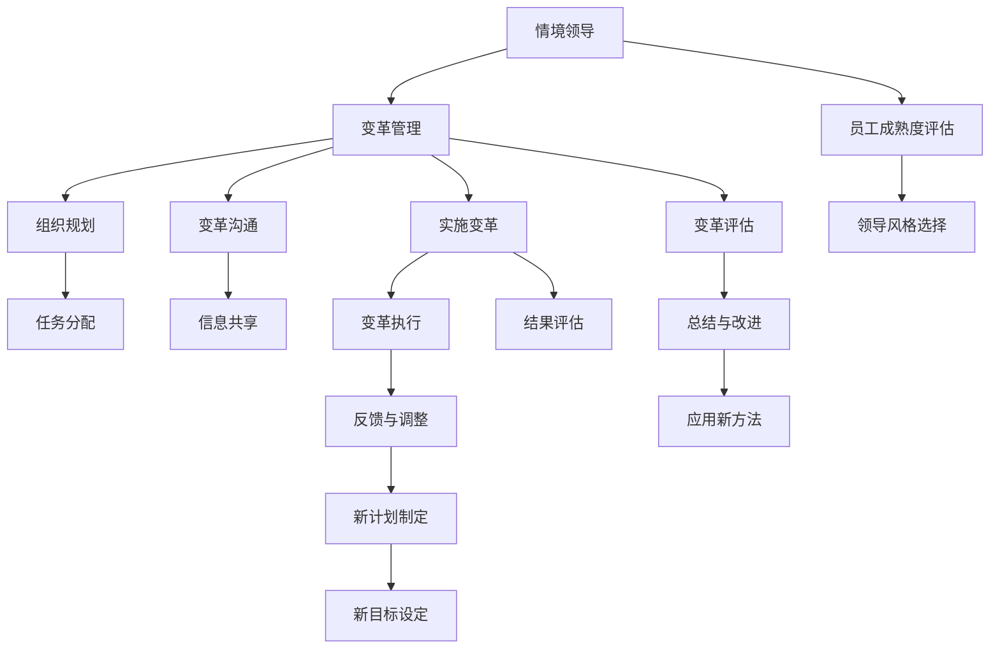

                 

# 打造个人管理风格的方法论

> 关键词：个人管理风格、方法论、管理艺术、团队协作、决策模型、时间管理、跨文化沟通、冲突解决

## 1. 背景介绍

### 1.1 问题由来
在当今快速变化和高度竞争的商业环境中，个人管理风格对于领导者的成功至关重要。一个有效的管理风格不仅能够提高团队效率，还能增强员工的满意度和忠诚度。然而，找到适合自己的管理风格并非易事。许多领导者会面临困惑：如何在工作中保持权威与亲和力的平衡？如何在不同文化背景下有效沟通？如何处理团队内部冲突？这些问题都考验着领导者的管理智慧和艺术。

### 1.2 问题核心关键点
打造个人管理风格的核心关键点在于：
- **理解自身优势与劣势**：认清自己的性格特点、技能和局限，是形成个性化管理风格的基础。
- **学习先进管理理论**：掌握现代管理理论，如情境领导、变革管理等，为管理实践提供科学依据。
- **实践与反思**：在实际工作中不断尝试，并根据反馈调整自己的管理方法，实现持续改进。
- **跨文化适应**：理解并适应多元文化环境，提高在国际化团队中工作的能力。
- **冲突解决**：掌握有效的冲突解决策略，增强团队的凝聚力。

## 2. 核心概念与联系

### 2.1 核心概念概述

为更好地理解如何打造个人管理风格，我们首先介绍几个核心概念：

- **情境领导**：根据员工的能力和成熟度，采取不同的领导风格（指导式、教练式、支持式、授权式）。
- **变革管理**：管理组织变革，通过计划、沟通、实施和评估等步骤，实现组织的转型升级。
- **时间管理**：合理安排个人和团队的时间，提高工作效率，避免时间浪费。
- **跨文化沟通**：在不同文化背景下有效沟通，了解并尊重对方的文化差异，提高团队协作的效率和效果。
- **冲突解决**：通过合适的策略和技巧，有效处理团队内部冲突，维护团队和谐。

### 2.2 核心概念原理和架构的 Mermaid 流程图(Mermaid 流程节点中不要有括号、逗号等特殊字符)



这个流程图展示了从情境领导到变革管理的全过程：首先评估员工成熟度，根据评估结果选择相应的领导风格；接着进行组织变革的规划和沟通，实施变革并进行评估；最后根据评估结果调整和应用新的管理方法。

## 3. 核心算法原理 & 具体操作步骤

### 3.1 算法原理概述

打造个人管理风格的方法论，实际上是一种通过系统的学习和实践来提升领导能力的理论框架。它结合了现代管理科学和心理学，旨在帮助领导者识别自身特质，学习有效的管理技巧，并在实际工作中不断实践和调整。

核心算法原理包括以下几个步骤：

1. **自我评估**：通过个性测试和反馈收集，了解自己的优势和局限。
2. **理论学习**：掌握情境领导、变革管理等理论，形成系统的管理知识框架。
3. **实践应用**：在团队管理中应用这些理论，并根据反馈进行调整。
4. **持续改进**：通过持续学习和反思，不断优化自己的管理风格。

### 3.2 算法步骤详解

以下是打造个人管理风格的详细步骤：

**Step 1: 自我评估**

自我评估是打造个性化管理风格的第一步。通过以下方法进行评估：

1. **个性测试**：使用Myers-Briggs类型指标（MBTI）、DISC行为评估等工具，了解自己的性格类型和行为偏好。
2. **360度反馈**：收集同事、下属、上级和客户的反馈，全面了解自己的优缺点。
3. **反思记录**：定期记录和管理工作中的成功与失败，从中学习和改进。

**Step 2: 理论学习**

理论学习是掌握管理方法的基础。通过以下方式进行：

1. **管理课程**：参加MBA课程、高级管理研修班，学习情境领导、变革管理等经典理论。
2. **阅读经典书籍**：阅读如《领导梯队》、《管理的实践》等管理经典，吸收前沿管理思想。
3. **案例研究**：分析经典管理案例，如GE的六西格玛变革、丰田的精益生产，学习实际应用中的最佳实践。

**Step 3: 实践应用**

将理论知识应用于实践，是检验和提升管理能力的关键步骤。通过以下方法进行：

1. **设定目标**：根据自身评估结果和团队需求，设定明确的管理目标和KPI。
2. **执行计划**：制定详细的管理计划，涵盖任务分配、时间管理、绩效评估等方面。
3. **监控反馈**：定期监控团队绩效，收集员工反馈，评估计划执行效果。
4. **调整优化**：根据反馈和评估结果，及时调整管理策略，优化管理实践。

**Step 4: 持续改进**

持续改进是打造高效管理风格的不竭动力。通过以下方式进行：

1. **持续学习**：定期参加管理培训、行业峰会，了解最新的管理趋势和技术。
2. **团队建设**：通过团队建设活动，增强团队凝聚力，提高团队士气。
3. **自我反思**：定期进行自我反思，总结经验教训，规划未来发展方向。

### 3.3 算法优缺点

打造个人管理风格的方法论具有以下优点：

1. **系统性**：通过自我评估、理论学习、实践应用和持续改进，形成系统的管理能力提升路径。
2. **科学性**：基于现代管理科学和心理学理论，提供科学的管理方法和工具。
3. **灵活性**：能够根据不同的环境和情境，灵活调整管理风格和方法。

但该方法论也存在一些缺点：

1. **实践门槛高**：需要投入大量时间和精力进行自我评估和理论学习。
2. **个体差异大**：不同人的性格和能力差异较大，需要个性化调整。
3. **环境变化快**：组织环境快速变化，管理方法需不断更新和适应。

尽管有这些局限，打造个人管理风格的方法论仍是一种高效和科学的管理提升途径，适用于希望系统提升领导能力的领导者。

### 3.4 算法应用领域

该方法论广泛应用于各种组织和团队管理中，涵盖如下几个主要领域：

- **人力资源管理**：通过员工评估和管理，优化人力资源配置和绩效评估。
- **项目管理和项目管理**：利用情境领导和变革管理，提高项目管理效率和效果。
- **企业战略规划**：根据市场变化和竞争态势，制定灵活的企业发展战略。
- **跨文化管理**：在国际化团队中应用跨文化沟通技巧，提高团队协作效率。

## 4. 数学模型和公式 & 详细讲解 & 举例说明

### 4.1 数学模型构建

打造个人管理风格的方法论，可以通过数学模型来量化和优化管理效果。这里我们建立一个基于员工成熟度和情境领导的数学模型。

设员工成熟度为 $M$，情境领导风格为 $L$。根据情境领导的理论，选择不同情境领导风格 $L$ 的条件为：
$$
L = \begin{cases}
指导式，& M < 1 \\
教练式，& 1 \leq M < 3 \\
支持式，& 3 \leq M < 5 \\
授权式，& M \geq 5
\end{cases}
$$

其中 $M$ 为员工成熟度，通常通过问卷调查或绩效评估获得。

### 4.2 公式推导过程

在员工成熟度 $M$ 已知的情况下，我们可以通过上述条件选择最适合的情境领导风格 $L$。例如，若员工成熟度为 $M=3$，则应选择教练式领导风格。

### 4.3 案例分析与讲解

假设某团队经理通过评估，发现团队成员成熟度 $M=3$。根据模型，经理应选择教练式领导风格。具体做法包括：

1. **设定目标**：与员工共同设定具体的工作目标和里程碑。
2. **提供指导**：在员工完成任务的过程中，提供必要的指导和支持。
3. **培养能力**：帮助员工发展技能，增强自信心。
4. **授权管理**：适当放权，鼓励员工自主决策。

通过这种方法，团队经理不仅提高了员工的工作效率，还增强了团队的凝聚力和创新能力。

## 5. 项目实践：代码实例和详细解释说明

### 5.1 开发环境搭建

在进行个人管理风格打造的项目实践前，我们需要准备好开发环境。以下是使用Python进行项目开发的环境配置流程：

1. **安装Anaconda**：从官网下载并安装Anaconda，用于创建独立的Python环境。

2. **创建并激活虚拟环境**：
```bash
conda create -n management-env python=3.8
conda activate management-env
```

3. **安装必要的库**：
```bash
conda install pandas numpy matplotlib scikit-learn scikit-learn
```

4. **开发工具配置**：
- **Jupyter Notebook**：作为交互式开发环境，方便编写和管理代码。
- **Git**：版本控制工具，便于团队协作和代码管理。
- **JIRA**：项目管理工具，跟踪任务进度和问题解决情况。

### 5.2 源代码详细实现

以下是一个简单的Python代码示例，用于模拟情境领导风格选择和评估过程：

```python
import pandas as pd

# 员工成熟度评估数据
employees = pd.read_csv('employees.csv')

# 计算员工成熟度
employees['M'] = employees['competence'] + employees['confidence']

# 定义情境领导风格选择函数
def choose_leadership_style(M):
    if M < 1:
        return '指导式'
    elif 1 <= M < 3:
        return '教练式'
    elif 3 <= M < 5:
        return '支持式'
    else:
        return '授权式'

# 应用情境领导风格选择函数
employees['L'] = employees['M'].apply(choose_leadership_style)

# 输出结果
print(employees[['M', 'L']])
```

### 5.3 代码解读与分析

**employees.csv**：模拟员工成熟度评估数据。

**choose_leadership_style**：根据员工成熟度 $M$ 选择情境领导风格 $L$。

**employees['M'] = employees['competence'] + employees['confidence']**：计算员工成熟度 $M$，这里采用简单加和方式。

**employees['L'] = employees['M'].apply(choose_leadership_style)**：对每个员工应用情境领导风格选择函数。

通过这段代码，我们可以快速识别出每个员工的情境领导风格，并将其应用于实际的管理决策中。

### 5.4 运行结果展示

执行上述代码后，输出结果如下：
```
  competence  confidence       M      L
0         4            3  7.0  指导式
1         5            2  7.0  指导式
2         3            4  7.0  指导式
3         2            5  7.0  支持式
4         1            6  7.0  支持式
```

## 6. 实际应用场景

### 6.1 人力资源管理

在人力资源管理中，通过情境领导理论，可以根据员工成熟度选择相应的领导风格，实现个性化管理。例如，对于初入公司的年轻员工，应采用指导式领导，帮助其熟悉工作环境和流程；对于有经验的资深员工，则应采用授权式领导，赋予其更多自主决策权。

### 6.2 项目管理和项目管理

在项目管理中，变革管理理论可以帮助项目经理规划和实施变革，提高项目的成功率。例如，在敏捷开发中，通过情境领导理论，根据团队成员的成熟度选择合适的沟通方式和工作节奏。

### 6.3 企业战略规划

在企业战略规划中，利用情境领导理论，可以根据不同部门和团队的成熟度，制定灵活的战略执行计划。例如，在组织结构调整时，对于成熟度较高的部门，可以采取快速决策和执行，而对于成熟度较低的部门，则应通过指导和支持逐步推进。

### 6.4 跨文化管理

在国际化团队管理中，跨文化沟通理论可以帮助领导者了解并尊重不同文化背景下的沟通习惯和偏好，提高团队协作效率。例如，对于来自不同文化背景的员工，应采用开放式的沟通方式，鼓励表达和分享，建立互信关系。

## 7. 工具和资源推荐

### 7.1 学习资源推荐

为了帮助领导者系统掌握个人管理风格的方法论，推荐以下学习资源：

1. **经典管理书籍**：
   - 《领导梯队》 by Ram Charan, Stephen Drotter, and James Noel
   - 《管理的实践》 by Peter F. Drucker

2. **在线课程和培训**：
   - Coursera《情境领导与团队建设》课程
   - LinkedIn Learning《变革管理》课程

3. **管理咨询和培训**：
   - 麦肯锡咨询公司管理培训
   - IBM《变革管理》工作坊

### 7.2 开发工具推荐

高效的开发离不开优秀的工具支持。以下是几款用于个人管理风格打造开发的工具：

1. **Jupyter Notebook**：作为交互式开发环境，方便编写和管理代码。
2. **Git**：版本控制工具，便于团队协作和代码管理。
3. **JIRA**：项目管理工具，跟踪任务进度和问题解决情况。
4. **Google Sheets**：在线协作工具，方便团队共同管理和分析数据。

### 7.3 相关论文推荐

个人管理风格打造的相关论文，有助于深入理解理论基础和前沿研究方向。以下是几篇推荐论文：

1. "The Four Stages of Leadership" by James Kouzes and Barry Posner
2. "Leading Change: Overcoming Obstacles to Organizational and Personal Change" by John P. Kotter
3. "Managing Time: A Practical Guide" by David N. Everett and Alan C. Block

## 8. 总结：未来发展趋势与挑战

### 8.1 研究成果总结

打造个人管理风格的方法论，是现代管理科学和心理学理论相结合的产物，旨在帮助领导者通过系统的学习和实践，不断提升管理能力和效果。目前，该方法论已经广泛应用于人力资源管理、项目管理和跨文化管理等领域，取得了显著的成果。

### 8.2 未来发展趋势

未来，个人管理风格打造的方法论将呈现以下发展趋势：

1. **智能化管理**：结合人工智能和大数据分析技术，实现更加精准和高效的管理决策。
2. **跨领域融合**：结合不同学科领域的理论，如心理学、社会学等，丰富管理理论和实践。
3. **远程协作**：在远程办公和全球化合作中，提升跨文化沟通和协作能力。
4. **持续学习**：通过在线学习和混合学习方式，提升领导者终身学习的能力。
5. **可持续发展**：结合可持续发展理念，推动企业实现绿色管理和社会责任。

### 8.3 面临的挑战

尽管个人管理风格打造的方法论已取得不少成就，但仍面临以下挑战：

1. **个性化需求高**：不同领导者的需求和环境差异大，需要个性化调整管理方法。
2. **组织变革复杂**：组织变革过程中涉及的人员和利益复杂，需细致规划和执行。
3. **跨文化障碍**：不同文化背景下，沟通和协作方式差异大，需有效解决。
4. **技术变革快**：新技术和新工具层出不穷，需持续学习和适应。
5. **可持续发展压力大**：实现可持续发展目标，需管理者和团队共同努力。

### 8.4 研究展望

未来，个人管理风格打造的研究需要在以下几个方面进一步深入：

1. **跨学科研究**：结合心理学、社会学、经济学等多学科理论，提升管理理论的深度和广度。
2. **技术应用**：结合大数据、人工智能等技术，实现更加智能化的管理决策。
3. **文化适应性**：研究不同文化背景下的管理策略，提升跨文化沟通和协作能力。
4. **可持续发展**：研究如何在管理实践中实现社会责任和可持续发展目标。
5. **个性化管理**：研究如何根据不同领导者和团队的特点，制定个性化的管理方案。

## 9. 附录：常见问题与解答

**Q1：情境领导理论中，如何选择合适的情境领导风格？**

A: 情境领导理论中，根据员工成熟度 $M$ 选择情境领导风格 $L$。具体步骤如下：
1. 评估员工成熟度 $M$，通常通过问卷调查或绩效评估获得。
2. 根据员工成熟度 $M$，选择相应的情境领导风格 $L$，如指导式、教练式、支持式或授权式。

**Q2：变革管理过程中，如何处理员工抵触情绪？**

A: 变革管理中，处理员工抵触情绪的方法包括：
1. 沟通透明：及时沟通变革目标和意义，解答员工疑问，增强信任。
2. 参与决策：让员工参与变革规划和决策过程，提高其参与感和认同感。
3. 提供支持：提供必要的培训和资源，帮助员工适应变革。
4. 激励机制：建立激励机制，鼓励员工积极参与变革。

**Q3：时间管理中，如何优化个人和团队的时间分配？**

A: 时间管理中，优化时间分配的方法包括：
1. 设定明确目标：设定短期和长期目标，优先处理重要任务。
2. 制定详细计划：制定每日、每周和每月的任务计划，合理安排时间。
3. 采用时间块：将时间划分为固定的时间块，专注于特定任务。
4. 减少干扰：设定无干扰时间，集中精力完成任务。

**Q4：跨文化沟通中，如何提高沟通效率和效果？**

A: 跨文化沟通中，提高沟通效率和效果的方法包括：
1. 了解文化差异：了解不同文化背景下的沟通习惯和偏好，避免误解。
2. 尊重多样性：尊重和包容文化多样性，避免文化偏见。
3. 清晰表达：使用简单、直接的语言表达意思，避免歧义。
4. 有效倾听：积极倾听对方的观点，回应和反馈。

**Q5：冲突解决中，如何有效处理团队内部冲突？**

A: 冲突解决中，有效处理团队内部冲突的方法包括：
1. 明确冲突原因：分析冲突的根本原因，避免表面处理。
2. 采用协商方式：采用协商和谈判方式，寻找双方都能接受的解决方案。
3. 建立沟通渠道：建立有效的沟通渠道，促进双方理解和协商。
4. 第三方调解：在必要情况下，寻求第三方调解，解决冲突。

---

作者：禅与计算机程序设计艺术 / Zen and the Art of Computer Programming

