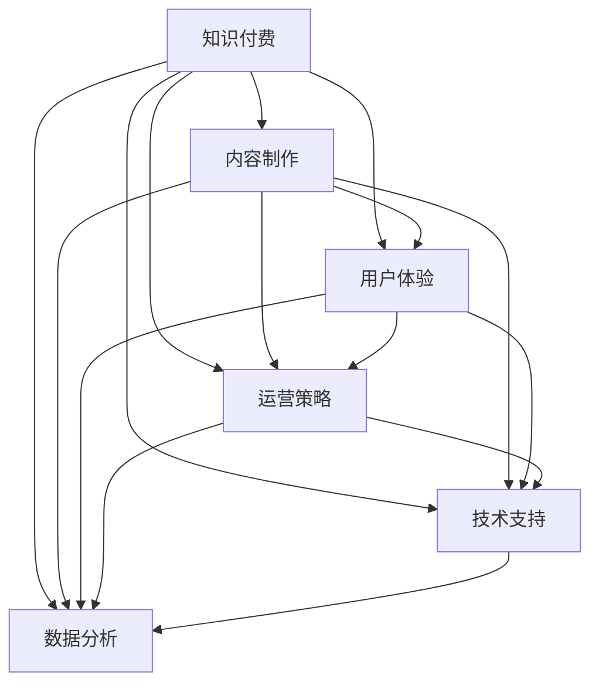

                 

# 打造爆款知识付费产品的秘诀

> 关键词：知识付费,内容制作,用户体验,运营策略,技术支持,数据分析

## 1. 背景介绍

### 1.1 问题由来
随着互联网和数字技术的发展，知识付费成为人们获取知识、提升个人价值的重要方式。然而，市场上众多知识付费产品良莠不齐，如何打造爆款知识付费产品，满足用户需求，提升商业价值，成为当前亟需解决的问题。

### 1.2 问题核心关键点
打造爆款知识付费产品，需要从内容制作、用户体验、运营策略、技术支持、数据分析等多个维度进行全面布局。具体来说：

- 内容制作：高质量的内容是知识付费产品的核心竞争力，需要系统化设计课程内容，提升课程价值。
- 用户体验：提供优质的学习体验，让用户愿意付费并持续学习。
- 运营策略：制定有效的市场推广和用户获取策略，提高产品知名度和用户黏性。
- 技术支持：利用先进的技术手段，提升课程质量和学习效率。
- 数据分析：通过数据驱动的决策，优化产品功能和服务。

### 1.3 问题研究意义
打造爆款知识付费产品，对于提升个人和企业的知识价值、促进知识传播和教育公平、加速产业升级具有重要意义。通过对内容、用户、运营、技术和数据分析的全方位研究，可以制定出系统的策略，推动知识付费市场的持续健康发展。

## 2. 核心概念与联系

### 2.1 核心概念概述

为了更好地理解如何打造爆款知识付费产品，本节将介绍几个密切相关的核心概念：

- 知识付费：通过付费形式，提供有价值、系统的知识内容，帮助用户解决具体问题，提升个人或企业能力。
- 内容制作：系统化设计课程内容，包括课程规划、内容制作、质量控制等环节。
- 用户体验：提供流畅、便捷、个性化的学习体验，提升用户满意度和忠诚度。
- 运营策略：制定科学的市场推广、用户获取、社群互动等策略，提高产品影响力和用户黏性。
- 技术支持：利用先进的技术手段，如人工智能、大数据分析等，提升课程质量和学习效率。
- 数据分析：通过数据驱动的决策，优化产品功能和服务，提升商业价值。

这些核心概念之间的逻辑关系可以通过以下Mermaid流程图来展示：



这个流程图展示了我们要打造爆款知识付费产品，需要从内容制作、用户体验、运营策略、技术支持和数据分析五个核心维度进行全面布局。每个维度之间相互作用，共同推动产品成功。

## 3. 核心算法原理 & 具体操作步骤
### 3.1 算法原理概述

打造爆款知识付费产品的核心算法原理，可以概括为"内容为王、用户至上、数据驱动、技术赋能"。具体来说：

- 内容为王：高质量的内容是知识付费产品的核心竞争力，需要系统化设计课程内容，提升课程价值。
- 用户至上：提供优质的学习体验，让用户愿意付费并持续学习。
- 数据驱动：通过数据分析，优化产品功能和服务，提升商业价值。
- 技术赋能：利用先进的技术手段，提升课程质量和学习效率。

### 3.2 算法步骤详解

打造爆款知识付费产品的详细步骤主要包括：

**Step 1: 需求分析**
- 确定目标用户群体：分析用户需求，明确课程内容的方向和重点。
- 制定课程大纲：系统化设计课程内容，包括课程主题、知识点、教学方法等。

**Step 2: 内容制作**
- 内容创作：邀请行业专家、学者、从业者等进行高质量内容创作。
- 课程录制：采用视频、音频、图文等多种形式录制课程内容。
- 质量控制：进行内容审核、校对和修订，确保课程质量。

**Step 3: 用户体验优化**
- 界面设计：优化课程界面，提升用户交互体验。
- 学习路径：设计科学合理的课程学习路径，提高用户学习效率。
- 互动功能：增加社群互动、直播答疑等互动功能，提升用户参与度。

**Step 4: 运营策略制定**
- 市场推广：制定科学的推广策略，提升产品知名度。
- 用户获取：通过社交媒体、搜索引擎等渠道获取目标用户。
- 社群互动：建立用户社群，增加用户粘性，促进用户推荐。

**Step 5: 技术支持提升**
- 技术架构：搭建高效、可扩展的技术架构，提升课程质量和学习效率。
- 数据管理：建立数据管理系统，收集用户数据，支持数据分析和个性化推荐。
- 技术创新：引入人工智能、大数据等前沿技术，提升课程质量和用户体验。

**Step 6: 数据分析优化**
- 数据收集：收集用户行为数据、学习效果数据等。
- 数据分析：利用数据分析工具，分析用户需求和课程效果。
- 优化改进：根据数据分析结果，优化课程内容和用户体验，提升产品价值。

### 3.3 算法优缺点

打造爆款知识付费产品的算法具有以下优点：
1. 系统化布局：通过全面布局内容制作、用户体验、运营策略、技术支持和数据分析，系统化提升产品价值。
2. 数据驱动决策：通过数据驱动的决策，优化产品功能和服务，提升商业价值。
3. 技术赋能：利用先进的技术手段，提升课程质量和学习效率。
4. 用户至上：关注用户需求和体验，提升用户满意度和忠诚度。

同时，该算法也存在一定的局限性：
1. 资源投入大：打造爆款知识付费产品需要大量资源投入，包括人力、资金、技术等。
2. 运营风险高：市场推广和用户获取等运营策略的不确定性较高，可能会面临失败的风险。
3. 数据隐私问题：在数据收集和分析过程中，需要处理用户隐私问题，存在一定的法律风险。
4. 技术复杂性：利用前沿技术提升产品功能和服务，需要具备较高的技术水平。

尽管存在这些局限性，但就目前而言，数据驱动和用户至上的打造爆款知识付费产品的算法，仍是最主流和有效的策略。未来相关研究的重点在于如何进一步降低资源投入，提高运营成功率，保障数据隐私，同时兼顾技术创新和用户体验优化。

### 3.4 算法应用领域

打造爆款知识付费产品的算法原理和技术流程，已经在知识付费市场的多个应用领域得到了广泛应用，例如：

- 在线教育平台：如Coursera、Udacity等，提供系统化的课程内容和高质量的学习体验。
- 职业培训平台：如LinkedIn Learning、Skillshare等，提供职业技能培训课程。
- 兴趣爱好课程：如Khan Academy、Skillshare等，提供兴趣类、生活类课程。
- 企业内部培训：如L&D部门，提供内部员工培训课程，提升企业竞争力。

除了这些传统应用外，知识付费的算法还在不断拓展到更多场景中，如K-12教育、健康管理、职业指导等，为人们的学习和生活提供了更多可能性。

## 4. 数学模型和公式 & 详细讲解 & 举例说明

### 4.1 数学模型构建

知识付费产品的成功，很大程度上取决于内容质量、用户参与度和商业转化率。以下是几个关键指标的数学模型构建：

- 内容质量：可以通过用户评价、课程难度、知识点覆盖率等指标来衡量。
- 用户参与度：包括学习时间、课程完成率、互动频率等。
- 商业转化率：包括付费转化率、课程复购率、用户留存率等。

### 4.2 公式推导过程

以付费转化率为例，推导其数学模型：

$$
\text{付费转化率} = \frac{\text{付费用户数}}{\text{总访问用户数}} \times 100\%
$$

在实际应用中，我们还需要考虑以下因素：

- 用户访问深度：即用户是否浏览了课程的深入部分。可以通过深度访问量与总访问量的比值来衡量。
- 课程推荐系统：通过推荐算法，提升用户访问深度，提高付费转化率。

### 4.3 案例分析与讲解

以Coursera平台为例，分析其成功因素：

1. **内容制作：** 高质量的课程内容是其核心竞争力，如Andrew Ng教授的《机器学习》课程，吸引了大量学习者。
2. **用户体验：** 流畅的在线学习体验，支持多种设备和平台，个性化推荐功能提高了用户学习效率。
3. **运营策略：** 科学的市场推广和用户获取策略，如社交媒体营销、合作伙伴推荐等。
4. **技术支持：** 高效的云计算平台和数据管理系统，支持大规模在线课程的部署和运营。
5. **数据分析：** 利用数据驱动的决策，优化课程内容和用户体验，提升产品价值。

Coursera的成功经验，为其他知识付费产品提供了宝贵的参考。

## 5. 项目实践：代码实例和详细解释说明
### 5.1 开发环境搭建

在进行知识付费产品开发前，我们需要准备好开发环境。以下是使用Python进行Django开发的环境配置流程：

1. 安装Anaconda：从官网下载并安装Anaconda，用于创建独立的Python环境。

2. 创建并激活虚拟环境：
```bash
conda create -n Django-env python=3.8 
conda activate Django-env
```

3. 安装Django：从官网获取对应的安装命令。例如：
```bash
pip install Django
```

4. 安装相关库：
```bash
pip install django-cms django-rest-framework markdown
```

5. 安装前端框架：
```bash
pip install django-crispy-forms bootstrap4-django-template
```

完成上述步骤后，即可在`Django-env`环境中开始开发实践。

### 5.2 源代码详细实现

这里以构建一个简单的知识付费平台为例，展示如何使用Django实现课程发布和用户学习功能。

首先，创建`models.py`文件，定义课程和用户模型：

```python
from django.db import models
from django.contrib.auth.models import AbstractUser

class Course(models.Model):
    title = models.CharField(max_length=200)
    description = models.TextField()
    creator = models.ForeignKey(AbstractUser, on_delete=models.CASCADE)

class User(models.Model):
    username = models.CharField(max_length=50)
    password = models.CharField(max_length=200)
```

然后，创建`views.py`文件，定义课程发布和用户学习视图：

```python
from django.shortcuts import render, redirect
from .models import Course, User
from .forms import CourseForm

def course_publish(request):
    if request.method == 'POST':
        form = CourseForm(request.POST)
        if form.is_valid():
            form.save()
            return redirect('course_publish')
    else:
        form = CourseForm()
    return render(request, 'course_publish.html', {'form': form})

def course_study(request, course_id):
    course = Course.objects.get(id=course_id)
    return render(request, 'course_study.html', {'course': course})
```

接着，创建`forms.py`文件，定义课程发布表单：

```python
from django import forms
from .models import Course

class CourseForm(forms.ModelForm):
    class Meta:
        model = Course
        fields = ['title', 'description', 'creator']
```

最后，创建`urls.py`文件，定义路由：

```python
from django.urls import path
from . import views

urlpatterns = [
    path('course_publish/', views.course_publish, name='course_publish'),
    path('course_study/<int:course_id>/', views.course_study, name='course_study'),
]
```

运行以上代码，即可构建一个简单的知识付费平台，用户可以发布课程和进行学习。

### 5.3 代码解读与分析

这里我们详细解读一下关键代码的实现细节：

**models.py文件：**
- `Course`模型：定义了课程的标题、描述和创作者。
- `User`模型：继承自Django自带的`AbstractUser`模型，用于定义用户信息。

**views.py文件：**
- `course_publish`视图：处理课程发布逻辑，如果表单验证通过，则保存课程信息并返回发布页面。
- `course_study`视图：处理课程学习逻辑，根据课程ID获取课程信息并渲染学习页面。

**forms.py文件：**
- `CourseForm`表单：定义了课程发布表单，包括标题、描述和创作者。

**urls.py文件：**
- 定义了`course_publish`和`course_study`两个路由，对应发布和学习的URL地址。

以上代码展示了如何使用Django快速构建知识付费平台的课程发布和用户学习功能。开发者可以根据实际需求，进一步扩展功能，如课程推荐、支付系统等。

## 6. 实际应用场景
### 6.1 在线教育平台

知识付费平台已经成为在线教育的重要组成部分。用户可以通过付费获得系统化的课程内容，提升自身能力和职业竞争力。

在技术实现上，可以采用微服务架构，提供课程发布、学习、推荐等功能模块。通过API接口，用户可以访问课程信息，并进行互动学习。同时，引入数据分析工具，优化课程内容和用户体验，提升用户满意度和转化率。

### 6.2 职业培训平台

许多企业和机构需要定期对员工进行职业技能培训，以提高团队整体素质。知识付费平台可以帮助这些企业和机构快速获取高质量的培训课程。

在技术实现上，可以搭建私有化培训平台，提供内部员工培训课程。通过统一管理平台，管理员可以轻松发布和更新课程内容，用户可以随时随地进行学习。同时，利用数据分析工具，分析用户学习行为，优化课程设计和推荐。

### 6.3 兴趣爱好课程

知识付费平台还可以提供兴趣类、生活类课程，满足用户的个性化学习需求。

在技术实现上，可以采用订阅模式，用户可以选择感兴趣的课程进行订阅学习。通过推荐系统，为用户推荐感兴趣的内容，提升用户粘性和参与度。同时，引入用户评论和评分系统，提升课程质量。

### 6.4 企业内部培训

企业内部培训需要高质量的课程内容和科学的培训策略。知识付费平台可以提供系统化的培训课程和数据支持。

在技术实现上，可以搭建企业内部培训平台，提供丰富的培训课程和互动学习功能。通过数据分析，优化培训策略，提高培训效果。同时，引入社交化学习功能，促进用户互动和知识分享。

### 6.5 未来应用展望

随着知识付费市场的不断扩展，未来知识付费平台将呈现以下几个发展趋势：

1. 多模态课程：结合文字、视频、音频等多媒体内容，提升课程互动性和学习效果。
2. 动态课程：根据用户学习行为和反馈，动态调整课程内容和难度，提升用户学习体验。
3. 实时交互：引入实时交互功能，如在线答疑、直播互动等，提高用户参与度。
4. 个性化推荐：通过数据分析，为用户提供个性化课程推荐，提升用户黏性。
5. 社交化学习：引入社交化学习功能，促进用户互动和知识分享，提升用户参与度。

以上趋势凸显了知识付费平台的广阔前景。这些方向的探索发展，将进一步提升平台的用户体验和商业价值。

## 7. 工具和资源推荐
### 7.1 学习资源推荐

为了帮助开发者系统掌握知识付费产品的技术基础和应用技巧，这里推荐一些优质的学习资源：

1. Django官方文档：Django的官方文档，详细介绍了Django的开发框架和API接口，是学习Django开发的必备资料。
2. Django实战教程：通过实际案例，展示Django的开发流程和技巧，帮助你快速上手。
3. Coursera平台学习资源：Coursera平台上提供的在线课程，涵盖各种知识付费产品的开发实践。
4. 《知识付费：构建商业模式》书籍：系统介绍知识付费产品的商业模式和运营策略，为知识付费产品的成功提供了理论支持。
5. Kaggle平台数据分析资源：Kaggle上提供的各种数据分析竞赛和数据集，帮助你提升数据分析能力。

通过对这些资源的学习实践，相信你一定能够快速掌握知识付费产品的核心技术，并用于解决实际的NLP问题。
###  7.2 开发工具推荐

高效的开发离不开优秀的工具支持。以下是几款用于知识付费产品开发的常用工具：

1. Django：Python的Web开发框架，灵活性强、扩展性高，适合快速迭代开发。
2. Docker：开源容器化平台，可以方便地进行应用部署和管理。
3. Jenkins：开源自动化工具，支持持续集成和持续部署，提高开发效率。
4. Kubernetes：开源容器编排工具，支持大规模应用的部署和管理。
5. Redis：高性能的内存数据库，用于缓存和消息队列，提升系统性能。
6. Apache Kafka：高性能的分布式消息队列，支持实时数据处理和流式计算。

合理利用这些工具，可以显著提升知识付费产品的开发效率，加快创新迭代的步伐。

### 7.3 相关论文推荐

知识付费产品的成功源于学界的持续研究。以下是几篇奠基性的相关论文，推荐阅读：

1. <i>"The Future of Digital Learning: Navigating the Opportunities and Challenges"</i>：介绍了数字学习的发展趋势和面临的挑战，为知识付费产品的开发提供了理论支持。
2. <i>"Designing Effective Online Courses: Principles and Practices"</i>：介绍了在线课程的设计原则和实践方法，为知识付费产品的课程设计提供了指导。
3. <i>"Machine Learning in Education: A Survey"</i>：介绍了机器学习在教育中的应用，为知识付费产品的智能化发展提供了技术支持。
4. <i>"Social Learning Analytics: Methods and Systems"</i>：介绍了社会学习分析的方法和系统，为知识付费产品的用户互动和知识分享提供了技术支持。
5. <i>"Pricing Strategies for Online Courses: A Systematic Review"</i>：介绍了在线课程的定价策略，为知识付费产品的商业模式提供了理论支持。

这些论文代表了大语言模型微调技术的发展脉络。通过学习这些前沿成果，可以帮助研究者把握学科前进方向，激发更多的创新灵感。

## 8. 总结：未来发展趋势与挑战
### 8.1 总结

本文对打造爆款知识付费产品的算法原理和技术流程进行了全面系统的介绍。首先阐述了知识付费产品的背景和核心关键点，明确了内容制作、用户体验、运营策略、技术支持、数据分析五个核心维度的重要性。其次，从算法原理到操作步骤，详细讲解了知识付费产品的开发流程和关键技术。同时，本文还广泛探讨了知识付费产品在在线教育、职业培训、兴趣爱好、企业内部培训等多个领域的应用前景，展示了知识付费平台的广阔发展空间。此外，本文精选了知识付费产品的学习资源、开发工具和相关论文，力求为开发者提供全方位的技术指引。

通过本文的系统梳理，可以看到，打造爆款知识付费产品需要全面布局内容制作、用户体验、运营策略、技术支持和数据分析，系统化提升产品价值。伴随知识付费市场的不断扩展，未来的知识付费平台将更加注重多模态课程、动态课程、实时交互、个性化推荐和社交化学习等功能，提升用户体验和商业价值。

### 8.2 未来发展趋势

展望未来，知识付费产品的市场将呈现以下几个发展趋势：

1. 多模态课程：结合文字、视频、音频等多媒体内容，提升课程互动性和学习效果。
2. 动态课程：根据用户学习行为和反馈，动态调整课程内容和难度，提升用户学习体验。
3. 实时交互：引入实时交互功能，如在线答疑、直播互动等，提高用户参与度。
4. 个性化推荐：通过数据分析，为用户提供个性化课程推荐，提升用户黏性。
5. 社交化学习：引入社交化学习功能，促进用户互动和知识分享，提升用户参与度。

以上趋势凸显了知识付费产品的广阔前景。这些方向的探索发展，将进一步提升平台的用户体验和商业价值，推动知识付费市场的持续健康发展。

### 8.3 面临的挑战

尽管知识付费产品取得了一定的成功，但在迈向更加智能化、普适化应用的过程中，它仍面临着诸多挑战：

1. 运营风险高：市场推广和用户获取等运营策略的不确定性较高，可能会面临失败的风险。
2. 用户留存难：课程质量和用户体验的提升需要不断迭代和优化，如何持续保持用户粘性是一个挑战。
3. 课程内容更新：随着知识和技术的不断变化，课程内容需要及时更新，以保持最新性和实用性。
4. 数据分析复杂：大数据分析和用户行为分析需要强大的技术支持，如何有效利用数据提升产品价值。
5. 隐私保护问题：在数据收集和分析过程中，需要处理用户隐私问题，存在一定的法律风险。

尽管存在这些挑战，但知识付费产品的发展前景仍然十分广阔。通过不断优化运营策略、提升课程质量和用户体验、加强数据分析和隐私保护，知识付费平台将在未来持续健康发展。

### 8.4 研究展望

面向未来，知识付费产品的发展需要以下几个方面的突破：

1. 数据驱动决策：利用大数据分析，优化课程内容和用户体验，提升产品价值。
2. 技术创新：引入前沿技术，如机器学习、人工智能等，提升课程质量和用户互动性。
3. 个性化推荐：通过数据分析，提供个性化课程推荐，提升用户黏性。
4. 多模态课程：结合文字、视频、音频等多媒体内容，提升课程互动性和学习效果。
5. 实时交互：引入实时交互功能，如在线答疑、直播互动等，提高用户参与度。

这些方向的探索发展，将进一步提升知识付费产品的用户体验和商业价值，推动知识付费市场的持续健康发展。

## 9. 附录：常见问题与解答

**Q1：如何提升知识付费产品的用户粘性？**

A: 提升知识付费产品的用户粘性，可以从以下几个方面入手：
1. 提升课程质量：提供高质量、实用性强、符合用户需求的课程内容。
2. 个性化推荐：利用数据分析，为用户推荐感兴趣的课程和内容。
3. 社交化学习：引入社交化学习功能，促进用户互动和知识分享。
4. 持续更新：定期更新课程内容，保持课程的最新性和实用性。
5. 优质服务：提供优质客服和社群互动，解决用户问题，增强用户粘性。

**Q2：知识付费产品如何应对市场推广的挑战？**

A: 知识付费产品需要制定科学的市场推广和用户获取策略，以应对市场推广的挑战：
1. 多渠道推广：利用社交媒体、搜索引擎、邮件营销等多种渠道进行推广。
2. 精准定位：明确目标用户群体，进行精准推广，提高推广效果。
3. 内容营销：通过优质的课程内容吸引用户，提高用户转化率。
4. 品牌建设：通过品牌建设和用户口碑，提升产品知名度和用户信任度。
5. 持续优化：根据推广效果和用户反馈，持续优化推广策略，提高推广效果。

**Q3：如何提高知识付费产品的商业价值？**

A: 提高知识付费产品的商业价值，需要从以下几个方面进行优化：
1. 提升课程质量：提供高质量、实用性强、符合用户需求的课程内容。
2. 个性化推荐：利用数据分析，提升用户转化率和复购率。
3. 多模态课程：结合文字、视频、音频等多媒体内容，提升课程互动性和学习效果。
4. 动态课程：根据用户学习行为和反馈，动态调整课程内容和难度，提升用户学习体验。
5. 实时交互：引入实时交互功能，如在线答疑、直播互动等，提高用户参与度。

**Q4：如何平衡课程内容和商业转化率？**

A: 平衡课程内容和商业转化率，需要从以下几个方面进行优化：
1. 明确目标用户：根据目标用户需求，设计符合用户需求的课程内容。
2. 高质量内容：提供高质量、实用性强、符合用户需求的课程内容。
3. 合理定价：根据课程价值和用户需求，制定合理的定价策略。
4. 课程推荐：利用数据分析，为用户推荐感兴趣的课程和内容。
5. 优质服务：提供优质客服和社群互动，解决用户问题，增强用户黏性。

**Q5：知识付费产品如何利用大数据进行数据分析？**

A: 利用大数据进行数据分析，可以从以下几个方面入手：
1. 数据收集：收集用户行为数据、学习效果数据等。
2. 数据清洗：对数据进行清洗和处理，去除噪音和异常值。
3. 数据分析：利用数据分析工具，分析用户需求和课程效果。
4. 结果应用：根据数据分析结果，优化课程内容和用户体验，提升产品价值。
5. 持续优化：根据数据分析结果，持续优化产品功能和服务，提升商业价值。

这些数据驱动的决策，将帮助知识付费产品优化课程内容和用户体验，提升用户满意度和转化率，实现商业价值的最大化。

---

作者：禅与计算机程序设计艺术 / Zen and the Art of Computer Programming

