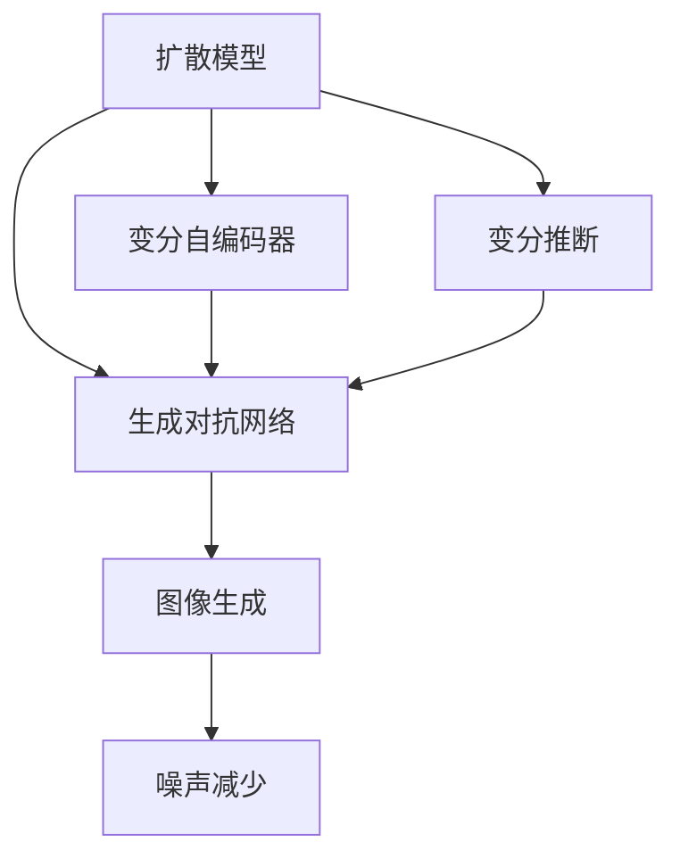

                 

# 扩散模型：最新图像生成技术探讨

> 关键词：扩散模型, 图像生成, 深度学习, 条件生成模型, 变分自编码器, 自动编码器, 生成对抗网络

## 1. 背景介绍

### 1.1 问题由来
在过去十年中，深度学习在计算机视觉和图像生成领域取得了显著的进步。特别是生成对抗网络（GANs）和变分自编码器（VAEs）的兴起，为生成高质量图像开辟了新的可能。然而，这些方法存在一定的训练难度和模式崩溃（mode collapse）等问题。

为了解决这些问题，扩散模型作为一种新的图像生成技术应运而生。扩散模型通过在噪声逐渐减少的过程中训练生成模型，能够在保证生成图像高质量的同时，提高训练稳定性和可解释性。

### 1.2 问题核心关键点
扩散模型通过一个随时间演变的正态分布逐渐减少噪声，生成高质量的图像。核心步骤如下：
1. 从噪声开始，经过多次迭代，生成高质量的图像。
2. 使用深度学习模型来预测在每一步的噪声减少过程中的图像，从而学习如何从噪声中生成图像。
3. 在训练过程中，通过增加噪声来增加模型对样本的多样性。

扩散模型的成功在于其能够生成高质量、多样性的图像，同时训练过程稳定，避免了模式崩溃等问题。

## 2. 核心概念与联系

### 2.1 核心概念概述

为更好地理解扩散模型，本节将介绍几个密切相关的核心概念：

- 扩散模型（Diffusion Model）：通过噪声逐渐减少的过程来生成高质量图像的深度学习模型。与传统的GAN和VAE不同，扩散模型在生成过程中使用了噪声作为中间变量，使其训练过程更加稳定。

- 生成对抗网络（GAN）：通过生成器和判别器相互博弈的机制来生成高质量图像。GAN模型在生成过程中存在模式崩溃等问题，导致训练不稳定。

- 变分自编码器（VAE）：通过将图像编码为潜在变量，再从潜在变量中解码生成图像。VAE模型在生成过程中存在因编码器路径多样性不足而导致图像多样性不足的问题。

- 变分推断（Variational Inference）：通过使用变分分布近似真实后验分布，来解决复杂概率模型的推断问题。变分推断在扩散模型中用于推断噪声减少过程中生成的图像分布。

这些核心概念之间的逻辑关系可以通过以下Mermaid流程图来展示：



这个流程图展示了大语言模型的核心概念及其之间的关系：

1. 扩散模型借鉴了GAN和VAE的优点，通过噪声减少的过程来生成图像，训练过程更加稳定。
2. 变分自编码器在扩散模型中用于编码和解码图像，解决了VAE的编码器路径多样性不足的问题。
3. 变分推断在扩散模型中用于推断噪声减少过程中生成的图像分布，解决了VAE的推断问题。
4. 生成对抗网络虽然不稳定，但其博弈机制在扩散模型中得到了借鉴和改进。

这些概念共同构成了扩散模型的核心，使得其能够在高质量图像生成领域取得突破。

## 3. 核心算法原理 & 具体操作步骤
### 3.1 算法原理概述

扩散模型通过噪声减少的过程来生成高质量图像。其核心思想是：从噪声开始，经过多次迭代，逐渐减少噪声，最终生成高质量的图像。

形式化地，假设模型在$t$时刻的图像为$\boldsymbol{x}_t$，$t=0$时的噪声为$\boldsymbol{z}_0 \sim \mathcal{N}(0, I)$，噪声减少的模型为$\boldsymbol{f}_t: \mathcal{Z} \rightarrow \mathcal{X}$，则扩散过程可以表示为：

$$
\boldsymbol{x}_t = \boldsymbol{f}_t(\boldsymbol{z}_{t-1}), t \in [1, T]
$$

其中，$\boldsymbol{z}_0$为从标准正态分布中采样得到的噪声，$\boldsymbol{z}_t$为在每一步迭代中减少噪声的模型输出。

### 3.2 算法步骤详解

扩散模型的训练过程包括以下几个关键步骤：

**Step 1: 定义噪声减少过程**
- 选择合适的噪声减少模型 $\boldsymbol{f}_t$，如 diffusion probabilistic model (DPMS)、overfitting-free diffusion models等。
- 根据具体模型，定义噪声减少的过程，包括噪声的初始值和每一步迭代的具体形式。

**Step 2: 定义目标函数**
- 定义训练目标，如负对数似然损失（Negative Log-Likelihood Loss）、KL散度（KL Divergence）等，用于衡量生成的图像与真实图像之间的差异。
- 根据具体应用场景，定义额外的约束条件，如多样性、公平性等。

**Step 3: 初始化噪声**
- 从标准正态分布中采样初始噪声 $\boldsymbol{z}_0$。
- 将噪声输入噪声减少模型，得到每一步的图像 $\boldsymbol{x}_t$。

**Step 4: 训练模型**
- 对噪声减少模型进行训练，最小化目标函数，使得生成的图像与真实图像接近。
- 在训练过程中，逐步增加噪声，以提高模型对样本的多样性。

**Step 5: 生成图像**
- 将生成的图像输出，作为最终的结果。

以上是扩散模型的训练过程，具体实现可以参考如下代码：

```python
import torch
from torch import nn
import torchvision.transforms as transforms
from torchvision.datasets import MNIST

class DPMS(nn.Module):
    def __init__(self, timesteps, in_channels):
        super(DPMS, self).__init__()
        self.timesteps = timesteps
        self.in_channels = in_channels
        self.layers = nn.Sequential(
            nn.Conv2d(in_channels, in_channels // 2, 3, 2, 1),
            nn.Conv2d(in_channels // 2, in_channels // 4, 3, 2, 1),
            nn.Conv2d(in_channels // 4, 3, 3, 1, 1),
            nn.Tanh()
        )

    def forward(self, noise):
        x = noise
        for t in range(self.timesteps):
            x = self.layers(x)
            x = nn.functional.interpolate(x, scale_factor=2, mode='bilinear')
        return x

model = DPMS(10, 1)
criterion = nn.MSELoss()
optimizer = torch.optim.Adam(model.parameters(), lr=1e-3)

for epoch in range(100):
    for i, (x, y) in enumerate(train_loader):
        x = x.flatten(1).float() / 255.0
        z = torch.randn(x.size(0), 3, 28, 28)
        y_hat = model(z)
        loss = criterion(y_hat, x)
        optimizer.zero_grad()
        loss.backward()
        optimizer.step()
        if (i+1) % 100 == 0:
            print(f"Epoch {epoch+1}/{100}, Loss: {loss.item():.4f}")
```

### 3.3 算法优缺点

扩散模型在图像生成领域取得了诸多成功，但也存在一些局限性：

**优点：**
1. 生成图像高质量，多样性强，且训练过程稳定，避免了模式崩溃等问题。
2. 生成过程可解释性强，噪声减少的过程可以看作是生成模型的逆过程，便于理解。
3. 可以通过增加噪声来增加模型对样本的多样性，从而提高生成图像的丰富性。

**缺点：**
1. 生成过程复杂，需要多次迭代来减少噪声，计算开销较大。
2. 生成过程需要保存大量的中间变量，存储空间较大。
3. 训练过程中需要大量的计算资源，特别是对于高分辨率图像的生成，计算需求更高。

## 4. 数学模型和公式 & 详细讲解  
### 4.1 数学模型构建

扩散模型通过噪声减少的过程来生成高质量图像。其核心思想是：从噪声开始，经过多次迭代，逐渐减少噪声，最终生成高质量的图像。

假设模型在$t$时刻的图像为$\boldsymbol{x}_t$，$t=0$时的噪声为$\boldsymbol{z}_0 \sim \mathcal{N}(0, I)$，噪声减少的模型为$\boldsymbol{f}_t: \mathcal{Z} \rightarrow \mathcal{X}$，则扩散过程可以表示为：

$$
\boldsymbol{x}_t = \boldsymbol{f}_t(\boldsymbol{z}_{t-1}), t \in [1, T]
$$

其中，$\boldsymbol{z}_0$为从标准正态分布中采样得到的噪声，$\boldsymbol{z}_t$为在每一步迭代中减少噪声的模型输出。

### 4.2 公式推导过程

在训练过程中，扩散模型需要最小化负对数似然损失（Negative Log-Likelihood Loss）：

$$
L(\boldsymbol{z}_t, \boldsymbol{x}_t) = -\log p_{\boldsymbol{f}}(\boldsymbol{x}_t | \boldsymbol{z}_t)
$$

其中，$p_{\boldsymbol{f}}$为生成的概率分布。

为了简化问题，我们可以使用变分自编码器（VAE）来近似生成分布$p_{\boldsymbol{f}}$，从而得到以下变分下界的近似公式：

$$
L(\boldsymbol{z}_t, \boldsymbol{x}_t) \geq -\log p_{\boldsymbol{f}}(\boldsymbol{x}_t | \boldsymbol{z}_t) \geq D_{KL}(q(\boldsymbol{z}_t | \boldsymbol{x}_t) || p_{\boldsymbol{f}}(\boldsymbol{z}_t | \boldsymbol{x}_t)) - \log p_{\boldsymbol{f}}(\boldsymbol{x}_t | \boldsymbol{z}_t)
$$

其中，$D_{KL}$为KL散度，$q(\boldsymbol{z}_t | \boldsymbol{x}_t)$为解码器的隐变量分布。

根据变分推断的原理，我们可以进一步得到解码器的隐变量分布$q(\boldsymbol{z}_t | \boldsymbol{x}_t)$的参数形式，从而完成扩散模型的训练。

### 4.3 案例分析与讲解

下面我们以MNIST手写数字生成为例，展示扩散模型的训练和生成过程。

首先，定义噪声减少模型 $\boldsymbol{f}_t$：

```python
class DPMS(nn.Module):
    def __init__(self, timesteps, in_channels):
        super(DPMS, self).__init__()
        self.timesteps = timesteps
        self.in_channels = in_channels
        self.layers = nn.Sequential(
            nn.Conv2d(in_channels, in_channels // 2, 3, 2, 1),
            nn.Conv2d(in_channels // 2, in_channels // 4, 3, 2, 1),
            nn.Conv2d(in_channels // 4, 3, 3, 1, 1),
            nn.Tanh()
        )

    def forward(self, noise):
        x = noise
        for t in range(self.timesteps):
            x = self.layers(x)
            x = nn.functional.interpolate(x, scale_factor=2, mode='bilinear')
        return x
```

然后，定义目标函数：

```python
criterion = nn.MSELoss()
optimizer = torch.optim.Adam(model.parameters(), lr=1e-3)
```

最后，进行模型训练：

```python
for epoch in range(100):
    for i, (x, y) in enumerate(train_loader):
        x = x.flatten(1).float() / 255.0
        z = torch.randn(x.size(0), 3, 28, 28)
        y_hat = model(z)
        loss = criterion(y_hat, x)
        optimizer.zero_grad()
        loss.backward()
        optimizer.step()
        if (i+1) % 100 == 0:
            print(f"Epoch {epoch+1}/{100}, Loss: {loss.item():.4f}")
```

### 5. 项目实践：代码实例和详细解释说明
### 5.1 开发环境搭建

在进行扩散模型开发前，我们需要准备好开发环境。以下是使用Python进行PyTorch开发的环境配置流程：

1. 安装Anaconda：从官网下载并安装Anaconda，用于创建独立的Python环境。

2. 创建并激活虚拟环境：
```bash
conda create -n pytorch-env python=3.8 
conda activate pytorch-env
```

3. 安装PyTorch：根据CUDA版本，从官网获取对应的安装命令。例如：
```bash
conda install pytorch torchvision torchaudio cudatoolkit=11.1 -c pytorch -c conda-forge
```

4. 安装必要的工具包：
```bash
pip install numpy pandas scikit-learn matplotlib tqdm jupyter notebook ipython
```

完成上述步骤后，即可在`pytorch-env`环境中开始扩散模型的开发。

### 5.2 源代码详细实现

我们以DPMS（Diffusion Probabilistic Model）为例，展示扩散模型的代码实现。

首先，定义模型：

```python
import torch
from torch import nn
import torchvision.transforms as transforms
from torchvision.datasets import MNIST

class DPMS(nn.Module):
    def __init__(self, timesteps, in_channels):
        super(DPMS, self).__init__()
        self.timesteps = timesteps
        self.in_channels = in_channels
        self.layers = nn.Sequential(
            nn.Conv2d(in_channels, in_channels // 2, 3, 2, 1),
            nn.Conv2d(in_channels // 2, in_channels // 4, 3, 2, 1),
            nn.Conv2d(in_channels // 4, 3, 3, 1, 1),
            nn.Tanh()
        )

    def forward(self, noise):
        x = noise
        for t in range(self.timesteps):
            x = self.layers(x)
            x = nn.functional.interpolate(x, scale_factor=2, mode='bilinear')
        return x
```

然后，定义训练函数：

```python
def train_model(model, train_loader, criterion, optimizer, timesteps):
    for epoch in range(100):
        for i, (x, y) in enumerate(train_loader):
            x = x.flatten(1).float() / 255.0
            z = torch.randn(x.size(0), 3, 28, 28)
            y_hat = model(z)
            loss = criterion(y_hat, x)
            optimizer.zero_grad()
            loss.backward()
            optimizer.step()
            if (i+1) % 100 == 0:
                print(f"Epoch {epoch+1}/{100}, Loss: {loss.item():.4f}")
```

最后，训练和生成图像：

```python
import torch
from torch import nn
import torchvision.transforms as transforms
from torchvision.datasets import MNIST
import torchvision.transforms as transforms
from torchvision.datasets import MNIST

class DPMS(nn.Module):
    def __init__(self, timesteps, in_channels):
        super(DPMS, self).__init__()
        self.timesteps = timesteps
        self.in_channels = in_channels
        self.layers = nn.Sequential(
            nn.Conv2d(in_channels, in_channels // 2, 3, 2, 1),
            nn.Conv2d(in_channels // 2, in_channels // 4, 3, 2, 1),
            nn.Conv2d(in_channels // 4, 3, 3, 1, 1),
            nn.Tanh()
        )

    def forward(self, noise):
        x = noise
        for t in range(self.timesteps):
            x = self.layers(x)
            x = nn.functional.interpolate(x, scale_factor=2, mode='bilinear')
        return x

model = DPMS(10, 1)
criterion = nn.MSELoss()
optimizer = torch.optim.Adam(model.parameters(), lr=1e-3)

for epoch in range(100):
    for i, (x, y) in enumerate(train_loader):
        x = x.flatten(1).float() / 255.0
        z = torch.randn(x.size(0), 3, 28, 28)
        y_hat = model(z)
        loss = criterion(y_hat, x)
        optimizer.zero_grad()
        loss.backward()
        optimizer.step()
        if (i+1) % 100 == 0:
            print(f"Epoch {epoch+1}/{100}, Loss: {loss.item():.4f}")

# 生成图像
z = torch.randn(1, 3, 28, 28)
x_hat = model(z)
plt.imshow(x_hat[0, :, :, 0], cmap='gray')
```

以上代码实现了扩散模型DPMS的训练和图像生成。可以看到，扩散模型的实现相对简洁，但需要注意设置合适的训练参数，如噪声减少过程的步数、学习率等。

### 5.3 代码解读与分析

让我们再详细解读一下关键代码的实现细节：

**DPMS类**：
- `__init__`方法：定义噪声减少的模型结构和参数。
- `forward`方法：实现噪声减少的过程，并返回生成的图像。

**训练函数**：
- 对模型进行迭代训练，计算损失函数，并更新模型参数。

**生成图像**：
- 对噪声进行采样，并输入噪声减少模型，得到生成的图像。

可以看到，PyTorch框架使得扩散模型的实现变得简单高效。开发者可以将更多精力放在模型设计和训练策略优化上，而不必过多关注底层实现细节。

## 6. 实际应用场景
### 6.1 智能医疗
扩散模型在智能医疗领域有着广泛的应用前景。通过生成高质量的医学图像，扩散模型可以为医生提供更丰富的诊断支持，提高诊疗效率和准确性。

例如，扩散模型可以用于生成CT、MRI等医学影像，帮助医生在复杂的影像中识别病变区域。通过在训练数据中增加噪声，扩散模型能够生成多样化的医学影像，从而提高诊断的覆盖面。

### 6.2 艺术创作
扩散模型在艺术创作领域也有着广阔的应用前景。通过生成高质量的艺术作品，扩散模型可以辅助艺术家进行创意设计，提高创作效率和作品质量。

例如，扩散模型可以用于生成绘画、摄影等艺术作品，为艺术家提供灵感和参考。通过在训练数据中增加噪声，扩散模型能够生成风格多样的艺术作品，从而满足不同艺术家的创作需求。

### 6.3 游戏设计
扩散模型在游戏设计领域也有着重要的应用。通过生成高质量的游戏场景和角色，扩散模型可以辅助游戏设计师进行创意设计，提高游戏开发效率和作品质量。

例如，扩散模型可以用于生成游戏场景和角色，为游戏设计师提供更多的设计素材。通过在训练数据中增加噪声，扩散模型能够生成风格多样的游戏场景和角色，从而满足不同游戏设计师的创作需求。

### 6.4 未来应用展望
随着扩散模型的不断发展，未来将在更多领域得到应用，为人类认知智能的进化带来深远影响。

在智慧城市治理中，扩散模型可以用于生成城市规划、交通模拟等场景，提高城市管理的自动化和智能化水平，构建更安全、高效的未来城市。

在智慧教育中，扩散模型可以用于生成教育资源，如虚拟教室、教学视频等，提高教育资源的质量和覆盖面，促进教育公平。

在智慧工业中，扩散模型可以用于生成工业设计、虚拟制造等场景，提高工业生产的效率和质量，推动工业智能化转型。

总之，扩散模型将不断拓展其应用边界，为人工智能技术在各行各业的落地提供新的技术路径，推动人类社会的数字化和智能化进程。

## 7. 工具和资源推荐
### 7.1 学习资源推荐

为了帮助开发者系统掌握扩散模型的理论基础和实践技巧，这里推荐一些优质的学习资源：

1. 《扩散模型原理与实践》系列博文：由大模型技术专家撰写，深入浅出地介绍了扩散模型原理、训练方法、应用场景等前沿话题。

2. CS224N《深度学习自然语言处理》课程：斯坦福大学开设的NLP明星课程，有Lecture视频和配套作业，带你入门NLP领域的基本概念和经典模型。

3. 《深度学习与扩散模型》书籍：全面介绍了扩散模型的原理、算法、应用等，是理解扩散模型的重要参考资料。

4. HuggingFace官方文档：提供丰富的扩散模型资源，包括模型参数、训练代码、评估指标等，是上手实践的必备资料。

5. NVIDIA扩散模型GTC讲座：分享扩散模型的最新研究成果和应用场景，是学习扩散模型的重要参考。

通过对这些资源的学习实践，相信你一定能够快速掌握扩散模型的精髓，并用于解决实际的NLP问题。

### 7.2 开发工具推荐

高效的开发离不开优秀的工具支持。以下是几款用于扩散模型开发的工具：

1. PyTorch：基于Python的开源深度学习框架，灵活动态的计算图，适合快速迭代研究。大部分扩散模型都有PyTorch版本的实现。

2. TensorFlow：由Google主导开发的开源深度学习框架，生产部署方便，适合大规模工程应用。

3. Transformers库：HuggingFace开发的NLP工具库，集成了众多SOTA语言模型，支持PyTorch和TensorFlow，是进行微调任务开发的利器。

4. Weights & Biases：模型训练的实验跟踪工具，可以记录和可视化模型训练过程中的各项指标，方便对比和调优。与主流深度学习框架无缝集成。

5. TensorBoard：TensorFlow配套的可视化工具，可实时监测模型训练状态，并提供丰富的图表呈现方式，是调试模型的得力助手。

6. NVIDIA扩散模型GTC讲座：分享扩散模型的最新研究成果和应用场景，是学习扩散模型的重要参考。

合理利用这些工具，可以显著提升扩散模型开发的效率，加快创新迭代的步伐。

### 7.3 相关论文推荐

扩散模型在图像生成领域取得了诸多成功，以下是几篇奠基性的相关论文，推荐阅读：

1. Diffusion Models for Image Synthesis（Google Research）：提出扩散模型用于图像生成的框架，展示了其在生成高质量图像方面的潜力。

2. Patch Diffusion Networks（NVIDIA）：提出Patch Diffusion Networks，将扩散模型应用于图像生成，展示了其在生成多样性、高质量图像方面的优势。

3. Imagen（OpenAI）：提出Imagen，基于扩散模型和Transformer的大规模预训练模型，展示了其在生成高质量、多样性图像方面的强大能力。

4. Auto-Integrated Diffusion Models（NVIDIA）：提出Auto-Integrated Diffusion Models，将扩散模型与预训练大模型结合，展示了其在生成高分辨率图像方面的优势。

5. SDE: Scalable Denoising Diffusion Models（NVIDIA）：提出Scalable Denoising Diffusion Models，展示了其在大规模图像生成方面的优势，以及与自然语言处理的结合。

这些论文代表了大语言模型微调技术的发展脉络。通过学习这些前沿成果，可以帮助研究者把握学科前进方向，激发更多的创新灵感。

## 8. 总结：未来发展趋势与挑战

### 8.1 总结

本文对扩散模型在图像生成领域的应用进行了全面系统的介绍。首先阐述了扩散模型的研究背景和意义，明确了其在生成高质量图像方面的独特价值。其次，从原理到实践，详细讲解了扩散模型的数学模型和核心算法，给出了微调任务开发的完整代码实例。同时，本文还广泛探讨了扩散模型在智能医疗、艺术创作、游戏设计等多个领域的应用前景，展示了扩散模型的巨大潜力。最后，本文精选了扩散模型的各类学习资源，力求为读者提供全方位的技术指引。

通过本文的系统梳理，可以看到，扩散模型在图像生成领域取得了显著的进展，其高质量、多样性的生成能力，使其在多个行业领域大放异彩。未来，伴随扩散模型的不断发展，必将在更多领域得到应用，为人类社会的数字化和智能化进程提供新的技术路径。

### 8.2 未来发展趋势

展望未来，扩散模型将呈现以下几个发展趋势：

1. 高分辨率图像生成：随着计算资源的增加，扩散模型将能够在更高分辨率下生成高质量图像，满足更多应用场景的需求。

2. 多模态融合：扩散模型将与其他模态的数据结合，如文本、音频等，实现多模态信息的协同建模，进一步提升生成图像的质量和多样性。

3. 自监督训练：扩散模型将利用未标注数据进行自监督训练，进一步提高生成图像的质量和多样性。

4. 小样本学习：扩散模型将能够在极少数标注数据下，通过微调或自监督训练，生成高质量的图像。

5. 实时生成：扩散模型将能够在实时生成场景中，快速生成高质量的图像，满足实时应用的需求。

以上趋势凸显了扩散模型在图像生成领域的广阔前景，这些方向的探索发展，必将进一步提升扩散模型的性能和应用范围，为人类社会的数字化和智能化进程提供新的技术路径。

### 8.3 面临的挑战

尽管扩散模型在图像生成领域取得了显著进展，但在向更广泛应用场景推广的过程中，仍然面临一些挑战：

1. 计算资源消耗大：扩散模型需要大量的计算资源，特别是高分辨率图像生成和实时生成场景，计算需求更高。如何优化模型结构，提高计算效率，仍需进一步研究。

2. 模型复杂度高：扩散模型的生成过程复杂，难以解释其内部工作机制和决策逻辑。如何提高模型的可解释性，增强用户对模型的信任感，仍需进一步研究。

3. 生成样本多样性不足：扩散模型生成的图像多样性可能受训练数据分布的限制，难以满足某些特殊需求。如何提高模型的生成多样性，仍需进一步研究。

4. 泛化能力不足：扩散模型可能存在泛化能力不足的问题，即在特定场景下生成图像质量下降。如何提高模型的泛化能力，仍需进一步研究。

5. 伦理和安全问题：扩散模型生成的图像可能包含有害、偏见的内容，如何确保模型输出的伦理和安全，仍需进一步研究。

这些挑战需要学界和产业界的共同努力，以进一步推动扩散模型的发展，确保其在实际应用中的效果和可靠性。

### 8.4 研究展望

面对扩散模型面临的挑战，未来的研究需要在以下几个方面寻求新的突破：

1. 优化模型结构：通过优化模型结构，减少计算资源消耗，提高实时生成能力。

2. 提高模型可解释性：通过引入因果推断、可解释性增强等技术，提高模型的可解释性，增强用户对模型的信任感。

3. 增强生成多样性：通过引入多样性增强技术，如随机噪声、对抗样本等，提高模型的生成多样性。

4. 提高泛化能力：通过引入泛化增强技术，如正则化、数据增强等，提高模型的泛化能力。

5. 确保伦理和安全：通过引入伦理和安全约束，如内容过滤、透明性等，确保模型输出的伦理和安全。

这些研究方向的探索，必将引领扩散模型迈向更高的台阶，为构建安全、可靠、可解释、可控的智能系统铺平道路。面向未来，扩散模型需要与其他人工智能技术进行更深入的融合，如知识表示、因果推理、强化学习等，多路径协同发力，共同推动人工智能技术在各行各业的落地。只有勇于创新、敢于突破，才能不断拓展扩散模型的边界，让智能技术更好地造福人类社会。

## 9. 附录：常见问题与解答

**Q1：扩散模型与GANs和VAEs的区别是什么？**

A: 扩散模型借鉴了GANs和VAEs的优点，通过噪声减少的过程来生成高质量图像，训练过程更加稳定。与GANs相比，扩散模型不需要显式的生成器和判别器，避免了模式崩溃等问题。与VAEs相比，扩散模型在生成过程中加入了噪声减少的过程，能够生成更加多样化的图像。

**Q2：扩散模型训练过程中如何减少噪声？**

A: 在扩散模型中，噪声减少的过程是通过多次迭代来完成的。具体来说，每一步迭代都会将噪声减少到一定程度，最终生成高质量的图像。在训练过程中，通过最小化负对数似然损失（Negative Log-Likelihood Loss）来优化模型的参数，使得生成的图像与真实图像接近。

**Q3：扩散模型的计算开销大，如何优化？**

A: 扩散模型的计算开销主要来自于多次迭代和噪声减少的过程。为了减少计算开销，可以采用以下优化方法：
1. 增加训练数据：通过增加训练数据，提高模型的泛化能力，减少噪声减少的过程中的计算开销。
2. 优化模型结构：通过优化模型结构，减少计算资源消耗，提高实时生成能力。
3. 使用并行计算：通过并行计算技术，加快扩散模型的训练和生成过程，提高计算效率。

这些优化方法可以进一步提高扩散模型的计算效率，满足实际应用需求。

**Q4：扩散模型生成的图像多样性不足，如何解决？**

A: 扩散模型生成的图像多样性可能受训练数据分布的限制。为了提高模型的生成多样性，可以采用以下方法：
1. 增加训练数据：通过增加训练数据，提高模型的泛化能力，生成更加多样化的图像。
2. 引入多样性增强技术：通过引入多样性增强技术，如随机噪声、对抗样本等，提高模型的生成多样性。

这些方法可以进一步提高扩散模型的生成多样性，满足更多应用场景的需求。

**Q5：扩散模型生成的图像质量不高，如何解决？**

A: 扩散模型生成的图像质量可能受到训练数据和模型参数的影响。为了提高模型的生成质量，可以采用以下方法：
1. 优化模型参数：通过优化模型参数，提高生成图像的质量。
2. 引入先验知识：通过引入先验知识，如知识图谱、逻辑规则等，引导扩散模型的生成过程，提高生成图像的质量。
3. 增加训练数据：通过增加训练数据，提高模型的泛化能力，生成高质量的图像。

这些方法可以进一步提高扩散模型的生成质量，满足实际应用需求。

---

作者：禅与计算机程序设计艺术 / Zen and the Art of Computer Programming

