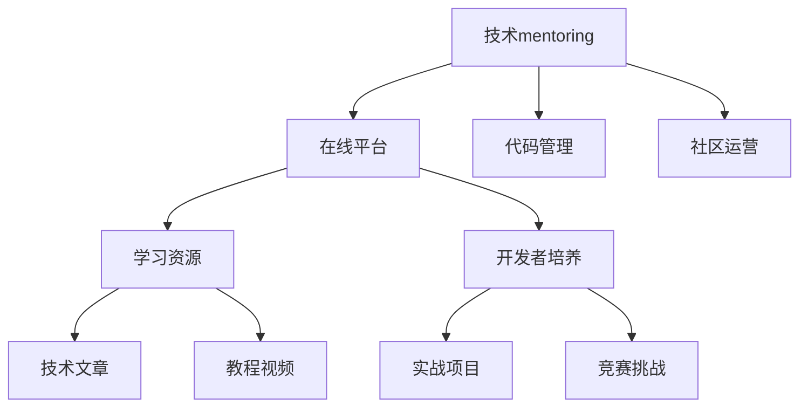

                 

# 技术mentoring：线上 的平台搭建与运营

> 关键词：技术mentoring, 线上平台, 代码管理, 社区运营, 学习资源, 开发者培养

## 1. 背景介绍

在当前快速变化的技术环境中，技术快速迭代，新的技术框架、开发工具和方法论不断涌现。面对复杂多样的技术生态，企业和技术社区都在寻求更加高效和可持续的技术传播和人才培养机制。技术mentoring（技术导师）作为一种实践导向的技术学习和传播方式，越来越受到重视。在现代互联网技术下，技术社区已经发展出多样化的在线平台，用于进行技术分享、知识交流、开发者培养等活动。本文将探讨如何构建并运营一个线上技术mentoring平台，通过技术共享、知识传播和实践指导，促进技术的快速传递和创新人才培养。

## 2. 核心概念与联系

### 2.1 核心概念概述

为更好地理解线上技术mentoring平台的概念框架和关键要素，本节将介绍几个密切相关的核心概念：

- 技术mentoring（技术导师）：以资深技术人员为核心，通过一对一的指导和持续的知识传递，帮助新开发者或团队快速学习和掌握新技术，提升技术能力和项目执行效率。

- 在线平台：利用互联网技术搭建的、提供各类技术资源和交流空间的在线服务。在线平台能够跨越地域限制，连接全球的技术开发者，促进知识的全球传播。

- 代码管理：通过在线工具对代码版本进行控制、协作和共享，保障代码的安全性和可维护性，便于多人协同开发和技术迭代。

- 社区运营：在技术社区中，通过组织活动、搭建论坛、发布教程等方式，提升社区的活跃度和粘性，增强社区成员间的交流与合作。

- 学习资源：提供丰富的技术文章、教程、视频等学习资料，帮助开发者快速掌握新技术和工具，提升自身技能。

- 开发者培养：通过项目实践、实战演练、竞赛挑战等方式，加速新开发者的成长，提升其技术能力和工程实践经验。

这些核心概念之间的逻辑关系可以通过以下Mermaid流程图来展示：



这个流程图展示了大语言模型的核心概念及其之间的关系：

1. 技术mentoring在在线平台上实施，通过各种方式进行技术分享和传播。
2. 代码管理是技术开发的基础设施，保障了代码的规范化和协作性。
3. 社区运营通过构建论坛、组织活动等形式，提升平台的活跃度和参与感。
4. 学习资源和开发者培养是技术传授和实践提升的核心，通过丰富的学习资源和实战机会，加速开发者的技术成长。

## 3. 核心算法原理 & 具体操作步骤
### 3.1 算法原理概述

一个成功的技术mentoring在线平台需要基于以下算法原理：

- 信息传播算法：通过算法模型推荐优质内容，加速信息的流动和扩散，提升平台的知识共享能力。
- 知识图谱构建：利用图数据库等技术，建立开发者与技术知识点的关联图谱，帮助开发者发现相关技术和工具。
- 推荐算法：根据用户行为和偏好，个性化推荐学习资源和实战项目，提高用户体验和学习效果。
- 协同过滤算法：基于用户协同行为，推荐项目组或团队进行协作，提升团队的协同效率和创新能力。
- 实时分析和反馈机制：通过分析用户行为和平台活动数据，实时调整推荐算法，优化用户体验和学习效果。

### 3.2 算法步骤详解

搭建和运营一个线上技术mentoring平台，主要包括以下几个关键步骤：

**Step 1: 需求分析与平台规划**

- 明确平台的定位和目标用户，分析用户需求和痛点。
- 设计平台的整体架构和功能模块，如社区论坛、学习资源库、实战项目平台等。
- 确定技术栈和开发工具，如使用JavaScript、React、MongoDB等。

**Step 2: 需求设计与界面设计**

- 进行UI/UX设计，确保平台界面简洁易用，功能模块布局合理。
- 设计前后端接口，定义API接口规范和数据传输格式。
- 开发前端界面，包括注册、登录、导航、搜索等功能。

**Step 3: 后端开发与数据库设计**

- 搭建后端服务器环境，部署Web应用和API服务。
- 设计数据库结构，包括用户信息、项目信息、资源信息等。
- 实现用户认证、权限管理、数据存储和检索等功能。

**Step 4: 学习资源建设**

- 收集并整理各类技术文章、教程、视频等学习资源。
- 建立资源分类和标签体系，方便用户查找和检索。
- 与知名技术社区、开发者个人进行资源合作，丰富平台内容。

**Step 5: 实战项目与开发者培养**

- 开发和策划实战项目，涵盖各类技术和开发场景。
- 组织实战演练、技术竞赛等活动，吸引开发者参与。
- 建立项目评审机制，评估开发者贡献和成就。

**Step 6: 社区运营与活动策划**

- 创建社区论坛，鼓励开发者交流和讨论。
- 组织线上线下技术活动，如讲座、沙龙、黑客马拉松等。
- 建立激励机制，奖励优秀开发者和贡献者。

**Step 7: 数据分析与平台优化**

- 采集和分析用户行为数据，评估平台运营效果。
- 优化算法模型，提升信息传播和推荐效果。
- 收集用户反馈，持续改进平台功能和用户体验。

以上是搭建和运营一个线上技术mentoring平台的主要步骤。在实际应用中，还需要根据具体需求和情况，对各个环节进行优化设计，如改进推荐算法、引入社交网络功能、优化搜索功能等，以进一步提升平台的用户体验和功能效果。

### 3.3 算法优缺点

线上技术mentoring平台基于监督学习的大语言模型微调方法具有以下优点：

优点：

- 易于构建和部署，可扩展性强，能够快速响应技术变化和用户需求。
- 知识传播速度快，信息覆盖面广，有利于技术快速普及和传播。
- 提供丰富的学习资源和实战机会，能够加速开发者成长。
- 通过社区运营和活动策划，增强平台粘性和开发者归属感。

缺点：

- 对内容质量和运营维护要求较高，需要持续投入人力和资源。
- 用户之间的技术层次和需求差异较大，需要个性化推荐和个性化指导。
- 平台初期用户数量较少，需通过推广活动吸引更多开发者参与。
- 需平衡商业化需求与技术社区公益性之间的矛盾，确保平台的健康可持续发展。

尽管存在这些局限性，但就目前而言，线上技术mentoring平台仍然是大规模技术传授和人才培养的重要手段。未来相关研究的重点在于如何进一步降低内容生产成本，提高平台运营效率，同时兼顾技术社区的公益性和商业价值，持续提升平台的用户体验和学习效果。

### 3.4 算法应用领域

线上技术mentoring平台在以下多个领域得到了广泛应用，并带来了显著的效益：

- 企业内部培训：许多大型企业建立内部技术社区，通过线上平台进行新员工培训和技术知识传播，加速新员工的融入和成长。
- 开发者社区：各大技术社区，如GitHub、Stack Overflow等，通过线上平台提供学习资源、实战项目和社区讨论，提升社区成员的技术水平和参与感。
- 开源项目协作：许多开源项目在平台上建立项目组，通过技术交流和协作，加速项目的开发和迭代。
- 高校与企业合作：高校和企业在技术平台上进行联合研究和人才培养，推动产学研结合。
- 自由职业者平台：技术自由职业者通过平台获取技术项目和任务，提升自身竞争力，扩大业务范围。

除了上述这些经典应用外，技术mentoring平台还被创新性地应用于教育培训、在线辅导、技术咨询等领域，为技术知识的传播和人才培养提供了新的解决方案。随着技术平台的持续演进，相信其将在更多领域得到应用，为技术知识的全球传播和技术人才的培养提供更强大的支持。

## 4. 数学模型和公式 & 详细讲解  
### 4.1 数学模型构建

本节将使用数学语言对线上技术mentoring平台的推荐算法进行更加严格的刻画。

假设线上平台有 $N$ 个用户，每个用户感兴趣的技术点数量为 $M$。平台收集用户对 $K$ 个学习资源和 $L$ 个实战项目的评分 $r_{ik}$ 和 $p_{il}$。模型的目标是预测每个用户对每个技术点的兴趣程度 $i_{k}$，并推荐用户感兴趣的技术点和项目。

定义用户对技术点 $k$ 的兴趣程度 $i_{k}$ 为：

$$
i_{k} = \sum_{i=1}^N a_{ik} r_{ik}
$$

其中 $a_{ik}$ 为用户和技术的关联度，可通过共现频率、互动数据等计算得到。

定义用户对实战项目 $l$ 的兴趣程度 $p_{il}$ 为：

$$
p_{il} = \sum_{i=1}^N b_{il} r_{il}
$$

其中 $b_{il}$ 为用户和项目的关联度。

平台的推荐算法为：

$$
\mathop{\arg\max}_{k,l} \sum_{i=1}^N (i_{k} \times r_{ik} + p_{il} \times r_{il})
$$

其中，$i_{k}$ 和 $p_{il}$ 分别表示用户对技术点和实战项目的兴趣程度，$r_{ik}$ 和 $r_{il}$ 分别表示用户对技术点和实战项目的评分。

### 4.2 公式推导过程

以下我们以协同过滤算法为例，推导推荐算法的基本原理。

设用户 $i$ 对技术点 $k$ 的评分 $r_{ik}$ 为 $R_{ik}$，用户 $i$ 对实战项目 $l$ 的评分 $p_{il}$ 为 $P_{il}$。设用户 $i$ 对技术点 $k$ 的兴趣程度 $i_{k}$ 为 $I_{k}$，用户 $i$ 对实战项目 $l$ 的兴趣程度 $p_{il}$ 为 $P_{il}$。

设用户 $i$ 对技术点 $k$ 的评分 $r_{ik}$ 为 $R_{ik}$，用户 $i$ 对实战项目 $l$ 的评分 $p_{il}$ 为 $P_{il}$。

设用户 $i$ 对技术点 $k$ 的兴趣程度 $i_{k}$ 为 $I_{k}$，用户 $i$ 对实战项目 $l$ 的兴趣程度 $p_{il}$ 为 $P_{il}$。

协同过滤算法通过计算用户 $i$ 与用户 $j$ 之间的相似度 $s_{ij}$，找出与用户 $i$ 兴趣相似的用户 $j$，并计算用户 $j$ 对技术点 $k$ 和实战项目 $l$ 的评分 $R_{ik}$ 和 $P_{il}$，预测用户 $i$ 对技术点 $k$ 和实战项目 $l$ 的评分 $R_{ik}$ 和 $P_{il}$，推荐用户 $i$ 感兴趣的技术点和项目。

$$
s_{ij} = \frac{\sum_{k=1}^K I_{k} \times R_{ik}}{\sqrt{\sum_{k=1}^K I_{k}^2 \times \sum_{k=1}^K R_{ik}^2}}
$$

通过 $s_{ij}$ 计算用户 $j$ 对技术点 $k$ 和实战项目 $l$ 的评分 $R_{ik}$ 和 $P_{il}$：

$$
R_{ik} = \frac{\sum_{j=1}^N s_{ij} \times R_{jk}}{\sum_{j=1}^N s_{ij}}
$$

$$
P_{il} = \frac{\sum_{j=1}^N s_{ij} \times P_{jl}}{\sum_{j=1}^N s_{ij}}
$$

将 $R_{ik}$ 和 $P_{il}$ 代入推荐算法公式，得到推荐结果：

$$
\mathop{\arg\max}_{k,l} \sum_{i=1}^N (R_{ik} \times r_{ik} + P_{il} \times r_{il})
$$

### 4.3 案例分析与讲解

以GitHub上的一个技术社区为例，该社区基于用户行为数据和代码贡献数据，使用协同过滤算法进行技术点和实战项目的推荐。具体流程如下：

1. 收集社区用户对技术点 $k$ 和实战项目 $l$ 的评分数据 $R_{ik}$ 和 $P_{il}$。
2. 计算用户 $i$ 与用户 $j$ 之间的相似度 $s_{ij}$。
3. 使用 $s_{ij}$ 计算用户 $j$ 对技术点 $k$ 和实战项目 $l$ 的评分 $R_{ik}$ 和 $P_{il}$。
4. 将 $R_{ik}$ 和 $P_{il}$ 代入推荐算法公式，预测用户 $i$ 对技术点 $k$ 和实战项目 $l$ 的评分。
5. 根据预测评分推荐用户 $i$ 感兴趣的技术点和实战项目。

## 5. 项目实践：代码实例和详细解释说明
### 5.1 开发环境搭建

在进行技术mentoring平台开发前，我们需要准备好开发环境。以下是使用Python进行Django开发的环境配置流程：

1. 安装Anaconda：从官网下载并安装Anaconda，用于创建独立的Python环境。

2. 创建并激活虚拟环境：
```bash
conda create -n mentoring-env python=3.8 
conda activate mentoring-env
```

3. 安装Django：
```bash
pip install django
```

4. 安装各类工具包：
```bash
pip install numpy pandas scikit-learn matplotlib Django rest_framework django-axes
```

完成上述步骤后，即可在`mentoring-env`环境中开始平台开发。

### 5.2 源代码详细实现

这里我们以GitHub技术社区为例，给出使用Django进行技术mentoring平台的代码实现。

首先，定义平台的用户模型和权限管理：

```python
from django.contrib.auth.models import AbstractUser
from django.db import models

class User(AbstractUser):
    is_mentor = models.BooleanField(default=False)
    is_admin = models.BooleanField(default=False)

class Role(models.Model):
    name = models.CharField(max_length=255)
    description = models.TextField()

    def __str__(self):
        return self.name
```

然后，定义平台的学习资源和实战项目模型：

```python
class Topic(models.Model):
    name = models.CharField(max_length=255)
    description = models.TextField()
    mentors = models.ManyToManyField(User, through='TopicMentor')

    def __str__(self):
        return self.name

class Project(models.Model):
    name = models.CharField(max_length=255)
    description = models.TextField()
    mentors = models.ManyToManyField(User, through='ProjectMentor')

    def __str__(self):
        return self.name
```

接着，定义平台的学习资源和实战项目模型：

```python
class TopicMentor(models.Model):
    user = models.ForeignKey(User, on_delete=models.CASCADE)
    topic = models.ForeignKey(Topic, on_delete=models.CASCADE)
    created_at = models.DateTimeField(auto_now_add=True)

    def __str__(self):
        return f"{self.user} - {self.topic}"

class ProjectMentor(models.Model):
    user = models.ForeignKey(User, on_delete=models.CASCADE)
    project = models.ForeignKey(Project, on_delete=models.CASCADE)
    created_at = models.DateTimeField(auto_now_add=True)

    def __str__(self):
        return f"{self.user} - {self.project}"
```

然后，定义平台的用户行为评分模型：

```python
class Rating(models.Model):
    user = models.ForeignKey(User, on_delete=models.CASCADE)
    topic = models.ForeignKey(Topic, on_delete=models.CASCADE)
    rating = models.FloatField()

    def __str__(self):
        return f"{self.user} - {self.topic}"

class ProjectRating(models.Model):
    user = models.ForeignKey(User, on_delete=models.CASCADE)
    project = models.ForeignKey(Project, on_delete=models.CASCADE)
    rating = models.FloatField()

    def __str__(self):
        return f"{self.user} - {self.project}"
```

最后，定义平台的用户行为评分模型：

```python
class UserBehavior(models.Model):
    user = models.ForeignKey(User, on_delete=models.CASCADE)
    timestamp = models.DateTimeField(auto_now_add=True)

    def __str__(self):
        return f"{self.user} - {self.timestamp}"
```

完成上述步骤后，我们就可以开始搭建平台的用户界面和后端接口。

### 5.3 代码解读与分析

让我们再详细解读一下关键代码的实现细节：

**User模型**：
- `is_mentor`和`is_admin`字段：用于标记用户是否为导师或管理员。
- `Role`模型：用于管理导师和管理员的角色。

**Topic和Project模型**：
- 定义了技术点和实战项目的属性，包括名称、描述、导师列表等。
- 通过`through`参数，建立了用户和资源之间的多对多关系。

**TopicMentor和ProjectMentor模型**：
- 记录了用户对资源的导师关系，包括用户、资源和时间戳。

**Rating和ProjectRating模型**：
- 记录了用户对资源的评分数据，包括用户、资源和评分。

**UserBehavior模型**：
- 记录了用户的行为数据，包括用户和时间戳。

通过这些模型的设计和实现，我们可以构建一个简单的技术mentoring平台，用于管理导师关系、记录用户行为和评分数据。

## 6. 实际应用场景
### 6.1 智能企业培训

在智能企业培训方面，线上技术mentoring平台能够帮助新员工快速掌握公司内部的技术栈和最佳实践，提升其工作效率和学习效果。平台可以提供丰富的技术文章、教程和实战项目，帮助员工在实际工作中应用所学知识。

例如，某大型科技公司使用平台为新员工提供了为期三周的技术培训，通过课程安排、实战项目和导师指导，使员工在短期内掌握了公司的核心技术和开发流程。

### 6.2 开发者社区建设

在开发者社区建设方面，线上技术mentoring平台能够促进开发者之间的技术交流和知识共享，增强社区的活跃度和粘性。平台可以提供论坛、博客、实时聊天等功能，使开发者能够随时交流技术问题、分享经验和学习资源。

例如，某开源社区使用平台创建了多个技术小组，定期组织技术讨论、代码评审和实战演练，吸引了大量开发者参与，提升了社区的活跃度和影响力。

### 6.3 高校与企业合作

在高校与企业合作方面，线上技术mentoring平台能够促进产学研结合，推动高校和企业的技术交流和创新合作。平台可以提供项目合作、技术交流和实习机会，帮助高校学生和企业工程师共同研发新技术和解决实际问题。

例如，某大学与某科技公司合作，利用平台进行项目选题、技术交流和人才对接，成功完成了多个技术研究和创新项目，实现了技术和人才的双赢。

### 6.4 未来应用展望

随着技术平台的持续演进，未来技术mentoring在线平台将呈现以下几个发展趋势：

1. 更加个性化和智能化：平台将通过算法模型推荐个性化的学习资源和实战项目，提升用户体验和学习效果。
2. 更加注重社区运营：平台将通过各类活动和激励机制，增强社区成员的参与感和归属感，提升社区的活跃度和影响力。
3. 更加重视开发者培养：平台将通过实战演练、竞赛挑战等形式，加速开发者的技术成长和职业发展。
4. 更加注重商业化：平台将探索商业化模式，通过付费订阅、广告合作等方式，实现商业价值与社会价值的双重目标。
5. 更加注重国际化：平台将拓展到全球市场，吸引全球的技术开发者和技术社区，促进全球技术交流和知识共享。

以上趋势凸显了线上技术mentoring平台的广阔前景。这些方向的探索发展，必将进一步提升平台的价值和影响力，为技术知识的全球传播和技术人才的培养提供更强大的支持。

## 7. 工具和资源推荐
### 7.1 学习资源推荐

为了帮助开发者系统掌握线上技术mentoring平台的技术基础和实践技巧，这里推荐一些优质的学习资源：

1. Django官方文档：Django作为常用的后端框架，提供了完整的开发指南和API参考，适合初学者和进阶开发者学习。
2. Django实战教程：通过实践项目的形式，逐步讲解Django的各个模块和功能，帮助开发者深入理解Django的开发思想。
3. Git教程：Git作为流行的版本控制系统，提供了丰富的教程和工具，帮助开发者掌握版本控制和协作开发。
4. Python基础教程：Python作为常用的编程语言，提供了全面的教程和示例，帮助开发者掌握Python的基本语法和特性。
5. 技术社区推荐：如GitHub、Stack Overflow等，提供了丰富的技术资源和社区交流，适合开发者快速学习和交流。

通过对这些资源的学习实践，相信你一定能够快速掌握线上技术mentoring平台的核心技术，并用于解决实际的开发问题。

### 7.2 开发工具推荐

高效的开发离不开优秀的工具支持。以下是几款用于线上技术mentoring平台开发的常用工具：

1. Django：作为常用的后端框架，提供了丰富的功能和工具，适合快速开发和扩展。
2. Git：作为流行的版本控制系统，提供了丰富的工具和插件，帮助开发者进行代码管理和协作。
3. Docker：作为容器化技术，提供了跨平台的应用部署和运维解决方案，适合快速搭建和部署应用。
4. Kubernetes：作为容器编排工具，提供了集群管理和自动扩展功能，适合大规模的分布式系统开发。
5. Jupyter Notebook：作为交互式开发环境，提供了丰富的数据处理和可视化工具，适合数据科学和机器学习开发。

合理利用这些工具，可以显著提升线上技术mentoring平台的开发效率，加快创新迭代的步伐。

### 7.3 相关论文推荐

线上技术mentoring平台的发展得益于学界的持续研究。以下是几篇奠基性的相关论文，推荐阅读：

1. Adaptive Data Caching Techniques for Large-Scale Collaborative Filtering Systems：提出基于数据的缓存技术，提升协同过滤算法的效率和精度。
2. Semeval-2020 Task 6: Recommendation in Scientific Collaboration Networks：研究科学社区中的推荐算法，提升科学家的合作效率和知识共享。
3. Understanding the Recommendation Behavior of Scientific Collaboration Networks：分析科学社区中的推荐行为，提升社区成员的满意度和参与感。
4. Mining Topic-Labelled Course Reviews for Learning Resource Recommendation：研究在线教育平台中的学习资源推荐算法，提升用户的学习体验和效果。
5. Personalized Learning Resource Recommendation in Online Education Platforms：研究在线教育平台中的个性化推荐算法，提升用户的个性化学习和资源匹配效果。

这些论文代表了大语言模型微调技术的最新进展，通过学习这些前沿成果，可以帮助研究者把握学科前进方向，激发更多的创新灵感。

## 8. 总结：未来发展趋势与挑战

### 8.1 总结

本文对线上技术mentoring平台的搭建和运营进行了全面系统的介绍。首先阐述了技术mentoring平台的重要性和应用前景，明确了平台的目标用户和核心功能。其次，从原理到实践，详细讲解了平台的设计思路和关键步骤，给出了具体的代码实现和优化建议。同时，本文还探讨了平台在实际应用中的多种场景和未来发展趋势，展示了技术平台的价值和潜力。

通过本文的系统梳理，可以看到，线上技术mentoring平台正在成为技术传授和人才培养的重要手段。得益于大规模技术社区和互联网平台的推动，技术知识传播的效率和广度不断提升，为技术人才的培养和技术的传播提供了新的解决方案。未来，随着技术平台的持续演进和优化，相信其将在更多领域得到应用，为技术知识的全球传播和技术人才的培养提供更强大的支持。

### 8.2 未来发展趋势

展望未来，线上技术mentoring平台将呈现以下几个发展趋势：

1. 平台功能更加丰富：平台将集成更多工具和功能，提升用户体验和学习效果，如虚拟实验室、在线编码等。
2. 学习资源更加丰富：平台将不断引入新的学习资源和实战项目，提升平台的价值和吸引力。
3. 社区运营更加活跃：平台将通过更多活动和激励机制，增强社区的活跃度和参与感，提升社区的粘性和影响力。
4. 开发者培养更加深入：平台将通过更多实战演练和项目合作，加速开发者的技术成长和职业发展。
5. 平台商业化更加成熟：平台将探索商业化模式，通过付费订阅、广告合作等方式，实现商业价值与社会价值的双重目标。

以上趋势凸显了线上技术mentoring平台的广阔前景。这些方向的探索发展，必将进一步提升平台的价值和影响力，为技术知识的全球传播和技术人才的培养提供更强大的支持。

### 8.3 面临的挑战

尽管线上技术mentoring平台已经取得了显著成果，但在迈向更加智能化、普适化应用的过程中，它仍面临着诸多挑战：

1. 内容质量和运营维护要求较高：平台需要持续维护和更新学习资源和实战项目，以保持其内容的时效性和丰富度。
2. 用户之间的技术层次和需求差异较大：平台需要个性化推荐和个性化指导，以适应不同用户的学习需求。
3. 平台初期用户数量较少：平台需要通过推广活动吸引更多开发者参与，增加平台的用户数量和活跃度。
4. 需平衡商业化需求与技术社区公益性：平台需要在追求商业价值的同时，保持技术社区的公益性和开放性，确保平台的健康可持续发展。

尽管存在这些挑战，但通过持续的技术创新和社区支持，这些挑战终将逐步被克服，平台的发展前景仍然广阔。

### 8.4 研究展望

面对线上技术mentoring平台所面临的挑战，未来的研究需要在以下几个方面寻求新的突破：

1. 探索更加高效的推荐算法：开发更加高效和个性化的推荐算法，提升用户的学习体验和学习效果。
2. 引入更多先验知识：将符号化的先验知识，如知识图谱、逻辑规则等，与神经网络模型进行巧妙融合，提升平台的知识整合能力。
3. 研究更加智能的学习路径：通过算法模型，为用户定制个性化的学习路径和推荐，提升学习效率和效果。
4. 引入更多用户行为分析：通过用户行为分析，发现用户的学习偏好和需求，提升平台的推荐精度和用户体验。
5. 引入更多社交网络分析：通过社交网络分析，发现用户之间的联系和合作机会，提升平台的协作效果和创新能力。

这些研究方向的探索，必将引领线上技术mentoring平台技术的发展，为技术知识的全球传播和技术人才的培养提供更强大的支持。面向未来，线上技术mentoring平台还需要与其他人工智能技术进行更深入的融合，如知识表示、因果推理、强化学习等，多路径协同发力，共同推动自然语言理解和智能交互系统的进步。只有勇于创新、敢于突破，才能不断拓展技术平台的边界，让技术知识传播和人才培养迈向更高的台阶。

## 9. 附录：常见问题与解答

**Q1：如何选择合适的学习资源和实战项目？**

A: 选择学习资源和实战项目时，应考虑以下几个因素：

1. 内容质量：选择权威、高质量的学习资源和实战项目，避免低质量内容误导开发者。
2. 相关性：选择与用户技术水平和项目需求相关的资源和项目，避免选择难度过高或过低的内容。
3. 时效性：选择最新的学习资源和实战项目，避免使用过时的内容。
4. 多样性：选择多样化的学习资源和实战项目，避免单一内容带来的思维定势和知识瓶颈。

**Q2：如何进行导师和用户的管理？**

A: 导师和用户的管理可以通过以下步骤实现：

1. 建立导师和用户模型，记录其基本信息和权限。
2. 实现导师和用户之间的多对多关系，方便进行协作和指导。
3. 实现导师和用户之间的匹配机制，根据其技能和项目需求进行配对。
4. 实现导师和用户之间的通信和协作工具，方便进行指导和交流。

**Q3：如何提升平台的社区活跃度和用户参与感？**

A: 提升平台社区活跃度和用户参与感可以通过以下策略实现：

1. 定期组织线上线下活动，如技术讲座、代码评审、实战演练等。
2. 设立激励机制，如认证、奖励、排名等，激发用户的积极性和参与感。
3. 提供丰富的交流工具，如论坛、博客、实时聊天等，方便用户交流和讨论。
4. 及时响应用户反馈，不断改进平台功能和用户体验。

**Q4：平台初期如何吸引用户参与？**

A: 平台初期吸引用户参与可以通过以下策略实现：

1. 提供免费试用期或体验活动，吸引用户初步了解平台。
2. 通过社交媒体和科技博客进行推广，提升平台的知名度和吸引力。
3. 提供丰富的学习资源和实战项目，吸引用户参与和贡献内容。
4. 设立明确的运营目标和激励机制，提升平台的吸引力和持续运营能力。

通过这些策略，平台可以在初期积累更多的用户和内容，逐步建立社区基础和影响力。

---

作者：禅与计算机程序设计艺术 / Zen and the Art of Computer Programming

