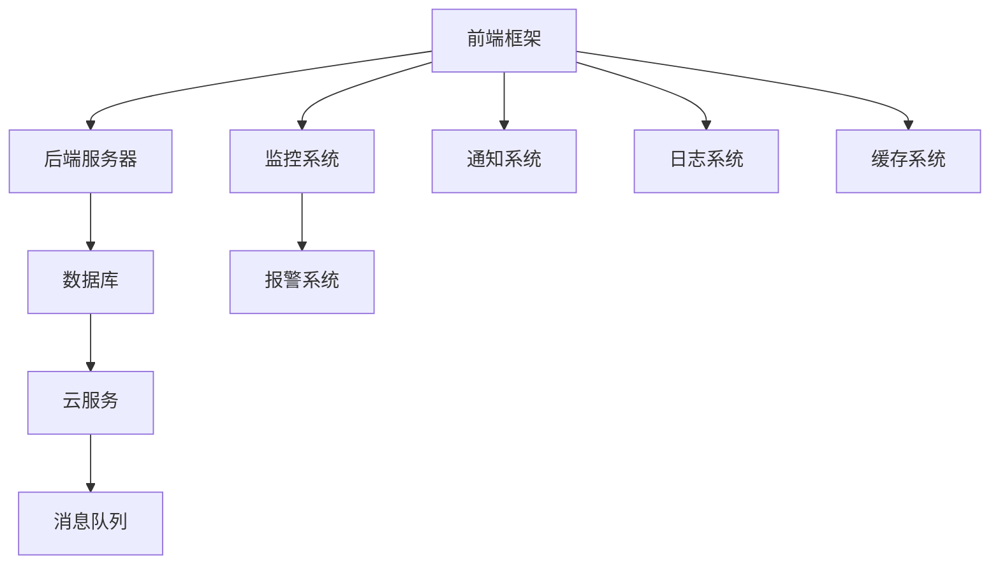

                 

# 技术mentoring：线上平台的搭建与运营

> 关键词：技术mentoring, 线上平台, 开发环境搭建, 源代码实现, 工具和资源推荐, 未来发展趋势与挑战

## 1. 背景介绍

### 1.1 问题由来
随着信息技术的飞速发展，线上教学、远程办公、在线咨询等线上业务需求日益增长。技术mentoring作为提升人才技能的重要手段，也逐渐转移到线上。相比传统的线下mentoring，线上平台具有资源丰富、灵活便捷、成本低廉等优势，能够更广泛地覆盖人群，提供更加持续的学习机会。但同时，线上平台的搭建与运营也面临诸多挑战，如数据管理、网络安全、用户体验、运营维护等。本文旨在从技术角度出发，详细剖析线上技术mentoring平台的搭建与运营，为相关开发者提供全面指导。

### 1.2 问题核心关键点
本文聚焦于基于技术的线上mentoring平台的搭建与运营，强调通过技术手段实现高质量、高效益的线上学习与交流。具体来说，主要包括以下几个核心关键点：
- 选择合适的开发框架和工具。
- 设计高效的数据管理和安全策略。
- 实现互动式的学习与交流功能。
- 保障平台的稳定性和可扩展性。
- 进行有效的用户运营和维护。

通过系统地介绍这些关键点，旨在为技术mentoring平台的设计与实现提供清晰的路线图和实践方案。

## 2. 核心概念与联系

### 2.1 核心概念概述
线上技术mentoring平台是一个集成多种技术手段，为参与者提供学习、互动、评估的在线环境。其主要组成部分包括：

- **前端框架**：负责用户界面设计，提供用户交互体验，如React、Vue、Angular等。
- **后端服务器**：处理用户请求，提供API接口服务，如Node.js、Django、Flask等。
- **数据库**：存储用户数据、课程数据、互动数据等，如MySQL、MongoDB、PostgreSQL等。
- **云服务**：提供计算、存储、网络等服务，如AWS、Azure、Google Cloud等。
- **消息队列**：处理实时消息、推送通知等，如RabbitMQ、Kafka、Redis等。
- **监控系统**：实时监控平台运行状态，进行错误预警，如Prometheus、Grafana、ELK Stack等。

这些核心组件通过合理的设计和集成，共同构建起一个高效、稳定、安全的线上mentoring平台。

### 2.2 核心概念原理和架构的 Mermaid 流程图(Mermaid 流程节点中不要有括号、逗号等特殊字符)


此流程图展示了线上技术mentoring平台的基本架构，其中各组件间通过网络协议和API接口进行交互。

## 3. 核心算法原理 & 具体操作步骤

### 3.1 算法原理概述
线上技术mentoring平台的搭建与运营，主要依赖于软件工程原理，特别是Web应用开发、数据库管理、网络安全等方面的知识。具体来说，包括以下几个关键算法原理：

- **RESTful API设计**：采用REST架构风格，定义规范的API接口，确保数据交互的安全和高效。
- **事件驱动架构**：通过消息队列和异步任务，实现高效的数据处理和分布式系统管理。
- **缓存机制**：使用缓存技术，如Redis、Memcached等，提高数据访问速度，降低数据库压力。
- **负载均衡**：通过负载均衡技术，如Nginx、HAProxy等，保障系统的稳定性和可扩展性。
- **数据加密与访问控制**：采用SSL/TLS加密传输数据，实现严格的访问控制，保护用户隐私。

### 3.2 算法步骤详解

#### 3.2.1 选择合适的开发框架和工具

首先，需要根据项目需求选择合适的开发框架和工具：

- **前端框架**：选择React或Vue，实现高性能、响应式界面。
- **后端框架**：选择Node.js或Django，实现高效、可扩展的服务器端逻辑。
- **数据库**：选择MySQL或MongoDB，根据数据结构选择最合适的数据库。
- **云服务**：选择AWS或Google Cloud，根据业务需求选择合适的云服务。

#### 3.2.2 设计高效的数据管理和安全策略

数据管理和安全是线上平台的核心，需要采取以下策略：

- **数据冗余与备份**：采用数据库集群和数据备份策略，确保数据的安全性和可靠性。
- **数据加密与传输安全**：使用SSL/TLS协议，加密数据传输，保障数据隐私。
- **访问控制与权限管理**：采用OAuth2.0或JWT等认证机制，实现严格的权限管理。

#### 3.2.3 实现互动式的学习与交流功能

互动式的学习与交流功能是线上平台的核心竞争力，主要包括以下几个方面：

- **实时互动**：使用WebSocket或长轮询技术，实现实时消息推送和互动。
- **协作编辑**：使用协作编辑工具，如Fathom Editor或Visual Studio Code Live Share，实现多人协作。
- **在线会议**：集成第三方视频会议工具，如Zoom或Jitsi，实现高质量的远程会议。

#### 3.2.4 保障平台的稳定性和可扩展性

稳定性和可扩展性是线上平台的基本要求，需要采取以下策略：

- **负载均衡与水平扩展**：采用Nginx或HAProxy实现负载均衡，根据流量动态扩展服务器资源。
- **自动伸缩与弹性计算**：使用云服务的弹性计算功能，自动调整计算资源，保障系统的高可用性。
- **故障容忍与容错机制**：采用微服务架构，实现服务之间的解耦和故障容忍。

### 3.3 算法优缺点

线上技术mentoring平台的设计和实现具有以下优点：

- **灵活性高**：可以根据业务需求进行灵活扩展和调整。
- **易于维护**：模块化的架构设计，便于维护和升级。
- **成本低廉**：云服务的使用降低了硬件和运维成本。

同时，也存在以下缺点：

- **技术复杂**：涉及多种技术栈和组件，技术难度较大。
- **安全性风险**：需要严格的数据管理和访问控制，避免安全漏洞。
- **用户体验问题**：需要在前端设计上投入更多精力，提升用户体验。

### 3.4 算法应用领域

线上技术mentoring平台的应用领域非常广泛，涵盖了教育、培训、咨询、医疗等多个行业。具体来说，包括：

- **在线教育**：提供在线课程、学习互动、作业评估等服务。
- **远程办公**：提供在线会议、协作编辑、文档管理等功能。
- **医疗咨询**：提供在线问诊、专家互动、病例分析等功能。
- **技术支持**：提供在线故障排查、技术支持、知识库检索等服务。

这些领域都需要高质量、高效益的线上平台来支持业务运营和发展。

## 4. 数学模型和公式 & 详细讲解 & 举例说明

### 4.1 数学模型构建

线上技术mentoring平台的数学模型主要涉及以下几个方面：

- **用户行为模型**：描述用户在线行为，如登录、学习、互动等，使用概率图模型或时间序列模型进行建模。
- **课程推荐模型**：根据用户历史行为和兴趣，推荐合适的课程，使用协同过滤或深度学习模型进行推荐。
- **交互分析模型**：分析用户间的互动行为，使用图神经网络或关联规则模型进行建模。

### 4.2 公式推导过程

#### 4.2.1 用户行为模型

用户行为模型可以使用隐马尔可夫模型(Hidden Markov Model, HMM)进行建模：

$$
P(X_t|X_{t-1},\lambda) = \sum_{y_t} P(X_t|y_t)P(y_t|X_{t-1},\lambda)
$$

其中，$X_t$表示用户在第$t$个时间点的行为，$y_t$表示用户的隐状态，$\lambda$表示模型参数。

#### 4.2.2 课程推荐模型

课程推荐模型可以使用协同过滤模型或深度学习模型进行建模：

$$
\hat{y}_i = f(x_i;\theta)
$$

其中，$x_i$表示用户$i$的历史行为数据，$y_i$表示用户$i$对课程的兴趣评分，$\theta$表示模型参数。

#### 4.2.3 交互分析模型

交互分析模型可以使用图神经网络(Graph Neural Network, GNN)进行建模：

$$
h_{v}^{(l+1)} = \mathcal{AGNN}(h_{v}^{(l)}, \mathcal{N}_v^{(l)}) + W^{(l+1)}h_v^{(l)}
$$

其中，$h_{v}^{(l+1)}$表示节点$v$在层$l+1$的表示，$\mathcal{AGNN}$表示图神经网络，$\mathcal{N}_v^{(l)}$表示节点$v$的邻居节点表示，$W^{(l+1)}$表示层$l+1$的权重矩阵。

### 4.3 案例分析与讲解

以在线教育平台为例，进行详细分析：

- **用户行为模型**：使用HMM模型，预测用户是否会继续学习某门课程。
- **课程推荐模型**：使用协同过滤模型，根据用户历史学习行为推荐相关课程。
- **交互分析模型**：使用GNN模型，分析用户间的互动关系，形成学习社区。

## 5. 项目实践：代码实例和详细解释说明

### 5.1 开发环境搭建

开发环境搭建是线上技术mentoring平台的关键步骤，具体如下：

- **服务器搭建**：选择合适的云服务，如AWS、Azure等，搭建Web服务器。
- **数据库搭建**：安装MySQL或MongoDB，配置数据库服务。
- **前端搭建**：使用React或Vue，搭建用户界面。
- **消息队列搭建**：使用RabbitMQ或Kafka，搭建消息队列服务。

### 5.2 源代码详细实现

以下是React前端框架搭建技术mentoring平台的示例代码：

```javascript
import React, { useState, useEffect } from 'react';
import axios from 'axios';

function MentoringPlatform() {
  const [courses, setCourses] = useState([]);
  const [selectedCourse, setSelectedCourse] = useState(null);
  const [user, setUser] = useState(null);
  
  useEffect(() => {
    axios.get('/api/courses')
      .then(response => {
        setCourses(response.data);
      })
      .catch(error => {
        console.error(error);
      });
  }, []);

  const handleSelectCourse = (course) => {
    setSelectedCourse(course);
  };

  const handleUserLogin = (username, password) => {
    axios.post('/api/login', { username, password })
      .then(response => {
        setUser(response.data);
      })
      .catch(error => {
        console.error(error);
      });
  };

  return (
    <div>
      <h1>Mentoring Platform</h1>
      <ul>
        {courses.map(course => (
          <li onClick={() => handleSelectCourse(course)}>
            {course.name}
          </li>
        ))}
      </ul>
      {selectedCourse && (
        <div>
          <h2>{selectedCourse.name}</h2>
          <p>{selectedCourse.description}</p>
          <button onClick={() => setSelectedCourse(null)}>Return to Courses</button>
        </div>
      )}
      {user && (
        <div>
          <h2>Welcome, {user.username}!</h2>
          <p>{user.role}</p>
          <button onClick={() => handleUserLogout()}>Logout</button>
        </div>
      )}
    </div>
  );
}

export default MentoringPlatform;
```

### 5.3 代码解读与分析

上述代码实现了React前端框架搭建技术mentoring平台的核心功能：

- **用户登录和注册**：通过axios发送POST请求，登录或注册用户信息。
- **课程选择**：从服务器获取课程列表，用户可以点击课程进入详情页面。
- **课程详情展示**：展示所选课程的详情，用户可以选择返回课程列表。
- **用户状态管理**：通过useState钩子管理用户登录状态和所选课程信息。

### 5.4 运行结果展示

运行上述代码，即可在浏览器中看到技术mentoring平台的界面。用户可以在课程列表中选择课程，查看课程详情，并进行登录或注销操作。

## 6. 实际应用场景

### 6.1 在线教育平台

在线教育平台是一个典型的线上技术mentoring应用场景，主要包括以下功能：

- **课程管理**：管理课程信息，包括课程内容、课程大纲、作业等。
- **学习互动**：支持讨论区、论坛、实时问答等功能，促进学生之间的交流。
- **作业评估**：自动评估学生作业，生成反馈报告，提升教学效果。
- **个性化推荐**：根据学生学习行为，推荐合适的课程和资料。

### 6.2 远程办公平台

远程办公平台主要解决远程协作和沟通的问题，包括以下功能：

- **视频会议**：支持高清视频会议，便于远程团队沟通。
- **协作编辑**：支持多人协作编辑文档，提升工作效率。
- **项目管理**：支持任务管理、进度跟踪、文档存储等功能，帮助团队高效协作。
- **文件分享**：支持文件上传、下载、共享，便于团队成员协作。

### 6.3 医疗咨询平台

医疗咨询平台主要解决远程医疗问题，包括以下功能：

- **在线问诊**：支持医生与患者在线问诊，提供实时医疗支持。
- **病例分析**：支持病例上传、分析、记录，提升医生诊疗效率。
- **专家互动**：支持专家咨询、远程会诊，提升医疗资源利用率。
- **健康管理**：支持健康数据记录、分析、预警，提升患者健康水平。

### 6.4 未来应用展望

随着技术的不断进步，线上技术mentoring平台将展现出更加广阔的应用前景：

- **虚拟现实(VR)技术**：通过VR技术，实现沉浸式学习体验，提升学习效果。
- **人工智能(AI)**：引入AI技术，实现智能推荐、自动化评估、情感分析等功能。
- **大数据分析**：通过大数据分析，提升课程推荐、学习路径优化、用户行为分析等。
- **区块链技术**：采用区块链技术，确保数据安全、透明、不可篡改。

## 7. 工具和资源推荐

### 7.1 学习资源推荐

为了帮助开发者系统掌握线上技术mentoring平台的设计与实现，推荐以下学习资源：

- **《Web应用开发》课程**：介绍Web应用开发的流程和工具，如React、Node.js、MongoDB等。
- **《数据分析与机器学习》课程**：介绍数据分析和机器学习的基本概念和算法，如协同过滤、图神经网络、深度学习等。
- **《云服务实战》课程**：介绍云服务的部署和管理，如AWS、Azure、Google Cloud等。
- **《数据安全与隐私保护》课程**：介绍数据安全与隐私保护的基本知识和实践，如SSL/TLS、OAuth2.0、数据加密等。
- **《DevOps实践》课程**：介绍DevOps实践的流程和工具，如CI/CD、监控告警、自动化部署等。

### 7.2 开发工具推荐

以下是线上技术mentoring平台常用的开发工具：

- **前端框架**：React、Vue、Angular等。
- **后端框架**：Node.js、Django、Flask等。
- **数据库**：MySQL、MongoDB、PostgreSQL等。
- **云服务**：AWS、Azure、Google Cloud等。
- **消息队列**：RabbitMQ、Kafka、Redis等。
- **监控系统**：Prometheus、Grafana、ELK Stack等。

### 7.3 相关论文推荐

为了深入理解线上技术mentoring平台的设计与实现，推荐以下相关论文：

- **《Web应用开发最佳实践》**：介绍Web应用开发的最佳实践和经典案例。
- **《数据驱动的Web应用》**：介绍如何通过数据驱动Web应用的设计和实现。
- **《云服务架构设计》**：介绍云服务的架构设计和最佳实践。
- **《数据安全与隐私保护》**：介绍数据安全与隐私保护的基本技术和实践。
- **《DevOps实践指南》**：介绍DevOps的流程和工具，提升开发效率和系统可靠性。

## 8. 总结：未来发展趋势与挑战

### 8.1 研究成果总结

本文从技术角度出发，全面剖析了线上技术mentoring平台的设计与实现。通过详细的算法原理和操作步骤，帮助开发者掌握平台搭建与运营的关键技术。主要研究成果包括：

- **开发框架和工具的选择**：选择合适的开发框架和工具，确保平台的高效性和可扩展性。
- **数据管理和安全策略的设计**：设计高效的数据管理和安全策略，确保数据的安全性和隐私性。
- **互动式的学习与交流功能的实现**：实现互动式的学习与交流功能，提升用户体验和互动效果。
- **平台稳定性和可扩展性的保障**：保障平台的稳定性和可扩展性，确保平台的高可用性和扩展性。

### 8.2 未来发展趋势

未来线上技术mentoring平台将呈现以下几个发展趋势：

- **智能化和自动化**：引入AI技术，实现智能化推荐、自动化评估、情感分析等功能，提升用户体验。
- **大规模数据处理**：采用大数据技术，提升数据处理和分析能力，支持海量用户和数据。
- **跨平台和跨设备支持**：支持多终端和多设备，提升平台的通用性和用户体验。
- **实时性和交互性**：提升平台的实时性和交互性，支持实时消息推送和互动。

### 8.3 面临的挑战

虽然线上技术mentoring平台具有巨大的发展潜力，但仍面临以下挑战：

- **技术复杂性**：涉及多种技术栈和组件，技术难度较大。
- **数据安全和隐私**：需要严格的数据管理和访问控制，避免安全漏洞和隐私泄露。
- **用户体验优化**：需要在前端设计上投入更多精力，提升用户体验。

### 8.4 研究展望

未来线上技术mentoring平台的研究展望包括：

- **用户行为分析**：通过用户行为数据，优化课程推荐和学习路径，提升用户满意度。
- **个性化推荐**：引入个性化推荐算法，提升推荐的精准度和用户黏性。
- **智能交互**：通过自然语言处理技术，实现智能问答、智能客服等功能。
- **数据治理**：制定数据治理规范，确保数据质量和数据安全。

总之，线上技术mentoring平台的搭建与运营是一个复杂而系统的工程，需要系统地规划和实施。本文旨在通过详细的算法原理和操作步骤，为开发者提供全面的技术指导，帮助其实现高质量、高效益的线上技术mentoring平台。

